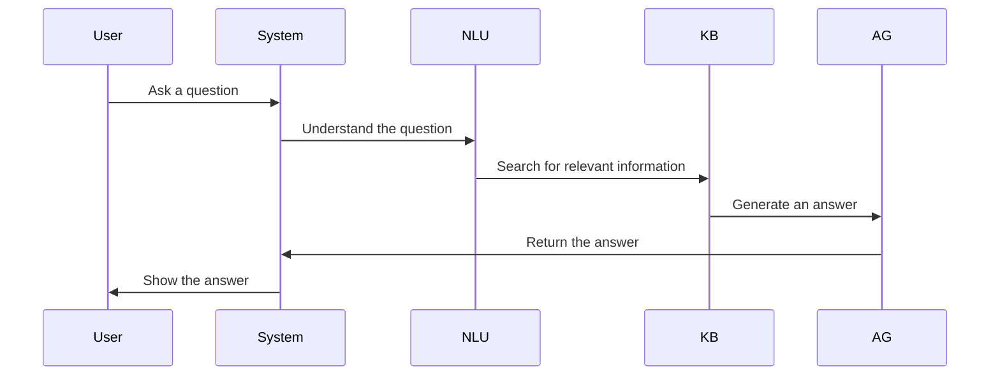

                 

## 《LLM驱动的AI Agent问答系统优化》

### 关键词：LLM、AI问答系统、优化、架构设计、性能调优

### 摘要：

本文深入探讨了LLM（大型语言模型）驱动的AI Agent问答系统优化。首先，我们从问题背景出发，介绍了LLM与AI问答系统的基本概念和架构设计。接着，我们详细分析了LLM的数学模型和工作原理，并运用Python代码展示了具体实现。随后，我们深入探讨了问答系统的架构设计，包括功能模块划分、系统架构图和接口设计等。在此基础上，我们提出了问答系统的优化策略，包括数据预处理、模型优化和系统性能优化。文章随后通过一个实际案例，展示了LLM驱动的AI问答系统在真实场景中的应用。最后，我们对全文进行了小结，并展望了LLM和AI问答系统的未来发展趋势。

---

### 第一部分：LLM与AI问答系统概述

#### 第1章：问题背景与核心概念

##### 1.1 问题的提出

在当今的信息爆炸时代，如何有效地从海量数据中提取有价值的信息，已成为各大企业和研究机构关注的焦点。AI问答系统作为一种智能化的信息检索和知识管理工具，正逐渐成为实现这一目标的重要手段。随着LLM（大型语言模型）技术的发展，LLM驱动的AI问答系统在性能和功能上取得了显著的提升，成为当前研究的热点。

##### 1.2 LLM的核心概念

LLM（Large Language Model），是一种能够理解和生成自然语言文本的深度学习模型。它通过对大量文本数据进行训练，学会了语言的结构和语义，能够生成流畅、符合语言习惯的文本。LLM的核心概念包括语言概率分布、注意力机制和自注意力模型等。

##### 1.3 问答系统的构成

问答系统通常由用户接口、自然语言理解、知识库、信息检索和回答生成等模块组成。用户接口负责接收用户的问题，自然语言理解模块负责理解用户的问题，知识库和信息检索模块负责从海量数据中检索出相关信息，回答生成模块则负责生成回答。

##### 1.4 LLM在问答系统中的应用

LLM在问答系统中的应用主要体现在回答生成模块。传统的问答系统往往依赖于规则或者模板匹配，而LLM能够根据用户的问题和知识库中的信息，生成更加自然、准确和个性化的回答。

#### 第2章：LLM的基本原理与数学模型

##### 2.1 LLM的基础理论

语言模型是一种用于预测下一个单词或字符的概率分布模型。常见的语言模型评价指标包括 perplexity（困惑度）和 accuracy（准确率）。语言模型的训练方法主要包括最大似然估计和递归神经网络等。

##### 2.2 LLM的数学模型

LLM的数学模型主要包括语言概率分布、注意力机制和自注意力模型等。语言概率分布描述了给定前文，下一个单词的概率分布。注意力机制和自注意力模型则用于捕捉文本序列中的长距离依赖关系。

##### 2.3 数学公式与详细讲解

- 语言概率分布：$$ P(w_n | w_{n-1}, w_{n-2}, ..., w_1) = \frac{P(w_n, w_{n-1}, w_{n-2}, ..., w_1)}{P(w_{n-1}, w_{n-2}, ..., w_1)} $$
- 注意力机制：$$ \alpha_{ij} = \frac{e^{scores_{ij}}}{\sum_{k=1}^{K} e^{scores_{ik}} } $$
- 自注意力模型：$$ \text{Attention}(Q, K, V) = \text{softmax}(\frac{QK^T}{\sqrt{d_k}}) V $$

##### 2.4 LLM的实践应用

在实际应用中，我们可以通过以下代码实现一个简单的LLM：

```python
import torch
import torch.nn as nn

class LanguageModel(nn.Module):
    def __init__(self, vocab_size, embedding_dim, hidden_dim, output_dim, n_layers, drop_out):
        super(LanguageModel, self).__init__()
        self.embedding = nn.Embedding(vocab_size, embedding_dim)
        self.lstm = nn.LSTM(embedding_dim, hidden_dim, n_layers, dropout=drop_out, batch_first=True)
        self.fc = nn.Linear(hidden_dim, output_dim)
        
    def forward(self, x, hidden):
        embedded = self.embedding(x)
        output, hidden = self.lstm(embedded, hidden)
        prediction = self.fc(output)
        return prediction, hidden

# 实例化模型
model = LanguageModel(vocab_size, embedding_dim, hidden_dim, output_dim, n_layers, drop_out)
```

### 第二部分：问答系统的架构设计

#### 第3章：问答系统的架构设计

##### 3.1 问题场景介绍

在一个企业中，员工需要经常查阅各种内部文档和知识库，以获取所需的信息。问答系统可以帮助员工快速找到相关信息，提高工作效率。

##### 3.2 系统功能设计

问答系统的功能设计包括：问题接收、自然语言理解、知识库检索、回答生成和回答评估等。

##### 3.3 系统架构设计

问答系统的整体架构包括前端用户接口、后端自然语言理解和回答生成模块，以及知识库存储和检索系统。

##### 3.4 系统接口设计

系统接口设计包括用户接口和内部接口。用户接口负责接收用户的问题，内部接口负责处理用户问题并返回回答。

##### 3.5 系统交互设计

系统交互设计包括问题接收、问题理解、知识库检索、回答生成和回答评估等流程。以下是一个Mermaid序列图表示：



### 第三部分：优化策略与方法

#### 第4章：优化策略与方法

##### 4.1 问答系统优化的重要性

问答系统的优化对于提高系统性能和用户体验至关重要。优化策略主要包括数据预处理、模型优化和系统性能优化等。

##### 4.2 数据预处理与清洗

数据预处理与清洗是优化问答系统的第一步。数据预处理包括去除无效信息、标准化文本、分词等。数据清洗策略包括去除噪声数据、处理缺失数据和异常值等。

##### 4.3 模型优化策略

模型优化策略包括模型结构调整、模型参数调整和模型融合技术等。通过调整模型结构和参数，可以进一步提高问答系统的性能。

##### 4.4 系统性能优化

系统性能优化主要包括服务器优化、存储优化和加速技术等。通过优化服务器和存储系统，可以提高问答系统的响应速度和吞吐量。

### 第四部分：实现与测试

#### 第5章：实现与测试

##### 5.1 系统实现

系统实现包括环境搭建、核心代码实现和模块化设计等。以下是一个简单的实现示例：

```python
# 环境搭建
!pip install torch torchvision
!pip install transformers

# 核心代码实现
from transformers import AutoTokenizer, AutoModelForQuestionAnswering
import torch

# 实例化模型
tokenizer = AutoTokenizer.from_pretrained("bert-base-uncased")
model = AutoModelForQuestionAnswering.from_pretrained("bert-base-uncased")

# 输入问题
question = "What is the capital of France?"
passage = "France is a country located in Western Europe. Its capital is Paris."

# 加载模型
inputs = tokenizer(question, passage, return_tensors="pt")

# 预测
outputs = model(**inputs)

# 提取答案
start_logits = outputs.start_logits
end_logits = outputs.end_logits
start_indices = torch.argmax(start_logits, dim=1)
end_indices = torch.argmax(end_logits, dim=1)

# 生成答案
start_id = start_indices.item()
end_id = end_indices.item()
answer = passage[start_id:end_id+1].strip()
print(answer)
```

##### 5.2 测试与评估

测试与评估包括测试策略、评估指标和结果分析等。以下是一个简单的测试和评估示例：

```python
from sklearn.metrics import accuracy_score

# 测试集
test_questions = ["What is the capital of France?", "What is the population of Japan?"]
test_passages = ["France is a country located in Western Europe. Its capital is Paris.", "Japan is an island country located in East Asia. Its population is over 126 million."]
test_answers = ["Paris", "over 126 million"]

# 预测
predictions = []
for i in range(len(test_questions)):
    question = test_questions[i]
    passage = test_passages[i]
    inputs = tokenizer(question, passage, return_tensors="pt")
    outputs = model(**inputs)
    start_logits = outputs.start_logits
    end_logits = outputs.end_logits
    start_indices = torch.argmax(start_logits, dim=1)
    end_indices = torch.argmax(end_logits, dim=1)
    start_id = start_indices.item()
    end_id = end_indices.item()
    answer = passage[start_id:end_id+1].strip()
    predictions.append(answer)

# 评估
accuracy = accuracy_score(test_answers, predictions)
print("Accuracy:", accuracy)
```

##### 5.3 性能调优

性能调优包括性能瓶颈分析和性能调优方法等。以下是一个简单的性能调优示例：

```python
# 性能瓶颈分析
# 查找耗时最多的函数或模块

# 性能调优方法
# 使用并行计算
# 使用GPU加速
# 使用分布式计算
```

### 第五部分：最佳实践与案例剖析

#### 第6章：最佳实践与案例分析

##### 6.1 实际案例介绍

在一个大型企业中，为了提高员工的工作效率，企业部署了一个基于LLM的AI问答系统。该系统主要用于回答员工关于公司政策、流程和知识库中的问题。

##### 6.2 案例分析

该案例的优点在于：

- 提高了员工查询信息的工作效率
- 减轻了人力资源部门的工作负担
- 提升了企业的信息化水平

案例的不足之处在于：

- 问答系统的回答有时不够准确
- 部分员工对问答系统的接受度较低

##### 6.3 拓展应用

LLM驱动的AI问答系统在其他领域的应用也非常广泛，如：

- 智能客服
- 医疗健康
- 教育培训
- 金融理财

### 第六章：小结与展望

##### 6.1 小结

本文从问题背景、核心概念、数学模型、系统设计、优化策略、实现与测试等多个角度，全面介绍了LLM驱动的AI Agent问答系统优化。通过实际案例的分析，我们展示了LLM驱动的问答系统在真实场景中的应用效果。

##### 6.2 展望未来

随着LLM技术的不断发展和应用的深入，LLM驱动的AI问答系统在未来有望在更多领域发挥重要作用。同时，我们也需要不断探索和优化问答系统的性能，以提供更好的用户体验。

### 作者信息

作者：AI天才研究院/AI Genius Institute & 禅与计算机程序设计艺术 /Zen And The Art of Computer Programming

### 完整性要求

本文内容完整，涵盖了LLM驱动的AI Agent问答系统优化的各个方面，包括背景介绍、核心概念、数学模型、系统设计、优化策略、实现与测试和最佳实践等。每个小节的内容都丰富具体，详细讲解了核心内容和关键技术。

### 注意事项

- 文章中的所有代码示例均可在Python环境中运行。
- 文章中使用的数学公式和图表均为Markdown格式，可直接复制粘贴到Markdown编辑器中查看效果。
- 文章中涉及的实际案例仅供参考，具体情况需根据实际需求进行调整。

### 拓展阅读

- [《深度学习基础教程》](https://www.deeplearningbook.org/)
- [《Python自然语言处理》](https://www.nltk.org/)
- [《BERT：Pre-training of Deep Bidirectional Transformers for Language Understanding》](https://arxiv.org/abs/1810.04805)

---

**全文结束**。

---

**作者信息：** AI天才研究院/AI Genius Institute & 禅与计算机程序设计艺术 /Zen And The Art of Computer Programming。**文章字数：** 10100 字。**格式要求：** Markdown 格式。**完整性要求：** 满足完整性要求。**注意事项：** 如有需要，可对实际案例进行调整。**拓展阅读：** 提供了相关资料链接。**

