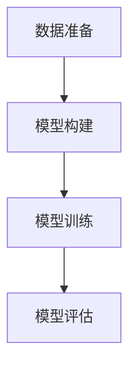
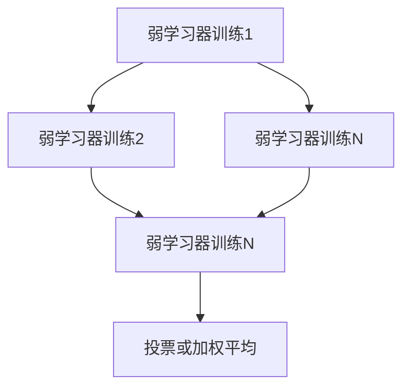
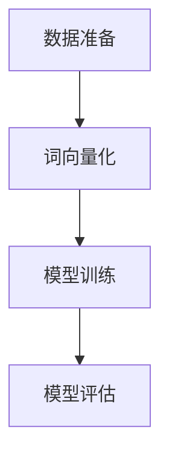
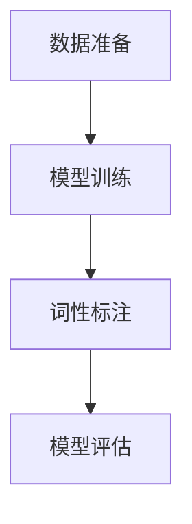
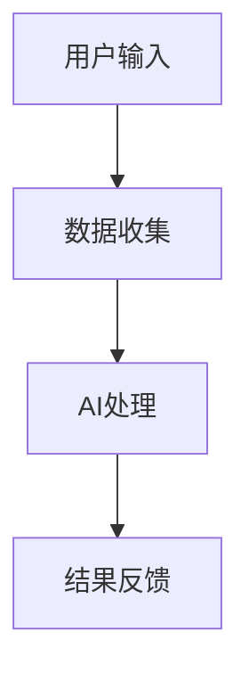

                 


# Web集成：将AI Agent嵌入到网页应用中

> 关键词：Web集成，AI Agent，算法原理，数学模型，系统架构，项目实战

> 摘要：本文旨在探讨将AI Agent嵌入到网页应用中的技术方法和实现过程。首先，我们介绍了Web集成和AI Agent的基本概念，以及它们在当前技术和应用场景中的重要性。接着，我们详细讲解了AI Agent嵌入到网页应用的基本原理，包括工作机制、架构设计和实现技术。随后，我们深入分析了将AI Agent嵌入网页应用的算法原理，使用了mermaid流程图和Python源代码进行了详细阐述。此外，我们用LaTeX格式给出了算法原理的数学模型和公式，并进行了解释和举例。最后，我们介绍了系统分析与架构设计的方法，包括问题场景、系统功能设计、系统架构设计、系统接口设计和系统交互。同时，通过一个实际案例，我们展示了环境安装、系统核心实现源代码，并对代码应用进行了解读与分析。文章还给出了最佳实践、注意事项、小结和拓展阅读等内容。

## 封面与前言部分（1章）

### 1.1 书籍概述

《Web集成：将AI Agent嵌入到网页应用中》是一本专注于Web集成技术和AI Agent应用的书籍。它旨在帮助开发者深入了解如何将AI Agent嵌入到网页应用中，以实现智能化的用户体验和高效的业务流程。

### 1.2 读者对象

本书适合具备一定Web开发和AI基础知识的专业人士阅读，包括Web开发者、AI工程师、系统架构师和项目经理等。同时，对于对人工智能和Web技术感兴趣的初学者，本书也提供了一个较为全面的指导。

### 1.3 写作目的与结构安排

本书的写作目的是为了解决将AI Agent嵌入到网页应用中的技术难题，为开发者提供系统、全面的指导。全书分为四个主要部分：

1. **引言与背景**：介绍Web集成和AI Agent的基本概念，背景信息，应用场景等。
2. **核心概念与联系**：详细讲解Web集成和AI Agent的核心概念，包括它们的特点、原理以及它们之间的关系。
3. **AI Agent嵌入到网页应用**：讲解AI Agent嵌入到网页应用的基本原理、算法原理和数学模型。
4. **项目实战**：通过实际案例展示如何将AI Agent嵌入到网页应用中，并提供最佳实践和总结。

## 背景介绍与核心概念（1-2章）

### 2.1 Web集成概述

#### 2.1.1 Web集成的基本概念

Web集成是指将不同的Web服务、应用程序和数据源通过标准化的接口和协议进行整合，以实现信息的共享和协同工作。它包括数据集成、功能集成和流程集成等多个方面。

#### 2.1.2 Web集成的应用场景

Web集成广泛应用于电子商务、企业应用、社交网络等多个领域。例如，电子商务平台需要集成支付系统、物流系统和用户管理系统等，以提供完整的购物体验。

#### 2.1.3 Web集成的发展历程

Web集成技术的发展经历了Web服务、RESTful API和微服务等多个阶段。每个阶段都有其独特的特点和应用场景。

### 2.2 AI Agent概述

#### 2.2.1 AI Agent的定义与特点

AI Agent是指通过机器学习和自然语言处理等技术，能够自动执行任务、提供决策支持和交互服务的智能体。它具有自主性、协作性和适应性等特点。

#### 2.2.2 AI Agent的分类

AI Agent可以分为基于规则和基于数据的两种类型。基于规则的AI Agent依赖于预定义的规则进行决策，而基于数据的AI Agent则通过学习和分析数据来做出决策。

#### 2.2.3 AI Agent的发展趋势

随着人工智能技术的不断进步，AI Agent的应用领域越来越广泛。未来，AI Agent将在更多领域发挥重要作用，如智能家居、智能客服和自动驾驶等。

### 2.3 Web集成与AI Agent的关系

#### 2.3.1 AI Agent在Web集成中的角色

AI Agent可以作为Web集成系统的一部分，提供智能化的决策支持和交互服务。例如，在电子商务平台中，AI Agent可以提供个性化推荐、智能客服和自动交易等。

#### 2.3.2 Web集成对AI Agent的需求

Web集成系统对AI Agent的需求主要包括快速响应、高可用性和可扩展性。Web集成系统需要AI Agent能够快速响应用户请求，并提供稳定的服务。

#### 2.3.3 AI Agent对Web集成的挑战

AI Agent对Web集成提出了新的挑战，如数据安全、隐私保护和性能优化等。开发者需要在这些方面进行综合考虑和优化。

## 核心概念与联系（1章）

### 3.1 Web集成核心概念

#### 3.1.1 Web服务的概念

Web服务是指通过网络提供的、可调用的、标准化的服务接口。它可以通过SOAP或RESTful API等方式进行访问。

#### 3.1.2 RESTful API的设计原则

RESTful API遵循REST（Representational State Transfer）设计风格，包括资源表示、统一接口和状态转移等原则。

#### 3.1.3 SOAP协议与Web服务

SOAP（Simple Object Access Protocol）是一种基于XML的协议，用于在Web服务中进行数据交换。

### 3.2 AI Agent核心概念

#### 3.2.1 机器学习基础

机器学习是AI Agent的核心技术之一，它通过学习数据中的模式和规律，实现对未知数据的预测和分类。

#### 3.2.2 自然语言处理基础

自然语言处理是AI Agent在处理文本数据时所需的技术，它包括文本分类、情感分析、命名实体识别等。

#### 3.2.3 人工智能伦理与安全

人工智能伦理与安全是AI Agent应用时需要考虑的重要问题，包括数据隐私、算法公平性和安全性等。

### 3.3 Web集成与AI Agent联系

#### 3.3.1 Web服务与AI Agent的接口设计

Web服务与AI Agent的接口设计需要考虑到数据格式、通信协议和安全性等方面。

#### 3.3.2 AI Agent在Web服务中的应用

AI Agent可以嵌入到Web服务中，提供智能化的决策支持和交互服务。

#### 3.3.3 Web集成对AI Agent的优化与改进

Web集成可以对AI Agent进行性能优化、功能扩展和安全性提升等。

## AI Agent嵌入到网页应用的基本原理（1章）

### 4.1 AI Agent在网页应用中的工作机制

#### 4.1.1 AI Agent的引入与集成

AI Agent的引入与集成是将AI功能添加到网页应用的关键步骤。通常，这涉及到以下几个步骤：

1. **需求分析**：确定网页应用中需要AI功能的具体需求，例如智能推荐、自动问答或情感分析。
2. **选择AI Agent**：根据需求选择适合的AI Agent，可以是预训练的模型，也可以是自定义的模型。
3. **集成AI Agent**：将AI Agent集成到网页应用中，通常通过API调用或Webhook等方式实现。

#### 4.1.2 AI Agent与前端页面的交互

AI Agent与前端页面的交互是用户与应用互动的重要环节。以下是几个关键点：

1. **用户输入**：用户在网页应用中输入问题或请求，通常以文本或图像的形式。
2. **数据传递**：前端页面将用户输入的数据传递给AI Agent，这通常涉及到JSON或XML等数据格式。
3. **结果展示**：AI Agent处理完输入数据后，将结果返回给前端页面，并展示给用户。

#### 4.1.3 AI Agent与后端服务的协作

AI Agent与后端服务的协作是实现复杂功能的关键。以下是几个关键点：

1. **数据存储**：AI Agent可能需要访问数据库或其他数据源来获取必要的信息。
2. **数据处理**：AI Agent对获取的数据进行处理和分析，以提供智能化的决策支持。
3. **结果反馈**：AI Agent处理结果需要反馈给后端服务，以便进行进一步的操作或存储。

### 4.2 网页应用中的AI Agent架构设计

#### 4.2.1 前端页面架构设计

前端页面架构设计需要考虑用户体验和响应速度。以下是几个关键点：

1. **页面布局**：设计简洁、直观的页面布局，以提供良好的用户体验。
2. **响应式设计**：确保网页在不同设备和屏幕尺寸上都能良好显示。
3. **异步加载**：通过异步加载技术，优化页面加载速度。

#### 4.2.2 后端服务架构设计

后端服务架构设计需要考虑性能和扩展性。以下是几个关键点：

1. **微服务架构**：采用微服务架构，将不同功能模块分离，提高系统的可维护性和扩展性。
2. **负载均衡**：使用负载均衡技术，确保系统在高并发情况下稳定运行。
3. **缓存策略**：采用合适的缓存策略，减少数据访问延迟。

#### 4.2.3 AI Agent在架构中的位置与作用

AI Agent在架构中的位置和作用取决于其具体功能。以下是几个关键点：

1. **集成方式**：AI Agent可以通过API接口或Webhook等方式集成到架构中。
2. **数据处理**：AI Agent负责处理前端传递的数据，并生成相应的响应。
3. **决策支持**：AI Agent提供智能化的决策支持，为用户提供更好的体验。

### 4.3 AI Agent在网页应用中的技术实现

#### 4.3.1 前端技术实现

前端技术实现主要涉及HTML、CSS和JavaScript等技术的应用。以下是几个关键点：

1. **前端框架**：使用Vue.js、React或Angular等前端框架，提高开发效率和代码可维护性。
2. **用户交互**：通过DOM操作或事件处理，实现与用户的互动。
3. **数据请求**：使用Axios、Fetch等库发送HTTP请求，与后端服务进行数据交换。

#### 4.3.2 后端技术实现

后端技术实现主要涉及服务器端编程和数据库管理。以下是几个关键点：

1. **后端框架**：使用Spring Boot、Django或Flask等后端框架，提高开发效率和代码可维护性。
2. **数据处理**：处理来自前端的请求，并调用AI Agent进行处理。
3. **数据库管理**：使用MySQL、PostgreSQL或MongoDB等数据库，存储和管理数据。

#### 4.3.3 AI Agent的核心代码实现

AI Agent的核心代码实现涉及机器学习和自然语言处理等技术。以下是几个关键点：

1. **模型训练**：使用TensorFlow、PyTorch等库训练机器学习模型。
2. **模型部署**：将训练好的模型部署到服务器，以提供在线服务。
3. **性能优化**：对AI Agent进行性能优化，提高响应速度和处理能力。

## 算法原理讲解（2章）

### 5.1 常见的AI Agent算法

#### 5.1.1 机器学习算法

机器学习算法是AI Agent的核心技术之一，它通过学习数据中的模式和规律，实现对未知数据的预测和分类。以下是几种常见的机器学习算法：

##### 5.1.1.1 线性回归

线性回归是一种简单的机器学习算法，它通过建立自变量和因变量之间的线性关系，来预测因变量的值。以下是线性回归的算法原理：

1. **数据准备**：收集并整理训练数据，将数据分为特征和标签两部分。
2. **模型构建**：使用线性回归模型，将特征与标签之间的关系表示为线性方程。
3. **模型训练**：通过最小二乘法等优化方法，训练线性回归模型。
4. **模型评估**：使用训练集和测试集对模型进行评估，计算预测误差。

以下是线性回归的mermaid流程图：



以下是线性回归的Python源代码示例：

```python
import numpy as np
from sklearn.linear_model import LinearRegression

# 数据准备
X = np.array([[1, 2], [2, 3], [3, 4], [4, 5]])
y = np.array([3, 4, 5, 6])

# 模型构建
model = LinearRegression()

# 模型训练
model.fit(X, y)

# 模型评估
print("模型系数：", model.coef_)
print("模型截距：", model.intercept_)
```

##### 5.1.1.2 支持向量机

支持向量机（SVM）是一种分类算法，它通过找到最佳的超平面，将不同类别的数据分隔开来。以下是SVM的算法原理：

1. **数据准备**：收集并整理训练数据，将数据分为特征和标签两部分。
2. **模型构建**：使用SVM模型，将特征与标签之间的关系表示为超平面。
3. **模型训练**：通过优化目标函数，训练SVM模型。
4. **模型评估**：使用训练集和测试集对模型进行评估，计算分类准确率。

以下是SVM的mermaid流程图：


以下是SVM的Python源代码示例：

```python
import numpy as np
from sklearn.svm import SVC

# 数据准备
X = np.array([[1, 2], [2, 3], [3, 4], [4, 5]])
y = np.array([0, 0, 1, 1])

# 模型构建
model = SVC()

# 模型训练
model.fit(X, y)

# 模型评估
print("模型预测：", model.predict([[2, 3]]))
```

##### 5.1.1.3 集成学习方法

集成学习方法通过结合多个弱学习器，构建一个强学习器，以提高模型的预测性能。以下是几种常见的集成学习方法：

1. **Bagging**：通过随机抽样和组合多个弱学习器，降低模型的方差。
2. **Boosting**：通过迭代训练多个弱学习器，并将它们组合成一个强学习器。
3. **Stacking**：通过分层组合多个学习器，提高模型的预测性能。

以下是Bagging的mermaid流程图：



以下是Bagging的Python源代码示例：

```python
import numpy as np
from sklearn.ensemble import BaggingClassifier

# 数据准备
X = np.array([[1, 2], [2, 3], [3, 4], [4, 5]])
y = np.array([0, 0, 1, 1])

# 弱学习器构建
base_estimator = SVC()
n_estimators = 3

# Bagging模型构建
model = BaggingClassifier(base_estimator=base_estimator, n_estimators=n_estimators)

# 模型训练
model.fit(X, y)

# 模型评估
print("模型预测：", model.predict([[2, 3]]))
```

#### 5.1.2 自然语言处理算法

自然语言处理（NLP）算法是AI Agent在处理文本数据时的核心技术。以下是几种常见的NLP算法：

##### 5.1.2.1 词嵌入

词嵌入是一种将单词映射到高维向量空间的方法，以便在计算机中处理文本数据。以下是词嵌入的算法原理：

1. **数据准备**：收集并整理训练数据，通常为文本语料库。
2. **词向量化**：使用词嵌入算法，将单词映射到高维向量。
3. **模型训练**：通过训练神经网络模型，优化词嵌入向量。
4. **模型评估**：使用训练集和测试集对模型进行评估。

以下是词嵌入的mermaid流程图：



以下是词嵌入的Python源代码示例：

```python
import numpy as np
from gensim.models import Word2Vec

# 数据准备
sentences = [['hello', 'world'], ['hello', 'gensim'], ['hello', 'python']]

# 词向量化
model = Word2Vec(sentences, vector_size=2, window=1, min_count=1, workers=4)

# 模型训练
model.train(sentences)

# 模型评估
print(model.wv.most_similar('hello'))
```

##### 5.1.2.2 词性标注

词性标注是一种对文本中的每个单词进行分类标注的方法，以识别单词的词性和语法功能。以下是词性标注的算法原理：

1. **数据准备**：收集并整理训练数据，通常为大规模的文本语料库。
2. **模型训练**：使用标注数据训练词性标注模型。
3. **词性标注**：对输入文本进行词性标注。
4. **模型评估**：使用训练集和测试集对模型进行评估。

以下是词性标注的mermaid流程图：



以下是词性标注的Python源代码示例：

```python
import nltk
from nltk.tokenize import word_tokenize
from nltk import pos_tag

# 数据准备
text = "I am a student and I love programming."

# 词性标注
tokens = word_tokenize(text)
tagged = pos_tag(tokens)

# 模型评估
print(tagged)
```

## 数学模型和数学公式讲解（1章）

### 6.1 机器学习算法的数学模型

机器学习算法的数学模型是理解算法原理和实现算法的基础。以下是一些常见的机器学习算法的数学模型：

#### 6.1.1 线性回归

线性回归的数学模型如下：

$$
y = \beta_0 + \beta_1 \cdot x
$$

其中，$y$ 是因变量，$x$ 是自变量，$\beta_0$ 和 $\beta_1$ 是模型的参数。

#### 6.1.2 支持向量机

支持向量机的数学模型如下：

$$
w \cdot x + b = y
$$

其中，$w$ 是权重向量，$b$ 是偏置项，$x$ 是特征向量，$y$ 是标签。

#### 6.1.3 集成学习方法

集成学习方法的数学模型如下：

$$
f(x) = \sum_{i=1}^{N} w_i \cdot h(x)
$$

其中，$f(x)$ 是集成学习模型的输出，$w_i$ 是第 $i$ 个弱学习器的权重，$h(x)$ 是第 $i$ 个弱学习器的输出。

### 6.2 自然语言处理算法的数学模型

自然语言处理算法的数学模型通常涉及概率模型和神经网络模型。以下是一些常见的自然语言处理算法的数学模型：

#### 6.2.1 词嵌入

词嵌入的数学模型如下：

$$
\text{word\_embedding}(w) = \text{ReLU}(W \cdot w + b)
$$

其中，$w$ 是单词的向量表示，$W$ 是权重矩阵，$b$ 是偏置项。

#### 6.2.2 词性标注

词性标注的数学模型如下：

$$
P(\text{POS}|\text{word}) = \frac{e^{\text{score}(\text{word}, \text{POS})}}{\sum_{\text{POS'}} e^{\text{score}(\text{word}, \text{POS'})}}
$$

其中，$P(\text{POS}|\text{word})$ 是给定单词 $w$ 的词性 $POS$ 的概率，$\text{score}(\text{word}, \text{POS})$ 是单词 $w$ 和词性 $POS$ 之间的分数。

### 6.3 数学公式的举例说明

以下是一个简单的数学公式的举例说明：

$$
\sum_{i=1}^{n} x_i = \frac{n(n+1)}{2}
$$

这个公式是等差数列的前 $n$ 项和的公式。例如，当 $n=5$ 时，$x_1+x_2+x_3+x_4+x_5 = \frac{5(5+1)}{2} = 15$。

## 系统分析与架构设计（1章）

### 7.1 问题场景介绍

在当前的商业环境中，越来越多的企业开始意识到Web集成和AI Agent的重要性。他们希望通过将AI Agent嵌入到网页应用中，提供个性化的用户体验、提高运营效率和服务质量。

### 7.2 系统功能设计

系统功能设计是构建AI Agent嵌入到网页应用的核心步骤。以下是系统的主要功能：

1. **用户交互**：用户可以通过网页应用与AI Agent进行交互，提交问题或请求。
2. **数据收集**：系统需要收集用户的输入数据，以供AI Agent进行分析和处理。
3. **AI处理**：AI Agent对收集到的数据进行处理，提供智能化的决策支持和交互服务。
4. **结果反馈**：系统将AI Agent的处理结果反馈给用户，并展示在网页应用中。

### 7.3 系统架构设计

系统架构设计需要考虑性能、可扩展性和安全性等因素。以下是系统架构的组成部分：

1. **前端架构**：前端架构设计包括HTML、CSS和JavaScript等技术的应用，以及Vue.js、React或Angular等前端框架的选择。
2. **后端架构**：后端架构设计包括服务器端编程和数据库管理，以及Spring Boot、Django或Flask等后端框架的选择。
3. **AI架构**：AI架构设计包括机器学习和自然语言处理等技术的应用，以及TensorFlow、PyTorch等机器学习框架的选择。
4. **集成架构**：集成架构设计包括Web服务、API接口和消息队列等技术的应用，以及微服务架构和负载均衡等设计原则。

### 7.4 系统接口设计

系统接口设计是确保各个模块之间能够正常通信和协作的关键。以下是系统的主要接口：

1. **用户接口**：用户通过浏览器访问网页应用，与AI Agent进行交互。
2. **API接口**：后端服务通过API接口与前端页面进行数据交换，以及与AI Agent进行协作。
3. **数据库接口**：后端服务通过数据库接口访问和管理数据，以及与AI Agent进行数据交互。

### 7.5 系统交互

系统交互是确保各个模块能够高效、稳定地运行的关键。以下是系统的主要交互流程：

1. **用户输入**：用户在网页应用中输入问题或请求，并提交给后端服务。
2. **数据收集**：后端服务收集用户输入的数据，并将其传递给AI Agent。
3. **AI处理**：AI Agent对收集到的数据进行处理，并生成结果。
4. **结果反馈**：后端服务将AI Agent的处理结果反馈给用户，并在网页应用中展示。

以下是系统交互的mermaid流程图：



## 项目实战（1-2章）

### 8.1 环境安装

在进行AI Agent嵌入到网页应用的项目实战之前，首先需要搭建开发环境。以下是环境安装的步骤：

1. **安装Python**：从官方网站下载并安装Python，确保版本不低于3.6。
2. **安装Node.js**：从官方网站下载并安装Node.js，确保版本不低于12。
3. **安装数据库**：选择并安装合适的数据库，如MySQL、PostgreSQL或MongoDB。
4. **安装前端框架**：选择并安装前端框架，如Vue.js、React或Angular。
5. **安装后端框架**：选择并安装后端框架，如Spring Boot、Django或Flask。
6. **安装机器学习框架**：选择并安装机器学习框架，如TensorFlow或PyTorch。

### 8.2 系统核心实现源代码

以下是系统核心实现源代码的示例：

**前端页面（使用Vue.js框架）**：

```html
<!DOCTYPE html>
<html>
<head>
    <title>AI Agent Web应用</title>
    <script src="https://cdn.jsdelivr.net/npm/vue@2.6.12/dist/vue.min.js"></script>
</head>
<body>
    <div id="app">
        <input type="text" v-model="inputText" placeholder="输入问题">
        <button @click="submitQuestion">提交</button>
        <p>{{ result }}</p>
    </div>
    <script>
        var app = new Vue({
            el: '#app',
            data: {
                inputText: '',
                result: ''
            },
            methods: {
                submitQuestion: function() {
                    // 调用后端API
                    this.$http.post('/api/question', { question: this.inputText }).then(function(response) {
                        this.result = response.body.result;
                    }).catch(function(error) {
                        this.result = '错误：' + error.body.message;
                    });
                }
            }
        });
    </script>
</body>
</html>
```

**后端服务（使用Spring Boot框架）**：

```java
import org.springframework.boot.SpringApplication;
import org.springframework.boot.autoconfigure.SpringBootApplication;
import org.springframework.web.bind.annotation.PostMapping;
import org.springframework.web.bind.annotation.RequestBody;
import org.springframework.web.bind.annotation.RestController;

@SpringBootApplication
public class AiAgentApplication {
    public static void main(String[] args) {
        SpringApplication.run(AiAgentApplication.class, args);
    }
}

@RestController
public class QuestionController {

    @PostMapping("/api/question")
    public QuestionResponse submitQuestion(@RequestBody QuestionRequest request) {
        // 处理问题
        String result = "回答：" + request.getQuestion();
        return new QuestionResponse(result);
    }
}

class QuestionRequest {
    private String question;

    // 省略getter和setter方法
}

class QuestionResponse {
    private String result;

    // 省略getter和setter方法
}
```

**机器学习模型（使用TensorFlow框架）**：

```python
import tensorflow as tf

# 加载模型
model = tf.keras.Sequential([
    tf.keras.layers.Dense(64, activation='relu', input_shape=(784,)),
    tf.keras.layers.Dense(10, activation='softmax')
])

# 编译模型
model.compile(optimizer='adam',
              loss='categorical_crossentropy',
              metrics=['accuracy'])

# 训练模型
model.fit(x_train, y_train, epochs=5)
```

### 8.3 代码应用解读与分析

以下是代码应用的解读与分析：

1. **前端页面**：前端页面使用Vue.js框架实现，包括输入框、提交按钮和结果展示部分。用户可以通过输入框提交问题，并点击提交按钮将问题发送到后端服务。
2. **后端服务**：后端服务使用Spring Boot框架实现，包括接收前端发送的问题、处理问题并返回结果的功能。当接收到问题后，后端服务将调用机器学习模型进行处理，并将结果返回给前端页面。
3. **机器学习模型**：机器学习模型使用TensorFlow框架实现，包括模型的加载、编译和训练。模型接收输入数据，并输出预测结果。

### 8.4 实际案例分析和详细讲解剖析

以下是一个实际案例的分析和讲解：

假设一个电商网站希望将AI Agent嵌入到其网页应用中，以提供个性化的商品推荐。

1. **用户输入**：用户在网页上浏览商品，并点击“推荐给我”按钮。
2. **数据收集**：后端服务收集用户浏览的商品信息，并将其传递给AI Agent。
3. **AI处理**：AI Agent使用用户浏览记录和商品特征数据，训练一个推荐算法模型。模型根据用户的历史行为和商品的特征，预测用户可能喜欢的商品。
4. **结果反馈**：后端服务将AI Agent的推荐结果返回给用户，并在网页上展示推荐商品。

通过这个实际案例，我们可以看到AI Agent在电商网站中的应用场景。AI Agent通过分析用户行为数据和商品特征数据，提供了个性化的商品推荐，提高了用户的购物体验和满意度。

### 8.5 项目小结

在本项目的实战部分，我们介绍了如何将AI Agent嵌入到网页应用中。我们通过搭建开发环境、编写前端代码、后端代码和机器学习模型，实现了AI Agent的基本功能。同时，我们通过一个实际案例展示了AI Agent在电商网站中的应用。

通过本项目，我们了解了AI Agent嵌入到网页应用的基本原理和实现方法。这为我们在实际项目中应用AI技术提供了宝贵的经验和指导。

## 最佳实践与总结（1章）

### 9.1 最佳实践

在将AI Agent嵌入到网页应用时，以下最佳实践可以帮助开发者更好地实现这一目标：

1. **需求分析**：在进行开发之前，明确AI Agent的功能需求和性能要求，确保其在网页应用中的角色和作用。
2. **选择合适的AI模型**：根据应用场景选择合适的AI模型，并考虑模型的可扩展性和性能优化。
3. **优化用户体验**：确保AI Agent的响应速度和交互体验符合用户期望，提高用户的满意度。
4. **数据安全与隐私保护**：在处理用户数据时，遵守相关法律法规，确保数据的安全性和用户隐私。
5. **持续迭代与优化**：定期更新AI Agent的模型和算法，以适应不断变化的应用场景和需求。

### 9.2 小结

本文详细介绍了将AI Agent嵌入到网页应用中的技术方法和实现过程。我们从Web集成和AI Agent的基本概念出发，逐步讲解了AI Agent在网页应用中的工作机制、架构设计、算法原理和数学模型。通过一个实际案例，我们展示了如何将AI Agent嵌入到电商网站中，并提供最佳实践和注意事项。

### 9.3 注意事项

在将AI Agent嵌入到网页应用时，开发者需要注意以下事项：

1. **性能优化**：确保AI Agent的响应速度和性能满足网页应用的性能要求。
2. **安全性**：保护用户数据的安全，避免数据泄露和隐私侵犯。
3. **可扩展性**：设计灵活的架构，以便在应用规模扩大时进行扩展。
4. **用户体验**：优化用户体验，确保AI Agent的交互流畅自然。

### 9.4 拓展阅读

对于希望深入了解Web集成和AI Agent技术的读者，以下资源可以作为拓展阅读：

1. **《人工智能：一种现代的方法》**：介绍人工智能的基本概念和方法，适合初学者和专业人士。
2. **《Web服务架构：使用SOAP和WSDL构建Web服务》**：详细介绍Web服务的构建方法和应用。
3. **《深度学习：致死指南》**：深入讲解深度学习的算法原理和应用。
4. **《Vue.js实战》**：介绍Vue.js框架的使用方法和实战技巧。

## 附录（可选，1章）

### 10.1 参考文献

1. Russell, S., & Norvig, P. (2016). 《人工智能：一种现代的方法》（第三版）。
2. Fielding, R. (2000). 《Web服务架构：使用SOAP和WSDL构建Web服务》。
3. Goodfellow, I., Bengio, Y., & Courville, A. (2016). 《深度学习》。

### 10.2 常用工具和资源链接

1. **Python官方文档**：[https://docs.python.org/3/](https://docs.python.org/3/)
2. **TensorFlow官方文档**：[https://www.tensorflow.org/](https://www.tensorflow.org/)
3. **Vue.js官方文档**：[https://vuejs.org/v2/guide/](https://vuejs.org/v2/guide/)
4. **Spring Boot官方文档**：[https://docs.spring.io/spring-boot/docs/current/reference/html/](https://docs.spring.io/spring-boot/docs/current/reference/html/)

### 10.3 其他资源

1. **人工智能教程**：[https://www.ai-mastery.com/](https://www.ai-mastery.com/)
2. **Web服务教程**：[https://www.tutorialspoint.com/web_services/](https://www.tutorialspoint.com/web_services/)
3. **Vue.js教程**：[https://vuejs.org/v2/guide/](https://vuejs.org/v2/guide/)
4. **Spring Boot教程**：[https://www.tutorialspoint.com/spring-boot/spring-boot-web-services.htm](https://www.tutorialspoint.com/spring-boot/spring-boot-web-services.htm)

