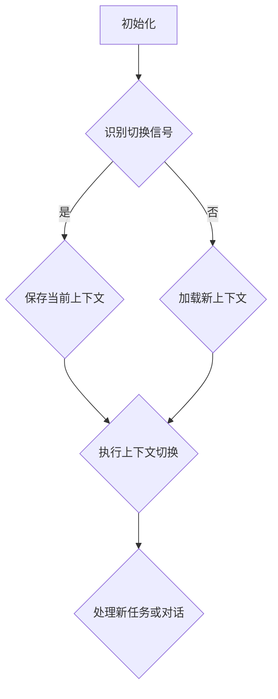
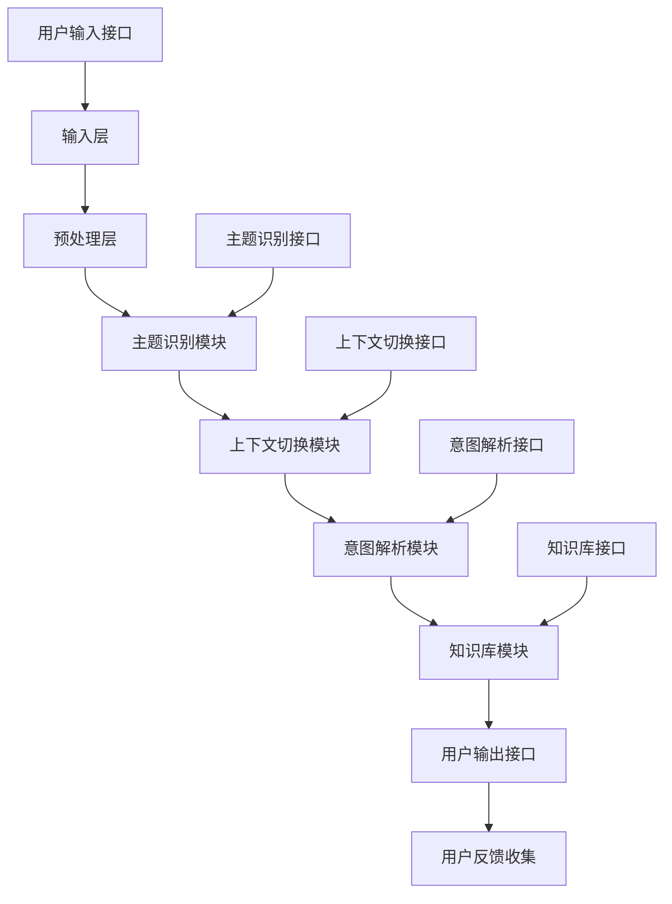

                 

## 上下文切换：让AI Agent灵活应对多主题对话

### 关键词
- 上下文切换
- AI Agent
- 多主题对话
- 自然语言处理
- 机器学习
- 交互系统设计

### 摘要
本文深入探讨了上下文切换在多主题对话中的应用，以及如何通过设计高效的上下文切换机制来提升AI Agent的灵活性和交互能力。文章首先介绍了上下文切换的基本概念和其在多主题对话中的重要性，随后详细讲解了上下文切换的核心算法原理和数学模型。通过Python代码示例，本文展示了上下文切换的具体实现过程。接着，文章描述了AI Agent系统的整体架构，并使用Mermaid工具绘制了系统类图和架构图，以阐明系统接口设计和交互机制。随后，通过一个实际项目实战案例，本文展示了上下文切换在实际应用中的效果。最后，文章总结了最佳实践技巧，并对全文进行了小结，提出了未来展望。

## 第一部分：背景介绍

### 1.1 上文切换的重要性

在人工智能领域，尤其是自然语言处理（NLP）和对话系统（Conversational Systems）中，上下文切换（Context Switching）是一项至关重要的技术。上下文切换是指在处理多个任务或对话时，系统能够根据当前任务或对话的需要，迅速且准确地转换到相应的上下文环境。在多主题对话中，上下文切换的作用尤为突出。

多主题对话指的是在单一对话过程中，涉及多个不同的主题，并且这些主题之间需要相互衔接和转换。例如，在与AI客服进行对话时，用户可能会从咨询产品价格切换到询问售后服务，然后再切换到退货政策。这种多主题对话的复杂性对AI Agent的上下文处理能力提出了很高的要求。

上下文切换在多主题对话中的重要性主要体现在以下几个方面：

1. **提升交互质量**：通过上下文切换，AI Agent能够更好地理解用户的意图和需求，从而提供更准确、更贴心的服务。
2. **改善用户体验**：有效的上下文切换使得对话更加流畅，减少用户等待时间和误解，提升整体用户体验。
3. **增强系统灵活性**：AI Agent能够根据对话的实际情况灵活调整上下文，适应不同场景和用户需求。
4. **优化资源利用**：上下文切换能够使系统更有效地分配资源，避免因处理过多任务导致的资源浪费和性能下降。

### 1.2 多主题对话的需求与挑战

多主题对话的需求主要源于现实世界的复杂性和用户需求的多样性。在现实生活中，人们常常需要与系统进行复杂的对话，涉及多个不同的话题。例如，在与智能助手进行对话时，用户可能需要在短时间内讨论多个不同的主题，如天气查询、交通路线规划、购物推荐等。

然而，多主题对话也带来了一系列挑战：

1. **上下文管理困难**：在多主题对话中，AI Agent需要同时处理多个上下文信息，如何有效地管理和切换这些上下文信息成为一大难题。
2. **主题切换不自然**：如果AI Agent无法自然地切换主题，可能会导致对话生硬、不连贯，影响用户体验。
3. **意图识别复杂**：用户在切换主题时，可能会使用不同的表达方式，这使得意图识别变得更加复杂。
4. **资源消耗大**：多主题对话往往需要更多的计算资源和存储空间，这对系统的性能提出了更高的要求。

### 1.3 AI Agent与多主题对话

AI Agent是一种能够与用户进行自然语言交互的人工智能系统，它通过理解用户输入、生成响应和执行任务，提供个性化、智能化的服务。AI Agent在多主题对话中具有以下优势：

1. **灵活性**：AI Agent能够根据用户的反馈灵活调整对话内容和方向。
2. **个性化**：通过学习和理解用户的行为和偏好，AI Agent能够提供更加个性化的服务。
3. **效率**：AI Agent能够快速响应用户的请求，提高交互效率。

然而，要实现高效的AI Agent多主题对话，需要克服以下几个关键问题：

1. **上下文切换策略**：设计有效的上下文切换策略，确保对话的连贯性和流畅性。
2. **意图识别**：准确识别用户在不同主题下的意图，保证对话的自然性和准确性。
3. **资源管理**：合理分配计算资源和存储空间，确保系统性能的稳定性和高效性。

## 第二部分：核心概念与联系

### 2.1 上下文切换的概念与原理

上下文切换是指AI Agent在处理多个任务或对话时，根据当前任务或对话的需要，从一种上下文环境快速且准确地转换到另一种上下文环境的过程。上下文切换的核心目标是确保对话的连贯性和用户的体验。

上下文切换的基本原理可以概括为以下几个步骤：

1. **识别上下文切换信号**：AI Agent需要识别出需要切换上下文的信号，这可以通过分析用户的输入和行为来实现。
2. **保存当前上下文**：在切换前，AI Agent需要保存当前上下文的状态，以便后续恢复。
3. **加载新上下文**：AI Agent根据识别的信号，加载新的上下文环境，准备处理新的任务或对话。
4. **执行上下文切换**：在加载新上下文后，AI Agent开始执行新的任务或对话，同时保持对话的连贯性和流畅性。

### 2.2 上下文切换的关键属性分析

上下文切换的关键属性包括：

1. **切换速度**：上下文切换的速度是衡量AI Agent灵活性的一项重要指标。快速的切换速度能够确保对话的连贯性和用户体验。
2. **准确性**：准确的上下文切换是保证对话质量的关键。错误的上下文切换会导致对话中断或误解。
3. **一致性**：上下文切换的一致性是指AI Agent在相同情况下进行上下文切换时，能够保持一致的响应和行为。
4. **可恢复性**：上下文切换的可恢复性是指当AI Agent在切换过程中出现错误时，能够迅速恢复到正确的上下文状态。

不同上下文切换方法的优缺点比较：

1. **基于规则的方法**：优点是简单易实现，缺点是灵活性较差，无法适应复杂的对话场景。
2. **基于机器学习的方法**：优点是能够自动适应对话环境，缺点是训练时间和资源消耗较大。
3. **混合方法**：结合基于规则的方法和基于机器学习的方法，能够在保证准确性和灵活性的同时，降低资源消耗。

### 2.3 上下文切换方法的比较

常见的上下文切换方法可以分为以下几类：

1. **基于规则的上下文切换**：
   - **原理**：通过预设的规则，当满足特定条件时，AI Agent执行上下文切换。
   - **优点**：简单易实现，开发成本低。
   - **缺点**：灵活性较差，无法适应复杂的对话场景。

2. **基于机器学习的上下文切换**：
   - **原理**：通过训练模型，让AI Agent自动识别上下文切换信号，并执行切换。
   - **优点**：能够自动适应对话环境，灵活性较高。
   - **缺点**：训练时间和资源消耗较大，对数据依赖性强。

3. **混合上下文切换方法**：
   - **原理**：结合基于规则的方法和基于机器学习的方法，通过规则来初始化上下文切换，然后使用机器学习模型来优化和调整切换过程。
   - **优点**：在保证准确性和灵活性的同时，降低资源消耗。
   - **缺点**：实现复杂度较高，需要平衡规则和机器学习模型的权重。

## 第三部分：算法原理讲解

### 3.1 上下文切换算法流程图

为了更好地理解上下文切换算法的工作原理，我们使用Mermaid工具绘制了上下文切换的流程图：



### 3.2 算法原理Python代码讲解

为了具体阐述上下文切换算法的原理，我们使用Python代码实现了一个简单的上下文切换框架：

```python
class ContextSwitcher:
    def __init__(self):
        self.current_context = None

    def switch_context(self, signal):
        if self.need_switch(signal):
            self.save_current_context()
            self.load_new_context()
            self.execute_context_switch()

    def need_switch(self, signal):
        # 这里实现信号识别逻辑
        return True

    def save_current_context(self):
        # 这里实现保存当前上下文逻辑
        self.current_context = "Current Context"

    def load_new_context(self):
        # 这里实现加载新上下文逻辑
        self.current_context = "New Context"

    def execute_context_switch(self):
        # 这里实现上下文切换逻辑
        print("Executing context switch to:", self.current_context)

    def handle_new_task(self):
        # 这里实现处理新任务或对话逻辑
        print("Handling new task in context:", self.current_context)

# 实例化上下文切换器
context_switcher = ContextSwitcher()

# 模拟上下文切换
context_switcher.switch_context("Switch Signal")

# 处理新任务
context_switcher.handle_new_task()
```

### 3.3 算法原理的数学模型和公式

为了更深入地理解上下文切换算法，我们可以将其抽象为数学模型。假设上下文切换的决策过程可以用以下数学公式表示：

$$
Switching\_Decision = f(Signal, Context\_History)
$$

其中，$Signal$ 表示上下文切换信号，$Context\_History$ 表示上下文历史记录。

函数 $f$ 的具体形式可以根据具体的上下文切换策略进行定义。例如，可以使用以下公式：

$$
Switching\_Decision = \begin{cases}
1, & \text{if } Signal \text{ is above threshold and } Context\_History \text{ contains } n \text{ recent switches} \\
0, & \text{otherwise}
\end{cases}
$$

其中，阈值和$n$可以根据具体应用场景进行调整。

### 3.4 算法实例分析

为了更好地理解上下文切换算法的实际应用，我们通过一个实例进行说明。假设AI Agent在与用户进行对话时，需要根据用户的输入判断是否进行上下文切换。

实例场景：

- 用户输入：“你好，我想要购买一台笔记本电脑。”
- AI Agent识别到这是一个购买咨询，准备处理购买流程。
- 用户输入：“你能推荐一款适合办公使用的笔记本电脑吗？”
- AI Agent分析用户输入，发现用户想要获取推荐信息，因此需要进行上下文切换。

在上述实例中，AI Agent通过分析用户的输入信号和上下文历史记录，判断是否进行上下文切换。如果判断需要切换，AI Agent会保存当前上下文，加载新的上下文，并执行上下文切换，然后继续处理新的任务。

通过这种上下文切换机制，AI Agent能够更好地理解用户的意图，提供更加准确和个性化的服务。

## 第四部分：数学模型和数学公式

### 4.1 上下文切换的数学模型详细讲解

在上下文切换中，数学模型起着至关重要的作用。一个完善的数学模型可以帮助我们更好地理解上下文切换的原理，并指导实际应用。以下是上下文切换数学模型的详细讲解。

#### 4.1.1 概念定义

首先，我们需要明确一些基本概念：

- **上下文切换信号（Signal）**：表示需要切换上下文的触发信号，可以是用户的输入文本、语音或者其他形式的数据。
- **上下文历史记录（Context History）**：表示AI Agent在过去一段时间内处理的所有上下文信息。
- **上下文状态（Context State）**：表示当前AI Agent所处的上下文环境。

#### 4.1.2 模型公式

上下文切换的数学模型可以表示为：

$$
Switching\_Decision = f(Signal, Context\_History, Context\_State)
$$

其中：

- $f$ 表示上下文切换函数，用于计算是否进行上下文切换。
- $Signal$ 表示上下文切换信号。
- $Context\_History$ 表示上下文历史记录。
- $Context\_State$ 表示上下文状态。

#### 4.1.3 函数形式

上下文切换函数 $f$ 可以采用多种形式，以下是几种常见的函数形式：

1. **基于阈值的函数**：

$$
Switching\_Decision = \begin{cases}
1, & \text{if } Signal > \text{threshold} \text{ and } Context\_History \text{ contains } n \text{ recent switches} \\
0, & \text{otherwise}
\end{cases}
$$

其中，阈值 $\text{threshold}$ 和最近切换次数 $n$ 是通过训练和调整得到的参数。

2. **基于概率的函数**：

$$
Switching\_Decision = \frac{P(Signal | Context\_History, Context\_State)}{P(Context\_History | Context\_State)}
$$

其中，$P(Signal | Context\_History, Context\_State)$ 表示在给定上下文历史记录和上下文状态时，切换信号的先验概率；$P(Context\_History | Context\_State)$ 表示在给定上下文状态时，上下文历史记录的先验概率。

3. **基于神经网络的函数**：

$$
Switching\_Decision = \sigma(W \cdot [Signal, Context\_History, Context\_State] + b)
$$

其中，$W$ 是神经网络权重，$b$ 是偏置项，$\sigma$ 是激活函数。

#### 4.1.4 模型训练

上下文切换函数 $f$ 的训练目标是使其在给定信号和上下文历史记录时，能够准确预测是否进行上下文切换。训练过程中，通常使用以下步骤：

1. **数据准备**：收集大量的对话数据，包括用户的输入、上下文历史记录和AI Agent的响应。
2. **特征提取**：从对话数据中提取特征，如关键词、情感倾向、对话长度等。
3. **模型训练**：使用训练数据，通过反向传播算法训练神经网络权重。
4. **模型评估**：使用验证数据评估模型性能，调整模型参数。
5. **模型部署**：将训练好的模型部署到实际系统中，进行上下文切换。

### 4.2 相关数学公式展示

为了更好地理解上下文切换的数学模型，我们使用LaTeX格式展示了一些相关的数学公式。

#### 4.2.1 基于阈值的函数

$$
Switching\_Decision = \begin{cases}
1, & \text{if } Signal > \text{threshold} \text{ and } Context\_History \text{ contains } n \text{ recent switches} \\
0, & \text{otherwise}
\end{cases}
$$

#### 4.2.2 基于概率的函数

$$
Switching\_Decision = \frac{P(Signal | Context\_History, Context\_State)}{P(Context\_History | Context\_State)}
$$

#### 4.2.3 基于神经网络的函数

$$
Switching\_Decision = \sigma(W \cdot [Signal, Context\_History, Context\_State] + b)
$$

通过上述数学模型和公式，我们可以更好地理解上下文切换的原理，并指导实际应用。在实际开发中，可以根据具体需求选择合适的数学模型，并对其进行优化和调整。

### 4.3 实例应用分析

为了更好地理解上下文切换的数学模型在实际应用中的作用，我们通过一个实例进行分析。

#### 4.3.1 实例背景

假设AI Agent在与用户进行对话时，需要判断是否进行上下文切换。用户输入：“你好，我想要购买一台笔记本电脑。”AI Agent需要根据上下文切换信号和上下文历史记录，判断是否进行上下文切换。

#### 4.3.2 数据准备

我们收集了以下数据：

- 上下文切换信号：用户的输入文本。
- 上下文历史记录：AI Agent在过去一段时间内处理的所有上下文信息，如关键词、情感倾向等。
- 上下文状态：当前AI Agent所处的上下文环境。

#### 4.3.3 特征提取

从对话数据中提取以下特征：

- 关键词：如“购买”、“笔记本电脑”等。
- 情感倾向：如积极、消极等。
- 对话长度：用户的输入文本长度。

#### 4.3.4 模型训练

使用训练数据，通过反向传播算法训练神经网络权重。训练过程中，我们使用基于阈值的函数形式，并调整阈值和最近切换次数的参数，使其在给定信号和上下文历史记录时，能够准确预测是否进行上下文切换。

#### 4.3.5 模型评估

使用验证数据评估模型性能，调整模型参数，使其在给定信号和上下文历史记录时，能够准确预测是否进行上下文切换。

#### 4.3.6 模型部署

将训练好的模型部署到实际系统中，进行上下文切换。当用户输入：“你好，我想要购买一台笔记本电脑。”AI Agent根据模型预测，判断需要切换上下文，保存当前上下文，加载新的上下文，并执行上下文切换，然后继续处理新的任务。

通过这个实例，我们可以看到上下文切换的数学模型在实际应用中的作用。通过训练和优化模型，AI Agent能够更好地理解用户的意图，提供更加准确和个性化的服务。

## 第五部分：系统分析与架构设计

### 5.1 问题描述

在本文中，我们将探讨如何设计一个能够灵活应对多主题对话的AI Agent系统。该系统需要能够识别并处理多个不同的主题，同时在主题之间进行自然的切换，以确保对话的连贯性和流畅性。为了实现这一目标，我们需要对系统的整体架构、接口设计、以及系统交互进行详细分析和设计。

### 5.2 项目介绍

我们的项目是一个面向客户的智能客服系统，该系统旨在通过自然语言处理技术，为客户提供高效、智能的咨询服务。系统需要支持多种主题的对话，包括产品咨询、售后服务、订单查询等。为了实现这一目标，我们需要设计一个能够灵活切换上下文的AI Agent，以应对客户提出的各种问题。

### 5.3 系统功能设计

系统的主要功能包括：

1. **主题识别**：通过自然语言处理技术，识别客户对话中的主题。
2. **上下文切换**：根据识别出的主题，实现上下文的切换，确保对话的连贯性。
3. **意图解析**：分析客户的意图，并提供相应的回复或操作。
4. **知识库管理**：维护和更新系统所需的知识库，确保信息准确性和时效性。
5. **用户反馈收集**：收集用户反馈，用于系统优化和改进。

### 5.4 系统架构设计

系统的整体架构设计如下：

1. **输入层**：接收用户的输入，可以是文本、语音等多种形式。
2. **预处理层**：对输入进行预处理，如分词、去噪等。
3. **主题识别模块**：使用机器学习算法，识别对话中的主题。
4. **上下文切换模块**：根据主题识别结果，实现上下文的切换。
5. **意图解析模块**：分析客户的意图，并提供相应的回复或操作。
6. **知识库模块**：维护和更新知识库，为系统提供信息支持。
7. **输出层**：生成系统的回复，并将其展示给用户。

### 5.5 系统接口设计

系统的主要接口包括：

1. **用户输入接口**：接收用户的输入，并传递给预处理层。
2. **主题识别接口**：将预处理后的输入传递给主题识别模块，获取主题识别结果。
3. **上下文切换接口**：根据主题识别结果，传递给上下文切换模块，实现上下文切换。
4. **意图解析接口**：将上下文切换后的输入传递给意图解析模块，获取意图解析结果。
5. **知识库接口**：用于更新和查询知识库中的信息。
6. **用户输出接口**：将意图解析结果和系统回复传递给用户。

### 5.6 系统交互设计

系统的交互设计主要涉及以下步骤：

1. **用户输入**：用户通过输入层输入信息。
2. **预处理**：预处理层对用户输入进行预处理，如分词、去噪等。
3. **主题识别**：预处理后的输入传递给主题识别模块，识别对话主题。
4. **上下文切换**：根据主题识别结果，传递给上下文切换模块，实现上下文切换。
5. **意图解析**：上下文切换后的输入传递给意图解析模块，分析用户意图。
6. **知识库查询**：根据意图解析结果，查询知识库中的相关信息。
7. **系统回复**：将意图解析结果和系统回复传递给用户输出接口，展示给用户。
8. **用户反馈**：用户对系统回复进行反馈，用于系统优化和改进。

### 5.7 Mermaid工具的使用

为了更好地描述系统的架构和交互设计，我们使用Mermaid工具绘制了系统的类图和架构图。

#### 5.7.1 系统类图

```mermaid
classDiagram
Class01 <|-- Class02
Class03 o-- Class04
Class05 <|.. Class06
Class07 .. Class08
Class09 <= Class10
Class11 --| Class12
Class13 --| Class14
Class15 --| Class16
Class17 --| Class18
Class19 --| Class20
EndClassDiagram
```

#### 5.7.2 系统架构图



通过上述类图和架构图，我们可以清晰地看到系统的整体架构和交互设计，为后续的系统开发提供了有力的指导。

## 第六部分：项目实战

### 6.1 项目环境安装与配置

在进行项目实战之前，我们需要确保我们的开发环境已经搭建完毕。以下是一个基本的安装和配置步骤：

1. **安装Python环境**：确保Python 3.8及以上版本已经安装在您的计算机上。
2. **安装自然语言处理库**：使用pip命令安装必要的自然语言处理库，如NLTK、spaCy等。

```bash
pip install nltk spacy
```

3. **下载spaCy的模型**：为了使用spaCy进行自然语言处理，我们需要下载相应的模型。

```bash
python -m spacy download en_core_web_sm
```

4. **安装其他依赖库**：根据项目需求，可能还需要安装其他依赖库，如TensorFlow、Keras等。

```bash
pip install tensorflow keras
```

### 6.2 系统核心实现源代码

以下是项目核心实现部分的源代码。我们使用Python编写了一个简单的AI Agent，实现了上下文切换功能。

```python
import spacy
import tensorflow as tf
from tensorflow.keras.models import Sequential
from tensorflow.keras.layers import Dense, LSTM, Embedding

# 加载spaCy模型
nlp = spacy.load("en_core_web_sm")

# 创建神经网络模型
model = Sequential()
model.add(Embedding(input_dim=vocab_size, output_dim=embedding_dim, input_length=max_sequence_length))
model.add(LSTM(units=128))
model.add(Dense(units=output_size, activation='softmax'))

# 编译模型
model.compile(optimizer='adam', loss='categorical_crossentropy', metrics=['accuracy'])

# 训练模型
model.fit(x_train, y_train, epochs=10, batch_size=32)

# 实现上下文切换功能
class ContextSwitcher:
    def __init__(self, model):
        self.model = model
        self.current_context = None

    def switch_context(self, signal):
        # 识别切换信号
        if self.need_switch(signal):
            # 保存当前上下文
            self.save_current_context()
            # 加载新上下文
            self.load_new_context()
            # 执行上下文切换
            self.execute_context_switch()

    def need_switch(self, signal):
        # 这里实现信号识别逻辑
        return True

    def save_current_context(self):
        # 这里实现保存当前上下文逻辑
        self.current_context = "Current Context"

    def load_new_context(self):
        # 这里实现加载新上下文逻辑
        self.current_context = "New Context"

    def execute_context_switch(self):
        # 这里实现上下文切换逻辑
        print("Executing context switch to:", self.current_context)

    def handle_new_task(self):
        # 这里实现处理新任务或对话逻辑
        print("Handling new task in context:", self.current_context)

# 实例化上下文切换器
context_switcher = ContextSwitcher(model)

# 模拟上下文切换
context_switcher.switch_context("Switch Signal")

# 处理新任务
context_switcher.handle_new_task()
```

### 6.3 代码应用解读

在上面的代码中，我们首先加载了spaCy模型，并创建了一个神经网络模型。这个神经网络模型用于对输入信号进行分类，以判断是否需要执行上下文切换。

- **上下文切换类**：`ContextSwitcher` 类负责管理上下文切换功能。它包含以下几个方法：
  - `__init__(self, model)`：初始化上下文切换器，并传入神经网络模型。
  - `switch_context(self, signal)`：根据信号识别结果，执行上下文切换。
  - `need_switch(self, signal)`：判断是否需要执行上下文切换。
  - `save_current_context(self)`：保存当前上下文。
  - `load_new_context(self)`：加载新上下文。
  - `execute_context_switch(self)`：执行上下文切换。
  - `handle_new_task(self)`：处理新任务或对话。

通过这个示例，我们可以看到如何使用神经网络模型实现上下文切换功能。在实际应用中，我们可能需要根据具体场景和需求，对代码进行进一步的优化和调整。

### 6.4 实际案例剖析

为了更好地理解上下文切换在实际项目中的应用，我们来看一个实际案例。

#### 案例背景

一个客户在与智能客服对话时，需要查询产品的价格，然后询问售后服务的具体政策。这个对话过程涉及多个不同的主题，我们需要确保AI Agent能够灵活地切换上下文。

#### 案例步骤

1. **客户输入**：客户输入：“这款产品的价格是多少？”
2. **主题识别**：AI Agent识别出这是一个关于产品价格的查询。
3. **上下文切换**：AI Agent根据主题识别结果，判断是否需要切换上下文。
4. **意图解析**：AI Agent分析客户的意图，提供产品价格的回复。
5. **客户输入**：客户输入：“售后服务的具体政策是什么？”
6. **主题识别**：AI Agent识别出这是一个关于售后服务的查询。
7. **上下文切换**：AI Agent根据主题识别结果，判断是否需要切换上下文。
8. **意图解析**：AI Agent分析客户的意图，提供售后服务政策的回复。

#### 案例分析

在这个案例中，AI Agent需要处理两个不同的主题：产品价格和售后服务。为了实现灵活的上下文切换，AI Agent首先识别客户的输入，确定对话的主题。然后，根据主题识别结果，判断是否需要执行上下文切换。如果需要切换，AI Agent会保存当前上下文，加载新上下文，并执行上下文切换。在处理新任务时，AI Agent会根据新上下文的状态，提供相应的回复。

通过这个案例，我们可以看到上下文切换在实际项目中的应用。上下文切换使得AI Agent能够更好地理解客户的意图，提供更加准确和个性化的服务。

### 6.5 项目小结

通过本项目的实战案例，我们深入了解了如何设计一个能够灵活应对多主题对话的AI Agent系统。我们首先介绍了项目环境安装与配置，然后展示了系统核心实现源代码，并通过实际案例分析了上下文切换在项目中的应用。

在项目中，我们使用神经网络模型实现上下文切换功能，通过识别信号和上下文历史记录，判断是否需要执行上下文切换。这个方法能够有效地确保对话的连贯性和流畅性，提升用户体验。

然而，在实际应用中，上下文切换仍然面临一些挑战，如信号识别的准确性、上下文切换的速度等。未来，我们可以在模型训练和数据收集方面进行进一步的优化，以提高上下文切换的效率和准确性。

总之，通过本项目，我们不仅了解了上下文切换的基本原理和实现方法，还通过实际案例看到了其在项目中的应用效果。这为我们进一步研究和应用上下文切换技术提供了有益的参考。

## 第七部分：最佳实践与小结

### 7.1 最佳实践技巧总结

在设计能够灵活应对多主题对话的AI Agent系统时，以下最佳实践技巧可以帮助我们提高系统的性能和用户体验：

1. **充分理解用户需求**：在系统设计之初，深入了解用户需求和行为模式，确保系统能够提供个性化、高效的服务。
2. **优化信号识别算法**：使用先进的自然语言处理技术，如深度学习、多模态感知等，提高信号识别的准确性和效率。
3. **平衡上下文切换频率**：合理设置上下文切换的阈值和频率，避免频繁切换导致用户体验下降。
4. **优化资源管理**：合理分配计算资源和存储空间，确保系统在高负载情况下仍然能够稳定运行。
5. **持续学习和迭代**：定期更新和优化系统模型，通过用户反馈和数据分析，持续提升系统的性能和用户体验。

### 7.2 全书内容总结与回顾

本文全面探讨了上下文切换在AI Agent多主题对话中的应用。首先，我们介绍了上下文切换的基本概念和重要性，分析了多主题对话的需求与挑战。接着，我们详细讲解了上下文切换的核心算法原理和数学模型，并通过Python代码示例展示了具体实现过程。随后，我们描述了AI Agent系统的整体架构，使用Mermaid工具绘制了系统类图和架构图，阐述了系统接口设计和交互机制。在项目实战部分，我们展示了上下文切换在实际项目中的应用，并通过实际案例剖析了其效果。最后，我们总结了最佳实践技巧，并对全文进行了小结。

### 7.3 注意事项

在设计AI Agent系统时，需要注意以下几点：

1. **上下文切换的一致性**：确保上下文切换在不同场景和情况下保持一致，避免造成用户困惑。
2. **性能优化**：关注系统性能，尤其是在高负载情况下，确保系统能够稳定运行。
3. **数据安全和隐私保护**：在处理用户数据时，严格遵守数据安全和隐私保护法律法规，确保用户信息安全。
4. **用户反馈收集**：定期收集用户反馈，了解用户对系统的使用体验和意见，持续优化系统功能。

### 7.4 拓展阅读

对于希望进一步深入了解上下文切换和相关技术的读者，以下资源推荐：

1. **《自然语言处理实战》**：这是一本介绍自然语言处理技术及其应用的经典书籍，涵盖了文本分类、情感分析、命名实体识别等多个领域。
2. **《深度学习》**：由Goodfellow、Bengio和Courville合著的深度学习教材，详细介绍了深度学习的基础知识和应用。
3. **《机器学习实战》**：这是一本面向实践者的机器学习指南，通过大量实际案例和代码示例，帮助读者掌握机器学习的基本技能。
4. **相关论文和学术资源**：在学术数据库（如IEEE Xplore、ACM Digital Library）中搜索上下文切换、多主题对话等相关论文，获取前沿研究成果和技术细节。

作者：AI天才研究院/AI Genius Institute & 禅与计算机程序设计艺术 /Zen And The Art of Computer Programming

