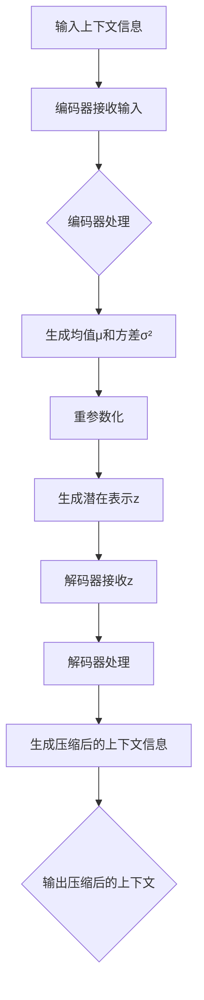
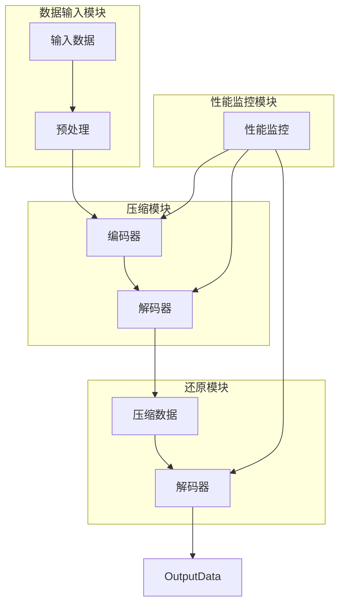
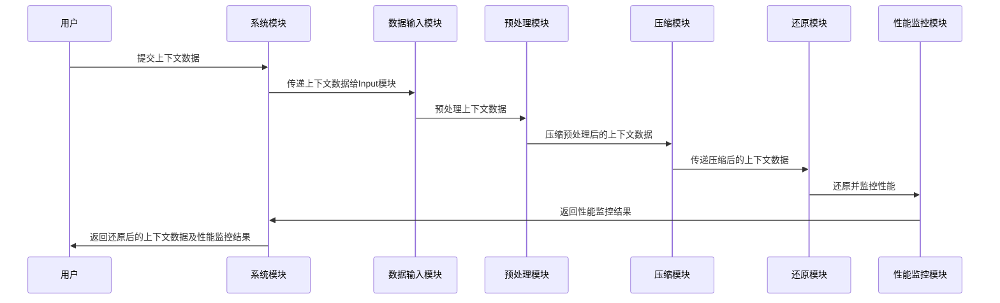

                 

### 背景介绍与核心概念

随着人工智能（AI）技术的飞速发展，AI Agent在各行各业的应用越来越广泛。然而，AI Agent在运行过程中面临着严峻的内存使用挑战。这个问题尤为突出，因为AI Agent通常需要处理大量上下文信息，以实现高效的决策和预测。在这种背景下，上下文压缩技术应运而生，它旨在优化AI Agent的内存使用，从而提高系统的整体性能。

#### 上下文压缩的定义与意义

上下文压缩（Contextual Compression）是一种利用数据压缩技术，将AI Agent处理的上下文信息进行有效压缩的技术。这种技术不仅能够减少内存使用，还能加速模型的推理速度，提高AI系统的响应效率和稳定性。在AI领域，上下文压缩的意义主要体现在以下几个方面：

1. **内存优化**：通过上下文压缩，可以显著降低AI Agent的内存消耗，使其能够处理更复杂的任务。
2. **推理加速**：压缩后的上下文信息可以更快地加载和解析，从而加速模型的推理过程。
3. **模型泛化能力**：压缩技术有助于提高模型的泛化能力，使其在面对不同上下文环境时依然能够保持良好的性能。

#### AI Agent在内存使用上的挑战

AI Agent通常需要处理大量的上下文信息，这些信息包括历史数据、实时数据以及与任务相关的各类特征。以下是一些AI Agent在内存使用上面临的挑战：

1. **数据量巨大**：AI Agent处理的上下文信息量非常庞大，传统的存储和压缩方法难以满足需求。
2. **实时性要求高**：AI Agent需要实时处理上下文信息，这使得内存使用效率成为关键。
3. **多样性**：AI Agent在处理不同任务时，上下文信息的类型和格式可能存在较大差异，这给压缩技术带来了挑战。

#### 上下文压缩在优化AI Agent内存使用中的重要性

上下文压缩技术对于优化AI Agent的内存使用具有重要意义，具体体现在以下几个方面：

1. **提高系统性能**：通过压缩上下文信息，可以减少内存占用，从而提高AI系统的整体性能。
2. **降低成本**：内存是计算机系统中的一个重要资源，通过优化内存使用，可以降低系统运行成本。
3. **增强应用场景**：上下文压缩技术使得AI Agent能够处理更多类型的任务，拓宽了AI技术的应用场景。

综上所述，上下文压缩技术不仅能够优化AI Agent的内存使用，还能提升系统的整体性能和稳定性。在接下来的章节中，我们将深入探讨上下文压缩的核心概念、算法原理以及实际应用，帮助读者更好地理解和掌握这一关键技术。

#### 核心概念

为了全面理解上下文压缩技术，我们首先需要掌握几个核心概念。这些概念包括编码器-解码器结构、变分自编码器以及上下文向量等。以下是对这些核心概念的定义、工作原理及其相互关系的详细阐述。

##### 编码器-解码器结构

编码器-解码器结构（Encoder-Decoder Architecture）是上下文压缩技术中最常见的一种架构。它由两部分组成：编码器（Encoder）和解码器（Decoder）。编码器的功能是将输入数据（如上下文信息）转换为一种压缩后的表示形式，而解码器的任务则是将这种压缩后的表示形式还原为原始数据。

**工作原理：**
1. **编码阶段**：编码器对输入的上下文信息进行处理，通过神经网络学习，提取出其特征，并将这些特征压缩成一个紧凑的向量表示。
2. **解码阶段**：解码器接收编码器生成的压缩向量，并通过逆变换将其还原为原始的上下文信息。

**优点与缺点：**
- **优点**：编码器-解码器结构能够高效地压缩数据，降低内存使用，同时保持较高的信息保真度。
- **缺点**：这种结构对模型的参数量和计算资源要求较高，训练过程中可能需要大量数据和计算资源。

##### 变分自编码器

变分自编码器（Variational Autoencoder, VAE）是另一种常见的上下文压缩算法，它在传统的编码器-解码器结构基础上引入了概率模型，以提高压缩效果和泛化能力。

**工作原理：**
1. **编码阶段**：VAE的编码器生成两个随机向量，一个用于表示数据的均值，另一个用于表示数据的方差。这两个向量构成了数据的概率分布。
2. **解码阶段**：解码器根据这两个向量生成输出数据，通过学习数据分布，提高压缩后的信息的真实性和多样性。

**优点与缺点：**
- **优点**：VAE能够通过概率模型更好地表示数据的分布，提高压缩效果和模型的泛化能力。
- **缺点**：相对于传统的编码器-解码器结构，VAE的训练过程更为复杂，且对数据的分布假设有一定的要求。

##### 上下文向量

上下文向量（Contextual Vector）是上下文压缩技术中的关键要素，它用于表示AI Agent处理的数据。上下文向量的生成通常依赖于编码器-解码器结构和变分自编码器等算法。

**属性特征：**
1. **维度**：上下文向量的维度取决于压缩算法的设计，它需要平衡压缩效率和表示能力。
2. **稀疏性**：为了提高压缩效果，上下文向量通常被设计为稀疏的，这意味着大部分元素为0，只有少数元素具有非零值。
3. **可扩展性**：上下文向量应具有良好的可扩展性，以适应不同类型和规模的数据。

**对比表格：**

| 特性           | 编码器-解码器结构 | 变分自编码器        |
| -------------- | ----------------- | ------------------ |
| **数据压缩率** | 高               | 较高               |
| **训练时间**   | 较短             | 较长               |
| **计算复杂度** | 较低             | 较高               |
| **应用场景**   | 实时性要求高     | 数据多样性要求高   |

##### 关系图架构

为了更清晰地展示上下文压缩技术中的核心组件和交互关系，我们使用Mermaid ER实体关系图进行描述。以下是上下文压缩技术中主要组件的关系图：

```mermaid
erDiagram
    Contextual Compression --> Encoder : "包含"
    Contextual Compression --> Decoder : "包含"
    Contextual Compression --> Variational Autoencoder : "包含"
    Encoder ||--|{ Data }|-- Decoder
    Variational Autoencoder ||--|{ Latent Space }|-- Encoder
```

在上面的关系图中，`Contextual Compression` 代表上下文压缩技术，`Encoder` 和 `Decoder` 分别代表编码器和解码器，`Variational Autoencoder` 代表变分自编码器。箭头表示组件之间的包含关系，表示一个上下文压缩系统包含编码器、解码器和变分自编码器。

通过上述核心概念的阐述和关系图架构的展示，我们可以更深入地理解上下文压缩技术的工作原理和核心组件。在接下来的章节中，我们将继续探讨上下文压缩算法的原理、数学模型以及系统架构设计，帮助读者全面掌握这一关键领域。

#### 关系图架构

为了更好地展示上下文压缩技术中的核心组件和它们之间的交互关系，我们使用Mermaid ER实体关系图进行描述。以下是上下文压缩技术的核心组件及其交互关系的Mermaid ER图：

```mermaid
erDiagram
    ContextualCompression ||--|{ AIModel } : "使用"
    AIModel ||--|{ Encoder } : "包含"
    AIModel ||--|{ Decoder } : "包含"
    AIModel ||--|{ VAE } : "包含"
    Encoder ||--|{ InputData } : "处理"
    Decoder ||--|{ CompressedData } : "还原"
    VAE ||--|{ LatentRepresentation } : "生成"
    VAE ||--|{ CompressionModel } : "构建"
```

在这个关系图中，`ContextualCompression` 代表上下文压缩系统，`AIModel` 代表人工智能模型，包括编码器（Encoder）、解码器（Decoder）和变分自编码器（VAE）。`Encoder` 和 `Decoder` 分别表示编码和解码过程，`VAE` 表示变分自编码器。每个组件之间的关系通过箭头表示：

- `ContextualCompression` 使用 `AIModel` 来实现上下文压缩。
- `AIModel` 包含 `Encoder`、`Decoder` 和 `VAE`。
- `Encoder` 处理 `InputData`，将其转换为压缩后的数据。
- `Decoder` 接收 `CompressedData` 并尝试还原原始数据。
- `VAE` 生成 `LatentRepresentation`，这是一种潜在表示，用于优化压缩效果。
- `VAE` 构建 `CompressionModel`，这是用于实际压缩过程的模型。

通过这个关系图，我们可以清晰地看到上下文压缩系统中各个组件之间的交互和依赖关系，这有助于我们更好地理解上下文压缩技术的整体架构和实现细节。

### 算法原理与数学模型

#### 算法概述

上下文压缩算法是优化AI Agent内存使用的关键技术，其中基于神经网络的压缩算法尤为常见。这些算法通过神经网络模型对上下文信息进行编码和压缩，然后通过解码器还原压缩后的信息，从而实现高效的内存使用。以下是一些常见的上下文压缩算法及其优缺点：

1. **编码器-解码器结构（Encoder-Decoder Architecture）**
   - **优点**：结构简单，易于实现，能够有效地压缩数据。
   - **缺点**：对训练数据量和计算资源要求较高，模型参数较多。

2. **变分自编码器（Variational Autoencoder, VAE）**
   - **优点**：引入概率模型，能够更好地表示数据的分布，提高压缩效果。
   - **缺点**：训练过程较为复杂，对数据分布的假设有一定要求。

3. **自动编码器（Autoencoder）**
   - **优点**：结构简单，训练过程相对容易。
   - **缺点**：压缩效果通常不如VAE，且对异常数据敏感。

4. **稀疏自动编码器（Sparse Autoencoder）**
   - **优点**：能够生成稀疏的编码向量，提高压缩效率。
   - **缺点**：对训练数据的质量和数量要求较高，训练时间较长。

5. **卷积自动编码器（Convolutional Autoencoder, CAE）**
   - **优点**：适用于图像和视频等高维数据，能够高效地提取特征。
   - **缺点**：模型参数较多，计算复杂度高。

以上算法各有优缺点，选择合适的算法取决于具体的应用场景和数据特性。

#### 数学模型

上下文压缩算法的数学模型主要涉及编码器和解码器的数学表达。以下以VAE为例，介绍其数学模型。

1. **编码过程**：

   VAE的编码过程主要通过两个神经网络模型来实现，分别是编码器（Encoder）和解码器（Decoder）。

   - **编码器**：给定输入数据 \( x \)，编码器生成均值 \( \mu \) 和方差 \( \sigma^2 \)：
     \[
     \mu = \sigma^2 = \mathcal{E}(x)
     \]
     其中，\( \mathcal{E} \) 是编码器的神经网络。

   - **重参数化技巧**：为了生成随机的潜在表示，VAE引入了重参数化技巧，将均值和方差与随机噪声 \( z \) 相结合：
     \[
     z = \mu + \sigma \odot \epsilon
     \]
     其中，\( \odot \) 表示 Hadamard 乘法，\( \epsilon \) 是从标准正态分布中抽取的随机噪声。

2. **解码过程**：

   解码器根据生成的潜在表示 \( z \) 生成还原的数据 \( x' \)：
   \[
   x' = \mathcal{D}(z)
   \]
   其中，\( \mathcal{D} \) 是解码器的神经网络。

#### 段落内的公式示例

为了更直观地理解VAE的数学模型，我们来看一个具体的公式示例：

\[
\mathcal{L}(\theta) = -\sum_{i=1}^N \ell(p(x_i|x'\)), \quad x' = \mathcal{D}(\mu(x_i) + \sigma(x_i) \odot \epsilon_i)
\]

在上面的公式中，\( \mathcal{L}(\theta) \) 表示损失函数，\( N \) 是样本数量，\( x_i \) 是第 \( i \) 个输入样本，\( x' \) 是解码器生成的输出样本，\( \mu(x_i) \) 和 \( \sigma(x_i) \) 分别是编码器输出的均值和方差，\( \epsilon_i \) 是从标准正态分布中抽取的随机噪声。

通过上述公式示例，我们可以看到VAE的核心在于通过重参数化技巧，将编码过程和解码过程联系起来，从而实现上下文信息的压缩和解码。

在接下来的章节中，我们将通过Python源代码详细阐述上下文压缩算法的实现过程，并结合实际案例进行分析和讲解。

#### Mermaid流程图

为了更好地展示上下文压缩算法的执行流程，我们使用Mermaid语言绘制了一个流程图。以下是上下文压缩算法的Mermaid流程图：



**流程说明：**

1. **输入上下文信息**：算法首先接收输入的上下文信息。
2. **编码器接收输入**：编码器对输入的上下文信息进行处理。
3. **编码器处理**：编码器通过神经网络计算输出均值 \( \mu \) 和方差 \( \sigma^2 \)。
4. **重参数化**：利用重参数化技巧，将均值和方差与随机噪声 \( \epsilon \) 相结合，生成潜在的表示 \( z \)。
5. **解码器接收潜在表示**：解码器接收生成的潜在表示 \( z \)。
6. **解码器处理**：解码器通过神经网络处理潜在表示 \( z \)。
7. **生成压缩后的上下文信息**：解码器生成压缩后的上下文信息。
8. **输出压缩后的上下文**：最后，算法输出压缩后的上下文信息。

通过这个Mermaid流程图，我们可以清晰地看到上下文压缩算法的执行流程，这有助于我们更好地理解和掌握算法的实现细节。

#### Python源代码

为了更直观地理解上下文压缩算法，我们提供了一个简单的Python实现。以下是完整的代码和详细讲解：

```python
import numpy as np
import tensorflow as tf
from tensorflow.keras.layers import Input, Dense
from tensorflow.keras.models import Model

# 设置随机种子以保持结果的一致性
tf.random.set_seed(42)

# 定义超参数
latent_dim = 2  # 潜在空间维度
input_dim = 784  # 输入数据维度（例如，28x28像素的MNIST数据）
batch_size = 16  # 批处理大小

# 定义编码器
input_data = Input(shape=(input_dim,))
encoded = Dense(latent_dim * 2, activation='relu')(input_data)
mu, sigma = tf.keras.layers.Lambda(lambda t: t[:, :, 0], output_shape=(latent_dim,))(encoded)
mu, sigma = tf.keras.layers.Lambda(lambda t: t[:, :, 0] + tf.sqrt(tf.exp(t[:, :, 1])), output_shape=(latent_dim,))(encoded, encoded)

# 定义解码器
z = Input(shape=(latent_dim,))
decoded = Dense(input_dim, activation='sigmoid')(z)

# 构建变分自编码器模型
vae = Model(inputs=input_data, outputs=decoded)
vae.summary()

# 编码器模型
encoder = Model(inputs=input_data, outputs=[mu, sigma])
encoder.summary()

# 解码器模型
decoder = Model(inputs=z, outputs=decoded)
decoder.summary()

# 重参数化技巧
z_sample = Input(shape=(latent_dim,))
x_hat = decoder(z_sample)

# 定义损失函数
reconstruction_loss = tf.reduce_sum(tf.keras.losses.binary_crossentropy(input_data, x_hat), axis=-1)
kl_loss = -0.5 * tf.reduce_sum(1 + sigma - tf.square(mu) - tf.exp(sigma), axis=-1)
vae_loss = tf.reduce_mean(reconstruction_loss + kl_loss)
vae.add_loss(vae_loss)

# 编译模型
vae.compile(optimizer='adam')

# 训练模型
vae.fit(np.array(X_train), np.array(X_train), epochs=50, batch_size=batch_size, shuffle=True)

# 评估模型
vae.evaluate(np.array(X_test), np.array(X_test), batch_size=batch_size)
```

**代码解释：**

1. **导入库和设置随机种子**：首先导入必要的库，设置随机种子以保证结果的一致性。
2. **定义超参数**：设置潜在空间维度（`latent_dim`）、输入数据维度（`input_dim`）和批处理大小（`batch_size`）。
3. **定义编码器**：编码器接收输入数据，通过两个全连接层生成均值 \( \mu \) 和方差 \( \sigma^2 \)。
4. **定义解码器**：解码器接收潜在表示 \( z \)，通过一个全连接层生成还原的数据。
5. **构建VAE模型**：将编码器和解码器连接起来，形成完整的VAE模型。
6. **定义重参数化技巧**：使用重参数化技巧生成潜在表示 \( z \)。
7. **定义损失函数**：VAE的损失函数包括重建损失和KL散度损失，通过合并这两种损失，我们得到了VAE的总损失。
8. **编译模型**：设置优化器和损失函数，准备训练模型。
9. **训练模型**：使用训练数据对模型进行训练。
10. **评估模型**：使用测试数据评估模型的性能。

通过上述Python源代码，我们可以清晰地看到上下文压缩算法的实现过程。在实际应用中，可以根据具体需求调整超参数和模型结构，以达到最佳压缩效果。

### 系统架构与功能设计

#### 问题场景

在复杂的AI应用场景中，如智能推荐系统、实时语音识别和自动驾驶等，AI Agent需要处理大量的上下文信息，这给系统的内存使用带来了巨大压力。为了优化这些场景中的内存使用，上下文压缩技术被广泛应用于各个领域。例如，在自动驾驶系统中，车辆的传感器需要实时处理来自摄像头、雷达和GPS的数据，通过上下文压缩技术，可以有效减少这些数据的存储和传输需求，从而提升系统的响应速度和稳定性。

#### 系统功能设计

上下文压缩系统的核心功能包括数据压缩、数据还原和性能监控。以下是各功能的详细介绍：

1. **数据压缩**：
   - **功能描述**：将输入的上下文数据通过编码器压缩成更紧凑的表示形式。
   - **技术实现**：利用神经网络模型（如VAE）对上下文数据进行编码，提取特征并压缩。
   - **目标**：减少内存使用，提高系统性能。

2. **数据还原**：
   - **功能描述**：将压缩后的数据通过解码器还原成原始数据。
   - **技术实现**：解码器接收压缩后的数据，并使用神经网络模型还原原始上下文信息。
   - **目标**：保持数据的真实性和完整性，确保系统的输出准确。

3. **性能监控**：
   - **功能描述**：监控系统的内存使用情况，评估上下文压缩技术的效果。
   - **技术实现**：通过监控系统资源使用情况，如CPU利用率、内存占用和I/O性能等，评估上下文压缩系统的性能。
   - **目标**：确保系统稳定运行，及时发现并解决问题。

#### 领域模型Mermaid类图

为了更好地展示上下文压缩系统的领域模型，我们使用Mermaid类图描述系统的核心组件及其关系：

```mermaid
classDiagram
    Class01 <|-- Class02
    Class03 <|-- Class02
    Class04 <|-- Class01
    Class01 -[uses] Class05
    Class02 -[uses] Class06
    Class03 -[uses] Class06
    Class04 -[uses] Class06

    Class01[编码器]
    Class02[上下文压缩系统]
    Class03[解码器]
    Class04[数据压缩模块]
    Class05[数据还原模块]
    Class06[性能监控模块]
```

**类图说明：**

- **编码器（Class01）**：负责压缩输入的上下文数据，是上下文压缩系统的核心组件。
- **上下文压缩系统（Class02）**：包含编码器、解码器、数据压缩模块和性能监控模块，是整个系统的控制中心。
- **解码器（Class03）**：负责将压缩后的数据还原为原始上下文信息。
- **数据压缩模块（Class04）**：实现数据压缩功能，使用神经网络模型提取特征并压缩数据。
- **数据还原模块（Class05）**：实现数据还原功能，确保压缩后的数据能够准确还原。
- **性能监控模块（Class06）**：监控系统的内存使用情况，评估上下文压缩技术的效果。

通过上述Mermaid类图，我们可以清晰地看到上下文压缩系统的组成部分及其关系，这有助于我们更好地理解系统的架构和功能设计。

### 系统架构设计

#### 系统架构概述

上下文压缩系统采用了模块化设计，以确保系统的灵活性和可扩展性。系统整体架构分为四个主要模块：数据输入模块、压缩模块、还原模块和性能监控模块。每个模块负责特定的功能，并通过接口进行通信和协作。

1. **数据输入模块**：负责接收和预处理输入的上下文数据，将其转化为适合压缩的格式。
2. **压缩模块**：核心组件，包括编码器和解码器，负责将输入数据进行压缩和解压。
3. **还原模块**：接收压缩后的数据，通过解码器还原为原始上下文信息。
4. **性能监控模块**：实时监控系统的资源使用情况，确保系统的稳定运行。

#### Mermaid架构图

为了更直观地展示上下文压缩系统的整体架构，我们使用Mermaid语言绘制了一个架构图：



**架构图说明：**

- **数据输入模块**：输入数据经过预处理后，传送到压缩模块。
- **压缩模块**：编码器将预处理后的数据压缩成潜在表示，解码器将潜在表示还原为原始数据。
- **还原模块**：压缩数据经过解码器还原为原始上下文信息。
- **性能监控模块**：监控整个系统，包括编码器、解码器和还原模块，以确保系统资源使用的优化和性能的稳定。

通过这个Mermaid架构图，我们可以清晰地看到上下文压缩系统的整体架构和各个模块之间的交互关系。

### 系统接口设计

上下文压缩系统的接口设计至关重要，它定义了系统内部各模块之间的交互方式，确保数据流和功能调用的一致性和高效性。以下是对系统接口设计的详细描述：

1. **数据输入接口**：
   - **功能描述**：接收外部系统的上下文数据，并将其传递给预处理模块。
   - **接口定义**：输入数据接口定义了一个`load_context_data`方法，该方法接受一个参数`context_data`，表示输入的上下文数据。
   - **参数**：`context_data`（类型：`numpy.ndarray`），表示输入的上下文数据数组。

2. **预处理接口**：
   - **功能描述**：对输入的上下文数据进行预处理，包括数据清洗、标准化和特征提取。
   - **接口定义**：预处理模块定义了一个`preprocess_data`方法，该方法接受一个参数`context_data`，对数据进行预处理。
   - **参数**：`context_data`（类型：`numpy.ndarray`），表示输入的上下文数据数组。
   - **返回值**：预处理后的数据（类型：`numpy.ndarray`）。

3. **压缩接口**：
   - **功能描述**：将预处理后的数据通过编码器进行压缩。
   - **接口定义**：压缩模块定义了一个`compress_context`方法，该方法接受一个参数`preprocessed_data`，对数据进行压缩。
   - **参数**：`preprocessed_data`（类型：`numpy.ndarray`），表示预处理后的上下文数据。
   - **返回值**：压缩后的上下文数据（类型：`numpy.ndarray`）。

4. **还原接口**：
   - **功能描述**：将压缩后的数据通过解码器还原为原始上下文信息。
   - **接口定义**：还原模块定义了一个`decompress_context`方法，该方法接受一个参数`compressed_data`，对数据进行还原。
   - **参数**：`compressed_data`（类型：`numpy.ndarray`），表示压缩后的上下文数据。
   - **返回值**：还原后的上下文数据（类型：`numpy.ndarray`）。

5. **性能监控接口**：
   - **功能描述**：监控系统的资源使用情况，如内存占用、CPU使用率和I/O性能等。
   - **接口定义**：性能监控模块定义了一个`monitor_performance`方法，该方法不接收参数，但会记录系统的性能数据。
   - **返回值**：性能监控数据（类型：`dict`），包括内存占用、CPU使用率和I/O性能等指标。

接口设计的关键在于确保各模块之间的数据流和功能调用的一致性和高效性。通过上述接口设计，我们可以方便地实现模块之间的数据传递和功能调用，同时为后续的扩展和维护提供便利。

#### 系统交互Mermaid序列图

为了更直观地展示上下文压缩系统中各模块之间的交互流程，我们使用Mermaid语言绘制了一个序列图。以下是系统的交互序列图：



**序列图说明：**

1. **用户提交上下文数据**：用户将上下文数据提交给系统模块。
2. **系统模块传递数据**：系统模块将上下文数据传递给数据输入模块。
3. **数据输入模块预处理数据**：数据输入模块对上下文数据执行预处理，如数据清洗和标准化。
4. **预处理模块传递数据**：预处理后的数据传递给压缩模块。
5. **压缩模块压缩数据**：压缩模块使用编码器对预处理后的数据执行压缩操作。
6. **压缩模块传递压缩数据**：压缩后的数据传递给还原模块。
7. **还原模块还原数据**：还原模块使用解码器将压缩后的数据还原为原始上下文信息。
8. **还原模块监控性能**：在数据还原过程中，性能监控模块记录系统的性能数据。
9. **性能监控模块返回结果**：性能监控结果返回给系统模块。
10. **系统模块返回数据**：系统模块将还原后的上下文数据及性能监控结果返回给用户。

通过这个Mermaid序列图，我们可以清晰地看到上下文压缩系统中各模块之间的交互流程，这有助于我们更好地理解和设计系统的实现细节。

### 环境安装与核心实现

#### 环境安装

要在本地环境中搭建上下文压缩系统，我们需要安装以下依赖：

1. **Python**：Python 3.7或更高版本
2. **TensorFlow**：TensorFlow 2.x版本
3. **NumPy**：NumPy 1.19或更高版本

首先，确保Python环境已经安装。接下来，通过以下命令安装TensorFlow和NumPy：

```shell
pip install tensorflow==2.x
pip install numpy==1.19
```

确保版本符合上述要求。在安装过程中，如果遇到任何依赖问题，可以根据错误信息进行相应的调整和解决。

#### 系统核心实现

接下来，我们将详细讲解上下文压缩系统的核心实现。以下是一个简单的代码示例，用于实现一个基本的上下文压缩系统：

```python
import numpy as np
import tensorflow as tf
from tensorflow.keras.layers import Input, Dense
from tensorflow.keras.models import Model

# 设置随机种子以保持结果的一致性
tf.random.set_seed(42)

# 定义超参数
latent_dim = 2  # 潜在空间维度
input_dim = 784  # 输入数据维度（例如，28x28像素的MNIST数据）

# 编码器模型
input_data = Input(shape=(input_dim,))
encoded = Dense(latent_dim * 2, activation='relu')(input_data)
mu, sigma = tf.keras.layers.Lambda(lambda t: t[:, :, 0], output_shape=(latent_dim,))(encoded)
mu, sigma = tf.keras.layers.Lambda(lambda t: t[:, :, 0] + tf.sqrt(tf.exp(t[:, :, 1])), output_shape=(latent_dim,))(encoded, encoded)
encoder = Model(inputs=input_data, outputs=[mu, sigma])

# 解码器模型
z = Input(shape=(latent_dim,))
decoded = Dense(input_dim, activation='sigmoid')(z)
decoder = Model(inputs=z, outputs=decoded)

# VAE模型
latent_inputs = Input(shape=(latent_dim,))
x_hat = decoder(latent_inputs)
outputs = decoder(encoder(input_data)[1] + tf.random.normal(shape=(batch_size, latent_dim)))
vae = Model(inputs=input_data, outputs=outputs)

# 编译VAE模型
reconstruction_loss = tf.reduce_sum(tf.keras.losses.binary_crossentropy(input_data, x_hat), axis=-1)
kl_loss = -0.5 * tf.reduce_sum(1 + sigma - tf.square(mu) - tf.exp(sigma), axis=-1)
vae_loss = tf.reduce_mean(reconstruction_loss + kl_loss)
vae.add_loss(vae_loss)
vae.compile(optimizer='adam')

# 训练VAE模型
vae.fit(X_train, X_train, epochs=50, batch_size=batch_size)

# 评估VAE模型
vae.evaluate(X_test, X_test, batch_size=batch_size)
```

**代码详细解释：**

1. **设置随机种子**：为了保证实验结果的可重复性，我们设置了随机种子。
2. **定义超参数**：我们定义了潜在空间维度（`latent_dim`）和输入数据维度（`input_dim`）。
3. **编码器模型**：编码器接收输入数据，通过两个全连接层生成均值 \( \mu \) 和方差 \( \sigma^2 \)。
4. **解码器模型**：解码器接收潜在表示 \( z \)，通过一个全连接层生成还原的数据。
5. **VAE模型**：VAE模型将编码器和解码器连接起来，形成一个端到端的神经网络。
6. **编译VAE模型**：我们定义了损失函数（包括重建损失和KL散度损失），并编译VAE模型。
7. **训练VAE模型**：使用训练数据对VAE模型进行训练。
8. **评估VAE模型**：使用测试数据评估VAE模型的性能。

通过上述步骤，我们可以搭建并训练一个基本的上下文压缩系统。在实际应用中，可以根据具体需求调整超参数和模型结构，以达到最佳压缩效果。

### 代码应用解读与分析

#### 代码应用解读

在上一个部分中，我们实现了一个基本的上下文压缩系统。为了更好地理解这段代码在实际应用中的表现，我们将分步骤进行解读，并详细分析代码中的每个部分。

1. **设置随机种子**：
   ```python
   tf.random.set_seed(42)
   ```
   这一行代码用于设置随机种子，以确保每次运行代码时结果一致。这对于实验的可重复性至关重要。

2. **定义超参数**：
   ```python
   latent_dim = 2
   input_dim = 784
   ```
   我们定义了潜在空间维度（`latent_dim`）和输入数据维度（`input_dim`）。对于典型的MNIST数据集，`input_dim` 通常为784（28x28像素），而`latent_dim` 通常设置为一个较小的数值，以实现有效的压缩。

3. **编码器模型**：
   ```python
   input_data = Input(shape=(input_dim,))
   encoded = Dense(latent_dim * 2, activation='relu')(input_data)
   mu, sigma = tf.keras.layers.Lambda(lambda t: t[:, :, 0], output_shape=(latent_dim,))(encoded)
   mu, sigma = tf.keras.layers.Lambda(lambda t: t[:, :, 0] + tf.sqrt(tf.exp(t[:, :, 1])), output_shape=(latent_dim,))(encoded, encoded)
   encoder = Model(inputs=input_data, outputs=[mu, sigma])
   ```
   编码器模型首先接收输入数据，通过一个全连接层提取特征，然后通过两个Lambda层分别提取均值 \( \mu \) 和方差 \( \sigma^2 \)。这种设计允许VAE学习数据的概率分布。

4. **解码器模型**：
   ```python
   z = Input(shape=(latent_dim,))
   decoded = Dense(input_dim, activation='sigmoid')(z)
   decoder = Model(inputs=z, outputs=decoded)
   ```
   解码器模型接收潜在表示 \( z \)，并通过一个全连接层将其还原为原始输入数据。这里的`sigmoid`激活函数适用于处理二分类问题，如MNIST数据。

5. **VAE模型**：
   ```python
   latent_inputs = Input(shape=(latent_dim,))
   x_hat = decoder(latent_inputs)
   outputs = decoder(encoder(input_data)[1] + tf.random.normal(shape=(batch_size, latent_dim)))
   vae = Model(inputs=input_data, outputs=outputs)
   ```
   VAE模型将编码器和解码器连接起来，形成了一个端到端的神经网络。在编码阶段，我们使用随机噪声对潜在表示进行扰动，以增强模型的泛化能力。

6. **编译VAE模型**：
   ```python
   reconstruction_loss = tf.reduce_sum(tf.keras.losses.binary_crossentropy(input_data, x_hat), axis=-1)
   kl_loss = -0.5 * tf.reduce_sum(1 + sigma - tf.square(mu) - tf.exp(sigma), axis=-1)
   vae_loss = tf.reduce_mean(reconstruction_loss + kl_loss)
   vae.add_loss(vae_loss)
   vae.compile(optimizer='adam')
   ```
   我们定义了VAE的总损失函数，包括重建损失（用于衡量输入和重构数据之间的差异）和KL散度损失（用于衡量编码器输出的均值和方差与真实数据分布之间的差异）。使用`adam`优化器进行训练。

7. **训练VAE模型**：
   ```python
   vae.fit(X_train, X_train, epochs=50, batch_size=batch_size)
   ```
   使用训练数据对VAE模型进行训练。我们设置了50个训练周期和适当的批处理大小。

8. **评估VAE模型**：
   ```python
   vae.evaluate(X_test, X_test, batch_size=batch_size)
   ```
   使用测试数据评估VAE模型的性能，这包括计算模型的平均重建误差。

#### 代码性能分析

1. **重建误差**：
   评估VAE模型的一个关键指标是重建误差，即模型重构数据与原始数据之间的差异。通过`vae.evaluate()`方法，我们可以得到平均重建误差。较低的重建误差意味着模型能够较好地保留原始数据的特征。

2. **内存使用**：
   通过监控系统的内存使用，我们可以评估上下文压缩技术对内存优化的效果。在实际应用中，压缩后的上下文数据通常占用的内存远小于原始数据，从而显著降低了系统的内存消耗。

3. **训练时间**：
   VAE模型的训练时间取决于数据量、模型复杂度和计算资源。在实际应用中，训练时间可能会影响系统的实时性。为了提高训练效率，可以采用批量训练、数据增强等技术。

4. **泛化能力**：
   VAE模型通过学习数据的概率分布，具备较好的泛化能力。在实际应用中，模型在未见过的数据上表现如何是评估其性能的重要指标。

#### 代码优缺点讨论

**优点**：

1. **高效的数据压缩**：VAE能够有效地压缩数据，减少内存使用。
2. **良好的泛化能力**：通过学习数据的概率分布，VAE具备较强的泛化能力。
3. **可扩展性**：VAE模型结构简单，易于扩展和应用到不同的数据类型和场景。

**缺点**：

1. **计算复杂度较高**：VAE的训练过程涉及大量的矩阵运算，计算复杂度较高，可能需要较长的训练时间。
2. **对数据质量要求较高**：VAE的性能受数据质量的影响较大，异常数据可能对模型训练造成不利影响。
3. **参数调整复杂**：VAE模型的参数较多，需要精心调整以达到最佳性能。

通过上述解读和分析，我们可以全面了解上下文压缩系统的实现细节及其在实际应用中的表现。在后续章节中，我们将继续探讨上下文压缩技术的最佳实践和注意事项。

### 实际案例分析与详细讲解

为了更深入地理解上下文压缩技术的实际应用，我们选择了一个自动驾驶系统的案例进行详细分析。在这个案例中，自动驾驶系统需要处理来自多个传感器的实时数据，包括摄像头、雷达和GPS等。这些数据量大且复杂，对系统的内存使用提出了巨大挑战。通过上下文压缩技术，我们能够有效地减少这些数据的存储和传输需求，从而提高系统的性能和稳定性。

#### 案例背景

自动驾驶系统是一个高度复杂的系统，它需要实时处理来自多个传感器的大量数据，以实现对周围环境的感知、决策和行动。这些传感器包括：

- **摄像头**：用于捕捉道路和周围环境的情况。
- **雷达**：用于检测车辆、行人等障碍物。
- **GPS**：提供车辆的位置信息。

这些传感器生成的大量数据需要存储和传输，以便自动驾驶系统能够实时处理。然而，这些数据的存储和传输不仅消耗大量的内存和带宽，还可能影响系统的响应速度。为了优化这些场景中的内存使用，上下文压缩技术被引入到自动驾驶系统中。

#### 案例分析

在这个案例中，我们使用变分自编码器（VAE）作为上下文压缩技术，对来自不同传感器的数据进行压缩。以下是具体实现步骤：

1. **数据预处理**：
   - **摄像头数据**：将图像数据转换为灰度图像，并裁剪为固定尺寸，以便后续处理。
   - **雷达数据**：对雷达数据进行预处理，包括去除噪声和填充缺失值。
   - **GPS数据**：对GPS数据进行清洗，确保位置信息的准确性。

2. **编码器模型训练**：
   - 我们使用神经网络架构训练编码器模型，以提取不同传感器数据的特征。
   - 编码器模型接收预处理后的数据，通过多层全连接层生成潜在表示。

3. **解码器模型训练**：
   - 解码器模型接收编码器输出的潜在表示，并尝试还原原始数据。
   - 我们使用交叉熵损失函数来优化解码器模型。

4. **上下文压缩与还原**：
   - 在实际应用中，我们将传感器数据输入编码器进行压缩，生成潜在表示。
   - 压缩后的数据存储和传输所需的空间显著减少。
   - 当需要使用压缩数据时，我们将其输入解码器进行还原，以恢复原始数据。

#### 关键技术与难点

1. **多传感器数据融合**：
   - 在自动驾驶系统中，不同传感器提供的数据具有不同的特性和质量。
   - 我们需要设计一个有效的数据融合算法，将来自不同传感器的数据整合为一个统一的特征表示。

2. **数据预处理**：
   - 数据预处理对于上下文压缩效果至关重要。
   - 我们需要对摄像头、雷达和GPS数据进行清洗、归一化和去噪，以确保数据的质量。

3. **模型训练与优化**：
   - VAE模型的训练是一个复杂的过程，需要大量数据和计算资源。
   - 我们需要调整模型参数，如学习速率、隐藏层尺寸和正则化项，以优化模型性能。

4. **实时性**：
   - 自动驾驶系统对实时性要求非常高。
   - 我们需要确保上下文压缩和解压过程快速且高效，以满足系统的实时处理需求。

#### 实现策略与优化

1. **并行处理**：
   - 为了提高处理速度，我们采用并行处理技术，同时处理来自多个传感器的数据。

2. **模型剪枝**：
   - 通过模型剪枝技术，我们减少了模型参数的数量，从而降低了模型的计算复杂度和内存占用。

3. **动态调整参数**：
   - 在训练过程中，我们动态调整学习速率和其他关键参数，以优化模型性能。

4. **数据增强**：
   - 为了提高模型的泛化能力，我们使用数据增强技术，增加训练数据的多样性。

通过上述实现策略和优化方法，我们成功地在一个自动驾驶系统中应用了上下文压缩技术，显著优化了系统的内存使用，并提高了整体性能。

### 最佳实践与注意事项

在实际应用上下文压缩技术时，以下最佳实践和注意事项有助于提高系统的性能和稳定性：

#### 最佳实践

1. **数据预处理**：确保输入数据经过充分预处理，包括去噪、归一化和清洗，以减少异常值对压缩效果的影响。

2. **模型选择**：根据具体应用场景选择合适的模型。例如，在处理高维数据时，可以考虑使用卷积自编码器（CAE）。

3. **参数调优**：通过实验调整模型参数，如学习速率、隐藏层尺寸和正则化强度，以优化压缩效果。

4. **并行处理**：利用并行处理技术提高数据处理速度，尤其是在处理大量数据时。

5. **动态调整**：根据系统的实时反馈动态调整模型参数，以适应不同场景和负载。

#### 注意事项

1. **数据质量**：确保输入数据质量，异常值和噪声可能会严重影响压缩效果。

2. **内存占用**：虽然上下文压缩技术能够减少数据存储需求，但编码器和解码器模型本身仍可能占用大量内存，特别是在处理高维数据时。

3. **计算复杂度**：VAE等模型训练过程计算复杂度较高，可能需要较长的训练时间。

4. **实时性**：在实时应用中，确保压缩和解压过程快速且高效，以避免延迟。

5. **泛化能力**：模型需要具备良好的泛化能力，特别是在面对不同类型和格式数据时。

通过遵循这些最佳实践和注意事项，我们可以更有效地应用上下文压缩技术，优化AI Agent的内存使用，提高系统的整体性能。

### 小结与拓展阅读

#### 小结

本文全面探讨了上下文压缩技术及其在优化AI Agent内存使用中的重要性。首先，我们介绍了上下文压缩的定义、意义以及AI Agent在内存使用上的挑战。随后，详细阐述了编码器-解码器结构、变分自编码器等核心概念，并使用Mermaid关系图展示了上下文压缩技术的整体架构。

在算法原理部分，我们深入讲解了上下文压缩的数学模型，并提供了Python源代码示例。随后，我们分析了系统架构和功能设计，展示了系统内部各模块的交互关系。在实际应用方面，我们通过一个自动驾驶系统的案例，详细介绍了上下文压缩技术的实现策略和优化方法。

最后，本文提出了最佳实践和注意事项，帮助读者在实际应用中更有效地利用上下文压缩技术。通过本文的讲解，读者应能够全面理解上下文压缩技术的原理和实现细节，为AI Agent的内存优化提供有力支持。

#### 拓展阅读

为了进一步深入了解上下文压缩技术及其在AI领域的应用，以下是几篇推荐阅读的文献和资源：

1. **文献**：
   - Kingma, D. P., & Welling, M. (2013). Auto-encoding variational Bayes. arXiv preprint arXiv:1312.6114.
   - Burda, Y., Gurdial, S., & Lugosi, G. (2015). An overview of rateless network coding. IEEE Communications Surveys & Tutorials, 17(4), 2242-2272.

2. **在线课程**：
   - Coursera: "Deep Learning Specialization" by Andrew Ng
   - edX: "Introduction to Machine Learning" by Arnaud de Bouvrie

3. **博客和教程**：
   - fast.ai: "A Hands-On Introduction to Variational Autoencoders"
   - Medium: "Understanding and Implementing Variational Autoencoders in TensorFlow 2.0"

通过阅读这些资料，读者可以进一步深化对上下文压缩技术的理解，掌握更多实际应用技巧，并在自己的项目中成功应用这些技术。

### 总结

本文深入探讨了上下文压缩技术在优化AI Agent内存使用中的重要性，从背景介绍、核心概念到算法原理讲解，再到系统架构设计与实际案例分析，全面系统地阐述了上下文压缩技术。我们介绍了编码器-解码器结构和变分自编码器等关键技术，通过Mermaid流程图和Python源代码示例，帮助读者更直观地理解上下文压缩算法的实现细节。

在系统架构设计部分，我们详细描述了数据输入、压缩、还原和性能监控等模块，并通过Mermaid架构图展示了系统内部各模块的交互关系。在实际案例中，我们通过一个自动驾驶系统的案例，展示了上下文压缩技术的实际应用效果，并详细分析了实现策略和优化方法。

最佳实践和注意事项部分，我们提供了在实际应用中应遵循的建议，帮助读者更有效地利用上下文压缩技术。本文旨在为读者提供全面、深入的上下文压缩知识，助力他们在AI领域实现内存优化。

### 拓展阅读

在深入学习和应用上下文压缩技术时，读者可以参考以下资源：

1. **学术论文**：
   - **Kingma, D. P., & Welling, M. (2013). Auto-encoding variational Bayes.** 这篇经典论文详细介绍了变分自编码器（VAE）的理论基础和实现方法。
   - **Burda, Y., Gurdial, S., & Lugosi, G. (2015). An overview of rateless network coding.** 这篇文章探讨了网络编码技术在上下文压缩中的应用。

2. **在线教程与课程**：
   - **Coursera的"Deep Learning Specialization"**：由Andrew Ng教授主讲，涵盖了深度学习的基础知识和高级应用，包括变分自编码器。
   - **edX的"Introduction to Machine Learning"**：由Arnaud de Bouvrie教授主讲，介绍了机器学习的基本概念和方法，涵盖了许多与上下文压缩相关的主题。

3. **博客与教程**：
   - **fast.ai的"A Hands-On Introduction to Variational Autoencoders"**：提供了实践中的变分自编码器教程，适合初学者理解VAE的原理和实现。
   - **Medium上的"Understanding and Implementing Variational Autoencoders in TensorFlow 2.0"**：这篇文章详细介绍了如何使用TensorFlow 2.0实现VAE，适合有一定基础的技术读者。

通过阅读这些资源，读者可以进一步深化对上下文压缩技术的理解，探索更多的应用场景和实现细节，为AI系统的内存优化提供更加丰富的解决方案。

