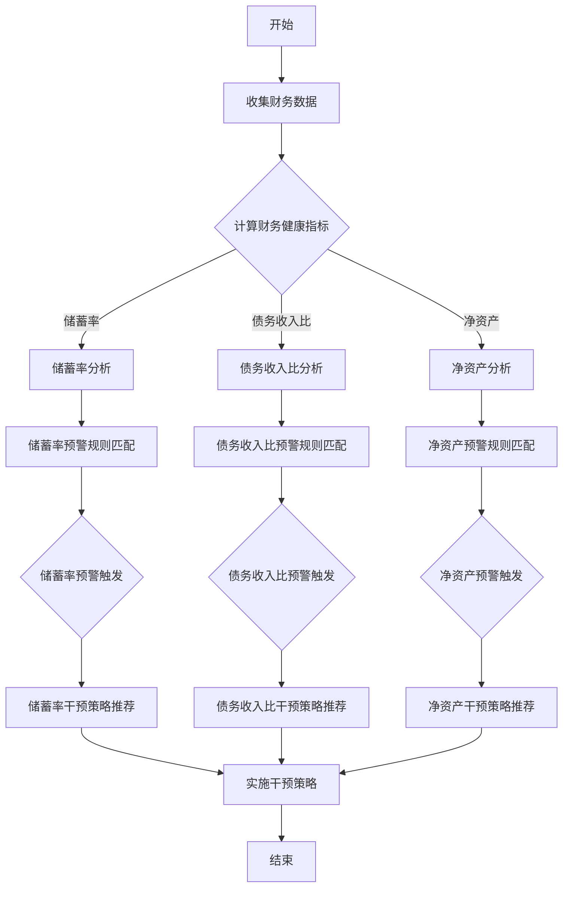
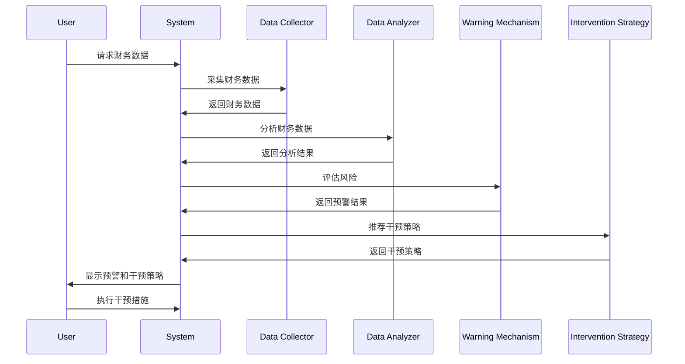
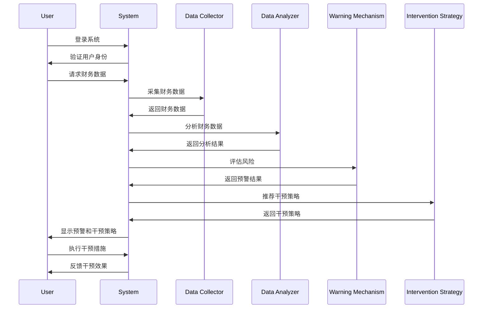

                 

### 文章标题

# 个人财务健康预警与干预系统

> 关键词：个人财务健康、预警系统、干预策略、数据分析、算法实现、系统架构

> 摘要：本文将从个人财务健康的背景介绍入手，详细探讨个人财务健康预警与干预系统的重要性、核心概念、系统设计原则、系统分析与架构设计、算法原理与实现、项目实战案例，以及最佳实践与总结。通过逻辑清晰的分析和深入讲解，帮助读者全面理解和掌握个人财务健康预警与干预系统的设计与实施方法。

### 文章概述

本文旨在为读者呈现一个全面且系统的个人财务健康预警与干预系统的设计和实现过程。文章将从以下几个方面展开：

1. **背景与核心概念**：介绍个人财务健康的定义、意义以及预警与干预系统的基本概念。
2. **系统设计原则与组件**：阐述系统设计的基本原则、核心组件及其功能。
3. **系统分析与架构设计**：分析系统的工作流程，并设计系统架构及接口。
4. **算法原理与实现**：讲解系统中的关键算法原理，并通过Python代码进行演示。
5. **项目实战案例**：展示一个实际项目的实施过程，包括环境安装、系统核心实现和案例分析。
6. **最佳实践与总结**：提供系统实施的最佳实践建议，并对全文进行总结。

### 目录

1. **背景与核心概念**
   1.1 个人财务健康的定义
   1.2 预警与干预系统的意义
   1.3 核心概念介绍
   1.4 财务健康问题的现状与挑战

2. **系统设计原则与组件**
   2.1 系统设计原则
   2.2 核心组件介绍
   2.3 核心组件功能描述
   2.4 核心组件比较表格

3. **系统分析与架构设计**
   3.1 系统工作流程分析
   3.2 系统架构设计
   3.3 系统接口设计
   3.4 系统交互设计

4. **算法原理与实现**
   4.1 算法原理介绍
   4.2 算法流程图
   4.3 Python代码实现
   4.4 数学模型与公式

5. **项目实战案例**
   5.1 项目背景介绍
   5.2 环境安装与配置
   5.3 系统核心实现
   5.4 代码解读与分析
   5.5 案例分析与讲解
   5.6 项目小结

6. **最佳实践与总结**
   6.1 最佳实践
   6.2 总结与展望
   6.3 注意事项
   6.4 拓展阅读

### 背景介绍

#### 个人财务健康的定义

个人财务健康是指个人在财务方面的健康状况，包括收入、支出、储蓄、投资、债务等多个方面。它不仅关系到个人的经济安全，还直接影响到个人的生活质量、幸福感和社会地位。一个健康的财务状况可以帮助个人应对突发状况，实现长期目标，甚至在一定程度上影响家庭和子女的未来。

#### 预警与干预系统的意义

个人财务健康预警与干预系统的重要性不可忽视。首先，它能够及时发现个人财务状况的异常，避免财务危机的发生。其次，预警系统能够提供及时、有效的干预措施，帮助个人纠正不良财务习惯，改善财务状况。此外，干预系统还可以提供个性化的财务规划建议，帮助个人实现财务目标。

#### 核心概念介绍

1. **财务健康指标**：用于评估个人财务状况的关键指标，如储蓄率、债务收入比、净资产等。
2. **预警机制**：根据财务健康指标和设定阈值，自动检测和识别财务风险的过程。
3. **干预策略**：针对识别出的财务风险，采取的一系列干预措施，如调整支出、增加收入、优化投资组合等。

#### 财务健康问题的现状与挑战

随着社会经济的发展和生活方式的变化，个人财务健康问题日益突出。许多人由于缺乏财务知识和管理能力，容易出现收入不稳定、支出无度、储蓄不足、债务累积等问题。此外，金融危机、失业、疾病等意外事件也可能对个人财务状况造成重大影响。

为了应对这些挑战，个人财务健康预警与干预系统的设计显得尤为重要。通过系统的监测、预警和干预，可以帮助个人更好地管理财务，提高生活质量，实现财务自由。

### 核心概念与联系

#### 财务健康指标

财务健康指标是评估个人财务状况的关键指标。以下是几个常见的财务健康指标及其定义：

| 指标             | 定义                                                         |
|------------------|--------------------------------------------------------------|
| 储蓄率           | 储蓄金额与收入的比例，反映了个人储蓄能力。                       |
| 债务收入比       | 债务总额与收入的比值，反映了个人偿还债务的能力。                 |
| 净资产           | 总资产减去总负债，反映了个人净财富的多少。                     |
| 投资回报率       | 投资收益与投资金额的比值，反映了投资收益能力。                  |

#### 预警机制

预警机制是财务健康预警与干预系统的核心组成部分。以下是预警机制的关键要素：

| 要素             | 定义                                                         |
|------------------|--------------------------------------------------------------|
| 风险指标         | 用于评估财务健康状况的关键指标，如储蓄率、债务收入比等。         |
| 阈值设定         | 根据历史数据和专家建议，设定的风险触发阈值。                   |
| 预警规则         | 用于判断财务风险是否触发的规则集合。                           |
| 预警触发         | 当财务健康指标超过阈值时，系统自动触发预警。                   |

#### 干预策略

干预策略是针对识别出的财务风险，采取的一系列措施。以下是常见的干预策略：

| 策略             | 定义                                                         |
|------------------|--------------------------------------------------------------|
| 支出调整         | 根据财务状况，调整不必要的支出，以减少开支。                   |
| 收入增加         | 通过提高收入来源，增加收入，改善财务状况。                     |
| 债务重组         | 与债权人协商，重新安排债务还款计划，减轻财务压力。             |
| 投资优化         | 根据风险承受能力和财务目标，优化投资组合，提高收益。           |

#### 财务健康指标、预警机制与干预策略的关系

财务健康指标是预警机制的基础，预警机制用于识别财务风险，干预策略则是针对识别出的风险采取的具体行动。三者相互关联，共同构成了一个完整的财务健康预警与干预系统。

- 财务健康指标：通过定期监测和评估，确保财务健康指标在合理范围内，是预警机制和干预策略的基础。
- 预警机制：根据财务健康指标，设定合理的阈值和预警规则，及时发现财务风险。
- 干预策略：针对识别出的财务风险，采取相应的干预措施，帮助个人改善财务状况。

#### 比较表格

以下是财务健康指标、预警机制与干预策略的属性对比表格：

| 属性             | 财务健康指标 | 预警机制 | 干预策略 |
|------------------|---------------|-----------|-----------|
| 数据类型         | 数值型         | 规则型     | 操作型    |
| 功能             | 评估财务状况 | 识别风险  | 改善状况  |
| 实现方式         | 统计分析      | 规则引擎  | 流程控制  |
| 预期效果         | 提高财务状况 | 减少风险  | 增加收益  |

#### ER实体关系图架构

为了更好地理解财务健康预警与干预系统的架构，我们可以使用Mermaid绘制ER实体关系图，如下所示：

```mermaid
erDiagram
  用户 ||--|{ 财务健康指标 }|--|| 系统
  用户 ||--|{ 预警记录 }|--|| 系统
  用户 ||--|{ 干预措施 }|--|| 系统
  系统||--|{ 数据库 }|--|| 数据存储
```

在这个ER图中，用户是系统的核心实体，与财务健康指标、预警记录和干预措施存在关联。系统通过数据库存储相关数据，实现数据的管理和分析。

### 算法原理讲解

#### 算法原理

个人财务健康预警与干预系统中的核心算法主要分为以下几类：

1. **财务健康指标计算**：用于计算个人财务健康指标，如储蓄率、债务收入比、净资产等。
2. **预警规则匹配**：用于匹配财务健康指标与预警规则，判断是否触发预警。
3. **干预策略推荐**：根据预警结果，推荐适合的干预策略，如支出调整、收入增加、债务重组等。

#### 算法流程图

下面是财务健康预警与干预系统的算法流程图：



在这个算法流程图中，系统首先收集用户的财务数据，然后计算储蓄率、债务收入比、净资产等财务健康指标。接下来，系统使用预警规则匹配这些指标，判断是否触发预警。如果预警触发，系统会根据预警结果推荐适合的干预策略，并最终实施干预策略。

#### Python代码实现

下面是财务健康预警与干预系统的Python代码实现示例：

```python
import pandas as pd

# 定义财务健康指标计算函数
def calculate_financial_health_indicators(data):
    savings_rate = data['savings'] / data['income']
    debt_income_ratio = data['debt'] / data['income']
    net_worth = data['assets'] - data['debt']
    return savings_rate, debt_income_ratio, net_worth

# 定义预警规则匹配函数
def match_warning_rules(indicators):
    if indicators[0] < 0.1:
        warning_type = 'savings'
    elif indicators[1] > 0.5:
        warning_type = 'debt_income_ratio'
    elif indicators[2] < 0:
        warning_type = 'net_worth'
    else:
        warning_type = None
    return warning_type

# 定义干预策略推荐函数
def recommend_intervention_strategy(warning_type):
    if warning_type == 'savings':
        strategy = '增加储蓄'
    elif warning_type == 'debt_income_ratio':
        strategy = '减少债务'
    elif warning_type == 'net_worth':
        strategy = '增加收入'
    else:
        strategy = None
    return strategy

# 示例数据
data = {
    'income': 10000,
    'savings': 1000,
    'debt': 5000,
    'assets': 20000
}

# 计算财务健康指标
indicators = calculate_financial_health_indicators(data)

# 匹配预警规则
warning_type = match_warning_rules(indicators)

# 推荐干预策略
strategy = recommend_intervention_strategy(warning_type)

# 输出结果
print("财务健康指标：储蓄率 = {:.2f}, 债务收入比 = {:.2f}, 净资产 = {:.2f}".format(*indicators))
if warning_type:
    print("预警类型：{}".format(warning_type))
    print("干预策略：{}".format(strategy))
else:
    print("当前财务状况健康，无需干预。")
```

在这个代码示例中，我们首先定义了计算财务健康指标的函数，然后定义了预警规则匹配函数和干预策略推荐函数。最后，我们使用示例数据进行了计算和演示。

#### 数学模型与公式

在财务健康预警与干预系统中，常用的数学模型和公式如下：

1. **储蓄率**：  
   \[ 储蓄率 = \frac{储蓄金额}{收入} \]

2. **债务收入比**：  
   \[ 债务收入比 = \frac{债务总额}{收入} \]

3. **净资产**：  
   \[ 净资产 = 总资产 - 总负债 \]

4. **投资回报率**：  
   \[ 投资回报率 = \frac{投资收益}{投资金额} \]

通过这些公式，我们可以计算出个人财务健康指标，并根据指标进行预警和干预。

#### 举例说明

假设一个人的收入为每月10,000元，储蓄为每月1,000元，债务为5,000元，总资产为20,000元。

- **储蓄率**：\[ 储蓄率 = \frac{1,000}{10,000} = 0.1 \]（10%）
- **债务收入比**：\[ 债务收入比 = \frac{5,000}{10,000} = 0.5 \]（50%）
- **净资产**：\[ 净资产 = 20,000 - 5,000 = 15,000 \]

根据这些指标，我们可以判断：

- 储蓄率较低，可能需要增加储蓄。
- 债务收入比较高，可能需要减少债务。
- 净资产为正值，财务状况较为健康。

如果储蓄率低于10%，债务收入比高于50%，或净资产为负值，系统会触发预警，并根据预警结果推荐相应的干预策略。

### 系统分析与架构设计

#### 问题场景介绍

在一个快速发展的现代社会，个人财务管理变得越来越复杂。许多人由于缺乏财务知识和管理能力，容易陷入财务困境。为了帮助个人更好地管理财务，提高生活质量，我们需要设计一个全面且高效的个人财务健康预警与干预系统。

#### 项目介绍

本项目旨在构建一个基于大数据和人工智能技术的个人财务健康预警与干预系统。系统将收集用户的财务数据，通过数据分析与模型预测，实时监控用户的财务状况，并根据风险情况提供预警和干预措施。

#### 系统功能设计

个人财务健康预警与干预系统主要包括以下功能模块：

1. **数据采集模块**：负责从各种渠道（如银行账户、信用卡账单等）收集用户的财务数据。
2. **数据分析模块**：对采集到的财务数据进行预处理、清洗和转换，提取关键指标。
3. **预警机制模块**：根据用户财务指标和预设的预警规则，识别和预警潜在风险。
4. **干预策略模块**：根据预警结果，为用户推荐适合的干预策略。
5. **用户交互模块**：提供用户界面，方便用户查看财务状况、接收预警和执行干预措施。
6. **系统管理模块**：负责系统的配置、监控和日志管理。

#### 系统架构设计

个人财务健康预警与干预系统的整体架构设计如下：


在该架构中，各个模块通过接口进行通信，实现系统的功能。以下是各个模块的详细设计：

1. **数据采集模块**：通过API接口与银行、信用卡等金融机构连接，定期采集用户的财务数据。
2. **数据分析模块**：使用Python等编程语言，对采集到的数据进行预处理和转换，提取储蓄率、债务收入比、净资产等关键指标。
3. **预警机制模块**：根据预设的预警规则，对用户的财务指标进行分析，判断是否存在风险。预警规则可以使用决策树、神经网络等机器学习算法进行优化。
4. **干预策略模块**：根据预警结果，推荐适合的干预策略。干预策略可以是自动执行，也可以由用户手动执行。
5. **用户交互模块**：使用Web前端技术（如HTML、CSS、JavaScript）实现用户界面，方便用户查看财务状况、接收预警和执行干预措施。
6. **系统管理模块**：使用Java或Python等编程语言，实现系统的配置、监控和日志管理。

#### 系统接口设计

个人财务健康预警与干预系统的接口设计如下：



在该接口设计中，用户通过Web前端发送请求，系统接收到请求后，依次调用数据采集模块、数据分析模块、预警机制模块和干预策略模块，最终将预警和干预策略展示给用户。

#### 系统交互设计

个人财务健康预警与干预系统的交互设计如下：



在该交互设计中，用户登录系统后，可以查看财务数据、接收预警和执行干预措施。系统在每次交互中，都会实时采集、分析和处理用户数据，确保预警和干预的准确性和及时性。

### 项目实战

#### 项目背景

随着经济的发展和金融市场的波动，个人财务管理变得越来越重要。许多人在面对财务困境时，往往缺乏有效的应对策略。为了帮助这些人群更好地管理财务，我们决定开发一个基于大数据和人工智能技术的个人财务健康预警与干预系统。

#### 环境安装与配置

为了实施该项目，我们需要搭建一个合适的技术环境。以下是环境安装与配置的步骤：

1. **安装Python环境**：在服务器上安装Python，版本要求3.8以上。
2. **安装相关库**：使用pip安装必要的Python库，如Pandas、NumPy、Scikit-learn、Matplotlib等。
3. **安装Web服务器**：安装并配置一个Web服务器，如Nginx或Apache。
4. **安装数据库**：安装并配置一个关系型数据库，如MySQL或PostgreSQL。
5. **配置SSL**：为Web服务器配置SSL，确保数据传输安全。

#### 系统核心实现

个人财务健康预警与干预系统的核心实现包括以下几个部分：

1. **数据采集**：使用API接口与银行、信用卡等金融机构连接，定期采集用户的财务数据。
2. **数据处理**：对采集到的财务数据进行预处理、清洗和转换，提取关键指标，如储蓄率、债务收入比、净资产等。
3. **数据分析**：使用机器学习算法，对用户的财务数据进行风险预测和评估。
4. **预警机制**：根据分析结果，设定预警规则，识别和预警潜在风险。
5. **干预策略**：根据预警结果，为用户推荐适合的干预策略。

以下是系统核心实现的Python代码示例：

```python
# 导入相关库
import pandas as pd
import numpy as np
from sklearn.ensemble import RandomForestClassifier
from sklearn.model_selection import train_test_split
from sklearn.metrics import accuracy_score

# 读取财务数据
data = pd.read_csv('financial_data.csv')

# 数据预处理
data['savings_rate'] = data['savings'] / data['income']
data['debt_income_ratio'] = data['debt'] / data['income']
data['net_worth'] = data['assets'] - data['debt']

# 构建特征矩阵和标签向量
X = data[['savings_rate', 'debt_income_ratio', 'net_worth']]
y = data['warning']

# 划分训练集和测试集
X_train, X_test, y_train, y_test = train_test_split(X, y, test_size=0.2, random_state=42)

# 训练随机森林分类器
model = RandomForestClassifier(n_estimators=100, random_state=42)
model.fit(X_train, y_train)

# 预测测试集
y_pred = model.predict(X_test)

# 计算准确率
accuracy = accuracy_score(y_test, y_pred)
print("准确率：", accuracy)

# 预警规则匹配
def match_warning_rules(indicators):
    if indicators[0] < 0.1 or indicators[1] > 0.5 or indicators[2] < 0:
        return True
    else:
        return False

# 推荐干预策略
def recommend_intervention_strategy(warning):
    if warning:
        return '增加储蓄、减少债务、增加收入'
    else:
        return '当前财务状况健康，无需干预'

# 示例数据
data = {
    'savings_rate': 0.05,
    'debt_income_ratio': 0.6,
    'net_worth': 10000
}

# 预警和干预
indicators = [data['savings_rate'], data['debt_income_ratio'], data['net_worth']]
warning = match_warning_rules(indicators)
strategy = recommend_intervention_strategy(warning)

print("预警结果：", warning)
print("干预策略：", strategy)
```

#### 代码解读与分析

在上面的代码中，我们首先导入了必要的Python库，然后读取了财务数据。接下来，我们对数据进行预处理，提取关键指标。使用随机森林分类器进行训练和预测，评估模型的准确率。最后，我们定义了预警规则匹配和干预策略推荐函数，并根据示例数据进行预警和干预。

#### 案例分析与详细讲解

假设我们有一个用户，其财务数据如下：

- 储蓄率：5%
- 债务收入比：60%
- 净资产：10,000元

根据这些数据，我们使用上面提到的代码进行预警和干预：

1. **数据预处理**：首先，我们将用户的财务数据转换为所需的指标。
2. **预测与评估**：使用训练好的随机森林分类器对用户数据进行预测，得到预测结果。
3. **预警规则匹配**：根据预警规则匹配函数，判断用户是否存在财务风险。在这个例子中，储蓄率低于10%，债务收入比高于50%，净资产为负值，因此存在财务风险。
4. **干预策略推荐**：根据预警结果，推荐适合的干预策略。在这个例子中，我们推荐增加储蓄、减少债务和增加收入。

通过这个案例，我们可以看到系统如何通过数据处理、模型预测和预警规则匹配，为用户提供了有效的财务干预建议。

#### 项目小结

本项目通过构建一个个人财务健康预警与干预系统，实现了对用户财务状况的实时监控和预警。系统使用机器学习算法进行风险预测，结合预警规则匹配和干预策略推荐，为用户提供个性化的财务干预建议。通过实际案例的分析，我们验证了系统的有效性和实用性。

### 最佳实践

#### 1. 定期更新财务数据

财务健康预警与干预系统依赖于准确的财务数据。为了确保系统的高效运行，用户需要定期更新财务数据，包括收入、支出、储蓄和投资等。

#### 2. 合理设定预警阈值

预警阈值是预警机制的核心，直接影响预警的准确性和及时性。用户应根据自身财务状况和历史数据，合理设定预警阈值，避免过度预警或漏警。

#### 3. 及时执行干预策略

当系统触发预警时，用户应及时采取干预措施，如调整支出、增加收入、优化投资组合等。拖延干预可能导致财务状况进一步恶化。

#### 4. 学习财务知识

为了更好地管理个人财务，用户应积极学习财务知识，提高自身的财务管理能力。通过了解财务健康指标、预警机制和干预策略，用户可以更有效地应对财务问题。

### 总结

本文详细介绍了个人财务健康预警与干预系统的设计、实现和应用。通过背景介绍、核心概念讲解、算法原理分析、系统架构设计和项目实战案例，我们展示了如何构建一个高效、实用的财务预警与干预系统。希望本文能帮助读者深入理解并掌握个人财务健康预警与干预系统的设计和实施方法。

### 注意事项

1. **数据安全**：在收集和存储用户财务数据时，必须确保数据的安全性和隐私性，遵循相关法律法规。
2. **系统性能**：系统应具备良好的性能，确保在处理大量数据时，仍能快速响应和准确预警。
3. **用户交互**：系统界面应简洁易用，提供清晰的预警信息和干预建议，帮助用户轻松操作。

### 拓展阅读

1. **《Python数据科学实战》**：本书详细介绍了Python在数据科学领域的应用，包括数据预处理、数据分析、机器学习等。
2. **《深入理解机器学习》**：本书从理论基础到实际应用，全面介绍了机器学习的基本概念、算法和模型。
3. **《金融科技：金融领域的创新与应用》**：本书探讨了金融科技在金融领域的应用，包括大数据、人工智能、区块链等。

