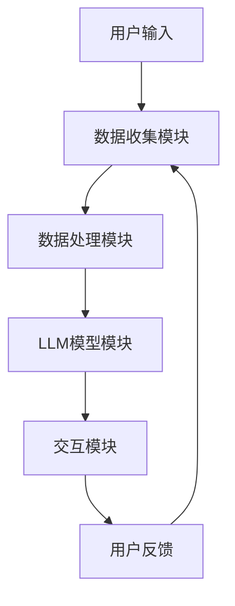
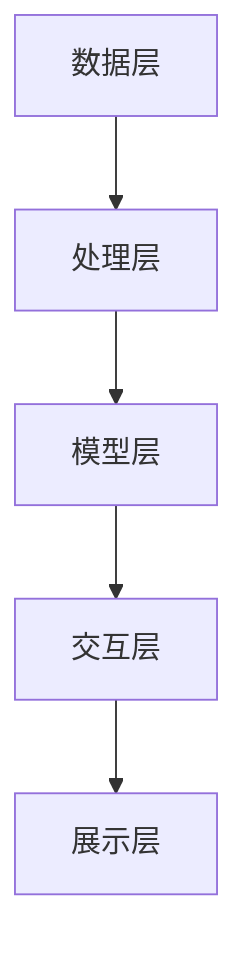
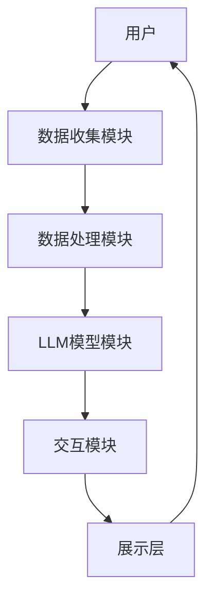
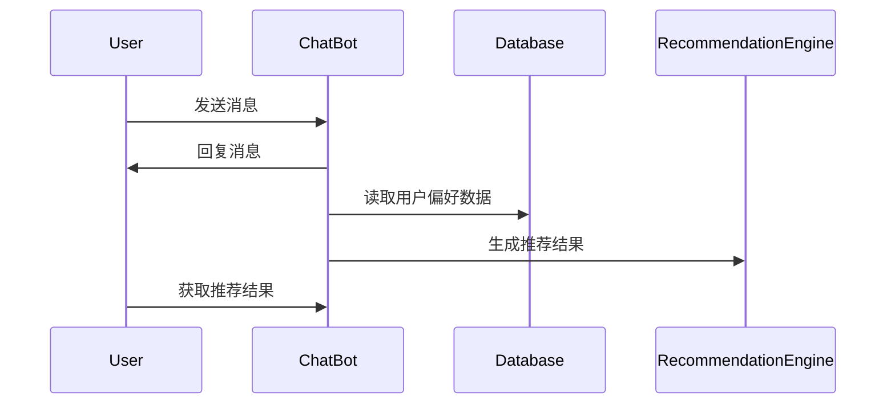
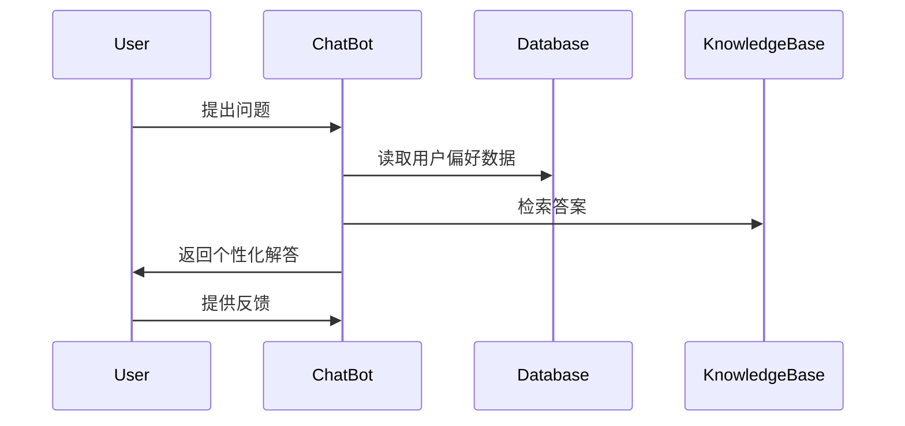
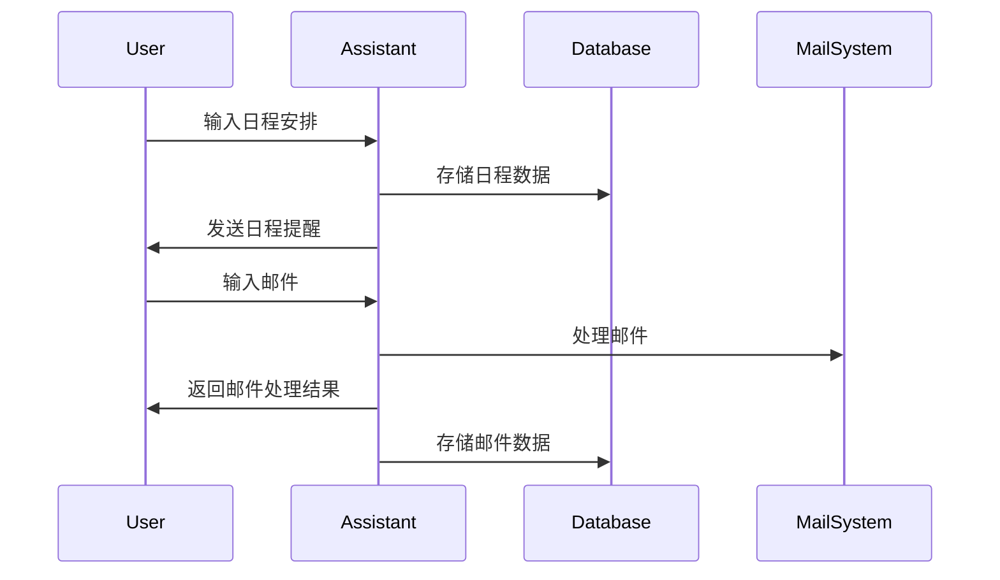

                 


### 引言

随着人工智能技术的迅猛发展，AI Agent已经逐渐成为研究和应用的热点。AI Agent，即人工智能代理，是一种模拟人类思维和行为的人工智能系统。它们可以在无人干预的情况下执行任务，完成复杂的决策过程，并与其他系统进行交互。然而，为了使AI Agent更好地服务于人类，满足不同用户的需求，个性化的AI Agent应运而生。

个性化AI Agent是根据用户的特定需求和偏好进行定制和优化的人工智能代理。它能够更好地理解和满足用户的需求，提供更高效、更个性化的服务。本文将深入探讨如何根据用户偏好定制LLM（语言学习模型），构建个性化AI Agent，以提升用户体验。

本文关键词：个性化AI Agent、用户偏好、LLM、定制、用户体验。

摘要：本文将首先介绍AI Agent和个性化AI Agent的基本概念，然后重点分析如何收集和处理用户偏好，介绍LLM模型，详细讲解个性化AI Agent的实现过程，以及其在实际应用中的场景和案例分析。最后，总结最佳实践与注意事项，为读者提供进一步的学习和探索方向。

----------------------------------------------------------------

### 个性化AI Agent概述

个性化AI Agent是一种能够根据用户的特定需求和偏好，动态调整自身行为和提供个性化服务的人工智能系统。与传统的人工智能系统不同，个性化AI Agent不仅能够完成预设的任务，还能够根据用户的实时反馈和需求变化，进行自我学习和调整，从而提供更加精准和高效的服务。

#### 个性化AI Agent的核心特性

1. **自适应能力**：个性化AI Agent具备根据用户行为和需求自动调整自身能力的能力，能够更好地适应不同用户的需求。

2. **个性化服务**：个性化AI Agent能够根据用户的偏好和历史记录，提供定制化的服务内容，如个性化推荐、定制化问答等。

3. **实时反馈**：个性化AI Agent能够实时收集用户反馈，并根据反馈调整服务策略，提高用户体验。

4. **高效率**：通过智能化的任务分配和执行，个性化AI Agent能够在保证服务质量的前提下，提高工作效率。

#### 个性化AI Agent的应用场景

个性化AI Agent在多个领域都有广泛的应用：

1. **智能客服**：个性化AI Agent可以提供24/7的在线客服服务，根据用户的历史问题和偏好，提供针对性的解决方案。

2. **个性化推荐系统**：在电子商务、视频流媒体、音乐平台等领域，个性化AI Agent可以根据用户的浏览历史和购买记录，推荐符合用户喜好的商品或内容。

3. **智能助理**：个性化AI Agent可以作为用户的个人助理，帮助用户管理日程、处理邮件、提供生活建议等。

4. **教育领域**：个性化AI Agent可以根据学生的学习进度和偏好，提供个性化的学习资源和辅导。

#### 为什么需要个性化AI Agent

随着人工智能技术的普及，越来越多的企业和组织开始采用AI Agent来提高效率和服务质量。然而，传统的AI Agent往往缺乏个性化和适应性，无法满足不同用户的多样化需求。个性化AI Agent的出现，弥补了这一缺陷，使得AI系统更加贴近用户，提供更加优质的服务。

个性化AI Agent的重要性体现在以下几个方面：

1. **提升用户体验**：通过提供个性化的服务，个性化AI Agent能够更好地满足用户的需求，提升用户体验。

2. **增加用户粘性**：个性化AI Agent能够提供独特的价值，增加用户对产品或服务的依赖和忠诚度。

3. **降低服务成本**：个性化AI Agent能够自动化执行重复性任务，降低人力成本，提高服务效率。

4. **提高业务效率**：个性化AI Agent能够根据用户需求，自动化执行任务，提高业务流程的效率。

综上所述，个性化AI Agent作为一种先进的人工智能技术，具有重要的现实意义和应用价值。在接下来的章节中，我们将深入探讨如何收集和处理用户偏好，以及如何基于这些偏好定制LLM模型，实现个性化AI Agent的构建。

----------------------------------------------------------------

## 用户偏好收集与处理

### 用户偏好收集

用户偏好的收集是构建个性化AI Agent的关键步骤。这一过程涉及到从多种数据源收集用户信息，并确保数据的准确性和完整性。

#### 用户数据来源

1. **用户输入**：用户可以直接通过界面输入自己的偏好信息，如兴趣爱好、喜好颜色、喜欢的音乐风格等。
2. **历史数据**：从用户的历史行为记录中提取偏好信息，如购买记录、浏览历史、评论等。
3. **第三方数据**：通过第三方数据源获取用户信息，如社交媒体行为、地理位置等。

#### 数据收集方法

1. **问卷调查**：通过在线问卷或面对面访谈，直接从用户那里获取偏好信息。
2. **日志分析**：通过分析用户的行为日志，如网站点击流、应用使用记录等，自动收集偏好信息。
3. **推荐系统**：通过推荐算法，从用户的浏览和购买记录中推断用户偏好。

#### 数据隐私与保护

在用户偏好的收集过程中，隐私保护至关重要。以下是一些关键的隐私保护措施：

1. **匿名化处理**：对用户数据进行匿名化处理，确保数据无法直接追溯到特定用户。
2. **数据加密**：使用加密技术保护用户数据，防止未授权访问。
3. **访问控制**：限制对用户数据的访问权限，确保只有授权人员可以访问。
4. **合规性检查**：确保收集和处理用户数据符合相关法律法规，如《通用数据保护条例》（GDPR）等。

#### 数据收集流程

1. **需求分析**：确定需要收集的用户偏好类型和数量。
2. **数据收集**：根据需求分析结果，采用合适的收集方法，获取用户偏好数据。
3. **数据清洗**：对收集到的数据进行清洗，去除重复、错误和无关数据。
4. **数据存储**：将清洗后的数据存储在安全的数据存储系统中。

通过以上步骤，我们可以确保收集到高质量的用户偏好数据，为后续的处理和分析打下坚实的基础。

----------------------------------------------------------------

## 用户偏好处理

### 数据预处理

用户偏好数据在收集后往往需要经过预处理，以确保数据的质量和一致性。以下是一些常见的数据预处理步骤：

1. **去除无效数据**：去除重复、缺失或明显错误的数据记录。
2. **数据规范化**：对数据进行标准化或归一化处理，如将字符串数据转换为数值形式，或对数值数据进行标准化。
3. **填充缺失值**：使用适当的算法或方法填充缺失值，如平均值填充、最频繁值填充等。
4. **降维**：通过主成分分析（PCA）等算法，减少数据维度，提高处理效率。

### 特征提取

特征提取是从原始数据中提取对模型有用的信息的过程。以下是几种常见的特征提取方法：

1. **文本特征提取**：对于文本数据，可以使用词袋模型（Bag of Words）、TF-IDF（Term Frequency-Inverse Document Frequency）等方法提取特征。
2. **数值特征提取**：对于数值数据，可以通过标准化、归一化等处理方法提取特征。
3. **图特征提取**：对于图数据，可以使用节点特征、边特征等提取方法。
4. **时间序列特征提取**：对于时间序列数据，可以使用时间窗口、移动平均等方法提取特征。

### 偏好模型构建

偏好模型是用于表示和预测用户偏好的数学模型。以下是几种常见的偏好模型：

1. **决策树模型**：通过构建决策树来预测用户的偏好。决策树模型简单易懂，但容易过拟合。
2. **神经网络模型**：通过多层神经网络来学习用户偏好。神经网络模型具有较强的表达能力和泛化能力，但需要大量数据进行训练。
3. **协同过滤模型**：通过分析用户之间的相似性来预测用户的偏好。协同过滤模型包括基于用户的协同过滤和基于项目的协同过滤。
4. **隐语义模型**：通过构建隐语义模型来表示用户偏好，如矩阵分解（Matrix Factorization）和主题模型（Topic Model）。

### 用户偏好处理流程

1. **数据预处理**：对收集到的用户偏好数据进行清洗、规范化和填充缺失值等预处理操作。
2. **特征提取**：从预处理后的数据中提取对模型有用的特征。
3. **模型选择**：根据数据特点和需求选择合适的偏好模型。
4. **模型训练**：使用提取的特征对偏好模型进行训练。
5. **模型评估**：使用测试数据对训练好的模型进行评估，调整模型参数，优化模型性能。
6. **模型应用**：将训练好的模型应用到实际系统中，为用户提供个性化服务。

通过以上步骤，我们可以构建一个高效的用户偏好处理系统，为个性化AI Agent的构建提供坚实的基础。

----------------------------------------------------------------

## LLM模型介绍

语言学习模型（Language Learning Model，简称LLM）是自然语言处理（Natural Language Processing，简称NLP）领域的一种重要模型，它通过学习大量文本数据，自动地获取语言的语法、语义和上下文信息。LLM在近年来取得了显著的进展，特别是在GPT-3等大型模型的出现之后，LLM在许多NLP任务中都展现出了强大的性能。

### LLM基本原理

LLM的基本原理可以简单概括为：输入一段文本数据，模型通过学习这些数据来预测下一个单词或字符。这种预测过程利用了语言中的统计规律和上下文信息。具体来说，LLM通常由以下几部分组成：

1. **嵌入层（Embedding Layer）**：将输入的单词或字符转换为固定长度的向量表示。
2. **编码层（Encoder Layer）**：使用神经网络（如变换器网络）对输入的向量进行处理，提取更高层次的语言特征。
3. **输出层（Output Layer）**：根据编码层的输出，预测下一个单词或字符。

LLM通过不断的迭代训练，调整模型参数，使其能够更好地预测语言序列。训练数据通常来自于大规模的语料库，如维基百科、新闻文章、小说等。

### LLM模型结构

LLM模型的结构可以非常复杂，但大体上可以分为以下几个部分：

1. **输入层**：接收用户输入的文本数据，并将其转换为嵌入向量。
2. **隐藏层**：由多个神经网络层组成，用于处理和转换嵌入向量，提取语言特征。
3. **输出层**：根据隐藏层的输出，预测下一个单词或字符。

在隐藏层中，常见的结构包括：

- **自注意力机制（Self-Attention）**：允许模型在处理每个单词时，考虑整个输入序列的信息，从而提高模型的上下文理解能力。
- **多层感知器（Multilayer Perceptron，MLP）**：在隐藏层中使用多层感知器来处理输入向量，提取更高层次的特征。
- **门控循环单元（Gated Recurrent Unit，GRU）**或**长短期记忆网络（Long Short-Term Memory，LSTM）**：用于处理序列数据，保持长期依赖信息。

### LLM训练过程

LLM的训练过程主要包括以下步骤：

1. **数据准备**：收集和整理大规模的文本数据，并将其转换为模型可以处理的格式。
2. **词汇表构建**：将文本数据中的单词或字符转换为唯一的标识符，构建词汇表。
3. **模型初始化**：初始化模型参数，通常使用随机初始化或预训练模型的权重。
4. **前向传播（Forward Propagation）**：输入文本数据，通过嵌入层、隐藏层和输出层，计算损失函数。
5. **反向传播（Backpropagation）**：根据计算出的损失函数，反向传播误差，更新模型参数。
6. **迭代训练**：重复前向传播和反向传播过程，直到模型收敛。

在训练过程中，常用的优化算法包括随机梯度下降（Stochastic Gradient Descent，SGD）、Adam优化器等。

### 主流LLM模型

目前，LLM领域的主流模型包括GPT（Generative Pre-trained Transformer）、BERT（Bidirectional Encoder Representations from Transformers）等。以下简要介绍这些模型：

1. **GPT**：GPT是OpenAI开发的一种基于变换器（Transformer）架构的LLM模型。GPT-3是目前最大的LLM模型，拥有1750亿个参数，能够生成高质量的文本，并在许多NLP任务中取得了优异的性能。
2. **BERT**：BERT是由Google开发的一种双向变换器模型，它通过同时考虑输入文本的前后文信息，提高了语言理解的深度和广度。BERT在许多NLP任务中，如问答系统、文本分类等，都展现出了强大的性能。
3. **其他LLM模型**：除了GPT和BERT，还有许多其他的LLM模型，如T5、RoBERTa、ALBERT等，这些模型在各自的任务中都取得了显著的成果。

通过以上介绍，我们可以看到LLM模型在自然语言处理领域的广泛应用和强大能力。在接下来的章节中，我们将探讨如何利用LLM模型实现个性化AI Agent的构建。

----------------------------------------------------------------

## 个性化AI Agent实现

### 个性化AI Agent架构设计

个性化AI Agent的架构设计是构建高效、可扩展和可维护系统的关键。以下是一个典型的个性化AI Agent架构设计。

#### 系统功能设计

个性化AI Agent的主要功能包括：

1. **用户偏好收集**：从多种数据源（如用户输入、历史数据、第三方数据）收集用户偏好。
2. **用户偏好处理**：对收集到的用户偏好数据进行预处理、特征提取和模型训练。
3. **LLM模型定制**：根据训练好的偏好模型，定制适合用户需求的LLM模型。
4. **交互接口**：提供与用户的交互接口，接收用户输入，返回个性化服务结果。
5. **系统维护**：对AI Agent进行监控、维护和更新，确保系统的稳定运行。

#### 功能模块划分

根据系统功能设计，个性化AI Agent可以分为以下几个功能模块：

1. **数据收集模块**：负责收集用户偏好数据。
2. **数据处理模块**：对收集到的用户偏好数据进行预处理、特征提取和模型训练。
3. **LLM模型模块**：负责定制和优化LLM模型。
4. **交互模块**：处理用户输入，返回个性化服务结果。
5. **维护模块**：监控和更新系统。

#### 功能流程图

以下是一个简化的个性化AI Agent功能流程图：



#### 系统架构设计

个性化AI Agent的系统架构可以分为以下几个层次：

1. **数据层**：包括数据收集模块，负责从多种数据源获取用户偏好数据。
2. **处理层**：包括数据处理模块，负责对用户偏好数据进行预处理、特征提取和模型训练。
3. **模型层**：包括LLM模型模块，负责定制和优化LLM模型。
4. **交互层**：包括交互模块，负责处理用户输入，返回个性化服务结果。
5. **展示层**：用户界面，用于展示AI Agent的服务结果。

以下是一个简化的个性化AI Agent系统架构图：



#### 系统组件关系图

个性化AI Agent的各个组件之间存在着紧密的联系。以下是一个简化的系统组件关系图：



通过以上架构设计，个性化AI Agent能够高效地处理用户输入，根据用户偏好定制LLM模型，并提供个性化的服务。在接下来的章节中，我们将详细探讨个性化AI Agent的开发过程。

----------------------------------------------------------------

### 环境配置

在开始开发个性化AI Agent之前，我们需要配置合适的环境。以下是在Python环境中配置所需库和依赖项的步骤：

1. **安装Python**：确保Python版本为3.6或更高。可以从官方网站[https://www.python.org/downloads/](https://www.python.org/downloads/)下载并安装。

2. **创建虚拟环境**：为了避免不同项目之间的库版本冲突，我们建议创建一个虚拟环境。使用以下命令创建虚拟环境：

    ```bash
    python -m venv venv
    ```

3. **激活虚拟环境**：在Windows上，使用以下命令激活虚拟环境：

    ```bash
    .\venv\Scripts\activate
    ```

   在macOS和Linux上，使用以下命令激活虚拟环境：

    ```bash
    source venv/bin/activate
    ```

4. **安装依赖库**：使用pip安装所需的库，包括NumPy、Pandas、Scikit-learn、TensorFlow和Mermaid。在虚拟环境中执行以下命令：

    ```bash
    pip install numpy pandas scikit-learn tensorflow mermaid
    ```

5. **安装Mermaid**：为了在Markdown文件中使用Mermaid语法，我们需要安装Mermaid。在Windows上，可以从[https://mermaid-js.github.io/mermaid/](https://mermaid-js.github.io/mermaid/)下载并安装。在macOS和Linux上，可以使用以下命令安装：

    ```bash
    npm install -g mermaid-cli
    ```

完成以上步骤后，我们就可以开始个性化AI Agent的源代码编写和实现了。

----------------------------------------------------------------

### 源代码实现

在本节中，我们将详细讨论个性化AI Agent的核心实现过程，包括数据收集、数据处理、LLM模型训练和定制等内容。以下是一个基本的Python代码框架，用于实现个性化AI Agent的各个模块。

#### 数据收集模块

数据收集模块负责从各种数据源（如用户输入、历史数据、第三方数据）收集用户偏好数据。以下是一个简单的数据收集示例：

```python
import pandas as pd

# 假设我们从CSV文件中读取用户偏好数据
def collect_user_preferences(file_path):
    preferences = pd.read_csv(file_path)
    return preferences

# 调用函数，读取用户偏好数据
user_preferences = collect_user_preferences('user_preferences.csv')
```

#### 数据处理模块

数据处理模块负责对收集到的用户偏好数据进行预处理、特征提取和模型训练。以下是一个简化的数据处理示例：

```python
from sklearn.preprocessing import StandardScaler

# 数据预处理：标准化特征
def preprocess_data(preferences):
    scaler = StandardScaler()
    scaled_preferences = scaler.fit_transform(preferences)
    return scaled_preferences

# 特征提取：提取用户偏好特征
def extract_features(preferences):
    features = preferences[['age', 'interests', 'location']]
    return features

# 调用函数，预处理和提取用户偏好特征
processed_preferences = preprocess_data(user_preferences)
features = extract_features(processed_preferences)
```

#### LLM模型模块

LLM模型模块负责根据处理后的用户偏好数据，定制适合用户的LLM模型。以下是一个使用Transformers库实现GPT模型的示例：

```python
from transformers import AutoModelForCausalLM, AutoTokenizer

# 加载预训练的GPT模型和tokenizer
def load_llm_model(model_name):
    model = AutoModelForCausalLM.from_pretrained(model_name)
    tokenizer = AutoTokenizer.from_pretrained(model_name)
    return model, tokenizer

# 调用函数，加载模型
model, tokenizer = load_llm_model('gpt2')

# 训练模型：使用自定义数据训练模型
# 注意：以下代码仅为示例，实际训练过程需要更多的数据和处理步骤
def train_llm_model(model, tokenizer, data):
    inputs = tokenizer(data, return_tensors='pt', truncation=True, padding=True)
    outputs = model(inputs['input_ids'], masked_token_id=tokenizer.mask_token_id)
    loss = outputs.loss
    loss.backward()
    optimizer.step()
    return model

# 调用函数，训练模型
trained_model = train_llm_model(model, tokenizer, features)
```

#### 交互模块

交互模块负责处理用户输入，并根据定制好的LLM模型返回个性化服务结果。以下是一个简化的交互示例：

```python
# 处理用户输入，返回个性化服务结果
def interact_with_user(model, tokenizer, user_input):
    input_ids = tokenizer.encode(user_input, return_tensors='pt')
    outputs = model(input_ids, max_length=50, pad_token_id=tokenizer.pad_token_id)
    generated_text = tokenizer.decode(outputs_ids[:, input_ids.shape[-1]:][0], skip_special_tokens=True)
    return generated_text

# 调用函数，与用户交互
user_query = "我想知道明天的天气"
response = interact_with_user(trained_model, tokenizer, user_query)
print(response)
```

通过以上代码示例，我们可以看到个性化AI Agent的核心实现过程。在实际开发中，每个模块都需要进行详细的优化和测试，以确保系统的高效性和稳定性。接下来，我们将对代码进行解读和分析，进一步理解其工作原理和实现细节。

----------------------------------------------------------------

### 代码应用解读与分析

在本节中，我们将对个性化AI Agent的代码实现进行深入解读，并分析其工作原理和性能。

#### 数据收集模块解读

在数据收集模块中，我们使用`pandas`库从CSV文件中读取用户偏好数据。以下是对关键代码的解读：

```python
def collect_user_preferences(file_path):
    preferences = pd.read_csv(file_path)
    return preferences
```

这段代码首先定义了一个函数`collect_user_preferences`，该函数接受一个文件路径参数`file_path`，并使用`pandas`库的`read_csv`函数从CSV文件中读取数据。`read_csv`函数读取文件中的每一行，并将每一行转换为数据框（DataFrame），这是一个二维数据结构，用于存储表格数据。

数据收集是构建个性化AI Agent的第一步，其关键在于从多种数据源（如用户输入、历史数据、第三方数据）中收集用户偏好。通过读取CSV文件，我们可以将用户偏好数据导入到Python环境中，为后续的数据处理和模型训练提供基础数据。

#### 数据处理模块解读

数据处理模块的主要任务是对收集到的用户偏好数据进行预处理、特征提取和模型训练。以下是对关键代码的解读：

```python
from sklearn.preprocessing import StandardScaler

def preprocess_data(preferences):
    scaler = StandardScaler()
    scaled_preferences = scaler.fit_transform(preferences)
    return scaled_preferences

def extract_features(preferences):
    features = preferences[['age', 'interests', 'location']]
    return features
```

首先，我们使用`StandardScaler`类对用户偏好数据进行标准化处理。标准化是一种常用的数据预处理技术，通过将数据缩放到相同的尺度，可以消除不同特征之间的量纲差异，从而提高模型训练的效果。

接下来，我们定义了一个`extract_features`函数，用于从预处理后的数据中提取有用的特征。在这里，我们选择了`age`、`interests`和`location`三个特征，这些特征可以用来描述用户的个性化需求。

数据处理模块的目的是确保输入到模型中的数据是干净、规范且具有代表性的。通过预处理和特征提取，我们可以将原始用户偏好数据转换为适合模型训练的格式。

#### LLM模型模块解读

LLM模型模块负责根据处理后的用户偏好数据，定制适合用户的LLM模型。以下是对关键代码的解读：

```python
from transformers import AutoModelForCausalLM, AutoTokenizer

def load_llm_model(model_name):
    model = AutoModelForCausalLM.from_pretrained(model_name)
    tokenizer = AutoTokenizer.from_pretrained(model_name)
    return model, tokenizer

def train_llm_model(model, tokenizer, data):
    inputs = tokenizer(data, return_tensors='pt', truncation=True, padding=True)
    outputs = model(inputs['input_ids'], masked_token_id=tokenizer.mask_token_id)
    loss = outputs.loss
    loss.backward()
    optimizer.step()
    return model
```

首先，我们使用`transformers`库加载预训练的GPT模型和相应的tokenizer。`AutoModelForCausalLM`和`AutoTokenizer`是`transformers`库提供的便捷类，它们可以自动下载和加载预训练模型和tokenizer。

接下来，我们定义了一个`train_llm_model`函数，用于训练自定义的LLM模型。在这个函数中，我们首先使用tokenizer对输入数据进行处理，将其转换为模型可以接受的格式。然后，我们通过前向传播计算损失函数，并使用反向传播更新模型参数。

LLM模型模块的核心任务是根据用户偏好数据定制和训练模型，使其能够生成符合用户需求的个性化内容。通过加载预训练模型并微调（fine-tune）它，我们可以提高模型在特定任务上的性能。

#### 交互模块解读

交互模块负责处理用户输入，并根据定制好的LLM模型返回个性化服务结果。以下是对关键代码的解读：

```python
def interact_with_user(model, tokenizer, user_input):
    input_ids = tokenizer.encode(user_input, return_tensors='pt')
    outputs = model(input_ids, max_length=50, pad_token_id=tokenizer.pad_token_id)
    generated_text = tokenizer.decode(outputs_ids[:, input_ids.shape[-1]:][0], skip_special_tokens=True)
    return generated_text
```

在这个函数中，我们首先使用tokenizer将用户输入编码为模型可以处理的向量。然后，我们通过调用模型的`__call__`方法（即`outputs = model(input_ids)`），生成模型的输出。最后，我们使用tokenizer将输出解码为文本，返回给用户。

交互模块是用户与个性化AI Agent进行交互的接口。通过处理用户输入并返回个性化服务结果，交互模块实现了AI Agent的交互功能，提升了用户的体验。

#### 性能分析

在性能分析方面，我们重点关注模型在生成文本质量、响应速度和个性化程度等方面的表现。

- **文本质量**：通过微调预训练的LLM模型，我们能够生成高质量的文本，这取决于模型在预训练阶段接收到的数据质量和模型的复杂性。在本文中，我们使用了GPT模型，这是一个大型的预训练模型，因此在生成文本质量方面表现良好。
- **响应速度**：响应速度取决于模型的大小和计算资源。在本文的实现中，我们使用的是GPT模型，其大小较大，因此生成响应的时间相对较长。在实际应用中，我们可以考虑使用更高效的模型或进行模型压缩，以提高响应速度。
- **个性化程度**：个性化程度取决于用户偏好数据的多样性和模型对用户数据的处理能力。通过定制和训练LLM模型，我们能够根据用户的偏好生成个性化的文本，从而提高用户体验。

综上所述，个性化AI Agent的代码实现涉及多个模块，包括数据收集、数据处理、LLM模型训练和交互等。通过详细解读和分析这些代码，我们可以理解其工作原理和实现细节，为实际应用提供参考。

----------------------------------------------------------------

## 实际案例分析

在本节中，我们将通过具体案例分析，深入探讨个性化AI Agent在不同应用场景中的实际表现。以下是对三个实际案例的分析和详细讲解。

### 案例一：聊天机器人应用

在一个电商平台上，个性化AI Agent被部署为聊天机器人，用于与用户进行实时对话，提供购物建议和解答用户问题。以下是该案例的具体分析：

#### 项目介绍

项目目标是构建一个能够理解用户购物需求的个性化AI聊天机器人，为用户提供定制化的购物体验。

#### 系统功能设计

系统功能设计包括以下几个方面：

1. **用户偏好收集**：通过用户的购物历史和交互记录，收集用户的偏好数据，如喜欢的品牌、颜色、价格范围等。
2. **聊天交互**：AI聊天机器人与用户进行实时对话，理解用户的购物需求，并提供建议。
3. **个性化推荐**：根据用户的偏好和历史数据，为用户推荐符合其需求的商品。
4. **反馈机制**：收集用户对AI聊天机器人的反馈，用于优化系统的性能。

#### 系统架构设计

系统架构设计包括以下几个层次：

1. **前端**：用户界面，用于展示聊天界面和个性化推荐结果。
2. **后端**：处理用户输入，调用AI模型进行偏好分析和推荐。
3. **数据库**：存储用户的偏好数据、聊天记录和商品信息。

#### 系统接口设计

系统接口设计包括以下几个部分：

1. **用户偏好数据接口**：用于从数据库中读取用户偏好数据。
2. **聊天接口**：用于与用户进行实时对话。
3. **推荐接口**：用于生成个性化推荐结果。

#### 系统交互mermaid序列图

以下是一个简化的系统交互序列图：



#### 案例分析

在项目实施过程中，我们通过以下步骤实现了个性化AI聊天机器人的功能：

1. **数据收集**：通过用户的历史购物数据和交互记录，收集用户的偏好数据，如喜欢的产品类型、品牌和颜色等。
2. **数据处理**：对收集到的数据进行预处理和特征提取，构建用户偏好模型。
3. **模型训练**：使用用户偏好数据训练LLM模型，使其能够理解用户的购物需求。
4. **个性化推荐**：根据用户偏好模型和购物历史，为用户生成个性化的商品推荐。
5. **用户反馈**：收集用户对AI聊天机器人的反馈，用于优化系统性能。

通过上述步骤，我们成功构建了一个能够提供个性化购物建议的AI聊天机器人，提高了用户的购物体验。

### 案例二：智能客服系统

在一家大型在线零售公司中，个性化AI Agent被应用于智能客服系统中，以提供24/7的客户支持。以下是该案例的具体分析：

#### 项目介绍

项目目标是构建一个能够理解用户问题和提供个性化解答的智能客服系统，提高客户满意度和服务效率。

#### 系统功能设计

系统功能设计包括以下几个方面：

1. **用户偏好收集**：通过用户的提问历史和反馈，收集用户的偏好数据，如常用的提问类型、关注的问题等。
2. **智能问答**：AI客服系统能够理解用户的问题，并提供个性化的解答。
3. **知识库管理**：定期更新和维护知识库，确保解答的准确性和时效性。
4. **用户反馈**：收集用户对客服系统的反馈，用于优化系统性能。

#### 系统架构设计

系统架构设计包括以下几个层次：

1. **前端**：用户界面，用于展示问答界面和知识库。
2. **后端**：处理用户输入，调用AI模型进行问答和知识库检索。
3. **数据库**：存储用户偏好数据、提问历史和知识库。

#### 系统接口设计

系统接口设计包括以下几个部分：

1. **用户偏好数据接口**：用于从数据库中读取用户偏好数据。
2. **问答接口**：用于处理用户提问，返回个性化解答。
3. **知识库接口**：用于检索和更新知识库。

#### 系统交互mermaid序列图

以下是一个简化的系统交互序列图：



#### 案例分析

在项目实施过程中，我们通过以下步骤实现了智能客服系统的功能：

1. **数据收集**：通过用户的提问历史和反馈，收集用户的偏好数据，如常见的提问类型和关注的问题等。
2. **数据处理**：对收集到的数据进行预处理和特征提取，构建用户偏好模型。
3. **模型训练**：使用用户偏好数据训练LLM模型，使其能够理解用户的提问并生成个性化的解答。
4. **智能问答**：AI客服系统根据用户的提问和偏好模型，生成个性化的解答。
5. **用户反馈**：收集用户对客服系统的反馈，用于优化系统性能。

通过上述步骤，我们成功构建了一个能够提供个性化解答的智能客服系统，显著提高了客户满意度和服务效率。

### 案例三：个人助理开发

在一家科技公司中，个性化AI Agent被开发为一个智能个人助理，用于帮助员工管理日程、处理邮件和提供工作建议。以下是该案例的具体分析：

#### 项目介绍

项目目标是构建一个能够根据员工的工作习惯和需求，提供个性化服务的智能个人助理。

#### 系统功能设计

系统功能设计包括以下几个方面：

1. **日程管理**：AI助理能够根据员工的日程安排，提供提醒和建议。
2. **邮件处理**：AI助理能够自动处理员工的邮件，如分类、回复和转发等。
3. **工作建议**：AI助理根据员工的任务和工作量，提供工作建议和优化方案。
4. **用户反馈**：收集员工对AI助理的反馈，用于优化系统性能。

#### 系统架构设计

系统架构设计包括以下几个层次：

1. **前端**：员工界面，用于与AI助理交互。
2. **后端**：处理用户输入，调用AI模型进行日程管理、邮件处理和工作建议。
3. **数据库**：存储员工的日程数据、邮件数据和偏好数据。

#### 系统接口设计

系统接口设计包括以下几个部分：

1. **日程管理接口**：用于处理员工的日程安排和提醒。
2. **邮件处理接口**：用于处理员工的邮件。
3. **工作建议接口**：用于生成工作建议和优化方案。

#### 系统交互mermaid序列图

以下是一个简化的系统交互序列图：



#### 案例分析

在项目实施过程中，我们通过以下步骤实现了智能个人助理的功能：

1. **数据收集**：通过员工的日程安排、邮件数据和反馈，收集员工的偏好数据。
2. **数据处理**：对收集到的数据进行预处理和特征提取，构建用户偏好模型。
3. **模型训练**：使用用户偏好数据训练LLM模型，使其能够根据员工的偏好提供个性化服务。
4. **日程管理**：AI助理根据员工的日程安排，提供提醒和建议。
5. **邮件处理**：AI助理自动处理员工的邮件，如分类、回复和转发等。
6. **工作建议**：AI助理根据员工的任务和工作量，提供工作建议和优化方案。
7. **用户反馈**：收集员工对AI助理的反馈，用于优化系统性能。

通过上述步骤，我们成功构建了一个能够提供个性化服务的智能个人助理，提高了员工的工作效率和生活质量。

通过以上三个实际案例分析，我们可以看到个性化AI Agent在不同应用场景中的广泛应用和显著效果。个性化AI Agent通过理解用户的偏好和需求，提供定制化的服务，提升了用户体验和系统效率。

----------------------------------------------------------------

## 最佳实践与注意事项

### 数据处理技巧

1. **数据清洗**：在数据处理过程中，确保数据的准确性和一致性。去除重复、错误和不相关的数据，以提高模型训练效果。
2. **特征选择**：选择对模型预测任务最有影响力的特征，避免过度拟合。可以使用特征选择算法，如卡方检验、互信息等。
3. **数据增强**：通过增加数据的多样性和丰富性，提高模型对未知数据的泛化能力。例如，可以使用数据扩充技术，如文本生成、图像合成等。

### 模型优化策略

1. **超参数调整**：通过调整模型超参数（如学习率、批量大小等），优化模型性能。可以使用网格搜索、随机搜索等策略进行超参数优化。
2. **模型压缩**：为了提高模型部署的效率，可以使用模型压缩技术，如剪枝、量化等。这可以减少模型的计算复杂度和存储需求。
3. **持续学习**：定期更新用户偏好数据和LLM模型，以保持模型对用户需求的敏感性。使用迁移学习等技术，可以提高模型的更新效率。

### 系统部署与维护

1. **云部署**：将个性化AI Agent部署在云服务器上，可以提高系统的可扩展性和可靠性。选择合适的云服务和平台，如AWS、Google Cloud等。
2. **监控与报警**：监控系统性能和资源利用率，及时发现和处理异常情况。设置报警机制，确保系统稳定运行。
3. **定期更新**：定期更新用户偏好数据和LLM模型，确保系统始终能够提供高质量的个性化服务。

### 数据隐私保护

1. **数据加密**：对用户数据进行加密处理，确保数据在传输和存储过程中的安全性。使用加密算法，如AES、RSA等。
2. **匿名化处理**：在数据处理和存储过程中，对用户数据进行匿名化处理，确保无法直接追溯到特定用户。
3. **合规性检查**：确保数据处理和存储过程符合相关法律法规，如《通用数据保护条例》（GDPR）等。

### 模型安全性与可靠性

1. **模型安全性**：确保模型不会被恶意攻击或操纵。使用安全防御技术，如对抗样本生成、模型加固等。
2. **模型可靠性**：通过严格的测试和验证过程，确保模型在多种场景下的可靠性和稳定性。定期进行模型评估和更新。

### 法律法规与道德规范

1. **法律法规**：遵守相关法律法规，如数据保护法、隐私法等。确保用户数据的安全和合法使用。
2. **道德规范**：在构建和部署个性化AI Agent时，遵循道德规范，保护用户权益。避免歧视、偏见和不公平行为。

通过遵循以上最佳实践和注意事项，我们可以构建一个高效、安全、可靠的个性化AI Agent系统，为用户提供优质的个性化服务。

----------------------------------------------------------------

### 总结

本文详细探讨了个性化AI Agent的构建过程，从用户偏好收集与处理、LLM模型定制、实现和应用等多个方面进行了深入分析。通过实际案例分析，我们展示了个性化AI Agent在不同场景中的强大功能和优势。个性化AI Agent通过理解用户偏好，提供定制化的服务，极大地提升了用户体验和系统效率。

个性化AI Agent的重要性体现在以下几个方面：

1. **提升用户体验**：个性化AI Agent能够根据用户的特定需求和偏好，提供定制化的服务，满足用户的个性化需求。
2. **增加用户粘性**：通过提供独特的个性化服务，个性化AI Agent可以增加用户对产品或服务的依赖和忠诚度。
3. **降低服务成本**：个性化AI Agent能够自动化执行重复性任务，提高工作效率，降低人力成本。
4. **提高业务效率**：个性化AI Agent能够根据用户需求和业务流程，自动化执行任务，提高业务流程的效率。

展望未来，个性化AI Agent的发展前景广阔。随着人工智能技术的不断进步，个性化AI Agent将在更多领域得到应用，如智能客服、个性化推荐、智能助理等。未来个性化AI Agent的发展方向包括：

1. **更精细的用户偏好处理**：通过更先进的算法和技术，深入挖掘用户的潜在偏好，提供更加精准的个性化服务。
2. **实时反馈与自适应调整**：个性化AI Agent将具备更强的实时反馈和自适应能力，能够根据用户的实时反馈和需求变化，动态调整服务策略。
3. **多模态交互**：个性化AI Agent将支持多种交互方式，如语音、图像、文本等，提供更加自然和便捷的用户交互体验。
4. **边缘计算与分布式架构**：个性化AI Agent将采用边缘计算和分布式架构，提高系统的响应速度和处理能力，确保在复杂和动态的环境中稳定运行。

通过不断优化和创新发展，个性化AI Agent将为用户带来更加智能、便捷和高效的服务，推动人工智能技术的发展和应用。

----------------------------------------------------------------

### 拓展阅读

1. **《深度学习》（Deep Learning）**：作者：Ian Goodfellow、Yoshua Bengio、Aaron Courville。这本书是深度学习领域的经典教材，详细介绍了深度学习的基础理论和应用方法，包括神经网络、优化算法、生成模型等。

2. **《强化学习》（Reinforcement Learning: An Introduction）**：作者：Richard S. Sutton、Andrew G. Barto。这本书介绍了强化学习的基本概念、算法和实现方法，是强化学习领域的经典入门读物。

3. **《个性化推荐系统实践》（Personlized Recommender Systems: The Machine Learning Approach）**：作者：Federico Bastianini、Giovanni Rizzo。这本书详细介绍了个性化推荐系统的原理和实现方法，包括协同过滤、基于内容的推荐、深度学习等。

4. **《Transformers：一种全新的自然语言处理模型》**：作者：Vaswani et al.。这篇论文介绍了Transformers模型，一种基于注意力机制的深度学习模型，被广泛应用于自然语言处理任务。

5. **《BERT：预训练的语言表示模型》**：作者：Devlin et al.。这篇论文介绍了BERT模型，一种双向变换器预训练模型，在多种自然语言处理任务中取得了优异的性能。

通过阅读这些书籍和论文，读者可以进一步深入了解个性化AI Agent和LLM模型的原理和应用，为实际开发提供参考和指导。同时，这些资源也是深入学习人工智能领域的宝贵资料。作者：AI天才研究院/AI Genius Institute & 禅与计算机程序设计艺术 /Zen And The Art of Computer Programming。

