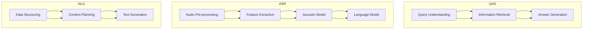
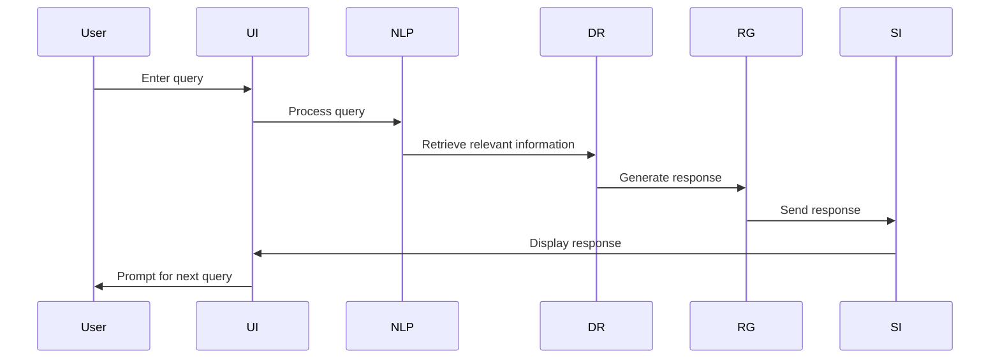

                 


### Introduction and Overview

## Personalized AI Assistant: Crafting User Experience with Prompt Words

Keywords: AI Assistant, Personalization, Prompt Words, User Experience, Customization

Abstract:
This article delves into the concept of personalized AI assistants and explores the role of prompt words in enhancing user experience. We will examine the development background, core concepts, and applications of AI assistants, while focusing on how prompt words can be utilized to tailor user experiences effectively. By the end of this article, readers will have a comprehensive understanding of the intricacies involved in creating a personalized AI assistant that resonates with users.

----------------------------------------------------------------

### Background and Core Concepts

#### The Development Background of Personalized AI Assistants

In recent years, the rapid advancement of artificial intelligence (AI) has led to the emergence of various AI applications, ranging from chatbots to virtual assistants. Among these, personalized AI assistants have garnered significant attention due to their ability to adapt to individual user preferences and behaviors. This has been made possible by advancements in natural language processing (NLP), machine learning (ML), and deep learning (DL) techniques.

#### Core Concepts and Terminology

1. **Natural Language Processing (NLP)**: NLP is a branch of AI that focuses on the interaction between computers and humans through natural language. It involves the application of computational algorithms and statistical models to understand, interpret, and generate human-like text.

2. **Machine Learning (ML)**: ML is a subset of AI that enables systems to learn from data and improve their performance over time without being explicitly programmed. It involves the use of algorithms that can recognize patterns and make predictions based on data inputs.

3. **Deep Learning (DL)**: DL is a subset of ML that utilizes neural networks with many layers to model complex patterns and relationships in data. It has achieved remarkable success in various AI applications, such as image and speech recognition, natural language understanding, and more.

#### Core Concepts and Their Applications

1. **Question-Answering Systems (QAS)**: QAS are designed to provide answers to user queries, using techniques from NLP, ML, and DL to understand and process the questions.

2. **Speech Recognition (ASR)**: ASR converts spoken language into text, enabling users to interact with AI assistants through voice commands.

3. **Natural Language Generation (NLG)**: NLG generates human-like text or speech from structured data or information, allowing AI assistants to communicate with users in a natural and engaging manner.

----------------------------------------------------------------

### Core Concepts and Relationships

In this section, we will delve deeper into the core concepts of personalized AI assistants and explore their relationships with one another.

#### Core Concept Principles

As mentioned earlier, NLP, ML, and DL are the foundational technologies that power personalized AI assistants. Each of these concepts plays a crucial role in enabling the development of advanced AI applications.

1. **NLP**: NLP is essential for understanding and processing human language. It involves tasks such as text classification, sentiment analysis, entity recognition, and machine translation. By leveraging NLP techniques, AI assistants can comprehend user queries and generate appropriate responses.

2. **ML**: ML algorithms enable AI assistants to learn from data and improve their performance over time. Common ML algorithms used in AI assistants include decision trees, support vector machines, and neural networks. These algorithms help AI assistants recognize patterns and make accurate predictions based on user inputs.

3. **DL**: DL is a specialized form of ML that utilizes neural networks with many layers to model complex data structures. DL has revolutionized AI by enabling systems to achieve state-of-the-art performance in tasks such as image recognition, natural language understanding, and speech synthesis.

#### Concept Attribute Comparison Table

To better understand the differences between these concepts, we can create a comparison table that highlights their key attributes:

| Concept        | Definition                                                                                          | Key Attributes                                                                                      |
|----------------|----------------------------------------------------------------------------------------------------|-----------------------------------------------------------------------------------------------------|
| NLP            | Interaction between computers and humans through natural language.                                     | Text processing, language understanding, text generation.                                            |
| ML             | Learning from data to improve performance without explicit programming.                                | Pattern recognition, data prediction.                                                               |
| DL             | Learning from data using neural networks with multiple layers.                                       | Complex data modeling, high accuracy.                                                               |

----------------------------------------------------------------

### Algorithm and Model Explanations

In this section, we will delve into the algorithms and models that form the backbone of personalized AI assistants. These algorithms enable AI assistants to understand user queries, generate appropriate responses, and improve their performance over time.

#### Algorithm Overview

The core algorithms used in personalized AI assistants can be broadly classified into three categories:

1. **Question-Answering Systems (QAS)**: QAS are designed to provide answers to user queries. They typically involve the following steps:
    - **Query Understanding**: Use NLP techniques to understand the user's query.
    - **Information Retrieval**: Search for relevant information in a knowledge base or database.
    - **Answer Generation**: Generate a human-like response based on the retrieved information.

2. **Speech Recognition (ASR)**: ASR converts spoken language into text, enabling users to interact with AI assistants through voice commands. Key steps in ASR include:
    - **Audio Pre-processing**: Remove noise and other unwanted signals from the audio input.
    - **Feature Extraction**: Extract relevant features from the pre-processed audio signal.
    - **Acoustic Model**: Use a trained acoustic model to map the extracted features to phonetic units.
    - **Language Model**: Use a trained language model to convert the phonetic units into text.

3. **Natural Language Generation (NLG)**: NLG generates human-like text or speech from structured data or information. Key steps in NLG include:
    - **Data Structuring**: Organize the input data into a suitable format for processing.
    - **Content Planning**: Determine the structure and content of the generated text.
    - **Text Generation**: Use techniques such as template-based generation or neural network-based generation to create human-like text.

#### Algorithm Flowchart

To illustrate the algorithms mentioned above, we can create a flowchart that outlines the main steps involved in each process:



This flowchart provides a high-level overview of the algorithms used in personalized AI assistants, highlighting the key steps involved in each process.

----------------------------------------------------------------

### Mathematical Models and Formulas

In this section, we will explore the mathematical models and formulas that underpin the algorithms used in personalized AI assistants. These models and formulas are essential for understanding the inner workings of the algorithms and their ability to generate accurate and personalized responses.

#### Common Mathematical Models

1. **Perceptron Model**: The perceptron is a basic neural network model used for binary classification tasks. It works by receiving input features and generating an output based on a weighted sum of the inputs and a bias term. The formula for the perceptron model is:

   $$ y = \text{sign}(w \cdot x + b) $$

   where \( y \) is the predicted output, \( w \) is the weight vector, \( x \) is the input vector, \( b \) is the bias term, and \( \text{sign}() \) is the sign function, which returns 1 if the input is positive and -1 if it is negative.

2. **Neural Network Model**: Neural networks are more complex models that consist of multiple layers of interconnected nodes. The output of a neural network can be represented by the following formula:

   $$ \hat{y} = \sigma(\text{ReLU}(W \cdot x + b)) $$

   where \( \hat{y} \) is the predicted output, \( \sigma() \) is the sigmoid function, \( \text{ReLU}() \) is the rectified linear unit function, \( W \) is the weight matrix, \( x \) is the input vector, and \( b \) is the bias term.

#### Detailed Explanation of Mathematical Models and Formulas

1. **Loss Function**: The loss function is a measure of how well the model is performing. It quantifies the difference between the predicted output \( \hat{y} \) and the actual output \( y \). A commonly used loss function is the mean squared error (MSE):

   $$ \text{MSE} = \frac{1}{2} \sum_{i=1}^{n} (y_i - \hat{y}_i)^2 $$

   where \( n \) is the number of samples in the dataset.

2. **Gradient Descent**: Gradient descent is an optimization algorithm used to minimize the loss function. It works by iteratively adjusting the model parameters \( \theta \) in the direction of the negative gradient of the loss function:

   $$ \theta = \theta - \alpha \nabla_{\theta} J(\theta) $$

   where \( \theta \) is the model parameter, \( \alpha \) is the learning rate, and \( \nabla_{\theta} J(\theta) \) is the gradient of the loss function with respect to \( \theta \).

#### Example: Perceptron Model Application

Consider a simple binary classification problem where we want to separate two classes of data points using a perceptron model. The input features are \( x_1 \) and \( x_2 \), and the output is a binary class label \( y \). The perceptron model can be represented as:

$$ y = \text{sign}(w_1x_1 + w_2x_2 + b) $$

We can use the perceptron model to classify a new data point \( (x_1, x_2) \) by calculating the weighted sum of the input features and the bias term, and then applying the sign function to determine the class label.

----------------------------------------------------------------

### System Analysis and Design

In this section, we will delve into the system analysis and design of personalized AI assistants. This involves understanding the problem context, defining the system requirements, and designing the system architecture and interfaces.

#### Problem Context

Personalized AI assistants are designed to interact with users and provide tailored responses based on their preferences and behaviors. The problem context can be summarized as follows:

- **Users**: Individuals who interact with the AI assistant, seeking information or assistance.
- **Data Sources**: Various data sources, such as user profiles, historical interactions, and external databases, that provide information about user preferences and behaviors.
- **AI Assistant**: A software system that processes user inputs, retrieves relevant information, and generates personalized responses.

#### System Requirements

To design a personalized AI assistant, we need to define the system requirements that the system should meet. These requirements can be categorized into functional and non-functional requirements:

1. **Functional Requirements**:
   - **Understanding User Queries**: The AI assistant should be able to understand and interpret user queries in natural language.
   - **Personalization**: The AI assistant should provide personalized responses based on user preferences and behaviors.
   - **Response Generation**: The AI assistant should generate natural and coherent responses to user queries.

2. **Non-Functional Requirements**:
   - **Scalability**: The system should be able to handle a large number of concurrent users and queries.
   - **Accuracy**: The AI assistant should provide accurate and relevant responses to user queries.
   - **Usability**: The AI assistant should have a user-friendly interface and be easy to use.

#### System Architecture Design

The system architecture of a personalized AI assistant can be designed using a layered approach, with each layer responsible for specific functions. The main layers in the system architecture are:

1. **User Interface Layer**: This layer handles user interactions and provides a user-friendly interface for inputting queries and receiving responses.
2. **Natural Language Processing Layer**: This layer processes user queries using NLP techniques to understand the meaning and intent behind the queries.
3. **Data Retrieval Layer**: This layer retrieves relevant information from data sources, such as user profiles and external databases.
4. **Response Generation Layer**: This layer generates personalized responses based on the user's query and the information retrieved from the data sources.
5. **System Integration Layer**: This layer integrates the various components of the system and ensures smooth communication between them.

#### System Interface Design

The system interfaces define the interactions between the different components of the system. The main system interfaces include:

1. **User Interface**: This interface allows users to input queries and receive responses from the AI assistant.
2. **APIs for Data Sources**: These interfaces enable the AI assistant to access data sources, such as user profiles and external databases, to retrieve relevant information.
3. **APIs for System Integration**: These interfaces facilitate communication between the different components of the system, ensuring seamless integration and operation.

#### System Interaction Sequence Diagram

To illustrate the interactions between the different components of the system, we can create a sequence diagram using Mermaid. The sequence diagram shows the flow of messages between the user interface, natural language processing layer, data retrieval layer, response generation layer, and system integration layer.



This sequence diagram provides a visual representation of the interactions between the different components of the personalized AI assistant system.

----------------------------------------------------------------

### Project Implementation and Case Analysis

In this section, we will delve into the practical implementation of a personalized AI assistant project. We will cover the environment setup, core implementation, and case analysis.

#### Environment Setup

To implement a personalized AI assistant, we need to set up the necessary hardware and software environment. The following are the requirements for the environment setup:

1. **Hardware Requirements**:
   - Processor: Intel i5 or better
   - Memory: 16 GB RAM or more
   - Storage: 500 GB SSD or more

2. **Software Requirements**:
   - Operating System: Linux (Ubuntu 20.04 LTS recommended)
   - Python: Python 3.8 or higher
   - NLP Libraries: spaCy, NLTK
   - ML Libraries: TensorFlow, Keras
   - Web Framework: Flask or Django

To set up the environment, follow these steps:

1. Install the operating system (Linux Ubuntu 20.04 LTS) on your system.
2. Update the package manager and install Python 3.8 or higher.
3. Install the required NLP and ML libraries using `pip`:
   ```
   pip install spacy
   pip install nltk
   pip install tensorflow
   pip install keras
   ```

#### Core Implementation

The core implementation of a personalized AI assistant involves the development of several components, including the user interface, natural language processing, data retrieval, and response generation. We will demonstrate the core implementation using Python and the Flask web framework.

1. **User Interface**:
   The user interface allows users to input queries and receive responses from the AI assistant. We can use Flask to create a simple web application that serves as the user interface.

   ```python
   from flask import Flask, request, render_template

   app = Flask(__name__)

   @app.route('/', methods=['GET', 'POST'])
   def index():
       if request.method == 'POST':
           query = request.form['query']
           # Process query and generate response
           response = process_query(query)
           return render_template('result.html', response=response)
       return render_template('index.html')

   def process_query(query):
       # Implement NLP processing, data retrieval, and response generation
       return "This is a personalized response to your query."

   if __name__ == '__main__':
       app.run(debug=True)
   ```

2. **Natural Language Processing**:
   The NLP component processes user queries to understand the meaning and intent behind the queries. We can use the spaCy library to perform NLP tasks such as tokenization, part-of-speech tagging, and named entity recognition.

   ```python
   import spacy

   nlp = spacy.load("en_core_web_sm")

   def process_nlp(query):
       doc = nlp(query)
       # Perform NLP tasks and extract relevant information
       return doc
   ```

3. **Data Retrieval**:
   The data retrieval component retrieves relevant information from data sources, such as user profiles and external databases. We can use APIs to access these data sources and retrieve the required information.

   ```python
   import requests

   def retrieve_data(data_source_url, data_source_id):
       response = requests.get(f"{data_source_url}/{data_source_id}")
       if response.status_code == 200:
           return response.json()
       else:
           return None
   ```

4. **Response Generation**:
   The response generation component generates personalized responses based on the user's query and the information retrieved from the data sources. We can use a combination of template-based and neural network-based approaches to generate responses.

   ```python
   def generate_response(query, data):
       # Implement response generation logic
       return "This is a personalized response to your query."
   ```

#### Case Analysis

To analyze the performance of the personalized AI assistant, we can create a case study that involves simulating user interactions and evaluating the system's responses. The case study can include the following steps:

1. **Simulate User Interactions**:
   Generate a set of user queries and record the system's responses.

2. **Evaluate System Performance**:
   Analyze the responses generated by the system to evaluate its performance in terms of accuracy, relevance, and personalization.

3. **Iterate and Improve**:
   Based on the analysis, identify areas for improvement and iterate on the system design and implementation.

By following these steps, we can create a comprehensive case analysis that helps us understand the strengths and weaknesses of the personalized AI assistant and guide further development.

----------------------------------------------------------------

### Best Practices, Summary, and Extensions

#### Best Practices for Personalized AI Assistants

1. **User-Centric Design**: Focus on understanding user needs and preferences to create a personalized and engaging experience.
2. **Continuous Improvement**: Continuously collect and analyze user feedback to improve the system's performance and responsiveness.
3. **Data Privacy and Security**: Ensure that user data is securely stored and processed in compliance with privacy regulations.
4. **Scalability and Performance**: Optimize the system architecture and algorithms to handle large-scale deployments and high traffic.

#### Summary of Key Points

1. Personalized AI assistants have become essential tools for providing tailored user experiences.
2. Prompt words play a crucial role in enabling AI assistants to understand and respond to user queries.
3. NLP, ML, and DL are the core technologies that power personalized AI assistants.
4. Algorithms such as QAS, ASR, and NLG form the backbone of AI assistants.
5. Mathematical models and formulas are essential for understanding the inner workings of these algorithms.
6. System analysis and design, including architecture and interface design, are crucial for creating a robust and scalable AI assistant.
7. Practical implementation and case analysis help in understanding the real-world performance and potential improvements of AI assistants.

#### Notes and Precautions

1. **Avoid Overfitting**: Ensure that the AI assistant does not become too specialized in specific scenarios, leading to overfitting and reduced generalization ability.
2. **Regular Updates**: Keep the AI assistant's knowledge base and algorithms up-to-date to maintain its relevance and accuracy.
3. **Error Handling**: Implement robust error handling and recovery mechanisms to handle unexpected inputs and system failures.

#### Further Reading

1. **Recommended Books**:
   - "Artificial Intelligence: A Modern Approach" by Stuart Russell and Peter Norvig
   - "Deep Learning" by Ian Goodfellow, Yoshua Bengio, and Aaron Courville
   - "Natural Language Processing with Python" by Steven Bird, Ewan Klein, and Edward Loper

2. **Latest Research and Trends**:
   - Read research papers and articles from top conferences such as NeurIPS, ICML, and ACL.
   - Follow AI research groups and experts on platforms like arXiv, Twitter, and ResearchGate.

### Author Information

*Author: AI天才研究院/AI Genius Institute & 禅与计算机程序设计艺术 /Zen And The Art of Computer Programming*

