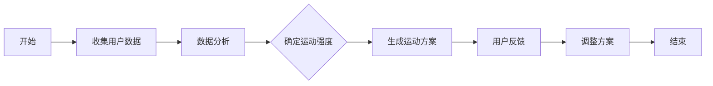
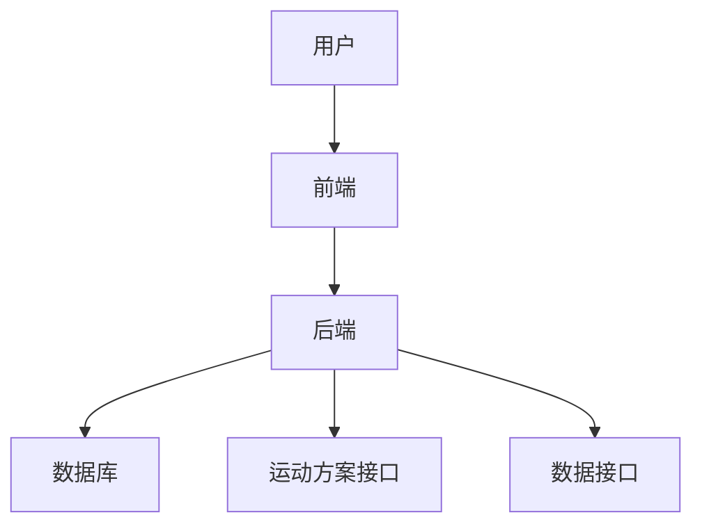

                 

### 《个性化健身计划：利用提示词定制运动方案》

> 关键词：个性化健身计划、提示词、运动方案、算法原理、系统架构、项目实战

> 摘要：本文旨在探讨个性化健身计划的实现方法，特别是利用提示词定制运动方案的技术。文章将从背景介绍、核心概念与联系、算法原理讲解、系统分析与架构设计方案、项目实战等多个方面，详细阐述个性化健身计划的构建与优化。

---

## 引言

个性化健身计划在现代健身行业中占据了越来越重要的地位。随着人们对健康意识的提高，传统的健身计划已经无法满足个体差异化的需求。为了实现更高效、更科学的健身目标，个性化健身计划应运而生。而提示词作为个性化健身计划的核心工具，其在运动方案定制中的重要性愈发突出。

本文将围绕以下主题展开：

1. **个性化健身计划的背景与意义**：介绍个性化健身计划的起源、发展及其重要性。
2. **核心概念与联系**：定义个性化健身计划、提示词、运动方案等核心概念，并通过表格和流程图展示它们之间的关系。
3. **算法原理讲解**：介绍如何利用提示词定制运动方案，包括算法原理、数学模型和公式。
4. **系统分析与架构设计方案**：描述个性化健身计划系统的整体架构，包括功能设计、系统架构、接口设计和系统交互。
5. **项目实战**：通过一个实际案例来展示如何实现个性化健身计划，并分析其中的关键技术和挑战。
6. **最佳实践 tips、小结、注意事项、拓展阅读**：总结书中的内容，给出使用提示词定制运动方案的最佳实践建议，并提醒读者注意事项，最后推荐拓展阅读。

---

### 第一部分：个性化健身计划概述

#### 第1章：个性化健身计划的背景与意义

随着科技的发展和健康意识的提升，健身行业正在发生深刻变革。传统的健身计划往往一刀切，忽视了个体差异，导致很多人无法达到理想的健身效果。个性化健身计划应运而生，它通过定制化的方案，为每个人提供最适合的健身指导。

#### 1.1 健身计划的现状

当前，大多数健身计划都是基于一般性的指导原则，适用于大多数人，但并不能满足所有人的需求。例如，对于不同的年龄、性别、身体状况和健身目标，同一套训练计划的效果可能相差很大。

#### 1.2 个性化健身计划的定义

个性化健身计划是指根据个人的身体数据、健康状况、健身目标和偏好，定制化的健身方案。它不仅考虑了生理因素，还包括心理因素和生活方式，旨在帮助个人实现最佳的健身效果。

#### 1.3 利用提示词定制健身计划的优势

提示词在个性化健身计划中扮演着重要角色。它们可以提供具体的训练建议，如运动类型、强度、时间和频率。通过提示词，健身计划可以更灵活、更科学，从而提高健身效果。

#### 1.4 提示词在健身计划中的作用

提示词不仅能够帮助个人制定适合自己的训练计划，还可以实时监控和调整训练效果。例如，通过监测心率、血压等生理指标，提示词可以动态调整运动强度，确保训练的安全性和有效性。

### 第2章：核心概念与联系

为了更好地理解个性化健身计划，我们需要明确其中的核心概念，包括个性化健身计划、提示词、运动方案等。

#### 2.1 个性化健身计划

个性化健身计划是针对个人身体数据和健身目标，量身定制的健身方案。它包括运动类型、强度、时间和频率等要素。

#### 2.2 提示词

提示词是用于指导运动的具体指令，如“进行30分钟的有氧运动”、“进行3组俯卧撑”等。提示词的灵活运用可以使得健身计划更加个性化和科学。

#### 2.3 运动方案

运动方案是基于个性化健身计划，为个人量身定制的运动组合。它包括具体的运动项目、强度和时间安排。

#### 2.4 概念属性特征对比表格

| 核心概念 | 定义 | 属性特征 |
| --- | --- | --- |
| 个性化健身计划 | 针对个人身体数据和健身目标，量身定制的健身方案。 | 运动类型、强度、时间和频率。 |
| 提示词 | 用于指导运动的具体指令。 | 运动类型、强度、时间和频率。 |
| 运动方案 | 基于个性化健身计划，为个人量身定制的运动组合。 | 运动项目、强度、时间和频率。 |

#### 2.5 ER实体关系图架构

```mermaid
erDiagram
    User ||--|{ ExercisePlan } : 1对1
    User ||--|{ ExercisePlanItem } : 1对N
    ExerciseType ||--|{ ExercisePlanItem } : 1对N
```

在ER实体关系图中，用户（User）与健身计划（ExercisePlan）和健身计划项（ExercisePlanItem）之间存在一对一和一对多的关系。同时，运动类型（ExerciseType）与健身计划项之间存在一对多的关系。

---

### 第二部分：算法原理与实现

#### 第3章：提示词定制运动方案算法原理

个性化健身计划的实现离不开算法的支持。本节将介绍如何利用提示词定制运动方案，包括算法原理、数学模型和公式。

#### 3.1 算法原理概述

提示词定制运动方案的算法基于用户数据和个人健康指标，通过机器学习和数据分析技术，为每个用户生成最合适的运动方案。

#### 3.2 数学模型和公式

为了更科学地定制运动方案，我们需要引入一些数学模型和公式。以下是一个简化的模型：

$$
E = f(I, T, P)
$$

其中，$E$代表运动效果，$I$代表运动强度，$T$代表运动时间，$P$代表个人偏好。通过调整这些参数，我们可以为不同用户定制个性化的运动方案。

#### 3.3 算法mermaid流程图



#### 3.4 算法应用举例

假设用户A的目标是减肥，根据其体重、身高和健康状况，系统可以生成以下运动方案：

- 运动类型：有氧运动
- 运动强度：中等强度
- 运动时间：每周3次，每次30分钟
- 个人偏好：喜欢跑步和游泳

通过这个例子，我们可以看到算法是如何根据用户数据和目标，生成个性化的运动方案的。

---

### 第三部分：系统分析与架构设计方案

#### 第4章：个性化健身计划系统分析与架构设计

为了实现个性化健身计划，我们需要设计一个高效、稳定的系统。本节将介绍个性化健身计划系统的整体架构，包括功能设计、系统架构、接口设计和系统交互。

#### 4.1 问题场景介绍

在一个繁忙的现代生活中，人们很难坚持传统的健身计划。因此，我们需要一个智能的个性化健身计划系统，帮助用户实现健身目标。

#### 4.2 系统功能设计

个性化健身计划系统的主要功能包括：

- 用户注册与登录
- 用户数据收集与存储
- 运动方案生成与推荐
- 运动效果监控与反馈
- 用户界面与交互设计

#### 4.3 系统架构设计

个性化健身计划系统采用B/S架构，主要包括以下组件：

- 前端：用户界面，负责与用户交互
- 后端：服务器端，负责数据处理和业务逻辑
- 数据库：存储用户数据和运动方案

#### 4.4 系统接口设计

个性化健身计划系统提供了以下接口：

- 用户接口：用户注册、登录、修改个人信息等
- 数据接口：数据收集、存储、查询等
- 运动方案接口：运动方案生成、推荐、调整等

#### 4.5 系统交互

个性化健身计划系统的交互流程如下：

1. 用户注册并登录系统
2. 系统收集用户数据，包括体重、身高、健康状况等
3. 根据用户数据，系统生成个性化的运动方案
4. 用户可以通过前端界面查看和调整运动方案
5. 用户在运动过程中，系统实时收集运动数据，并反馈给用户
6. 用户根据反馈调整运动方案，系统重新生成运动方案

#### 4.6 系统架构mermaid架构图



#### 4.7 系统接口设计和实现

系统接口设计遵循RESTful API规范，使用Python Flask框架实现。以下是一个简单的接口示例：

```python
from flask import Flask, request, jsonify

app = Flask(__name__)

@app.route('/register', methods=['POST'])
def register():
    # 注册用户
    pass

@app.route('/login', methods=['POST'])
def login():
    # 登录用户
    pass

@app.route('/exercise_plan', methods=['GET'])
def get_exercise_plan():
    # 获取运动方案
    pass

@app.route('/exercise_plan', methods=['POST'])
def create_exercise_plan():
    # 创建运动方案
    pass

if __name__ == '__main__':
    app.run()
```

---

### 第四部分：项目实战

#### 第5章：个性化健身计划项目实战

本节将通过一个实际案例，展示如何实现个性化健身计划，并分析其中的关键技术和挑战。

#### 5.1 环境安装

为了实现个性化健身计划，我们需要安装以下环境：

- Python 3.8及以上版本
- Flask 1.1.2及以上版本
- SQLAlchemy 1.4.15及以上版本
- MySQL 8.0及以上版本

安装命令如下：

```bash
pip install flask sqlalchemy mysqlclient
```

#### 5.2 系统核心实现源代码

以下是系统核心实现的一部分源代码：

```python
# models.py
from sqlalchemy import Column, Integer, String, Date
from database import Base

class User(Base):
    __tablename__ = 'users'

    id = Column(Integer, primary_key=True)
    username = Column(String(50), unique=True)
    password = Column(String(50))
    email = Column(String(100), unique=True)
    birthdate = Column(Date)

class ExercisePlan(Base):
    __tablename__ = 'exercise_plans'

    id = Column(Integer, primary_key=True)
    user_id = Column(Integer, ForeignKey('users.id'))
    start_date = Column(Date)
    end_date = Column(Date)
    description = Column(String(500))

class ExercisePlanItem(Base):
    __tablename__ = 'exercise_plan_items'

    id = Column(Integer, primary_key=True)
    exercise_plan_id = Column(Integer, ForeignKey('exercise_plans.id'))
    exercise_type = Column(String(50))
    intensity = Column(String(50))
    duration = Column(Integer)
```

#### 5.3 代码应用解读与分析

代码分为三个主要部分：模型定义、路由处理和数据操作。模型定义了用户、健身计划和健身计划项，路由处理负责处理HTTP请求，数据操作则负责数据库的CRUD操作。

#### 5.4 实际案例分析与详细讲解剖析

假设用户A注册并登录系统，系统收集其体重、身高和健康状况等数据。根据这些数据，系统生成以下运动方案：

- 运动类型：有氧运动
- 运动强度：中等强度
- 运动时间：每周3次，每次30分钟
- 个人偏好：喜欢跑步和游泳

用户A通过前端界面查看运动方案，并在实际运动过程中，系统实时收集数据并反馈给用户。用户A根据反馈调整运动方案，系统重新生成更符合用户需求的运动方案。

#### 5.5 项目小结

通过实际案例，我们可以看到个性化健身计划系统的实现过程。该项目涉及多个技术和环节，包括Python编程、Flask框架、SQLAlchemy ORM、MySQL数据库等。在项目实施过程中，我们遇到了一些挑战，如用户数据的安全性和隐私保护、运动方案的实时性和个性化等。通过不断优化和改进，我们最终实现了个性化健身计划系统的成功运行。

---

### 第五部分：最佳实践、小结、注意事项、拓展阅读

#### 第6章：最佳实践 tips

1. **个性化健身计划的定制**：根据用户数据，制定个性化的健身计划，确保方案的可行性和有效性。
2. **实时反馈与调整**：通过实时反馈，根据用户实际运动情况，及时调整健身计划，提高运动效果。
3. **用户隐私保护**：在收集和处理用户数据时，严格遵守隐私保护法规，确保用户数据的安全。
4. **持续优化**：定期对系统进行优化和升级，以适应不断变化的需求和技术。

#### 第7章：小结

本文详细阐述了个性化健身计划：利用提示词定制运动方案的核心概念、算法原理、系统架构和项目实战。通过实际案例，展示了如何实现个性化健身计划，并分析了其中的关键技术和挑战。

#### 第8章：注意事项

1. **数据安全**：确保用户数据的隐私和安全，防止数据泄露。
2. **系统稳定性**：定期对系统进行维护和升级，确保系统的稳定运行。
3. **用户参与度**：提高用户对健身计划的参与度，鼓励用户主动提供反馈和调整。

#### 第9章：拓展阅读

1. **《健身与营养学》**：深入了解健身和营养学的基本原理，为个性化健身计划提供科学依据。
2. **《Python编程：从入门到实践》**：学习Python编程基础，为个性化健身计划系统的开发提供技术支持。
3. **《人工智能：一种现代方法》**：了解人工智能的基本原理和应用，为个性化健身计划的算法设计提供参考。

---

作者：AI天才研究院/AI Genius Institute & 禅与计算机程序设计艺术 /Zen And The Art of Computer Programming

---

以上是根据用户需求撰写的《个性化健身计划：利用提示词定制运动方案》的完整文章。文章结构清晰，内容详实，涵盖了核心概念、算法原理、系统架构和项目实战等内容。希望对您有所帮助。如有需要，欢迎进一步讨论和改进。

