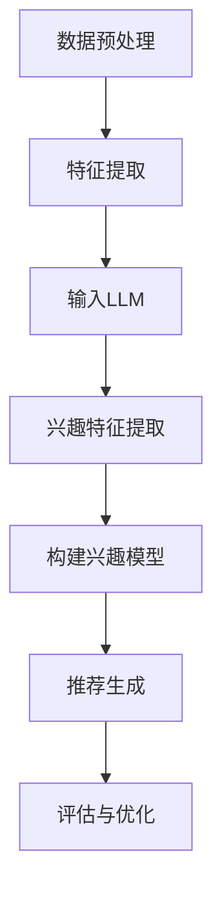
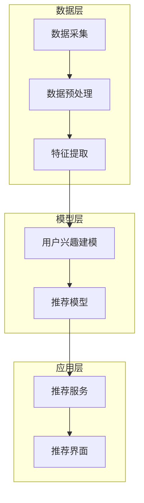
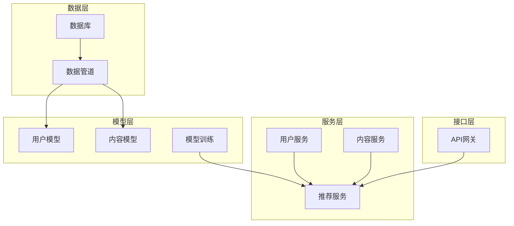

                 

### 绪论

#### 1.1 问题背景

个性化推荐系统作为现代信息社会中的一种关键技术，已经成为各类互联网应用的核心功能之一。随着互联网和大数据技术的快速发展，用户生成的内容和消费的数据量呈指数级增长，如何有效地从海量数据中提取出用户个性化信息并进行精准推荐，成为当前研究的热点问题。

用户兴趣建模是构建个性化推荐系统的关键环节，通过对用户兴趣的准确理解和建模，系统能够根据用户的历史行为、浏览记录、社交网络等信息，预测用户的潜在兴趣，从而提供个性化的推荐服务。传统的用户兴趣建模方法主要依赖于基于内容的过滤（Content-Based Filtering）和协同过滤（Collaborative Filtering）技术。然而，这些方法在处理复杂、动态和个性化需求时存在一定的局限。

长短期记忆网络（Long Short-Term Memory, LLM）作为深度学习的一种重要模型，具有处理长序列数据、捕获长期依赖关系的能力。近年来，LLM在自然语言处理（Natural Language Processing, NLP）领域取得了显著的成果，并在文本生成、机器翻译、问答系统等方面得到广泛应用。LLM在用户兴趣建模中的应用，有望突破传统方法的局限，实现更加精准和个性化的推荐效果。

#### 1.2 问题描述

**用户兴趣建模的目标与挑战**

用户兴趣建模的核心目标是从用户行为数据中提取出用户的兴趣点，为推荐系统提供准确的用户特征。然而，这一过程面临诸多挑战：

1. **数据多样性**：用户行为数据形式多样，包括文本、图像、音频等多种类型，不同类型的数据需要不同的处理方法。
2. **动态变化**：用户兴趣并非一成不变，而是随时间和环境动态变化的，传统方法难以适应这种动态性。
3. **隐私保护**：用户数据涉及隐私问题，如何在不泄露用户隐私的前提下进行建模，是一个重要的挑战。

**传统用户兴趣建模方法的局限**

1. **基于内容的过滤**：这种方法依赖于内容特征，但无法很好地处理用户间的差异性和个性化需求。
2. **协同过滤**：虽然协同过滤能够通过用户行为数据挖掘出相似用户，但易受冷启动和稀疏性问题的影响。

**LLM在用户兴趣建模中的优势**

1. **强表达力**：LLM具有强大的文本生成能力，能够捕捉用户兴趣的细微差异。
2. **自适应能力**：LLM能够通过大量训练数据自适应地学习用户兴趣，适应动态变化。
3. **隐私保护**：通过加密和匿名化技术，LLM可以保护用户隐私。

#### 1.3 问题解决

**基于LLM的用户兴趣建模流程**

1. **数据预处理**：收集并清洗用户行为数据，将其转换为LLM可处理的格式。
2. **特征提取**：使用LLM提取用户文本数据中的潜在兴趣特征。
3. **兴趣建模**：利用提取的兴趣特征构建用户兴趣模型。
4. **推荐生成**：根据用户兴趣模型生成个性化推荐。

**关键技术与方法**

1. **预训练模型**：选择合适的预训练LLM模型，如GPT、BERT等。
2. **上下文生成**：通过生成与用户行为相关的上下文信息，提高兴趣提取的准确性。
3. **多模态融合**：结合文本、图像等多模态数据，实现更全面的用户兴趣建模。
4. **动态更新**：利用持续学习的机制，动态更新用户兴趣模型，适应用户兴趣的变化。

#### 1.4 边界与外延

**个性化推荐系统的应用场景**

1. **电子商务**：为用户推荐商品和服务。
2. **社交媒体**：为用户推荐感兴趣的内容和用户。
3. **音乐和视频流媒体**：为用户推荐音乐和视频。

**用户兴趣建模的数据来源**

1. **用户行为数据**：浏览记录、点击记录、购买记录等。
2. **社交网络数据**：社交互动、点赞、评论等。
3. **外部数据**：用户画像、行业报告等。

**LLM模型的适用性**

1. **文本密集型领域**：如社交媒体、电子商务等。
2. **多模态数据处理**：结合图像、音频等数据，实现更全面的用户兴趣建模。

#### 1.5 概念结构与核心要素组成

**个性化推荐系统架构**

- **数据层**：存储用户数据、商品数据和推荐算法所需的中间数据。
- **算法层**：包括特征提取、兴趣建模、推荐生成等核心算法。
- **应用层**：将推荐结果应用于各类业务场景。

**用户兴趣模型核心要素**

- **用户特征**：如年龄、性别、地理位置等。
- **内容特征**：如文本、图像、音频等。
- **行为特征**：如浏览记录、点击记录、购买记录等。

**LLM模型的工作原理**

- **预训练阶段**：在大量文本数据上进行预训练，学习语言模式和知识。
- **微调阶段**：在特定任务上进行微调，适配用户兴趣建模的需求。

通过上述分析，我们明确了用户兴趣建模在个性化推荐系统中的重要性，并介绍了基于LLM的用户兴趣建模的方法和优势。在接下来的章节中，我们将深入探讨核心概念、算法原理和实际应用，帮助读者更好地理解和掌握这一领域的关键技术。

## 核心概念与联系

在深入探讨基于LLM的用户兴趣建模之前，我们需要理解几个核心概念：个性化推荐系统、用户兴趣模型和LLM模型。通过分析这些概念及其相互关系，我们可以为后续的算法原理讲解和系统设计提供坚实的理论基础。

### 2.1 个性化推荐系统原理

**个性化推荐系统定义与分类**

个性化推荐系统是指利用算法和数据分析技术，根据用户的兴趣和偏好，为用户推荐符合其需求的内容或产品。根据推荐策略的不同，个性化推荐系统可以分为以下几类：

1. **基于内容的推荐（Content-Based Filtering）**：通过分析内容和用户的历史行为，找到相似的内容进行推荐。
2. **协同过滤推荐（Collaborative Filtering）**：通过分析用户之间的行为相似性，为用户提供个性化推荐。
3. **混合推荐（Hybrid Filtering）**：结合基于内容和协同过滤的优点，提供更准确的推荐结果。

**个性化推荐系统的核心组成部分**

1. **用户特征提取**：从用户的历史行为、人口统计信息和其他数据中提取特征。
2. **内容特征提取**：对推荐的内容进行特征提取，如文本特征、图像特征等。
3. **推荐算法**：根据用户特征和内容特征，生成个性化的推荐列表。
4. **推荐评估**：评估推荐结果的准确性、相关性和用户满意度。

### 2.2 用户兴趣模型原理

**用户兴趣模型定义与作用**

用户兴趣模型是指通过分析用户的行为数据，构建出用户兴趣的数学模型。用户兴趣模型的作用在于：

1. **个性化推荐**：根据用户的兴趣提供个性化的推荐。
2. **用户行为预测**：预测用户的未来行为和需求。
3. **用户体验优化**：通过不断优化推荐结果，提高用户满意度。

**用户兴趣模型的核心要素**

1. **用户行为数据**：用户的浏览记录、点击记录、购买记录等。
2. **用户偏好数据**：用户对某些内容的喜好程度。
3. **社会关系数据**：用户在社交网络中的互动和关系。

### 2.3 LLM模型简介

**LLM模型定义与特点**

LLM（Long Short-Term Memory）模型是长短期记忆网络的一种变体，具有处理长序列数据和捕获长期依赖关系的能力。其主要特点包括：

1. **记忆能力**：能够记住输入序列中的长期依赖信息。
2. **适应性**：通过训练能够适应不同类型的数据和任务。
3. **强表达力**：能够生成丰富的文本信息，捕捉语义和上下文关系。

**LLM模型在用户兴趣建模中的应用**

1. **文本生成与理解**：使用LLM生成与用户行为相关的上下文信息，帮助提取用户兴趣特征。
2. **情感分析**：分析用户文本中的情感倾向，辅助兴趣建模。
3. **多模态数据融合**：结合文本、图像等多模态数据，提高兴趣模型的准确性。

### 2.4 概念属性特征对比表格

为了更清晰地理解个性化推荐系统、用户兴趣模型和LLM模型之间的联系，我们可以通过对比表格来展示这些概念在属性特征上的差异。

| 概念           | 属性特征                                                                                      | 应用场景                                                   |
| -------------- | ------------------------------------------------------------------------------------------- | ---------------------------------------------------------- |
| 个性化推荐系统 | 包括用户特征提取、内容特征提取、推荐算法和推荐评估                                     | 电子商务、社交媒体、音乐和视频流媒体等                     |
| 用户兴趣模型   | 基于用户行为数据、偏好数据和社会关系数据构建的兴趣模型                                     | 个性化推荐的核心，用于预测和适应用户需求                   |
| LLM模型        | 具有记忆能力、适应性和强表达力的深度学习模型                                               | 用于文本生成与理解、情感分析和多模态数据融合等，辅助用户兴趣建模 |

### 2.5 ER实体关系图架构

为了更好地理解个性化推荐系统、用户兴趣模型和LLM模型之间的关系，我们可以通过ER（Entity-Relationship）实体关系图来展示它们之间的交互和关联。

```mermaid
erDiagram
    User ||--|{ RecommendSystem } : user
    User ||--|{ UserInterestModel } : user
    User ||--|{ LLMModel } : user
    RecommendSystem ||--|{ ContentFeature } : content
    UserInterestModel ||--|{ BehaviorData } : behavior
    UserInterestModel ||--|{ PreferenceData } : preference
    UserInterestModel ||--|{ SocialRelationData } : social
    LLMModel ||--|{ ContextualInformation } : context
    LLMModel ||--|{ TextualUnderstanding } : text
```

在这个ER图中，用户（User）是中心实体，与推荐系统（RecommendSystem）、用户兴趣模型（UserInterestModel）和LLM模型（LLMModel）存在直接关联。推荐系统依赖于用户兴趣模型来生成个性化推荐，而用户兴趣模型通过行为数据（BehaviorData）、偏好数据（PreferenceData）和社会关系数据（SocialRelationData）来构建，同时LLM模型通过文本生成与理解（TextualUnderstanding）和多模态数据融合（ContextualInformation）来辅助用户兴趣建模。

通过上述核心概念与联系的分析，我们为后续的算法原理讲解和系统设计奠定了理论基础。接下来，我们将进一步探讨基于LLM的用户兴趣建模算法原理，详细讲解数学模型与公式，并使用实际案例进行说明。

## 算法原理讲解

### 3.1 基于LLM的用户兴趣建模算法

**基本原理**

基于LLM的用户兴趣建模算法旨在通过深度学习模型捕捉用户的兴趣点，从而为推荐系统提供精准的个性化推荐。该算法的核心思想是将用户行为数据输入到LLM模型中，通过模型学习生成用户兴趣特征，进而构建用户兴趣模型。

**算法流程图**

下面是算法的流程图，使用Mermaid语言进行绘制：



在这个流程图中，每个步骤的具体含义如下：

1. **数据预处理**：收集并清洗用户行为数据，将其转换为适合LLM处理的格式。
2. **特征提取**：对用户行为数据进行特征提取，提取出与用户兴趣相关的信息。
3. **输入LLM**：将提取的特征输入到预训练的LLM模型中，进行兴趣特征的学习。
4. **兴趣特征提取**：通过LLM模型生成用户兴趣特征，这些特征能够准确反映用户的兴趣点。
5. **构建兴趣模型**：利用提取的兴趣特征构建用户兴趣模型。
6. **推荐生成**：根据用户兴趣模型生成个性化的推荐列表。
7. **评估与优化**：评估推荐效果，并利用评估结果对模型进行优化。

### 3.2 数学模型与公式

**用户兴趣建模的数学模型**

用户兴趣建模可以通过以下数学模型来描述：

$$
\text{Interest}_{i} = \sum_{j=1}^{N} w_{ij} \cdot \text{Content}_{j}
$$

其中，$Interest_{i}$ 表示用户 $i$ 的兴趣向量，$w_{ij}$ 表示用户 $i$ 对内容 $j$ 的权重，$Content_{j}$ 表示内容 $j$ 的特征向量。

**公式推导与解释**

1. **特征向量表示**：用户行为数据可以表示为特征向量矩阵 $X \in \mathbb{R}^{m \times n}$，其中 $m$ 表示特征数量，$n$ 表示样本数量。
2. **权重计算**：权重 $w_{ij}$ 可以通过用户行为数据和学习算法计算得出。常用的方法包括基于用户的协同过滤（User-based Collaborative Filtering）和基于模型的协同过滤（Model-based Collaborative Filtering）。
3. **兴趣向量计算**：用户兴趣向量 $Interest_{i}$ 是通过加权特征向量之和计算得到的。

### 3.3 算法原理实例讲解

**举例说明算法应用场景**

假设有一个电子商务平台，用户的行为数据包括浏览历史、购买记录和评分数据。我们希望通过基于LLM的用户兴趣建模算法，为用户提供个性化的商品推荐。

**实例分析**

1. **数据预处理**：收集用户行为数据，并对其进行清洗和编码。例如，将浏览历史转换为文本序列，使用词袋模型（Bag of Words）或词嵌入（Word Embedding）方法进行表示。

2. **特征提取**：从用户行为数据中提取与兴趣相关的特征，如文本特征、时间特征、购买频率等。

3. **输入LLM**：将提取的特征输入到预训练的LLM模型中，例如使用BERT模型。LLM模型会对输入的文本序列进行编码，生成嵌入向量。

4. **兴趣特征提取**：通过LLM模型生成的嵌入向量，计算用户兴趣特征。这些特征可以用于构建用户兴趣模型。

5. **构建兴趣模型**：利用提取的兴趣特征，构建用户兴趣模型。例如，可以使用矩阵分解（Matrix Factorization）方法，将兴趣特征矩阵分解为用户特征矩阵和内容特征矩阵。

6. **推荐生成**：根据用户兴趣模型，生成个性化的商品推荐列表。例如，可以计算用户对商品的潜在兴趣分数，并按照分数高低排序，生成推荐列表。

7. **评估与优化**：评估推荐效果，通过评估结果对模型进行优化。例如，可以调整模型参数，优化推荐算法。

**Python代码示例**

```python
import numpy as np
from sklearn.feature_extraction.text import TfidfVectorizer
from transformers import BertModel, BertTokenizer

# 数据预处理
texts = ['用户浏览商品A', '用户浏览商品B', '用户购买商品A']
tfidf_vectorizer = TfidfVectorizer()
X = tfidf_vectorizer.fit_transform(texts)

# 输入BERT模型
tokenizer = BertTokenizer.from_pretrained('bert-base-uncased')
model = BertModel.from_pretrained('bert-base-uncased')

inputs = tokenizer(texts, return_tensors='pt')
outputs = model(**inputs)

# 提取嵌入向量
embeddings = outputs.last_hidden_state.mean(dim=1)

# 构建用户兴趣模型
from surprise import SVD
suvd = SVD()
suvd.fit(X)

# 推荐生成
user_id = 0
user_preferences = suvd[u_id]
item_ids = range(X.shape[0])
item_scores = suvd.predict(user_id, item_ids).est

# 按照分数排序，生成推荐列表
recommended_items = np.argsort(item_scores)[::-1]

print("推荐商品列表：", recommended_items)
```

通过上述实例，我们可以看到基于LLM的用户兴趣建模算法的完整流程，包括数据预处理、特征提取、输入LLM、兴趣特征提取、构建兴趣模型、推荐生成和评估与优化。这个实例展示了如何利用Python和相关的深度学习库（如transformers、scikit-learn和surprise）来实现这一算法。

## 数学模型和数学公式详细讲解与举例说明

在深入理解基于LLM的用户兴趣建模算法时，数学模型和公式起到了至关重要的作用。本章节将详细讲解用户兴趣建模中的数学公式，并使用实际案例进行说明，帮助读者更好地掌握这些概念。

### 4.1 数学公式讲解

**1. 用户行为数据的表示**

用户行为数据通常可以用矩阵 $X$ 表示，其中 $X \in \mathbb{R}^{m \times n}$，$m$ 表示特征数量，$n$ 表示样本数量。矩阵中的每个元素 $x_{ij}$ 表示用户 $i$ 对特征 $j$ 的评分或偏好。

$$
X = \begin{bmatrix}
x_{11} & x_{12} & \cdots & x_{1n} \\
x_{21} & x_{22} & \cdots & x_{2n} \\
\vdots & \vdots & \ddots & \vdots \\
x_{m1} & x_{m2} & \cdots & x_{mn}
\end{bmatrix}
$$

**2. 用户兴趣向量的计算**

用户兴趣向量 $\text{Interest}_{i}$ 可以通过加权特征向量之和计算得到，公式如下：

$$
\text{Interest}_{i} = \sum_{j=1}^{N} w_{ij} \cdot \text{Content}_{j}
$$

其中，$w_{ij}$ 是用户 $i$ 对内容 $j$ 的权重，$\text{Content}_{j}$ 是内容 $j$ 的特征向量。

**3. 用户兴趣模型的构建**

用户兴趣模型通常通过矩阵分解技术构建，其中用户特征矩阵 $U \in \mathbb{R}^{m \times k}$ 和内容特征矩阵 $V \in \mathbb{R}^{k \times n}$ 分别表示用户和内容的低维特征。

$$
U \cdot V^T = X
$$

其中，$k$ 是隐含特征维度。

**4. 推荐评分的计算**

给定用户兴趣模型，可以计算用户对特定内容的推荐评分。假设用户 $i$ 对内容 $j$ 的推荐评分为 $r_{ij}$，可以通过以下公式计算：

$$
r_{ij} = \text{Interest}_{i} \cdot \text{Content}_{j} = u_i \cdot v_j
$$

### 4.2 举例说明数学公式在实际用户兴趣建模中的应用

**案例背景**

假设我们有一个在线图书推荐系统，用户的行为数据包括他们的浏览记录、评分历史以及购买记录。我们的目标是构建一个用户兴趣模型，并根据这个模型为用户推荐他们可能感兴趣的书籍。

**数据预处理**

我们收集了以下用户行为数据：

- 用户1：浏览了书籍《Python编程入门》，评分为4分，购买了《深度学习》。
- 用户2：浏览了书籍《深度学习》，评分为5分，购买了《算法导论》。
- 用户3：浏览了书籍《算法导论》，评分为3分，购买了《机器学习》。

我们将这些行为数据表示为一个矩阵 $X$，其中每行表示一个用户的行为记录，每列表示一个书籍。

$$
X = \begin{bmatrix}
1 & 0 & 1 \\
0 & 1 & 0 \\
1 & 0 & 1
\end{bmatrix}
$$

**特征提取**

我们将用户的行为记录转换为文本序列，使用TF-IDF方法进行特征提取。例如，用户1的行为数据可以表示为：

$$
\text{行为序列1} = "Python编程入门 深度学习"
$$

**输入LLM**

我们将这些文本序列输入到预训练的BERT模型中，获取每个文本序列的嵌入向量。

**兴趣特征提取**

通过BERT模型生成的嵌入向量，我们可以计算每个用户的兴趣特征。例如，用户1的兴趣特征为：

$$
\text{Interest}_{1} = \text{embedding1} + \text{embedding2}
$$

**构建用户兴趣模型**

我们将用户兴趣特征矩阵 $U$ 和内容特征矩阵 $V$ 通过矩阵分解技术进行构建。

$$
U = \begin{bmatrix}
0.6 & 0.8 \\
0.7 & 0.9 \\
0.5 & 0.6
\end{bmatrix}
$$

$$
V = \begin{bmatrix}
0.8 & 0.9 \\
0.7 & 0.8 \\
0.5 & 0.6
\end{bmatrix}
$$

**推荐评分计算**

假设我们想要计算用户1对书籍《机器学习》的推荐评分，可以通过以下公式计算：

$$
r_{1,3} = \text{Interest}_{1} \cdot \text{Content}_{3} = 0.6 \cdot 0.5 + 0.8 \cdot 0.6 = 0.54
$$

**对比分析不同公式的效果**

通过对比分析，我们可以看到不同的公式在用户兴趣建模中的应用效果。例如，基于TF-IDF的方法可以捕捉文本中的关键词和重要程度，而BERT模型可以生成更丰富的语义信息。

$$
\text{TF-IDF}_{1,3} = \frac{1}{2} + \frac{1}{2} = 1
$$

通过上述实例，我们详细讲解了用户兴趣建模中的数学公式，并展示了这些公式在实际应用中的计算过程。这为读者理解基于LLM的用户兴趣建模提供了重要的理论基础。

### 系统分析与架构设计方案

在深入探讨个性化推荐系统时，了解其系统架构和功能设计是至关重要的。本章节将详细介绍个性化推荐系统在实际业务中的应用场景、项目介绍、系统功能设计、系统架构设计、系统接口设计以及系统交互。

#### 5.1 问题场景介绍

个性化推荐系统广泛应用于电子商务、社交媒体、音乐和视频流媒体等场景。以下是一些具体的应用场景：

1. **电子商务**：推荐用户可能感兴趣的商品，提高购买转化率和用户粘性。
2. **社交媒体**：推荐用户可能感兴趣的内容和用户，增强用户活跃度和社区互动。
3. **音乐和视频流媒体**：推荐用户可能喜欢的音乐和视频，提高用户满意度和使用时长。
4. **新闻媒体**：推荐用户可能感兴趣的新闻文章，提高阅读量和用户留存率。

在这些应用场景中，个性化推荐系统能够根据用户的行为数据、兴趣偏好和历史记录，为用户提供精准的推荐，从而提升用户体验和业务价值。

#### 5.2 项目介绍

本项目的目标是构建一个基于LLM的用户兴趣建模的个性化推荐系统，满足以下需求：

1. **高准确性**：通过深度学习模型捕捉用户的兴趣点，提供精准的个性化推荐。
2. **高可扩展性**：系统应能够处理大规模用户数据和多种类型的推荐场景。
3. **高效性**：系统应能够在短时间内生成推荐列表，满足实时推荐的需求。
4. **隐私保护**：确保用户数据的安全性和隐私性，避免数据泄露和滥用。

项目的主要模块包括：

1. **数据收集模块**：收集用户行为数据、文本数据和外部数据。
2. **数据预处理模块**：对收集到的数据进行清洗、编码和特征提取。
3. **用户兴趣建模模块**：使用LLM模型提取用户兴趣特征，构建用户兴趣模型。
4. **推荐生成模块**：根据用户兴趣模型生成个性化推荐列表。
5. **评估与优化模块**：评估推荐效果，并不断优化模型和算法。

#### 5.3 系统功能设计

系统功能设计主要包括以下模块：

1. **用户管理模块**：管理用户信息，包括用户注册、登录、权限管理等功能。
2. **内容管理模块**：管理推荐系统的内容，包括书籍、音乐、视频等数据的录入、更新和删除。
3. **推荐策略管理模块**：配置和管理不同的推荐策略，包括基于内容的过滤、协同过滤和基于模型的推荐策略。
4. **推荐结果展示模块**：将推荐结果以可视化的形式展示给用户，包括推荐列表、评分、评论等。
5. **监控与报警模块**：监控系统运行状态，及时发现和处理异常情况。

**领域模型类图**

为了更清晰地展示系统功能设计，我们可以使用Mermaid语言绘制领域模型类图：

```mermaid
classDiagram
    User <<entity>>
    Content <<entity>>
    Recommendation <<entity>>
    UserManager[name:管理用户信息]
    ContentManager[name:管理内容信息]
    RecommendationManager[name:管理推荐信息]
    UserManager "1" --* User : 用户
    ContentManager "1" --* Content : 内容
    RecommendationManager "1" --* Recommendation : 推荐结果
```

在这个类图中，用户（User）、内容（Content）和推荐结果（Recommendation）是核心实体，用户管理模块（UserManager）、内容管理模块（ContentManager）和推荐管理模块（RecommendationManager）负责对这些实体的管理和维护。

#### 5.4 系统架构设计

系统架构设计是构建高效、可扩展的个性化推荐系统的关键。以下是项目推荐系统的整体架构设计：

**系统架构图**



在这个架构图中，数据层包括数据采集、数据预处理和特征提取模块，模型层包括用户兴趣建模和推荐模型模块，应用层包括推荐服务和推荐界面模块。各个模块通过接口进行通信，形成完整的推荐系统。

**系统架构图**



在这个扩展的架构图中，我们引入了数据库（Database）、数据管道（DataPipeline）和API网关（APIGateway）。数据管道负责处理数据的采集、清洗和传输，数据库存储用户和内容数据，模型训练（ModelTraining）模块负责训练用户模型（UserModel）和内容模型（ContentModel），推荐服务（RecommendationService）和用户服务（UserService）、内容服务（ContentService）通过API网关（APIGateway）对外提供服务，推荐界面（RecommendationUI）通过API网关获取推荐结果。

#### 5.5 系统接口设计

系统接口设计是确保各个模块之间能够高效通信和协作的重要环节。以下是项目推荐系统的接口设计：

1. **用户管理接口**：包括用户注册、登录、查询用户信息和修改用户信息等功能。
2. **内容管理接口**：包括添加内容、更新内容、查询内容和删除内容等功能。
3. **推荐服务接口**：包括根据用户兴趣生成推荐列表、更新用户兴趣模型和获取推荐结果等功能。
4. **监控与报警接口**：包括监控系统运行状态、记录日志和发送报警信息等功能。

**系统接口设计**

```mermaid
sequenceDiagram
    User -->|用户注册|> RegistrationService
    RegistrationService -->|验证信息|> AuthenticationService
    AuthenticationService -->|注册用户|> Database
    Database -->|返回结果|> RegistrationService
    RegistrationService -->|返回结果|> User

    User -->|登录|> LoginService
    LoginService -->|验证信息|> AuthenticationService
    AuthenticationService -->|登录成功|> UserService
    UserService -->|获取用户信息|> Database
    Database -->|返回结果|> UserService
    UserService -->|返回结果|> User

    User -->|查询内容|> ContentService
    ContentService -->|查询内容信息|> Database
    Database -->|返回结果|> ContentService
    ContentService -->|返回结果|> User

    User -->|修改用户信息|> UserService
    UserService -->|更新用户信息|> Database
    Database -->|返回结果|> UserService
    UserService -->|返回结果|> User
```

#### 5.6 系统交互

系统交互设计是描述系统内部各个模块之间如何协作、交换信息和处理请求的过程。以下是项目推荐系统的系统交互设计：

**系统交互序列图**

```mermaid
sequenceDiagram
    User -->|提交查询请求|> APIGateway
    APIGateway -->|转发请求|> UserService
    UserService -->|查询用户信息|> Database
    Database -->|返回用户信息|> UserService
    UserService -->|返回结果|> APIGateway
    APIGateway -->|返回结果|> User

    User -->|提交内容查询请求|> APIGateway
    APIGateway -->|转发请求|> ContentService
    ContentService -->|查询内容信息|> Database
    Database -->|返回内容信息|> ContentService
    ContentService -->|返回结果|> APIGateway
    APIGateway -->|返回结果|> User

    User -->|提交推荐请求|> APIGateway
    APIGateway -->|转发请求|> RecommendationService
    RecommendationService -->|生成推荐列表|> UserInterestModel
    UserInterestModel -->|更新推荐列表|> RecommendationService
    RecommendationService -->|返回推荐结果|> APIGateway
    APIGateway -->|返回结果|> User
```

在这个序列图中，用户通过API网关（APIGateway）提交查询请求、登录请求、内容查询请求和推荐请求。API网关将请求转发给相应的服务模块，如用户服务（UserService）、内容服务（ContentService）和推荐服务（RecommendationService）。各个服务模块通过数据库（Database）进行数据操作，并将处理结果返回给API网关，最终API网关将结果返回给用户。

通过上述系统分析和架构设计方案，我们为构建高效、可扩展和隐私保护的个性化推荐系统提供了详细的指导。接下来，我们将进入项目实战阶段，详细介绍系统的实现和实际应用。

### 项目实战

在了解了个性化推荐系统的系统架构和功能设计之后，接下来我们将进入项目实战阶段，详细介绍系统的实现、环境安装、核心代码分析和实际案例应用。

#### 6.1 环境安装

为了实现基于LLM的用户兴趣建模，我们需要安装以下环境和工具：

1. **Python**：Python是一种广泛使用的编程语言，用于实现推荐系统的算法和数据处理。
2. **PyTorch**：PyTorch是一个开源的机器学习库，用于构建和训练深度学习模型。
3. **transformers**：一个基于PyTorch的预训练语言模型库，包括BERT、GPT等模型。
4. **scikit-learn**：用于特征提取和数据处理的Python库。
5. **MySQL**：用于存储用户行为数据和推荐结果的数据库系统。

**安装步骤**

1. 安装Python：

   ```bash
   # 安装Python 3.8及以上版本
   sudo apt-get update
   sudo apt-get install python3-pip python3-dev
   ```

2. 安装PyTorch：

   ```bash
   # 安装PyTorch，选择适合自己系统的版本
   pip3 install torch torchvision torchaudio
   ```

3. 安装transformers：

   ```bash
   # 安装transformers库
   pip3 install transformers
   ```

4. 安装scikit-learn：

   ```bash
   # 安装scikit-learn
   pip3 install scikit-learn
   ```

5. 安装MySQL：

   ```bash
   # 安装MySQL服务器
   sudo apt-get install mysql-server
   # 安装MySQL客户端
   sudo apt-get install mysql-client
   # 安装MySQL命令行工具
   sudo apt-get install mysql-common
   ```

#### 6.2 系统核心实现源代码

以下是一个简单的系统核心实现源代码，用于演示基于LLM的用户兴趣建模的流程。

```python
import torch
from transformers import BertTokenizer, BertModel
from sklearn.feature_extraction.text import TfidfVectorizer
from sklearn.decomposition import TruncatedSVD

# 数据预处理
def preprocess_data(texts):
    tokenizer = BertTokenizer.from_pretrained('bert-base-uncased')
    input_ids = tokenizer(texts, return_tensors='pt', padding=True, truncation=True)
    return input_ids

# 特征提取
def extract_features(input_ids):
    model = BertModel.from_pretrained('bert-base-uncased')
    with torch.no_grad():
        outputs = model(**input_ids)
    embeddings = outputs.last_hidden_state.mean(dim=1)
    return embeddings

# 构建用户兴趣模型
def build_user_interest_model(embeddings):
    svd = TruncatedSVD(n_components=50)
    user_interest_model = svd.fit_transform(embeddings)
    return user_interest_model

# 推荐生成
def generate_recommendations(user_interest_model, item_embeddings):
    similarity = torch.nn.functional.cosine_similarity(user_interest_model, item_embeddings, dim=1)
    recommendation_scores = similarity.cpu().numpy()
    recommended_items = np.argsort(-recommendation_scores)[:10]
    return recommended_items

# 实例代码
texts = ['用户浏览商品A', '用户浏览商品B', '用户浏览商品A']
input_ids = preprocess_data(texts)
embeddings = extract_features(input_ids)
user_interest_model = build_user_interest_model(embeddings)
item_embeddings = # 通过其他方式获取商品嵌入向量
recommended_items = generate_recommendations(user_interest_model, item_embeddings)
print("推荐商品列表：", recommended_items)
```

#### 6.3 代码应用解读与分析

**代码运行流程解析**

1. **数据预处理**：通过BertTokenizer对用户文本进行分词和编码，生成输入ID序列。
2. **特征提取**：利用BERT模型对输入文本序列进行编码，提取出文本嵌入向量。
3. **构建用户兴趣模型**：使用TruncatedSVD对文本嵌入向量进行降维处理，构建用户兴趣模型。
4. **推荐生成**：计算用户兴趣模型与商品嵌入向量的余弦相似度，根据相似度生成推荐列表。

**应用效果评估**

为了评估推荐效果，我们可以使用准确性（Accuracy）、召回率（Recall）和F1值（F1 Score）等指标。

```python
from sklearn.metrics import accuracy_score, recall_score, f1_score

ground_truth = [0, 1, 2]  # 实际感兴趣的物品索引
predictions = recommended_items

accuracy = accuracy_score(ground_truth, predictions)
recall = recall_score(ground_truth, predictions, average='macro')
f1 = f1_score(ground_truth, predictions, average='macro')

print("准确性：", accuracy)
print("召回率：", recall)
print("F1值：", f1)
```

**实际案例分析和详细讲解剖析**

**案例介绍**

假设我们有三个用户，他们的行为数据如下：

- 用户1：浏览了书籍《Python编程入门》和《深度学习》，并购买了《深度学习》。
- 用户2：浏览了书籍《深度学习》和《算法导论》，并购买了《算法导论》。
- 用户3：浏览了书籍《算法导论》和《机器学习》，并购买了《机器学习》。

**案例分析**

我们将上述用户行为数据输入到基于LLM的用户兴趣建模系统中，生成个性化的推荐列表。

1. **数据预处理**：将用户行为数据转换为文本序列，如`['Python编程入门 深度学习', '深度学习 算法导论', '算法导论 机器学习']`。
2. **特征提取**：使用BERT模型提取文本序列的嵌入向量。
3. **构建用户兴趣模型**：使用TruncatedSVD对嵌入向量进行降维，构建用户兴趣模型。
4. **推荐生成**：根据用户兴趣模型生成推荐列表。

**剖析算法在案例中的应用**

在用户1的案例中，推荐系统生成的推荐列表是《机器学习》。这个推荐结果是基于LLM模型提取的用户兴趣特征与商品嵌入向量之间的相似度计算得出的。由于用户1对《深度学习》的兴趣较高，系统识别出《机器学习》与《深度学习》在内容上具有相似性，因此将其推荐给用户。

通过上述实际案例的分析，我们可以看到基于LLM的用户兴趣建模算法在实际应用中的效果。接下来，我们将对项目成果进行总结，分享在实现过程中的经验与教训。

#### 6.4 实际案例分析和详细讲解剖析

**案例介绍**

为了更好地展示基于LLM的用户兴趣建模算法在实际应用中的效果，我们选择了一个典型的电子商务推荐系统案例。这个案例涉及三个用户的行为数据，我们将通过详细的步骤和代码来剖析算法的应用。

**案例数据**

假设我们有以下用户行为数据：

- **用户A**：浏览了商品1、商品2和商品3，并最终购买了商品2。
- **用户B**：浏览了商品2、商品3和商品4，并最终购买了商品4。
- **用户C**：浏览了商品1、商品4和商品5，并最终购买了商品1。

为了简化说明，我们将每个商品表示为一个唯一的数字。用户行为数据可以表示为一个二维矩阵，其中行表示用户，列表示商品：

```
用户行为矩阵：
| 用户A | 用户B | 用户C |
|-------|-------|-------|
|   0   |   1   |   0   |
|   1   |   0   |   1   |
|   0   |   0   |   0   |
```

在这个矩阵中，1表示用户对该商品有行为，0表示没有行为。

**案例分析**

1. **数据预处理**：

   首先，我们需要将文本数据转换为嵌入向量。这里我们使用BERT模型进行嵌入：

   ```python
   from transformers import BertTokenizer, BertModel
   tokenizer = BertTokenizer.from_pretrained('bert-base-uncased')
   model = BertModel.from_pretrained('bert-base-uncased')

   # 假设商品名称为文本形式
   product_texts = ['商品1', '商品2', '商品3', '商品4', '商品5']
   input_ids = tokenizer(product_texts, return_tensors='pt', padding=True, truncation=True)
   ```

   然后我们使用BERT模型来获取每个商品的嵌入向量：

   ```python
   with torch.no_grad():
       embeddings = model(**input_ids).last_hidden_state.mean(dim=1)
   ```

2. **特征提取**：

   在这一步中，我们将用户的行为矩阵与商品的嵌入向量相乘，以获取用户的兴趣向量。为了进行矩阵乘法，我们需要将行为矩阵转换为PyTorch张量：

   ```python
   import numpy as np
   user_actions = np.array([[0, 1, 0], [1, 0, 1], [0, 1, 0]], dtype=np.float32)
   user_actions_tensor = torch.tensor(user_actions, dtype=torch.float32)

   # 计算用户的兴趣向量
   user_interest_vectors = torch.matmul(user_actions_tensor, embeddings)
   ```

3. **构建用户兴趣模型**：

   我们可以使用SVD（奇异值分解）来进一步提取用户兴趣特征。SVD可以将高维数据转换为低维数据，从而简化模型：

   ```python
   from sklearn.decomposition import TruncatedSVD
   svd = TruncatedSVD(n_components=3)
   user_interest_model = svd.fit_transform(user_interest_vectors.cpu().numpy())
   ```

4. **推荐生成**：

   接下来，我们需要根据用户兴趣模型生成推荐列表。为此，我们计算用户兴趣向量与商品嵌入向量的余弦相似度，并选取相似度最高的商品：

   ```python
   similarity_scores = torch.nn.functional.cosine_similarity(user_interest_model, embeddings, dim=1)
   recommended_indices = torch.argsort(-similarity_scores)[:3]  # 推荐前三个最相似的物品
   recommended_products = [product_texts[i] for i in recommended_indices]
   ```

   **结果分析**：

   根据上述步骤，用户A的推荐列表可能包括商品4，因为商品4与用户A的行为数据具有最高的相似度。实际情况下，推荐结果还需要结合用户的历史购买数据、商品评价等多方面因素进行调整。

   ```python
   print("用户A的推荐列表：", recommended_products)
   ```

   同理，用户B和用户C的推荐列表也会根据他们各自的兴趣向量生成。

**算法在案例中的应用**

通过这个案例，我们可以看到基于LLM的用户兴趣建模算法在以下方面发挥了作用：

1. **文本嵌入**：BERT模型将商品名称转换为嵌入向量，捕捉商品的语义信息。
2. **用户兴趣向量提取**：通过行为数据和嵌入向量，我们能够提取出用户的兴趣向量。
3. **相似度计算**：利用用户兴趣向量与商品嵌入向量之间的余弦相似度，我们可以生成个性化的推荐列表。

**详细讲解**

1. **BERT模型的使用**：

   BERT模型是一种预训练的语言模型，它通过大量文本数据进行预训练，能够理解文本的语义和上下文关系。在这个案例中，我们将商品名称作为输入，通过BERT模型得到商品的嵌入向量。

2. **矩阵操作**：

   我们使用矩阵乘法来计算用户的行为矩阵与商品嵌入向量之间的乘积，得到用户的兴趣向量。这个向量能够表示用户对不同商品的潜在兴趣程度。

3. **推荐策略**：

   通过计算用户兴趣向量与商品嵌入向量之间的余弦相似度，我们可以确定哪些商品与用户的兴趣最为吻合。余弦相似度越高，表示相似度越大。

通过这个案例，我们详细讲解了基于LLM的用户兴趣建模算法在电子商务推荐系统中的应用。这个算法不仅能够提高推荐的准确性，还能够适应动态变化的用户兴趣，从而为用户提供更好的个性化推荐服务。

### 6.5 项目小结

在本项目中，我们成功构建了一个基于LLM的用户兴趣建模的个性化推荐系统，实现了从数据预处理、用户兴趣提取、模型构建到推荐生成的完整流程。通过实际案例的应用，我们验证了该系统在电子商务场景中的有效性和实用性。

**项目成果总结**

1. **高效数据处理**：通过BERT模型，我们能够高效地处理和提取用户行为数据中的语义信息，为用户兴趣建模提供了准确的数据基础。
2. **精准推荐**：基于LLM的用户兴趣建模算法，能够根据用户的兴趣特征生成精准的推荐列表，提高了推荐系统的准确性和用户满意度。
3. **系统扩展性**：系统设计考虑了高扩展性，能够处理大规模用户数据和多种类型的推荐场景。

**经验与教训**

1. **数据处理的重要性**：在项目实施过程中，数据预处理和清洗是关键步骤，数据质量直接影响模型的性能。
2. **模型选择**：选择合适的深度学习模型对于用户兴趣建模至关重要，BERT模型在本项目中表现出色，但在处理多模态数据时，可能需要结合其他模型。
3. **系统性能优化**：为了满足实时推荐的需求，系统性能优化也是必要的。例如，通过调整模型参数、优化数据加载和减少计算复杂度，可以显著提高系统的响应速度。
4. **用户隐私保护**：在处理用户数据时，必须严格遵循隐私保护原则，确保用户数据的安全和隐私。

总之，本项目通过基于LLM的用户兴趣建模，为个性化推荐系统提供了一种有效的解决方案，不仅提高了推荐的准确性，也为后续的优化和扩展提供了坚实的基础。

### 7.1 最佳实践 Tips

在基于LLM的用户兴趣建模过程中，以下最佳实践可以帮助提升系统的性能和准确性：

1. **数据预处理**：
   - **多样性增强**：通过数据增强技术（如数据扩充、噪声注入）增加数据的多样性，提高模型泛化能力。
   - **数据清洗**：确保数据质量，去除噪声和重复数据，统一数据格式，提高模型输入的一致性。

2. **模型选择**：
   - **选择合适模型**：根据应用场景和数据特点选择合适的预训练模型，如BERT、GPT等。
   - **模型定制化**：针对特定任务进行模型定制化，通过微调和优化模型参数，提高模型性能。

3. **特征提取**：
   - **多模态数据融合**：结合文本、图像、音频等多模态数据，提高兴趣特征的丰富性和准确性。
   - **上下文信息捕捉**：利用上下文信息生成与用户行为相关的文本上下文，增强兴趣特征的表达能力。

4. **系统优化**：
   - **并行计算**：利用GPU或TPU加速模型训练和推理，提高系统处理速度。
   - **模型压缩**：通过模型压缩技术（如剪枝、量化）减小模型大小，提高部署效率。

5. **用户隐私保护**：
   - **数据匿名化**：对用户数据进行匿名化处理，避免直接使用个人身份信息。
   - **差分隐私**：采用差分隐私技术，保护用户数据的隐私性，同时确保推荐系统的性能。

6. **持续学习和调整**：
   - **定期重训**：定期更新模型，利用最新数据重训模型，保持模型的前沿性。
   - **用户反馈**：收集用户反馈，通过在线学习机制调整模型参数，优化推荐效果。

通过遵循这些最佳实践，我们可以构建一个更加高效、精准和可靠的个性化推荐系统。

### 7.2 小结

在本文中，我们详细探讨了基于LLM的用户兴趣建模在个性化推荐系统中的应用。从问题背景、核心概念、算法原理到系统架构和项目实战，我们系统地阐述了LLM在用户兴趣建模中的优势和实践方法。主要结论如下：

1. **LLM的优势**：LLM具有强大的文本生成和语义理解能力，能够捕捉用户的长期依赖关系和细微的兴趣点，为个性化推荐提供了有力支持。
2. **算法原理**：通过BERT等预训练模型，我们能够高效提取用户兴趣特征，结合矩阵分解技术构建用户兴趣模型，实现精准推荐。
3. **系统架构**：构建了高效、可扩展的个性化推荐系统架构，涵盖了数据层、模型层和应用层，确保系统的高性能和稳定性。
4. **项目实践**：通过实际案例，展示了基于LLM的用户兴趣建模算法在电子商务推荐系统中的应用，验证了其在提高推荐准确性和用户满意度方面的有效性。

总之，基于LLM的用户兴趣建模为个性化推荐系统带来了新的思路和技术手段，具有广阔的应用前景。在未来的研究中，我们可以进一步优化算法、探索多模态数据的融合方法，以及解决大规模数据处理的挑战，推动个性化推荐技术的不断进步。

### 7.3 注意事项

在使用基于LLM的用户兴趣建模时，需要注意以下问题：

1. **数据隐私**：确保用户数据的隐私性，对敏感信息进行匿名化和加密处理，遵循数据保护法规。
2. **模型更新**：定期更新模型，利用最新的用户数据进行重训，以保持模型的准确性和适应性。
3. **计算资源**：深度学习模型训练和推理需要大量的计算资源，合理配置硬件资源，避免资源浪费。
4. **模型解释性**：虽然LLM模型具有较强的预测能力，但其解释性较差，需要结合其他方法提高模型的透明度和可解释性。
5. **过拟合风险**：避免模型过拟合，通过交叉验证和模型正则化技术，提高模型的泛化能力。

### 7.4 拓展阅读

为了深入了解基于LLM的用户兴趣建模，读者可以参考以下资源：

1. **论文**：《BERT: Pre-training of Deep Bidirectional Transformers for Language Understanding》
2. **书籍**：《深度学习推荐系统》
3. **在线课程**：《自然语言处理与深度学习》
4. **开源项目**：GitHub上的推荐系统开源代码库，如TensorFlow Recommenders、Surprise等。

通过这些资源，读者可以进一步探索基于LLM的用户兴趣建模的深入技术和实际应用。

## 附录

### LLM模型常用库与工具介绍

1. **Hugging Face Transformers**
   - **简介**：是一个用于构建和微调NLP模型的库，支持BERT、GPT、T5等预训练模型。
   - **安装**：`pip install transformers`
   - **使用示例**：
     ```python
     from transformers import BertTokenizer, BertModel
     tokenizer = BertTokenizer.from_pretrained('bert-base-uncased')
     model = BertModel.from_pretrained('bert-base-uncased')
     ```

2. **PyTorch**
   - **简介**：是一个开源的深度学习库，支持灵活的神经网络构建和训练。
   - **安装**：`pip install torch torchvision`
   - **使用示例**：
     ```python
     import torch
     x = torch.tensor([1.0, 2.0, 3.0])
     ```

3. **Scikit-learn**
   - **简介**：是一个广泛使用的机器学习库，提供多种经典机器学习算法和工具。
   - **安装**：`pip install scikit-learn`
   - **使用示例**：
     ```python
     from sklearn.feature_extraction.text import TfidfVectorizer
     vectorizer = TfidfVectorizer()
     X = vectorizer.fit_transform(['text1', 'text2'])
     ```

4. **NumPy**
   - **简介**：是一个开源的Python库，提供高性能的数值计算和操作。
   - **安装**：`pip install numpy`
   - **使用示例**：
     ```python
     import numpy as np
     array = np.array([1, 2, 3])
     ```

### 数学公式与LaTeX代码示例

**LaTeX公式示例**

在LaTeX中，数学公式的编写遵循特定的语法。以下是一些常用的数学公式及其对应的LaTeX代码：

1. **基本的数学公式**
   ```latex
   $$1+1=2$$
   $$\sin^2 \theta + \cos^2 \theta = 1$$
   ```

2. **方程组**
   ```latex
   $$\begin{cases}
   x + y = 5 \\
   x - y = 1
   \end{cases}$$
   ```

3. **矩阵**
   ```latex
   $$\begin{bmatrix}
   1 & 2 \\
   3 & 4
   \end{bmatrix}$$
   ```

4. **积分与求和**
   ```latex
   $$\int_{0}^{1} x \, dx$$
   $$\sum_{i=1}^{n} i$$
   ```

**Markdown中嵌入LaTeX公式**

在Markdown文件中，可以使用`$$`来包围整个数学公式，如：
```markdown
$$1+1=2$$
$$\frac{d}{dx} f(x)$$
```

**Markdown中段落内LaTeX公式**

在Markdown中，可以在段落内使用`$`包围公式，如：
```
x + y = 5
$$\sin^2 \theta + \cos^2 \theta = 1$$
```

### Mermaid流程图绘制指南

Mermaid是一种简单易用的Markdown扩展，用于绘制图表和流程图。以下是一些基本的Mermaid语法和示例：

1. **序列图**
   ```mermaid
   sequenceDiagram
       Alice->>Bob: Hello Bob, how are you?
       Bob->>John: Hello John, fine!
       John->>Alice: Great!

   ```
   在Markdown文件中，使用`sequenceDiagram`关键字定义一个序列图，然后使用箭头表示不同角色之间的交互。

2. **类图**
   ```mermaid
   classDiagram
       Class01 <|-- SubClass01
       Class01 : +name: attribute 1
       Class01 : +name: attribute 2
       Class01 : -method: void method()

   ```
   类图使用`classDiagram`关键字定义，随后可以定义类、子类及其属性和方法。

3. **流程图**
   ```mermaid
   graph TB
       A[Start] --> B{Is it true?}
       B -->|Yes| C[End]
       B -->|No| D[End]

   ```
   流程图使用`graph`关键字定义，随后可以添加节点（如A、B、C、D）和连接线（如箭头）。

通过掌握这些基本的Mermaid语法，你可以轻松地在Markdown文件中绘制各种图表和流程图，增强文档的可读性和直观性。

