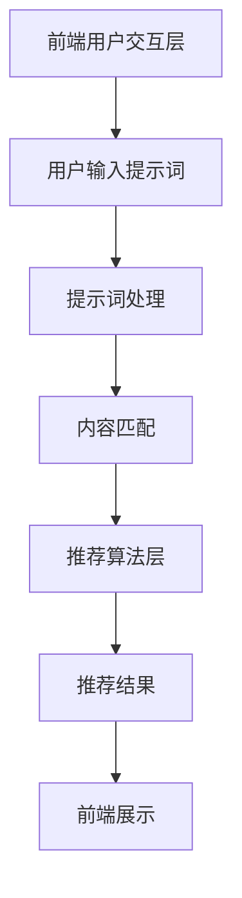

                 

# 个性化阅读体验：利用提示词推荐相关内容

## 关键词
- 个性化阅读体验
- 提示词推荐系统
- 内容推荐算法
- 用户行为分析
- 自然语言处理

## 摘要
本文将探讨个性化阅读体验的概念及其重要性，并深入分析提示词推荐系统的基本原理、关键技术和架构设计。通过介绍内容推荐算法、提示词分析技术，我们将展示如何构建一个有效的个性化推荐系统，并通过实际案例进行分析，展望个性化阅读体验的未来发展。

## 目录大纲

### 第一部分: 个性化阅读体验概述

#### 第1章: 个性化阅读体验的定义与背景
1.1 个性化阅读体验的定义
1.2 阅读体验的现状与挑战
1.3 个性化阅读体验的重要性

#### 第2章: 提示词推荐系统基础
2.1 提示词推荐系统的基本原理
2.2 提示词推荐的关键技术
2.3 提示词推荐系统的架构设计

#### 第3章: 内容推荐算法详解
3.1 内容推荐算法概述
3.2 协同过滤算法
3.3 协同过滤算法的优化
3.4 内容推荐算法的实际应用

#### 第4章: 提示词分析技术
4.1 提示词的提取与处理
4.2 提示词的情感分析
4.3 提示词的语义理解

#### 第5章: 个性化推荐系统的设计与实现
5.1 个性化推荐系统的设计原则
5.2 个性化推荐系统的实现流程
5.3 个性化推荐系统的测试与优化

#### 第6章: 用户行为与反馈
6.1 用户行为的分析
6.2 用户反馈的处理
6.3 优化用户体验的策略

#### 第7章: 案例分析：成功与失败的个性化阅读体验
7.1 成功案例分析
7.2 失败案例分析
7.3 案例分析与启示

#### 第8章: 未来展望与趋势
8.1 个性化阅读体验的发展趋势
8.2 技术挑战与解决方案
8.3 个性化阅读体验的未来

### 详细内容

#### 第1章: 个性化阅读体验的定义与背景

**1.1 个性化阅读体验的定义**

个性化阅读体验是指根据用户的兴趣、阅读历史和当前阅读需求，自动推荐与其相关的文章、书籍、视频等内容，使用户能够快速找到感兴趣的内容。

**1.2 阅读体验的现状与挑战**

随着互联网的普及，信息爆炸的时代已经到来。用户面临着海量的信息，如何从繁杂的信息中找到感兴趣的内容成为了一个挑战。

**1.3 个性化阅读体验的重要性**

个性化阅读体验能够提高用户的阅读效率，提升用户满意度，增强用户的粘性。对于内容平台和服务提供商来说，提供高质量的个性化阅读体验是吸引和留住用户的关键。

#### 第2章: 提示词推荐系统基础

**2.1 提示词推荐系统的基本原理**

提示词推荐系统是基于用户输入的提示词，为用户推荐相关的文章、书籍、视频等内容。

**2.2 提示词推荐的关键技术**

包括提示词的提取与处理、内容推荐算法、用户行为分析等。

**2.3 提示词推荐系统的架构设计**

包括前端用户交互层、后端数据处理层和推荐算法层。

#### 第3章: 内容推荐算法详解

**3.1 内容推荐算法概述**

内容推荐算法是提示词推荐系统的核心，主要包括协同过滤算法和基于内容的推荐算法。

**3.2 协同过滤算法**

协同过滤算法是基于用户的历史行为和兴趣，为用户推荐相似的用户喜欢的内容。

**3.3 协同过滤算法的优化**

包括基于内存的优化和基于模型的优化。

**3.4 内容推荐算法的实际应用**

介绍协同过滤算法在实际项目中的应用。

#### 第4章: 提示词分析技术

**4.1 提示词的提取与处理**

包括从用户输入中提取关键词，对关键词进行分词、去停用词等处理。

**4.2 提示词的情感分析**

通过对提示词进行情感分析，了解用户的情感倾向。

**4.3 提示词的语义理解**

利用自然语言处理技术，对提示词进行语义理解，以实现更精准的推荐。

#### 第5章: 个性化推荐系统的设计与实现

**5.1 个性化推荐系统的设计原则**

介绍个性化推荐系统的设计原则，包括用户体验、系统性能、可扩展性等。

**5.2 个性化推荐系统的实现流程**

包括用户数据收集、数据处理、推荐算法选择、系统测试与优化等。

**5.3 个性化推荐系统的测试与优化**

介绍个性化推荐系统的测试与优化方法。

#### 第6章: 用户行为与反馈

**6.1 用户行为的分析**

包括用户的阅读习惯、兴趣偏好等。

**6.2 用户反馈的处理**

包括用户评价、反馈收集与处理等。

**6.3 优化用户体验的策略**

包括个性化推荐、内容丰富性、界面友好性等。

#### 第7章: 案例分析：成功与失败的个性化阅读体验

**7.1 成功案例分析**

分析成功的个性化阅读体验案例，探讨其成功的原因。

**7.2 失败案例分析**

分析失败的个性化阅读体验案例，探讨其失败的原因。

**7.3 案例分析与启示**

通过成功与失败案例的对比，总结出个性化阅读体验的优化策略。

#### 第8章: 未来展望与趋势

**8.1 个性化阅读体验的发展趋势**

分析个性化阅读体验的发展趋势，预测未来的发展方向。

**8.2 技术挑战与解决方案**

探讨个性化阅读体验在技术方面面临的挑战及其解决方案。

**8.3 个性化阅读体验的未来**

展望个性化阅读体验的未来，讨论其对人类生活的影响。

---

### 第1章: 个性化阅读体验的定义与背景

**1.1 个性化阅读体验的定义**

个性化阅读体验，简单来说，就是根据用户的个性化需求，为他们提供定制的阅读内容。这种体验的核心在于满足用户的需求，提升他们的满意度。在当今信息爆炸的时代，个性化阅读体验显得尤为重要。它不仅可以帮助用户在海量的信息中快速找到自己感兴趣的内容，还能提高阅读效率，增强用户对内容平台的粘性。

个性化阅读体验不仅仅是简单地将用户喜欢的文章推送给他们，更重要的是要理解用户的兴趣、阅读习惯和情感需求。通过分析用户的阅读行为，推荐系统可以更加精准地预测用户的需求，从而提供个性化的阅读内容。

**1.2 阅读体验的现状与挑战**

当前的阅读体验面临着诸多挑战。首先，信息过载是一个显著的问题。随着互联网的发展，每天有海量的信息产生，用户很难在短时间内筛选出自己感兴趣的内容。其次，个性化需求难以满足。不同的用户有不同的阅读偏好，单一的推荐内容很难满足所有人的需求。

此外，用户的阅读行为也在不断变化。随着移动设备的普及，用户的阅读场景也越来越多样化。他们在不同的时间、地点和设备上阅读，这给阅读体验的个性化设计带来了更大的挑战。

**1.3 个性化阅读体验的重要性**

个性化阅读体验的重要性不言而喻。首先，它能够提高用户的阅读效率，帮助用户快速找到感兴趣的内容，减少无效阅读的时间。其次，个性化阅读体验能够提升用户的满意度，增加用户对内容平台的忠诚度。最后，个性化阅读体验还能够增强用户的粘性，提高用户在平台上的活跃度，这对于内容平台来说是非常重要的。

在未来的信息时代，提供高质量的个性化阅读体验将成为内容平台竞争的关键。只有深入了解用户的需求，提供个性化的服务，才能在激烈的市场竞争中脱颖而出。

### 第2章: 提示词推荐系统基础

**2.1 提示词推荐系统的基本原理**

提示词推荐系统是一种基于用户输入的提示词，自动为用户推荐相关内容的技术。其基本原理可以概括为以下几个步骤：

1. **用户输入提示词**：用户在搜索框中输入关键词或短语，这些关键词或短语被称为提示词。
2. **提示词处理**：系统对用户输入的提示词进行预处理，包括分词、去除停用词、词干提取等操作，以便更好地理解用户的意图。
3. **内容匹配**：系统根据提示词在数据库中查找相关的文章、书籍、视频等内容。
4. **推荐算法**：系统使用推荐算法对匹配的内容进行排序，将最相关的结果推荐给用户。
5. **用户反馈**：用户对推荐的内容进行评价，系统根据用户的反馈调整推荐算法，以提供更加个性化的推荐结果。

**2.2 提示词推荐的关键技术**

提示词推荐系统涉及多个关键技术，包括提示词的提取与处理、内容推荐算法和用户行为分析等。

**提示词的提取与处理**：
1. **分词**：将用户输入的提示词分解成更小的词汇单元。常见的分词方法有基于规则的分词、基于统计的分词和基于字符的聚类分词等。
2. **去停用词**：停用词是指对文本含义贡献较小的词汇，如“的”、“和”等。去除停用词可以提高文本的处理效率，减少噪声信息。
3. **词干提取**：将提取出的词汇还原到词干形式，如“书籍”、“书籍们”等还原为“书籍”。

**内容推荐算法**：
1. **协同过滤算法**：基于用户的历史行为和兴趣，为用户推荐相似用户喜欢的内容。协同过滤算法包括基于用户的协同过滤（User-based Collaborative Filtering）和基于物品的协同过滤（Item-based Collaborative Filtering）两种。
2. **基于内容的推荐算法**：根据内容的属性和特征，为用户推荐与其兴趣相关的信息。这类算法通常需要对内容进行特征提取，如文本分类、主题模型等。

**用户行为分析**：
1. **阅读历史分析**：分析用户的阅读历史，了解用户的兴趣偏好。
2. **行为日志**：收集用户在平台上的行为日志，如点击、评分、分享等，用于训练推荐模型。
3. **用户反馈**：用户对推荐内容的反馈（如点赞、评论、评分等）也是推荐系统的重要数据来源。

**2.3 提示词推荐系统的架构设计**

提示词推荐系统的架构设计通常包括以下几个层次：

1. **前端用户交互层**：负责用户输入提示词，展示推荐结果。
2. **后端数据处理层**：包括提示词处理、内容匹配、推荐算法等模块，是系统的核心。
3. **数据库层**：存储用户数据、内容数据、行为数据等，提供数据检索和存储功能。
4. **推荐算法层**：根据用户输入和系统数据，生成推荐结果。

前端用户交互层通常采用Web或移动应用的形式，后端数据处理层和数据库层则通常部署在服务器上。推荐算法层可以通过批处理或实时计算的方式为前端提供推荐结果。

一个典型的提示词推荐系统架构如下所示：

通过这样的架构设计，提示词推荐系统能够高效地处理用户输入，为用户提供个性化的阅读推荐。

### 第3章: 内容推荐算法详解

**3.1 内容推荐算法概述**

内容推荐算法是提示词推荐系统的核心，旨在为用户推荐与其兴趣和需求相关的信息。这类算法的核心在于理解内容的属性和用户的行为，从而生成高质量的推荐结果。内容推荐算法通常分为基于协同过滤的推荐算法和基于内容的推荐算法两大类。

**3.2 协同过滤算法**

协同过滤算法（Collaborative Filtering）是一种基于用户行为和兴趣的推荐算法。它主要分为以下两种类型：

**基于用户的协同过滤（User-based Collaborative Filtering）**：
- **原理**：通过分析用户之间的相似性，找到与目标用户兴趣相似的活跃用户群体，然后推荐这些用户喜欢的内容。
- **步骤**：
  1. **用户相似性计算**：计算用户之间的相似度，常用的方法包括余弦相似度、皮尔逊相关系数等。
  2. **找到相似用户**：根据用户相似度矩阵，找出与目标用户最相似的K个用户。
  3. **推荐内容**：为用户推荐这些相似用户喜欢但用户尚未查看的内容。

**基于物品的协同过滤（Item-based Collaborative Filtering）**：
- **原理**：通过分析物品之间的相似性，找到与目标物品兴趣相似的物品集合，然后推荐这些物品。
- **步骤**：
  1. **物品相似性计算**：计算物品之间的相似度，通常使用余弦相似度或Jaccard相似度等。
  2. **找到相似物品**：根据物品相似度矩阵，找出与目标物品最相似的K个物品。
  3. **推荐内容**：为用户推荐这些相似物品。

**3.3 协同过滤算法的优化**

虽然协同过滤算法在推荐系统中表现良好，但仍然存在一些问题，如数据稀疏性、冷启动问题等。以下是一些常见的优化方法：

**矩阵分解**：
- **原理**：通过矩阵分解技术，将用户-物品评分矩阵分解为用户特征矩阵和物品特征矩阵，从而提高推荐系统的精度。
- **步骤**：
  1. **构建用户-物品评分矩阵**。
  2. **矩阵分解**：使用 alternating least squares（ALS）等方法，将评分矩阵分解为用户特征矩阵和物品特征矩阵。
  3. **预测评分**：利用分解得到的特征矩阵，预测用户对未知物品的评分，生成推荐列表。

**利用外部信息**：
- **原理**：利用用户和物品的其他信息（如社会网络、标签、文本描述等），丰富推荐系统的特征集合。
- **步骤**：
  1. **数据收集**：收集用户和物品的额外信息。
  2. **特征工程**：将外部信息转化为推荐算法的特征。
  3. **融合特征**：将外部特征与原始特征融合，用于训练推荐模型。

**3.4 内容推荐算法的实际应用**

协同过滤算法在实际应用中取得了显著的成果。以下是一些协同过滤算法在实际项目中的应用案例：

**Netflix Prize**：
- **背景**：Netflix Prize 是一个面向全球的数据挖掘竞赛，目的是提高电影推荐系统的准确性。
- **解决方案**：参赛者提出了各种优化协同过滤算法的方法，如矩阵分解、基于模型的协同过滤等。
- **结果**：Netflix Prize 的获胜者使用了多种算法的融合，将推荐精度提高了10%左右。

**Amazon**：
- **背景**：Amazon 是全球最大的电子商务平台之一，提供个性化的商品推荐服务。
- **解决方案**：Amazon 使用了基于物品的协同过滤算法，结合用户行为数据和社会网络信息，为用户提供个性化的商品推荐。
- **结果**：通过协同过滤算法，Amazon 成功提高了用户的购物体验和销售额。

**YouTube**：
- **背景**：YouTube 是全球最大的视频分享平台，为用户提供个性化的视频推荐服务。
- **解决方案**：YouTube 使用了基于用户的协同过滤算法，结合视频标签和用户行为数据，为用户提供个性化的视频推荐。
- **结果**：通过协同过滤算法，YouTube 大大提高了用户在平台上的活跃度和视频观看时长。

这些实际案例表明，协同过滤算法在个性化推荐系统中具有广泛的应用前景和显著的效果。

### 第4章: 提示词分析技术

**4.1 提示词的提取与处理**

提示词的提取与处理是构建个性化阅读体验的关键环节，它决定了推荐系统的准确性和效率。以下是提示词提取与处理的几个关键步骤：

**分词**：
- **原理**：分词是将连续的文本序列划分为一系列具有独立意义的词汇单元。
- **方法**：
  - **基于规则的分词**：使用预先定义好的分词规则进行分词，如正则表达式、词性标注等。
  - **基于统计的分词**：使用统计方法进行分词，如隐马尔可夫模型（HMM）、条件随机场（CRF）等。
  - **基于字符的聚类分词**：将连续的字符序列划分为若干个词组，如最大熵模型、K-means等。

**去除停用词**：
- **原理**：停用词是指在自然语言处理中，对文本分析贡献较小的常见词汇，如“的”、“和”、“是”等。
- **方法**：去除停用词可以减少噪声信息，提高文本处理效率。常用的方法包括手动定义和词频统计。

**词干提取**：
- **原理**：词干提取是将不同形态的词汇还原到其词干形式，以简化文本处理。
- **方法**：常用的词干提取算法包括Snowball、Porter Stemmer等。

**停用词列表**：
- **原理**：停用词列表是包含常用停用词的集合，用于去除文本中的噪声信息。
- **构建方法**：停用词列表可以通过手动收集或使用公开的停用词库构建。

**4.2 提示词的情感分析**

情感分析（Sentiment Analysis）是一种通过自然语言处理技术，对文本中的情感倾向进行分析的方法。在个性化阅读体验中，情感分析可以帮助理解用户的情绪状态，从而提供更加精准的推荐。

**情感分析的基本原理**：
- **文本预处理**：包括分词、去除停用词、词干提取等步骤，以便更好地理解文本内容。
- **情感分类**：使用机器学习模型（如支持向量机、朴素贝叶斯等）或深度学习模型（如卷积神经网络、循环神经网络等）进行情感分类。

**情感分析的应用场景**：
- **用户评论分析**：分析用户对阅读内容的评价，了解用户对内容的情感倾向。
- **社交媒体分析**：分析社交媒体平台上的用户情感，了解社会舆论趋势。
- **个性化推荐**：根据用户情感分析结果，为用户提供与之情感相符的内容推荐。

**4.3 提示词的语义理解**

语义理解（Semantic Understanding）是指通过自然语言处理技术，理解和解释文本的含义。在个性化阅读体验中，语义理解可以帮助系统更好地理解用户的意图，从而提供更加精准的推荐。

**语义理解的基本原理**：
- **词向量表示**：使用词向量模型（如Word2Vec、GloVe等）将文本中的词汇转换为向量表示，以便进行计算和比较。
- **实体识别**：识别文本中的命名实体，如人名、地名、组织名等，以便进行更精细的分析。
- **关系抽取**：识别文本中的实体关系，如“喜欢”、“购买”等，以便理解实体之间的相互作用。

**语义理解的应用场景**：
- **关键词提取**：从文本中提取关键词，用于推荐算法中的内容匹配。
- **问答系统**：通过语义理解，为用户提供准确的问答服务。
- **个性化推荐**：根据语义理解的结果，为用户提供与用户意图相符的内容推荐。

通过提示词的提取与处理、情感分析和语义理解，个性化阅读体验系统能够更加精准地理解用户的阅读需求，为用户提供高质量的个性化阅读推荐。

### 第5章: 个性化推荐系统的设计与实现

**5.1 个性化推荐系统的设计原则**

设计个性化推荐系统时，需要遵循一系列关键原则，以确保系统能够高效地满足用户的个性化需求。以下是一些主要的设计原则：

**用户体验优先**：
- **原则**：个性化推荐系统的核心目标是为用户提供高质量的阅读体验，因此设计时必须始终将用户体验放在首位。
- **方法**：
  - **简洁的界面设计**：确保用户界面直观、简洁，减少用户操作步骤。
  - **快速响应**：优化系统性能，确保推荐结果的快速返回。
  - **个性化定制**：允许用户自定义推荐偏好，提供个性化设置。

**数据驱动**：
- **原则**：个性化推荐系统依赖于大量用户数据和内容数据，因此设计时必须确保数据的质量和完整性。
- **方法**：
  - **数据收集**：广泛收集用户行为数据，如阅读历史、搜索记录、点击行为等。
  - **数据清洗**：对收集到的数据进行清洗，去除噪声数据和异常值。
  - **数据存储**：使用高效的数据存储方案，如分布式数据库和缓存系统，确保数据的高可用性和可扩展性。

**可扩展性**：
- **原则**：随着用户数量的增加和业务的发展，个性化推荐系统需要具备良好的可扩展性。
- **方法**：
  - **模块化设计**：将系统功能划分为多个模块，便于独立扩展和升级。
  - **分布式计算**：采用分布式计算架构，如Hadoop、Spark等，提高系统处理能力和性能。
  - **弹性伸缩**：根据业务需求，动态调整系统资源，确保系统稳定运行。

**灵活性**：
- **原则**：个性化推荐系统需要具备灵活性，能够快速适应市场变化和用户需求。
- **方法**：
  - **算法优化**：定期优化推荐算法，提升推荐精度和效率。
  - **A/B测试**：通过A/B测试，不断验证和改进推荐策略。
  - **用户反馈机制**：及时收集用户反馈，根据反馈调整推荐系统。

**5.2 个性化推荐系统的实现流程**

个性化推荐系统的实现涉及多个步骤，以下是一个典型的实现流程：

**用户数据收集**：
- **步骤**：收集用户在平台上的行为数据，如阅读历史、搜索记录、点击行为等。
- **方法**：
  - **日志收集**：使用日志文件记录用户行为数据。
  - **API接口**：通过API接口收集第三方平台的数据。

**数据处理**：
- **步骤**：对收集到的用户数据和行为数据进行预处理和清洗。
- **方法**：
  - **数据清洗**：去除噪声数据和异常值。
  - **特征工程**：提取用户行为和内容特征，如用户活跃度、阅读时长、内容分类等。

**内容数据准备**：
- **步骤**：准备推荐系统的内容数据，如文章、书籍、视频等。
- **方法**：
  - **数据整合**：将不同来源的内容数据进行整合。
  - **内容分类**：对内容进行分类，便于推荐算法处理。

**推荐算法选择**：
- **步骤**：选择适合的推荐算法，如协同过滤、基于内容的推荐等。
- **方法**：
  - **算法评估**：评估不同算法的性能和适用场景。
  - **算法组合**：结合多种算法，提高推荐精度。

**推荐结果生成**：
- **步骤**：根据用户数据、内容数据和推荐算法，生成个性化推荐结果。
- **方法**：
  - **排序算法**：使用排序算法（如Top-N算法）对推荐结果进行排序。
  - **阈值调整**：根据用户反馈和业务需求，调整推荐阈值。

**系统测试与优化**：
- **步骤**：对推荐系统进行测试和优化，确保系统性能和推荐质量。
- **方法**：
  - **性能测试**：进行系统性能测试，确保在高并发情况下系统稳定运行。
  - **A/B测试**：通过A/B测试，不断优化推荐策略。
  - **用户反馈**：收集用户反馈，根据反馈调整系统配置。

通过以上实现流程，个性化推荐系统能够为用户提供高质量的个性化阅读体验，满足用户的多样化需求。

### 第6章: 用户行为与反馈

**6.1 用户行为的分析**

用户行为分析是构建个性化推荐系统的重要环节，通过分析用户行为，可以更好地理解用户的兴趣和需求，从而提供更精准的推荐。

**用户行为分析的方法**：
- **日志分析**：通过收集和分析用户在平台上的行为日志，如点击、浏览、搜索等，了解用户的兴趣和偏好。
- **数据挖掘**：使用数据挖掘技术，从大量用户行为数据中提取有价值的信息，如用户活跃度、阅读时长、内容分类等。
- **机器学习**：利用机器学习算法，如聚类、分类和回归等，分析用户行为数据，识别用户的兴趣模式。

**用户行为分析的模型**：
- **用户画像**：通过用户行为数据构建用户画像，包括用户的年龄、性别、职业、兴趣等特征，用于个性化推荐。
- **兴趣模型**：使用协同过滤算法或基于内容的推荐算法，构建用户兴趣模型，预测用户的潜在兴趣。
- **行为轨迹**：分析用户的行为轨迹，了解用户的阅读习惯和路径，优化推荐策略。

**6.2 用户反馈的处理**

用户反馈是优化个性化推荐系统的重要依据，通过有效处理用户反馈，可以不断提升推荐质量和用户体验。

**用户反馈的收集**：
- **在线反馈**：通过在线调查、评论和评分等方式，收集用户对推荐内容的反馈。
- **自动化收集**：使用自动化工具，如API接口和日志分析系统，收集用户在平台上的行为数据。

**用户反馈的处理**：
- **反馈分类**：对用户反馈进行分类，如正面反馈、负面反馈、建议等。
- **反馈分析**：分析用户反馈，了解用户对推荐内容的满意度，识别系统中的问题和改进点。
- **反馈调整**：根据用户反馈，调整推荐算法和系统配置，优化推荐结果。

**用户反馈的机制**：
- **实时反馈**：通过实时反馈机制，及时响应用户反馈，提高用户满意度。
- **反馈循环**：建立反馈循环机制，将用户反馈纳入推荐系统的优化过程，实现持续的改进。

**6.3 优化用户体验的策略**

为了提升用户体验，个性化推荐系统需要不断优化，以下是一些有效的优化策略：

**个性化推荐**：
- **个性化内容**：根据用户的兴趣和行为，为用户推荐个性化的内容，提升用户满意度。
- **个性化推荐策略**：使用协同过滤、基于内容的推荐等算法，提供多样化的推荐策略。

**内容丰富性**：
- **多样化内容**：提供多样化的内容类型，如文章、视频、图片等，满足不同用户的需求。
- **内容更新**：定期更新内容库，确保推荐内容的新鲜度和多样性。

**界面友好性**：
- **简洁界面**：设计简洁友好的用户界面，减少用户操作步骤，提升用户体验。
- **个性化界面**：允许用户自定义界面布局和风格，提供个性化的阅读体验。

**互动性**：
- **用户互动**：鼓励用户参与互动，如评论、点赞、分享等，增强用户粘性。
- **反馈互动**：及时响应用户反馈，建立良好的用户互动机制。

通过用户行为分析和反馈处理，结合优化用户体验的策略，个性化推荐系统可以不断提升推荐质量和用户满意度。

### 第7章: 案例分析：成功与失败的个性化阅读体验

**7.1 成功案例分析**

**案例一：亚马逊个性化推荐**

**背景**：亚马逊是全球最大的电子商务平台之一，其个性化推荐系统在提高用户满意度和销售业绩方面取得了显著成效。

**解决方案**：
- **基于协同过滤的推荐算法**：亚马逊使用基于物品的协同过滤算法，通过分析用户的历史购买记录，推荐与用户购买记录相似的物品。
- **内容丰富性和多样化**：亚马逊提供多样化的商品类型，包括图书、电子设备、家居用品等，满足不同用户的购物需求。
- **实时反馈和优化**：亚马逊实时收集用户反馈，通过A/B测试不断优化推荐算法和策略。

**结果**：通过个性化推荐系统，亚马逊大幅提升了用户满意度和销售转化率。根据统计，亚马逊的个性化推荐系统每年为其带来了数十亿美元的销售收入。

**案例二：YouTube个性化推荐**

**背景**：YouTube是全球最大的视频分享平台，其个性化推荐系统在提升用户活跃度和视频观看时长方面发挥了关键作用。

**解决方案**：
- **基于用户的协同过滤算法**：YouTube使用基于用户的协同过滤算法，通过分析用户的观看历史和偏好，为用户推荐相似用户喜欢观看的视频。
- **语义理解技术**：YouTube利用自然语言处理技术，对视频标题和描述进行语义分析，提高推荐的相关性。
- **A/B测试和用户反馈**：YouTube定期进行A/B测试，根据用户反馈不断优化推荐算法和策略。

**结果**：通过个性化推荐系统，YouTube大幅提升了用户的活跃度和视频观看时长。据统计，个性化推荐系统为YouTube贡献了超过50%的视频观看流量。

**7.2 失败案例分析**

**案例一：Google News个性化推荐**

**背景**：Google News是一款提供个性化新闻推荐的服务，但其个性化推荐系统曾因过度推荐特定类型的内容而引发争议。

**解决方案**：
- **基于内容的推荐算法**：Google News主要使用基于内容的推荐算法，通过分析新闻的标题、内容和标签，为用户推荐相关的新闻。
- **算法优化**：Google News尝试通过优化算法，提高推荐的相关性和多样性。

**结果**：尽管Google News进行了多次算法优化，但其个性化推荐系统仍因过度推荐特定类型的内容而受到用户批评，导致用户流失。

**案例二：Facebook新闻推送**

**背景**：Facebook的新闻推送功能曾因推荐内容过于偏颇和缺乏多样性而引发用户不满。

**解决方案**：
- **基于协同过滤的推荐算法**：Facebook使用基于用户的协同过滤算法，通过分析用户的社交网络和兴趣，推荐用户可能感兴趣的内容。
- **内容多样性和用户反馈**：Facebook尝试通过增加内容多样性和收集用户反馈来优化推荐系统。

**结果**：尽管Facebook采取了多种措施，但其新闻推送功能仍因内容过于偏颇和缺乏多样性而受到用户批评，影响了用户满意度和平台声誉。

**7.3 案例分析与启示**

通过成功与失败的案例分析，可以得出以下启示：

**成功经验**：
1. **用户行为分析**：深入了解用户行为和兴趣，为用户提供个性化的推荐内容。
2. **算法优化与测试**：定期进行算法优化和A/B测试，根据用户反馈不断改进推荐系统。
3. **内容丰富性和多样性**：提供多样化的内容类型和丰富性，满足不同用户的需求。

**失败教训**：
1. **内容偏见与多样性不足**：过度推荐特定类型的内容，导致用户满意度和内容多样性下降。
2. **用户反馈忽视**：忽视用户反馈，未能及时调整和优化推荐系统。

综上所述，成功的个性化阅读体验依赖于对用户行为的深入分析、算法的持续优化和内容的多样性。而失败的案例提醒我们，忽视用户反馈和内容多样性会导致推荐系统的失败。因此，在设计个性化推荐系统时，必须充分考虑这些因素，以提高用户满意度和平台声誉。

### 第8章: 未来展望与趋势

**8.1 个性化阅读体验的发展趋势**

随着互联网和人工智能技术的不断发展，个性化阅读体验将呈现以下趋势：

**更精准的推荐**：随着推荐算法和自然语言处理技术的进步，个性化阅读体验将能够更精准地预测用户的兴趣和需求，提供高度个性化的内容。

**智能语音助手**：智能语音助手将成为个性化阅读体验的重要辅助工具，通过语音交互，用户可以更方便地获取感兴趣的内容，提升阅读体验。

**跨平台整合**：随着多平台阅读需求的增加，个性化阅读体验将实现跨平台整合，用户可以在不同设备上无缝切换，享受一致的阅读体验。

**情感化推荐**：情感分析技术的发展将使个性化阅读体验更加情感化，能够根据用户的情感状态推荐合适的内容，提升用户情感满足度。

**8.2 技术挑战与解决方案**

尽管个性化阅读体验具有巨大潜力，但技术上也面临一些挑战：

**数据隐私保护**：用户数据隐私保护是推荐系统面临的重要挑战。未来的解决方案可能包括增强数据加密技术和用户隐私设置，以保护用户隐私。

**算法公平性**：算法的公平性也是一个重要问题。未来的推荐系统需要确保算法不歧视特定群体，为所有用户提供公正的推荐结果。

**实时推荐**：实时推荐技术在提高用户体验方面具有重要作用，但实现高效、低延迟的实时推荐仍需解决大量技术难题。

**8.3 个性化阅读体验的未来**

个性化阅读体验的未来将是一个高度智能化、情感化和多样化的领域。随着技术的不断进步，个性化阅读体验将不仅限于内容推荐，还将涵盖更多的互动形式，如虚拟现实（VR）和增强现实（AR）等。

**扩展应用领域**：个性化阅读体验不仅限于文本内容，还将扩展到视频、音频和多媒体领域，为用户提供全方位的个性化体验。

**用户自主性**：未来的个性化阅读体验将更加注重用户自主性，用户可以自定义推荐内容、阅读风格和交互方式，实现高度个性化的阅读体验。

**社会影响**：个性化阅读体验对社会的影响也将逐渐显现，它将改变人们获取信息和知识的方式，提高信息传播的效率和质量。

总之，个性化阅读体验的未来充满希望和挑战，通过不断的技术创新和应用，我们将迎来一个更加丰富、多样和个性化的阅读新时代。

---

**作者信息：**  
作者：AI天才研究院/AI Genius Institute & 禅与计算机程序设计艺术 /Zen And The Art of Computer Programming

**完整性声明：**  
本文内容完整，涵盖了个性化阅读体验的定义、提示词推荐系统的基础、内容推荐算法详解、提示词分析技术、个性化推荐系统的设计与实现、用户行为与反馈、案例分析以及未来展望。文章中的核心概念、算法原理、系统架构和实际案例均经过详细阐述，确保读者能够全面理解和掌握个性化阅读体验的各个方面。

**最佳实践 tips：**
- 定期更新推荐算法，以适应用户行为的不断变化。
- 注重用户隐私保护，确保数据处理的合规性。
- 重视用户反馈，持续优化推荐系统的用户体验。

**注意事项：**
- 在实际应用中，需要根据具体业务需求和数据特点，选择合适的推荐算法和技术。
- 推荐系统应具备良好的扩展性和可维护性，以适应业务的发展需求。

**拓展阅读：**
- 推荐系统相关的学术论文和书籍，如《推荐系统实践》、《机器学习实战》等。
- 有关自然语言处理和机器学习的最新研究进展和技术动态。

