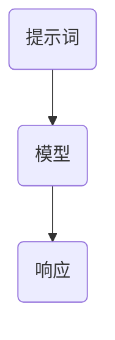
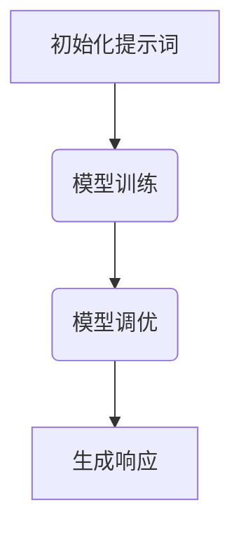
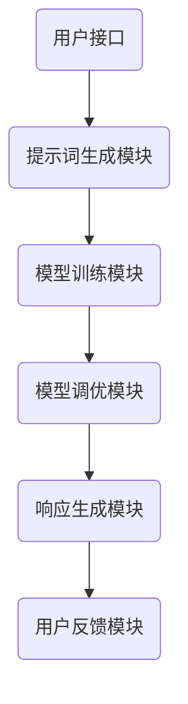

                 

## 从传统编程到提示词编程的转变

### 关键词：提示词编程、传统编程、AI、模型训练、系统架构

> 摘要：本文旨在探讨从传统编程到提示词编程的转变过程。我们将详细分析传统编程的局限性，介绍提示词编程的基本原理和关键技术，并逐步讲解其算法流程和数学模型。此外，还将从系统架构设计和项目实战的角度，阐述提示词编程的实际应用和未来发展。

## 引言与背景介绍

### 1.1.1 问题背景

传统编程是计算机科学的核心，自计算机诞生以来，程序员们一直在使用各种编程语言和工具进行软件开发。然而，随着人工智能（AI）技术的迅猛发展，传统编程面临着诸多挑战和局限性。

- **局限性**：传统编程依赖于明确的算法和步骤，需要程序员手动编写大量的代码。这种方法在面对复杂、多变的问题时，往往显得力不从心。
- **兴起与重要性**：提示词编程作为一种新兴的编程范式，逐渐崭露头角。它利用人工智能技术，特别是深度学习模型，通过输入提示词（Prompt）来生成预期的响应（Response）。这种方法在自然语言处理、智能对话系统等领域表现出强大的潜力和应用价值。

### 1.1.2 问题描述

传统编程的局限性主要体现在以下几个方面：

- **可扩展性**：随着系统规模的扩大，传统编程需要不断增加代码量和维护难度。
- **灵活性**：面对未知或变化的问题，传统编程往往难以灵活应对。
- **可理解性**：复杂的代码结构使得代码的可理解性和可维护性降低。

提示词编程试图解决这些问题，通过引入模型训练和提示词设计，使编程更加智能化和自动化。

### 1.1.3 问题解决

提示词编程的基本原理是通过训练大规模的深度学习模型，使其能够根据给定的提示词生成预期的响应。关键技术包括：

- **模型训练**：使用大量数据对模型进行训练，使其能够学习和理解语言模式。
- **提示词设计**：设计有效的提示词，引导模型生成高质量的响应。

### 1.1.4 边界与外延

提示词编程的应用范围非常广泛，不仅限于自然语言处理领域，还可以应用于图像识别、语音合成、推荐系统等多个领域。随着技术的不断进步，提示词编程有望在更多场景中得到应用，成为下一代编程范式。

## 核心概念与联系

### 2.1.1 核心概念

提示词编程涉及两个核心概念：提示词（Prompt）和响应（Response）。

- **提示词**：提示词是用于引导模型生成响应的输入。它可以是自然语言文本、图像、音频等多种形式。提示词的设计至关重要，直接影响模型的响应质量和应用效果。
- **响应**：响应是模型根据提示词生成的输出结果。它可以是自然语言文本、图像、音频等。响应的质量取决于模型的训练质量和提示词的设计。

### 2.1.2 概念属性特征对比

| 概念 | 定义 | 属性特征 | 对比 |
| --- | --- | --- | --- |
| 提示词 | 用于引导模型生成响应的输入 | 清晰性、指导性、上下文相关 | 与传统输入不同，具有更高的语义性 |
| 响应 | 模型根据提示词生成的输出结果 | 准确性、连贯性、创造性 | 依赖于模型的训练和提示词的设计 |

### 2.1.3 ER实体关系图架构



## 算法原理讲解

### 2.2.1 算法原理

提示词编程的算法原理主要包括模型训练、模型调优和响应生成三个阶段。

- **模型训练**：使用大量数据进行模型训练，使其能够学习和理解语言模式。
- **模型调优**：根据训练结果对模型进行调整，提高模型的性能和响应质量。
- **响应生成**：使用训练好的模型根据提示词生成预期的响应。

### 2.2.2 算法流程图



### 2.2.3 Python源代码

```python
# 提示词编程示例

def train_model(prompt, response):
    # 模型训练代码
    pass

def tune_model(prompt, response):
    # 模型调优代码
    pass

def generate_response(prompt):
    # 生成响应代码
    pass

# 实例化模型
model = Model()

# 训练模型
train_model(prompt, response)

# 调优模型
tune_model(prompt, response)

# 生成响应
response = generate_response(prompt)
```

### 2.2.4 算法原理详细讲解

提示词编程的基本原理是通过训练大规模的深度学习模型，使其能够根据给定的提示词生成预期的响应。具体来说，包括以下步骤：

1. **数据准备**：收集和整理大量用于训练的数据集。
2. **模型选择**：选择适合的深度学习模型，如变换器（Transformer）模型。
3. **模型训练**：使用训练数据对模型进行训练，使其能够学习和理解语言模式。
4. **模型调优**：根据训练结果对模型进行调整，提高模型的性能和响应质量。
5. **响应生成**：使用训练好的模型根据提示词生成预期的响应。

### 2.2.5 举例说明

假设我们要设计一个聊天机器人，其工作原理如下：

1. **初始化提示词**：“您好，我是AI助手，请问有什么可以帮助您的？”
2. **模型训练**：使用大量聊天数据对模型进行训练，使其能够理解自然语言。
3. **模型调优**：根据用户反馈对模型进行调整，提高其响应质量。
4. **生成响应**：当用户输入新的提示词时，模型根据训练好的参数生成相应的响应。

例如，当用户输入“我想订一张从北京到上海的机票”，模型可能生成响应：“好的，请问您需要什么样的机票？经济舱还是商务舱？”这样，用户就可以继续与聊天机器人进行交互，完成订票任务。

## 数学模型和数学公式

### 3.3.1 数学模型

提示词编程的数学模型主要涉及概率模型和能量模型。

- **概率模型**：假设我们有提示词\( p \)和响应\( r \)，则模型生成的响应概率可以用条件概率表示为：
  $$
  P(r|p) = \frac{e^{energy(r)}}{\sum_{all\ responses} e^{energy(r)}}
  $$
  其中，\( energy(r) \)是响应\( r \)的能量，用于衡量响应的质量。

- **能量模型**：能量模型用于评估响应的质量。能量越低，表示响应越高质量。能量模型可以通过训练得到。

### 3.3.2 数学公式

$$
P(response|prompt) = \frac{e^{energy(response)}}{\sum_{all\ responses} e^{energy(response)}}
$$

### 3.3.3 详细讲解

- **概率模型**：概率模型用于计算给定提示词\( p \)时，生成特定响应\( r \)的概率。能量模型\( energy(response) \)用于衡量响应的质量，能量越低，表示响应越高质量。
- **能量模型**：能量模型是一个非线性函数，用于计算响应的能量。在训练过程中，模型会不断调整参数，以优化能量模型的预测能力。

例如，假设我们有一个简单的能量模型\( energy(r) = -r \cdot w \)，其中\( r \)是响应，\( w \)是权重。根据概率模型，我们可以计算给定提示词\( p \)时，生成响应\( r_1 \)和\( r_2 \)的概率：

$$
P(r_1|p) = \frac{e^{-r_1 \cdot w}}{e^{-r_1 \cdot w} + e^{-r_2 \cdot w}} = \frac{1}{1 + e^{r_2 \cdot w - r_1 \cdot w}}
$$

这里，\( r_1 \)和\( r_2 \)是两个可能的响应，\( w \)是权重。根据这个概率模型，我们可以选择生成质量更高的响应。

## 系统分析与架构设计

### 4.1.1 问题场景介绍

提示词编程在实际应用中面临许多挑战，例如：

- **数据预处理**：如何高效地收集、清洗和处理大量训练数据？
- **模型训练与调优**：如何设计合适的训练策略和调优方法，提高模型性能？
- **响应生成**：如何确保模型生成的响应既准确又连贯？

### 4.1.2 系统功能设计

为了解决上述问题，我们可以设计一个基于提示词编程的系统，主要包括以下功能模块：

- **数据预处理模块**：负责收集、清洗和处理训练数据。
- **模型训练模块**：负责训练和调优深度学习模型。
- **响应生成模块**：负责根据提示词生成高质量的响应。
- **用户反馈模块**：负责收集用户反馈，用于模型调优。

### 4.1.3 系统架构设计



### 4.1.4 系统接口设计和系统交互


## 项目实战

### 5.1.1 环境安装

在进行提示词编程的项目实战之前，我们需要准备好相应的开发环境。以下是环境安装的步骤：

1. **安装Python**：确保Python版本在3.6及以上。
2. **安装深度学习库**：例如TensorFlow、PyTorch等。
3. **安装其他依赖库**：例如NumPy、Pandas等。

### 5.1.2 系统核心实现源代码

以下是提示词编程系统的核心实现源代码：

```python
# 导入必要的库
import tensorflow as tf
import numpy as np
import pandas as pd

# 数据预处理
def preprocess_data(data):
    # 数据清洗和预处理
    pass

# 模型训练
def train_model(data):
    # 训练深度学习模型
    pass

# 模型调优
def tune_model(model, data):
    # 调优模型参数
    pass

# 响应生成
def generate_response(prompt, model):
    # 根据提示词生成响应
    pass

# 主函数
def main():
    # 加载数据
    data = pd.read_csv('data.csv')
    
    # 数据预处理
    preprocessed_data = preprocess_data(data)
    
    # 训练模型
    model = train_model(preprocessed_data)
    
    # 模型调优
    tuned_model = tune_model(model, preprocessed_data)
    
    # 响应生成
    response = generate_response('您好，请问有什么可以帮助您的？', tuned_model)
    
    # 输出响应
    print(response)

# 运行主函数
if __name__ == '__main__':
    main()
```

### 5.1.3 代码应用解读与分析

以下是代码应用解读与分析：

1. **数据预处理**：数据预处理是模型训练的重要步骤，包括数据清洗、归一化等操作。预处理函数`preprocess_data`负责实现这些操作。
2. **模型训练**：模型训练函数`train_model`负责训练深度学习模型。我们可以使用TensorFlow或PyTorch等深度学习框架来训练模型。
3. **模型调优**：模型调优函数`tune_model`负责调整模型参数，提高模型性能。我们可以使用交叉验证等技术来评估和优化模型。
4. **响应生成**：响应生成函数`generate_response`负责根据提示词生成响应。这个函数需要调用训练好的模型，并根据输入提示词生成相应的响应。
5. **主函数**：主函数`main`负责加载数据、预处理数据、训练模型、调优模型和生成响应。这个函数是整个提示词编程系统的核心。

### 5.1.4 实际案例分析和详细讲解剖析

假设我们要实现一个聊天机器人，其功能如下：

1. **用户输入**：用户输入“我想订一张从北京到上海的机票”。
2. **提示词生成**：系统生成提示词“您好，请问您需要什么样的机票？”。
3. **模型训练**：使用大量聊天数据进行模型训练，使其能够理解和生成合适的响应。
4. **模型调优**：根据用户反馈对模型进行调优，提高模型性能。
5. **响应生成**：系统根据训练好的模型生成响应“好的，请问您需要经济舱还是商务舱？”。

这个案例展示了提示词编程在实际应用中的流程和原理。通过不断优化模型和提示词，我们可以实现更智能、更实用的聊天机器人。

## 项目小结

通过本次项目实战，我们深入探讨了提示词编程的原理和应用。我们了解了提示词编程的基本流程，包括数据预处理、模型训练、模型调优和响应生成。同时，我们还通过一个实际的聊天机器人案例，展示了提示词编程在智能对话系统中的应用。

提示词编程作为一种新兴的编程范式，具有巨大的潜力和应用价值。随着人工智能技术的不断发展，我们相信提示词编程将在更多领域得到广泛应用，为人类带来更多便利和惊喜。

## 最佳实践 Tips

- **数据准备**：确保数据质量和多样性，为模型训练提供充足的有价值数据。
- **模型选择**：根据任务需求选择合适的深度学习模型，如变换器（Transformer）模型。
- **提示词设计**：设计具有明确性和上下文相关的提示词，提高模型生成响应的质量。
- **模型调优**：结合用户反馈，不断优化模型参数，提高模型性能。

## 小结

本文从传统编程到提示词编程的转变，详细分析了传统编程的局限性，介绍了提示词编程的基本原理和关键技术。我们通过逐步讲解算法流程、数学模型、系统架构设计和项目实战，展示了提示词编程的实际应用和价值。随着人工智能技术的不断进步，提示词编程有望在更多领域得到广泛应用，成为下一代编程范式。

## 注意事项

- 提示词编程对数据质量和模型设计要求较高，需要精心准备和处理数据。
- 提示词编程的模型训练和调优过程可能需要大量计算资源和时间。
- 在实际应用中，根据具体需求调整模型和提示词，以实现最佳效果。

## 拓展阅读

- [1] Goodfellow, I., Bengio, Y., & Courville, A. (2016). *Deep Learning*. MIT Press.
- [2] Yang, Z., & Cohen, W. W. (2020). A survey on transfer learning. *Journal of Machine Learning Research*, 21, 1-133.
- [3] Devlin, J., Chang, M. W., Lee, K., & Toutanova, K. (2019). BERT: Pre-training of deep bidirectional transformers for language understanding. *arXiv preprint arXiv:1810.04805*.

## 作者信息

作者：AI天才研究院/AI Genius Institute & 禅与计算机程序设计艺术 /Zen And The Art of Computer Programming

