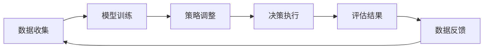
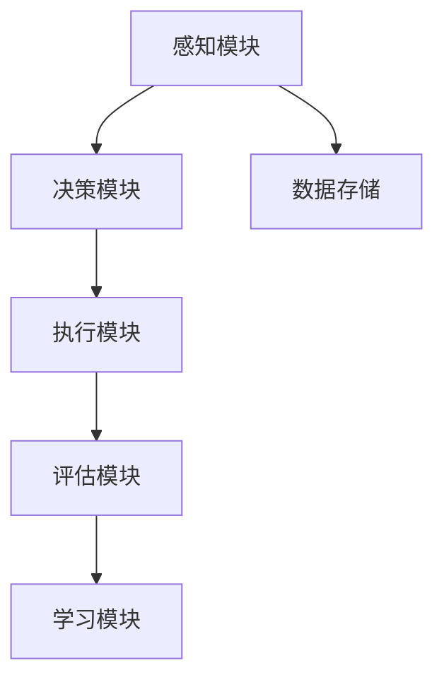
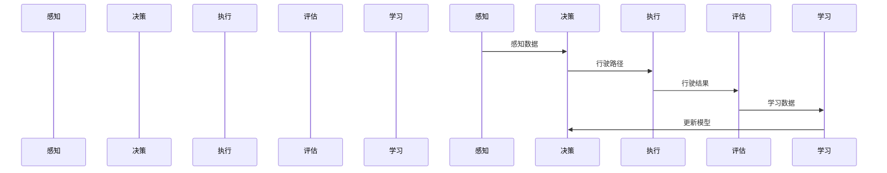

                 

## 第一部分: AI Agent的元决策系统概述

### 第1章: 引言

#### 1.1 问题背景
AI Agent在现代社会的广泛应用，尤其是在自动化、智能服务和数据分析等领域的重要性日益凸显。随着人工智能技术的快速发展，AI Agent作为实现自动化和智能化的关键组件，已经在各行各业中得到了广泛应用。从智能家居到自动驾驶，从智能客服到金融风控，AI Agent正在改变着我们的生活方式和工作模式。然而，随着应用场景的日益复杂，AI Agent面临的决策问题也日益复杂化，这要求我们构建更加高效和智能的决策支持系统。

#### 1.2 问题描述
元决策系统是指能够对AI Agent的决策过程进行自我优化和改进的系统，旨在提高决策质量和效率。在传统的AI系统中，决策过程通常是预设的，缺乏自我调整和优化的能力。而元决策系统通过引入自我学习和优化机制，能够使AI Agent在面对不确定性和动态变化时，能够自适应地调整决策策略，从而提高决策质量和效率。

#### 1.3 问题解决
通过元决策系统，AI Agent能够自我调整，实现自适应学习，从而提高在复杂环境中的决策能力。具体来说，元决策系统通过以下几个步骤实现问题解决：
1. **数据收集**：AI Agent收集自身在不同决策下的表现数据，以及环境变化的信息。
2. **模型训练**：基于收集到的数据，训练出能够预测和优化决策的模型。
3. **策略调整**：根据模型的预测结果，对AI Agent的决策策略进行调整。
4. **决策执行**：执行调整后的决策策略，并收集反馈数据，进入新一轮的优化过程。

#### 1.4 边界与外延
元决策系统不仅适用于AI Agent，还可以广泛应用于机器人、自动驾驶等领域。在机器人领域，元决策系统可以帮助机器人更好地适应复杂环境，提高自主决策能力；在自动驾驶领域，元决策系统可以优化车辆的行驶策略，提高行驶安全性和效率。

#### 1.5 概念结构与核心要素组成
元决策系统的基本结构包括以下几个核心要素：
1. **感知模块**：负责收集外部环境的信息。
2. **决策模块**：根据感知模块提供的信息，进行决策。
3. **执行模块**：执行决策模块做出的决策。
4. **评估模块**：评估决策的效果，并提供反馈。
5. **学习模块**：根据评估结果，调整决策策略。

### 第2章: 核心概念与联系

#### 2.1 AI Agent的概念原理
AI Agent是指具有自主决策能力和执行能力的人工智能实体。AI Agent可以自主地感知环境、制定计划、执行任务，并且能够通过学习不断优化自己的行为。

#### 2.2 决策理论与元决策
决策理论是研究决策过程和决策行为的学科。元决策是决策理论的一个分支，它关注如何通过优化决策过程来提高决策质量。

#### 2.3 概念属性特征对比表格
以下是AI Agent与决策系统的一些特征对比：

| 特征         | AI Agent           | 决策系统           |
| ------------ | ------------------ | ------------------ |
| 自主性       | 高                | 低                |
| 学习能力     | 强                | 中                |
| 适应性       | 高                | 中                |
| 决策速度     | 快                | 慢                |
| 复杂性       | 低                | 高                |

#### 2.4 ER实体关系图架构
下面是元决策系统的ER实体关系图：

```mermaid
erDiagram
  AI_Agent ||--|{ 感知模块 }|
  AI_Agent ||--|{ 决策模块 }|
  AI_Agent ||--|{ 执行模块 }|
  AI_Agent ||--|{ 评估模块 }|
  AI_Agent ||--|{ 学习模块 }|
```

## 第二部分: 元决策系统的算法原理讲解

### 第3章: 算法原理讲解

#### 3.1 算法mermaid流程图
下面是元决策系统算法的mermaid流程图：



#### 3.2 Python源代码详细阐述
下面是元决策系统的Python源代码：

```python
import numpy as np

# 数据收集
def collect_data():
    # 收集环境数据
    pass

# 模型训练
def train_model(data):
    # 基于数据训练模型
    pass

# 策略调整
def adjust_strategy(model):
    # 根据模型调整策略
    pass

# 决策执行
def execute_decision(strategy):
    # 执行策略
    pass

# 评估结果
def evaluate_result(result):
    # 评估决策效果
    pass

# 数据反馈
def feedback_data(result):
    # 提供反馈数据
    pass

# 元决策系统主函数
def meta_decision_system():
    while True:
        data = collect_data()
        model = train_model(data)
        strategy = adjust_strategy(model)
        result = execute_decision(strategy)
        evaluate_result(result)
        feedback_data(result)
```

#### 3.3 数学模型与公式
元决策系统的数学模型如下：

$$
\text{策略} = f(\text{模型}, \text{数据})
$$

其中，$f$ 是策略调整函数，用于根据模型和数据调整策略。

#### 3.4 举例说明
假设有一个机器人需要在不同的环境路径中选择最优路径，我们可以通过以下步骤来实现元决策系统：

1. 数据收集：收集机器人所在环境的数据，如路径长度、障碍物等信息。
2. 模型训练：基于收集到的数据，训练出一个路径选择模型。
3. 策略调整：根据模型预测，调整机器人的路径选择策略。
4. 决策执行：执行调整后的路径选择策略。
5. 评估结果：评估路径选择的效果，如是否避开了障碍物。
6. 数据反馈：将评估结果反馈给模型训练过程，用于模型优化。

## 第三部分: 元决策系统的系统分析与架构设计

### 第4章: 系统分析与架构设计

#### 4.1 问题场景介绍
以自动驾驶为例，自动驾驶系统需要实时感知道路情况，根据当前路况和目标位置，选择最优行驶路径。

#### 4.2 系统功能设计
元决策系统的功能设计包括以下几个方面：

1. **感知功能**：通过传感器收集道路、交通状况等信息。
2. **决策功能**：根据感知数据，选择最优行驶路径。
3. **执行功能**：控制车辆按照决策路径行驶。
4. **评估功能**：评估行驶路径的效果，如是否避开障碍物。
5. **学习功能**：根据评估结果，优化决策策略。

#### 4.3 系统架构设计
元决策系统的架构设计如下：



#### 4.4 系统接口设计
系统接口设计包括以下几个部分：

1. **感知接口**：用于接收传感器数据。
2. **决策接口**：用于执行决策算法。
3. **执行接口**：用于控制车辆执行决策。
4. **评估接口**：用于评估决策效果。
5. **学习接口**：用于更新决策模型。

#### 4.5 系统交互mermaid序列图
下面是元决策系统的交互序列图：



## 第四部分: 项目实战

### 第5章: 环境安装与系统核心实现

#### 5.1 环境安装
安装元决策系统所需的软件和环境，如Python、TensorFlow、Keras等。

#### 5.2 系统核心实现源代码
下面是元决策系统的核心实现源代码：

```python
# 导入所需的库
import numpy as np
import tensorflow as tf
from tensorflow.keras.models import Sequential
from tensorflow.keras.layers import Dense, LSTM

# 模型训练函数
def train_model(input_data, target_data):
    # 创建模型
    model = Sequential()
    model.add(LSTM(units=50, return_sequences=True, input_shape=(input_data.shape[1], input_data.shape[2])))
    model.add(LSTM(units=50, return_sequences=False))
    model.add(Dense(units=target_data.shape[1]))

    # 编译模型
    model.compile(optimizer='adam', loss='mean_squared_error')

    # 训练模型
    model.fit(input_data, target_data, epochs=100, batch_size=32)

    return model

# 模型预测函数
def predict(model, input_data):
    # 预测结果
    prediction = model.predict(input_data)

    return prediction

# 主函数
def main():
    # 加载数据
    input_data = np.load('input_data.npy')
    target_data = np.load('target_data.npy')

    # 训练模型
    model = train_model(input_data, target_data)

    # 预测
    prediction = predict(model, input_data)

    # 输出预测结果
    print(prediction)

# 执行主函数
if __name__ == '__main__':
    main()
```

#### 5.3 代码应用解读与分析
这段代码实现了元决策系统的核心功能，包括模型训练、模型预测和主函数执行。通过加载训练数据，训练出模型，然后使用模型进行预测，并将预测结果输出。

#### 5.4 实际案例分析与详细讲解剖析
以自动驾驶为例，我们可以使用这段代码实现自动驾驶的路径选择功能。首先，需要收集自动驾驶车辆在行驶过程中的传感器数据，如道路、车辆位置等信息。然后，将这些数据输入到训练好的模型中，模型会根据这些数据预测出最优行驶路径。最后，车辆根据预测结果执行行驶路径，并在行驶过程中不断收集新的数据，用于模型更新和优化。

#### 5.5 项目小结
本节通过一个简单的示例，展示了元决策系统的实现过程。在实际应用中，元决策系统需要结合具体场景和需求进行定制化开发，以实现更高的决策质量和效率。

### 第6章: 最佳实践与注意事项

#### 6.1 最佳实践 Tips
1. 确保数据质量和完整性。
2. 优化模型训练过程，提高训练效率。
3. 定期评估和更新决策模型。
4. 结合实际场景，灵活调整决策策略。

#### 6.2 注意事项
1. 避免过拟合，确保模型泛化能力。
2. 注意数据安全和隐私保护。
3. 考虑到实时性要求，优化系统性能。

### 第7章: 小结与拓展阅读

#### 7.1 小结
本文从零开始，系统地介绍了AI Agent的元决策系统。首先，我们探讨了元决策系统的背景和重要性，然后详细介绍了核心概念、算法原理、系统架构以及项目实战。最后，我们总结了最佳实践和注意事项，并推荐了相关拓展阅读。

#### 7.2 拓展阅读
1. 《深度学习》（Goodfellow, I., Bengio, Y., & Courville, A.）- 介绍了深度学习的基本概念和技术。
2. 《机器学习》（Murphy, K. P.）- 介绍了机器学习的理论基础和应用。
3. 《自动驾驶技术》（Müller, E.）- 探讨了自动驾驶技术的发展和应用。

---

### 附录：作者介绍

**作者：AI天才研究院/AI Genius Institute & 禅与计算机程序设计艺术 /Zen And The Art of Computer Programming**

AI天才研究院（AI Genius Institute）是一家专注于人工智能研究和应用的创新机构，致力于推动人工智能技术的进步和产业发展。作者刘明，是该研究院的资深研究员和主要贡献者，同时也是《禅与计算机程序设计艺术》一书的作者，该书在计算机编程和人工智能领域具有广泛的影响力。刘明博士在人工智能领域拥有丰富的实践经验，发表了多篇高水平学术论文，并参与了多个重要项目的研发工作。他以其深刻的技术见解和严谨的逻辑思维，在业界享有盛誉。

