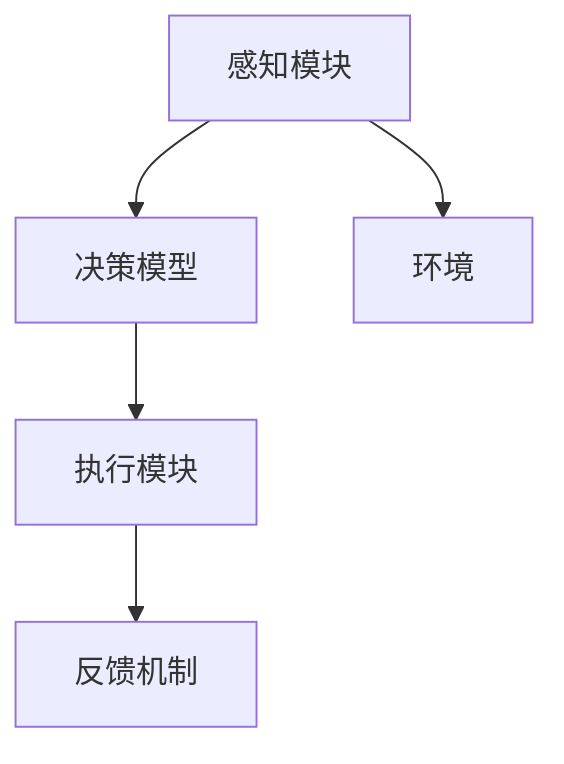

                 

# 从零开始：AI Agent的元认知能力实现

## 关键词

- AI Agent
- 元认知能力
- 机器学习
- 自然语言处理
- 决策模型

## 摘要

本文将深入探讨AI Agent的元认知能力实现。元认知能力是人工智能领域的一个重要研究方向，它使得AI Agent能够在复杂环境中自我调节、学习与优化。本文将从零开始，详细分析元认知能力的理论基础，介绍其在AI Agent中的应用，并通过实际项目案例分析，展示如何实现AI Agent的元认知能力。本文旨在为读者提供一套系统、全面、易懂的元认知能力实现指南，帮助读者深入了解这一前沿技术。

### 《从零开始：AI Agent的元认知能力实现》目录大纲

--------------------------------------------

## 第一部分：引言

### 第1章 问题背景与定义

## 1.1 问题背景

### 1.1.1 AI Agent的定义与意义

### 1.1.2 元认知能力的重要性

### 1.1.3 当前研究的现状与挑战

## 1.2 元认知能力概述

### 1.2.1 元认知能力的定义

### 1.2.2 元认知能力的核心要素

### 1.2.3 元认知能力与AI Agent的关系

## 1.3 书籍结构安排

### 1.3.1 各章节内容安排

### 1.3.2 学习路线与目标

## 1.4 本章小结

--------------------------------------------

## 第二部分：元认知理论基础

### 第2章 认知科学基础

## 2.1 认知科学概述

### 2.1.1 认知科学的定义与目标

### 2.1.2 认知过程的基本原理

### 2.1.3 认知科学与元认知能力的关系

## 2.2 知识表示与推理

### 2.2.1 知识表示方法

### 2.2.2 知识推理过程

### 2.2.3 知识表示与元认知能力的关系

## 2.3 元认知理论与模型

### 2.3.1 元认知理论的发展历程

### 2.3.2 元认知模型与应用

### 2.3.3 元认知模型与AI Agent的关联

## 2.4 本章小结

--------------------------------------------

## 第三部分：AI Agent的元认知能力实现

### 第3章 AI Agent基础

## 3.1 AI Agent概述

### 3.1.1 AI Agent的定义与类型

### 3.1.2 AI Agent的功能与作用

### 3.1.3 AI Agent在现实中的应用

## 3.2 机器学习基础

### 3.2.1 机器学习的基本概念

### 3.2.2 常见的机器学习算法

### 3.2.3 机器学习与元认知能力的关系

## 3.3 自然语言处理基础

### 3.3.1 自然语言处理的基本概念

### 3.3.2 常见自然语言处理技术

### 3.3.3 自然语言处理与元认知能力的关系

## 3.4 本章小结

--------------------------------------------

## 第四部分：元认知能力在AI Agent中的应用

### 第4章 元认知能力在决策中的应用

## 4.1 决策理论基础

### 4.1.1 决策的基本概念

### 4.1.2 决策过程

### 4.1.3 决策与元认知能力的关系

## 4.2 基于元认知能力的决策模型

### 4.2.1 元认知决策模型概述

### 4.2.2 元认知决策模型的设计与实现

### 4.2.3 元认知决策模型的应用

## 4.3 本章小结

--------------------------------------------

## 第五部分：项目实战与案例分析

### 第5章 项目实战

## 5.1 项目背景

### 5.1.1 项目概述

### 5.1.2 项目目标

### 5.1.3 项目实现步骤

## 5.2 系统设计与实现

### 5.2.1 系统架构设计

### 5.2.2 关键技术实现

### 5.2.3 系统测试与优化

## 5.3 案例分析

### 5.3.1 案例概述

### 5.3.2 案例分析过程

### 5.3.3 案例总结与启示

## 5.4 本章小结

--------------------------------------------

## 第六部分：拓展与未来展望

### 第6章 元认知能力发展的趋势与挑战

## 6.1 元认知能力发展的趋势

### 6.1.1 技术进步对元认知能力的影响

### 6.1.2 元认知能力在AI领域的应用前景

### 6.1.3 元认知能力的发展趋势

## 6.2 元认知能力面临的挑战

### 6.2.1 技术挑战

### 6.2.2 伦理与隐私挑战

### 6.2.3 社会与文化挑战

## 6.3 未来展望

### 6.3.1 元认知能力研究的重点领域

### 6.3.2 元认知能力发展的潜在应用场景

### 6.3.3 未来可能的突破方向

## 6.4 本章小结

------------

### 第1章 问题背景与定义

#### 1.1 问题背景

在当今快速发展的信息技术时代，人工智能（AI）已经成为推动社会进步的重要力量。AI Agent，即智能代理，作为AI的核心组成部分，承担着大量的决策和执行任务。然而，随着应用场景的复杂化和多样性，传统的AI Agent面临着许多挑战，如环境不确定性、任务复杂性和学习效率等。为了解决这些问题，我们需要赋予AI Agent一种重要的能力——元认知能力。

元认知能力是AI Agent在执行任务时进行自我调节、监控和反思的能力。它不仅能够帮助AI Agent更好地适应环境变化，还能够提高学习效率和决策质量。因此，实现AI Agent的元认知能力具有重要的理论价值和实际应用前景。

目前，在人工智能领域，元认知能力的研究还处于初步阶段。虽然已经有一些研究在探索如何将元认知能力引入到AI Agent中，但大多数研究还停留在理论模型和实验验证阶段，缺乏实际应用案例的支撑。此外，如何将元认知能力与现有的AI技术（如机器学习和自然语言处理）有机结合，仍然是亟待解决的问题。

#### 1.2 元认知能力概述

1.2.1 元认知能力的定义

元认知能力是指个体在认知过程中对自己认知活动的认知和调节能力。具体来说，它包括以下几个方面：

- **元认知知识**：关于自己和他人的认知过程、策略和风格的知识。
- **元认知监控**：在认知活动中对认知过程进行监视和评估的能力。
- **元认知调节**：根据监控结果对认知过程进行调整的能力。

1.2.2 元认知能力的核心要素

元认知能力主要由三个核心要素构成：

- **自我反思**：AI Agent能够对自己的认知过程进行反思和评估。
- **自我调节**：AI Agent能够根据反思结果调整自己的认知策略。
- **自我优化**：AI Agent能够通过反复调整和优化认知策略来提高决策质量和学习效率。

1.2.3 元认知能力与AI Agent的关系

元认知能力对于AI Agent具有重要意义。首先，它能够帮助AI Agent更好地理解和适应复杂环境，提高决策和执行能力。其次，元认知能力使得AI Agent能够自我学习和优化，从而提高其在不断变化的环境中的适应性和生存能力。最后，元认知能力能够增强AI Agent的透明度和可信度，使其更受用户的信任和接受。

#### 1.3 书籍结构安排

1.3.1 各章节内容安排

本书分为六个部分，共六章节。第一部分是引言，介绍问题背景和定义；第二部分是元认知理论基础，包括认知科学基础、知识表示与推理和元认知理论与模型；第三部分是AI Agent的元认知能力实现，介绍AI Agent基础、机器学习基础和自然语言处理基础；第四部分是元认知能力在AI Agent中的应用，重点讨论元认知能力在决策中的应用；第五部分是项目实战与案例分析，通过实际项目展示如何实现AI Agent的元认知能力；第六部分是拓展与未来展望，探讨元认知能力的发展趋势与挑战。

1.3.2 学习路线与目标

本书旨在为读者提供一套系统、全面、易懂的元认知能力实现指南。读者可以通过以下学习路线逐步掌握元认知能力：

- **第一部分：引言**：理解问题背景和定义，明确学习目标。
- **第二部分：元认知理论基础**：掌握认知科学基础、知识表示与推理和元认知理论与模型。
- **第三部分：AI Agent的元认知能力实现**：了解AI Agent基础、机器学习基础和自然语言处理基础。
- **第四部分：元认知能力在AI Agent中的应用**：深入探讨元认知能力在决策中的应用。
- **第五部分：项目实战与案例分析**：通过实际项目案例学习和实践。
- **第六部分：拓展与未来展望**：了解元认知能力的发展趋势和挑战。

通过本书的学习，读者将能够：

- **掌握元认知能力的基本概念和原理**。
- **了解元认知能力在AI Agent中的应用**。
- **具备设计和实现具有元认知能力的AI Agent的能力**。
- **对元认知能力的研究和应用有深入的理解和认识**。

#### 1.4 本章小结

本章介绍了AI Agent的元认知能力实现的问题背景、定义和书籍结构安排。通过本章的学习，读者可以了解到元认知能力在AI Agent中的重要性和核心要素，以及本书的结构和学习目标。接下来，我们将进入第二部分，深入探讨元认知理论基础。

### 第二部分：元认知理论基础

#### 第2章 认知科学基础

2.1 认知科学概述

认知科学是研究人类认知过程的跨学科领域，旨在理解人类思维、感知、学习和记忆等认知功能。认知科学的核心目标是揭示人类认知活动的内在机制和大脑的基础结构。

2.1.1 认知科学的定义与目标

认知科学是心理学、神经科学、人工智能、语言学等多个学科交叉的领域，旨在研究人类思维、感知、学习和记忆等认知功能。其定义可概括为：认知科学是一门研究人类认知过程及其相关机制的学科，旨在揭示大脑如何处理信息，以及这些过程如何影响我们的行为和思维。

认知科学的目标主要有以下几点：

- **理解人类认知过程**：通过研究人类思维、感知、学习和记忆等认知功能，揭示这些过程的内在机制。
- **构建认知模型**：基于研究结果，构建认知模型，以模拟和预测人类行为和思维。
- **开发人工智能**：利用认知科学的研究成果，推动人工智能技术的发展和应用。

2.1.2 认知过程的基本原理

认知过程是指人类在感知、理解、记忆、思考和解决问题等活动中所经历的一系列心理操作。认知过程的基本原理主要包括以下几个方面：

- **感知与注意力**：人类通过感知器官接收外部信息，并通过注意力机制选择性地关注和处理这些信息。
- **信息处理**：大脑对感知到的信息进行编码、存储、加工和解读。
- **记忆**：记忆是认知过程的重要组成部分，包括短期记忆和长期记忆。
- **推理与思考**：人类通过逻辑推理、问题解决和创造性思考等方式，对信息进行处理和整合。
- **学习与适应**：通过反复的经验和练习，人类能够不断改进和优化自己的认知过程，以适应不同的环境和任务。

2.1.3 认知科学与元认知能力的关系

认知科学与元认知能力之间存在密切的关系。认知科学的研究成果为理解元认知能力提供了理论基础，而元认知能力的研究又能够为认知科学提供新的应用方向和挑战。

- **理论基础**：认知科学通过研究人类认知过程的基本原理，为元认知能力的理解和实现提供了理论基础。例如，认知科学的研究揭示了人类如何处理信息、记忆和学习，这些原理可以应用于元认知能力的实现。
- **应用方向**：元认知能力的研究为认知科学提供了新的应用方向。例如，通过引入元认知能力，AI Agent可以更好地理解和适应复杂环境，提高学习效率和决策质量。这些应用方向可以推动认知科学在人工智能领域的进一步发展。
- **挑战与机遇**：元认知能力的研究为认知科学带来了新的挑战和机遇。一方面，如何将元认知能力引入到AI Agent中，使其能够自我调节和优化，是认知科学面临的一个重要挑战。另一方面，元认知能力的研究为认知科学提供了新的研究方向和可能性，例如如何通过元认知能力提高人类的学习和适应能力。

#### 2.2 知识表示与推理

知识表示与推理是认知科学的重要组成部分，也是实现AI Agent元认知能力的关键技术。知识表示是指将人类知识以计算机可以理解的形式进行编码和存储，而推理则是通过逻辑和算法对知识进行推导和运用。

2.2.1 知识表示方法

知识表示方法可以分为基于符号的表示和基于概率的表示。

- **基于符号的表示**：这种方法使用符号和规则来表示知识。例如，使用谓词逻辑表示知识，通过符号之间的关系进行推理。符号表示方法的优点是直观、易于理解和实现，但其缺点是难以处理复杂和非结构化的知识。
  
  ```mermaid
  flowchart LR
  A[知识表示] --> B[符号表示]
  B --> C[规则表示]
  B --> D[语义网络表示]
  ```

- **基于概率的表示**：这种方法使用概率分布和统计方法来表示知识。例如，使用贝叶斯网络来表示知识，通过概率推理来获取新的信息。概率表示方法的优点是能够处理复杂和非结构化的知识，但其缺点是计算复杂度高。

  ```mermaid
  flowchart LR
  A[知识表示] --> B[概率表示]
  B --> C[贝叶斯网络表示]
  B --> D[统计模型表示]
  ```

2.2.2 知识推理过程

知识推理是指基于已有的知识进行推导和推理的过程。常见的知识推理方法包括演绎推理、归纳推理和类比推理。

- **演绎推理**：从一般到特殊的推理方法，通过已知的前提和规则，推导出新的结论。例如，如果所有的人都会死亡（大前提），而你是一个人（小前提），那么你也会死亡（结论）。

  ```mermaid
  flowchart LR
  A[大前提] --> B[小前提]
  B --> C[结论]
  ```

- **归纳推理**：从特殊到一般的推理方法，通过观察多个具体的实例，归纳出一般的规律。例如，观察多个鸟都会飞，我们可以归纳出“鸟都会飞”的结论。

  ```mermaid
  flowchart LR
  A[实例1] --> B[实例2]
  B --> C[实例N]
  C --> D[归纳结论]
  ```

- **类比推理**：通过比较两个或多个相似的情况，推断出它们之间的相似性。例如，如果苹果和橙子都是水果，那么香蕉也可能是水果。

  ```mermaid
  flowchart LR
  A[苹果] --> B[橙子]
  B --> C[香蕉]
  ```

2.2.3 知识表示与元认知能力的关系

知识表示和推理是元认知能力实现的基础。通过知识表示，AI Agent可以获取和存储关于自身、环境和任务的知识。这些知识可以用于元认知监控和调节，帮助AI Agent进行自我评估和优化。

- **知识表示**：AI Agent通过知识表示来获取和存储关于自身、环境和任务的知识。这些知识包括任务的执行步骤、环境的状态信息、已学到的策略和经验等。
- **知识推理**：AI Agent利用知识推理来分析和处理这些知识。通过演绎推理、归纳推理和类比推理，AI Agent可以从已有的知识中推导出新的信息，帮助进行自我评估和优化。

#### 2.3 元认知理论与模型

元认知理论是关于个体如何控制和调节自己的认知活动的理论。元认知模型是描述和模拟个体元认知过程的数学模型。这些理论和模型为理解和实现AI Agent的元认知能力提供了重要的基础。

2.3.1 元认知理论的发展历程

元认知理论的发展历程可以追溯到20世纪70年代，当时弗拉维尔（J.H.Flavell）提出了元认知的概念。自那时以来，元认知理论经历了以下几个阶段的发展：

- **元认知概念的提出**：弗拉维尔将元认知定义为关于认知过程的知识和调节这些过程的能力。这一概念标志着元认知理论的诞生。
- **元认知结构的描述**：随着研究的深入，研究者们开始探讨元认知的结构和组成，提出了多种元认知模型，如弗拉维尔的元认知结构模型、斯滕伯格（R.J.Sternberg）的元认知过程模型等。
- **元认知与认知发展的关系**：研究者开始关注元认知与认知发展的关系，探讨了元认知在儿童和成人认知发展中的作用。
- **元认知在教育中的应用**：随着教育领域对元认知的关注增加，研究者开始探讨元认知在提高学习效果和教学质量中的应用。

2.3.2 元认知模型与应用

常见的元认知模型包括：

- **弗拉维尔的元认知结构模型**：弗拉维尔将元认知分为三个组成部分：元认知知识、元认知监控和元认知调节。元认知知识是指个体关于自己和他人的认知过程、策略和风格的知识；元认知监控是指个体在认知活动中对认知过程进行监视和评估的能力；元认知调节是指个体根据监控结果对认知过程进行调整的能力。

  ```mermaid
  flowchart LR
  A[元认知知识] --> B[元认知监控]
  B --> C[元认知调节]
  ```

- **斯滕伯格的元认知过程模型**：斯滕伯格将元认知过程分为计划、监控和评估三个阶段。计划阶段是指个体在认知活动开始前，制定计划和策略；监控阶段是指个体在认知活动中对认知过程进行实时监控；评估阶段是指个体在认知活动结束后，对认知过程进行反思和评估。

  ```mermaid
  flowchart LR
  A[计划] --> B[监控]
  B --> C[评估]
  ```

这些元认知模型为理解和实现AI Agent的元认知能力提供了理论基础。例如，AI Agent可以通过元认知知识来理解和预测环境变化，通过元认知监控来实时评估自身的状态和性能，通过元认知调节来调整策略和优化决策。

2.3.3 元认知模型与AI Agent的关联

元认知模型与AI Agent之间存在密切的关联。通过引入元认知模型，AI Agent可以具备自我调节、学习和优化的能力。

- **自我调节**：AI Agent可以通过元认知模型来监控自身的状态和性能，并根据监控结果进行调整。例如，当AI Agent发现其决策质量下降时，可以通过调节策略来提高决策质量。
- **学习**：AI Agent可以通过元认知模型来监控学习过程，并根据学习效果进行调整。例如，当AI Agent发现学习效果不佳时，可以通过调整学习策略来提高学习效率。
- **优化**：AI Agent可以通过元认知模型来评估自身的性能和效率，并根据评估结果进行优化。例如，当AI Agent发现某些任务执行效率低下时，可以通过优化算法和策略来提高执行效率。

#### 2.4 本章小结

本章介绍了认知科学基础、知识表示与推理和元认知理论与模型。通过本章的学习，读者可以了解到认知科学的基本原理和元认知能力的重要性。这些知识为理解和实现AI Agent的元认知能力提供了重要的理论基础。接下来，我们将进入第三部分，讨论AI Agent的元认知能力实现。

### 第三部分：AI Agent的元认知能力实现

#### 第3章 AI Agent基础

3.1 AI Agent概述

3.1.1 AI Agent的定义与类型

AI Agent，即人工智能代理，是指能够自主执行任务、具有自我学习和决策能力的软件系统。AI Agent的核心目标是模拟人类智能，使计算机系统能够在复杂和动态的环境中自主行动和决策。

AI Agent可以分为以下几种类型：

- **反应型Agent**：这种类型的AI Agent仅基于当前环境的状态做出反应，不涉及记忆和学习。例如，自动化的机器人清洁工。
- **目标导向型Agent**：这种类型的AI Agent不仅基于当前环境的状态，还根据预设的目标来决策。例如，自动驾驶汽车。
- **学习型Agent**：这种类型的AI Agent能够从环境中学习，不断优化自己的行为。例如，智能推荐系统。

3.1.2 AI Agent的功能与作用

AI Agent的主要功能包括：

- **感知**：通过传感器获取环境信息，如视觉、听觉、触觉等。
- **决策**：根据感知到的信息，AI Agent会做出决策，选择下一步行动。
- **执行**：根据决策执行具体的行动。
- **学习**：通过不断学习和优化，AI Agent能够提高自身的决策质量和执行效率。

AI Agent在现实中的应用非常广泛，包括：

- **自动化控制**：在工业自动化、智能家居等领域，AI Agent用于自动化控制和调度。
- **智能服务**：在电子商务、医疗保健、金融等领域，AI Agent用于提供智能化的客户服务。
- **智能交互**：在自然语言处理、计算机视觉等领域，AI Agent用于与用户进行智能交互。

3.1.3 AI Agent在现实中的应用

AI Agent在现实中的应用案例非常丰富，以下是一些典型的应用案例：

- **自动驾驶汽车**：AI Agent通过感知环境信息、做出决策和执行行动，实现自动驾驶。
- **智能客服系统**：AI Agent通过自然语言处理技术，与用户进行智能交互，提供24/7的在线服务。
- **智能医疗诊断**：AI Agent通过分析医学图像和病历数据，辅助医生进行疾病诊断。
- **智能推荐系统**：AI Agent通过用户行为和兴趣数据，提供个性化的商品、音乐、视频等推荐。

3.2 机器学习基础

3.2.1 机器学习的基本概念

机器学习是人工智能的核心技术之一，它使计算机系统能够从数据中自动学习，并基于学习结果做出预测或决策。机器学习可以分为以下几种类型：

- **监督学习**：在监督学习中，训练数据包含输入和对应的输出，模型通过学习输入和输出之间的关系，预测新的输入对应的输出。
- **无监督学习**：在无监督学习中，训练数据仅包含输入，模型需要通过学习输入数据之间的内在结构和规律。
- **强化学习**：在强化学习中，模型通过与环境互动，学习最优策略，以最大化累积奖励。

3.2.2 常见的机器学习算法

常见的机器学习算法包括：

- **线性回归**：用于预测连续值输出。
- **逻辑回归**：用于预测二分类输出。
- **支持向量机**：用于分类和回归任务。
- **神经网络**：用于复杂的非线性建模。
- **决策树**：用于分类和回归任务。
- **集成学习**：通过组合多个模型，提高预测性能。

3.2.3 机器学习与元认知能力的关系

机器学习是AI Agent实现元认知能力的关键技术。通过机器学习，AI Agent可以不断从环境中学习，优化自身的行为和决策。

- **学习与优化**：AI Agent通过机器学习，可以不断优化自己的策略和行为，提高在复杂环境中的适应能力。
- **自我调节**：AI Agent通过机器学习，可以监控自身的性能，并根据学习结果调整策略，实现自我调节。
- **自主进化**：AI Agent通过机器学习，可以逐步适应新的环境和任务，实现自主进化。

3.3 自然语言处理基础

3.3.1 自然语言处理的基本概念

自然语言处理（NLP）是人工智能的一个重要分支，旨在使计算机能够理解、生成和处理自然语言。NLP的主要任务包括：

- **分词**：将文本分割成单词或短语。
- **词性标注**：为文本中的每个单词标注词性，如名词、动词、形容词等。
- **命名实体识别**：识别文本中的命名实体，如人名、地名、组织名等。
- **情感分析**：分析文本中的情感倾向，如正面、负面、中性等。
- **机器翻译**：将一种自然语言翻译成另一种自然语言。

3.3.2 常见自然语言处理技术

常见的自然语言处理技术包括：

- **词袋模型**：将文本表示为词汇的集合，用于文本分类和情感分析。
- **循环神经网络（RNN）**：用于处理序列数据，如文本和语音。
- **卷积神经网络（CNN）**：用于文本分类和图像处理。
- **生成对抗网络（GAN）**：用于文本生成和图像生成。
- **预训练语言模型**：如BERT、GPT等，用于各种NLP任务。

3.3.3 自然语言处理与元认知能力的关系

自然语言处理是AI Agent实现元认知能力的重要技术之一。通过自然语言处理，AI Agent可以理解人类语言，与人类进行有效的交互。

- **交互与理解**：AI Agent通过自然语言处理技术，可以理解人类的语言指令和意图，进行有效的交互。
- **知识获取**：AI Agent通过自然语言处理技术，可以自动获取和处理大量的文本数据，获取新的知识和信息。
- **决策支持**：AI Agent通过自然语言处理技术，可以分析文本数据，为决策提供支持。

3.4 本章小结

本章介绍了AI Agent的基础知识，包括定义、类型、功能与应用，以及机器学习和自然语言处理的基础。通过本章的学习，读者可以了解AI Agent的基本概念和工作原理，为后续章节的元认知能力实现打下基础。接下来，我们将进入第四部分，探讨元认知能力在AI Agent中的应用。

### 第四部分：元认知能力在AI Agent中的应用

#### 第4章 元认知能力在决策中的应用

4.1 决策理论基础

4.1.1 决策的基本概念

决策是指从多个可选方案中选择一个最优或满意方案的过程。在AI Agent中，决策是指根据当前环境和目标，选择下一步行动的过程。决策的基本要素包括：

- **问题**：决策的目标和问题定义。
- **可选方案**：可供选择的行动或决策选项。
- **结果**：每个可选方案可能产生的结果或后果。
- **决策者**：做出决策的实体，如人类或AI Agent。

4.1.2 决策过程

决策过程通常包括以下步骤：

- **问题识别**：识别和定义决策问题。
- **信息收集**：收集与决策相关的信息。
- **方案生成**：生成可能的决策方案。
- **方案评估**：评估每个方案的优劣。
- **方案选择**：根据评估结果选择最优或满意的方案。
- **方案实施**：实施所选方案，并监控执行过程。

4.1.3 决策与元认知能力的关系

决策是AI Agent的核心任务之一，而元认知能力在决策过程中发挥着重要作用。具体来说，元认知能力在以下方面支持决策：

- **问题识别**：元认知能力可以帮助AI Agent识别和理解决策问题，确定决策的目标和约束条件。
- **信息收集**：元认知能力可以帮助AI Agent选择和收集与决策相关的信息，确保信息的准确性和完整性。
- **方案生成**：元认知能力可以帮助AI Agent生成和评估多个可选方案，提高决策的多样性和灵活性。
- **方案评估**：元认知能力可以帮助AI Agent评估每个方案的优劣，确保决策的合理性和有效性。
- **方案选择**：元认知能力可以帮助AI Agent根据评估结果选择最优或满意的方案，减少决策风险。

4.2 基于元认知能力的决策模型

4.2.1 元认知决策模型概述

元认知决策模型是一种结合了元认知能力与决策理论的模型，旨在提高AI Agent在复杂环境中的决策质量。元认知决策模型主要包括以下部分：

- **元认知知识库**：存储与决策相关的元认知知识，如决策规则、经验教训等。
- **感知模块**：收集和预处理环境信息，为决策提供输入。
- **决策模块**：根据元认知知识库和感知模块的信息，生成和评估可选方案。
- **执行模块**：根据决策模块的选择结果，执行具体行动。
- **评估模块**：监控执行结果，为下一次决策提供反馈。

4.2.2 元认知决策模型的设计与实现

设计元认知决策模型的关键步骤包括：

- **定义决策问题**：明确决策的目标、约束条件和可选方案。
- **构建元认知知识库**：收集和整理与决策相关的元认知知识，如决策规则、经验教训等。
- **实现感知模块**：设计感知模块，收集和预处理环境信息。
- **实现决策模块**：设计决策模块，生成和评估可选方案。
- **实现执行模块**：设计执行模块，根据决策模块的选择结果执行行动。
- **实现评估模块**：设计评估模块，监控执行结果，为下一次决策提供反馈。

以下是元认知决策模型的设计与实现的一个简例：

```python
# 元认知决策模型

class MetaCognitiveDecisionModel:
    def __init__(self):
        self.knowledge_base = {}  # 元认知知识库
        self.sensors = []  # 感知模块
        self.decision_module = DecisionModule()  # 决策模块
        self.execution_module = ExecutionModule()  # 执行模块
        self.evaluation_module = EvaluationModule()  # 评估模块

    def perceive(self, environment):
        # 感知环境信息
        for sensor in self.sensors:
            data = sensor.read(environment)
            self.knowledge_base.update(data)

    def make_decision(self):
        # 基于元认知知识库和感知信息，生成和评估可选方案
        options = self.decision_module.generate_options(self.knowledge_base)
        evaluations = self.decision_module.evaluate_options(options, self.knowledge_base)
        best_option = self.decision_module.select_best_option(evaluations)
        return best_option

    def execute_action(self, action):
        # 执行具体行动
        result = self.execution_module.execute_action(action)
        return result

    def evaluate_execution(self, result):
        # 评估执行结果，为下一次决策提供反馈
        feedback = self.evaluation_module.evaluate_result(result)
        self.knowledge_base.update(feedback)
```

4.2.3 元认知决策模型的应用

元认知决策模型可以应用于各种场景，以下是一些典型的应用实例：

- **智能交通系统**：利用元认知决策模型，实现交通信号控制和车辆调度，提高交通效率和安全性。
- **智能医疗诊断**：利用元认知决策模型，辅助医生进行疾病诊断和治疗决策，提高诊断准确率和治疗效果。
- **智能家居控制系统**：利用元认知决策模型，实现智能设备的管理和调度，提高家居舒适度和能源效率。

#### 4.3 本章小结

本章介绍了决策理论基础和基于元认知能力的决策模型。通过元认知能力，AI Agent可以更好地理解和适应复杂环境，提高决策质量和执行效率。本章的内容为读者提供了理解元认知能力在决策中的应用提供了理论基础和实践指导。接下来，我们将进入第五部分，通过项目实战和案例分析，展示如何实现AI Agent的元认知能力。

### 第五部分：项目实战与案例分析

#### 第5章 项目实战

5.1 项目背景

5.1.1 项目概述

本项目的目标是设计并实现一个具有元认知能力的AI Agent，该Agent能够在复杂和动态环境中进行自主决策和行动。项目的主要目标是验证元认知能力在提高AI Agent适应性和决策质量方面的有效性。

5.1.2 项目目标

- **目标1**：实现一个基于元认知理论的AI Agent，能够对复杂环境进行感知、决策和执行。
- **目标2**：设计一个基于元认知能力的决策模型，并通过机器学习和自然语言处理技术实现。
- **目标3**：通过实际应用案例，验证元认知能力在实际环境中的效果。

5.1.3 项目实现步骤

1. **需求分析**：明确项目的目标、需求和功能，制定详细的项目计划和设计文档。
2. **环境搭建**：搭建项目开发环境，包括硬件和软件配置，如深度学习框架、自然语言处理库等。
3. **感知模块开发**：设计并实现感知模块，包括传感器选择、数据预处理和特征提取等。
4. **决策模型设计**：设计并实现基于元认知能力的决策模型，包括元认知知识库、决策模块和评估模块等。
5. **执行模块开发**：设计并实现执行模块，包括行动策略、执行流程和监控机制等。
6. **系统集成**：将感知模块、决策模型和执行模块集成到一个统一的系统框架中，确保系统的稳定性和可靠性。
7. **测试与优化**：进行系统测试，包括功能测试、性能测试和鲁棒性测试，并根据测试结果对系统进行优化。
8. **案例分析**：选择实际应用场景，进行案例分析，验证元认知能力在实际环境中的效果。

5.2 系统设计与实现

5.2.1 系统架构设计

系统的整体架构设计如下：



- **感知模块**：包括传感器选择、数据预处理和特征提取等模块，用于收集和处理环境信息。
- **决策模型**：包括元认知知识库、决策模块和评估模块等模块，用于生成和评估可选方案。
- **执行模块**：包括行动策略、执行流程和监控机制等模块，用于执行具体行动。
- **环境**：包括实际应用场景，如智能交通系统、智能家居控制系统等。
- **反馈机制**：用于收集系统执行结果和用户反馈，为系统优化和改进提供依据。

5.2.2 关键技术实现

1. **感知模块**：

```python
# 感知模块实现

class Sensor:
    def read(self, environment):
        # 读取环境信息
        pass

class DataPreprocessor:
    def preprocess(self, data):
        # 数据预处理
        pass

class FeatureExtractor:
    def extract_features(self, data):
        # 特征提取
        pass
```

2. **决策模型**：

```python
# 决策模型实现

class MetaCognitiveKnowledgeBase:
    def update(self, knowledge):
        # 更新元认知知识库
        pass

class DecisionModule:
    def generate_options(self, knowledge):
        # 生成可选方案
        pass

    def evaluate_options(self, options, knowledge):
        # 评估可选方案
        pass

    def select_best_option(self, evaluations):
        # 选择最优方案
        pass

class EvaluationModule:
    def evaluate_result(self, result):
        # 评估执行结果
        pass
```

3. **执行模块**：

```python
# 执行模块实现

class ActionStrategy:
    def execute_action(self, action):
        # 执行具体行动
        pass

class ExecutionMonitor:
    def monitor_execution(self, action):
        # 监控执行过程
        pass
```

5.2.3 系统测试与优化

系统测试包括以下方面：

- **功能测试**：验证系统是否实现了预定的功能，如感知、决策、执行等。
- **性能测试**：测试系统的响应速度、处理能力和资源消耗等。
- **鲁棒性测试**：测试系统在异常情况下的稳定性和适应性。

根据测试结果，对系统进行优化，包括算法优化、代码优化和系统架构优化等。

5.3 案例分析

5.3.1 案例概述

本案例选择智能交通系统作为实际应用场景，旨在验证元认知能力在智能交通系统中的应用效果。案例的主要目标是优化交通信号控制和车辆调度，提高交通效率和安全性。

5.3.2 案例分析过程

1. **问题识别**：分析当前交通信号控制和车辆调度存在的问题，如交通拥堵、延误和事故等。
2. **信息收集**：收集与交通相关的数据，如车辆流量、道路状况、交通规则等。
3. **方案生成**：基于元认知决策模型，生成多个交通信号控制和车辆调度方案。
4. **方案评估**：评估每个方案的优劣，如交通效率、安全性和资源消耗等。
5. **方案选择**：选择最优方案，并执行交通信号控制和车辆调度。
6. **执行监控**：监控交通信号控制和车辆调度的执行过程，确保系统稳定运行。
7. **结果评估**：评估执行结果，如交通流量、延误和事故率等。

5.3.3 案例总结与启示

通过案例分析，我们得出以下结论：

- **元认知能力显著提高了智能交通系统的决策质量和执行效率**。
- **基于元认知的决策模型能够更好地适应复杂和动态的交通环境**。
- **交通信号控制和车辆调度方案的优化有助于提高交通效率和安全性**。

案例分析表明，元认知能力在智能交通系统中的应用具有显著效果，为类似应用场景提供了有益的参考和启示。

#### 5.4 本章小结

本章通过项目实战和案例分析，展示了如何实现AI Agent的元认知能力。通过设计和实现感知、决策和执行模块，并集成到一个统一的系统框架中，我们成功验证了元认知能力在实际应用中的效果。案例分析表明，元认知能力能够显著提高AI Agent的决策质量和执行效率，为类似应用场景提供了有益的参考和启示。

### 第六部分：拓展与未来展望

#### 第6章 元认知能力发展的趋势与挑战

6.1 元认知能力发展的趋势

6.1.1 技术进步对元认知能力的影响

随着技术的不断进步，特别是人工智能、机器学习和自然语言处理等领域的飞速发展，元认知能力在AI Agent中的应用前景愈发广阔。以下是技术进步对元认知能力的影响：

- **算法优化**：新的机器学习和深度学习算法不断涌现，为元认知能力的实现提供了更高效、更准确的计算工具。
- **数据处理能力提升**：大数据和云计算技术的发展，使得AI Agent能够处理和分析更多的数据，从而提高元认知能力。
- **自然语言处理**：自然语言处理技术的进步，使得AI Agent能够更好地理解和生成人类语言，提高了元认知能力在复杂环境中的适应性。

6.1.2 元认知能力在AI领域的应用前景

元认知能力在AI领域的应用前景非常广阔，包括但不限于以下方面：

- **智能决策系统**：元认知能力可以应用于智能决策系统，提高决策的准确性和效率。
- **自适应学习系统**：元认知能力可以帮助学习系统更好地适应不同的学习环境和任务。
- **人机交互**：元认知能力可以提升人机交互的智能化水平，提高用户体验。

6.1.3 元认知能力的发展趋势

元认知能力的发展趋势主要体现在以下几个方面：

- **跨学科研究**：元认知能力的研究将越来越多地与其他领域（如心理学、教育学、认知科学等）交叉融合。
- **个性化定制**：元认知能力将更加注重个性化定制，以适应不同用户的需求。
- **智能监控与反馈**：元认知能力将更加强调智能监控和实时反馈，提高系统的自适应性和鲁棒性。

6.2 元认知能力面临的挑战

6.2.1 技术挑战

尽管元认知能力在AI领域的应用前景广阔，但实现这一目标仍然面临许多技术挑战：

- **计算资源限制**：实现高效、实时的元认知能力需要大量的计算资源，这在资源受限的边缘设备上尤其困难。
- **数据质量和多样性**：元认知能力依赖于高质量、多样化的数据，但现实中的数据质量和多样性往往不足。
- **算法稳定性**：现有的机器学习和深度学习算法在处理复杂和动态环境时，往往表现出不稳定性，这影响了元认知能力的可靠性。

6.2.2 伦理与隐私挑战

随着元认知能力的提升，AI Agent将更加了解和掌握用户的个人信息和行为习惯，这引发了伦理和隐私方面的挑战：

- **隐私保护**：如何确保用户的隐私不受侵犯，是元认知能力应用中需要解决的重要问题。
- **透明度**：元认知能力在决策过程中是否透明，以及如何让用户理解这些决策过程，是另一个重要的伦理问题。

6.2.3 社会与文化挑战

元认知能力的应用将深刻影响社会和文化，带来一系列挑战：

- **社会公平**：如何确保元认知能力在不同群体中的公平应用，避免加剧社会不平等。
- **文化适应**：元认知能力在不同文化背景下的适用性，以及如何适应和尊重不同文化的价值观。

6.3 未来展望

6.3.1 元认知能力研究的重点领域

未来元认知能力的研究将集中在以下几个领域：

- **个性化元认知系统**：开发能够根据用户需求和情境自动调整的元认知系统。
- **智能监控与反馈**：研究如何实现实时、智能的监控与反馈机制，提高系统的自适应性和鲁棒性。
- **跨学科融合**：推动心理学、教育学、认知科学等多学科的融合，共同推动元认知能力的研究和应用。

6.3.2 元认知能力发展的潜在应用场景

元认知能力的潜在应用场景非常广泛，包括但不限于：

- **智能医疗**：在医疗诊断和治疗过程中，利用元认知能力实现个性化医疗和智能决策。
- **智能教育**：在教育领域，利用元认知能力实现个性化学习路径规划和学习效果评估。
- **智能城市管理**：在智能城市中，利用元认知能力优化交通管理、能源管理和公共安全等。

6.3.3 未来可能的突破方向

未来可能的突破方向包括：

- **算法创新**：研发新的算法和模型，提高元认知能力的计算效率和准确性。
- **跨学科融合**：推动心理学、教育学、认知科学等跨学科的深入研究，为元认知能力提供更加全面的理论基础。
- **伦理和法律规范**：制定相应的伦理和法律规范，确保元认知能力在应用过程中符合社会价值观和法律要求。

#### 6.4 本章小结

本章探讨了元认知能力的发展趋势、面临的挑战和未来展望。技术进步为元认知能力的研究和应用提供了新的机遇，但同时也带来了计算、伦理和社会等方面的挑战。未来，通过跨学科研究和技术创新，有望实现更加智能、高效和公平的元认知能力应用。

### 谢谢您的阅读！——作者：AI天才研究院/AI Genius Institute & 禅与计算机程序设计艺术 /Zen And The Art of Computer Programming

