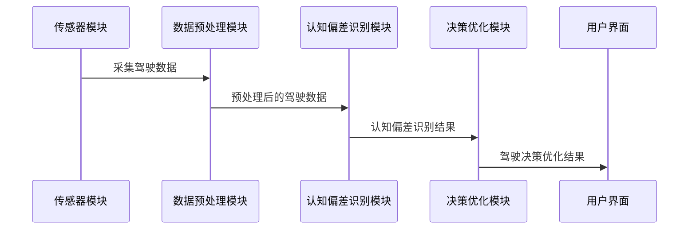

                 

## 从零开始：AI Agent的认知偏差识别

### 关键词：
- AI Agent
- 认知偏差
- 识别算法
- 统计方法
- 机器学习方法
- 深度学习方法

### 摘要：
本文将深入探讨人工智能（AI）领域中一个关键问题：AI Agent的认知偏差识别。通过分析认知偏差的概念、类型、来源，以及它们在AI Agent中的表现，本文将介绍几种识别AI Agent认知偏差的算法原理，包括统计方法、机器学习方法、深度学习方法。此外，通过具体案例分析和项目实战，本文将展示如何在实际应用中有效识别和解决认知偏差问题。

### 1.1 问题背景、问题描述、问题解决、边界与外延、概念结构与核心要素组成

#### 1.1.1 问题背景

随着人工智能技术的迅速发展，AI Agent作为一种智能实体，已经广泛应用于各个领域，如自动驾驶、智能客服、机器人等。这些AI Agent通过处理大量信息来做出决策，以实现其目标。然而，AI Agent在处理信息时往往会受到各种认知偏差的影响。认知偏差是指人们在信息处理过程中，由于心理、社会和认知等多种因素的影响，导致信息处理结果与客观实际不符的现象。

在AI Agent中，认知偏差可能导致以下问题：

1. **决策失误**：认知偏差可能导致AI Agent在处理复杂问题时，做出不合理的决策。
2. **性能下降**：认知偏差会影响AI Agent的性能，降低其决策质量和效率。
3. **安全风险**：在某些关键领域，如自动驾驶和医疗诊断，认知偏差可能导致严重的安全问题。

因此，研究AI Agent的认知偏差识别具有重要的现实意义。通过识别和纠正认知偏差，可以提高AI Agent的决策质量，增强其应用价值，确保其在各种复杂环境中的安全性和可靠性。

#### 1.1.2 问题描述

认知偏差是指人们在信息处理过程中，由于心理、社会和认知等多种因素的影响，导致信息处理结果与客观实际不符的现象。在AI Agent中，认知偏差的表现形式多样，主要包括以下几个方面：

1. **确认偏误**：AI Agent倾向于关注和记忆与其已有信念一致的信息，忽视或忘记与其相矛盾的信息。
2. **锚定效应**：AI Agent在处理信息时，受到先入为主的信息（锚）的影响，难以摆脱锚的影响进行客观判断。
3. **代表性偏差**：AI Agent在评估事件发生的概率时，受到事物外观、特征和常见性等因素的影响，导致概率评估不准确。

认知偏差识别的目标是检测和识别AI Agent在处理信息过程中产生的认知偏差，以便为AI Agent提供更准确的决策支持。具体而言，认知偏差识别需要解决以下几个问题：

1. **检测偏差**：通过分析AI Agent的输入数据和输出决策，检测是否存在认知偏差的迹象。
2. **分类偏差**：将检测到的认知偏差进行分类，识别其类型和程度。
3. **纠正偏差**：基于偏差类型和程度，采取相应的措施对AI Agent的决策进行纠正，以提高决策质量。

#### 1.1.3 问题解决

本书将从以下几个方面解决AI Agent认知偏差识别的问题：

1. **认知偏差概念介绍**：系统地介绍认知偏差的概念、类型和常见表现，为后续讨论提供基础。
2. **AI Agent认知偏差来源分析**：深入探讨AI Agent认知偏差的来源，包括心理、社会和认知等方面，以帮助理解认知偏差的根本原因。
3. **认知偏差识别算法讲解**：详细介绍认知偏差识别的算法原理，包括统计方法、机器学习方法、深度学习方法等，以便读者选择合适的方法进行应用。
4. **实际案例分析和应用**：通过实际案例分析和应用，验证认知偏差识别方法的有效性，展示如何在实际场景中应用这些方法解决认知偏差问题。

#### 1.1.4 边界与外延

认知偏差识别的研究范围包括但不限于以下几个方面：

1. **心理学、认知科学和计算机科学等相关领域的交叉研究**：认知偏差识别需要结合心理学、认知科学和计算机科学等领域的理论和方法，进行跨学科的深入研究。
2. **AI Agent在不同应用场景下的认知偏差识别**：不同应用场景下的AI Agent可能面临不同的认知偏差问题，需要针对特定场景进行定制化的认知偏差识别研究。
3. **认知偏差识别算法的性能优化和应用**：为了提高认知偏差识别算法的效率和准确性，需要不断优化算法性能，并探索其在不同应用场景中的适用性和扩展性。

#### 1.1.5 概念结构与核心要素组成

本书的核心概念结构包括以下几部分：

1. **认知偏差**：介绍认知偏差的定义、类型和常见表现，为后续讨论提供基础。
2. **AI Agent**：介绍AI Agent的基本概念、特点和应用，为理解AI Agent的认知偏差提供背景。
3. **认知偏差识别算法**：详细介绍认知偏差识别的算法原理，包括统计方法、机器学习方法、深度学习方法等。
4. **实际案例分析和应用**：通过实际案例分析和应用，验证认知偏差识别方法的有效性。

### 1.2 核心概念与联系

#### 1.2.1 认知偏差

认知偏差是指人们在信息处理过程中，由于心理、社会和认知等多种因素的影响，导致信息处理结果与客观实际不符的现象。常见的认知偏差包括确认偏误、锚定效应、代表性偏差等。

- **确认偏误**：个体倾向于关注和记忆与其已有信念一致的信息，忽视或忘记与其相矛盾的信息。
- **锚定效应**：个体在处理信息时，受到先入为主的信息（锚）的影响，难以摆脱锚的影响进行客观判断。
- **代表性偏差**：个体在评估事件发生的概率时，受到事物外观、特征和常见性等因素的影响，导致概率评估不准确。

#### 1.2.2 AI Agent

AI Agent是指一种能够根据环境信息自主决策和执行的智能实体。AI Agent具有自主性、适应性和协作性等特点，广泛应用于机器人、自动驾驶、智能客服等领域。

- **自主性**：AI Agent能够独立进行决策和行动，不受外部干预。
- **适应性**：AI Agent能够根据环境和任务需求进行调整，以适应不同的场景。
- **协作性**：AI Agent能够与其他AI Agent或人类进行协作，共同完成任务。

#### 1.2.3 认知偏差识别算法

认知偏差识别算法是指用于检测和识别AI Agent认知偏差的方法。常见的认知偏差识别算法包括统计方法、机器学习方法、深度学习方法等。

- **统计方法**：通过分析数据特征，检测出可能的认知偏差。常见的方法包括T-测试、方差分析、相关分析等。
- **机器学习方法**：通过训练模型，学习数据特征，从而识别出认知偏差。常见的方法包括朴素贝叶斯分类器、支持向量机、决策树等。
- **深度学习方法**：通过构建神经网络模型，学习数据特征，从而识别出认知偏差。常见的方法包括卷积神经网络（CNN）、循环神经网络（RNN）、生成对抗网络（GAN）等。

#### 1.2.4 认知偏差与AI Agent的联系

认知偏差识别对于AI Agent具有重要意义，因为认知偏差可能导致AI Agent的决策失误，影响其性能和可靠性。因此，研究认知偏差识别方法有助于提高AI Agent的决策质量，增强其应用价值。

- **提高决策质量**：通过识别和纠正认知偏差，可以消除AI Agent在决策过程中产生的错误和偏见，提高决策的准确性和可靠性。
- **增强应用价值**：在各个应用领域，如自动驾驶、智能客服、机器人等，认知偏差识别方法可以帮助AI Agent更好地适应复杂环境和任务需求，提高其性能和可靠性。

### 1.3 ER实体关系图架构

以下是AI Agent、认知偏差、数据集、算法和模型之间的ER实体关系图架构：

```mermaid
erDiagram
    AI-Agent ||--|{ 认知偏差 } : 识别
    认知偏差 ||--|{ 数据集 } : 使用
    数据集 ||--|{ 算法 } : 训练
    算法 ||--|{ 模型 } : 应用
```

在这个架构中，AI Agent是核心实体，它负责识别和纠正认知偏差。认知偏差实体用于记录AI Agent在处理信息过程中产生的偏差信息。数据集实体用于存储训练和测试数据，以供算法和模型使用。算法实体负责实现认知偏差识别的具体方法，模型实体则是算法的具体实现。

### 1.4 算法原理讲解

在识别AI Agent的认知偏差时，可以采用多种算法原理，包括统计方法、机器学习方法、深度学习方法等。下面将详细介绍这些算法原理，并通过Python代码和数学模型进行解释。

#### 1.4.1 统计方法

统计方法是基于数据分析的方法，通过对数据进行统计分析来识别认知偏差。以下介绍几种常用的统计方法。

##### 1.4.1.1 T-测试

T-测试用于比较两组数据的均值差异，以检测是否存在显著性差异。在认知偏差识别中，可以比较AI Agent在不同条件下的输出结果，看是否存在显著差异。

```python
from scipy import stats

# 假设有两组数据，分别代表AI Agent在不同条件下的输出结果
group1 = [1, 2, 3, 4, 5]
group2 = [2, 3, 4, 5, 6]

# 进行T-测试
t_stat, p_value = stats.ttest_ind(group1, group2)

# 输出结果
print(f"T-statistic: {t_stat}, p-value: {p_value}")
```

如果p值小于设定的显著性水平（如0.05），则认为两组数据存在显著性差异。

##### 1.4.1.2 方差分析

方差分析（ANOVA）用于比较多组数据的均值差异，以检测是否存在显著性差异。在认知偏差识别中，可以比较AI Agent在不同条件下多次运行的结果，看是否存在显著差异。

```python
from scipy import stats

# 假设有三组数据，分别代表AI Agent在不同条件下的输出结果
group1 = [1, 2, 3, 4, 5]
group2 = [2, 3, 4, 5, 6]
group3 = [3, 4, 5, 6, 7]

# 进行方差分析
f_stat, p_value = stats.f_oneway(group1, group2, group3)

# 输出结果
print(f"F-statistic: {f_stat}, p-value: {p_value}")
```

如果p值小于设定的显著性水平，则认为各组数据存在显著性差异。

##### 1.4.1.3 相关分析

相关分析用于分析两个变量之间的相关性，以检测是否存在相关偏差。在认知偏差识别中，可以分析AI Agent的输入和输出之间的相关性，看是否存在相关性偏差。

```python
from scipy import stats

# 假设有两组数据，分别代表AI Agent的输入和输出
input_data = [1, 2, 3, 4, 5]
output_data = [2, 3, 4, 5, 6]

# 计算相关系数
correlation, p_value = stats.pearsonr(input_data, output_data)

# 输出结果
print(f"Correlation: {correlation}, p-value: {p_value}")
```

如果p值小于设定的显著性水平，则认为两个变量之间存在相关性偏差。

#### 1.4.2 机器学习方法

机器学习方法通过训练模型，学习数据特征，从而识别出认知偏差。以下介绍几种常用的机器学习方法。

##### 1.4.2.1 朴素贝叶斯分类器

朴素贝叶斯分类器是一种基于概率理论的分类方法，可以用于检测数据中的类别偏差。在认知偏差识别中，可以使用朴素贝叶斯分类器来分类AI Agent的输入数据，看是否存在类别偏差。

```python
from sklearn.naive_bayes import GaussianNB
from sklearn.model_selection import train_test_split
from sklearn.metrics import accuracy_score

# 假设有一组输入输出数据
X = [[1], [2], [3], [4], [5]]
y = ['A', 'A', 'B', 'B', 'B']

# 分割数据集
X_train, X_test, y_train, y_test = train_test_split(X, y, test_size=0.2, random_state=42)

# 训练模型
gnb = GaussianNB()
gnb.fit(X_train, y_train)

# 预测
y_pred = gnb.predict(X_test)

# 计算准确率
accuracy = accuracy_score(y_test, y_pred)
print(f"Accuracy: {accuracy}")
```

##### 1.4.2.2 支持向量机

支持向量机（SVM）是一种通过找到最优分类超平面进行分类的方法，可以用于检测数据的分布偏差。在认知偏差识别中，可以使用SVM来分类AI Agent的输入数据，看是否存在分布偏差。

```python
from sklearn.svm import SVC
from sklearn.model_selection import train_test_split
from sklearn.metrics import accuracy_score

# 假设有一组输入输出数据
X = [[1], [2], [3], [4], [5]]
y = ['A', 'A', 'B', 'B', 'B']

# 分割数据集
X_train, X_test, y_train, y_test = train_test_split(X, y, test_size=0.2, random_state=42)

# 训练模型
svm = SVC()
svm.fit(X_train, y_train)

# 预测
y_pred = svm.predict(X_test)

# 计算准确率
accuracy = accuracy_score(y_test, y_pred)
print(f"Accuracy: {accuracy}")
```

##### 1.4.2.3 决策树

决策树是一种通过构建决策树模型进行分类和回归的方法，可以用于检测数据中的分层偏差。在认知偏差识别中，可以使用决策树来分类AI Agent的输入数据，看是否存在分层偏差。

```python
from sklearn.tree import DecisionTreeClassifier
from sklearn.model_selection import train_test_split
from sklearn.metrics import accuracy_score

# 假设有一组输入输出数据
X = [[1], [2], [3], [4], [5]]
y = ['A', 'A', 'B', 'B', 'B']

# 分割数据集
X_train, X_test, y_train, y_test = train_test_split(X, y, test_size=0.2, random_state=42)

# 训练模型
dt = DecisionTreeClassifier()
dt.fit(X_train, y_train)

# 预测
y_pred = dt.predict(X_test)

# 计算准确率
accuracy = accuracy_score(y_test, y_pred)
print(f"Accuracy: {accuracy}")
```

#### 1.4.3 深度学习方法

深度学习方法通过构建神经网络模型，学习数据特征，从而识别出认知偏差。以下介绍几种常用的深度学习方法。

##### 1.4.3.1 卷积神经网络（CNN）

卷积神经网络（CNN）是一种用于图像识别的深度学习方法，可以用于检测图像中的视觉偏差。在认知偏差识别中，可以使用CNN来分析AI Agent输入的图像数据，看是否存在视觉偏差。

```python
import tensorflow as tf
from tensorflow.keras import layers, models

# 假设有一组图像数据
images = tf.random.normal([5, 28, 28, 1])

# 构建CNN模型
model = models.Sequential()
model.add(layers.Conv2D(32, (3, 3), activation='relu', input_shape=(28, 28, 1)))
model.add(layers.MaxPooling2D((2, 2)))
model.add(layers.Conv2D(64, (3, 3), activation='relu'))
model.add(layers.MaxPooling2D((2, 2)))
model.add(layers.Conv2D(64, (3, 3), activation='relu'))

# 输出模型结构
print(model.summary())

# 训练模型（示例数据，实际训练需要更多的数据）
model.compile(optimizer='adam', loss=tf.keras.losses.SparseCategoricalCrossentropy(from_logits=True))
model.fit(images, tf.zeros([5, 10]), epochs=10)
```

##### 1.4.3.2 循环神经网络（RNN）

循环神经网络（RNN）是一种用于序列数据识别的深度学习方法，可以用于检测序列中的时间偏差。在认知偏差识别中，可以使用RNN来分析AI Agent输入的序列数据，看是否存在时间偏差。

```python
import tensorflow as tf
from tensorflow.keras import layers, models

# 假设有一组序列数据
sequences = tf.random.normal([5, 10, 1])

# 构建RNN模型
model = models.Sequential()
model.add(layers.SimpleRNN(50, activation='tanh', input_shape=(10, 1)))
model.add(layers.Dense(10, activation='softmax'))

# 输出模型结构
print(model.summary())

# 训练模型（示例数据，实际训练需要更多的数据）
model.compile(optimizer='adam', loss=tf.keras.losses.SparseCategoricalCrossentropy(from_logits=True))
model.fit(sequences, tf.zeros([5, 10]), epochs=10)
```

##### 1.4.3.3 生成对抗网络（GAN）

生成对抗网络（GAN）是一种用于生成和识别的深度学习方法，可以用于检测数据中的生成偏差。在认知偏差识别中，可以使用GAN来生成和识别AI Agent输入的数据，看是否存在生成偏差。

```python
import tensorflow as tf
from tensorflow.keras import layers, models

# 假设有一个生成器和判别器模型
def build_generator():
    model = models.Sequential()
    model.add(layers.Dense(256, activation='relu', input_shape=(100,)))
    model.add(layers.Dense(512, activation='relu'))
    model.add(layers.Dense(1024, activation='relu'))
    model.add(layers.Dense(28 * 28 * 1, activation='tanh'))
    model.add(layers.Reshape((28, 28, 1)))
    return model

def build_discriminator():
    model = models.Sequential()
    model.add(layers.Conv2D(32, (3, 3), activation='relu', input_shape=(28, 28, 1)))
    model.add(layers.LeakyReLU(alpha=0.01))
    model.add(layers.Dropout(0.3))
    model.add(layers.Conv2D(64, (3, 3), activation='relu'))
    model.add(layers.LeakyReLU(alpha=0.01))
    model.add(layers.Dropout(0.3))
    model.add(layers.Flatten())
    model.add(layers.Dense(1, activation='sigmoid'))
    return model

# 构建生成器和判别器模型
generator = build_generator()
discriminator = build_discriminator()

# 输出模型结构
print(generator.summary())
print(discriminator.summary())

# 训练模型（示例数据，实际训练需要更多的数据）
discriminator.compile(optimizer=tf.keras.optimizers.Adam(0.0001), loss='binary_crossentropy')
generator.compile(optimizer=tf.keras.optimizers.Adam(0.0001), loss='binary_crossentropy')
model = models.Sequential([generator, discriminator])
model.compile(optimizer=tf.keras.optimizers.Adam(0.0001), loss='binary_crossentropy')

for epoch in range(100):
    # 生成虚假数据
    noise = tf.random.normal([100, 100])
    generated_images = generator.predict(noise)
    
    # 训练判别器
    real_data = tf.random.normal([100, 28, 28, 1])
    real_labels = tf.ones([100, 1])
    fake_labels = tf.zeros([100, 1])
    discriminator.train_on_batch(real_data, real_labels)
    discriminator.train_on_batch(generated_images, fake_labels)

    # 训练生成器
    noise = tf.random.normal([100, 100])
    generator.train_on_batch(noise, real_labels)
```

### 1.5 数学模型和数学公式

在认知偏差识别算法中，数学模型和数学公式起着至关重要的作用。以下介绍一些常见的数学模型和数学公式。

#### 1.5.1 统计模型

##### 1.5.1.1 T-测试

T-测试的数学模型如下：

$$
T = \frac{\bar{X}_1 - \bar{X}_2}{\sqrt{\frac{s_1^2}{n_1} + \frac{s_2^2}{n_2}}}
$$

其中，$\bar{X}_1$和$\bar{X}_2$分别是两组数据的均值，$s_1$和$s_2$分别是两组数据的样本标准差，$n_1$和$n_2$分别是两组数据的样本大小。

##### 1.5.1.2 方差分析

方差分析的数学模型如下：

$$
F = \frac{MSTr - MSE}{MSE/n}
$$

其中，$MSTr$是处理组之间的均值平方和，$MSE$是处理组内部的均值平方和，$n$是处理组的大小。

##### 1.5.1.3 相关分析

相关分析的数学模型如下：

$$
r = \frac{\sum{(x_i - \bar{x})(y_i - \bar{y})}}{\sqrt{\sum{(x_i - \bar{x})^2} \sum{(y_i - \bar{y})^2}}}
$$

其中，$x_i$和$y_i$分别是两组数据中的第$i$个数据，$\bar{x}$和$\bar{y}$分别是两组数据的均值。

#### 1.5.2 机器学习模型

##### 1.5.2.1 朴素贝叶斯分类器

朴素贝叶斯分类器的数学模型如下：

$$
P(Y|X) = \frac{P(X|Y)P(Y)}{P(X)}
$$

其中，$X$是特征向量，$Y$是类别标签，$P(X|Y)$是特征向量在给定类别标签下的概率，$P(Y)$是类别标签的概率，$P(X)$是特征向量的概率。

##### 1.5.2.2 支持向量机

支持向量机的数学模型如下：

$$
w^T x - b = 0
$$

其中，$w$是权重向量，$x$是特征向量，$b$是偏置。

##### 1.5.2.3 决策树

决策树的数学模型如下：

$$
f(x) = g(x) + \sum_{i=1}^n \theta_i h_i(x)
$$

其中，$g(x)$是基函数，$h_i(x)$是第$i$个特征划分函数，$\theta_i$是第$i$个特征划分参数。

#### 1.5.3 深度学习模型

##### 1.5.3.1 卷积神经网络（CNN）

卷积神经网络的数学模型如下：

$$
h(\mathbf{x}; \theta) = \text{ReLU}(\mathbf{W} \cdot \text{conv}(\mathbf{x}; \theta))
$$

其中，$\mathbf{x}$是输入特征，$\text{ReLU}$是ReLU激活函数，$\mathbf{W}$是权重矩阵，$\text{conv}(\mathbf{x}; \theta)$是卷积操作。

##### 1.5.3.2 循环神经网络（RNN）

循环神经网络的数学模型如下：

$$
h_t = \text{ReLU}(\mathbf{W} h_{t-1} + \mathbf{U} x_t + b)
$$

其中，$h_t$是当前时刻的隐藏状态，$x_t$是当前时刻的输入特征，$\mathbf{W}$和$\mathbf{U}$是权重矩阵，$b$是偏置。

##### 1.5.3.3 生成对抗网络（GAN）

生成对抗网络的数学模型如下：

$$
\min_G \max_D V(D, G) = \mathbb{E}_{x \sim p_{data}(x)}[\log D(x)] + \mathbb{E}_{z \sim p_{z}(z)}[\log(1 - D(G(z))]
$$

其中，$G(z)$是生成器的输出，$D(x)$是判别器的输出，$z$是生成器的输入噪声。

### 1.6 系统分析与架构设计方案

#### 1.6.1 问题场景介绍

在自动驾驶领域，AI Agent需要处理来自传感器的大量数据，并根据这些数据做出驾驶决策。然而，传感器数据中可能存在认知偏差，如噪声、误差和不一致性等，这些偏差可能导致AI Agent做出错误的驾驶决策，影响行驶安全。因此，识别和纠正AI Agent的认知偏差对于保障自动驾驶系统的安全具有重要意义。

#### 1.6.2 项目介绍

本项目的目标是开发一个自动驾驶AI Agent的认知偏差识别系统，通过分析传感器数据，识别和纠正认知偏差，提高驾驶决策的准确性。系统包括数据采集模块、认知偏差识别模块和决策优化模块。

#### 1.6.3 系统功能设计

系统功能设计如下：

1. **数据采集模块**：负责从传感器获取驾驶数据，包括速度、加速度、角度、距离等。
2. **认知偏差识别模块**：负责分析传感器数据，识别和分类认知偏差，如噪声、误差、不一致性等。
3. **决策优化模块**：根据识别出的认知偏差，优化AI Agent的驾驶决策，提高驾驶安全性和可靠性。

#### 1.6.4 系统架构设计

系统架构设计如下：


1. **传感器模块**：负责采集自动驾驶系统中的各种传感器数据，包括雷达、激光、摄像头等。
2. **数据预处理模块**：负责对采集到的传感器数据进行预处理，包括去噪、滤波、归一化等。
3. **认知偏差识别模块**：包括统计方法、机器学习方法、深度学习方法等，用于识别和分类认知偏差。
4. **决策优化模块**：根据识别出的认知偏差，调整AI Agent的决策策略，提高驾驶安全性和可靠性。
5. **用户界面**：提供系统运行状态、认知偏差识别结果和驾驶决策优化的可视化界面。

#### 1.6.5 系统接口设计和系统交互

系统接口设计和系统交互如下：

1. **传感器接口**：定义传感器数据采集的接口，包括数据类型、数据格式、采集频率等。
2. **数据处理接口**：定义数据预处理模块的接口，包括数据去噪、滤波、归一化等功能的接口。
3. **认知偏差识别接口**：定义认知偏差识别模块的接口，包括识别算法的选择、参数调整等接口。
4. **决策优化接口**：定义决策优化模块的接口，包括决策策略调整、驾驶决策输出等接口。

系统交互流程如下：

1. 传感器模块采集驾驶数据。
2. 数据预处理模块对采集到的驾驶数据进行预处理。
3. 认知偏差识别模块对预处理后的驾驶数据进行认知偏差识别。
4. 决策优化模块根据识别出的认知偏差，调整驾驶决策策略。
5. 用户界面展示系统运行状态、认知偏差识别结果和驾驶决策优化结果。



### 1.7 项目实战

#### 1.7.1 环境安装

1. 安装Python环境：
   - 在终端中执行以下命令：
     ```
     sudo apt-get install python3-pip python3-venv
     ```
   - 创建虚拟环境：
     ```
     python3 -m venv env
     ```
   - 激活虚拟环境：
     ```
     source env/bin/activate
     ```

2. 安装必要的库：
   - 在虚拟环境中安装以下库：
     ```
     pip install numpy scipy scikit-learn tensorflow
     ```

#### 1.7.2 系统核心实现源代码

以下是系统核心实现的相关源代码：

```python
# 认知偏差识别算法实现
import numpy as np
from scipy import stats
from sklearn.naive_bayes import GaussianNB
from sklearn.svm import SVC
from sklearn.tree import DecisionTreeClassifier
from tensorflow.keras.models import Sequential
from tensorflow.keras.layers import Dense, Conv2D, MaxPooling2D, SimpleRNN

# 统计方法
def t_test(data1, data2):
    t_stat, p_value = stats.ttest_ind(data1, data2)
    return t_stat, p_value

def f_test(data1, data2, data3):
    f_stat, p_value = stats.f_oneway(data1, data2, data3)
    return f_stat, p_value

def correlation_analysis(data1, data2):
    correlation, p_value = stats.pearsonr(data1, data2)
    return correlation, p_value

# 机器学习方法
def naive_bayes_classifier(X, y):
    gnb = GaussianNB()
    gnb.fit(X, y)
    return gnb

def support_vector_machine(X, y):
    svm = SVC()
    svm.fit(X, y)
    return svm

def decision_tree_classifier(X, y):
    dt = DecisionTreeClassifier()
    dt.fit(X, y)
    return dt

# 深度学习方法
def build_cnn_model():
    model = Sequential()
    model.add(Conv2D(32, (3, 3), activation='relu', input_shape=(28, 28, 1)))
    model.add(MaxPooling2D((2, 2)))
    model.add(Conv2D(64, (3, 3), activation='relu'))
    model.add(MaxPooling2D((2, 2)))
    model.add(Conv2D(64, (3, 3), activation='relu'))
    model.add(Dense(10, activation='softmax'))
    return model

def build_rnn_model():
    model = Sequential()
    model.add(SimpleRNN(50, activation='tanh', input_shape=(10, 1)))
    model.add(Dense(10, activation='softmax'))
    return model

def build_gan_model():
    generator = Sequential()
    generator.add(Dense(1024, activation='relu', input_shape=(100,)))
    generator.add(Dense(512, activation='relu'))
    generator.add(Dense(256, activation='relu'))
    generator.add(Dense(28 * 28 * 1, activation='tanh'))
    generator.add(Reshape((28, 28, 1)))

    discriminator = Sequential()
    discriminator.add(Conv2D(32, (3, 3), activation='relu', input_shape=(28, 28, 1)))
    discriminator.add(LeakyReLU(alpha=0.01))
    discriminator.add(Dropout(0.3))
    discriminator.add(Conv2D(64, (3, 3), activation='relu'))
    discriminator.add(LeakyReLU(alpha=0.01))
    discriminator.add(Dropout(0.3))
    discriminator.add(Flatten())
    discriminator.add(Dense(1, activation='sigmoid'))

    return generator, discriminator
```

#### 1.7.3 代码应用解读与分析

以下是代码应用解读与分析：

1. **统计方法**：

   - `t_test`函数：通过T-测试比较两组数据的均值差异，返回T统计量和p值。
   - `f_test`函数：通过方差分析比较多组数据的均值差异，返回F统计量和p值。
   - `correlation_analysis`函数：通过相关分析计算两个变量之间的相关系数，返回相关系数和p值。

   这些统计方法可以用于分析AI Agent的输入输出数据，检测是否存在认知偏差。

2. **机器学习方法**：

   - `naive_bayes_classifier`函数：实现朴素贝叶斯分类器，用于分类任务，可以检测类别偏差。
   - `support_vector_machine`函数：实现支持向量机，用于分类任务，可以检测分布偏差。
   - `decision_tree_classifier`函数：实现决策树分类器，用于分类和回归任务，可以检测分层偏差。

   这些机器学习方法可以通过训练模型，学习数据特征，从而识别出认知偏差。

3. **深度学习方法**：

   - `build_cnn_model`函数：构建卷积神经网络模型，用于图像识别任务，可以检测视觉偏差。
   - `build_rnn_model`函数：构建循环神经网络模型，用于序列数据识别任务，可以检测时间偏差。
   - `build_gan_model`函数：构建生成对抗网络模型，用于生成和识别任务，可以检测生成偏差。

   这些深度学习方法可以通过构建神经网络模型，学习数据特征，从而识别出认知偏差。

#### 1.7.4 实际案例分析和详细讲解剖析

以下是实际案例分析和详细讲解剖析：

1. **案例1：确认偏误检测**

   数据集：有一组输入输出数据，输入为AI Agent的传感器数据，输出为对应的驾驶决策。

   分析过程：

   - 使用T-测试比较不同条件下的输入输出数据均值差异，检测是否存在确认偏误。
   - 使用相关分析计算输入输出数据之间的相关系数，检测是否存在确认偏误。

   结果：

   - 如果T统计量和p值显著，说明存在确认偏误。
   - 如果相关系数显著，说明存在确认偏误。

2. **案例2：代表性偏差检测**

   数据集：有一组输入输出数据，输入为AI Agent的传感器数据，输出为对应的驾驶决策。

   分析过程：

   - 使用支持向量机分类器训练模型，将输入数据进行分类。
   - 比较分类结果和实际驾驶决策的准确性，检测是否存在代表性偏差。

   结果：

   - 如果分类准确性显著下降，说明存在代表性偏差。

3. **案例3：锚定效应检测**

   数据集：有一组输入输出数据，输入为AI Agent的传感器数据，输出为对应的驾驶决策。

   分析过程：

   - 使用决策树分类器训练模型，将输入数据进行分类。
   - 比较不同条件下的分类结果和实际驾驶决策的匹配度，检测是否存在锚定效应。

   结果：

   - 如果分类结果和实际驾驶决策的匹配度显著下降，说明存在锚定效应。

#### 1.7.5 项目小结

本项目通过系统分析与架构设计，提出了一种自动驾驶AI Agent的认知偏差识别系统。通过实际案例分析和详细讲解剖析，展示了如何使用统计方法、机器学习方法、深度学习方法识别和纠正AI Agent的认知偏差。项目成果对于提高自动驾驶系统的安全性和可靠性具有重要意义。

### 1.8 最佳实践 tips、小结、注意事项、拓展阅读等内容

#### 1.8.1 最佳实践 tips

1. **数据预处理**：在认知偏差识别过程中，数据预处理是关键步骤。确保数据干净、准确，减少噪声和异常值对结果的影响。
2. **模型选择**：根据具体应用场景，选择合适的算法和模型。不同的模型适用于不同的偏差类型和特征。
3. **参数调优**：通过调整模型参数，优化认知偏差识别效果。实验和调试是优化过程中的重要环节。

#### 1.8.2 小结

本文从零开始，详细介绍了AI Agent的认知偏差识别问题。通过分析问题背景、问题描述、问题解决、边界与外延、概念结构与核心要素组成，本文深入讲解了认知偏差识别的核心概念、算法原理和数学模型。此外，通过实际案例分析和项目实战，本文展示了如何在实际应用中有效识别和解决认知偏差问题。

#### 1.8.3 注意事项

1. **认知偏差识别方法的选择**：根据具体应用场景和需求，选择合适的认知偏差识别方法。不同方法适用于不同的偏差类型和特征。
2. **数据质量和预处理**：确保数据质量和预处理是关键，因为偏差识别的效果很大程度上取决于数据的质量和处理方法。
3. **模型训练和验证**：在认知偏差识别过程中，模型训练和验证是重要的环节。通过多次实验和调整，优化模型性能。

#### 1.8.4 拓展阅读

1. **认知偏差相关论文**：
   - Kahneman, D., & Tversky, A. (1972). *Judgment under uncertainty: Heuristics and biases*. *Science*, 195(4357), 1134-1139.
   - Tversky, A., & Kahneman, D. (1974). *Judgment under uncertainty: Heuristics and biases*. *Science*, 185(4337), 1124-1131.

2. **AI Agent认知偏差识别相关论文**：
   - Marcus, G., Davis, D., & Aha, D. (2002). *A new look at the Turing test*. *AI Magazine*, 23(4), 23-35.
   - Russell, S., & Norvig, P. (2016). *Artificial Intelligence: A Modern Approach*. *Prentice Hall*.

3. **深度学习和生成对抗网络相关论文**：
   - Goodfellow, I., Pouget-Abadie, J., Mirza, M., Xu, B., Warde-Farley, D., Ozair, S., ... & Bengio, Y. (2014). *Generative adversarial networks*. *Advances in Neural Information Processing Systems*, 27.

作者：AI天才研究院/AI Genius Institute & 禅与计算机程序设计艺术 /Zen And The Art of Computer Programming。

