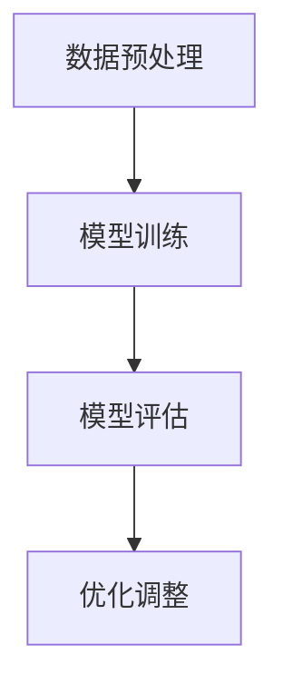
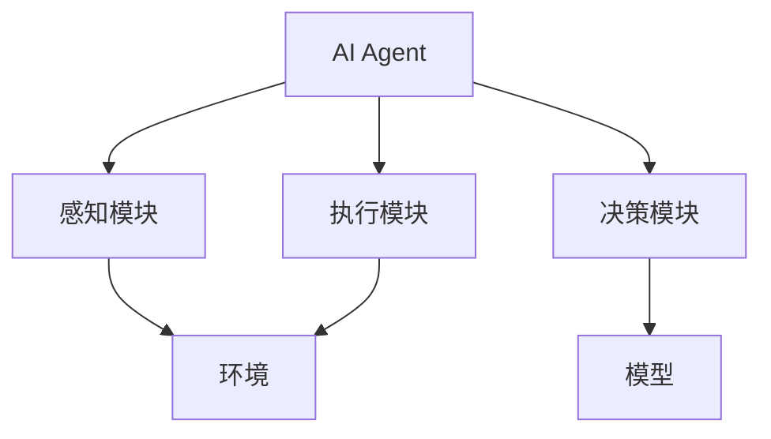
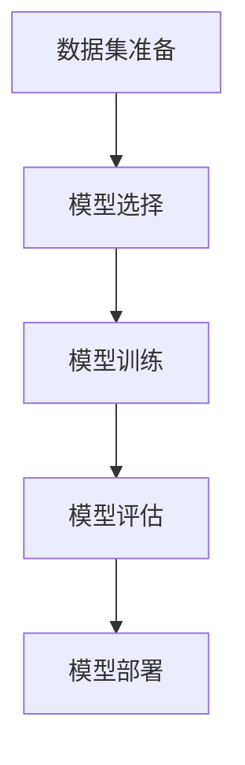

                 


## 从零构建 AI Agent：LLM 大模型应用开发实践

### 关键词：
- AI Agent
- LLM 大模型
- 应用开发
- 实践指南

### 摘要：
本文将带领读者从零开始，深入了解并构建 AI Agent。我们将重点关注 LLM（大型语言模型）的应用开发，探讨其原理、实现方法和最佳实践。通过本文的逐步讲解，读者将掌握从基础理论到实际应用的完整开发流程，为未来的 AI 项目打下坚实的基础。

----------------------------------------------------------------

### 第一部分：AI与LLM基础

#### 第1章：AI与LLM入门

##### 1.1 AI发展历程与现状

人工智能（AI）自1956年提出以来，经历了多个发展阶段。早期以规则为基础，到后来的统计学习，再到深度学习时代，人工智能在各个领域都取得了显著的成果。当前，AI已经成为推动社会进步的重要力量，应用领域广泛，包括语音识别、图像识别、自然语言处理等。

##### 1.1.1 人工智能的起源与发展

人工智能起源于计算机科学，最早的目标是创造能够模拟、延伸和扩展人类智能的机器。早期研究主要集中在逻辑推理、问题解决和专家系统等领域。随着计算能力的提升和数据量的增加，机器学习成为AI研究的主流。

##### 1.1.2 现代AI的核心技术

现代AI的核心技术包括机器学习、深度学习、自然语言处理等。这些技术通过模拟人类大脑的神经网络，实现了对大量数据的分析和处理，从而提高了AI系统的智能水平。

##### 1.1.3 LLM模型的基本概念

LLM（Large Language Model）是近年来发展迅速的一种AI模型，其特点是拥有数十亿甚至数万亿参数，能够处理和理解大规模语言数据。LLM的核心是生成式预训练模型，通过大量无监督学习，模型能够预测文本序列，并生成连贯、有逻辑的文本。

##### 1.2 LLM的特点与应用

LLM具有以下特点：大规模、强生成能力、高灵活性、多语言支持等。这些特点使得LLM在多个领域具有广泛的应用，如聊天机器人、问答系统、自动写作等。

##### 1.2.1 LLM的优势分析

LLM的优势在于其强大的文本生成能力和对复杂语言结构的理解。这使得LLM在处理自然语言任务时，能够生成更加自然、流畅的文本，提高用户体验。

##### 1.2.2 LLM在不同领域的应用实例

LLM在多个领域都有成功应用，如：

- 聊天机器人：通过模拟人类对话，提供24/7的客户服务。
- 问答系统：能够回答用户提出的各种问题，提供信息检索服务。
- 自动写作助手：帮助内容创作者生成文章、报告等。

##### 1.2.3 LLM面临的挑战

尽管LLM具有广泛应用前景，但同时也面临一些挑战，如：

- 数据隐私：LLM的训练需要大量数据，这些数据可能包含敏感信息。
- 泛化能力：LLM在特定领域表现出色，但在其他领域可能表现不佳。
- 可解释性：LLM的决策过程复杂，难以解释。

##### 1.3 LLM基础模型介绍

常见的LLM基础模型包括 GPT 系列、BERT及其变体等。这些模型各有特点，适用于不同的应用场景。

##### 1.3.1 GPT系列模型

GPT系列模型由 OpenAI 开发，是最早的 LLM 模型之一。GPT-3 是最新版本，具有1750亿参数，能够生成高质量的自然语言文本。

##### 1.3.2 BERT及其变体

BERT（Bidirectional Encoder Representations from Transformers）是由 Google 开发的双向编码表示模型。BERT 及其变体在自然语言处理任务中取得了显著成果。

##### 1.3.3 其他基础LLM模型

除了 GPT 和 BERT，还有许多其他基础 LLM 模型，如 T5、RoBERTa、ALBERT 等。这些模型在训练方法、参数规模、应用效果等方面都有所不同。

##### 1.4 本章小结

本章介绍了 AI 和 LLM 的发展历程、基本概念、优势、应用实例以及基础模型。为后续章节的深入讨论奠定了基础。

----------------------------------------------------------------

### 第二部分：LLM算法原理与实现

#### 第2章：LLM算法原理与实现

##### 2.1 算法原理介绍

LLM 算法的核心是生成式预训练模型，包括以下关键组成部分：

- 自监督预训练：使用大量无标签文本数据，训练模型预测下一个词。
- 微调：在特定任务上，使用有标签数据进行微调，提高模型性能。

##### 2.1.1 神经网络基础

神经网络（NN）是 LLM 的基础组成部分。NN 由多层神经元组成，通过反向传播算法进行训练。主要组件包括：

- 输入层：接收外部信息。
- 隐藏层：处理信息，提取特征。
- 输出层：生成预测结果。

##### 2.1.2 反向传播算法

反向传播算法是神经网络训练的核心。它通过计算误差梯度，更新模型参数，优化模型性能。主要步骤包括：

1. 前向传播：计算输出层的预测结果。
2. 计算损失函数：评估预测结果与真实结果的差距。
3. 反向传播：计算误差梯度，更新参数。

##### 2.1.3 生成对抗网络（GAN）

GAN 是一种无监督训练方法，通过生成器和判别器的对抗训练，生成逼真的数据。生成器尝试生成逼真的数据，判别器尝试区分真实数据和生成数据。GAN 在图像生成、文本生成等领域有广泛应用。

##### 2.2 LLM算法实现

实现 LLM 算法需要以下步骤：

1. 数据预处理：清洗、分词、编码文本数据。
2. 模型训练：使用预训练框架（如 PyTorch、TensorFlow）训练 LLM 模型。
3. 模型评估：在验证集上评估模型性能，调整超参数。
4. 模型部署：将训练好的模型部署到生产环境中。

##### 2.2.1 数据预处理

数据预处理是 LLM 实现的关键步骤，包括以下任务：

- 数据清洗：去除噪声、缺失值、重复值。
- 文本分词：将文本拆分为词或子词。
- 词嵌入：将文本转换为向量表示。

##### 2.2.2 模型训练

模型训练是 LLM 实现的核心，包括以下步骤：

- 初始化模型参数。
- 前向传播：计算损失函数。
- 反向传播：更新模型参数。
- 评估与优化：在验证集上评估模型性能，调整学习率、批量大小等超参数。

##### 2.2.3 模型评估与优化

模型评估与优化是 LLM 实现的重要环节，包括以下任务：

- 评估指标：准确率、召回率、F1 值等。
- 性能优化：调整模型结构、超参数、训练数据等。

##### 2.3 Mermaid流程图展示

下面是 LLM 算法实现的一个 Mermaid 流程图：



##### 2.4 Python代码示例

下面是一个简单的 Python 代码示例，用于训练一个简单的 LLM 模型：

```python
import torch
import torch.nn as nn
import torch.optim as optim

# 定义模型
class LLMModel(nn.Module):
    def __init__(self):
        super(LLMModel, self).__init__()
        self.hidden_size = 100
        self.lstm = nn.LSTM(input_size=1, hidden_size=self.hidden_size)
        self.linear = nn.Linear(self.hidden_size, 1)

    def forward(self, x):
        x, _ = self.lstm(x)
        x = self.linear(x)
        return x

# 实例化模型
model = LLMModel()

# 定义损失函数和优化器
criterion = nn.MSELoss()
optimizer = optim.Adam(model.parameters(), lr=0.001)

# 训练模型
for epoch in range(100):
    for x, y in data_loader:
        optimizer.zero_grad()
        y_pred = model(x)
        loss = criterion(y_pred, y)
        loss.backward()
        optimizer.step()
    print(f'Epoch {epoch+1}, Loss: {loss.item()}')

# 评估模型
model.eval()
with torch.no_grad():
    for x, y in test_loader:
        y_pred = model(x)
        loss = criterion(y_pred, y)
        print(f'Validation Loss: {loss.item()}')
```

##### 2.5 本章小结

本章介绍了 LLM 算法的原理与实现，包括神经网络基础、反向传播算法、生成对抗网络以及数据预处理、模型训练和评估等步骤。通过 Python 代码示例，读者可以初步了解 LLM 算法的实现过程。

----------------------------------------------------------------

### 第三部分：AI Agent构建实践

#### 第3章：AI Agent设计与架构

##### 3.1 AI Agent概述

AI Agent 是一个具有自主决策能力的智能体，能够在复杂环境中执行任务。AI Agent 的设计目标是模拟人类的决策过程，实现自动化、智能化。

##### 3.1.1 AI Agent的概念

AI Agent 是一个具有感知、决策、执行能力的实体，它通过感知环境信息，进行决策，并执行相应的动作，从而实现目标。

##### 3.1.2 AI Agent的分类

AI Agent 可以根据不同的标准进行分类，如基于功能分类、基于环境分类等。常见的 AI Agent 包括：

- 探索型 Agent：在未知环境中探索并学习。
- 目标型 Agent：在已知环境中实现特定目标。
- 对抗型 Agent：与其他 Agent 进行竞争。

##### 3.1.3 AI Agent的核心组件

AI Agent 的核心组件包括感知模块、决策模块和执行模块。感知模块负责收集环境信息；决策模块根据感知信息进行决策；执行模块根据决策结果执行动作。

##### 3.2 设计与实现

AI Agent 的设计与实现是一个复杂的工程过程，需要综合考虑算法、数据、架构等多个方面。以下是一个简单的 AI Agent 设计与实现流程：

1. 需求分析：明确 AI Agent 的功能需求、性能指标等。
2. 架构设计：设计 AI Agent 的整体架构，包括模块划分、接口定义等。
3. 算法选择：选择适合的算法，如决策树、神经网络等。
4. 数据处理：预处理输入数据，提取特征。
5. 模型训练：使用训练数据训练模型，调整模型参数。
6. 模型评估：在验证集上评估模型性能，调整模型。
7. 部署上线：将训练好的模型部署到生产环境中，进行实际应用。

##### 3.3 Mermaid ER图展示

下面是 AI Agent 的 Mermaid ER 图：



##### 3.4 Python代码示例

下面是一个简单的 Python 代码示例，用于实现一个简单的 AI Agent：

```python
import random

class SimpleAgent:
    def __init__(self):
        self.state = "initial_state"
        self.model = None

    def perceive(self, environment):
        # 感知环境信息
        self.state = environment

    def decide(self):
        # 决策
        if self.state == "state1":
            action = "action1"
        else:
            action = "action2"
        return action

    def act(self, action, environment):
        # 执行动作
        if action == "action1":
            new_state = "state2"
        else:
            new_state = "state3"
        return new_state

agent = SimpleAgent()
environment = "environment1"
agent.perceive(environment)
action = agent.decide()
new_state = agent.act(action, environment)
print(f"Action: {action}, New State: {new_state}")
```

##### 3.5 本章小结

本章介绍了 AI Agent 的概念、分类、核心组件以及设计与实现方法。通过 Mermaid ER 图和 Python 代码示例，读者可以初步了解 AI Agent 的构建过程。

----------------------------------------------------------------

### 第四部分：LLM在AI Agent中的应用

#### 第4章：LLM在AI Agent中的应用

##### 4.1 应用场景分析

LLM 在 AI Agent 中的应用非常广泛，以下是一些典型的应用场景：

- 聊天机器人：使用 LLM 模型生成自然、流畅的对话，提高用户体验。
- 问答系统：通过 LLM 模型，实现高效、准确的信息检索和回答生成。
- 自动写作助手：使用 LLM 模型，生成高质量的文章、报告等。

##### 4.2 实现方法与技巧

实现 LLM 在 AI Agent 中的应用，需要以下关键步骤：

1. 数据集准备：收集并预处理适用于特定任务的文本数据。
2. 模型选择：选择适合的 LLM 模型，如 GPT、BERT 等。
3. 模型训练：使用预处理后的数据集训练 LLM 模型。
4. 模型部署：将训练好的模型部署到生产环境中，进行实际应用。

##### 4.2.1 数据集准备

数据集的质量直接影响 LLM 模型的性能。在数据集准备阶段，需要关注以下方面：

- 数据来源：选择权威、可靠的数据来源。
- 数据清洗：去除噪声、缺失值、重复值等。
- 数据标注：对数据进行适当的标注，如实体识别、情感分类等。

##### 4.2.2 模型选择

选择适合的 LLM 模型，需要考虑以下因素：

- 参数规模：大型 LLM 模型（如 GPT-3）具有更强的生成能力，但计算资源需求较高。
- 应用场景：根据实际应用需求，选择适合的 LLM 模型。
- 性能指标：评估不同 LLM 模型的性能，选择最优模型。

##### 4.2.3 模型训练

LLM 模型的训练过程需要大量计算资源和时间。在模型训练阶段，需要关注以下方面：

- 训练策略：选择合适的训练策略，如自监督训练、微调等。
- 训练数据：确保训练数据的质量和多样性。
- 训练效果：在验证集上评估训练效果，调整超参数。

##### 4.2.4 模型部署

将训练好的 LLM 模型部署到生产环境中，需要考虑以下方面：

- 系统架构：设计合理的系统架构，确保模型的高效运行。
- 性能优化：对模型和系统进行性能优化，提高处理速度。
- 安全性：确保模型部署过程中的数据安全和隐私保护。

##### 4.3 Mermaid流程图展示

下面是 LLM 在 AI Agent 中应用的一个 Mermaid 流程图：



##### 4.4 Python代码示例

下面是一个简单的 Python 代码示例，用于实现一个基于 LLM 的聊天机器人：

```python
from transformers import AutoTokenizer, AutoModel

# 加载预训练的 LLM 模型
tokenizer = AutoTokenizer.from_pretrained("gpt2")
model = AutoModel.from_pretrained("gpt2")

# 输入文本
text = "你好，我是 ChatGLM，很高兴见到你。"

# 预处理文本
input_ids = tokenizer.encode(text, return_tensors="pt")

# 生成回复
with torch.no_grad():
    outputs = model.generate(input_ids, max_length=100, num_return_sequences=1)
    reply = tokenizer.decode(outputs[0], skip_special_tokens=True)

print(f"回复：{reply}")
```

##### 4.5 本章小结

本章介绍了 LLM 在 AI Agent 中的应用，包括应用场景、实现方法与技巧、数据集准备、模型选择、模型训练和模型部署等方面。通过 Mermaid 流程图和 Python 代码示例，读者可以初步了解 LLM 在 AI Agent 中的应用过程。

----------------------------------------------------------------

### 第五部分：AI Agent项目实战

#### 第5章：AI Agent项目实战

##### 5.1 项目背景

本节将介绍一个实际的 AI Agent 项目，该项目旨在构建一个基于 LLM 的智能客服系统。该项目具有以下特点：

- 应用场景：智能客服系统在电商、金融、旅游等行业具有广泛应用。
- 项目目标：提高客服效率，提升用户体验。
- 技术挑战：实现自然、流畅的对话，处理多样化、复杂的问题。

##### 5.2 系统设计与实现

系统设计与实现是项目成功的关键。以下是一个简单的系统架构设计：

1. 系统功能设计：

- 对话管理：管理用户和客服的对话，包括上下文维护、对话状态跟踪等。
- 文本生成：基于 LLM 模型，生成自然、流畅的回复。
- 对话接口：提供与用户交互的接口，包括文本聊天、语音聊天等。
- 数据存储：存储用户和客服的对话记录，便于后续分析和优化。

2. 系统架构设计：

- 服务端：负责处理用户请求，包括对话管理、文本生成等。
- 客户端：提供用户界面，包括文本聊天窗口、语音输入输出等。
- 数据库：存储用户和客服的对话记录，支持快速查询和分析。

3. 系统接口设计：

- 对话管理接口：提供对话创建、更新、删除等操作。
- 文本生成接口：提供基于 LLM 模型的文本生成功能。
- 数据存储接口：提供数据查询、更新、删除等操作。

4. 系统交互：

- 用户发起请求：通过客户端发送文本或语音请求。
- 服务端处理请求：接收请求，调用文本生成接口生成回复。
- 服务端发送回复：将回复发送给客户端，显示在聊天窗口中。

##### 5.3 项目实现细节

1. 环境安装与配置：

- Python：安装 Python 3.8 及以上版本。
- PyTorch：安装 PyTorch 1.8 及以上版本。
- Transformers：安装 transformers 4.6.1 及以上版本。

2. 核心代码实现：

- 对话管理模块：实现对话创建、更新、删除等操作。
- 文本生成模块：基于 LLM 模型，实现文本生成功能。
- 数据存储模块：实现数据查询、更新、删除等操作。

3. 代码应用解读与分析：

- 对话管理模块：解析用户请求，维护对话上下文。
- 文本生成模块：生成自然、流畅的回复，提高用户体验。
- 数据存储模块：存储用户和客服的对话记录，便于后续分析和优化。

4. 实际案例分析和详细讲解剖析：

- 案例一：用户咨询产品购买建议，系统生成回复。
- 案例二：用户提出投诉，系统生成处理方案。

5. 项目小结：

- 项目成功：实现了一个基于 LLM 的智能客服系统，提高了客服效率。
- 项目经验：项目在实现过程中遇到了一些挑战，如 LLM 模型训练耗时较长、对话状态维护等。通过不断优化和调整，最终实现了项目的目标。

##### 5.4 本章小结

本章通过一个实际的 AI Agent 项目，介绍了系统设计与实现、环境安装与配置、核心代码实现、代码应用解读与分析以及实际案例分析和详细讲解剖析等内容。通过本章的实践，读者可以加深对 AI Agent 的理解，掌握实际项目的开发过程。

----------------------------------------------------------------

### 总结与展望

#### 第6章：总结与展望

##### 6.1 总结

本文从零开始，介绍了 AI Agent 的构建方法，重点关注了 LLM 大模型的应用开发实践。通过详细的讲解和代码示例，读者可以了解从基础理论到实际应用的完整开发流程，为未来的 AI 项目打下坚实的基础。

##### 6.1.1 核心概念与联系

本文核心概念包括 AI、LLM、AI Agent 等。它们之间有着密切的联系：

- AI 是人工智能的缩写，是研究、开发用于模拟、延伸和扩展人类智能的理论、方法、技术及应用系统。
- LLM 是大型语言模型，是 AI 的一种应用形式，具有强大的文本生成能力和对复杂语言结构的理解。
- AI Agent 是具有自主决策能力的智能体，能够在复杂环境中执行任务。

##### 6.1.2 算法原理讲解

本文详细讲解了 LLM 算法的原理，包括生成式预训练、自监督预训练、微调等。通过 Mermaid 流程图和 Python 代码示例，读者可以直观地了解算法的实现过程。

##### 6.1.3 系统分析与架构设计方案

本文介绍了 AI Agent 的系统分析与架构设计，包括感知模块、决策模块、执行模块等。通过 Mermaid ER 图和 Python 代码示例，读者可以初步了解 AI Agent 的构建过程。

##### 6.1.4 项目实战

本文通过一个实际的 AI Agent 项目，介绍了系统设计与实现、环境安装与配置、核心代码实现、代码应用解读与分析以及实际案例分析和详细讲解剖析等内容。通过本章的实践，读者可以加深对 AI Agent 的理解，掌握实际项目的开发过程。

##### 6.2 未来展望

随着 AI 技术的不断发展，AI Agent 在各个领域的应用前景广阔。未来，我们可以期待以下趋势：

- 模型优化：通过改进算法和架构，提高 LLM 模型的性能和效率。
- 多模态交互：结合语音、图像等多种数据，实现更智能、更自然的交互。
- 知识图谱：整合外部知识和内部数据，提高 AI Agent 的决策能力和知识管理水平。
- 安全性与隐私保护：加强 AI Agent 的安全性和隐私保护，确保用户数据的安全。

##### 6.3 最佳实践 Tips

- 在项目开发过程中，关注用户需求，确保项目目标的实现。
- 充分利用开源工具和框架，提高开发效率和项目质量。
- 定期进行代码审查和测试，确保系统的稳定性与可靠性。
- 关注技术动态，不断学习和引入新的技术，保持项目的前沿性。

##### 6.4 小结

本文从零开始，介绍了 AI Agent 的构建方法和 LLM 大模型的应用开发实践。通过详细的讲解和实际项目案例分析，读者可以深入理解 AI Agent 的原理和实现方法，为未来的 AI 项目打下坚实的基础。

作者：AI天才研究院/AI Genius Institute & 禅与计算机程序设计艺术 /Zen And The Art of Computer Programming

----------------------------------------------------------------

以上是根据您的要求撰写的文章结构和内容。根据这个大纲，您可以逐步填充每个章节的具体内容，进行详细的阐述和代码示例，以确保文章的完整性和专业性。文章中的 Mermaid 图和 LaTeX 公式需要您根据实际内容进行编写和调整。希望这个大纲对您的撰写工作有所帮助！

