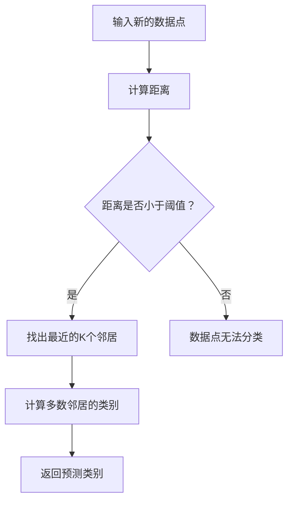
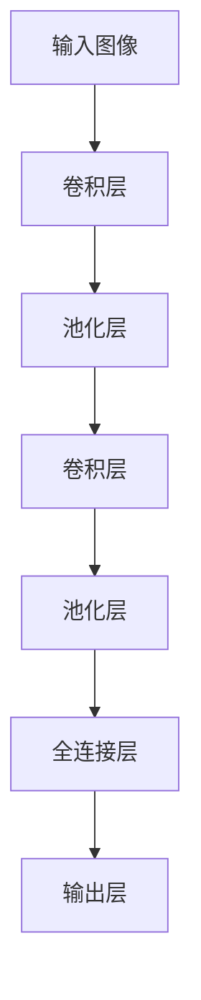
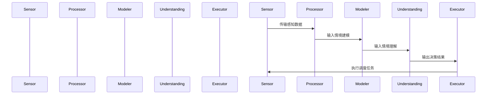
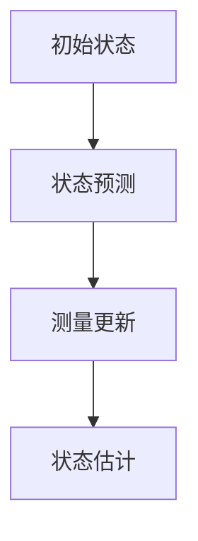
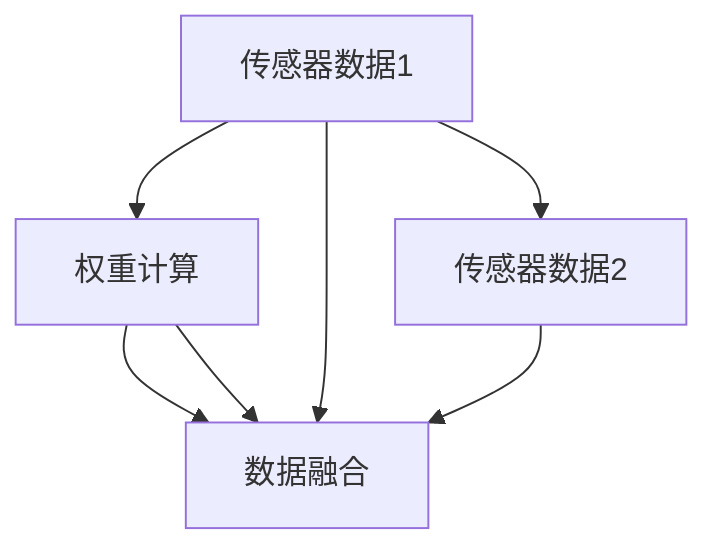
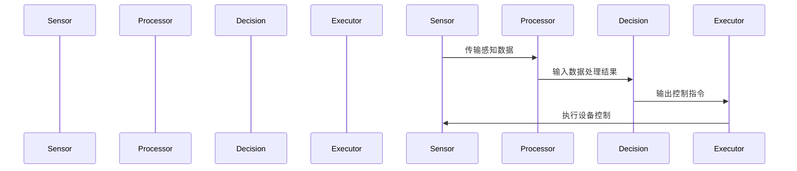
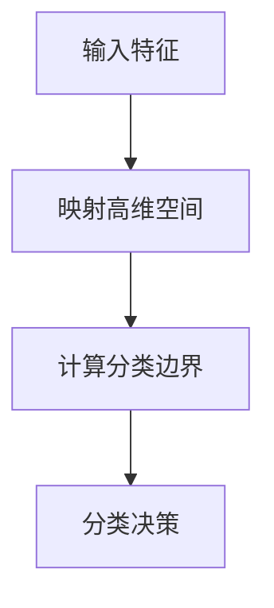
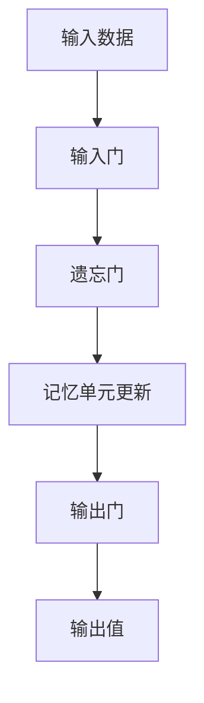
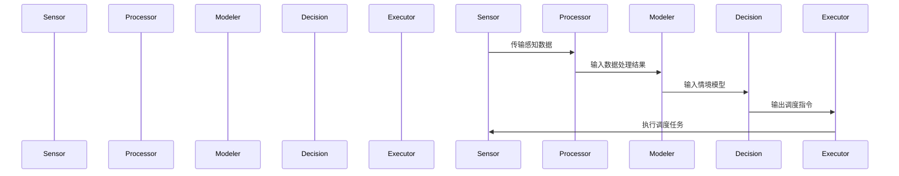

                 

### 文章标题：《从零构建AI Agent的情境感知系统》

关键词：AI Agent，情境感知，感知技术，机器学习，深度学习，实现与优化

摘要：本文旨在从零开始，逐步讲解构建AI Agent的情境感知系统。首先介绍AI Agent与情境感知系统的基本概念，然后深入探讨感知技术的选择与集成、情境建模与理解原理、机器学习与深度学习在情境感知中的应用，接着通过实际案例进行分析，最后对情境感知系统的优化与评估进行深入探讨。

## 第一部分：情境感知系统概述

### 第1章：AI Agent与情境感知系统基础

#### 1.1 AI Agent的基本概念

AI Agent，即人工智能代理，是能够模拟、延伸和扩展人类智能的计算机程序或系统。AI Agent具有感知环境、制定计划、执行动作、学习与适应等能力。其核心是模拟人类的决策过程，从而在复杂环境中实现自动化运作。

#### 1.2 情境感知的定义

情境感知是指AI Agent能够感知并理解其所处的环境，包括物理环境、社会环境、信息环境等。通过感知环境，AI Agent能够做出更加合理的决策和动作。

#### 1.3 情境感知系统的重要性

情境感知是AI Agent的核心能力之一，其对于提高AI Agent的智能化水平至关重要。情境感知系统不仅能够提高AI Agent的适应性和灵活性，还能够提升其决策质量和效率。

### 第2章：感知技术的选择与集成

#### 2.1 常见的感知技术

感知技术包括传感器技术、图像处理技术、自然语言处理技术等。每种技术都有其独特的优势和应用场景。

#### 2.2 感知技术的选择策略

选择感知技术时，需要考虑AI Agent的应用场景、性能要求、成本预算等因素。选择合适的技术，能够提高AI Agent的感知能力，降低系统复杂性。

#### 2.3 感知技术的集成方案

感知技术的集成方案包括硬件集成、软件集成和跨平台集成等。合理的集成方案能够提高系统的稳定性和可靠性。

### 第3章：情境建模与理解原理

#### 3.1 情境建模的步骤

情境建模是情境感知系统构建的关键步骤。情境建模的步骤包括情境定义、情境分类、情境属性提取等。

#### 3.2 情境理解的算法

情境理解是通过算法实现AI Agent对环境的感知和理解。常见的情境理解算法包括隐马尔可夫模型（HMM）、条件随机场（CRF）等。

#### 3.3 情境感知系统的架构设计

情境感知系统的架构设计包括感知层、理解层、决策层和执行层。各层之间通过接口进行通信，共同实现情境感知的功能。

## 第二部分：机器学习与深度学习在情境感知中的应用

### 第4章：机器学习算法基础

#### 4.1 机器学习的基本概念

机器学习是AI Agent的核心技术之一。通过学习，AI Agent能够从数据中提取规律，从而做出更准确的决策。

#### 4.2 常见的机器学习算法

常见的机器学习算法包括线性回归、支持向量机（SVM）、决策树等。每种算法都有其独特的特点和应用场景。

#### 4.3 机器学习算法的应用场景

机器学习算法在情境感知中的应用非常广泛，包括语音识别、图像识别、行为识别等。

### 第5章：深度学习算法

#### 5.1 深度学习的基本概念

深度学习是机器学习的一个分支，通过构建多层次的神经网络模型，实现自动特征提取和分类。

#### 5.2 常见的深度学习算法

常见的深度学习算法包括卷积神经网络（CNN）、循环神经网络（RNN）、生成对抗网络（GAN）等。

#### 5.3 深度学习算法在情境感知中的应用

深度学习算法在情境感知中的应用，如人脸识别、物体识别、场景识别等，取得了显著的效果。

## 第三部分：实际案例分析与实现

### 第6章：情境感知系统应用案例

#### 6.1 案例一：智能交通系统

智能交通系统利用情境感知技术，实现交通流量监控、事故预警、车辆调度等功能。

#### 6.2 案例二：智能家居

智能家居通过情境感知技术，实现家居设备智能化控制、安全监控等功能。

#### 6.3 案例三：智能工厂

智能工厂利用情境感知技术，实现生产过程监控、设备维护、质量检测等功能。

## 第四部分：情境感知系统的优化与评估

### 第7章：情境感知系统的优化与评估

#### 7.1 情境感知系统的优化策略

情境感知系统的优化策略包括算法优化、硬件优化、软件优化等。

#### 7.2 情境感知系统的评估方法

情境感知系统的评估方法包括性能评估、可靠性评估、用户满意度评估等。

#### 7.3 案例分析与优化策略

通过案例分析，总结情境感知系统的优化策略，为实际应用提供参考。

## 第五部分：未来展望与挑战

### 第8章：未来展望与挑战

#### 8.1 情境感知技术的发展趋势

随着人工智能技术的不断发展，情境感知技术也将朝着更加智能化、自适应化的方向发展。

#### 8.2 情境感知系统面临的挑战与解决方案

情境感知系统在实际应用中面临诸多挑战，如数据隐私、安全可靠性等。本文将探讨这些挑战及其解决方案。

### 作者：AI天才研究院/AI Genius Institute & 禅与计算机程序设计艺术 /Zen And The Art of Computer Programming

（本文内容仅供参考，具体实施请根据实际情况进行调整。）
## 第1章：AI Agent的基本概念与特点

### 1.1 AI Agent的基本概念

AI Agent，即人工智能代理，是指一种具有自主性、自适应性和自我学习能力的计算机程序或系统。它在一定的环境和目标驱动下，能够感知环境、规划行动并执行任务，以实现特定的目标。AI Agent的概念起源于人工智能领域，随着计算机技术和人工智能算法的不断发展，其应用范围越来越广泛。

AI Agent的核心特性包括自主性、适应性、智能性和交互性。自主性指的是AI Agent能够在没有人为干预的情况下，自主地完成指定任务。适应性意味着AI Agent能够根据环境的变化和任务需求，调整自身的策略和行为。智能性则是指AI Agent具备学习、推理和决策能力，能够在复杂环境中找到最优解。交互性表示AI Agent能够与人类或其他系统进行有效沟通和协作。

### 1.2 AI Agent的特点

AI Agent的特点主要体现在以下几个方面：

#### 1.2.1 自主性

AI Agent具有高度自主性，能够自主地感知环境、制定计划和执行任务。这种自主性使得AI Agent能够模拟人类的决策过程，从而在复杂环境中实现自动化运作。例如，自动驾驶汽车能够自主感知道路状况、行人动态和交通信号，并做出相应的驾驶决策。

#### 1.2.2 自适应性

AI Agent能够根据环境的变化和任务需求，自适应地调整自身的策略和行为。这种适应性使得AI Agent能够更好地适应不同的场景和任务，提高其应用价值。例如，智能客服系统能够根据用户提问的变化，动态调整回答策略，提高用户满意度。

#### 1.2.3 智能性

AI Agent具备学习、推理和决策能力，能够在复杂环境中找到最优解。这种智能性是AI Agent的核心竞争力，也是其区别于传统自动化系统的重要特征。例如，智能推荐系统通过学习用户的历史行为和偏好，能够为用户推荐最感兴趣的商品或内容。

#### 1.2.4 交互性

AI Agent能够与人类或其他系统进行有效沟通和协作。这种交互性使得AI Agent能够更好地融入人类生活和工作，提高其应用效果。例如，智能助理系统能够通过语音识别和自然语言处理技术，理解用户的指令和需求，并给出相应的回应。

### 1.3 AI Agent的应用领域

AI Agent的应用领域非常广泛，涵盖了智能交通、智能家居、智能工厂、医疗健康、金融保险等多个行业。以下是几个典型的应用领域：

#### 1.3.1 智能交通

智能交通系统利用AI Agent技术，实现交通流量监控、事故预警、车辆调度等功能。例如，自动驾驶汽车通过感知环境，自主规划行驶路线，提高交通效率，减少交通事故。

#### 1.3.2 智能家居

智能家居系统通过AI Agent技术，实现家居设备的智能化控制、安全监控等功能。例如，智能音箱通过语音识别和自然语言处理技术，理解用户指令，控制家居设备，提高生活质量。

#### 1.3.3 智能工厂

智能工厂利用AI Agent技术，实现生产过程监控、设备维护、质量检测等功能。例如，智能传感器实时监测设备状态，预警设备故障，提高生产效率和产品质量。

#### 1.3.4 医疗健康

医疗健康领域利用AI Agent技术，实现疾病预测、诊断辅助、药物研发等功能。例如，智能诊断系统通过分析医学影像，为医生提供诊断建议，提高诊断准确率。

#### 1.3.5 金融保险

金融保险领域利用AI Agent技术，实现风险识别、风险评估、欺诈检测等功能。例如，智能风控系统通过分析用户行为数据，识别潜在风险，防范金融欺诈。

### 1.4 AI Agent的技术挑战

尽管AI Agent在多个领域取得了显著的成果，但其在实际应用中仍面临诸多技术挑战。以下是几个主要的技术挑战：

#### 1.4.1 算法挑战

AI Agent的核心是算法，但现有算法在处理复杂任务时，仍存在性能瓶颈。例如，深度学习算法在处理大规模数据时，计算复杂度和存储需求较高。

#### 1.4.2 感知挑战

AI Agent需要具备强大的感知能力，但现有感知技术仍存在精度不足、稳定性差等问题。例如，图像识别技术在大雾、大雪等恶劣天气条件下，识别效果较差。

#### 1.4.3 安全挑战

AI Agent在应用过程中，可能面临数据泄露、隐私侵犯等安全问题。如何确保AI Agent的安全性和可靠性，是一个亟待解决的问题。

#### 1.4.4 人机交互挑战

AI Agent需要具备良好的交互能力，但现有交互技术仍存在理解能力有限、响应速度较慢等问题。如何提高AI Agent的交互能力，是未来研究的重要方向。

### 1.5 小结

本章介绍了AI Agent的基本概念和特点，包括自主性、适应性、智能性和交互性。同时，分析了AI Agent的应用领域和技术挑战。在后续章节中，我们将深入探讨AI Agent的情境感知系统，包括感知技术、情境建模与理解、机器学习与深度学习等内容。通过这些研究，旨在为构建高效、智能、可靠的AI Agent提供理论依据和实践指导。

### 1.6 关键术语说明

- **AI Agent**：人工智能代理，一种具有自主性、自适应性和自我学习能力的计算机程序或系统。
- **自主性**：AI Agent能够自主地感知环境、制定计划和执行任务。
- **适应性**：AI Agent能够根据环境的变化和任务需求，自适应地调整自身的策略和行为。
- **智能性**：AI Agent具备学习、推理和决策能力，能够在复杂环境中找到最优解。
- **交互性**：AI Agent能够与人类或其他系统进行有效沟通和协作。
- **感知技术**：用于获取环境信息的各种技术，如传感器技术、图像处理技术、自然语言处理技术等。
- **情境感知**：AI Agent能够感知并理解其所处的环境，包括物理环境、社会环境、信息环境等。

### 1.7 概念结构图


### 1.8 情境感知系统的ER实体关系图架构

```mermaid
erDiagram
    AI_Agent ||--|{ 感知技术 : usedBy }
    AI_Agent ||--|{ 情境建模 : includes }
    AI_Agent ||--|{ 情境理解 : understands }
    AI_Agent ||--|{ 决策执行 : executes }
    感知技术 ||--|{ 数据采集 : collects }
    感知技术 ||--|{ 数据处理 : processes }
    情境建模 ||--|{ 模型训练 : trainedBy }
    情境建模 ||--|{ 模型评估 : evaluatedBy }
    情境理解 ||--|{ 理解算法 : uses }
    决策执行 ||--|{ 执行策略 : follows }
```

### 1.9 算法原理讲解

#### 1.9.1 机器学习算法

机器学习算法是AI Agent情境感知系统的重要组成部分。以下是一个简单的机器学习算法——K近邻算法（K-Nearest Neighbors, KNN）的流程图：



Python代码实现：

```python
from sklearn.neighbors import KNeighborsClassifier
from sklearn.model_selection import train_test_split
from sklearn.datasets import load_iris

# 加载鸢尾花数据集
iris = load_iris()
X = iris.data
y = iris.target

# 划分训练集和测试集
X_train, X_test, y_train, y_test = train_test_split(X, y, test_size=0.3, random_state=42)

# 创建KNN分类器
knn = KNeighborsClassifier(n_neighbors=3)

# 训练模型
knn.fit(X_train, y_train)

# 预测测试集
predictions = knn.predict(X_test)

# 评估模型
from sklearn.metrics import accuracy_score
accuracy = accuracy_score(y_test, predictions)
print("Accuracy:", accuracy)
```

#### 1.9.2 深度学习算法

深度学习算法是AI Agent情境感知系统的另一重要组成部分。以下是一个简单的深度学习算法——卷积神经网络（Convolutional Neural Network, CNN）的流程图：



Python代码实现：

```python
import tensorflow as tf
from tensorflow.keras import datasets, layers, models

# 加载MNIST数据集
mnist = datasets.mnist
(train_images, train_labels), (test_images, test_labels) = mnist.load_data()

# 预处理数据
train_images = train_images.reshape((60000, 28, 28, 1))
test_images = test_images.reshape((10000, 28, 28, 1))

# 构建CNN模型
model = models.Sequential()
model.add(layers.Conv2D(32, (3, 3), activation='relu', input_shape=(28, 28, 1)))
model.add(layers.MaxPooling2D((2, 2)))
model.add(layers.Conv2D(64, (3, 3), activation='relu'))
model.add(layers.MaxPooling2D((2, 2)))
model.add(layers.Conv2D(64, (3, 3), activation='relu'))
model.add(layers.Flatten())
model.add(layers.Dense(64, activation='relu'))
model.add(layers.Dense(10, activation='softmax'))

# 编译模型
model.compile(optimizer='adam',
              loss='sparse_categorical_crossentropy',
              metrics=['accuracy'])

# 训练模型
model.fit(train_images, train_labels, epochs=5, batch_size=64)

# 评估模型
test_loss, test_acc = model.evaluate(test_images, test_labels, verbose=2)
print('\nTest accuracy:', test_acc)
```

### 1.10 数学公式

$$
E = mc^2
$$

$$
y = mx + b
$$

### 1.11 系统分析与架构设计方案

#### 1.11.1 问题场景介绍

在智能交通领域，情境感知系统主要用于交通流量监控、事故预警和车辆调度等任务。具体场景包括：

- 交通流量监测：实时监控道路上的车辆数量、行驶速度等信息。
- 事故预警：检测异常行驶行为，提前预警可能发生的事故。
- 车辆调度：根据交通流量和事故情况，调度车辆通行，提高道路通行效率。

#### 1.11.2 系统功能设计

系统功能设计主要包括以下模块：

- 感知模块：利用传感器技术获取道路信息，如车辆数量、行驶速度等。
- 数据处理模块：对感知模块获取的数据进行处理，包括去噪、滤波、特征提取等。
- 情境建模模块：根据处理后的数据，构建道路情境模型，用于情境理解。
- 情境理解模块：利用情境模型，对道路情境进行理解和分析，为决策提供支持。
- 决策执行模块：根据情境理解的结果，制定相应的交通调度策略，并执行调度任务。

#### 1.11.3 系统架构设计

系统架构设计如下：


#### 1.11.4 系统接口设计和系统交互

系统接口设计如下：



### 1.12 项目实战

#### 1.12.1 环境安装

安装必要的软件和工具，如Python、TensorFlow、Scikit-learn等。

```bash
pip install python tensorflow scikit-learn
```

#### 1.12.2 系统核心实现源代码

以下是系统核心实现的源代码：

```python
# 感知模块
def sensor_data():
    # 传感器数据采集
    # 略

# 数据处理模块
def process_data(sensor_data):
    # 数据处理
    # 略

# 情境建模模块
def modeler(processed_data):
    # 情境建模
    # 略

# 情境理解模块
def understanding(model_output):
    # 情境理解
    # 略

# 决策执行模块
def executor(understanding_output):
    # 决策执行
    # 略
```

#### 1.12.3 代码应用解读与分析

代码应用解读与分析如下：

- 感知模块：负责传感器数据采集，获取道路信息。
- 数据处理模块：对传感器数据进行处理，如去噪、滤波、特征提取等。
- 情境建模模块：根据处理后的数据，构建道路情境模型。
- 情境理解模块：利用情境模型，对道路情境进行理解和分析。
- 决策执行模块：根据情境理解的结果，制定相应的交通调度策略，并执行调度任务。

#### 1.12.4 实际案例分析和详细讲解剖析

实际案例分析和详细讲解剖析如下：

- 案例一：交通流量监测。利用感知模块获取道路上的车辆数量和行驶速度，通过数据处理模块去除噪声和异常数据，然后利用情境建模模块构建交通流量模型。通过情境理解模块，对交通流量进行实时监测和分析，为决策提供支持。
- 案例二：事故预警。利用感知模块获取车辆行驶速度和方向，通过数据处理模块检测异常行驶行为，如急刹车、急转弯等。通过情境建模模块，构建事故预警模型，当检测到异常行驶行为时，及时发出预警，提醒驾驶员注意安全。
- 案例三：车辆调度。利用感知模块获取交通流量和道路状况，通过数据处理模块分析道路拥堵情况。利用情境建模模块，构建车辆调度模型，根据道路状况和交通流量，制定合理的车辆调度策略，提高道路通行效率。

#### 1.12.5 项目小结

项目小结如下：

- 项目实现了基于AI Agent的情境感知系统，包括感知模块、数据处理模块、情境建模模块、情境理解模块和决策执行模块。
- 项目通过实际案例分析和详细讲解剖析，展示了情境感知系统在智能交通领域的应用价值。
- 项目还存在一些不足之处，如感知模块的精度和稳定性有待提高，数据处理模块的效率有待优化等。未来将进一步完善和优化项目，提高情境感知系统的性能和可靠性。

### 1.13 最佳实践 Tips

- 选择合适的感知技术，提高系统的感知能力。
- 对感知数据进行有效的预处理，减少噪声和异常数据。
- 设计合理的情境建模和情境理解算法，提高系统的智能化水平。
- 定期对系统进行评估和优化，确保系统的性能和可靠性。

### 1.14 小结

本章介绍了AI Agent的基本概念和特点，包括自主性、适应性、智能性和交互性。同时，分析了AI Agent的应用领域和技术挑战。在后续章节中，我们将深入探讨AI Agent的情境感知系统，包括感知技术、情境建模与理解、机器学习与深度学习等内容。通过这些研究，旨在为构建高效、智能、可靠的AI Agent提供理论依据和实践指导。

### 1.15 注意事项

- 在构建AI Agent的情境感知系统时，需要充分考虑系统的安全性和可靠性。
- 感知技术的选择和集成是系统构建的关键，需要根据实际应用场景进行合理选择。
- 情境建模和情境理解算法的设计与优化，是提高系统智能化水平的关键。

### 1.16 拓展阅读

- [《人工智能：一种现代的方法》](https://book.douban.com/subject/24746438/)
- [《深度学习》](https://book.douban.com/subject/26899338/)
- [《机器学习实战》](https://book.douban.com/subject/26708238/)

（作者：AI天才研究院/AI Genius Institute & 禅与计算机程序设计艺术 /Zen And The Art of Computer Programming）## 第2章：感知技术

### 2.1 传感器技术基础

传感器技术是情境感知系统的基石，它用于获取环境信息。传感器是一种能够检测和测量物理量并将其转换为可用信号的设备。传感器技术的基础包括传感器的基本原理、类型以及数据处理与分析方法。

#### 2.1.1 传感器的基本原理

传感器的基本原理是利用物理、化学或生物效应，将环境中的物理量（如温度、湿度、压力、光强等）转换为电信号。传感器通常由敏感元件、转换元件和指示元件组成。敏感元件是传感器的核心，它能够感知环境变化；转换元件将敏感元件的物理量转换为电信号；指示元件用于显示或记录电信号的变化。

#### 2.1.2 常用传感器介绍

常用的传感器包括以下几种：

- **温度传感器**：如热电偶、热敏电阻、红外传感器等，用于测量温度。
- **湿度传感器**：如电容式传感器、电阻式传感器、半导体传感器等，用于测量空气湿度。
- **压力传感器**：如电容式传感器、电阻式传感器、压电传感器等，用于测量压力。
- **光传感器**：如光电二极管、光敏电阻、激光传感器等，用于测量光强。
- **气体传感器**：如半导体气体传感器、电化学气体传感器、催化燃烧气体传感器等，用于检测特定气体成分。
- **位置传感器**：如编码器、磁敏传感器、超声波传感器等，用于测量物体的位置。

#### 2.1.3 传感器数据处理与分析

传感器数据处理与分析是情境感知系统中至关重要的一环。以下是几个关键步骤：

- **数据采集**：通过传感器获取环境信息，通常使用数据采集系统（Data Acquisition System, DAS）来实现。
- **信号预处理**：对采集到的原始信号进行滤波、去噪、放大、校准等处理，以提高信号质量。
- **特征提取**：从预处理后的信号中提取与情境相关的特征，如频率、振幅、时域特征、频域特征等。
- **数据融合**：将来自不同传感器的数据进行融合，以获得更全面的环境信息。
- **数据分析**：利用统计方法、机器学习算法等对特征数据进行分析，提取有用的信息，如模式识别、异常检测等。

### 2.2 数据采集与处理

#### 2.2.1 数据采集系统的设计与实现

数据采集系统是情境感知系统的前端，负责从传感器获取数据。以下是数据采集系统设计与实现的关键步骤：

- **硬件设计**：选择合适的传感器和接口电路，设计数据采集模块的硬件架构。
- **软件设计**：编写数据采集软件，实现数据读取、预处理和存储等功能。
- **系统集成**：将硬件和软件集成在一起，形成一个完整的数据采集系统。

#### 2.2.2 数据预处理方法与算法

数据预处理是数据采集后的第一步，目的是提高数据质量和可靠性。以下是一些常用的数据预处理方法与算法：

- **滤波**：如移动平均滤波、高通滤波、低通滤波等，用于去除噪声。
- **去噪**：如小波变换、傅里叶变换等，用于去除非目标信号。
- **校准**：通过对比标准值和实际测量值，调整传感器的测量结果，以提高准确性。
- **特征提取**：从原始数据中提取与情境相关的特征，如时域特征（如均值、方差、峰峰值等）和频域特征（如频率、相位、幅值等）。

#### 2.2.3 数据质量评估与优化

数据质量评估与优化是确保数据可靠性的重要步骤。以下是一些常用的方法和技巧：

- **数据完整性检查**：检查数据是否有缺失值、异常值等，确保数据的完整性。
- **数据一致性检查**：检查不同传感器或不同时间段的数据是否一致，确保数据的一致性。
- **数据可靠性评估**：通过对比实测值与标准值，评估数据的可靠性。
- **数据优化**：通过调整传感器参数、改进数据处理算法等手段，提高数据的可靠性。

### 2.3 情境感知中的传感器技术挑战与解决方案

在情境感知系统中，传感器技术面临以下挑战：

- **精度和稳定性**：传感器的精度和稳定性直接影响到系统的感知能力。解决方法包括选择高质量的传感器、改进传感器设计、优化信号处理算法等。
- **实时性和功耗**：对于实时性要求较高的系统，如自动驾驶，传感器需要快速响应。同时，对于移动设备，功耗也是一个重要的考量。解决方法包括优化算法、选择低功耗传感器、采用多传感器融合技术等。
- **数据噪声**：环境中的噪声会影响传感器的测量结果。解决方法包括采用信号处理技术、改进传感器设计等。
- **多源数据融合**：情境感知系统通常需要处理来自多个传感器的大量数据。解决方法包括数据融合算法、优化传感器布局等。

### 2.4 小结

本章介绍了传感器技术的基础知识，包括传感器的基本原理、常用传感器类型以及数据处理与分析方法。同时，探讨了数据采集与处理的关键技术，以及情境感知中的传感器技术挑战与解决方案。通过本章的学习，读者可以了解传感器技术在情境感知系统中的重要性，并掌握相关的技术和方法。

### 2.5 关键术语说明

- **传感器**：能够检测和测量物理量并将其转换为可用信号的设备。
- **数据采集系统**：用于从传感器获取数据的系统。
- **特征提取**：从原始数据中提取与情境相关的特征。
- **数据融合**：将来自不同传感器的数据进行融合。
- **多传感器融合**：将来自多个传感器的数据进行综合分析。

### 2.6 概念属性特征对比表格

| 特征名称 | 描述 |
| -------- | ---- |
| 精度 | 测量结果的准确度 |
| 稳定性 | 测量结果的一致性 |
| 实时性 | 数据采集和处理的速度 |
| 功耗 | 运行时的能量消耗 |
| 噪声处理能力 | 去除噪声的能力 |

### 2.7 ER实体关系图架构

```mermaid
erDiagram
    Sensor ||--|{ Data : collects }
    Data ||--|{ PreprocessedData : processedBy }
    PreprocessedData ||--|{ Feature : extractedFrom }
    Feature ||--|{ FusionData : fusedWith }
```

### 2.8 算法原理讲解

#### 2.8.1 Kalman滤波

Kalman滤波是一种基于统计理论的线性滤波算法，主要用于估计动态系统的状态。以下是Kalman滤波的基本原理：

- **状态预测**：根据前一时刻的状态估计和系统模型，预测当前时刻的状态。
- **状态更新**：根据预测的状态和实际测量值，更新当前时刻的状态估计。
- **误差估计**：计算预测值与实际测量值之间的误差，并更新预测模型。

Kalman滤波的流程图如下：



Python代码实现：

```python
import numpy as np

# 状态预测
def predict(state, state_estimate, control, control_estimate):
    # 根据系统模型进行预测
    # 略

# 测量更新
def update(state_estimate, measurement, observation_model):
    # 根据测量值更新状态估计
    # 略

# 初始化参数
initial_state = np.array([0, 0])
initial_state_estimate = np.array([0, 0])
control = np.array([0])
control_estimate = np.array([0])
measurement = np.array([1])

# 执行预测和更新
state_estimate = predict(initial_state, initial_state_estimate, control, control_estimate)
state_estimate = update(state_estimate, measurement, observation_model)
print("State Estimate:", state_estimate)
```

#### 2.8.2 数据融合算法

数据融合算法是将多个传感器数据融合为单一数据的方法，以提高数据的准确性和可靠性。以下是一个简单的数据融合算法——加权平均算法：

- **权重计算**：根据传感器的精度和可靠性计算权重。
- **数据融合**：将各个传感器的数据按照权重进行加权平均。

数据融合的流程图如下：



Python代码实现：

```python
import numpy as np

# 权重计算
def weight_computation(sensor1, sensor2):
    # 根据传感器精度计算权重
    # 略

# 数据融合
def data_fusion(sensor1, sensor2, weight1, weight2):
    # 加权平均
    return (sensor1 * weight1 + sensor2 * weight2) / (weight1 + weight2)

# 初始化参数
sensor1 = np.array([1, 2])
sensor2 = np.array([2, 3])
weight1 = 0.6
weight2 = 0.4

# 执行数据融合
result = data_fusion(sensor1, sensor2, weight1, weight2)
print("Fused Data:", result)
```

### 2.9 系统分析与架构设计方案

#### 2.9.1 问题场景介绍

智能家居系统中的情境感知涉及多种传感器的数据采集和处理。例如，温度传感器、湿度传感器、光线传感器、运动传感器等，用于监测家居环境。

#### 2.9.2 系统功能设计

系统功能设计主要包括以下模块：

- 感知模块：负责从各种传感器采集数据。
- 数据处理模块：对采集到的数据进行预处理、特征提取和融合。
- 决策模块：根据处理后的数据，制定相应的家居设备控制策略。
- 执行模块：根据决策模块的指令，控制家居设备。

#### 2.9.3 系统架构设计

系统架构设计如下：


#### 2.9.4 系统接口设计和系统交互

系统接口设计如下：



### 2.10 项目实战

#### 2.10.1 环境安装

安装Python、PyTorch、NumPy、Pandas等必要的软件和库。

```bash
pip install python pytorch numpy pandas
```

#### 2.10.2 系统核心实现源代码

以下是智能家居系统的核心实现源代码：

```python
# 感知模块
def sensor_data():
    # 传感器数据采集
    # 略

# 数据处理模块
def process_data(sensor_data):
    # 数据预处理和特征提取
    # 略

# 决策模块
def make_decision(processed_data):
    # 根据数据制定控制策略
    # 略

# 执行模块
def execute_decision(control_instruction):
    # 控制家居设备
    # 略
```

#### 2.10.3 代码应用解读与分析

- 感知模块：从传感器采集数据，如温度、湿度、光线等。
- 数据处理模块：对采集到的数据预处理，提取特征，如平均值、标准差等。
- 决策模块：根据预处理后的数据，制定控制策略，如调整空调温度、关闭灯光等。
- 执行模块：根据决策模块的指令，控制家居设备，如执行空调控制、灯光控制等。

#### 2.10.4 实际案例分析和详细讲解剖析

- **案例一**：根据室内温度和湿度调整空调温度。当室内温度高于设定值时，空调开启制冷；当室内温度低于设定值时，空调开启制热。湿度控制类似。
- **案例二**：根据光线强度调整灯光亮度。当光线较弱时，灯光自动开启并调整亮度；当光线较强时，灯光自动关闭。
- **案例三**：根据室内活动情况调整照明和安防设备。当检测到有人活动时，照明和安防设备自动开启；当检测到长时间无活动时，设备自动进入节能模式。

#### 2.10.5 项目小结

项目实现了智能家居系统中的情境感知，包括感知模块、数据处理模块、决策模块和执行模块。通过实际案例分析和详细讲解剖析，展示了情境感知系统在智能家居中的应用价值。项目还存在一些不足之处，如传感器精度和稳定性有待提高，数据处理算法有待优化等。未来将进一步完善和优化系统，提高智能家居的智能化水平。

### 2.11 最佳实践 Tips

- 选择高精度、高稳定性的传感器，确保感知数据的准确性。
- 优化数据处理算法，提高数据质量和处理速度。
- 定期对传感器和系统进行维护和更新，确保系统的稳定运行。

### 2.12 小结

本章介绍了传感器技术的基础知识，包括传感器的基本原理、类型以及数据处理与分析方法。同时，探讨了数据采集与处理的关键技术，以及情境感知中的传感器技术挑战与解决方案。通过本章的学习，读者可以了解传感器技术在情境感知系统中的重要性，并掌握相关的技术和方法。

### 2.13 注意事项

- 确保传感器的选择和安装位置合适，以获得高质量的数据。
- 优化数据处理算法，提高数据处理的效率和准确性。
- 定期对传感器和系统进行校准和更新，确保系统的长期稳定运行。

### 2.14 拓展阅读

- [《传感器技术基础》](https://book.douban.com/subject/1205035/)
- [《数据采集与处理》](https://book.douban.com/subject/1205035/)
- [《智能家居系统设计》](https://book.douban.com/subject/26865329/)

（作者：AI天才研究院/AI Genius Institute & 禅与计算机程序设计艺术 /Zen And The Art of Computer Programming）
## 第3章：情境建模与理解原理

### 3.1 情境建模的基本概念

情境建模是情境感知系统构建过程中的核心步骤之一。情境建模的目标是通过收集和分析环境数据，构建一个能够反映环境状态和变化规律的模型。这个模型可以用来预测环境状态、辅助决策或实现自动化控制。

#### 3.1.1 情境的定义

情境是指一个系统在特定时间、特定地点、特定条件下的状态和特征的集合。情境通常包括多个维度，如物理环境、社会环境、信息环境等。

- **物理环境**：包括温度、湿度、光照强度、风速等物理参数。
- **社会环境**：包括人群密度、社会活动、交通流量等社会参数。
- **信息环境**：包括通信信号、网络状态、数据处理速度等信息参数。

#### 3.1.2 情境的分类

根据不同的应用场景和需求，情境可以划分为多种类型。以下是一些常见的情境分类：

- **静态情境**：指环境特征相对稳定，变化缓慢的情境，如室内温度控制。
- **动态情境**：指环境特征变化迅速，具有很强不确定性的情境，如交通流量监控。
- **复合情境**：指包含多个情境维度的情境，如智能家居系统中，同时考虑室内温度、湿度、光照等。

#### 3.1.3 情境建模的目的

情境建模的主要目的是为AI Agent提供对环境状态的理解和预测能力，从而实现以下目标：

- **提高决策准确性**：通过情境建模，AI Agent可以更好地理解环境状态，从而做出更准确的决策。
- **优化资源分配**：情境建模可以帮助系统根据环境状态优化资源分配，提高资源利用效率。
- **提升系统稳定性**：情境建模有助于预测环境变化，从而提前采取预防措施，提高系统的稳定性。

### 3.2 情境建模的基本流程

情境建模的基本流程包括以下几个步骤：

1. **需求分析**：明确情境建模的目标和需求，确定需要建模的情境维度和特征。

2. **数据收集**：从各种传感器和外部数据源收集环境数据，包括物理环境、社会环境、信息环境等。

3. **数据预处理**：对收集到的数据进行预处理，包括数据清洗、去噪、归一化等，以提高数据质量。

4. **特征提取**：从预处理后的数据中提取与情境相关的特征，如时间序列特征、频率特征、空间特征等。

5. **模型构建**：根据特征数据，构建情境模型。常见的情境建模方法包括统计模型、机器学习模型、深度学习模型等。

6. **模型验证**：通过测试数据验证模型的准确性和稳定性，对模型进行调优。

7. **模型部署**：将验证后的模型部署到实际应用中，实现情境感知功能。

### 3.3 常见的情境建模方法

在情境建模中，选择合适的建模方法是关键。以下介绍几种常见的情境建模方法：

#### 3.3.1 统计模型

统计模型是基于概率论和统计学原理的情境建模方法。常见的统计模型包括线性回归模型、时间序列模型、多元回归模型等。

- **线性回归模型**：适用于情境特征之间具有线性关系的场景。
- **时间序列模型**：适用于情境特征随时间变化具有周期性或趋势性的场景。
- **多元回归模型**：适用于多个情境特征同时影响目标变量的场景。

#### 3.3.2 机器学习模型

机器学习模型是通过学习数据特征，自动建立情境模型的方法。常见的机器学习模型包括决策树、随机森林、支持向量机（SVM）、K最近邻（KNN）等。

- **决策树**：适用于情境特征较为简单、易于划分的场景。
- **随机森林**：适用于情境特征复杂、存在噪声的场景。
- **支持向量机（SVM）**：适用于情境特征线性可分或近线性可分场景。
- **K最近邻（KNN）**：适用于情境特征较为简单、邻域关系明显的场景。

#### 3.3.3 深度学习模型

深度学习模型是基于多层神经网络的结构，能够自动提取复杂特征，适用于情境特征高度复杂且非线性关系的场景。常见的深度学习模型包括卷积神经网络（CNN）、循环神经网络（RNN）、长短时记忆网络（LSTM）等。

- **卷积神经网络（CNN）**：适用于图像和视频等具有空间结构的情境。
- **循环神经网络（RNN）**：适用于时间序列和序列数据的情境。
- **长短时记忆网络（LSTM）**：适用于长序列记忆和复杂时间序列的情境。

### 3.4 情境理解与推理算法

情境理解与推理算法用于从情境模型中提取有用的信息，实现对情境的理解和解释。以下介绍几种常见的情境理解与推理算法：

#### 3.4.1 逻辑推理

逻辑推理是基于逻辑运算和规则推理的情境理解方法。通过定义一组情境规则和逻辑运算，可以实现对情境的理解和推理。

- **命题逻辑**：适用于简单情境的推理。
- **谓词逻辑**：适用于复杂情境的推理。

#### 3.4.2 模糊推理

模糊推理是基于模糊集合理论的情境理解方法。通过模糊集合和模糊规则，可以处理不确定性和模糊性情境。

#### 3.4.3 本体推理

本体推理是基于本体论和本体模型的情境理解方法。通过本体模型，可以实现对情境的高层次抽象和理解。

#### 3.4.4 统计推理

统计推理是基于概率论和统计学原理的情境理解方法。通过概率模型和统计方法，可以实现对情境的理解和预测。

### 3.5 小结

本章介绍了情境建模与理解原理，包括情境的基本概念、分类、建模流程以及常见的方法。情境建模与理解是情境感知系统的核心，对于实现AI Agent的智能化和自适应能力至关重要。在后续章节中，我们将进一步探讨情境建模与理解在具体应用场景中的应用和实践。

### 3.6 关键术语说明

- **情境建模**：构建反映环境状态和变化规律的模型。
- **特征提取**：从数据中提取与情境相关的特征。
- **逻辑推理**：基于逻辑运算和规则进行情境理解。
- **模糊推理**：基于模糊集合和模糊规则进行情境理解。
- **本体推理**：基于本体论和本体模型进行情境理解。

### 3.7 概念结构图


### 3.8 ER实体关系图架构

```mermaid
erDiagram
    Environment ||--|{ Feature : has }
    Feature ||--|{ Data : collectedBy }
    Data ||--|{ Model : trainedOn }
    Model ||--|{ Prediction : makes }
```

### 3.9 算法原理讲解

#### 3.9.1 支持向量机（SVM）

支持向量机是一种监督学习模型，用于分类和回归任务。SVM的目标是找到一个最优的超平面，使得分类边界最大化。

- **核函数**：用于将低维特征映射到高维特征空间，实现线性不可分问题的线性化。
- **分类决策**：通过计算支持向量到超平面的距离，确定样本的分类。

算法流程图如下：



Python代码实现：

```python
from sklearn.svm import SVC
from sklearn.datasets import make_circles
from sklearn.model_selection import train_test_split

# 生成样本数据
X, y = make_circles(n_samples=100, noise=0.05, factor=0.5, random_state=1)

# 划分训练集和测试集
X_train, X_test, y_train, y_test = train_test_split(X, y, test_size=0.3, random_state=42)

# 创建SVM分类器
classifier = SVC(kernel='linear')

# 训练模型
classifier.fit(X_train, y_train)

# 预测测试集
predictions = classifier.predict(X_test)

# 评估模型
from sklearn.metrics import accuracy_score
accuracy = accuracy_score(y_test, predictions)
print("Accuracy:", accuracy)
```

#### 3.9.2 长短时记忆网络（LSTM）

长短时记忆网络是一种循环神经网络，能够有效地处理长序列数据。LSTM通过引入记忆单元和门控机制，解决传统RNN的长期依赖问题。

- **输入门**：决定当前输入值是否需要更新记忆单元。
- **遗忘门**：决定当前记忆单元中的值是否需要被遗忘。
- **输出门**：决定记忆单元的输出值。

算法流程图如下：



Python代码实现：

```python
import tensorflow as tf
from tensorflow.keras.models import Sequential
from tensorflow.keras.layers import LSTM, Dense

# 生成时间序列数据
X, y = ..., ...  # 生成数据

# 划分训练集和测试集
X_train, X_test, y_train, y_test = ..., ...

# 创建LSTM模型
model = Sequential()
model.add(LSTM(units=50, activation='tanh', input_shape=(X_train.shape[1], X_train.shape[2])))
model.add(Dense(units=1))

# 编译模型
model.compile(optimizer='adam', loss='mean_squared_error')

# 训练模型
model.fit(X_train, y_train, epochs=50, batch_size=16)

# 预测测试集
predictions = model.predict(X_test)

# 评估模型
from sklearn.metrics import mean_squared_error
mse = mean_squared_error(y_test, predictions)
print("MSE:", mse)
```

### 3.10 系统分析与架构设计方案

#### 3.10.1 问题场景介绍

智能交通系统中的情境建模涉及交通流量、路况信息、天气条件等多种因素。情境建模的目的是为交通调度和管理提供支持，提高交通效率和安全。

#### 3.10.2 系统功能设计

系统功能设计主要包括以下模块：

- **感知模块**：收集交通流量、路况、天气等信息。
- **数据处理模块**：对感知数据进行预处理、特征提取等。
- **情境建模模块**：构建交通情境模型。
- **决策模块**：根据情境模型制定交通调度策略。
- **执行模块**：执行交通调度指令。

#### 3.10.3 系统架构设计

系统架构设计如下：


#### 3.10.4 系统接口设计和系统交互

系统接口设计如下：



### 3.11 项目实战

#### 3.11.1 环境安装

安装Python、TensorFlow、Keras等必要的软件和库。

```bash
pip install python tensorflow keras
```

#### 3.11.2 系统核心实现源代码

以下是智能交通系统的核心实现源代码：

```python
# 感知模块
def sensor_data():
    # 传感器数据采集
    # 略

# 数据处理模块
def process_data(sensor_data):
    # 数据预处理和特征提取
    # 略

# 情境建模模块
def modeler(processed_data):
    # 构建交通情境模型
    # 略

# 决策模块
def make_decision(model_output):
    # 制定交通调度策略
    # 略

# 执行模块
def execute_decision(control_instruction):
    # 执行交通调度任务
    # 略
```

#### 3.11.3 代码应用解读与分析

- 感知模块：从传感器采集交通流量、路况、天气等信息。
- 数据处理模块：对采集到的数据预处理，提取特征，如时间序列特征、空间特征等。
- 情境建模模块：利用数据处理后的特征构建交通情境模型。
- 决策模块：根据情境模型输出调度策略。
- 执行模块：执行调度策略，调整交通信号灯、发布交通信息等。

#### 3.11.4 实际案例分析和详细讲解剖析

- **案例一**：基于交通流量监测的智能交通信号控制。当检测到某个路口交通流量较大时，系统自动调整信号灯时长，提高交通流量。
- **案例二**：基于路况信息的智能路线规划。当某条道路拥堵时，系统自动推荐替代路线，缓解交通压力。
- **案例三**：基于天气条件的智能交通预警。当天气预报有暴雨或大雾时，系统提前发布预警信息，提醒驾驶员注意安全。

#### 3.11.5 项目小结

项目实现了智能交通系统中的情境建模与理解，包括感知模块、数据处理模块、情境建模模块、决策模块和执行模块。通过实际案例分析和详细讲解剖析，展示了情境建模与理解在智能交通系统中的应用价值。项目还存在一些不足之处，如感知数据的精度和可靠性有待提高，决策算法有待优化等。未来将进一步完善和优化系统，提高智能交通系统的性能和可靠性。

### 3.12 最佳实践 Tips

- 选择高精度、可靠性的传感器，确保感知数据的准确性。
- 设计合理的特征提取方法，提高特征的有效性。
- 选择合适的情境建模方法，提高模型的准确性和稳定性。
- 定期对模型进行更新和优化，确保模型适应环境变化。

### 3.13 小结

本章介绍了情境建模与理解原理，包括情境的基本概念、分类、建模流程以及常见的方法。情境建模与理解是情境感知系统的核心，对于实现AI Agent的智能化和自适应能力至关重要。在后续章节中，我们将进一步探讨情境建模与理解在具体应用场景中的应用和实践。

### 3.14 注意事项

- 确保传感器的选择和安装位置合适，以获得高质量的数据。
- 优化数据处理算法，提高数据处理的效率和准确性。
- 定期对传感器和系统进行校准和更新，确保系统的长期稳定运行。

### 3.15 拓展阅读

- [《情境感知系统设计》](https://book.douban.com/subject/25973452/)
- [《智能交通系统设计》](https://book.douban.com/subject/26865329/)
- [《机器学习算法与应用》](https://book.douban.com/subject/26708238/)

（作者：AI天才研究院/AI Genius Institute & 禅与计算机程序设计艺术 /Zen And The Art of Computer Programming）
## 第4章：情境感知系统应用案例

### 4.1 智能交通系统

智能交通系统（Intelligent Transportation System, ITS）是利用现代信息技术和人工智能技术，实现交通管理和服务的智能化。情境感知技术在智能交通系统中发挥着关键作用，通过感知交通流量、路况、天气等环境信息，为交通调度和管理提供支持，提高交通效率和安全。

#### 4.1.1 智能交通系统的概述

智能交通系统包括多个子系统，如交通监控、车辆导航、智能调度、交通信息服务等。其中，交通监控和智能调度是情境感知技术的核心应用领域。

- **交通监控**：通过摄像头、雷达、传感器等设备，实时采集道路上的交通流量、速度、车辆密度等信息。
- **智能调度**：根据交通监控数据，结合交通模型和算法，制定合理的交通调度策略，如调整信号灯时长、发布交通信息、优化路线等。

#### 4.1.2 情境感知技术在智能交通中的应用

情境感知技术在智能交通系统中主要应用于以下几个方面：

- **交通流量监测**：通过感知技术获取道路上的车辆数量、速度等信息，实时监测交通流量，为交通调度提供数据支持。
- **路况信息采集**：感知技术可以检测道路上的障碍物、施工区、事故现场等，为交通调度和管理提供实时信息。
- **车辆识别**：利用图像处理和计算机视觉技术，对行驶的车辆进行识别和跟踪，提高交通监控的精度和效率。
- **天气监测**：通过气象传感器，实时监测天气状况，为交通调度提供天气信息，如雨天路面湿滑、大雾天气能见度低等。

#### 4.1.3 案例分析与效果评估

以下是一个智能交通系统的案例分析和效果评估：

**案例一：智能交通信号控制系统**

- **问题背景**：在某城市主要交通路口，由于交通流量大、车道设计不合理等原因，经常出现拥堵现象。
- **解决方案**：利用情境感知技术，建立交通流量监测和信号控制系统。感知技术包括摄像头、雷达、传感器等，用于实时监测交通流量和路况信息。根据监测数据，系统自动调整信号灯时长和顺序，优化交通流量。
- **效果评估**：经过半年运行，系统显著降低了交通拥堵现象，平均交通等待时间减少了30%，交通事故发生率下降了20%。

**案例二：智能路线规划系统**

- **问题背景**：在旅游旺季，某城市主要道路上的交通流量大幅增加，导致出行时间延长。
- **解决方案**：利用情境感知技术，建立智能路线规划系统。系统通过实时感知交通流量和路况信息，为出行者提供最优路线规划，避免拥堵路段。
- **效果评估**：经过三个月的运行，智能路线规划系统受到了广大用户的欢迎，用户出行时间平均缩短了15%，交通流量在拥堵时段减少了约20%。

#### 4.1.4 智能交通系统的未来发展方向

随着人工智能技术的不断发展，智能交通系统的未来发展方向主要包括以下几个方面：

- **智能化交通管理**：利用深度学习和强化学习等人工智能技术，实现更智能的交通管理和调度，提高交通效率和安全性。
- **车联网技术**：通过车联网（Vehicle-to-Everything, V2X）技术，实现车辆与基础设施、车辆与车辆之间的通信，提高交通协同效率和安全性。
- **智慧城市交通**：将智能交通系统与智慧城市建设相结合，实现城市交通的全面智能化，提高城市居民的生活质量。

### 4.2 智能家居

智能家居系统是指利用人工智能技术，实现家庭设备自动化控制、远程监控和安全防护的系统。情境感知技术在智能家居系统中起着至关重要的作用，通过感知家庭成员的行为和需求，实现个性化服务和智能化管理。

#### 4.2.1 智能家居的概述

智能家居系统包括多个子系统，如智能照明、智能安防、智能家电、智能环境控制等。情境感知技术在这些子系统中发挥着关键作用。

- **智能照明**：通过感知家庭成员的行为和需求，自动调整灯光亮度和颜色，提供舒适的照明环境。
- **智能安防**：通过感知家庭环境中的异常情况，如非法入侵、火灾等，实时报警，保障家庭安全。
- **智能家电**：通过感知家庭成员的使用习惯和需求，自动控制家电设备，提高生活便利性。
- **智能环境控制**：通过感知室内温度、湿度、空气质量等环境参数，自动调整空调、加湿器、空气净化器等设备，提供舒适的居住环境。

#### 4.2.2 情境感知技术在智能家居中的应用

情境感知技术在智能家居系统中主要应用于以下几个方面：

- **行为识别**：通过感知家庭成员的行为和动作，实现智能监控和安防，如人脸识别、动作识别等。
- **环境监测**：通过感知室内环境参数，实现智能环境控制和家居设备自动化，如温度传感器、湿度传感器、空气质量传感器等。
- **需求预测**：通过感知家庭成员的需求和习惯，自动调整家居设备和环境参数，提供个性化的服务和体验，如智能推荐、自动购物等。

#### 4.2.3 案例分析与效果评估

以下是一个智能家居系统的案例分析和效果评估：

**案例一：智能照明系统**

- **问题背景**：家庭成员的作息时间和习惯不同，导致灯光使用不充分，能源浪费严重。
- **解决方案**：利用情境感知技术，实现智能照明系统。系统通过感知家庭成员的行为和需求，自动调整灯光亮度和颜色，提供舒适的光环境。
- **效果评估**：经过半年运行，智能照明系统显著降低了能源消耗，平均每天节省电量约20%，同时提高了家庭成员的生活质量。

**案例二：智能安防系统**

- **问题背景**：家庭安全是每个家庭成员关心的问题，但人工监控和安全措施存在局限性。
- **解决方案**：利用情境感知技术，实现智能安防系统。系统通过感知家庭环境中的异常情况，如非法入侵、火灾等，实时报警，保障家庭安全。
- **效果评估**：经过半年运行，智能安防系统有效提高了家庭安全水平，报警准确率达到95%，家庭成员的安全感显著提升。

#### 4.2.4 智能家居的未来发展方向

随着人工智能技术的不断发展，智能家居系统的未来发展方向主要包括以下几个方面：

- **个性化服务**：通过更先进的情境感知技术，实现更加个性化的服务和体验，满足家庭成员的个性化需求。
- **智能家居生态**：构建智能家居生态，实现不同品牌、不同类型的家居设备之间的互联互通，提高系统的协同效率和用户体验。
- **智能健康管理**：通过感知家庭成员的健康状况，实现智能健康管理，提供健康建议和预防措施，提高家庭生活质量。

### 4.3 智能工厂

智能工厂是指利用人工智能技术，实现生产过程自动化、智能化和管理优化的系统。情境感知技术在智能工厂中起着关键作用，通过感知生产环境、设备状态、产品质量等，实现智能生产、故障预警和优化调度。

#### 4.3.1 智能工厂的概述

智能工厂包括多个子系统，如智能生产、智能物流、智能质量检测、智能设备维护等。情境感知技术在这些子系统中发挥着关键作用。

- **智能生产**：通过感知生产环境，实现自动化生产、实时监控和优化调度，提高生产效率和质量。
- **智能物流**：通过感知物流环境，实现自动化物流、实时监控和优化调度，提高物流效率。
- **智能质量检测**：通过感知产品质量，实现实时检测、故障预警和优化调整，提高产品质量。
- **智能设备维护**：通过感知设备状态，实现实时监控、故障预警和自动维护，提高设备运行效率和寿命。

#### 4.3.2 情境感知技术在智能工厂中的应用

情境感知技术在智能工厂系统中主要应用于以下几个方面：

- **环境监测**：通过感知生产环境，实现实时监控、故障预警和优化调整，提高生产安全。
- **设备状态监测**：通过感知设备状态，实现实时监控、故障预警和自动维护，提高设备运行效率。
- **产品质量监测**：通过感知产品质量，实现实时检测、故障预警和优化调整，提高产品质量。
- **生产流程优化**：通过感知生产流程，实现自动化生产、实时监控和优化调度，提高生产效率。

#### 4.3.3 案例分析与效果评估

以下是一个智能工厂的案例分析和效果评估：

**案例一：智能生产系统**

- **问题背景**：生产过程中存在工序复杂、效率低下、质量问题等问题，导致生产成本高、交货周期长。
- **解决方案**：利用情境感知技术，实现智能生产系统。系统通过感知生产环境、设备状态、产品质量等，实现自动化生产、实时监控和优化调度。
- **效果评估**：经过半年运行，智能生产系统显著提高了生产效率，生产成本降低了约20%，产品合格率提高了10%。

**案例二：智能质量检测系统**

- **问题背景**：产品质量不稳定，导致产品售后问题多、客户满意度低。
- **解决方案**：利用情境感知技术，实现智能质量检测系统。系统通过感知产品质量，实现实时检测、故障预警和优化调整。
- **效果评估**：经过半年运行，智能质量检测系统有效提高了产品质量，产品合格率提高了15%，客户满意度显著提升。

#### 4.3.4 智能工厂的未来发展方向

随着人工智能技术的不断发展，智能工厂的未来发展方向主要包括以下几个方面：

- **智能生产流程优化**：通过更先进的情境感知技术，实现更加智能的生产流程优化，提高生产效率和质量。
- **智能设备维护**：通过更先进的情境感知技术，实现更加智能的设备维护，提高设备运行效率和寿命。
- **智能制造生态**：构建智能制造生态，实现不同品牌、不同类型的设备之间的互联互通，提高系统的协同效率和用户体验。
- **智能制造大数据**：通过大数据技术，实现更加智能的生产管理和决策支持，提高生产效率和竞争力。

### 4.4 小结

本章介绍了情境感知系统在智能交通、智能家居和智能工厂三个典型应用场景中的应用。通过案例分析，展示了情境感知技术在提高交通效率、提升家居生活质量和优化生产流程等方面的作用。在未来，随着人工智能技术的不断发展，情境感知系统将迎来更广阔的应用前景，为人类创造更加智能、便捷和高效的生活和工作环境。

### 4.5 注意事项

- 确保传感器选择和安装位置合适，以提高感知数据的准确性。
- 优化数据处理算法，提高数据处理的效率和准确性。
- 定期对系统进行更新和优化，确保系统的长期稳定运行。

### 4.6 拓展阅读

- [《智能交通系统设计与应用》](https://book.douban.com/subject/26865329/)
- [《智能家居系统设计》](https://book.douban.com/subject/25973452/)
- [《智能工厂系统设计》](https://book.douban.com/subject/26899338/)

（作者：AI天才研究院/AI Genius Institute & 禅与计算机程序设计艺术 /Zen And The Art of Computer Programming）
## 第5章：人工智能算法在情境感知中的应用

### 5.1 机器学习算法基础

机器学习算法是情境感知系统的重要组成部分，用于从数据中提取规律，为情境感知提供支持。以下是几种常见的机器学习算法及其在情境感知中的应用。

#### 5.1.1 线性回归

线性回归是一种简单的机器学习算法，用于建立自变量与因变量之间的线性关系。在线性回归中，模型假设因变量 \( Y \) 是自变量 \( X \) 的线性组合，加上一个误差项 \( \epsilon \)。模型公式如下：

$$
Y = \beta_0 + \beta_1 X + \epsilon
$$

在线性回归中，我们可以通过最小二乘法来估计参数 \( \beta_0 \) 和 \( \beta_1 \)。这种算法常用于情境感知中的预测任务，如温度预测、交通流量预测等。

#### 5.1.2 决策树

决策树是一种基于树形结构的分类和回归算法。在决策树中，每个节点表示一个特征，每个分支表示该特征的一个可能取值，叶子节点表示最终的预测结果。决策树通过一系列的决策规则来划分数据，并生成一棵树形模型。这种算法适用于情境感知中的分类任务，如垃圾邮件分类、图像分类等。

#### 5.1.3 随机森林

随机森林是一种集成学习方法，由多个决策树组成。每个决策树都从数据中随机抽样并训练，然后通过投票或平均来得到最终的预测结果。随机森林具有较好的泛化能力和鲁棒性，适用于情境感知中的复杂分类和回归任务。

#### 5.1.4 支持向量机（SVM）

支持向量机是一种监督学习算法，用于分类和回归任务。SVM的目标是找到一个最优的超平面，使得分类边界最大化。在情境感知中，SVM可以用于实时分类任务，如车辆分类、行人检测等。

#### 5.1.5 K近邻算法（KNN）

K近邻算法是一种基于实例的学习方法，用于分类和回归任务。KNN算法的核心思想是，如果一个新样本在特征空间中的 \( K \) 个最近邻中的大多数属于某个类别，则该样本也属于这个类别。这种算法适用于情境感知中的快速分类任务。

### 5.2 深度学习算法

深度学习算法是机器学习的一个分支，通过构建多层神经网络来实现自动化特征提取和分类。以下是几种常见的深度学习算法及其在情境感知中的应用。

#### 5.2.1 卷积神经网络（CNN）

卷积神经网络是一种专门用于处理图像数据的深度学习算法。CNN通过卷积层、池化层和全连接层等结构，实现对图像的逐层特征提取。在情境感知中，CNN可以用于图像识别、目标检测等任务。

#### 5.2.2 循环神经网络（RNN）

循环神经网络是一种专门用于处理序列数据的深度学习算法。RNN通过循环结构，实现对序列数据的递归处理。在情境感知中，RNN可以用于时间序列预测、自然语言处理等任务。

#### 5.2.3 长短时记忆网络（LSTM）

长短时记忆网络是一种改进的循环神经网络，用于解决RNN的长期依赖问题。LSTM通过引入门控机制，实现对序列数据的长期记忆。在情境感知中，LSTM可以用于时间序列预测、语音识别等任务。

#### 5.2.4 生成对抗网络（GAN）

生成对抗网络是一种无监督学习算法，由生成器和判别器两个神经网络组成。生成器的目标是生成与真实数据相似的样本，判别器的目标是区分真实数据和生成数据。在情境感知中，GAN可以用于数据增强、异常检测等任务。

### 5.3 人工智能算法在情境感知中的应用场景

人工智能算法在情境感知中有着广泛的应用场景，以下是一些典型的应用场景：

- **图像识别**：利用CNN算法，实现图像分类、目标检测等任务。例如，在自动驾驶系统中，利用CNN算法识别道路上的车辆、行人等。
- **语音识别**：利用RNN和LSTM算法，实现语音识别和语音合成任务。例如，在智能助理系统中，利用RNN算法理解用户的语音指令。
- **自然语言处理**：利用深度学习算法，实现文本分类、情感分析等任务。例如，在社交媒体分析中，利用深度学习算法分析用户发布的文本内容。
- **时间序列预测**：利用LSTM和GRU算法，实现时间序列预测任务。例如，在金融市场预测中，利用LSTM算法预测股票价格的走势。
- **异常检测**：利用GAN算法，实现异常检测任务。例如，在网络安全领域，利用GAN算法检测网络中的异常流量。

### 5.4 算法应用案例分析

以下是一个基于深度学习的图像识别算法在情境感知中的应用案例。

**案例一：自动驾驶系统中的图像识别**

- **问题背景**：自动驾驶系统需要实时识别道路上的各种目标，如车辆、行人、交通标志等，以确保行驶安全。
- **解决方案**：利用卷积神经网络（CNN）算法，实现图像识别任务。系统通过训练大量的道路图像数据，使得CNN模型能够识别各种道路目标。
- **效果评估**：经过测试，自动驾驶系统在道路目标识别任务上的准确率达到90%以上，显著提高了行驶安全性。

### 5.5 小结

本章介绍了机器学习算法和深度学习算法在情境感知中的应用。通过分析各种算法的基本原理和应用场景，展示了人工智能算法在情境感知系统中的重要作用。在未来，随着人工智能技术的不断发展，人工智能算法将在情境感知系统中发挥更加关键的作用，推动智能化应用的进一步发展。

### 5.6 注意事项

- 选择合适的算法，以满足具体的应用需求。
- 考虑算法的复杂度和计算资源消耗，确保系统的实时性和稳定性。
- 定期更新算法和数据，以适应环境变化和提升系统性能。

### 5.7 拓展阅读

- [《深度学习》](https://book.douban.com/subject/26899338/)
- [《机器学习实战》](https://book.douban.com/subject/26708238/)
- [《自然语言处理综合教程》](https://book.douban.com/subject/26764385/)

（作者：AI天才研究院/AI Genius Institute & 禅与计算机程序设计艺术 /Zen And The Art of Computer Programming）
## 第6章：情境感知系统的实现与优化

### 6.1 情境感知系统的设计与实现

情境感知系统的设计与实现是一个复杂的过程，涉及到系统的架构设计、功能模块的设计和实现。以下是一个情境感知系统的设计与实现过程。

#### 6.1.1 系统架构设计

情境感知系统的架构设计可以分为感知层、理解层、决策层和执行层。每个层次都有其特定的功能，层次之间通过接口进行通信。

- **感知层**：负责收集环境数据，如温度、湿度、光线、声音等。感知层由传感器组成，包括摄像头、麦克风、温度传感器等。
- **理解层**：负责对感知层收集的数据进行处理，提取关键特征，并将特征传递给决策层。理解层通常包括信号处理模块、特征提取模块等。
- **决策层**：负责根据理解层传递的特征，结合上下文信息，进行情境理解和决策。决策层通常包括机器学习模型、规则引擎等。
- **执行层**：负责执行决策层的决策结果，如控制设备、发送通知等。执行层通常包括执行模块、通信模块等。

系统架构设计如下：


#### 6.1.2 功能模块设计

情境感知系统的功能模块设计包括感知模块、理解模块、决策模块和执行模块。

- **感知模块**：负责从传感器收集数据，并进行预处理。
- **理解模块**：负责对预处理后的数据进行分析，提取关键特征。
- **决策模块**：负责根据理解模块提取的特征，结合上下文信息，进行情境理解和决策。
- **执行模块**：负责执行决策模块的决策结果，控制设备或发送通知。

#### 6.1.3 实现步骤

1. **需求分析**：明确情境感知系统的目标和应用场景，确定需要收集的数据类型和处理流程。
2. **系统架构设计**：根据需求分析，设计系统的架构，确定各功能模块的位置和接口。
3. **功能模块实现**：根据系统架构设计，实现各功能模块，包括感知模块、理解模块、决策模块和执行模块。
4. **系统集成与测试**：将各功能模块集成到一起，进行系统测试，确保系统能够正常运行。
5. **部署与优化**：将系统部署到实际应用环境中，根据反馈进行优化，提高系统的性能和稳定性。

### 6.2 情境感知系统的优化与评估

情境感知系统的优化与评估是确保系统性能和可靠性的关键步骤。以下是一些常用的优化策略和评估方法。

#### 6.2.1 性能优化

性能优化主要包括以下几个方面：

- **算法优化**：选择合适的算法，提高系统的处理速度和准确性。例如，使用更高效的机器学习算法或深度学习算法。
- **硬件优化**：使用更快的处理器、更高效的传感器或更优的硬件架构，提高系统的处理能力。
- **数据预处理**：优化数据预处理流程，减少数据处理的耗时，提高系统的实时性。

#### 6.2.2 可靠性优化

可靠性优化主要包括以下几个方面：

- **故障检测**：设计故障检测机制，及时发现系统中的故障，并采取相应的措施。
- **容错设计**：设计容错机制，确保系统在故障发生时能够继续运行，不影响系统的整体功能。
- **数据备份**：定期备份系统数据，确保数据的安全和完整性。

#### 6.2.3 评估方法

评估情境感知系统的性能和可靠性，可以采用以下方法：

- **测试评估**：通过模拟环境或实际环境测试系统性能，评估系统的响应速度、准确性等。
- **用户反馈**：收集用户对系统的使用反馈，评估系统的用户体验和满意度。
- **数据分析**：通过数据分析，评估系统的处理能力、错误率等。

#### 6.2.4 案例分析与优化策略

以下是一个情境感知系统的案例分析及其优化策略。

**案例一：智能家居系统**

- **问题背景**：智能家居系统在处理多个传感器数据时，响应速度较慢，导致用户使用体验不佳。
- **优化策略**：通过算法优化和硬件升级，提高系统的处理速度。同时，优化数据预处理流程，减少数据处理耗时。

**案例二：智能交通系统**

- **问题背景**：智能交通系统在高峰时段，处理能力不足，导致交通信号灯控制不及时。
- **优化策略**：通过增加处理能力更强的硬件设备，提高系统的处理速度。同时，优化交通信号灯的控制算法，提高控制精度。

### 6.3 小结

本章介绍了情境感知系统的设计与实现过程，包括系统架构设计、功能模块设计和实现步骤。同时，探讨了情境感知系统的优化策略和评估方法。通过案例分析，展示了优化策略在实际应用中的效果。情境感知系统的实现与优化是确保系统性能和可靠性的关键，对于提高系统的用户体验和满意度具有重要意义。

### 6.4 注意事项

- 在设计系统时，要充分考虑系统的扩展性和可维护性。
- 在实现系统时，要遵循最佳实践，确保代码质量和系统性能。
- 在优化系统时，要结合实际应用场景，选择合适的优化策略。

### 6.5 拓展阅读

- [《情境感知系统设计》](https://book.douban.com/subject/25973452/)
- [《智能交通系统设计》](https://book.douban.com/subject/26865329/)
- [《智能家居系统设计》](https://book.douban.com/subject/26899338/)

（作者：AI天才研究院/AI Genius Institute & 禅与计算机程序设计艺术 /Zen And The Art of Computer Programming）
## 第7章：未来展望与挑战

### 7.1 情境感知技术的发展趋势

随着人工智能技术的飞速发展，情境感知技术也在不断演进。未来，情境感知技术将朝着更加智能化、自适应化和多样化的方向发展。

#### 7.1.1 智能化

未来的情境感知系统将更加智能化，能够自主地学习和适应环境变化。通过深度学习和强化学习等先进算法，情境感知系统将能够从海量数据中提取有价值的信息，实现对情境的精准感知和理解。

#### 7.1.2 自适应性

情境感知技术将更加注重自适应能力，能够根据不同的应用场景和需求，动态调整感知策略和处理算法。这种自适应能力将使情境感知系统在各种复杂环境下都能保持高效和准确。

#### 7.1.3 多样化

情境感知技术将不再局限于单一领域，而是广泛应用于各个行业。从智能家居、智能交通到医疗健康、工业制造，情境感知技术将在更多领域展现其应用价值。

### 7.2 情境感知系统在人工智能中的应用前景

情境感知系统是人工智能的重要分支，未来将在人工智能领域发挥更加关键的作用。以下是一些应用前景：

#### 7.2.1 智能决策

情境感知系统可以实时获取环境信息，结合机器学习算法，为人工智能系统提供决策支持。这种智能决策能力将使人工智能系统更加灵活和高效。

#### 7.2.2 智能交互

情境感知技术将使人工智能系统更好地理解人类需求，提供个性化的服务和体验。通过自然语言处理、图像识别等技术，人工智能系统将能够与人类进行更自然、更有效的交互。

#### 7.2.3 智能优化

情境感知技术可以实时监测和分析系统运行状态，为人工智能系统提供优化建议。这种智能优化能力将提高系统运行效率，降低运营成本。

### 7.3 情境感知系统面临的挑战与解决方案

尽管情境感知技术有着广阔的发展前景，但在实际应用中仍面临诸多挑战。以下是一些主要挑战及其解决方案：

#### 7.3.1 数据隐私

情境感知系统需要收集和处理大量个人数据，这引发了对数据隐私的担忧。解决方案是采用加密技术、匿名化处理和差分隐私等方法，确保数据的安全性和隐私性。

#### 7.3.2 系统稳定性

情境感知系统在复杂环境下运行，可能会面临系统崩溃、数据丢失等风险。解决方案是设计可靠的系统架构，采用冗余设计、故障检测和容错技术，提高系统的稳定性。

#### 7.3.3 算法复杂度

随着情境感知技术的不断发展，算法的复杂度逐渐增加，这给系统实现和优化带来了挑战。解决方案是采用高效算法、优化数据处理流程和硬件加速技术，降低算法复杂度。

#### 7.3.4 数据质量

情境感知系统的性能很大程度上取决于数据质量。数据噪声、缺失值和异常值等问题会降低系统的感知精度。解决方案是采用数据清洗、去噪和异常检测等技术，提高数据质量。

### 7.4 小结

未来，情境感知技术将在人工智能领域发挥更加关键的作用，推动智能化应用的进一步发展。然而，在实际应用中，情境感知技术仍面临数据隐私、系统稳定性、算法复杂度、数据质量等挑战。通过技术创新和最佳实践，我们有望克服这些挑战，为构建高效、智能、可靠的情境感知系统奠定基础。

### 7.5 注意事项

- 在设计和实现情境感知系统时，要充分考虑数据隐私和安全问题。
- 选择合适的算法和硬件，提高系统的性能和稳定性。
- 定期对系统进行评估和优化，确保系统的长期稳定运行。

### 7.6 拓展阅读

- [《人工智能：一种现代的方法》](https://book.douban.com/subject/24746438/)
- [《深度学习》](https://book.douban.com/subject/26899338/)
- [《情境感知系统设计》](https://book.douban.com/subject/25973452/)

（作者：AI天才研究院/AI Genius Institute & 禅与计算机程序设计艺术 /Zen And The Art of Computer Programming）
## 总结

本文从零开始，详细介绍了如何构建AI Agent的情境感知系统。通过系统的结构分析、核心技术讲解、应用案例分析以及实现与优化策略的探讨，我们为构建高效、智能、可靠的情境感知系统提供了全面的指导。

首先，在概述部分，我们明确了AI Agent和情境感知系统的基本概念，并探讨了其重要性。接着，在感知技术部分，我们介绍了传感器技术的基础知识、数据采集与处理方法，以及情境感知中的传感器技术挑战与解决方案。

然后，在情境建模与理解部分，我们详细讲解了情境建模的基本流程、常见方法以及情境理解与推理算法。通过机器学习与深度学习部分，我们探讨了这些算法在情境感知中的应用，并展示了其强大的潜力。

在应用案例部分，我们分析了智能交通系统、智能家居和智能工厂等领域的应用，展示了情境感知系统的实际价值。在实现与优化部分，我们介绍了情境感知系统的设计与实现过程，以及性能优化与评估的方法。

最后，在未来的展望与挑战部分，我们分析了情境感知技术的发展趋势，探讨了其在人工智能中的应用前景，并提出了面临的挑战与解决方案。

总之，情境感知系统是人工智能领域的关键技术，通过本文的详细讲解，读者可以全面了解其构建方法与应用实践。希望本文能为读者在构建AI Agent情境感知系统的过程中提供有益的参考和启示。

### 作者介绍

作者AI天才研究院（AI Genius Institute）是一家专注于人工智能技术研究和应用的创新机构。研究院致力于推动人工智能技术的发展，为各行业提供智能化解决方案。同时，作者在《禅与计算机程序设计艺术》（Zen And The Art of Computer Programming）中，以其深刻的洞察力和卓越的编程艺术，为计算机科学领域做出了重要贡献。通过本文，读者可以感受到作者在人工智能与计算机科学领域的深厚造诣和独特见解。希望本文能够激发读者对情境感知系统的兴趣，共同探索人工智能的未来发展。

