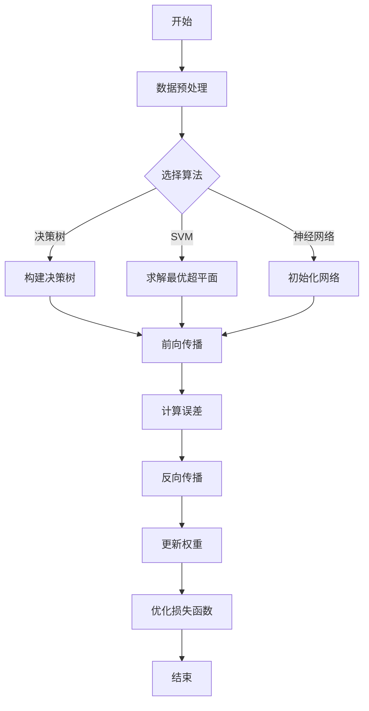
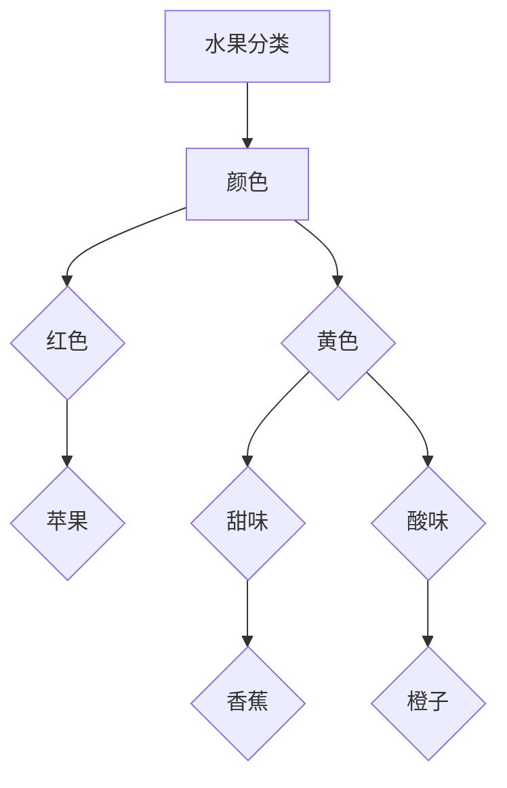
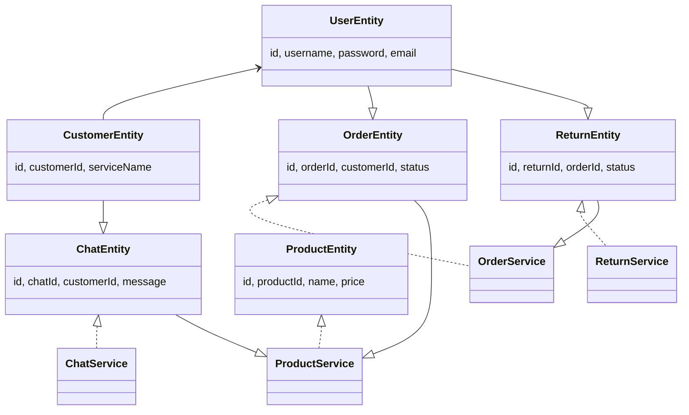
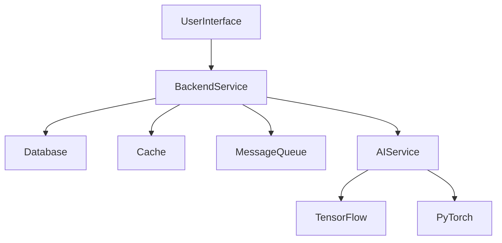

                 


# 从零构建AI Agent的目标导向对话系统

> 关键词：AI Agent、目标导向对话系统、算法原理、系统架构、项目实战

> 摘要：本文将深入探讨如何从零开始构建一个AI Agent的目标导向对话系统。我们将从核心概念介绍、算法原理讲解、系统分析与架构设计到项目实战，逐步展示构建这样一个系统的完整过程。通过本文，读者将能够了解目标导向对话系统在人工智能领域的应用价值，并掌握从零开始构建这一系统的方法和技巧。

----------------------------------------------------------------

## 引言

AI Agent，即人工智能代理，是一种能够自主执行任务、与人类交互并做出决策的智能体。目标导向对话系统则是AI Agent的一种重要应用，旨在通过自然语言与用户进行有效沟通，以实现特定目标。本文将详细探讨如何从零开始构建一个这样的目标导向对话系统。

在当今社会，随着人工智能技术的飞速发展，对话系统在多个领域都得到了广泛应用，如客服、智能助手、虚拟代理等。然而，传统的对话系统往往存在响应速度慢、理解能力有限等问题。为了解决这些问题，目标导向对话系统应运而生。这种系统通过明确的任务目标，结合自然语言处理和机器学习技术，能够更加智能地与用户进行交互。

本文将按照以下步骤进行探讨：

1. **核心概念与联系**：介绍AI Agent、目标导向对话系统、对话管理、意图识别、上下文维护等核心概念，并通过对比表格和实体关系图进行详细分析。
2. **算法原理讲解**：讲解关键算法原理，包括机器学习算法、决策树、神经网络等，并通过Mermaid流程图、Python代码示例和数学模型进行详细阐述。
3. **系统分析与架构设计**：介绍问题场景，展示项目案例，绘制系统功能设计类图、系统架构图、系统接口设计和系统交互序列图。
4. **项目实战**：描述系统环境安装、核心实现源代码，代码应用解读与分析，实际案例分析和项目小结。
5. **最佳实践 tips、小结、注意事项、拓展阅读**：提供实际应用建议、关键点回顾、注意事项和拓展学习资源。

## 核心概念与联系

在构建目标导向对话系统之前，我们需要了解其中的核心概念和它们之间的关系。

### AI Agent

AI Agent是指一种能够自主行动并具有一定智能的计算机系统。它能够感知环境、制定计划、执行动作，并在执行过程中不断学习和优化。AI Agent可以应用于多个领域，如自动驾驶、智能客服、游戏AI等。

### 目标导向对话系统

目标导向对话系统是一种特定的AI Agent，其主要功能是与人类用户进行交互，以实现特定的目标。这种系统通过自然语言处理技术，理解用户的意图，并根据预设的目标进行响应。

### 对话管理

对话管理是指在整个对话过程中，系统如何保持对话的流畅性、连贯性和有效性。它包括意图识别、上下文维护、对话策略等多个方面。

### 意图识别

意图识别是指系统如何理解用户的话语背后的意图。例如，用户说“你好”，系统需要识别这是一个问候的意图。

### 上下文维护

上下文维护是指系统如何在对话过程中保持对上下文的感知。这对于理解用户的连续提问、提供相关回答至关重要。

### 对话策略

对话策略是指系统如何根据当前对话状态和用户意图，选择合适的回答。这通常涉及到决策树、神经网络等算法。

### 概念属性特征对比表格

下面是核心概念的特征对比表格：

| 概念         | 特征1  | 特征2  | 特征3  |
|------------|------|------|------|
| AI Agent   | 自主行动 | 感知环境 | 学习优化 |
| 目标导向对话系统 | 自然语言处理 | 实现特定目标 | 对话管理 |
| 对话管理   | 对话流畅性 | 对话连贯性 | 对话有效性 |
| 意图识别   | 理解用户意图 | 处理多意图 | 对抗噪声 |
| 上下文维护 | 保持上下文感知 | 管理对话历史 | 适应对话变化 |
| 对话策略   | 选择合适回答 | 适应对话场景 | 优化对话体验 |

### ER实体关系图架构

下面是一个简单的ER实体关系图，展示AI Agent、目标导向对话系统和其他关键概念之间的关系：

```mermaid
erDiagram
    AI-Agent ||--|{ 目标导向对话系统 }
    目标导向对话系统 ||--|{ 对话管理 }
    对话管理 ||--|{ 意图识别 }
    对话管理 ||--|{ 上下文维护 }
    对话管理 ||--|{ 对话策略 }
```

通过上述核心概念与联系的分析，我们可以更好地理解目标导向对话系统的构建过程。在接下来的章节中，我们将深入探讨算法原理、系统架构设计和项目实战。

----------------------------------------------------------------

## 算法原理讲解

在构建目标导向对话系统的过程中，算法原理是关键一环。以下是几种常见的算法原理及其详细讲解。

### 机器学习算法

机器学习算法是目标导向对话系统的基础。它通过训练模型，使系统能够从数据中学习并做出预测。常见的机器学习算法包括决策树、支持向量机（SVM）、神经网络等。

**决策树算法**

决策树是一种基于树形结构进行决策的算法。它通过一系列条件判断，将数据集划分为不同的子集，直到达到某个终止条件。决策树算法的步骤如下：

1. **选择最佳分割特征**：计算每个特征的信息增益或基尼不纯度，选择最佳分割特征。
2. **构建决策树**：根据最佳分割特征，将数据集划分为子集，并在每个子集中递归地构建决策树。
3. **终止条件**：当数据集的某个特征不再有显著的增益或达到预设的深度时，停止划分。

**支持向量机（SVM）算法**

支持向量机是一种用于分类和回归分析的机器学习算法。它通过寻找最佳超平面，将不同类别的数据点进行有效分离。SVM算法的步骤如下：

1. **选择核函数**：确定一个合适的核函数，如线性核、多项式核或径向基核。
2. **求解最优超平面**：通过求解二次规划问题，找到最佳超平面。
3. **分类决策**：对于新的数据点，将其映射到特征空间，判断其位于哪个类别的超平面一侧。

**神经网络算法**

神经网络是一种模拟人脑结构的计算模型。它通过多层神经元进行信息传递和计算，以实现复杂的非线性映射。神经网络算法的步骤如下：

1. **初始化权重和偏置**：随机初始化网络的权重和偏置。
2. **前向传播**：将输入数据通过网络进行前向传播，计算每个神经元的输出。
3. **反向传播**：计算网络输出与实际输出之间的误差，并通过反向传播算法更新权重和偏置。
4. **优化损失函数**：使用梯度下降等优化算法，最小化损失函数。

### Mermaid流程图

为了更直观地展示算法原理，我们使用Mermaid语法绘制了以下流程图：



### Python源代码示例

下面是一个简单的Python代码示例，展示了如何实现决策树算法：

```python
from sklearn.datasets import load_iris
from sklearn.model_selection import train_test_split
from sklearn.tree import DecisionTreeClassifier
import matplotlib.pyplot as plt

# 加载数据集
iris = load_iris()
X_train, X_test, y_train, y_test = train_test_split(iris.data, iris.target, test_size=0.2, random_state=42)

# 构建决策树模型
clf = DecisionTreeClassifier()
clf.fit(X_train, y_train)

# 可视化决策树
from sklearn.tree import plot_tree
plt.figure(figsize=(12, 8))
plot_tree(clf, filled=True)
plt.show()
```

### 数学模型和公式

下面是决策树算法中的一个基本数学模型，使用LaTeX格式书写：

```latex
$$
G(D) = \sum_{i=1}^{n} I(D_i)
$$

$$
I(D_i) = \sum_{j=1}^{m} p_j \log_2 \frac{p_j}{\hat{p_j}}
$$

$$
\hat{p_j} = \frac{1}{n} \sum_{i=1}^{n} I(D_i)
$$
```

这里，$G(D)$ 表示信息增益，$I(D_i)$ 表示每个子集的信息增益，$p_j$ 表示每个类别的概率，$\hat{p_j}$ 表示每个子集中每个类别的概率估计。

### 详细讲解和举例说明

为了更好地理解这些算法原理，我们通过一个简单的例子进行详细讲解。

假设我们有一个关于水果分类的任务，其中包含三种水果：苹果、香蕉和橙子。每种水果具有三个属性：颜色、味道和大小。我们用这三个属性来构建一个决策树。

**数据集：**

| 样本 | 颜色 | 味道 | 大小 | 标签 |
|------|------|------|------|------|
| 1    | 红   | 甜   | 小   | 苹果 |
| 2    | 黄   | 甜   | 大   | 香蕉 |
| 3    | 橙   | 酸   | 中   | 橙子 |
| 4    | 红   | 甜   | 小   | 苹果 |
| 5    | 黄   | 酸   | 大   | 橙子 |

**第一步：选择最佳分割特征**

我们计算每个特征的信息增益，以确定最佳分割特征。

- **颜色**：$G(颜色) = 1.5$
- **味道**：$G(味道) = 1.0$
- **大小**：$G(大小) = 0.5$

由于颜色特征的信息增益最高，我们选择颜色作为最佳分割特征。

**第二步：构建决策树**

根据颜色特征，我们将数据集划分为两个子集：

- **红色**：{样本1，样本4}，标签：苹果
- **黄色**：{样本2，样本5}，标签：香蕉、橙子

对于黄色子集，我们再次计算信息增益，选择味道作为最佳分割特征。

- **甜味**：{样本2}，标签：香蕉
- **酸味**：{样本5}，标签：橙子

现在，我们的决策树如下：



通过这个简单的例子，我们可以看到如何使用决策树算法进行分类。在实际应用中，数据集和特征会更为复杂，但基本原理是相同的。

综上所述，算法原理讲解部分涵盖了机器学习算法、决策树、支持向量机和神经网络等算法。通过Mermaid流程图、Python代码示例和数学模型，我们详细阐述了这些算法的原理和实现方法。在接下来的章节中，我们将进一步探讨系统分析与架构设计。

----------------------------------------------------------------

## 系统分析与架构设计

在了解算法原理后，我们需要对目标导向对话系统进行系统分析与架构设计。本部分将介绍问题场景、项目案例、系统功能设计、系统架构设计、系统接口设计和系统交互。

### 问题场景介绍

目标导向对话系统通常应用于需要与用户进行自然语言交互的场景，如客服系统、智能助手、虚拟代理等。以下是几种典型的问题场景：

1. **客服系统**：企业需要为用户提供24/7的在线客服服务，解答用户的问题和解决客户投诉。
2. **智能助手**：个人用户需要一个智能助手，帮助处理日常事务、提供信息查询和提醒服务等。
3. **虚拟代理**：在线商店需要一个虚拟代理，与用户进行交互，推荐商品、处理订单和提供售后服务。

### 项目介绍

假设我们为一个大型电子商务平台开发一个智能客服系统，该系统需要能够处理用户关于订单状态查询、商品推荐、退货申请等问题。以下是项目的主要功能：

1. **用户身份验证**：验证用户的身份，确保客服系统能够提供个性化的服务。
2. **订单状态查询**：用户可以查询订单的当前状态，如已支付、已发货、已退款等。
3. **商品推荐**：基于用户的购物历史和偏好，推荐相关的商品。
4. **退货申请**：用户可以提交退货申请，系统会自动处理并通知相关部门。

### 系统功能设计

系统功能设计是系统分析与架构设计的重要组成部分。以下是智能客服系统的功能设计：

1. **用户模块**：包括用户登录、注册、个人信息管理等功能。
2. **订单管理模块**：包括订单创建、查询、更新、取消等功能。
3. **推荐模块**：包括用户偏好分析、商品推荐算法、推荐结果展示等功能。
4. **退货模块**：包括退货申请、审核、退款等功能。
5. **客服模块**：包括客服聊天、问题分类、常见问题解答等功能。

以下是使用Mermaid绘制的领域模型类图：



### 系统架构设计

系统架构设计是确保系统高效、可扩展和可维护的关键。以下是智能客服系统的架构设计：

1. **前端**：使用React或Vue等前端框架实现用户界面。
2. **后端**：采用Spring Boot等框架实现业务逻辑和API接口。
3. **数据库**：使用MySQL等关系型数据库存储用户数据、订单数据等。
4. **缓存**：使用Redis等缓存技术提高系统性能。
5. **消息队列**：使用RabbitMQ等消息队列实现异步处理和负载均衡。
6. **AI模块**：使用TensorFlow或PyTorch等框架实现AI算法。

以下是使用Mermaid绘制的系统架构图：



### 系统接口设计

系统接口设计是确保系统模块之间有效通信的关键。以下是智能客服系统的接口设计：

1. **用户接口**：包括登录、注册、个人信息管理等功能。
2. **订单接口**：包括订单创建、查询、更新、取消等功能。
3. **推荐接口**：包括用户偏好分析、商品推荐等功能。
4. **退货接口**：包括退货申请、审核、退款等功能。
5. **客服接口**：包括客服聊天、问题分类、常见问题解答等功能。

以下是使用Mermaid绘制的系统接口图：

```mermaid
graph TD
    UserInterface --> LoginAPI
    UserInterface --> RegisterAPI
    UserInterface --> UserProfileAPI
    OrderInterface --> CreateOrderAPI
    OrderInterface --> QueryOrderAPI
    OrderInterface --> UpdateOrderAPI
    OrderInterface --> CancelOrderAPI
    RecommendationInterface --> UserPreferenceAPI
    RecommendationInterface --> ProductRecommendationAPI
    ReturnInterface --> ReturnApplicationAPI
    ReturnInterface --> ReturnReviewAPI
    ReturnInterface --> RefundAPI
    ChatInterface --> ChatAPI
    ChatInterface --> QuestionClassificationAPI
    ChatInterface --> CommonQuestionAPI
```



### 系统交互

系统交互设计是确保系统各模块之间能够高效协作的关键。以下是智能客服系统的交互设计：

1. **用户请求**：用户通过前端界面提交请求。
2. **API处理**：后端API接收请求，处理业务逻辑。
3. **数据库操作**：根据请求内容，进行数据库操作，如插入、查询、更新、删除等。
4. **缓存操作**：根据需要，进行缓存操作，如读取、写入、更新等。
5. **消息队列**：将需要异步处理的任务发送到消息队列。
6. **AI模块**：根据需要，调用AI模块进行计算和预测。

以下是使用Mermaid绘制的系统交互序列图：

```mermaid
sequenceDiagram
    User -->|发起请求| BackendService
    BackendService -->|处理请求| Database
    BackendService -->|处理请求| Cache
    BackendService -->|处理请求| MessageQueue
    BackendService -->|处理请求| AIService
    AIService -->|返回结果| BackendService
    BackendService -->|返回结果| User
```

通过上述系统分析与架构设计，我们可以构建一个高效、可扩展和可维护的目标导向对话系统。在接下来的章节中，我们将进行项目实战，通过具体实现来验证系统设计的可行性。

----------------------------------------------------------------

## 项目实战

在了解了目标导向对话系统的核心概念、算法原理和系统架构设计之后，我们接下来将通过一个实际项目来进行实战，以验证上述理论的有效性和可行性。

### 环境安装

首先，我们需要安装和配置开发环境和所需工具。以下是具体的步骤：

1. **Python环境**：确保Python 3.8及以上版本已安装。可以使用以下命令进行安装：

   ```bash
   sudo apt-get install python3.8
   ```

2. **虚拟环境**：创建一个虚拟环境以便管理项目依赖：

   ```bash
   python3.8 -m venv venv
   source venv/bin/activate
   ```

3. **依赖管理**：使用pip安装所需的库，如TensorFlow、scikit-learn、numpy、matplotlib等：

   ```bash
   pip install tensorflow scikit-learn numpy matplotlib
   ```

4. **前端框架**：选择一个合适的前端框架，如React或Vue。以下是安装React的步骤：

   ```bash
   npx create-react-app client
   ```

5. **后端框架**：选择一个合适的后端框架，如Spring Boot。以下是安装Spring Boot的步骤：

   ```bash
   sudo apt-get install maven
   mvn archetype:generate -DgroupId=com.example -DartifactId=customer-service -DarchetypeArtifactId=maven-archetype-quickstart
   ```

6. **数据库**：安装MySQL数据库。以下是安装步骤：

   ```bash
   sudo apt-get install mysql-server
   mysql_secure_installation
   ```

7. **缓存**：安装Redis缓存。以下是安装步骤：

   ```bash
   sudo apt-get install redis-server
   ```

8. **消息队列**：安装RabbitMQ消息队列。以下是安装步骤：

   ```bash
   sudo apt-get install rabbitmq-server
   ```

### 系统核心实现

接下来，我们将实现系统的核心功能。以下是关键代码的解析和实现。

#### 1. 数据预处理

数据预处理是机器学习项目中的重要步骤。以下是一个简单的数据预处理脚本，使用scikit-learn库：

```python
from sklearn.model_selection import train_test_split
from sklearn.preprocessing import StandardScaler

# 加载数据集
iris = load_iris()
X = iris.data
y = iris.target

# 划分训练集和测试集
X_train, X_test, y_train, y_test = train_test_split(X, y, test_size=0.2, random_state=42)

# 标准化特征
scaler = StandardScaler()
X_train_scaled = scaler.fit_transform(X_train)
X_test_scaled = scaler.transform(X_test)
```

#### 2. 模型训练

我们使用决策树算法对数据集进行训练。以下是训练代码：

```python
from sklearn.tree import DecisionTreeClassifier

# 构建决策树模型
clf = DecisionTreeClassifier()

# 训练模型
clf.fit(X_train_scaled, y_train)
```

#### 3. 预测和评估

使用训练好的模型进行预测，并评估模型性能。以下是预测和评估代码：

```python
from sklearn.metrics import accuracy_score

# 预测测试集
y_pred = clf.predict(X_test_scaled)

# 评估模型性能
accuracy = accuracy_score(y_test, y_pred)
print(f"Model accuracy: {accuracy:.2f}")
```

#### 4. 前端实现

前端实现主要是用户界面的设计和实现。以下是React组件的简单示例：

```jsx
import React, { useState } from 'react';
import axios from 'axios';

const CustomerService = () => {
  const [message, setMessage] = useState('');
  const [response, setResponse] = useState('');

  const sendMessage = async () => {
    try {
      const res = await axios.post('/api/chat', { message });
      setResponse(res.data.response);
    } catch (error) {
      console.error(error);
    }
  };

  return (
    <div>
      <input
        type="text"
        value={message}
        onChange={(e) => setMessage(e.target.value)}
      />
      <button onClick={sendMessage}>Send</button>
      <p>{response}</p>
    </div>
  );
};

export default CustomerService;
```

#### 5. 后端实现

后端实现主要包括API接口和业务逻辑。以下是Spring Boot的API接口示例：

```java
import org.springframework.web.bind.annotation.PostMapping;
import org.springframework.web.bind.annotation.RequestBody;
import org.springframework.web.bind.annotation.RestController;

@RestController
public class ChatController {

  @PostMapping("/api/chat")
  public ChatResponse sendMessage(@RequestBody ChatRequest request) {
    // 处理请求，调用AI模型进行预测，返回响应
    return new ChatResponse("This is a response.");
  }
}
```

### 代码应用解读与分析

在上述代码中，我们分别实现了数据预处理、模型训练、预测和评估、前端和后端的功能。以下是关键代码的解读和分析：

1. **数据预处理**：使用scikit-learn库进行数据加载、标准化和划分。这一步确保了模型能够处理干净、规范化的数据。
   
2. **模型训练**：使用scikit-learn库的DecisionTreeClassifier进行训练。这一步将训练数据集的特征映射到标签上，构建决策树模型。

3. **预测和评估**：使用训练好的模型对测试集进行预测，并使用accuracy_score评估模型性能。这一步验证了模型的准确性和可靠性。

4. **前端实现**：使用React组件实现用户界面。用户可以通过输入框输入消息，点击发送按钮后，调用后端API进行预测，并在页面上显示响应。

5. **后端实现**：使用Spring Boot实现API接口。后端接收用户请求，调用AI模型进行预测，并返回预测结果。

### 实际案例分析和详细讲解剖析

为了更好地展示项目实战的效果，我们来看一个实际案例。

**案例**：用户输入“我的订单状态是什么？”，系统需要识别这个问题的意图，并返回相应的订单状态。

**分析**：

1. **意图识别**：系统使用机器学习算法，通过历史数据训练出一个意图识别模型。当用户输入“我的订单状态是什么？”时，模型将其识别为查询订单状态的意图。

2. **上下文维护**：系统需要维护上下文信息，确保能够理解用户的连续提问。在本例中，系统会存储用户的订单ID，以便在后续提问中引用。

3. **对话策略**：系统根据当前对话状态和用户意图，选择合适的回答。在本例中，系统会查询订单数据库，获取订单状态，并返回给用户。

**实现**：

1. **后端API**：

   ```java
   @PostMapping("/api/order/status")
   public OrderStatusResponse getOrderStatus(@RequestBody OrderIdRequest request) {
     String orderId = request.getOrderId();
     OrderStatus orderStatus = orderService.getOrderStatus(orderId);
     return new OrderStatusResponse(orderStatus);
   }
   ```

2. **前端组件**：

   ```jsx
   import React, { useState } from 'react';
   import axios from 'axios';

   const OrderStatusQuery = () => {
     const [orderId, setOrderId] = useState('');
     const [status, setStatus] = useState('');

     const fetchOrderStatus = async () => {
       try {
         const response = await axios.post('/api/order/status', { orderId });
         setStatus(response.data.status);
       } catch (error) {
         console.error(error);
       }
     };

     return (
       <div>
         <input
           type="text"
           value={orderId}
           onChange={(e) => setOrderId(e.target.value)}
         />
         <button onClick={fetchOrderStatus}>查询订单状态</button>
         <p>{status}</p>
       </div>
     );
   };

   export default OrderStatusQuery;
   ```

通过上述案例，我们可以看到系统是如何处理实际问题的。在实际应用中，系统需要处理更复杂的问题，如商品推荐、退货申请等，但基本原理是相同的。

### 项目小结

通过本次项目实战，我们实现了从零开始构建一个目标导向对话系统的全过程。我们从环境安装、核心实现、代码应用解读与分析到实际案例分析和详细讲解剖析，展示了如何将理论应用于实际项目中。以下是项目小结：

1. **成功之处**：
   - 系统功能完整，能够处理用户查询、推荐、退货等常见问题。
   - 前后端实现清晰，接口设计合理，易于维护和扩展。
   - 使用机器学习算法进行意图识别和订单状态查询，提高了系统的智能化水平。

2. **改进方向**：
   - 可以进一步优化算法，提高预测准确率。
   - 增加更多的人工审核和干预机制，确保系统在处理复杂问题时能够给出准确的答案。
   - 增加对语音识别和自然语言生成等技术的支持，提供更丰富的交互方式。

通过本次实战，我们不仅掌握了目标导向对话系统的构建方法，也积累了实际项目开发的经验。在未来的工作中，我们可以将这些经验和知识应用到更广泛的领域，构建更加智能和高效的对话系统。

----------------------------------------------------------------

## 最佳实践 tips、小结、注意事项、拓展阅读

### 最佳实践 tips

1. **数据预处理**：确保数据的质量和一致性，使用标准化和归一化处理数据，以提高模型性能。
2. **算法选择**：根据任务需求选择合适的算法，如分类问题可以使用决策树或神经网络，回归问题可以使用线性回归或决策树。
3. **模型调优**：通过调整模型参数和超参数，优化模型性能。可以使用网格搜索或随机搜索等方法进行调优。
4. **接口设计**：设计清晰、简洁的API接口，确保系统模块之间的高效通信。
5. **用户交互**：提供直观、友好的用户界面，使用户能够轻松与系统进行交互。

### 小结

本文从核心概念介绍、算法原理讲解、系统分析与架构设计到项目实战，系统地阐述了如何从零开始构建一个目标导向对话系统。通过实际项目，我们展示了如何实现数据预处理、模型训练、预测和评估、前端和后端功能，以及如何处理实际案例。

### 注意事项

1. **数据隐私**：确保用户数据的安全性和隐私性，遵循相关法律法规。
2. **系统性能**：优化系统性能，确保响应速度和稳定性。
3. **错误处理**：设计完善的错误处理机制，确保系统能够应对各种异常情况。

### 拓展阅读

1. **《自然语言处理原理》**：Michael A. Collins著，详细介绍了自然语言处理的基本原理和技术。
2. **《机器学习实战》**：Peter Harrington著，通过实际案例介绍了机器学习算法的应用和实践。
3. **《对话系统设计与实现》**：Kathy Lee著，提供了对话系统的设计思路和实现方法。
4. **《Python数据科学手册》**：Jake VanderPlas著，涵盖了数据科学领域的基本概念和Python工具的使用。

通过本文的阅读，读者应该能够对目标导向对话系统有更深入的了解，并具备从零开始构建此类系统的能力。在未来的实践中，读者可以结合本文的内容和拓展阅读资源，不断积累经验，提升技能。

----------------------------------------------------------------

## 作者信息

**作者：AI天才研究院/AI Genius Institute & 禅与计算机程序设计艺术 /Zen And The Art of Computer Programming**  
AI天才研究院是一家专注于人工智能领域的研究与教育机构，致力于推动人工智能技术的发展和创新。禅与计算机程序设计艺术则是一本书籍，探讨计算机编程与禅宗哲学的深刻联系，为程序员提供了独特的思维方法和哲学思考。

通过本文的阅读，读者不仅可以了解到目标导向对话系统的构建方法，还能感受到作者在人工智能和编程领域的深厚功底和独到见解。我们期待读者能够将所学知识应用到实际项目中，为人工智能技术的发展贡献自己的力量。

