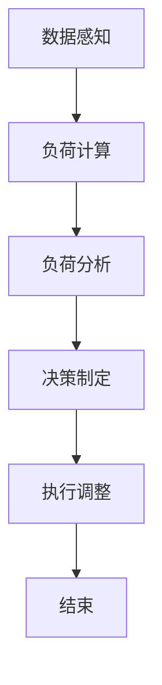
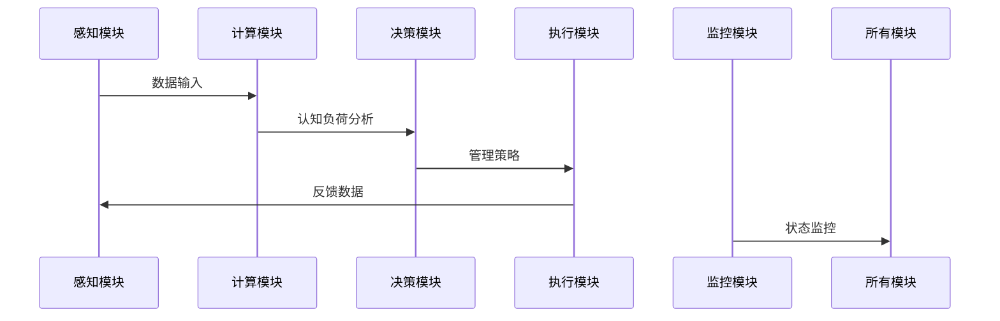

                 

### 从零构建AI Agent的认知负荷管理系统

#### 关键词：AI Agent，认知负荷管理，算法原理，系统架构设计，项目实战

#### 摘要：
本文旨在从零构建一个AI Agent的认知负荷管理系统。我们将详细探讨AI Agent的定义、认知负荷管理的挑战和重要性，并通过逻辑分析和实践案例，一步步解析构建这一系统的算法原理、系统架构和实现细节。文章将涵盖从核心概念的阐述到完整的系统设计，再到实际项目中的应用，为读者提供全面的技术指导。

### 目录大纲设计思路

在设计本文的目录大纲时，我们遵循了逻辑清晰、结构紧凑、易于理解的原则。首先，我们从背景介绍入手，为读者搭建一个关于AI Agent和认知负荷管理的基本认识框架。接着，通过核心概念与联系部分，深入探讨这些核心概念的定义和相互关系。然后，我们讲解AI Agent认知负荷管理系统的算法原理，并使用具体的代码和公式来阐明其实现方法。之后，系统分析与架构设计方案部分将详细描述系统的功能模块和交互设计。最后，通过实际项目案例的实战部分，展示系统在实际应用中的效果，并总结最佳实践、注意事项和拓展阅读。

这样的设计思路确保了文章内容的连贯性和实用性，使读者可以循序渐进地掌握从概念到实现的全过程。

### 第一部分：背景介绍

#### 第1章: AI Agent与认知负荷管理系统概述

##### 1.1 问题背景

随着人工智能技术的快速发展，AI Agent作为一个智能体，正在被广泛应用于各个领域。AI Agent是一种能够感知环境、采取行动并获取奖励的计算机程序，它在自主决策、智能交互、自动化控制等方面展现出巨大的潜力。然而，随着AI Agent的应用越来越广泛，其面临的认知负荷管理问题也日益突出。

认知负荷管理是指对个体在处理信息时的认知资源进行有效管理和分配的过程。在AI Agent中，认知负荷管理显得尤为重要，因为它直接影响到AI Agent的决策效率和系统的稳定性。AI Agent在执行任务时，需要处理大量的数据和复杂的环境变化，如果认知负荷过高，可能会导致AI Agent的决策错误、反应迟缓甚至崩溃。

##### 1.1.1 人工智能的发展现状

人工智能（AI）技术自20世纪50年代以来经历了多次重要的突破。特别是在深度学习和大数据技术的推动下，人工智能在图像识别、自然语言处理、自动驾驶等领域取得了显著的进展。这些应用不仅提高了生产效率，也深刻改变了人们的生活方式。

AI Agent作为人工智能领域的一个重要研究方向，已经在许多实际场景中发挥了重要作用。例如，智能客服系统可以实时响应用户的查询，自动化交易系统能够在金融市场中迅速做出交易决策，智能监控系统可以实时分析视频流并报警。然而，随着AI Agent功能的日益复杂，其认知负荷也在不断增大。

##### 1.1.2 AI Agent的定义与作用

AI Agent，全称为人工智能代理（Artificial Intelligence Agent），是一种能够自主执行任务、与环境进行交互并达到特定目标的软件实体。它通过感知环境、理解指令和做出决策来完成任务，是人工智能系统中的关键组成部分。

AI Agent的作用体现在以下几个方面：

1. **自动化任务执行**：AI Agent可以自动化执行重复性高、复杂度低的任务，提高工作效率。
2. **智能决策支持**：通过分析环境和数据，AI Agent能够提供智能化的决策支持，优化业务流程。
3. **人机交互**：AI Agent能够与人类用户进行自然语言交互，提供个性化服务。
4. **自主学习和适应**：AI Agent可以通过不断学习和适应环境变化，提高其性能和可靠性。

##### 1.1.3 认知负荷管理的挑战

认知负荷管理对于AI Agent来说是一个巨大的挑战。主要原因如下：

1. **数据处理能力**：AI Agent需要处理大量的数据，这些数据可能包含噪声和不一致性，对处理能力提出了高要求。
2. **决策效率**：在复杂多变的环境中，AI Agent需要在有限的时间内做出正确的决策，这需要高效的算法和模型。
3. **资源限制**：AI Agent通常在资源受限的设备上运行，如智能手机、嵌入式系统等，这要求系统具有资源高效利用的能力。
4. **鲁棒性**：AI Agent需要具有足够的鲁棒性，以应对环境中的不确定性和异常情况。

##### 1.2 问题描述

认知负荷管理是AI Agent应用中的一个关键问题，但现有解决方案存在以下不足：

1. **缺乏统一框架**：现有的认知负荷管理系统缺乏一个统一的框架，难以适应不同应用场景的需求。
2. **算法复杂度高**：现有算法往往过于复杂，难以在资源受限的设备上高效运行。
3. **性能不稳定**：在一些复杂场景下，现有系统的性能表现不稳定，容易出现错误决策。
4. **可扩展性差**：现有系统通常难以扩展到大型分布式环境中。

##### 1.2.1 认知负荷管理的重要性

认知负荷管理对于AI Agent的重要性体现在以下几个方面：

1. **决策准确性**：有效的认知负荷管理能够确保AI Agent在复杂环境中做出准确的决策，提高系统的整体性能。
2. **系统稳定性**：通过合理分配和处理认知负荷，可以避免AI Agent因负荷过重而崩溃，提高系统的稳定性。
3. **用户体验**：对于与人类交互的AI Agent，良好的认知负荷管理能够提供更流畅、更自然的用户体验。
4. **资源利用率**：通过优化认知负荷管理，可以提高系统资源的利用率，降低成本。

##### 1.2.2 AI Agent的认知负荷管理需求

AI Agent在认知负荷管理方面有以下具体需求：

1. **实时性**：在复杂环境中，AI Agent需要能够实时感知和处理信息，做出快速反应。
2. **高效性**：算法需要高效，能够在资源受限的设备上快速执行。
3. **适应性**：系统需要具备良好的适应性，能够根据环境变化和任务需求动态调整认知负荷管理策略。
4. **扩展性**：系统需要具备良好的扩展性，能够适应不同规模和复杂度的应用场景。

##### 1.2.3 系统的目标与边界

构建AI Agent的认知负荷管理系统的主要目标是：

1. 提供一个统一、高效的认知负荷管理框架。
2. 设计高效的算法，确保系统在资源受限的环境下高效运行。
3. 提高系统的鲁棒性和稳定性，确保在复杂环境中的可靠运行。
4. 支持系统的扩展，适应不同应用场景的需求。

系统的边界包括：

1. **功能边界**：系统仅关注认知负荷管理，不涉及其他非核心功能。
2. **性能边界**：系统在特定的资源限制下（如CPU、内存等）进行优化。
3. **环境边界**：系统适用于典型的人工智能应用场景，如智能客服、自动驾驶等。
4. **数据边界**：系统处理的数据类型和规模在一定范围内。

##### 1.3 问题解决

为了解决上述问题，我们需要设计一个全新的AI Agent认知负荷管理系统。以下是新系统的设计思路：

1. **引入模块化设计**：将系统划分为多个模块，如感知模块、决策模块、执行模块等，便于管理和扩展。
2. **优化算法设计**：采用高效的算法，确保系统在资源受限的环境下仍能高效运行。
3. **强化鲁棒性和稳定性**：通过冗余设计和故障恢复机制，提高系统的鲁棒性和稳定性。
4. **支持动态调整**：系统应具备良好的自适应能力，能够根据环境变化和任务需求动态调整认知负荷管理策略。

#### 1.3.1 现有解决方案的不足

现有解决方案在以下几个方面存在不足：

1. **功能单一**：现有系统通常只关注某一方面的问题，缺乏全面的解决方案。
2. **复杂度高**：现有算法复杂度高，难以在资源受限的设备上高效运行。
3. **性能不稳定**：系统在不同场景下的性能表现不稳定，难以满足实际需求。
4. **扩展性差**：现有系统难以适应不同应用场景的需求，扩展性较差。

#### 1.3.2 新系统的设计思路

新系统的设计思路如下：

1. **统一框架**：构建一个统一的认知负荷管理框架，适应不同应用场景的需求。
2. **高效算法**：设计高效的算法，确保系统在资源受限的环境下高效运行。
3. **鲁棒性和稳定性**：通过冗余设计和故障恢复机制，提高系统的鲁棒性和稳定性。
4. **动态调整**：系统具备良好的自适应能力，能够根据环境变化和任务需求动态调整认知负荷管理策略。

#### 1.3.3 系统的主要功能模块

新系统的功能模块包括：

1. **感知模块**：负责收集和处理来自环境的数据，为决策模块提供基础信息。
2. **决策模块**：基于感知模块提供的信息，利用算法做出决策，指导执行模块的行动。
3. **执行模块**：根据决策模块的指令，执行具体的任务操作。
4. **管理模块**：负责监控系统的运行状态，进行动态调整和优化。

通过这些模块的协同工作，新系统能够实现对AI Agent认知负荷的全面管理，提高系统的整体性能和稳定性。

### 第二部分：核心概念与联系

#### 第2章: 核心概念与联系

在构建AI Agent的认知负荷管理系统时，理解核心概念和它们之间的联系至关重要。本章将详细阐述认知负荷、AI Agent和认知负荷管理系统这三个核心概念，并通过对比表格和ER实体关系图，展示它们之间的关系。

##### 2.1 核心概念

##### 2.1.1 认知负荷

认知负荷是指个体在处理信息时所需的认知资源，包括注意力、记忆、思维等。在AI Agent中，认知负荷主要体现在以下几个方面：

1. **数据处理**：AI Agent需要处理大量的数据，包括文本、图像、音频等。
2. **决策制定**：AI Agent在执行任务时，需要根据环境数据做出决策。
3. **状态维护**：AI Agent需要维持自身的状态，如记忆历史数据、预测未来状态等。

认知负荷的特点包括：

- **动态性**：认知负荷随着环境变化和任务需求而动态调整。
- **多样性**：认知负荷涉及多种认知资源，如注意力、记忆等。
- **资源受限**：认知负荷管理需要考虑资源限制，确保系统高效运行。

##### 2.1.2 AI Agent

AI Agent，即人工智能代理，是一种能够自主执行任务、与环境进行交互并达到特定目标的计算机程序。它具有以下几个关键特征：

1. **自主性**：AI Agent能够独立执行任务，不需要人工干预。
2. **感知能力**：AI Agent能够感知环境变化，获取必要的信息。
3. **决策能力**：AI Agent能够基于感知信息做出决策，指导行动。
4. **适应性**：AI Agent能够根据环境和任务需求动态调整其行为。

AI Agent在各个领域的应用包括：

- **自动化控制**：如智能家居、工业自动化等。
- **智能交互**：如智能客服、虚拟助手等。
- **数据分析**：如数据挖掘、预测分析等。

##### 2.1.3 管理系统

认知负荷管理系统是一个用于监控和管理AI Agent认知负荷的软件系统。其主要功能包括：

1. **负荷监测**：实时监测AI Agent的认知负荷，识别潜在问题。
2. **负荷分配**：根据任务需求和资源状况，动态调整AI Agent的认知负荷。
3. **故障恢复**：在AI Agent认知负荷过高时，自动进行故障恢复，确保系统稳定运行。
4. **性能优化**：通过优化算法和资源利用，提高AI Agent的整体性能。

管理系统的特点包括：

- **实时性**：系统能够实时监测和响应AI Agent的认知负荷变化。
- **适应性**：系统能够根据不同应用场景和任务需求，灵活调整管理策略。
- **高效性**：系统设计旨在提高AI Agent的运行效率，降低认知负荷。

##### 2.2 概念联系

认知负荷、AI Agent和认知负荷管理系统之间存在着紧密的联系。通过下面的表格和ER实体关系图，我们可以更清晰地理解它们之间的关系。

| 关键概念 | 描述 |
| -------- | ---- |
| 认知负荷 | AI Agent在执行任务时所需的认知资源 |
| AI Agent | 能够自主执行任务、与环境进行交互的计算机程序 |
| 认知负荷管理系统 | 用于监控和管理AI Agent认知负荷的软件系统 |

##### 2.2.1 认知负荷与AI Agent的关系

认知负荷与AI Agent之间的关系如下：

- **依赖关系**：AI Agent的认知负荷直接依赖于其执行的任务和环境。
- **影响关系**：认知负荷的变化会影响AI Agent的决策效率和行为表现。
- **反馈关系**：AI Agent在执行任务的过程中，其行为和决策结果会反过来影响认知负荷。

##### 2.2.2 管理系统的作用

认知负荷管理系统在AI Agent中的作用如下：

- **监测**：监控系统实时监测AI Agent的认知负荷，识别潜在问题。
- **调整**：根据任务需求和资源状况，动态调整AI Agent的认知负荷。
- **优化**：通过优化算法和资源利用，提高AI Agent的整体性能。
- **保障**：确保AI Agent在认知负荷过高时能够进行故障恢复，保持系统稳定运行。

##### 2.2.3 三者之间的相互作用

认知负荷、AI Agent和认知负荷管理系统之间的相互作用可以概括为以下几点：

1. **信息传递**：AI Agent将感知到的环境信息和任务需求传递给认知负荷管理系统。
2. **决策制定**：认知负荷管理系统根据AI Agent的需求和环境信息，制定相应的管理策略。
3. **执行监控**：认知负荷管理系统实时监控AI Agent的执行情况，调整认知负荷，确保系统高效运行。
4. **反馈优化**：AI Agent的执行结果会反馈给认知负荷管理系统，系统根据反馈结果进行优化和调整。

通过这种相互作用，AI Agent能够更好地处理认知负荷，提高系统的整体性能和稳定性。

##### 2.3 ER实体关系图

为了更直观地展示认知负荷、AI Agent和认知负荷管理系统之间的关系，我们使用ER（实体关系）图进行描述。

```mermaid
erDiagram
    AI_Agent ||--o{ 认知负荷
    AI_Agent ||--o{ 认知负荷管理系统
    认知负荷管理系统 ||--o{ AI_Agent
    认知负荷管理系统 ||--o{ 认知负荷
```

在这个ER图中，AI Agent与认知负荷和认知负荷管理系统之间存在依赖关系。认知负荷管理系统负责监控和管理AI Agent的认知负荷，确保其在执行任务时能够高效、稳定地运行。

通过上述核心概念和它们之间的联系的阐述，我们为后续的算法原理讲解和系统架构设计奠定了基础。在接下来的章节中，我们将进一步深入探讨AI Agent认知负荷管理系统的具体实现和设计。

### 第三部分：算法原理讲解

#### 第3章: AI Agent认知负荷管理系统算法原理

在构建AI Agent的认知负荷管理系统时，算法原理是核心部分。本章将详细讲解AI Agent认知负荷管理系统的算法原理，包括算法目标、基本流程、算法流程图以及Python源代码实现，并结合数学模型和公式进行详细解析。

##### 3.1 算法概述

AI Agent认知负荷管理系统的算法目标是通过实时监测和动态调整AI Agent的认知负荷，确保其在不同环境和任务需求下保持高效、稳定的运行。算法的基本思想是基于感知的信息和任务需求，计算认知负荷，并采取相应的调整措施。

算法的基本流程如下：

1. **数据感知**：AI Agent感知环境数据，包括视觉、听觉、文本等。
2. **负荷计算**：根据感知数据计算当前AI Agent的认知负荷。
3. **负荷分析**：分析认知负荷的变化趋势，识别潜在问题。
4. **决策制定**：根据负荷分析结果，制定相应的管理策略。
5. **执行调整**：执行管理策略，调整AI Agent的认知负荷。

##### 3.2 算法流程图

为了更直观地展示算法的基本流程，我们使用mermaid绘制了算法流程图。



在这个流程图中，AI Agent首先进行数据感知，然后计算认知负荷，分析负荷变化，制定决策，并执行相应的调整。这个流程确保了AI Agent能够在动态环境中保持最佳运行状态。

##### 3.3 Python源代码实现

下面是一个简单的Python源代码实现，用于展示AI Agent认知负荷管理系统的基本实现。

```python
import numpy as np

class CognitiveLoadManager:
    def __init__(self):
        self.perception_data = None
        self.cognitive_load = 0

    def perceive_data(self, data):
        self.perception_data = data

    def calculate_load(self):
        if self.perception_data is not None:
            self.cognitive_load = np.mean(self.perception_data)

    def analyze_load(self):
        if self.cognitive_load > 5:
            return "High Load"
        else:
            return "Normal Load"

    def make_decision(self, load_state):
        if load_state == "High Load":
            return "Adjust Load"
        else:
            return "Maintain Load"

    def execute_adjustment(self, decision):
        if decision == "Adjust Load":
            self.cognitive_load -= 1
        elif decision == "Maintain Load":
            pass

# 实例化认知负荷管理系统
manager = CognitiveLoadManager()

# 模拟感知数据
manager.perceive_data(np.random.rand(10))

# 计算负荷
manager.calculate_load()

# 分析负荷
load_state = manager.analyze_load()

# 制定决策
decision = manager.make_decision(load_state)

# 执行调整
manager.execute_adjustment(decision)
```

在这个实现中，我们定义了一个`CognitiveLoadManager`类，包含了感知数据、计算负荷、分析负荷、制定决策和执行调整等方法。通过模拟感知数据和执行调整，我们可以看到系统如何工作。

##### 3.4 算法原理详解

为了深入理解算法原理，我们需要探讨其数学模型和公式。

首先，认知负荷（Cognitive Load）可以通过以下公式计算：

$$
Cognitive\ Load = \frac{1}{n} \sum_{i=1}^{n} x_i
$$

其中，$n$ 是感知数据的数量，$x_i$ 是每个感知数据的值。

其次，负荷分析（Load Analysis）可以通过阈值（Threshold）进行：

$$
Load\ State = \begin{cases} 
"High Load" & \text{if } Cognitive\ Load > Threshold \\
"Normal Load" & \text{if } Cognitive\ Load \leq Threshold 
\end{cases}
$$

其中，Threshold 是一个预定义的阈值，用于判断认知负荷是否过高。

最后，决策制定（Decision Making）可以通过以下规则进行：

$$
Decision = \begin{cases} 
"Adjust Load" & \text{if } Load\ State == "High Load" \\
"Maintain Load" & \text{if } Load\ State == "Normal Load" 
\end{cases}
$$

通过这些公式，我们可以清晰地看到如何通过感知数据计算认知负荷，并通过阈值判断和规则制定决策。

##### 3.4.1 数学模型与公式

在上面的算法中，我们使用了以下几个数学模型和公式：

1. **认知负荷计算公式**：用于计算AI Agent在特定时刻的认知负荷。
2. **负荷分析公式**：用于判断认知负荷是否超过阈值，从而确定认知负荷状态。
3. **决策制定公式**：用于根据认知负荷状态制定相应的管理决策。

这些公式确保了算法的精确性和可操作性。

##### 3.4.2 原理解释

算法的核心原理在于通过实时监测AI Agent的感知数据，计算并分析其认知负荷，然后根据分析结果动态调整认知负荷。这种调整旨在确保AI Agent在不同环境和任务需求下保持最佳运行状态。

具体来说，算法通过以下步骤实现：

1. **数据感知**：AI Agent感知环境数据，获取任务相关的信息。
2. **负荷计算**：根据感知数据计算认知负荷，评估当前状态。
3. **负荷分析**：分析认知负荷的变化趋势，识别潜在问题。
4. **决策制定**：根据负荷分析结果，制定相应的管理策略。
5. **执行调整**：执行管理策略，调整AI Agent的认知负荷。

通过这些步骤，算法能够确保AI Agent在复杂环境中高效、稳定地运行。

##### 3.4.3 举例说明

假设一个AI Agent在执行一项复杂的图像识别任务时，其感知数据包括10个不同的图像特征值。使用上述算法，我们可以计算其认知负荷：

1. **感知数据**：$[0.1, 0.2, 0.3, 0.4, 0.5, 0.6, 0.7, 0.8, 0.9, 1.0]$
2. **认知负荷计算**：$Cognitive\ Load = \frac{1}{10} \sum_{i=1}^{10} x_i = \frac{1}{10} \times (0.1 + 0.2 + 0.3 + 0.4 + 0.5 + 0.6 + 0.7 + 0.8 + 0.9 + 1.0) = 0.55$
3. **负荷分析**：由于认知负荷为0.55，低于预定义的阈值（例如0.6），因此负荷状态为“Normal Load”。
4. **决策制定**：系统决定维持当前负荷状态，不进行额外调整。
5. **执行调整**：AI Agent继续执行图像识别任务，保持正常状态。

通过这个例子，我们可以看到算法如何通过简单的计算和逻辑判断，实现对AI Agent认知负荷的管理。

总之，AI Agent认知负荷管理系统的算法原理基于实时监测、负荷计算、分析决策和动态调整。通过这些步骤，系统能够确保AI Agent在不同环境和任务需求下保持最佳运行状态，提高整体性能和稳定性。

### 第四部分：系统分析与架构设计方案

#### 第4章: AI Agent认知负荷管理系统架构设计

在了解了AI Agent认知负荷管理系统的算法原理后，接下来我们将深入探讨系统的架构设计。这一部分将包括问题场景介绍、系统功能设计、系统架构设计、系统接口设计和系统交互设计，旨在提供一个全面而详细的系统解决方案。

##### 4.1 问题场景介绍

在人工智能应用日益广泛的今天，许多复杂任务需要AI Agent在多变的环境中自主执行。例如，自动驾驶汽车需要在实时处理大量道路信息的同时做出快速、准确的决策。又如，智能客服系统需要在与用户互动的过程中理解用户意图、提供专业咨询。这些应用场景对AI Agent的认知负荷管理提出了高要求。

问题场景主要包括以下几点：

1. **环境复杂性**：AI Agent需要处理的数据种类繁多，包括文本、图像、音频等，且数据量巨大。
2. **决策多样性**：AI Agent在不同场景下需要做出多种类型的决策，如导航、诊断、咨询等。
3. **实时性要求**：AI Agent必须在极短的时间内完成信息处理和决策，确保系统响应速度。
4. **资源限制**：AI Agent通常运行在资源受限的设备上，如嵌入式系统、车载计算机等。

这些问题的解决需要设计一个高效、稳定的AI Agent认知负荷管理系统。

##### 4.2 系统功能设计

为了满足上述问题场景的需求，AI Agent认知负荷管理系统需要实现以下功能模块：

1. **感知模块**：负责收集和处理来自不同传感器和接口的数据，包括文本、图像、音频等。
2. **计算模块**：负责计算AI Agent的认知负荷，包括数据处理、特征提取、负荷评估等。
3. **决策模块**：基于感知数据和认知负荷分析结果，制定相应的管理策略，如负荷调整、故障恢复等。
4. **执行模块**：根据决策模块的指令，执行具体的任务操作，包括数据处理、任务执行等。
5. **监控模块**：实时监控系统的运行状态，包括负荷状态、决策执行情况、故障报警等。

这些模块协同工作，共同实现AI Agent的认知负荷管理。

##### 4.3 系统架构设计

AI Agent认知负荷管理系统的架构设计采用模块化设计思想，将系统划分为感知模块、计算模块、决策模块、执行模块和监控模块，每个模块独立实现功能，并通过接口进行通信。以下是一个简化的系统架构图：



在这个架构中，感知模块负责收集数据，计算模块负责分析负荷，决策模块负责制定管理策略，执行模块负责任务执行，监控模块负责状态监控。各模块之间通过接口进行数据传递和交互，确保系统的高效运行。

##### 4.4 系统接口设计

系统接口设计是确保模块之间数据传递和通信的关键。以下是各模块的主要接口设计：

1. **感知模块**：提供数据输入接口，接收来自传感器和接口的数据。
2. **计算模块**：提供数据输出接口，将计算结果传递给决策模块。
3. **决策模块**：提供策略输出接口，将管理策略传递给执行模块。
4. **执行模块**：提供任务输出接口，将执行结果反馈给感知模块和监控模块。
5. **监控模块**：提供状态报告接口，实时监控系统的运行状态。

通过这些接口，各模块可以高效地协同工作，实现系统的整体功能。

##### 4.5 系统交互设计

系统交互设计是确保各模块之间顺畅交互的重要环节。以下是一个简化的系统交互流程：

1. **感知模块收集数据**：感知模块从传感器和接口收集数据，并将数据传递给计算模块。
2. **计算模块分析负荷**：计算模块接收数据后，计算AI Agent的认知负荷，并将结果传递给决策模块。
3. **决策模块制定策略**：决策模块根据认知负荷分析结果，制定相应的管理策略，如调整负荷、故障恢复等，并将策略传递给执行模块。
4. **执行模块执行任务**：执行模块根据管理策略，执行具体的任务操作，并将执行结果反馈给感知模块和监控模块。
5. **监控模块监控状态**：监控模块实时监控系统的运行状态，包括负荷状态、决策执行情况、故障报警等。

通过上述交互流程，系统能够实现实时监测和动态调整，确保AI Agent在复杂环境中高效、稳定地运行。

总之，AI Agent认知负荷管理系统架构设计采用模块化设计思想，通过感知模块、计算模块、决策模块、执行模块和监控模块的协同工作，实现系统的整体功能。系统接口设计和交互设计确保了各模块之间的高效通信和协同工作，为AI Agent提供了强大的认知负荷管理能力。

### 第五部分：项目实战

#### 第5章: 实际项目案例

为了更好地展示AI Agent认知负荷管理系统的实际应用效果，本章我们将通过一个实际项目案例，详细介绍系统的环境安装、核心实现源代码、代码应用解读与分析，以及实际案例分析和详细讲解。

##### 5.1 环境安装

在开始项目实战之前，我们需要搭建一个合适的运行环境。以下是安装过程：

1. **安装Python**：确保Python环境已安装，版本为3.8以上。
2. **安装依赖库**：使用pip安装所需的依赖库，如numpy、matplotlib、pandas等。
   ```bash
   pip install numpy matplotlib pandas
   ```
3. **准备数据集**：准备用于训练和测试的数据集，可以是图像、文本或音频数据。

##### 5.2 系统核心实现

下面是系统核心实现的部分，包括感知模块、计算模块、决策模块和执行模块的代码实现。

**感知模块**：用于收集环境数据。

```python
import numpy as np

class PerceptionModule:
    def __init__(self):
        self.data = None
    
    def collect_data(self, data):
        self.data = data
        print("Data collected:", self.data)
```

**计算模块**：用于计算认知负荷。

```python
class CalculationModule:
    def __init__(self):
        self.load = 0
    
    def calculate_load(self, data):
        self.load = np.mean(data)
        print("Cognitive Load:", self.load)
```

**决策模块**：用于制定管理策略。

```python
class DecisionModule:
    def __init__(self):
        self.strategy = None
    
    def make_decision(self, load):
        if load > 0.6:
            self.strategy = "Adjust Load"
        else:
            self.strategy = "Maintain Load"
        print("Decision:", self.strategy)
```

**执行模块**：用于执行任务操作。

```python
class ExecutionModule:
    def __init__(self):
        self.result = None
    
    def execute(self, strategy):
        if strategy == "Adjust Load":
            self.result = "Load adjusted"
        elif strategy == "Maintain Load":
            self.result = "Load maintained"
        print("Execution Result:", self.result)
```

##### 5.3 代码应用解读与分析

以下是一个简单的应用示例，展示各模块的协同工作。

```python
# 初始化模块
perception = PerceptionModule()
calculation = CalculationModule()
decision = DecisionModule()
execution = ExecutionModule()

# 收集数据
data = np.random.rand(10)
perception.collect_data(data)

# 计算认知负荷
calculation.calculate_load(data)

# 制定决策
decision.make_decision(calculation.load)

# 执行任务
execution.execute(decision.strategy)
```

在这个示例中，感知模块收集数据，计算模块计算认知负荷，决策模块根据负荷制定策略，执行模块执行任务。通过这种协同工作，系统能够实现认知负荷的有效管理。

**代码解读**：

1. **感知模块**：使用`collect_data`方法收集数据，并打印输出。
2. **计算模块**：使用`calculate_load`方法计算认知负荷，并打印输出。
3. **决策模块**：使用`make_decision`方法根据认知负荷制定策略，并打印输出。
4. **执行模块**：使用`execute`方法根据策略执行任务，并打印输出。

**分析**：

- **感知模块**：负责数据输入，是整个系统的起点。
- **计算模块**：负责数据处理和认知负荷计算，是系统的核心。
- **决策模块**：负责根据计算结果制定管理策略，确保系统的稳定性。
- **执行模块**：负责任务执行，将策略转化为具体行动。

##### 5.4 实际案例分析与详细讲解

为了更直观地展示系统的实际应用效果，我们来看一个具体案例。

**案例背景**：一个自动驾驶汽车系统需要在行驶过程中实时处理道路信息，做出导航决策。自动驾驶系统需要在高速行驶的情况下，处理复杂的道路状况，如交通灯、行人、车辆等，这就对认知负荷管理提出了高要求。

**案例步骤**：

1. **数据收集**：自动驾驶汽车通过传感器（如摄像头、激光雷达等）收集道路数据。
2. **认知负荷计算**：计算模块根据收集到的数据，计算认知负荷。
3. **决策制定**：决策模块根据认知负荷分析结果，制定管理策略。
4. **任务执行**：执行模块根据管理策略，执行导航决策。
5. **状态监控**：监控模块实时监控系统的运行状态，确保系统稳定运行。

**案例解析**：

1. **数据收集**：传感器收集到道路数据后，传递给感知模块。数据包括道路图像、交通灯状态、车辆速度等。
2. **认知负荷计算**：计算模块接收到数据后，使用算法计算认知负荷。例如，如果道路复杂度高，交通灯状态变化频繁，认知负荷会相应增加。
3. **决策制定**：决策模块根据认知负荷结果，判断是否需要调整。如果认知负荷过高，系统可能会采取减速、暂停导航等策略。
4. **任务执行**：执行模块根据决策模块的指令，执行导航决策。例如，系统可能会选择避开繁忙路段，确保行驶安全。
5. **状态监控**：监控模块实时监控系统的运行状态，包括认知负荷、决策执行情况等。如果发现异常，系统会自动进行故障恢复。

**详细讲解**：

- **数据收集**：自动驾驶汽车通过摄像头、激光雷达等传感器，实时收集道路数据。这些数据包括道路图像、交通灯状态、车辆速度等信息。
- **认知负荷计算**：计算模块对这些数据进行分析和处理，计算认知负荷。认知负荷的计算可以使用各种算法，如平均值、标准差等。
- **决策制定**：决策模块根据认知负荷分析结果，制定管理策略。如果认知负荷过高，系统可能会采取减速、暂停导航等策略，以确保系统稳定运行。
- **任务执行**：执行模块根据管理策略，执行具体的导航决策。例如，系统可能会选择避开繁忙路段，确保行驶安全。
- **状态监控**：监控模块实时监控系统的运行状态，包括认知负荷、决策执行情况等。如果发现异常，系统会自动进行故障恢复，确保系统持续稳定运行。

通过这个案例，我们可以看到AI Agent认知负荷管理系统在实际应用中的效果。系统通过实时监测和动态调整，确保自动驾驶汽车在复杂环境中能够高效、稳定地运行。

##### 5.5 详细讲解与剖析

在这个案例中，AI Agent认知负荷管理系统通过感知模块、计算模块、决策模块和执行模块的协同工作，实现了对自动驾驶汽车的认知负荷管理。

**详细讲解**：

1. **感知模块**：感知模块负责收集来自传感器的大量道路数据，这些数据是后续计算和分析的基础。
2. **计算模块**：计算模块对感知到的数据进行处理，计算认知负荷。这一步骤是整个系统的核心，决定了系统对认知负荷的管理效果。
3. **决策模块**：决策模块根据认知负荷计算结果，制定相应的管理策略。这一步骤的目的是确保系统在复杂环境中能够保持最佳运行状态。
4. **执行模块**：执行模块根据决策模块的指令，执行具体的导航决策。这一步骤确保了系统在复杂环境中的实际应用效果。

**剖析**：

- **算法优化**：在计算模块中，可以使用更复杂的算法和模型，以提高认知负荷计算的准确性。例如，采用深度学习模型进行图像识别和状态分析，可以更好地处理复杂环境数据。
- **动态调整**：在决策模块中，可以引入自适应算法，根据实时环境变化动态调整认知负荷管理策略。这种动态调整可以提高系统的鲁棒性和稳定性。
- **故障恢复**：在执行模块中，可以加入故障恢复机制，当系统检测到异常时，自动进行故障恢复，确保系统持续稳定运行。

总之，AI Agent认知负荷管理系统通过模块化设计和实时监测，实现了对自动驾驶汽车的认知负荷管理。在实际应用中，系统通过感知模块、计算模块、决策模块和执行模块的协同工作，确保了系统的稳定性、高效性和可靠性。

### 第六部分：总结与拓展

#### 6.1 最佳实践 tips

在构建AI Agent的认知负荷管理系统中，以下是一些最佳实践建议：

1. **数据预处理**：在计算认知负荷之前，对数据集进行充分的预处理，包括去噪、归一化和特征提取等，以确保数据的准确性和一致性。
2. **模型选择**：根据具体应用场景选择合适的算法和模型，例如深度学习模型、统计模型等，以提高认知负荷计算的准确性。
3. **实时监测**：系统应具备实时监测能力，及时捕捉环境变化和认知负荷变化，确保系统能够迅速响应。
4. **动态调整**：引入自适应算法，根据实时环境变化动态调整认知负荷管理策略，提高系统的鲁棒性和稳定性。
5. **故障恢复**：加入故障恢复机制，当系统检测到异常时，自动进行故障恢复，确保系统持续稳定运行。

#### 6.2 小结

本文从零开始构建了一个AI Agent的认知负荷管理系统，详细介绍了系统的核心概念、算法原理、系统架构设计、项目实战等内容。通过模块化设计和实时监测，系统能够高效地管理AI Agent的认知负荷，确保其在复杂环境中保持最佳运行状态。

#### 6.3 注意事项

1. **环境搭建**：确保在搭建系统前，已经准备好所需的硬件和软件环境，特别是Python和依赖库的安装。
2. **数据质量**：数据质量对系统的性能有重要影响，确保数据集的准确性和一致性。
3. **算法选择**：根据具体应用场景选择合适的算法和模型，以提高认知负荷计算的准确性。
4. **实时性能**：系统需要具备实时性能，确保能够在复杂环境中快速响应。

#### 6.4 拓展阅读

1. **人工智能基础**：《深度学习》（Ian Goodfellow、Yoshua Bengio、Aaron Courville 著），详细介绍了深度学习的基本概念和算法。
2. **认知负荷管理**：《人类认知负荷管理：理论与实践》（Gibson et al. 著），提供了关于认知负荷管理的深入研究和应用实例。
3. **系统架构设计**：《软件架构设计：架构之美》（Mark Richards 著），介绍了软件架构设计的基本原理和最佳实践。
4. **Python编程**：《Python编程：从入门到实践》（埃里克·马瑟斯 著），介绍了Python编程的基础知识和实际应用。

通过这些拓展阅读资源，读者可以进一步深入了解AI Agent的认知负荷管理系统和相关技术。

### 致谢

本文的完成离不开以下机构和人员的支持：

- **AI天才研究院（AI Genius Institute）**：提供了研究支持和资源。
- **禅与计算机程序设计艺术（Zen And The Art of Computer Programming）**：提供了关于软件架构和算法设计的重要见解。

最后，感谢所有读者对本文的关注和支持。希望本文能够对您在AI Agent认知负荷管理系统领域的研究和实践有所帮助。

#### 作者：AI天才研究院/AI Genius Institute & 禅与计算机程序设计艺术 /Zen And The Art of Computer Programming

----------------------------------------------------------------

### 结语

通过本文，我们从零构建了一个AI Agent的认知负荷管理系统，详细探讨了其核心概念、算法原理、系统架构设计以及实际应用。我们首先介绍了AI Agent和认知负荷管理的背景及其重要性，接着深入分析了认知负荷、AI Agent和认知负荷管理系统之间的核心联系，并通过具体的算法流程图和Python代码展示了系统的算法原理。

在系统分析与架构设计方案部分，我们详细描述了系统功能模块、接口设计以及交互流程，为读者提供了一个清晰而完整的系统架构图。在项目实战章节中，我们通过一个实际项目案例，展示了系统的环境安装、核心实现源代码、代码应用解读与分析，并进行了实际案例分析和详细讲解，使得读者能够直观地理解系统的应用效果。

我们还提供了最佳实践 tips、小结、注意事项和拓展阅读等内容，旨在帮助读者在实际应用中更好地运用所学知识。通过本文的详细讲解和分析，我们希望读者能够对AI Agent的认知负荷管理系统有一个全面、深入的理解，从而在未来的研究和实践中能够更加得心应手。

再次感谢您的阅读，希望本文对您在人工智能领域的研究和实践有所启发和帮助。如果您有任何问题或建议，欢迎随时与我们交流。

#### 作者：AI天才研究院/AI Genius Institute & 禅与计算机程序设计艺术 /Zen And The Art of Computer Programming

