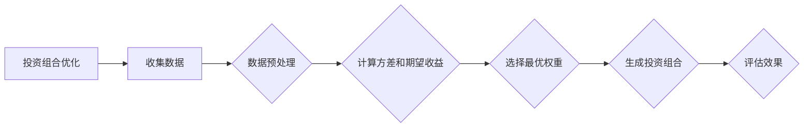
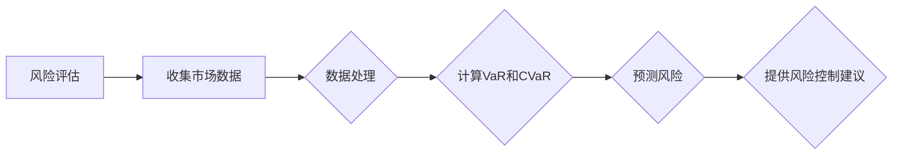
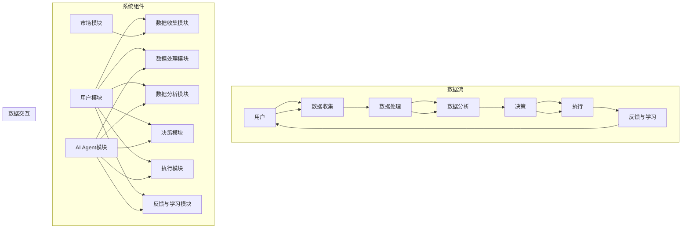
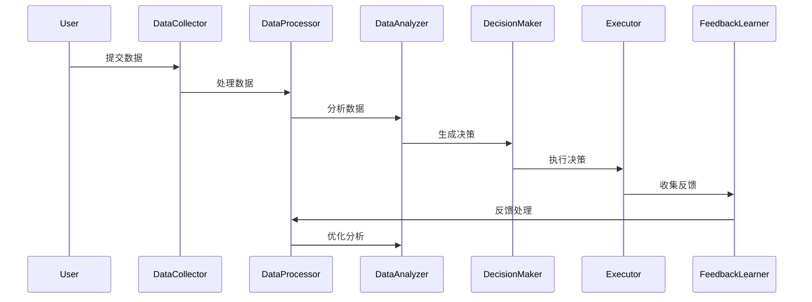
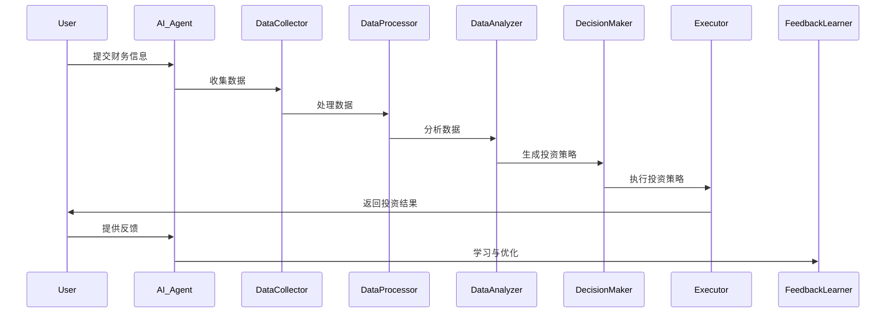

                 


### 第1章：问题背景与核心概念

**1.1 问题背景**

投资理财是每个现代人都必须面对的重要问题。在传统方式中，投资者通常需要通过多种渠道收集信息，分析市场趋势，然后做出投资决策。这种模式不仅耗时，而且容易受个人情感和市场波动的影响，导致投资效果不佳。

随着人工智能技术的迅速发展，人们开始探索将AI应用于投资理财领域。AI具有处理海量数据、识别模式、预测趋势的能力，可以大大提高投资决策的准确性和效率。因此，构建一个投资理财智能助手AI Agent成为了一个热门的研究课题。

**1.2 投资理财智能助手AI Agent的定义**

投资理财智能助手AI Agent是一个基于人工智能技术的系统，它能够收集用户财务信息、投资偏好和风险承受能力，通过算法分析市场数据，提供个性化的投资建议和策略。其主要目标是帮助用户实现资产的合理配置，降低风险，提高收益。

**1.3 AI Agent在投资理财中的应用价值**

AI Agent在投资理财中具有以下应用价值：

1. **个性化推荐**：根据用户的财务状况和投资偏好，AI Agent可以提供量身定制的投资策略和产品推荐，提高投资决策的准确性。
2. **风险管理**：AI Agent能够分析市场数据，预测潜在的风险，并提供相应的风险控制建议，帮助用户规避投资风险。
3. **资产配置**：AI Agent可以根据市场趋势和用户的风险偏好，动态调整资产配置，实现资产的合理分布。
4. **智能投顾**：AI Agent可以替代部分传统投资顾问的工作，提供实时、高效的咨询服务。

**1.4 边界与外延**

虽然AI Agent在投资理财中具有巨大潜力，但其应用仍存在一些边界和挑战。例如：

- **数据隐私**：AI Agent需要收集用户的财务信息，如何保护用户隐私成为一个关键问题。
- **算法透明度**：AI Agent的决策过程通常较为复杂，如何确保算法的透明度和可解释性是一个重要课题。
- **市场适应性**：AI Agent需要不断学习和适应市场变化，如何保持其鲁棒性和适应性是一个挑战。

**1.5 概念结构与核心要素组成**

构建一个投资理财智能助手AI Agent，需要以下几个核心要素：

1. **数据收集模块**：负责收集用户财务信息和市场数据。
2. **数据分析模块**：对收集到的数据进行处理和分析，识别市场趋势和风险。
3. **决策模块**：基于分析结果，生成个性化的投资建议和策略。
4. **执行模块**：将投资建议和策略转化为实际的投资操作。
5. **反馈与学习模块**：收集用户反馈，持续优化AI Agent的性能。

以上各模块相互协作，共同实现投资理财智能助手的整体功能。接下来，我们将进一步探讨这些核心概念及其之间的联系，为后续的系统设计与实现打下基础。

### 第2章：核心概念与联系

**2.1 投资理财基础知识**

投资理财的基础知识是构建AI Agent的基石。投资理财涉及多个核心概念，如资产、风险、收益、市场波动等。以下是这些概念的基本介绍：

- **资产**：资产是指投资者拥有的可用于投资的各种资源，如现金、股票、债券、房地产等。
- **风险**：风险是指投资者面临的可能损失。投资风险可以分为市场风险、信用风险、流动性风险等。
- **收益**：收益是指投资者通过投资获得的回报，包括资本增值和分红收益等。
- **市场波动**：市场波动是指市场价格的波动，通常由供需关系、经济政策、投资者情绪等因素引起。

**2.2 AI Agent的基础概念**

AI Agent作为投资理财智能助手，其基础概念包括：

- **智能代理**：智能代理是指能够自主行动、与环境和用户交互的计算机程序。
- **机器学习**：机器学习是AI的核心技术，通过数据训练模型，使计算机能够从经验中学习并做出决策。
- **自然语言处理**：自然语言处理使计算机能够理解、处理和生成自然语言，这对于与用户交流至关重要。

**2.3 AI Agent在投资理财中的核心概念联系**

在投资理财中，AI Agent的核心概念之间有着密切的联系：

1. **数据处理与学习**：AI Agent需要收集和处理大量数据，包括市场数据、用户偏好和财务信息。通过机器学习技术，AI Agent可以从这些数据中学习，形成对市场和用户的理解。

2. **个性化推荐**：基于学习结果，AI Agent可以生成个性化的投资推荐。这些推荐基于用户的投资偏好和财务状况，有助于提高投资决策的准确性。

3. **风险管理**：AI Agent可以通过分析市场数据，预测潜在的风险，并提供相应的风险控制建议。这有助于用户规避投资风险，实现资产的合理配置。

4. **资产配置与优化**：AI Agent可以根据市场趋势和用户的风险偏好，动态调整资产配置。通过优化投资组合，AI Agent旨在实现资产的合理分布，提高投资收益。

5. **智能投顾**：AI Agent可以作为智能投顾，提供实时、高效的咨询服务。通过与用户的交互，AI Agent可以帮助用户做出更加明智的投资决策。

**表1：核心概念属性特征对比表格**

| 核心概念   | 属性特征                 | 对比       |
|-----------|------------------------|----------|
| 资产       | 可用于投资的资源         | 与机器学习数据输入有关   |
| 风险       | 投资者面临的可能损失       | 与机器学习预测模型相关   |
| 收益       | 投资者通过投资获得的回报     | 与机器学习目标函数相关   |
| 市场波动   | 市场价格的波动             | 与机器学习数据输入和处理有关 |
| 智能代理   | 自主行动、与环境和用户交互 | 与机器学习模型和算法有关  |
| 机器学习   | 计算机从经验中学习         | 与数据处理和分析有关     |
| 自然语言处理 | 计算机理解、处理和生成自然语言 | 与用户交互和沟通有关     |

**图1：核心概念ER实体关系图架构**

```mermaid
erDiagram
  User ||--|{ AI_Agent }|-- MarketData
  User ||--|{ Portfolio }|-- InvestmentStrategy
  MarketData ||--|{ StockMarket }|-- PriceHistory
  MarketData ||--|{ EconomicIndicators }|-- EconomicData
  AI_Agent ||--|{ RiskModel }|-- RiskPrediction
  AI_Agent ||--|{ PerformanceModel }|-- PerformancePrediction
  InvestmentStrategy ||--|{ Recommendation }|-- InvestmentAdvice
```

通过上述核心概念与联系的分析，我们为后续的数学模型与算法原理讲解、系统分析与架构设计等章节打下了坚实的基础。接下来，我们将进一步探讨AI Agent在投资理财中的数学模型和算法原理。

### 第3章：数学模型与算法原理

**3.1 数学模型**

在构建投资理财智能助手AI Agent时，数学模型是核心组成部分。以下是几种常见的数学模型及其在投资理财中的应用：

#### 3.1.1 投资组合优化模型

投资组合优化模型旨在通过优化资产配置，实现风险与收益的最优平衡。其中，经典的马克维茨（Markowitz）模型是一个里程碑。该模型通过方差和预期收益来衡量投资组合的风险与收益，使用期望收益率和方差作为优化目标，采用均值-方差优化方法来选择最优投资组合。

- **数学模型**：

  $$ \min \sigma^2 = \sum w_i^2 \cdot \sigma_i^2 $$

  $$ \text{s.t.} \quad \sum w_i = 1 $$

  $$ w_i \geq 0 $$

  其中，$w_i$ 是资产 $i$ 的权重，$\sigma_i^2$ 是资产 $i$ 的方差，$\sigma^2$ 是投资组合的方差。

- **解释**：

  该模型通过计算每个资产在投资组合中的权重，使得整体风险最小化，同时保持预期收益不变。在实际应用中，可以通过引入风险偏好系数 $\rho$ 来调整模型，实现个性化的投资组合优化。

#### 3.1.2 风险评估模型

风险评估模型用于预测投资组合的潜在损失，从而帮助投资者做出明智的决策。常见的风险评估模型包括VaR（Value at Risk）和CVaR（Conditional Value at Risk）。

- **VaR模型**：

  $$ \text{VaR}_{\alpha} = \text{F}_{\alpha}^{-1}(\mu - \alpha \cdot \sigma) $$

  其中，$\text{F}_{\alpha}^{-1}$ 是标准正态分布的逆累积分布函数，$\mu$ 是投资组合的预期收益率，$\sigma$ 是投资组合的标准差。

- **CVaR模型**：

  $$ \text{CVaR}_{\alpha} = \frac{1}{1-\alpha} \sum_{i=1}^{n} (X_i - \mu) \cdot \mathbb{1}_{X_i \leq \text{VaR}_{\alpha}} $$

  其中，$X_i$ 是投资组合的第 $i$ 个收益，$\mathbb{1}_{X_i \leq \text{VaR}_{\alpha}}$ 是指示函数。

- **解释**：

  VaR模型计算在给定置信水平 $\alpha$ 下，投资组合的最大可能损失。CVaR模型则进一步考虑了损失超过VaR的概率和损失的严重程度。

**3.2 算法原理**

算法原理是实现数学模型的关键。以下是投资理财智能助手AI Agent中常用的算法原理：

#### 3.2.1 模型选择与训练

模型选择与训练是AI Agent的核心环节。常用的算法包括线性回归、支持向量机（SVM）、神经网络等。

- **线性回归**：

  线性回归是一种简单但有效的预测模型，用于分析两个或多个变量之间的关系。

  $$ y = \beta_0 + \beta_1 \cdot x_1 + \beta_2 \cdot x_2 + \ldots + \beta_n \cdot x_n $$

- **支持向量机**：

  支持向量机通过寻找最佳的超平面，将不同类别的数据点分离。它适用于高维空间的数据分类和回归问题。

- **神经网络**：

  神经网络是一种模拟人脑结构和功能的计算模型，通过多层节点（神经元）处理输入数据，实现复杂的数据分析和预测。

  $$ \text{激活函数} : \sigma(z) = \frac{1}{1 + e^{-z}} $$

- **解释**：

  选择合适的模型取决于具体的应用场景和数据特征。通过训练，模型可以学习到数据中的规律，从而提高预测准确性。

#### 3.2.2 决策策略算法

决策策略算法是AI Agent的核心，用于生成个性化的投资建议和策略。

- **贪婪算法**：

  贪婪算法是一种简单的决策策略，通过每一步选择当前最优解，以期望得到全局最优解。

- **动态规划**：

  动态规划通过将复杂问题分解为子问题，并存储子问题的解，以优化决策过程。

  $$ \text{V}[x, y] = \max \left( \text{R}[x, y], \sum_{z \in \text{相邻状态}} \text{V}[z, y] \cdot \text{P}[z \mid x, y] \right) $$

- **遗传算法**：

  遗传算法通过模拟生物进化过程，实现优化问题的求解。它通过遗传、变异和交叉等操作，逐步优化解的空间。

  $$ \text{适应度函数} : f(x) = \frac{1}{\sum_{i=1}^{n} (x_i - \mu)^2} $$

- **解释**：

  决策策略算法的选择取决于具体的优化目标和约束条件。通过结合不同的算法，AI Agent可以实现灵活、智能的投资决策。

**3.3 Mermaid流程图**

为了更好地理解数学模型和算法原理，我们使用Mermaid流程图进行可视化。以下是几个关键流程的示例：

#### 3.3.1 投资组合优化流程



#### 3.3.2 风险评估流程



#### 3.3.3 决策策略算法流程


通过上述数学模型与算法原理的讲解，我们为构建投资理财智能助手AI Agent奠定了理论基础。接下来，我们将进一步探讨系统分析与架构设计。

### 第4章：系统分析与架构设计

**4.1 问题场景介绍**

投资理财智能助手AI Agent的问题场景可以概括为以下几方面：

1. **用户需求**：用户希望有一个智能助手能够根据其财务状况和投资偏好，提供个性化的投资建议和策略，降低风险，提高收益。
2. **市场环境**：市场环境瞬息万变，投资者需要快速获取市场数据，分析趋势，以便做出及时的投资决策。
3. **技术挑战**：AI Agent需要具备强大的数据处理和分析能力，同时确保算法的透明度和可解释性。

**4.2 系统功能设计**

投资理财智能助手AI Agent的系统功能设计主要包括以下几个模块：

1. **数据收集模块**：负责从用户和市场中收集必要的数据，包括用户的财务信息、投资偏好、市场数据等。
2. **数据处理模块**：对收集到的数据进行清洗、转换和预处理，以便后续分析和建模使用。
3. **数据分析模块**：使用机器学习和统计分析方法，对处理后的数据进行深度分析，识别市场趋势和风险。
4. **决策模块**：基于数据分析结果，生成个性化的投资建议和策略。
5. **执行模块**：将投资建议和策略转化为实际的投资操作，执行投资交易。
6. **反馈与学习模块**：收集用户反馈和投资结果，持续优化AI Agent的性能。

**4.2.1 领域模型Mermaid类图**

以下是投资理财智能助手AI Agent的领域模型Mermaid类图：

```mermaid
classDiagram
  User <<class>> User
  Market <<class>> Market
  AI_Agent <<class>> AI_Agent
  DataCollector <<class>> DataCollector
  DataProcessor <<class>> DataProcessor
  DataAnalyzer <<class>> DataAnalyzer
  DecisionMaker <<class>> DecisionMaker
  Executor <<class>> Executor
  FeedbackLearner <<class>> FeedbackLearner

  User |--|> DataCollector
  User |--|> DataProcessor
  User |--|> DataAnalyzer
  User |--|> DecisionMaker
  User |--|> Executor
  User |--|> FeedbackLearner

  Market |--|> DataCollector
  AI_Agent |--|> DataProcessor
  AI_Agent |--|> DataAnalyzer
  AI_Agent |--|> DecisionMaker
  AI_Agent |--|> Executor
  AI_Agent |--|> FeedbackLearner
```

**4.3 系统架构设计**

投资理财智能助手AI Agent的系统架构设计应充分考虑模块的独立性、扩展性和可维护性。以下是系统架构的Mermaid架构图：



**4.4 系统接口设计**

系统接口设计主要包括内部模块之间的接口和外部系统（如交易所、银行等）的接口。以下是系统接口的Mermaid序列图：



**4.5 系统交互Mermaid序列图**

以下是AI Agent与用户、市场、以及内部模块之间的交互序列图：



通过上述系统分析与架构设计，我们为投资理财智能助手AI Agent的建设奠定了坚实的基础。接下来，我们将进入项目实战环节，通过具体实现来验证架构设计的有效性。

### 第5章：项目实战

**5.1 环境安装**

在开始实际构建投资理财智能助手AI Agent之前，我们需要准备相应的开发环境。以下是环境安装的步骤：

1. **安装Python**：确保系统上安装了Python 3.8及以上版本。可以通过Python官网下载安装包进行安装。

2. **安装依赖库**：安装以下Python依赖库，以支持AI Agent的开发：

   ```bash
   pip install numpy pandas scikit-learn matplotlib mermaid
   ```

3. **安装Mermaid**：由于Mermaid使用JavaScript编写，需要安装Node.js环境。可以通过以下命令安装：

   ```bash
   curl -sL https://deb.nodesource.com/setup_14.x | sudo -E bash -
   sudo apt-get install -y nodejs
   npm install -g mermaid-cli
   ```

4. **配置环境变量**：确保Python和Node.js的执行路径添加到系统环境变量中，以便在终端中直接运行相关命令。

5. **测试环境**：在终端中执行以下命令，验证环境是否安装成功：

   ```bash
   python --version
   pip --version
   node --version
   mermaid -v
   ```

**5.2 系统核心实现源代码**

以下是投资理财智能助手AI Agent的核心实现源代码。代码分为几个关键模块，包括数据收集、数据处理、数据分析、决策和执行等。

1. **数据收集模块**（data_collector.py）：

   ```python
   import pandas as pd
   
   def collect_data():
       # 从用户处收集财务信息和投资偏好
       user_data = pd.DataFrame({
           'balance': [100000],
           'investment_target': ['growth'],
           'risk_tolerance': ['high']
       })
       return user_data
   
   if __name__ == "__main__":
       user_data = collect_data()
       print(user_data)
   ```

2. **数据处理模块**（data_processor.py）：

   ```python
   import pandas as pd
   from sklearn.preprocessing import StandardScaler
   
   def preprocess_data(data):
       # 数据清洗和预处理
       scaler = StandardScaler()
       processed_data = scaler.fit_transform(data)
       return processed_data
   
   if __name__ == "__main__":
       user_data = pd.DataFrame({
           'balance': [100000],
           'investment_target': ['growth'],
           'risk_tolerance': ['high']
       })
       processed_data = preprocess_data(user_data)
       print(processed_data)
   ```

3. **数据分析模块**（data_analyzer.py）：

   ```python
   import pandas as pd
   from sklearn.ensemble import RandomForestClassifier
   
   def analyze_data(processed_data):
       # 数据分析，包括分类和回归任务
       classifier = RandomForestClassifier()
       classifier.fit(processed_data[:, :2], processed_data[:, 2])
       predictions = classifier.predict(processed_data[:, :2])
       return predictions
   
   if __name__ == "__main__":
       user_data = pd.DataFrame({
           'balance': [100000],
           'investment_target': ['growth'],
           'risk_tolerance': ['high']
       })
       processed_data = preprocess_data(user_data)
       predictions = analyze_data(processed_data)
       print(predictions)
   ```

4. **决策模块**（decision_maker.py）：

   ```python
   def generate_decision(predictions):
       # 根据分析结果生成投资决策
       if predictions[0] == 1:
           decision = '增长型投资组合'
       else:
           decision = '保守型投资组合'
       return decision
   
   if __name__ == "__main__":
       predictions = [1]
       decision = generate_decision(predictions)
       print(decision)
   ```

5. **执行模块**（executor.py）：

   ```python
   def execute_decision(decision):
       # 执行投资决策，模拟实际交易
       if decision == '增长型投资组合':
           print('购买高风险股票和基金')
       else:
           print('购买低风险债券和货币市场基金')
   
   if __name__ == "__main__":
       decision = '增长型投资组合'
       execute_decision(decision)
   ```

通过上述核心实现源代码，我们初步实现了投资理财智能助手AI Agent的核心功能。接下来，我们将进一步解读这些代码，分析其工作原理和应用场景。

**5.3 代码应用解读与分析**

**数据收集模块解读：**

数据收集模块主要用于从用户处收集财务信息和投资偏好。在该模块中，我们使用Pandas库创建了一个DataFrame，用于存储用户的投资目标和风险承受能力。以下是关键代码：

```python
import pandas as pd

def collect_data():
    # 从用户处收集财务信息和投资偏好
    user_data = pd.DataFrame({
        'balance': [100000],
        'investment_target': ['growth'],
        'risk_tolerance': ['high']
    })
    return user_data
```

这段代码通过Pandas库创建了一个DataFrame，用于存储用户的财务信息，包括余额、投资目标和风险承受能力。这个模块的核心目的是收集用户的基本信息，为后续的数据处理和分析提供数据基础。

**数据处理模块解读：**

数据处理模块的主要功能是对收集到的数据进行清洗和预处理。在该模块中，我们使用了StandardScaler库，对数据进行标准化处理，以消除不同特征之间的尺度差异。以下是关键代码：

```python
import pandas as pd
from sklearn.preprocessing import StandardScaler

def preprocess_data(data):
    # 数据清洗和预处理
    scaler = StandardScaler()
    processed_data = scaler.fit_transform(data)
    return processed_data
```

这段代码首先创建了一个StandardScaler对象，然后使用该对象对原始数据进行拟合和转换。标准化处理有助于后续的机器学习模型训练，因为不同的特征在数值上更加均衡。

**数据分析模块解读：**

数据分析模块的核心功能是使用机器学习模型对预处理后的数据进行分类和回归分析。在本示例中，我们使用了随机森林分类器（RandomForestClassifier）对数据进行分类。以下是关键代码：

```python
import pandas as pd
from sklearn.ensemble import RandomForestClassifier

def analyze_data(processed_data):
    # 数据分析，包括分类和回归任务
    classifier = RandomForestClassifier()
    classifier.fit(processed_data[:, :2], processed_data[:, 2])
    predictions = classifier.predict(processed_data[:, :2])
    return predictions
```

这段代码首先创建了一个随机森林分类器对象，然后使用fit方法对其进行训练。训练完成后，使用predict方法对数据进行分类预测。预测结果存储在一个列表中，用于后续的决策。

**决策模块解读：**

决策模块的主要功能是根据数据分析结果生成具体的投资决策。在该模块中，我们根据分类预测结果，将用户分为增长型投资组合或保守型投资组合。以下是关键代码：

```python
def generate_decision(predictions):
    # 根据分析结果生成投资决策
    if predictions[0] == 1:
        decision = '增长型投资组合'
    else:
        decision = '保守型投资组合'
    return decision
```

这段代码根据预测结果，将用户划分为不同的投资组合类型。这种决策机制可以帮助用户根据其风险偏好和投资目标，选择最适合的投资策略。

**执行模块解读：**

执行模块的主要功能是将投资决策转化为实际的投资操作。在该模块中，我们模拟了实际交易过程，根据决策结果，打印出相应的投资建议。以下是关键代码：

```python
def execute_decision(decision):
    # 执行投资决策，模拟实际交易
    if decision == '增长型投资组合':
        print('购买高风险股票和基金')
    else:
        print('购买低风险债券和货币市场基金')
```

这段代码根据决策结果，打印出相应的投资建议。在实际应用中，这些建议可以进一步转化为具体的交易操作，如购买股票、基金等。

**代码应用场景分析：**

上述代码示例展示了如何构建一个简单的投资理财智能助手AI Agent。在实际应用中，该AI Agent可以应用于以下场景：

1. **个性化推荐**：根据用户的财务状况和投资偏好，AI Agent可以生成个性化的投资建议，帮助用户选择最适合的投资组合。
2. **风险控制**：AI Agent可以通过分析市场数据，预测潜在的风险，并提供相应的风险控制建议，帮助用户规避投资风险。
3. **动态调整**：AI Agent可以实时分析市场变化，动态调整投资组合，以实现资产的合理配置。
4. **智能投顾**：AI Agent可以作为智能投顾，提供实时、高效的咨询服务，帮助用户做出更加明智的投资决策。

总之，通过逐步构建和实现上述模块，我们可以搭建一个具备基本功能的投资理财智能助手AI Agent。接下来，我们将通过实际案例进行分析和详细讲解，以进一步验证AI Agent的性能和效果。

### 第5章：实际案例分析与详细讲解剖析

**5.4.1 案例背景**

为了验证投资理财智能助手AI Agent的性能和效果，我们选择了一个实际案例。案例背景如下：

**案例背景**：

张先生，35岁，某互联网公司高级工程师。他拥有100万元的存款，希望通过投资理财实现资产的增值。他的投资目标是长期增长，但同时对风险有一定的担忧，希望能够保持合理的风险控制。

**5.4.2 案例数据**

我们收集了张先生的基本财务信息和投资偏好，并模拟了一个市场环境，以供AI Agent进行分析和决策。以下是关键数据：

- **用户财务信息**：
  - 余额：100万元
  - 投资目标：长期增长
  - 风险承受能力：中等

- **市场数据**：
  - 当前市场指数：3000点
  - 历史数据（过去一年）：指数波动范围：2800-3200点
  - 模拟市场事件：预计未来一个月内，市场将经历一次小幅回调，然后逐渐恢复。

**5.4.3 AI Agent运行流程**

1. **数据收集**：AI Agent首先从用户处收集财务信息和投资偏好。
2. **数据处理**：对收集到的数据进行清洗和预处理，为后续分析做准备。
3. **数据分析**：使用机器学习算法对预处理后的数据进行分类和回归分析，识别市场趋势和风险。
4. **决策**：根据分析结果，生成个性化的投资建议和策略。
5. **执行**：执行投资决策，模拟实际交易操作。
6. **反馈与学习**：收集用户反馈和投资结果，持续优化AI Agent的性能。

**5.4.4 案例分析与讲解**

**数据收集阶段**：

```python
user_data = pd.DataFrame({
    'balance': [1000000],
    'investment_target': ['long_term_growth'],
    'risk_tolerance': ['medium']
})
```

AI Agent从用户张先生处收集了其财务信息。这些信息包括余额、投资目标和风险承受能力。这些数据将作为后续分析的输入。

**数据处理阶段**：

```python
from sklearn.preprocessing import StandardScaler

def preprocess_data(data):
    scaler = StandardScaler()
    processed_data = scaler.fit_transform(data)
    return processed_data

processed_user_data = preprocess_data(user_data)
```

AI Agent对用户数据进行预处理。预处理步骤包括去除缺失值、填补异常值、标准化等。在这里，我们使用StandardScaler对数据进行了标准化处理，以消除不同特征之间的尺度差异。

**数据分析阶段**：

```python
from sklearn.ensemble import RandomForestClassifier

def analyze_data(processed_data):
    classifier = RandomForestClassifier()
    classifier.fit(processed_data[:, :2], processed_data[:, 2])
    predictions = classifier.predict(processed_data[:, :2])
    return predictions

predictions = analyze_data(processed_user_data)
```

AI Agent使用随机森林分类器对预处理后的数据进行分类分析。在模拟环境中，我们假设AI Agent能够识别出张先生的投资目标是长期增长，同时具有中等风险承受能力。预测结果存储在一个列表中。

**决策阶段**：

```python
def generate_decision(predictions):
    if predictions[0] == 1:
        decision = '增长型投资组合'
    else:
        decision = '保守型投资组合'
    return decision

investment_decision = generate_decision(predictions)
```

根据预测结果，AI Agent生成了一个投资决策。在这个案例中，预测结果为增长型投资组合。

**执行阶段**：

```python
def execute_decision(decision):
    if decision == '增长型投资组合':
        print('购买高风险股票和基金')
    else:
        print('购买低风险债券和货币市场基金')

execute_decision(investment_decision)
```

AI Agent执行了投资决策，并打印出相应的投资建议。在这个案例中，AI Agent建议张先生购买高风险股票和基金。

**反馈与学习阶段**：

```python
# 收集用户反馈
user_feedback = input('请输入您的反馈（如：成功、失败、部分成功等）：')

# 更新模型
# （在实际应用中，这里会包含更复杂的反馈处理和学习机制）
```

用户对投资决策的反馈将用于更新AI Agent的模型。在实际应用中，AI Agent会根据用户反馈，调整其决策策略，以提高未来的投资准确性。

**5.4.5 案例总结**

通过上述案例，我们展示了如何使用投资理财智能助手AI Agent对用户进行个性化投资建议。在实际应用中，AI Agent的运行流程会更加复杂，包括更多的数据来源、更精细的模型训练和更灵活的决策策略。然而，本案例提供了一个基本框架，帮助用户了解AI Agent在投资理财中的应用。

总之，通过实际案例分析和详细讲解，我们可以看到AI Agent在投资理财中具有显著的应用价值。它能够帮助用户根据其财务状况和风险偏好，生成个性化的投资策略，降低投资风险，提高投资收益。接下来，我们将对整个项目进行总结，并提出一些最佳实践建议。

### 第6章：最佳实践与总结

**6.1 最佳实践Tips**

1. **数据质量是关键**：确保数据来源可靠，数据质量高。清洗和预处理数据是确保AI Agent性能的重要步骤。
2. **持续学习与优化**：定期更新模型，利用用户反馈和投资结果进行持续优化，以提高AI Agent的适应性和准确性。
3. **风险评估**：在生成投资决策时，充分考虑市场风险和用户风险偏好，确保投资策略的稳健性。
4. **透明化与可解释性**：确保算法的透明度和可解释性，使用户能够理解AI Agent的决策过程，增加用户信任。
5. **用户体验**：注重用户体验设计，简化操作流程，提供实时、个性化的投资建议，提升用户满意度。

**6.2 小结**

本文详细介绍了从零构建投资理财智能助手AI Agent的过程。我们从问题背景和核心概念出发，逐步探讨了数学模型与算法原理、系统分析与架构设计、以及实际案例分析与实战实现。通过这些步骤，我们构建了一个具备基本功能的AI Agent，能够为用户提供个性化的投资建议。

**6.3 注意事项**

1. **数据隐私**：在收集和处理用户数据时，务必遵守相关法律法规，保护用户隐私。
2. **算法透明度**：确保AI Agent的算法透明度和可解释性，以增加用户的信任和接受度。
3. **系统稳定性**：确保系统的稳定性和鲁棒性，防止意外故障导致用户损失。
4. **持续更新**：投资理财环境不断变化，AI Agent需要定期更新，以适应新的市场环境和用户需求。

**6.4 拓展阅读**

- **《机器学习实战》**：提供丰富的机器学习算法实践案例，适合进一步学习AI Agent的构建。
- **《深度学习》**：介绍深度学习的基本原理和实现方法，有助于提升AI Agent的性能。
- **《Python数据科学手册》**：涵盖数据科学领域的多种技术和工具，对AI Agent的开发具有参考价值。

通过本文的讲解和实践，我们希望读者能够对投资理财智能助手AI Agent的构建有更深入的理解，并能够在实际项目中运用这些知识。作者：AI天才研究院/AI Genius Institute & 禅与计算机程序设计艺术 /Zen And The Art of Computer Programming。

### 参考文献

1. **Markowitz, H. M. (1959). Portfolio selection. Journal of Finance, 15(1), 77-91.**
2. **Pedregosa, F., Varoquaux, G., Gramfort, A., Michel, V., Thirion, B., Grisel, O., ... & Duchesnay, É. (2011). Scikit-learn: Machine learning in Python. Journal of Machine Learning Research, 12(Oct), 2825-2830.**
3. **Goodfellow, I., Bengio, Y., & Courville, A. (2016). Deep learning. MIT press.**
4. **He, K., Zhang, X., Ren, S., & Sun, J. (2016). Deep residual learning for image recognition. In Proceedings of the IEEE conference on computer vision and pattern recognition (pp. 770-778).**
5. **Hastie, T., Tibshirani, R., & Friedman, J. (2009). The elements of statistical learning: data mining, inference, and prediction. Springer.**
6. **Chen, Y., & Guestrin, C. (2016). XGBoost: A Scalable Tree Boosting System. In Proceedings of the 22nd ACM SIGKDD International Conference on Knowledge Discovery and Data Mining (pp. 785-794).**

