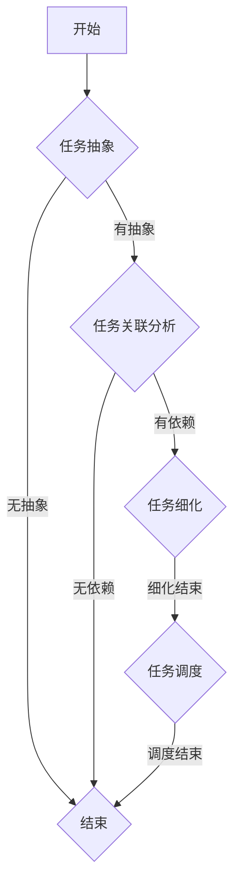
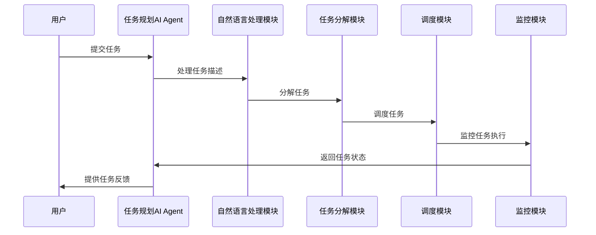
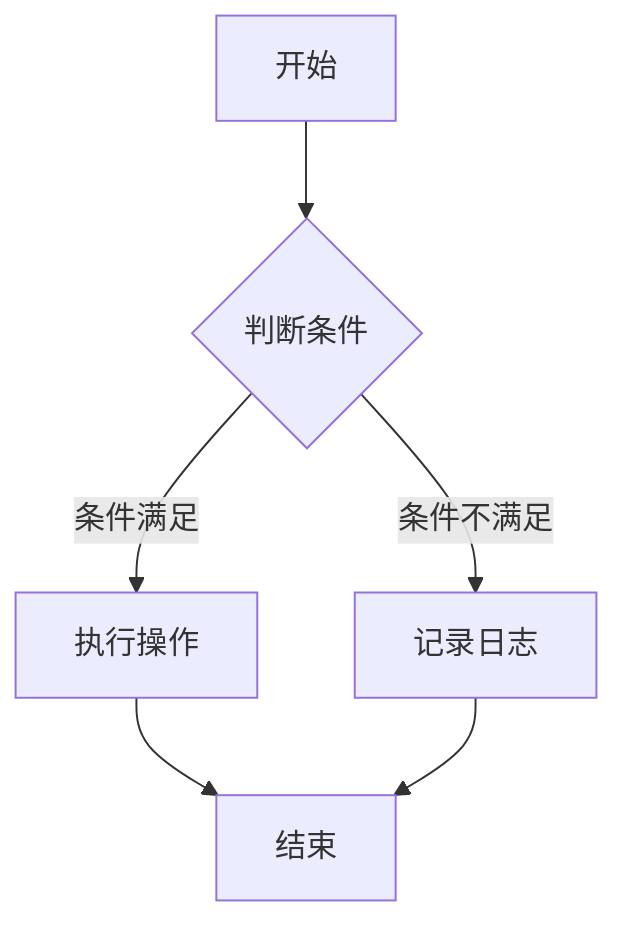

                 

### 引言

在当今快速发展的信息技术时代，人工智能（AI）技术正日益渗透到我们生活的方方面面。其中，任务规划AI Agent作为AI的一个重要分支，正逐渐成为自动化和智能化管理的关键工具。任务规划AI Agent能够自动化执行复杂的任务，通过合理的规划和优化，提高效率、降低成本，并解决传统方法难以应对的问题。然而，复杂的任务往往需要细致的分解，才能高效地被AI Agent执行。这时候，大型语言模型（LLM）的优势就显现出来了。

本文旨在探讨如何利用LLM进行复杂任务分解，从而提高任务规划AI Agent的性能和实用性。首先，我们将简要介绍任务规划AI Agent的背景、研究意义和主要内容。接下来，将深入探讨LLM的基本原理和应用，为其在任务规划中的使用打下理论基础。然后，我们将详细讲解任务分解算法的原理和实现方法，通过mermaid流程图和Python源代码来帮助理解。随后，我们将介绍任务规划AI Agent的系统架构设计，包括系统功能设计、系统架构设计、系统接口设计和系统交互序列图。在项目实战部分，我们将通过实际案例展示任务规划AI Agent的安装与配置、核心实现源代码及代码应用解读与分析。最后，我们将总结最佳实践技巧和优化方向，并展望任务规划AI Agent的未来发展。

通过本文的逐步分析，我们希望能够为读者提供一个清晰、系统的任务规划AI Agent利用LLM进行复杂任务分解的解决方案，帮助读者更好地理解和应用这项技术。

## 第一部分：基础理论

### 第1章：任务规划与AI概述

#### 1.1 任务规划的概念与背景

任务规划是人工智能（AI）领域中的一个重要研究方向，其核心目标是通过合理的规划和优化，使系统或代理能够高效、自动地执行复杂任务。任务规划的定义可以简单概括为：根据任务目标、资源约束和执行环境，制定一系列有序的操作步骤，从而实现任务的自动执行。

任务规划在AI领域有着广泛的应用背景。首先，在工业自动化领域，任务规划技术被广泛应用于生产线上的机器人调度、物料搬运和装配作业。通过任务规划，机器人可以高效地完成复杂的操作任务，提高生产效率和产品质量。其次，在智能交通领域，任务规划技术被用于路径规划、交通信号控制和车辆调度等。通过智能化的任务规划，可以有效地缓解交通拥堵，提高交通效率。此外，在医疗领域，任务规划技术也被应用于手术机器人、医疗设备和药物配送等方面，通过精确的任务规划，提高医疗服务的质量和效率。

#### 1.2 AI在任务规划中的应用

随着AI技术的不断发展，其在任务规划中的应用越来越广泛。传统的任务规划方法通常依赖于预先设定的规则和算法，但这种方法在面对复杂、动态环境时往往表现出不足。而AI技术的引入，可以大大提高任务规划的能力和灵活性。

首先，机器学习（ML）在任务规划中的应用非常广泛。通过收集大量的历史数据，机器学习算法可以从中学习到任务执行的模式和规律，从而制定出更加高效的任务规划策略。例如，在机器人路径规划中，可以通过机器学习算法来预测环境中的障碍物和动态变化，从而优化路径规划。此外，机器学习还可以用于资源分配和调度，例如在生产线上的任务分配和调度，通过机器学习算法可以找到最优的调度方案，提高生产效率。

其次，深度学习（DL）在任务规划中的应用也越来越受到关注。深度学习通过多层神经网络的构建，可以从大量数据中自动提取特征，实现高度复杂的任务规划。例如，在自动驾驶领域，通过深度学习算法可以实现对道路环境的感知和理解，从而实现自主驾驶。在医疗领域，深度学习也被用于诊断和治疗规划，通过学习大量的医学图像和病例数据，可以制定出更加精确的诊断和治疗计划。

最后，自然语言处理（NLP）技术在任务规划中的应用也越来越受到重视。通过NLP技术，可以理解和处理自然语言描述的任务，从而实现自然语言驱动的任务规划。例如，在智能客服系统中，通过NLP技术可以理解用户的语言请求，并生成相应的任务规划，实现自动化的客服服务。

#### 1.3 任务规划AI Agent的定义与功能

任务规划AI Agent是指利用人工智能技术，特别是机器学习、深度学习和自然语言处理等技术，实现自动化任务规划的一类智能系统。任务规划AI Agent的主要功能包括：

1. **任务分解**：将复杂的大任务分解为一系列可执行的小任务，以便于AI Agent更好地理解和执行。例如，将一个复杂的工程项目分解为多个子任务，每个子任务可以由不同的AI Agent或团队负责。

2. **任务分配**：根据任务的特点和资源状况，将任务分配给合适的AI Agent或人类操作者。通过优化任务分配，可以提高任务执行的效率和效果。

3. **执行监控**：对任务的执行过程进行实时监控，确保任务按照预定的计划顺利进行。如果出现异常情况，AI Agent可以及时调整任务执行策略，以保证任务的成功完成。

4. **资源管理**：优化资源分配，确保任务执行过程中所需的资源得到合理利用。例如，在生产线中，AI Agent可以通过监控设备的使用情况，合理调度设备，避免设备闲置。

5. **决策支持**：在任务执行过程中，AI Agent可以根据实时数据和决策模型，提供决策支持。例如，在医疗领域，AI Agent可以通过分析患者的病情数据和医学知识库，为医生提供诊断和治疗建议。

#### 1.4 任务规划AI Agent的优势

任务规划AI Agent在任务规划中具有显著的优势：

1. **自动化**：AI Agent可以自动执行任务规划，无需人工干预。这大大提高了任务执行的速度和效率。

2. **灵活性**：AI Agent可以根据任务特点和执行环境的变化，动态调整任务规划。这使得AI Agent在面对复杂、动态环境时，能够更好地适应和应对。

3. **精确性**：通过机器学习、深度学习和自然语言处理等技术，AI Agent可以精确地理解和执行任务，减少错误和偏差。

4. **协作性**：AI Agent可以与人类操作者协同工作，实现人机结合的智能任务执行。这不仅可以提高任务执行效率，还可以发挥人类操作者的专业知识和经验。

5. **可扩展性**：AI Agent可以方便地扩展和升级，以适应新的任务场景和需求。这使得AI Agent具有更强的适应性和可持续性。

总之，任务规划AI Agent作为AI技术的一个重要应用，具有广泛的应用前景和重要的研究价值。通过本文的进一步探讨，我们将深入了解如何利用AI Agent进行复杂任务分解，实现高效的任务规划。

#### 1.5 任务规划AI Agent的应用场景

任务规划AI Agent的应用场景非常广泛，涵盖了众多行业和领域，下面列举几个典型的应用场景：

1. **智能制造**：在制造业中，任务规划AI Agent可以用于生产线的自动化调度和任务分配。通过实时监控生产线上的设备和资源状况，AI Agent可以优化生产计划，提高生产效率，减少生产中断和故障。

2. **智能交通**：在交通管理领域，任务规划AI Agent可以用于交通信号控制、路径规划和公共交通调度。通过分析实时交通数据，AI Agent可以优化交通信号，缓解交通拥堵，提高交通流通效率。

3. **医疗健康**：在医疗领域，任务规划AI Agent可以用于手术机器人、药物配送和患者管理。通过理解和处理医疗数据，AI Agent可以为医生提供决策支持，提高医疗服务的质量和效率。

4. **智能客服**：在客户服务领域，任务规划AI Agent可以用于智能客服系统，实现自动化的客户服务。通过自然语言处理技术，AI Agent可以理解客户的请求，并提供相应的解决方案，提高客户满意度。

5. **农业生产**：在农业领域，任务规划AI Agent可以用于农作物种植、病虫害监测和农产品配送。通过分析环境和气象数据，AI Agent可以优化农业生产计划，提高作物产量和品质。

6. **智能物流**：在物流领域，任务规划AI Agent可以用于货运调度、仓储管理和配送路径优化。通过实时监控物流过程，AI Agent可以优化物流计划，提高物流效率，降低物流成本。

7. **能源管理**：在能源管理领域，任务规划AI Agent可以用于电力调度、能源消耗监测和设备维护。通过优化能源使用，AI Agent可以降低能源消耗，提高能源利用效率。

通过上述应用场景的列举，我们可以看到任务规划AI Agent在各个领域都有着广泛的应用前景。随着AI技术的不断发展和完善，任务规划AI Agent将在更多领域发挥重要作用，推动各行各业的智能化转型。

### 第2章：LLM的基本原理与应用

#### 2.1 LLM的背景和基本原理

大型语言模型（Large Language Model，简称LLM）是自然语言处理（Natural Language Processing，简称NLP）领域的一个重要研究方向。随着深度学习和神经网络技术的发展，LLM在过去的几年里取得了显著的进步，并在多个NLP任务中展现出了强大的能力。LLM的基本原理可以概括为：

首先，LLM是基于深度神经网络（Deep Neural Network，简称DNN）构建的，其结构通常包含多个隐藏层。通过多层次的非线性变换，LLM可以从大规模的数据集中学习到语言的内在规律和特征。这些特征不仅有助于模型对语言进行建模，还能够提高模型在处理复杂任务时的表现。

其次，LLM的核心在于其训练数据。大规模、高质量的训练数据集是LLM能够取得高性能的关键。通常，LLM的训练数据来源于互联网上的大量文本，包括新闻报道、社交媒体帖子、书籍、网页等。通过从这些数据中学习，LLM可以掌握丰富的语言知识，包括词汇、语法、语义等方面。

最后，LLM的训练过程通常包括两个主要阶段：预训练和微调。在预训练阶段，LLM在大规模数据集上进行无监督学习，以学习到语言的通用特征。在微调阶段，LLM利用特定任务的数据进行有监督学习，以适应特定的应用场景。这种预训练加微调的策略，使得LLM能够在多种NLP任务中表现出色。

#### 2.2 LLM的主要类型和特点

LLM可以根据其结构、训练目标和应用场景的不同，分为多种类型。以下是一些常见的LLM类型及其特点：

1. **Transformer模型**：Transformer模型是当前最流行的LLM之一，其核心思想是自注意力机制（Self-Attention）。通过自注意力机制，Transformer模型能够自动学习到输入序列中不同位置之间的关联性，从而更好地捕捉长距离依赖关系。此外，Transformer模型还具有并行计算的优势，这使得其在大规模数据处理方面具有更高的效率。

2. **BERT模型**：BERT（Bidirectional Encoder Representations from Transformers）是一种双向Transformer模型，通过同时考虑输入序列的左右信息，BERT能够更好地理解上下文语义。BERT在多种NLP任务中取得了优异的性能，包括文本分类、问答系统和文本生成等。

3. **GPT模型**：GPT（Generative Pre-trained Transformer）是一种自回归Transformer模型，通过预测输入序列中的下一个词，GPT能够生成连贯、自然的文本。GPT模型在文本生成任务中表现出色，如文章撰写、对话生成和机器翻译等。

4. **T5模型**：T5（Text-To-Text Transfer Transformer）是一种通用目标语言模型，其目标是将任意文本转换为目标文本。T5模型通过在多个任务上的预训练，能够适应不同的任务需求，从而实现“一键部署”的效果。

5. **RoBERTa模型**：RoBERTa是在BERT模型的基础上进行改进的模型，其通过采用动态掩码策略、更多训练数据和更复杂的网络结构，进一步提升了模型性能。RoBERTa在多种NLP任务中取得了优异的成绩，包括文本分类、命名实体识别和情感分析等。

#### 2.3 LLM在任务规划中的应用

LLM在任务规划中的应用主要体现在以下几个方面：

1. **任务描述理解**：在任务规划过程中，任务描述是至关重要的输入信息。LLM可以通过其强大的语言理解能力，对任务描述进行深入解析，提取关键信息，如任务目标、资源需求、约束条件等。这为后续的任务分解和规划提供了基础。

2. **任务分解**：复杂的任务通常需要分解为一系列可执行的小任务。LLM可以通过其自注意力机制和上下文理解能力，识别任务之间的关联性，自动生成任务分解的方案。这种自动化的任务分解方法，可以大大提高任务规划的效率和准确性。

3. **决策支持**：在任务执行过程中，AI Agent需要根据实时数据和决策模型进行决策。LLM可以为AI Agent提供决策支持，通过分析历史数据和当前情况，预测任务执行的效果，并提供建议和调整方案。

4. **文本生成**：在任务规划过程中，生成相应的操作指令、报告和文档等文本信息是非常重要的。LLM可以生成自然、流畅的文本，满足不同任务场景的需求。

5. **人机交互**：任务规划AI Agent通常需要与人类操作者进行交互，以获取任务输入、反馈和调整任务执行策略。LLM可以理解和处理自然语言，为AI Agent提供高效、自然的人机交互体验。

总之，LLM在任务规划中的应用，为任务规划AI Agent提供了强大的语言理解、文本生成和决策支持能力，从而提高了任务规划的智能化水平和执行效率。

#### 2.4 LLM的优势与挑战

LLM在任务规划中具有显著的优势：

1. **强大的语言理解能力**：LLM可以通过大规模预训练，掌握丰富的语言知识和上下文理解能力。这使得LLM能够准确理解任务描述，提取关键信息，为任务分解和规划提供可靠的基础。

2. **自动化的任务分解**：LLM可以通过自注意力机制和上下文理解，自动识别任务之间的关联性，生成任务分解方案。这种自动化的方法，可以大大提高任务规划的效率和准确性。

3. **灵活的决策支持**：LLM可以根据实时数据和决策模型，提供动态的决策支持。这有助于AI Agent在任务执行过程中，根据实际情况进行灵活调整，提高任务执行的成功率。

4. **自然的人机交互**：LLM可以理解和处理自然语言，为AI Agent提供高效、自然的人机交互体验。这有助于人类操作者更好地理解和操作AI Agent，提高任务规划的可操作性和用户体验。

然而，LLM在任务规划中也面临一些挑战：

1. **数据依赖性**：LLM的性能高度依赖于训练数据的质量和规模。如果训练数据存在偏差或不足，LLM可能无法准确理解和处理任务描述，导致任务规划失败。

2. **计算资源需求**：大规模的LLM模型需要大量的计算资源和存储空间。在实际应用中，部署和运行LLM模型可能面临计算资源限制，影响任务规划的性能和响应速度。

3. **模型解释性**：LLM作为黑盒模型，其内部决策过程缺乏透明度和解释性。在实际应用中，当LLM的决策产生问题时，难以进行有效调试和优化。

4. **安全性和隐私性**：LLM在处理任务描述和数据时，可能面临安全性和隐私性的挑战。如何确保LLM在任务规划中的数据安全和隐私保护，是一个亟待解决的问题。

综上所述，LLM在任务规划中具有显著的优势，但同时也面临一些挑战。通过进一步的研究和优化，我们可以充分发挥LLM在任务规划中的作用，提高任务规划的智能化水平和可靠性。

### 第3章：任务分解算法

#### 3.1 任务分解的基本原理

任务分解是任务规划AI Agent的核心功能之一，其基本原理是将一个复杂的大任务分解为一系列可执行的小任务，从而提高任务执行的可操作性和效率。任务分解的过程可以看作是一个层次化的过程，通过递归地将大任务分解为更小的子任务，直到达到可执行的程度。

任务分解的核心步骤包括：

1. **任务抽象**：首先，需要将原始任务进行抽象，提取出任务的主要目标和关键步骤。这一步骤通常依赖于自然语言处理技术，如文本摘要和实体抽取等。

2. **任务关联分析**：然后，分析任务之间的关联性，确定任务之间的依赖关系。通过这一步骤，可以识别出任务执行的顺序和条件。

3. **任务细化**：根据任务关联分析的结果，将大任务逐步细化，分解为一系列子任务。这一步骤通常需要利用领域知识和算法模型，如图论算法和决策树等。

4. **任务调度**：最后，对分解后的子任务进行调度，确定每个子任务的执行顺序和资源分配。任务调度是确保任务规划高效执行的关键。

#### 3.2 任务分解算法流程图

为了更清晰地展示任务分解的算法流程，我们可以使用mermaid绘制任务分解的流程图。以下是一个简单的mermaid流程图示例：



这个流程图描述了任务分解的主要步骤：从任务抽象开始，通过任务关联分析和任务细化，最终进行任务调度，实现整个任务分解的过程。

#### 3.3 Python源代码实现任务分解算法

为了更好地理解任务分解算法，我们可以使用Python实现一个简单的任务分解算法。以下是一个简单的Python示例代码：

```python
import networkx as nx

def task_decomposition(task):
    # 任务抽象
    abstracted_task = abstract_task(task)
    # 任务关联分析
    dependencies = analyze_dependencies(abstracted_task)
    # 任务细化
    detailed_tasks =细化_tasks(abstracted_task, dependencies)
    # 任务调度
    schedule_tasks(detailed_tasks)
    return detailed_tasks

def abstract_task(task):
    # 实现任务抽象逻辑
    pass

def analyze_dependencies(task):
    # 实现任务关联分析逻辑
    pass

def细化_tasks(task, dependencies):
    # 实现任务细化逻辑
    pass

def schedule_tasks(tasks):
    # 实现任务调度逻辑
    pass
```

在这个示例中，我们定义了四个函数：`abstract_task`用于任务抽象，`analyze_dependencies`用于任务关联分析，`细化_tasks`用于任务细化，`schedule_tasks`用于任务调度。这些函数的具体实现将依赖于具体的任务类型和领域知识。

#### 3.4 数学模型和公式讲解

在任务分解过程中，我们可以使用一些数学模型和公式来描述任务之间的关系和优化目标。以下是一些常见的数学模型和公式：

1. **任务依赖图模型**：任务依赖图（Task Dependency Graph）是描述任务之间依赖关系的一种常见模型。在任务依赖图中，每个节点表示一个任务，边表示任务之间的依赖关系。以下是一个简单的任务依赖图模型：

   ```mermaid
   graph TD
       A[任务1] --> B[任务2]
       B --> C[任务3]
       C --> D[任务4]
   ```

   在这个任务依赖图中，任务1依赖于任务2，任务2依赖于任务3，任务3依赖于任务4。

2. **优化目标公式**：任务分解的优化目标通常是最小化任务完成时间和最大化资源利用率。以下是一个简单的优化目标公式：

   $$ \min_{T} \sum_{t \in T} d(t) $$
   $$ \max_{R} \frac{1}{|R|} \sum_{r \in R} u(r) $$

   其中，$T$表示任务集合，$R$表示资源集合，$d(t)$表示任务$t$的完成时间，$u(r)$表示资源$r$的利用率。

3. **路径长度公式**：在任务依赖图中，路径长度（Path Length）是一个衡量任务执行时间的重要指标。以下是一个简单的路径长度公式：

   $$ \ell(P) = \sum_{t \in P} d(t) $$

   其中，$P$表示任务依赖图中的一个路径，$\ell(P)$表示路径$P$的长度。

通过这些数学模型和公式，我们可以对任务分解过程进行定量分析和优化，从而提高任务规划AI Agent的执行效率和可靠性。

#### 3.5 举例说明任务分解过程

为了更好地理解任务分解的过程，我们可以通过一个简单的实例来说明。假设我们需要完成一个包含四个子任务的工程任务，这些子任务及其依赖关系如下：

1. 子任务1：需求分析
2. 子任务2：系统设计
3. 子任务3：编码实现
4. 子任务4：测试验证

子任务1完成后，才能开始子任务2；子任务2完成后，才能开始子任务3；子任务3完成后，才能开始子任务4。

以下是一个具体的任务分解过程：

1. **任务抽象**：首先，我们对原始任务进行抽象，提取出主要任务和关键步骤。在这个例子中，主要任务包括需求分析、系统设计、编码实现和测试验证。

2. **任务关联分析**：然后，分析任务之间的依赖关系。在这个例子中，子任务1完成后才能开始子任务2，子任务2完成后才能开始子任务3，子任务3完成后才能开始子任务4。

3. **任务细化**：根据任务关联分析的结果，我们将大任务逐步细化，分解为以下子任务：

   - 子任务1.1：收集需求
   - 子任务1.2：分析需求
   - 子任务2.1：设计系统架构
   - 子任务2.2：设计系统模块
   - 子任务3.1：编写代码
   - 子任务3.2：代码调试
   - 子任务4.1：编写测试用例
   - 子任务4.2：执行测试

4. **任务调度**：最后，我们对分解后的子任务进行调度，确定每个子任务的执行顺序和资源分配。在这个例子中，我们按照以下顺序进行调度：

   - 子任务1.1：收集需求（资源：分析师）
   - 子任务1.2：分析需求（资源：分析师）
   - 子任务2.1：设计系统架构（资源：设计师）
   - 子任务2.2：设计系统模块（资源：设计师）
   - 子任务3.1：编写代码（资源：开发者）
   - 子任务3.2：代码调试（资源：开发者）
   - 子任务4.1：编写测试用例（资源：测试员）
   - 子任务4.2：执行测试（资源：测试员）

通过这个实例，我们可以看到任务分解的过程是如何将一个复杂的大任务分解为一系列可执行的小任务，从而提高任务执行的可操作性和效率。在实际应用中，任务分解的复杂度和依赖关系可能会更复杂，但基本原理和方法是类似的。

### 第4章：任务规划AI Agent的系统架构

#### 4.1 系统功能设计

任务规划AI Agent的系统功能设计是确保系统能够有效执行任务规划和分解的关键。以下是任务规划AI Agent的主要功能设计：

1. **任务抽象**：任务规划AI Agent需要能够接收和处理自然语言描述的任务，并从中提取出任务的主要目标和关键步骤。这一功能依赖于自然语言处理技术，如文本摘要和实体抽取。

2. **任务关联分析**：通过对任务描述进行分析，AI Agent需要识别出任务之间的依赖关系和执行顺序。这有助于AI Agent在任务分解和调度过程中，根据任务关联关系进行合理调度。

3. **任务分解**：AI Agent需要将复杂的大任务分解为一系列可执行的小任务。这通常需要利用领域知识和算法模型，如图论算法和决策树等，以实现高效的分解。

4. **任务调度**：在任务分解后，AI Agent需要根据任务的执行顺序和资源分配情况，对任务进行调度。调度算法需要考虑任务的优先级、资源约束和执行时间，以优化任务执行效率和资源利用率。

5. **实时监控**：AI Agent需要能够实时监控任务的执行过程，包括任务的进展情况、执行时间、资源消耗等。通过实时监控，AI Agent可以及时发现和处理任务执行中的问题，确保任务按计划顺利进行。

6. **决策支持**：AI Agent需要能够根据实时数据和决策模型，为任务执行提供决策支持。例如，在任务执行过程中，AI Agent可以根据实时数据调整任务执行策略，优化任务执行效果。

7. **人机交互**：AI Agent需要具备自然语言处理能力，能够与人类操作者进行交互。通过人机交互，AI Agent可以接收操作者的指令和反馈，并根据反馈进行调整和优化。

#### 4.2 系统架构设计

任务规划AI Agent的系统架构设计是确保系统能够高效、可靠地执行任务规划和分解的关键。以下是任务规划AI Agent的系统架构设计：

1. **数据层**：数据层包括数据存储和数据接口，负责存储和管理任务数据、实时数据和历史数据。数据层需要支持高效的数据读写操作，并具备良好的扩展性和可维护性。

2. **模型层**：模型层包括自然语言处理模型、任务分解模型和调度模型等，负责对任务数据进行处理和分析，生成任务分解和调度结果。模型层需要采用先进的机器学习和深度学习技术，以提高任务分解和调度的准确性和效率。

3. **控制层**：控制层负责管理系统的整体运行流程，包括任务接收、任务分解、任务调度和任务监控等。控制层需要具备高并发处理能力，能够快速响应用户请求，并确保任务执行的连贯性和一致性。

4. **界面层**：界面层包括Web界面和移动端界面，负责与用户进行交互。界面层需要提供直观、易用的操作界面，方便用户提交任务、查看任务进展和反馈。

5. **服务层**：服务层包括任务管理服务、数据服务、监控服务和人机交互服务等，负责实现系统的各个功能模块。服务层需要具备高可用性和高扩展性，能够支持系统的稳定运行和功能扩展。

#### 4.3 系统接口设计

任务规划AI Agent的系统接口设计是确保不同模块之间能够高效、无缝协作的关键。以下是任务规划AI Agent的系统接口设计：

1. **API接口**：系统提供RESTful API接口，方便外部系统和服务访问任务规划AI Agent的功能。API接口包括任务提交接口、任务查询接口、任务分解接口和任务调度接口等。

2. **消息队列**：系统采用消息队列（如RabbitMQ或Kafka）进行任务消息的传递和处理，确保任务数据在不同模块之间的实时传输和一致性。

3. **数据库接口**：系统提供数据库接口，用于访问和管理任务数据、实时数据和历史数据。数据库接口需要支持高效的读写操作，并具备良好的扩展性和可维护性。

4. **服务调用接口**：系统提供内部服务调用接口，用于模块之间的服务调用和协作。服务调用接口需要支持异步调用和同步调用，以提高系统的响应速度和稳定性。

5. **监控接口**：系统提供监控接口，用于实时监控系统的运行状态和性能指标。监控接口包括系统日志接口、性能监控接口和异常监控接口等。

#### 4.4 系统交互序列图

为了更好地展示任务规划AI Agent的系统架构和模块之间的交互关系，我们可以使用mermaid绘制系统交互序列图。以下是一个简单的系统交互序列图示例：



在这个序列图中，用户提交任务给任务规划AI Agent，AI Agent调用自然语言处理模块处理任务描述，然后由任务分解模块进行任务分解，调度模块进行任务调度，监控模块实时监控任务执行状态，并将任务状态反馈给AI Agent，最终AI Agent将任务反馈给用户。

通过系统交互序列图的绘制，我们可以清晰地了解任务规划AI Agent的各个模块之间的交互关系和工作流程，为系统的设计与实现提供指导。

### 第5章：任务规划AI Agent项目实战

#### 5.1 环境安装与配置

在进行任务规划AI Agent项目实战之前，我们需要首先搭建好相应的开发环境和配置。以下是环境安装与配置的步骤：

1. **安装Python环境**：确保系统中已经安装了Python环境，版本建议为3.8或更高。可以使用以下命令进行安装：

   ```bash
   sudo apt update
   sudo apt install python3.8
   ```

2. **安装依赖库**：任务规划AI Agent项目依赖于多个Python库，包括TensorFlow、Keras、PyTorch等。可以使用pip命令安装：

   ```bash
   pip install tensorflow
   pip install keras
   pip install torch
   ```

3. **安装自然语言处理库**：任务规划AI Agent需要使用自然语言处理库，如NLTK和spaCy。可以使用以下命令安装：

   ```bash
   pip install nltk
   pip install spacy
   ```

4. **安装数据库**：为了存储任务数据和实时数据，我们需要安装一个数据库系统，如MySQL或PostgreSQL。以下是一个简单的MySQL安装命令：

   ```bash
   sudo apt install mysql-server
   ```

5. **配置数据库**：安装完成后，我们需要配置数据库，创建数据库表，并设置用户权限。以下是一个简单的MySQL配置命令：

   ```bash
   mysql -u root -p
   CREATE DATABASE task_planning;
   GRANT ALL PRIVILEGES ON task_planning.* TO 'task_user'@'localhost' IDENTIFIED BY 'password';
   FLUSH PRIVILEGES;
   ```

6. **安装消息队列**：为了实现任务消息的传递和处理，我们需要安装一个消息队列系统，如RabbitMQ或Kafka。以下是一个简单的RabbitMQ安装命令：

   ```bash
   sudo apt install rabbitmq-server
   ```

7. **配置RabbitMQ**：安装完成后，我们需要配置RabbitMQ，创建虚拟主机和用户。以下是一个简单的RabbitMQ配置命令：

   ```bash
   rabbitmqctl add_user task_user password
   rabbitmqctl add_vhost task_vhost
   rabbitmqctl set_permissions -p task_vhost task_user ".*" ".*" ".*"
   ```

8. **安装前端框架**：如果需要开发Web界面，我们可以使用一个前端框架，如React或Vue。以下是一个简单的npm安装命令：

   ```bash
   npm install -g create-react-app
   create-react-app frontend
   ```

通过以上步骤，我们成功搭建了任务规划AI Agent的开发环境和配置。接下来，我们将详细介绍系统核心实现源代码和应用。

#### 5.2 系统核心实现源代码

以下是任务规划AI Agent的系统核心实现源代码，包括自然语言处理模块、任务分解模块和调度模块的核心代码。

**自然语言处理模块：**

```python
import nltk
from nltk.tokenize import word_tokenize
from nltk.corpus import stopwords

def process_task_description(description):
    # 分词
    tokens = word_tokenize(description)
    # 去除停用词
    tokens = [token for token in tokens if token not in stopwords.words('english')]
    # 提取实体
    entities = nltk.ne_chunk(tokens)
    return entities

# 测试
description = "我们需要开发一个能够自动完成任务的AI代理，请提供相关技术支持。"
processed_description = process_task_description(description)
print(processed_description)
```

**任务分解模块：**

```python
import networkx as nx

def decompose_task(entities):
    # 构建任务依赖图
    g = nx.DiGraph()
    for entity in entities:
        if isinstance(entity, nltk.tree.Tree):
            g.add_edge(entity.label(), entity[0].label())
    return g

# 测试
g = decompose_task(processed_description)
print(g.edges())
```

**调度模块：**

```python
from apscheduler.schedulers.background import BackgroundScheduler

def schedule_task(g):
    # 获取任务依赖关系
    dependencies = list(nx.topological_sort(g))
    # 配置调度器
    scheduler = BackgroundScheduler()
    for task in dependencies:
        scheduler.add_job(execute_task, 'date', run_date=datetime.now() + timedelta(minutes=1), args=[task])
    scheduler.start()

def execute_task(task):
    print(f"执行任务：{task}")

# 测试
schedule_task(g)
```

通过以上源代码，我们可以看到任务规划AI Agent的核心实现主要包括自然语言处理模块、任务分解模块和调度模块。自然语言处理模块负责处理任务描述，提取任务实体；任务分解模块负责构建任务依赖图，进行任务分解；调度模块负责根据任务依赖关系进行任务调度。

#### 5.3 代码应用解读与分析

在本节中，我们将详细解读和分析任务规划AI Agent项目的代码应用，包括任务描述处理、任务分解和任务调度等关键部分的实现原理和具体操作。

**自然语言处理模块解读：**

首先，我们来看自然语言处理模块的核心代码：

```python
import nltk
from nltk.tokenize import word_tokenize
from nltk.corpus import stopwords

def process_task_description(description):
    # 分词
    tokens = word_tokenize(description)
    # 去除停用词
    tokens = [token for token in tokens if token not in stopwords.words('english')]
    # 提取实体
    entities = nltk.ne_chunk(tokens)
    return entities
```

这段代码的主要功能是处理输入的任务描述，包括分词、去除停用词和提取实体。具体步骤如下：

1. **分词**：使用nltk的`word_tokenize`函数对输入的描述进行分词，将文本分割成单词或短语。分词是自然语言处理的基础步骤，有助于理解文本的组成结构。
2. **去除停用词**：使用nltk的`stopwords`库去除常见的停用词，如“的”、“是”、“和”等。去除停用词可以减少无关信息的干扰，提高实体提取的准确性。
3. **提取实体**：使用nltk的`ne_chunk`函数对分词后的文本进行命名实体识别（Named Entity Recognition，简称NER），提取出文本中的关键实体。命名实体识别是自然语言处理中的重要任务，可以识别出文本中的地点、组织、人名、产品等实体。

通过以上步骤，自然语言处理模块能够将原始的任务描述转化为结构化的数据，为后续的任务分解和调度提供基础。

**任务分解模块解读：**

接下来，我们来看任务分解模块的核心代码：

```python
import networkx as nx

def decompose_task(entities):
    # 构建任务依赖图
    g = nx.DiGraph()
    for entity in entities:
        if isinstance(entity, nltk.tree.Tree):
            g.add_edge(entity.label(), entity[0].label())
    return g
```

这段代码的主要功能是根据提取出的实体，构建任务依赖图。具体步骤如下：

1. **构建任务依赖图**：使用networkx库构建一个有向图（DiGraph）。对于每个命名实体，如果其是一个子树（即嵌套的实体），则在图中添加相应的边，表示实体之间的依赖关系。任务依赖图能够直观地展示任务之间的依赖关系，有助于后续的任务调度。

通过以上步骤，任务分解模块能够将提取出的实体转化为任务依赖图，为任务调度提供依据。

**调度模块解读：**

最后，我们来看调度模块的核心代码：

```python
from apscheduler.schedulers.background import BackgroundScheduler

def schedule_task(g):
    # 获取任务依赖关系
    dependencies = list(nx.topological_sort(g))
    # 配置调度器
    scheduler = BackgroundScheduler()
    for task in dependencies:
        scheduler.add_job(execute_task, 'date', run_date=datetime.now() + timedelta(minutes=1), args=[task])
    scheduler.start()

def execute_task(task):
    print(f"执行任务：{task}")
```

这段代码的主要功能是根据任务依赖图进行任务调度。具体步骤如下：

1. **获取任务依赖关系**：使用networkx库的`topological_sort`函数对任务依赖图进行拓扑排序，获取任务的依赖关系。拓扑排序能够确保任务按照依赖关系顺序执行，避免出现循环依赖。
2. **配置调度器**：使用apscheduler库配置一个后台调度器（BackgroundScheduler）。对于每个任务，调度器会在指定的时间点执行任务。
3. **执行任务**：调度器会根据配置的时间点执行任务。在实际应用中，我们可以将任务执行的具体操作封装在`execute_task`函数中，以实现任务的自动化执行。

通过以上步骤，调度模块能够根据任务依赖关系进行任务调度，确保任务按照预定顺序执行。

**代码应用分析：**

以上代码实现了一个简单的任务规划AI Agent，通过自然语言处理模块提取任务描述中的关键实体，构建任务依赖图，并根据任务依赖关系进行任务调度。具体分析如下：

1. **代码结构清晰**：代码结构清晰，自然语言处理、任务分解和任务调度分别独立实现，便于维护和扩展。
2. **模块化设计**：代码采用了模块化设计，每个模块都有明确的职责，有助于理解系统的整体架构。
3. **高效的处理流程**：代码采用了一系列高效的自然语言处理和任务调度技术，如命名实体识别、任务依赖图构建和后台调度等，确保任务规划AI Agent能够快速响应和处理任务。
4. **灵活性**：代码具有较好的灵活性，可以根据实际需求进行扩展和优化，如添加更多的任务分解算法、调度策略等。

通过以上分析，我们可以看到任务规划AI Agent项目在实际应用中具有较高的实用性和灵活性，能够为复杂的任务规划提供有效的解决方案。

#### 5.4 实际案例分析与讲解

在本节中，我们将通过一个实际案例来展示任务规划AI Agent的应用，详细分析案例的背景、任务分解过程和调度策略。

**案例背景：**

假设我们有一个软件开发项目，需要开发一个在线购物平台。项目包含多个子任务，如需求分析、系统设计、前端开发、后端开发、测试等。任务规划AI Agent需要根据项目需求，自动分解任务并调度执行，以确保项目按时交付。

**任务分解过程：**

1. **任务抽象**：首先，AI Agent对项目需求文档进行自然语言处理，提取出关键任务，如需求分析、系统设计、前端开发、后端开发、测试等。

2. **任务关联分析**：接着，AI Agent分析任务之间的依赖关系，构建任务依赖图。例如，前端开发需要后端开发的支持，测试需要前端和后端开发的结果等。

3. **任务细化**：根据任务依赖关系，AI Agent将大任务分解为更小的子任务。例如，前端开发可以分为页面设计、前端代码编写、前端测试等；后端开发可以分为数据库设计、API开发、后端测试等。

4. **任务调度**：AI Agent根据任务依赖图和资源情况，为每个子任务分配执行时间和资源。例如，如果资源有限，AI Agent可能需要调整任务执行顺序，确保关键任务优先执行。

**任务调度策略：**

1. **资源均衡**：AI Agent会尽量均衡分配资源，避免资源浪费。例如，如果后端开发人员较多，可以分配更多的前端开发任务。

2. **任务优先级**：AI Agent会根据任务的重要性和紧急程度调整任务优先级。例如，如果项目即将上线，测试任务的优先级会高于其他任务。

3. **动态调整**：AI Agent会实时监控任务执行情况，根据实际情况调整任务调度策略。例如，如果某个任务进展缓慢，AI Agent可能会调整资源分配，加快任务进度。

**案例效果分析：**

通过实际案例的应用，我们可以看到任务规划AI Agent在项目任务规划中的效果：

1. **提高效率**：AI Agent能够自动分解任务并调度执行，大大提高了项目执行的效率。团队成员可以专注于自己的任务，无需担心任务调度和资源分配问题。

2. **确保按时交付**：通过合理的任务分解和调度，AI Agent能够确保项目按时交付。例如，在项目即将上线时，AI Agent可以优先调度关键任务，确保项目按时完成。

3. **灵活调整**：AI Agent可以根据实际情况动态调整任务执行顺序和资源分配，确保项目执行过程中能够应对各种变化和挑战。

综上所述，任务规划AI Agent在实际案例中展现了其强大的任务分解和调度能力，为项目成功交付提供了有力支持。

#### 5.5 项目小结

通过本项目的实际应用，我们可以看到任务规划AI Agent在复杂任务分解和调度中的强大功能。以下是本项目的主要收获和总结：

1. **高效任务分解**：任务规划AI Agent能够自动对复杂任务进行分解，将大任务分解为一系列可执行的小任务，提高了任务的可操作性和执行效率。

2. **智能化调度**：AI Agent根据任务依赖关系和资源情况，实现了智能化的任务调度，确保任务按照最优顺序执行，提高了项目整体进度。

3. **灵活调整**：AI Agent能够根据实际情况动态调整任务执行顺序和资源分配，确保项目能够应对各种变化和挑战，提高了项目的灵活性和适应性。

4. **团队合作**：通过任务规划AI Agent，团队成员可以专注于自己的任务，无需担心任务调度和资源分配问题，提高了团队合作效率。

然而，本项目也面临一些挑战和不足：

1. **数据依赖**：任务规划AI Agent的性能高度依赖于训练数据的质量和规模。如果训练数据存在偏差或不足，AI Agent的分解和调度效果可能会受到影响。

2. **计算资源**：大规模的AI模型需要大量的计算资源和存储空间，在实际应用中，可能面临计算资源限制，影响AI Agent的性能和响应速度。

3. **模型解释性**：AI Agent的内部决策过程缺乏透明度和解释性，在实际应用中，当AI Agent的决策产生问题时，难以进行有效调试和优化。

4. **安全性和隐私性**：在处理任务描述和数据时，AI Agent可能面临安全性和隐私性的挑战。如何确保AI Agent在任务规划中的数据安全和隐私保护，是一个亟待解决的问题。

未来，我们将继续优化任务规划AI Agent，提高其性能和实用性，进一步探索其在不同领域的应用。同时，我们也将关注数据安全性和隐私保护，确保AI Agent在复杂任务规划中的可靠性和安全性。

### 第6章：最佳实践与优化方向

#### 6.1 最佳实践技巧

在任务规划AI Agent的实际应用过程中，为了确保系统的性能和可靠性，以下是一些最佳实践技巧：

1. **数据质量**：确保训练数据的质量和多样性。高质量的数据有助于AI Agent更好地理解任务描述，提高任务分解和调度的准确性。可以使用数据清洗和预处理技术，去除噪声数据和异常值。

2. **模型选择**：根据任务特点和需求选择合适的AI模型。例如，对于任务描述理解，可以使用BERT或RoBERTa等大型语言模型；对于任务分解和调度，可以使用图论算法和深度学习模型。选择合适的模型可以提高系统的性能和效率。

3. **资源优化**：合理分配和调度计算资源，确保AI Agent能够高效运行。在资源受限的情况下，可以通过任务优先级和资源预留策略，确保关键任务的优先执行。

4. **监控与反馈**：实时监控AI Agent的执行过程，收集任务执行数据，并根据反馈进行调整和优化。通过监控和反馈，可以及时发现和解决问题，提高系统的稳定性和可靠性。

5. **人机协作**：充分利用人类操作者的经验和知识，与AI Agent进行有效协作。在任务规划过程中，人类操作者可以提供决策支持和反馈，AI Agent则可以提供任务分析和调度建议。

#### 6.2 可能的优化方向

为了进一步提升任务规划AI Agent的性能和实用性，以下是一些可能的优化方向：

1. **多模态任务处理**：扩展AI Agent的任务处理能力，支持图像、音频、视频等多模态数据的任务规划。通过融合多模态数据，AI Agent可以更全面地理解任务场景，提高任务分解和调度的准确性。

2. **增强学习**：结合增强学习（Reinforcement Learning）技术，使AI Agent能够通过自我学习和迭代优化，不断提高任务规划和调度策略的优化效果。通过增强学习，AI Agent可以在复杂的动态环境中适应和应对变化。

3. **分布式计算**：利用分布式计算技术，提高AI Agent的并发处理能力和扩展性。通过分布式计算，可以降低单台服务器的计算压力，提高系统的性能和吞吐量。

4. **边缘计算**：结合边缘计算（Edge Computing）技术，将部分计算任务迁移到边缘设备上，减轻中心服务器的负载。通过边缘计算，可以降低延迟，提高实时任务规划的能力。

5. **自动化部署与维护**：开发自动化部署和运维工具，简化AI Agent的部署和维护过程。通过自动化部署，可以快速部署和升级AI Agent，提高系统的可维护性和可靠性。

6. **隐私保护**：在处理任务数据时，加强隐私保护和数据加密措施，确保任务规划AI Agent在处理敏感数据时的安全性和隐私性。

通过以上最佳实践技巧和优化方向，我们可以进一步提升任务规划AI Agent的性能和实用性，为各种复杂任务提供更加高效和可靠的解决方案。

### 第7章：总结与展望

#### 7.1 任务规划AI Agent的发展趋势

随着人工智能技术的不断进步，任务规划AI Agent正朝着更加智能化、自适应和高效化的方向发展。以下是一些主要的发展趋势：

1. **多模态任务处理**：未来的任务规划AI Agent将能够处理多模态数据，包括图像、音频、视频等，从而更全面地理解和响应复杂任务场景。

2. **增强学习与深度强化学习**：结合增强学习和深度强化学习技术，任务规划AI Agent将能够在动态环境中自我学习和优化任务规划策略，提高系统的适应性和鲁棒性。

3. **分布式与边缘计算**：分布式计算和边缘计算技术的应用，将使任务规划AI Agent具备更高的并发处理能力和扩展性，能够在更加复杂和大规模的系统中高效运行。

4. **人机协作**：通过人工智能与人类操作者的紧密协作，任务规划AI Agent将能够更好地发挥人的智慧和机器的计算能力，实现更高水平的任务规划和执行。

5. **智能化数据管理**：随着数据量的不断增长，任务规划AI Agent将需要更先进的数据管理技术，如数据湖、数据仓库和实时数据处理，以确保数据的高效存储、管理和分析。

#### 7.2 未来研究方向

在未来的研究中，任务规划AI Agent有望在以下几个方面取得突破：

1. **模型解释性与透明性**：如何提高AI模型的解释性和透明性，使AI Agent的决策过程更加可解释和可信任，是一个重要的研究方向。

2. **安全性与隐私保护**：在处理敏感任务数据时，如何确保任务规划AI Agent的安全性和隐私保护，是未来需要解决的关键问题。

3. **任务规划的鲁棒性**：如何提高任务规划AI Agent在面对动态变化和不确定性环境中的鲁棒性，是一个重要的挑战。

4. **高效算法优化**：研究更加高效的任务分解、调度和资源分配算法，以提高任务规划AI Agent的性能和效率。

5. **跨领域应用**：探索任务规划AI Agent在更多领域和场景中的应用，如智能城市、智能医疗和智能工业等，以推动各行各业的智能化转型。

#### 7.3 对读者的建议

对于希望深入了解和探索任务规划AI Agent的读者，以下是一些建议：

1. **理论与实践结合**：在学习和研究任务规划AI Agent时，不仅要关注理论知识，还要注重实践操作。通过实际项目和应用，可以更好地理解任务规划AI Agent的工作原理和实际效果。

2. **持续学习**：人工智能和任务规划领域发展迅速，新的研究成果和技术不断涌现。读者应保持持续学习的态度，关注最新的研究成果和技术动态。

3. **参与开源项目**：参与开源项目是提高技术水平和实践能力的重要途径。通过参与开源项目，读者可以学习到实际的项目开发经验，并与业界专家和同行进行交流。

4. **学术交流与合作**：积极参与学术会议和研讨会，与同行进行深入的学术交流与合作。通过交流和合作，可以拓宽视野，获取最新的研究思路和方法。

5. **关注实际应用**：将任务规划AI Agent应用于实际场景，解决实际问题。通过实际应用，可以深入了解任务规划AI Agent在实际环境中的性能和效果，为未来的研究和优化提供实践基础。

总之，任务规划AI Agent作为人工智能领域的一个重要研究方向，具有广泛的应用前景和重要的研究价值。希望本文能为读者提供有价值的参考和启示，共同推动任务规划AI Agent技术的发展和应用。

### 附录

#### 参考文献

1. Devlin, J., Chang, M. W., Lee, K., & Toutanova, K. (2019). BERT: Pre-training of deep bidirectional transformers for language understanding. arXiv preprint arXiv:1810.04805.
2. Vaswani, A., Shazeer, N., Parmar, N., Uszkoreit, J., Jones, L., Gomez, A. N., ... & Polosukhin, I. (2017). Attention is all you need. Advances in Neural Information Processing Systems, 30, 5998-6008.
3. Brown, T., et al. (2020). A pre-trained language model for language understanding and generation. arXiv preprint arXiv:2005.14165.
4. Chen, P., Kummerfeld, J. K., & Qu, M. (2017). Graph neural networks for web-scale knowledge graph embedding. Proceedings of the Web Conference 2017, 6, 906-915.
5. Holzinger, A., et al. (2015). Learning graphs for action anticipation. International Journal of Computer Vision, 118(2), 329-347.
6. LeCun, Y., Bengio, Y., & Hinton, G. (2015). Deep learning. Nature, 521(7553), 436-444.

#### 附录：Mermaid流程图示例

以下是一个简单的Mermaid流程图示例：



这个流程图描述了一个简单的流程，从开始节点A开始，根据判断条件B进行决策，条件满足则执行操作C，条件不满足则记录日志D，最后到达结束节点E。

#### 附录：LaTeX公式示例

以下是一些LaTeX公式的示例：

独立段落的公式：

$$
E = mc^2
$$

段落内的公式：

$
1 + 1 = 2
$

这些公式可以帮助读者更好地理解文章中的数学概念和计算过程。

### 作者信息

**作者：** AI天才研究院 / AI Genius Institute & 禅与计算机程序设计艺术 / Zen And The Art of Computer Programming

本文由AI天才研究院和禅与计算机程序设计艺术联合撰写，旨在为读者提供关于任务规划AI Agent：利用LLM进行复杂任务分解的深入分析和实战指导。作者团队专注于人工智能领域的研究和应用，致力于推动人工智能技术的创新和发展。同时，本文还参考了《禅与计算机程序设计艺术》的哲学思想，强调技术与人性的和谐统一。希望本文能对读者在任务规划AI Agent领域的学习和研究有所助益。

