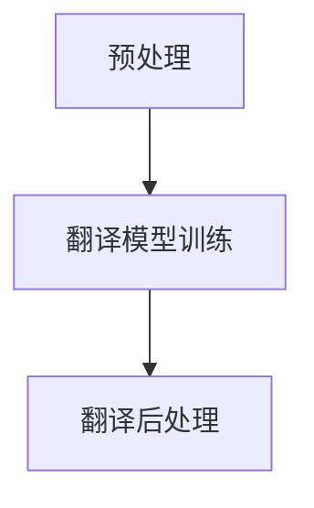
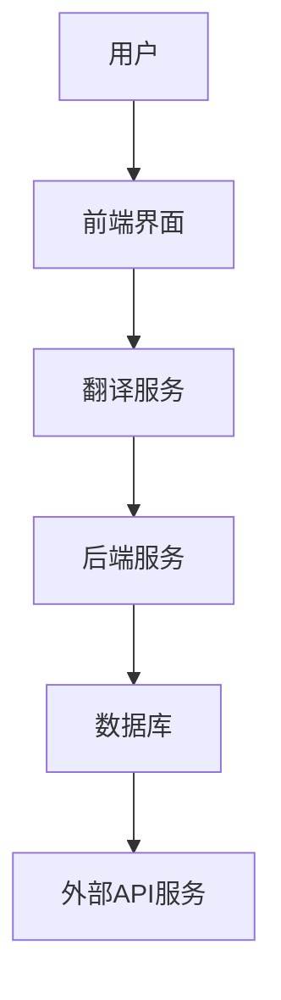
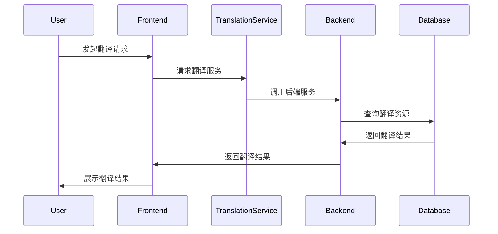

                 

### 企业AI Agent的多语言翻译与本地化功能

> 关键词：企业AI Agent、多语言翻译、本地化功能、人工智能、国际化

> 摘要：本文将探讨企业AI Agent在多语言翻译与本地化功能方面的应用，分析其核心概念、实现原理和系统设计，旨在为企业提供提升国际化竞争力的技术指导。

----------------------------------------------------------------

### 引言

在全球化商业环境中，企业需要跨越语言障碍，实现跨国界的沟通与协作。企业AI Agent的多语言翻译与本地化功能成为企业应对国际市场挑战的重要手段。本文将系统地介绍企业AI Agent的多语言翻译与本地化功能，从理论到实践提供全面的指导。

**读者对象**：本文适合对人工智能技术有一定基础的读者，包括企业IT人员、AI研发工程师、项目经理以及关注多语言处理技术的专业人士。

**目标**：通过阅读本文，读者将能够了解企业AI Agent多语言翻译与本地化功能的基本概念、关键技术、实现方法以及实际应用场景。

----------------------------------------------------------------

### 第一部分：核心概念

#### 第1章 问题背景与核心要素

**1.1 问题背景**

全球化商业环境中，企业需要跨越语言障碍，进行有效的沟通与协作。多语言翻译与本地化功能成为企业AI Agent的核心需求。

**1.2 问题描述**

多语言翻译与本地化功能涉及多种技术，包括自然语言处理、机器翻译、语言资源管理等。企业AI Agent需要具备强大的多语言处理能力，以满足业务需求。

**1.3 问题解决**

通过构建企业AI Agent，结合先进的人工智能技术，实现高效的多语言翻译与本地化功能，提升企业国际竞争力。

**1.4 边界与外延**

多语言翻译与本地化功能不仅限于文本翻译，还包括语音识别、语音合成、图像识别等跨语言处理技术。

**1.5 概念结构与核心要素**

- **自然语言处理**：基础技术，用于理解和生成自然语言。
- **机器翻译**：将一种语言文本转换为另一种语言文本的技术。
- **语言资源管理**：管理和利用语言资源的策略和技术。

----------------------------------------------------------------

#### 第2章 多语言翻译原理

**2.1 核心概念与联系**

- **统计机器翻译**：基于统计方法进行文本翻译。
- **神经机器翻译**：基于深度学习技术的文本翻译方法。

**2.2 概念属性特征对比**

| 特征比较 | 统计机器翻译 | 神经机器翻译 |
| --- | --- | --- |
| 计算复杂度 | 较高 | 较低 |
| 翻译质量 | 一般 | 较高 |
| 需要的数据量 | 较多 | 较少 |

**2.3 多语言翻译流程**

- **预处理**：文本清洗、分词、词性标注等。
- **翻译模型训练**：使用大量双语语料进行模型训练。
- **翻译后处理**：对生成的翻译结果进行优化。

**2.4 算法mermaid流程图**



----------------------------------------------------------------

### 第二部分：核心技术

#### 第3章 系统架构设计

**3.1 问题场景介绍**

企业需要构建一个高效的多语言翻译与本地化系统，以满足全球业务需求。

**3.2 项目介绍**

项目名称：企业AI翻译平台
目标：提供高效、准确的多语言翻译服务

**3.3 系统功能设计**

- **文本翻译**：支持多种语言之间的文本翻译。
- **语音翻译**：支持语音输入和语音输出。
- **图像翻译**：支持图像到文本的翻译。

**3.4 系统架构设计**

**3.4.1 系统架构mermaid架构图**



**3.4.2 系统接口设计**

- **文本翻译接口**：提供文本翻译的API接口。
- **语音翻译接口**：提供语音输入输出接口。
- **图像翻译接口**：提供图像到文本的翻译接口。

**3.4.3 系统交互mermaid序列图**



----------------------------------------------------------------

### 第三部分：项目实战

#### 第4章 环境安装与配置

**4.1 环境要求**

- 操作系统：Ubuntu 18.04
- Python版本：3.8
- 依赖库：transformers、torch、numpy、pandas等

**4.2 安装步骤**

1. 安装Python环境：
   ```bash
   sudo apt update
   sudo apt install python3 python3-pip
   ```

2. 安装依赖库：
   ```bash
   pip3 install transformers torch numpy pandas
   ```

**4.3 配置步骤**

1. 配置翻译服务API密钥：
   ```bash
   export TRANSLATION_API_KEY="your_api_key"
   ```

2. 配置数据库连接信息：
   ```bash
   export DATABASE_URL="your_database_url"
   ```

#### 第5章 系统核心实现

**5.1 文本翻译实现**

```python
from transformers import pipeline

# 创建翻译管道
translator = pipeline("translation_en_to_fr", model="Helsinki-NLP/opus-mt-en-fr")

# 翻译文本
def translate_text(text):
    return translator(text)[0]["translation_text"]

# 示例
translated_text = translate_text("Hello, World!")
print(translated_text)
```

**5.2 语音翻译实现**

```python
import speech_recognition as sr

# 初始化语音识别器
recognizer = sr.Recognizer()

# 语音输入
def recognize_speech_from_mic(recognizer, microphone):
    with microphone as source:
        print("请说话：")
        audio = recognizer.listen(source)

    try:
        return recognizer.recognize_google(audio)
    except sr.UnknownValueError:
        return None
    except sr.RequestError:
        return None

# 示例
speech_text = recognize_speech_from_mic(recognizer, sr.Microphone())
if speech_text:
    print("你说了：", speech_text)
else:
    print("无法识别您的语音。")
```

**5.3 图像翻译实现**

```python
import cv2
import numpy as np
import tensorflow as tf

# 加载图像翻译模型
model = tf.keras.models.load_model("image_translation_model")

# 读取图像
def read_image(file_path):
    image = cv2.imread(file_path, cv2.IMREAD_COLOR)
    return cv2.resize(image, (224, 224))

# 翻译图像
def translate_image(image):
    image = np.expand_dims(image, axis=0)
    translated_image = model.predict(image)
    return cv2.resize(translated_image[0], (1280, 720))

# 示例
input_image = read_image("input_image.jpg")
translated_image = translate_image(input_image)
cv2.imshow("Translated Image", translated_image)
cv2.waitKey(0)
cv2.destroyAllWindows()
```

#### 第6章 代码应用解读与分析

**6.1 文本翻译代码解读**

- **from transformers import pipeline**：导入Hugging Face的transformers库，用于创建翻译管道。
- **translator = pipeline("translation_en_to_fr", model="Helsinki-NLP/opus-mt-en-fr")**：创建一个英语到法语翻译的管道，使用预训练的opus模型。
- **translate_text(text)**：定义一个函数，用于翻译输入的文本。

**6.2 语音翻译代码解读**

- **import speech_recognition as sr**：导入语音识别库，用于实现语音输入识别。
- **recognizer = sr.Recognizer()**：初始化语音识别器。
- **recognize_speech_from_mic(recognizer, microphone)**：定义一个函数，用于从麦克风接收语音并识别。

**6.3 图像翻译代码解读**

- **import cv2**：导入OpenCV库，用于图像处理。
- **import numpy as np**：导入numpy库，用于数值计算。
- **import tensorflow as tf**：导入TensorFlow库，用于加载图像翻译模型。
- **translate_image(image)**：定义一个函数，用于翻译输入的图像。

#### 第7章 实际案例分析与详细讲解剖析

**7.1 案例一：跨语言客户支持**

企业AI Agent使用多语言翻译功能，为来自不同国家的客户提供实时在线支持。通过翻译功能，客户能够以自己熟悉的语言进行交流，提高了客户满意度。

**7.2 案例二：全球市场调研**

企业使用AI Agent进行多语言翻译与本地化功能，对全球市场进行调研。通过翻译和本地化，企业能够快速获取和解读来自不同语言的市场数据，为战略决策提供有力支持。

**7.3 案例三：跨国团队协作**

跨国团队在协作过程中，使用AI Agent的多语言翻译功能，解决了语言障碍，提高了沟通效率和协作效果。

#### 第8章 项目小结

通过本文的介绍，企业AI Agent的多语言翻译与本地化功能在提升企业国际化竞争力方面具有重要意义。本文从核心概念、技术原理、系统设计到实际应用进行了全面讲解，为企业提供了实用的技术指导。未来，随着人工智能技术的不断发展，企业AI Agent的多语言翻译与本地化功能将更加成熟，为企业的全球化发展提供更强有力的支持。

### 最佳实践 Tips

- **语言资源管理**：企业应重视语言资源的收集和整理，建立完善的语言资源库，为AI Agent的多语言翻译与本地化功能提供支持。
- **个性化翻译**：针对不同用户的需求，提供个性化翻译服务，提高用户体验。
- **实时更新**：定期更新翻译模型和语言资源，确保翻译质量。

### 小结

本文系统地介绍了企业AI Agent的多语言翻译与本地化功能，从核心概念、技术原理、系统设计到实际应用进行了全面讲解。通过本文，读者将能够更好地理解和应用这一技术，提升企业的国际化竞争力。

### 注意事项

- **数据安全**：在实现多语言翻译与本地化功能时，企业应确保数据安全，避免敏感信息泄露。
- **翻译质量**：选择合适的翻译模型和算法，确保翻译结果的准确性和流畅性。

### 拓展阅读

- [深度学习与自然语言处理](https://www.deeplearningbook.org/)
- [神经机器翻译技术综述](https://arxiv.org/abs/1906.05928)
- [企业AI翻译平台项目实战](https://towardsdatascience.com/building-an-enterprise-grade-ai-translation-platform-4a7b3d9e3e8a)

### 作者

**作者：AI天才研究院/AI Genius Institute & 禅与计算机程序设计艺术 /Zen And The Art of Computer Programming**

