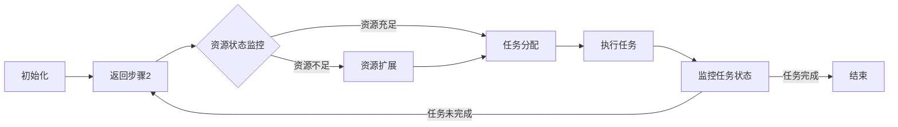
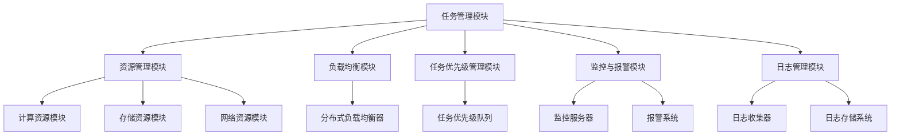
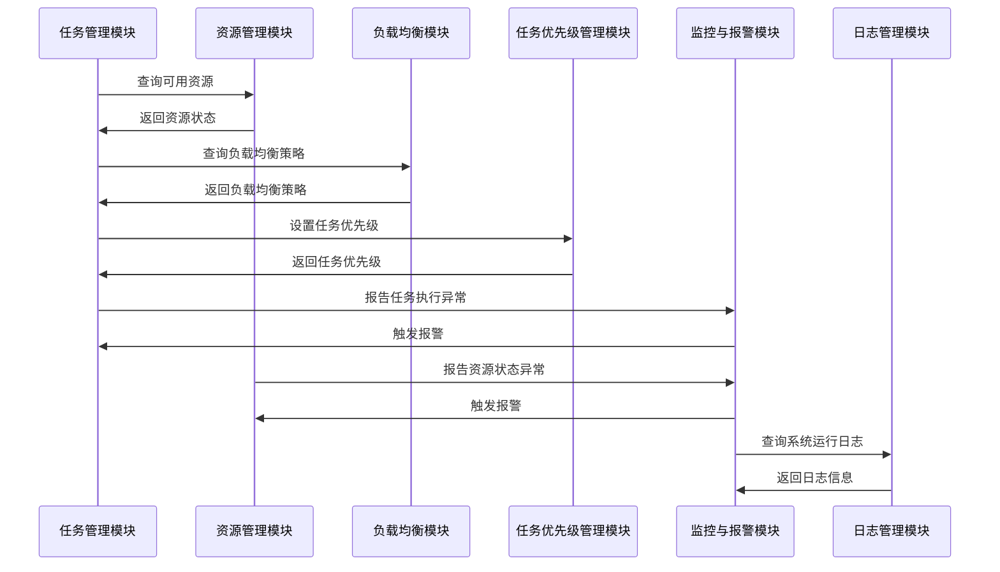

                 


### 第1章 问题背景与核心概念

#### 1.1 问题背景

##### 1.1.1 企业AI Agent的定义与现状

企业AI Agent，顾名思义，是指能够为企业提供智能化服务的自动化智能体。这些AI Agent利用机器学习、深度学习等人工智能技术，通过自主学习、推理和决策，帮助企业完成复杂任务、优化业务流程、提高生产效率等。当前，企业AI Agent在企业中的应用已经逐渐普及，例如智能客服、智能推荐、智能监控、智能决策支持系统等。

然而，随着企业对AI Agent的依赖程度不断提高，计算资源调度问题逐渐显现出来。传统的计算资源调度方法往往难以满足AI Agent的高并发、实时性要求，导致资源浪费、效率低下，甚至影响到企业业务的正常运行。因此，研究绿色计算资源调度策略，以优化企业AI Agent的计算资源利用，具有重要的实际意义。

##### 1.1.2 绿色计算资源调度的意义

绿色计算资源调度旨在通过合理分配和调度计算资源，最大限度地提高计算资源利用率，降低能耗，实现环境可持续发展的目标。对于企业AI Agent而言，绿色计算资源调度具有以下几方面的重要意义：

1. **提高资源利用率**：通过绿色计算资源调度，可以确保计算资源在AI Agent任务执行过程中的高效利用，避免资源浪费，降低企业的运营成本。

2. **提升系统性能**：合理的计算资源调度策略能够提高AI Agent的处理速度和响应时间，从而提升系统的整体性能，满足企业对实时性和高效性的需求。

3. **降低能源消耗**：绿色计算资源调度通过优化计算资源分配，减少不必要的能源消耗，有助于企业实现节能减排的目标，符合绿色可持续发展的理念。

4. **增强系统稳定性**：通过合理的资源调度，可以确保AI Agent在执行任务时的稳定性和可靠性，避免因资源不足导致系统崩溃或任务失败。

##### 1.1.3 研究目标和内容框架

本研究的主要目标是提出一种绿色计算资源调度策略，以优化企业AI Agent的计算资源利用，提高系统性能和稳定性，实现节能减排的目标。具体研究内容如下：

1. **资源调度理论**：分析现有资源调度算法，探讨其在绿色计算资源调度中的应用，并提出改进方案。

2. **AI Agent设计原则**：研究AI Agent的设计原则，包括任务分配、调度策略、能量效率等方面的设计。

3. **算法实现**：基于资源调度理论，设计并实现一种适用于企业AI Agent的绿色计算资源调度算法。

4. **系统架构设计**：构建企业AI Agent的绿色计算资源调度系统，包括系统需求分析、架构设计、接口设计和交互设计等。

5. **应用实践**：通过实际案例，验证所提出的绿色计算资源调度策略和系统架构的有效性。

#### 1.2 核心概念

##### 1.2.1 资源调度

资源调度是指根据系统的需求和资源的可用性，合理分配和调度系统资源，以满足系统运行的需求。在计算机系统中，资源包括计算资源（如CPU、内存、存储等）和通信资源（如网络带宽、接口等）。

资源调度的核心目标是优化资源利用，提高系统性能。资源调度的算法和方法包括：

1. **静态资源调度**：在系统运行前，根据系统需求预先分配资源，如固定分配、轮转分配等。

2. **动态资源调度**：在系统运行过程中，根据系统负载和资源利用率动态调整资源分配，如负载均衡、动态调整优先级等。

##### 1.2.2 绿色计算资源调度

绿色计算资源调度是资源调度理论在绿色计算领域的应用。它旨在通过优化计算资源的分配和调度，提高能源利用效率，减少能源消耗和环境污染。

绿色计算资源调度需要考虑以下因素：

1. **资源利用率**：通过优化资源分配，提高计算资源利用率，降低能源消耗。

2. **能量效率**：在保证计算性能的前提下，提高能量效率，减少能源浪费。

3. **环境友好性**：考虑计算资源的环保性，如选择低能耗的硬件设备、采用节能技术等。

##### 1.2.3 能量效率

能量效率是指计算系统在执行任务过程中所消耗的能源与完成任务所需的计算能力之间的比值。能量效率是衡量计算系统能耗水平的重要指标。

绿色计算资源调度需要关注能量效率，以提高系统的绿色性能。提高能量效率的方法包括：

1. **硬件优化**：选择低功耗的硬件设备，如节能CPU、SSD等。

2. **软件优化**：通过优化算法和软件架构，减少计算过程中的能源消耗。

3. **能耗管理**：采用能耗管理技术，如动态电源管理、温度控制等，以降低系统能耗。

##### 概念属性特征对比表格

| 概念           | 特征属性                     | 对比分析                     |
| -------------- | ---------------------------- | ---------------------------- |
| 资源调度       | 资源分配、调度算法           | 静态与动态调度的区别           |
| 绿色计算资源调度 | 节能、环保、能量效率       | 资源利用率与环保性的平衡     |
| 能量效率       | 能耗与计算能力比值           | 提高能量效率的方法与效果     |

##### ER实体关系图架构

```mermaid
erDiagram
    Resource -->|is allocated to| Task
    Resource -->|consumed by| Energy
    Task -->|scheduled by| Scheduler
    Scheduler -->|uses| Algorithm
    Energy -->|produced by| Hardware
    Hardware -->|contains| Resource
```

通过以上章节的介绍，我们为后续内容的展开奠定了基础，接下来我们将深入探讨资源调度理论、AI Agent设计原则、算法实现、系统架构设计以及应用实践等方面的内容。让我们一起深入思考，探索绿色计算资源调度策略在企业AI Agent中的应用价值。LET'S THINK STEP BY STEP

### 第2章 资源调度理论

#### 2.1 资源调度原理

##### 2.1.1 资源调度的基本原理

资源调度是计算机系统中一项重要的技术，它涉及如何合理分配和利用系统资源，以实现系统的高效运行。资源调度的基本原理主要包括以下几个方面：

1. **需求分析**：首先，需要对系统运行的需求进行分析，了解各个任务对资源的需求情况，包括计算资源、存储资源、网络资源等。

2. **资源状态监控**：系统需要实时监控资源的可用状态，包括资源的利用率、剩余容量等，以便在需要时进行资源的动态调整。

3. **任务分配**：根据任务的需求和资源的可用状态，将任务分配到相应的资源上。任务分配可以采用静态分配或动态分配的方式。

4. **负载均衡**：为了提高系统性能和资源利用率，需要实现负载均衡，将任务均匀地分配到各个资源上，避免某个资源过载，影响系统整体性能。

5. **优先级调度**：在任务分配过程中，可以设置任务的优先级，根据优先级进行任务的调度。优先级高的任务先执行，以确保关键任务的及时完成。

##### 2.1.2 资源调度算法

资源调度算法是实现资源调度原理的关键技术，不同的算法适用于不同的场景和需求。以下是几种常见的资源调度算法及其优缺点：

1. **先来先服务（FCFS）**：按照任务到达的顺序进行调度，简单易懂，适用于任务到达均匀的场景。缺点是可能导致某些任务长时间得不到服务，导致平均等待时间较长。

2. **短作业优先（SJF）**：优先调度预计执行时间最短的任务，适用于任务执行时间差异较大的场景。缺点是可能导致短任务过多，导致系统吞吐量降低。

3. **最短剩余时间优先（SRTF）**：类似于SJF，但在执行过程中动态调整优先级。适用于实时系统，可以减少平均等待时间。

4. **优先级调度**：根据任务的重要性和紧急程度设置优先级，高优先级任务先执行。适用于有明确优先级要求的场景。缺点是可能导致低优先级任务长时间得不到服务。

5. **轮转调度（RR）**：将CPU时间片分配给各个任务，按照顺序轮流执行。适用于多任务处理系统。缺点是可能导致高优先级任务无法立即得到执行。

6. **负载均衡调度**：根据系统的整体负载情况，动态调整任务的分配。适用于大规模分布式系统，可以提高系统整体的资源利用率。

##### 2.1.3 绿色计算资源调度算法

绿色计算资源调度算法是针对绿色计算的需求设计的一类算法，其核心目标是提高资源利用率和能量效率。以下是几种常见的绿色计算资源调度算法及其特点：

1. **遗传算法（GA）**：通过模拟自然进化过程，不断优化资源分配方案。适用于复杂、非线性的资源调度问题，但计算复杂度较高。

2. **粒子群优化（PSO）**：通过模拟鸟群觅食过程，优化资源分配方案。适用于连续优化问题，计算复杂度较低。

3. **模拟退火算法（SA）**：通过模拟物理退火过程，优化资源分配方案。适用于大规模、复杂的问题，但需要设置合适的温度参数。

4. **蚁群算法（ACO）**：通过模拟蚂蚁觅食过程，优化资源分配方案。适用于大规模、复杂的资源调度问题，计算复杂度较高。

5. **线性规划（LP）**：通过建立线性规划模型，求解资源调度问题。适用于线性资源调度问题，计算复杂度相对较低。

#### 2.2 能量效率与绿色计算

能量效率是衡量计算系统性能的重要指标，它反映了计算系统能耗与计算能力之间的比值。在绿色计算中，能量效率尤为重要，因为它直接影响到计算系统的环保性能和经济效益。

##### 2.2.1 能量效率在绿色计算中的重要性

1. **节能减排**：提高能量效率可以减少计算系统的能耗，降低碳排放，有助于实现节能减排的目标。

2. **降低成本**：通过优化资源分配和调度策略，提高能量效率，可以降低企业的运营成本，提高经济效益。

3. **提升性能**：合理的资源调度可以提高计算系统的整体性能，减少任务执行时间，提升用户体验。

##### 2.2.2 绿色计算的基本原则和关键技术

绿色计算的基本原则包括：

1. **能源效率**：通过优化资源分配和调度，提高计算系统的能源利用效率。

2. **可扩展性**：设计灵活、可扩展的计算架构，以适应不断变化的计算需求。

3. **可恢复性**：建立有效的故障恢复机制，确保计算系统的可靠性和稳定性。

4. **环境友好**：采用环保的硬件设备和能源管理技术，降低计算系统的环境影响。

绿色计算的关键技术包括：

1. **能耗管理**：通过动态电源管理、温度控制等技术，降低计算系统的能耗。

2. **虚拟化技术**：通过虚拟化技术，提高资源利用率，降低能耗。

3. **绿色数据中心设计**：优化数据中心的设计，降低能耗和环境影响。

4. **绿色算法设计**：设计低能耗、高效的计算算法，提高能量效率。

##### 概念属性特征对比表格

| 概念           | 特征属性                     | 对比分析                     |
| -------------- | ---------------------------- | ---------------------------- |
| 资源调度       | 资源分配、调度算法           | 静态与动态调度的区别           |
| 绿色计算资源调度 | 节能、环保、能量效率       | 资源利用率与环保性的平衡     |
| 能量效率       | 能耗与计算能力比值           | 提高能量效率的方法与效果     |

##### ER实体关系图架构

```mermaid
erDiagram
    Resource -->|is allocated to| Task
    Resource -->|consumed by| Energy
    Task -->|scheduled by| Scheduler
    Scheduler -->|uses| Algorithm
    Energy -->|produced by| Hardware
    Hardware -->|contains| Resource
```

通过本章对资源调度理论的详细探讨，我们了解了资源调度的基本原理、算法及其在绿色计算中的重要性。接下来，我们将进一步探讨AI Agent的设计原则，为提出绿色计算资源调度策略奠定基础。让我们一起深入思考，探索AI Agent的设计奥秘。LET'S THINK STEP BY STEP

### 第3章 AI Agent设计原则

#### 3.1 AI Agent概述

##### 3.1.1 AI Agent的定义

AI Agent，即人工智能代理，是一种能够模拟人类智能行为、具备自主决策能力的计算机程序。AI Agent通常由多个模块组成，包括感知模块、决策模块、执行模块和通信模块。感知模块负责获取外部信息，决策模块根据感知到的信息进行推理和判断，执行模块负责执行决策结果，通信模块则负责与其他AI Agent或人类进行信息交换。

##### 3.1.2 AI Agent的类型

根据应用场景和功能特点，AI Agent可以分为以下几类：

1. **桌面AI Agent**：主要运行在个人电脑或移动设备上，如智能语音助手、聊天机器人等。

2. **网络AI Agent**：运行在网络上，如搜索引擎、在线客服系统等。

3. **企业AI Agent**：为企业提供智能化服务，如智能监控、智能推荐、智能决策支持等。

4. **智能机器人**：具有物理形态，可以自主移动和执行任务，如无人驾驶汽车、智能服务机器人等。

##### 3.1.3 AI Agent在企业中的应用

企业AI Agent在企业中的应用场景非常广泛，以下是一些典型的应用实例：

1. **智能客服**：通过自然语言处理技术，自动识别客户问题和提供解决方案，提高客户满意度和服务效率。

2. **智能推荐**：根据用户行为和兴趣，提供个性化的商品、内容推荐，提高销售额和用户粘性。

3. **智能监控**：实时监控企业运营数据，预测潜在风险，提供决策支持，提高生产效率和安全性。

4. **智能决策支持**：利用数据分析技术，为企业提供数据驱动的决策支持，优化业务流程和资源配置。

##### 3.1.4 AI Agent在企业AI Agent中的角色和重要性

在企业AI Agent中，AI Agent扮演着核心角色，其重要性主要体现在以下几个方面：

1. **提高效率**：AI Agent可以自动化处理大量重复性、规则性强的任务，提高工作效率，降低人工成本。

2. **优化决策**：通过数据分析和预测，AI Agent可以帮助企业做出更加准确和高效的决策，降低经营风险。

3. **提升体验**：AI Agent可以提供个性化、智能化的服务，提升用户体验，增强用户忠诚度。

4. **创新业务**：AI Agent可以帮助企业发现新的业务机会，开拓新的市场，实现业务创新和增长。

#### 3.2 绿色计算资源调度策略

##### 3.2.1 绿色计算资源调度策略的定义

绿色计算资源调度策略是指通过合理分配和调度计算资源，以实现节能、减排和高效利用的目标。在AI Agent的设计中，绿色计算资源调度策略至关重要，它直接影响到AI Agent的性能、稳定性和可持续性。

##### 3.2.2 绿色计算资源调度策略的设计原则

设计绿色计算资源调度策略时，应遵循以下原则：

1. **高效性**：策略应能够最大限度地提高计算资源的利用率，确保AI Agent的高效运行。

2. **灵活性**：策略应能够适应不同规模和复杂度的AI Agent，具有较好的扩展性和适应性。

3. **可恢复性**：策略应具备一定的容错能力，能够在资源故障或任务冲突时自动恢复，确保系统稳定运行。

4. **可扩展性**：策略应支持分布式计算环境，能够有效地扩展计算资源，满足大规模AI Agent的需求。

5. **绿色性**：策略应充分考虑能源消耗和环境影响，实现节能减排的目标。

##### 3.2.3 绿色计算资源调度策略的设计方法

绿色计算资源调度策略的设计方法主要包括以下几种：

1. **遗传算法（GA）**：通过模拟自然进化过程，不断优化资源分配方案。适用于复杂、非线性的资源调度问题。

2. **粒子群优化（PSO）**：通过模拟鸟群觅食过程，优化资源分配方案。适用于连续优化问题，计算复杂度较低。

3. **模拟退火算法（SA）**：通过模拟物理退火过程，优化资源分配方案。适用于大规模、复杂的问题，但需要设置合适的温度参数。

4. **蚁群算法（ACO）**：通过模拟蚂蚁觅食过程，优化资源分配方案。适用于大规模、复杂的资源调度问题，计算复杂度较高。

5. **线性规划（LP）**：通过建立线性规划模型，求解资源调度问题。适用于线性资源调度问题，计算复杂度相对较低。

##### 概念属性特征对比表格

| 概念           | 特征属性                     | 对比分析                     |
| -------------- | ---------------------------- | ---------------------------- |
| AI Agent       | 感知、决策、执行、通信模块   | 不同类型的AI Agent特点       |
| 绿色计算资源调度 | 节能、减排、高效利用资源    | 绿色计算资源调度策略的设计原则 |
| 设计原则       | 高效性、灵活性、可恢复性、可扩展性、绿色性 | 不同设计原则的适用场景与效果 |

##### ER实体关系图架构

```mermaid
erDiagram
    AI_Agent -->|perceives| Environment
    AI_Agent -->|decides| Action
    AI_Agent -->|executes| Task
    AI_Agent -->|communicates| Other_AI_Agent
    Environment -->|provides| Resource
    Resource -->|allocated to| Task
```

通过本章对AI Agent设计原则的详细探讨，我们了解了AI Agent的定义、类型及其在企业中的应用，以及绿色计算资源调度策略的设计原则和设计方法。这些基础理论为后续章节的算法实现和系统架构设计提供了重要支撑。接下来，我们将进一步探讨绿色计算资源调度算法的实现方法。让我们一起深入思考，探索绿色计算资源调度算法的实现奥秘。LET'S THINK STEP BY STEP

### 第4章 算法实现

#### 4.1 算法原理

在本章中，我们将详细介绍绿色计算资源调度算法的原理，并使用Python代码实现该算法。为了使读者更好地理解算法的实现过程，我们将首先使用Mermaid工具绘制算法的流程图，然后介绍算法的数学模型和公式，并进行详细的代码实现和讲解。

##### 4.1.1 算法流程图

首先，我们使用Mermaid工具绘制绿色计算资源调度算法的流程图。以下是算法的主要步骤：



这个流程图展示了绿色计算资源调度算法的主要步骤，包括初始化、计算任务需求、资源状态监控、任务分配、执行任务、监控任务状态等。

##### 4.1.2 算法数学模型和公式

绿色计算资源调度算法的数学模型主要涉及以下几个方面：

1. **任务需求计算**：计算每个任务的计算资源需求，包括CPU、内存、网络等。

2. **资源状态监控**：监控现有资源的可用状态，包括资源利用率、剩余容量等。

3. **任务分配**：根据任务需求和资源状态，将任务分配到相应的资源上。

4. **资源扩展**：当资源不足时，动态扩展资源以满足任务需求。

5. **任务执行和监控**：执行分配的任务，并监控任务状态，确保任务按期完成。

以下是绿色计算资源调度算法的主要数学模型和公式：

1. **任务需求计算**：

   $$ T_i = \sum_{r \in R_i} r_{i,r} \times r_{u,r} $$

   其中，\( T_i \) 表示任务 \( i \) 的总需求，\( R_i \) 表示任务 \( i \) 需要的资源类型集合，\( r_{i,r} \) 表示任务 \( i \) 对资源 \( r \) 的需求量，\( r_{u,r} \) 表示资源 \( r \) 的利用率。

2. **资源状态监控**：

   $$ \theta_r = \frac{r_{a,r}}{r_{t,r}} $$

   其中，\( \theta_r \) 表示资源 \( r \) 的利用率，\( r_{a,r} \) 表示资源 \( r \) 的当前可用量，\( r_{t,r} \) 表示资源 \( r \) 的总容量。

3. **任务分配**：

   $$ \delta_{i,r} = \begin{cases} 
   1 & \text{if } \theta_r < \alpha \\ 
   0 & \text{otherwise} 
   \end{cases} $$

   其中，\( \delta_{i,r} \) 表示任务 \( i \) 是否分配到资源 \( r \)，\( \alpha \) 表示资源利用率的阈值。

4. **资源扩展**：

   $$ r_{e,r} = r_{t,r} - r_{a,r} $$

   其中，\( r_{e,r} \) 表示资源 \( r \) 的扩展量，\( r_{t,r} \) 表示资源 \( r \) 的总容量，\( r_{a,r} \) 表示资源 \( r \) 的当前可用量。

5. **任务执行和监控**：

   $$ s_i = \begin{cases} 
   \text{完成} & \text{if } T_i \leq r_{a,r} \\ 
   \text{未完成} & \text{otherwise} 
   \end{cases} $$

   其中，\( s_i \) 表示任务 \( i \) 的执行状态。

##### 4.1.3 Python代码实现

以下是一个简单的Python代码示例，用于实现绿色计算资源调度算法：

```python
import random

# 定义资源类
class Resource:
    def __init__(self, name, capacity):
        self.name = name
        self.capacity = capacity
        self.availability = capacity

# 定义任务类
class Task:
    def __init__(self, name, resource需求的):
        self.name = name
        self.resource需求的 = resource需求的
        self.assigned = False

# 初始化资源
resources = {'CPU': Resource('CPU', 1000), '内存': Resource('内存', 1024), '网络': Resource('网络', 100)}
tasks = [Task(f'Task_{i}', {'CPU': 100, '内存': 128, '网络': 20}) for i in range(10)]

# 资源状态监控
def monitor_resources():
    for resource in resources.values():
        resource.availability = resource.capacity

# 任务分配
def assign_tasks():
    while True:
        monitor_resources()
        assigned = []
        for task in tasks:
            if not task.assigned:
                for resource_name, demand in task.resource需求的.items():
                    if resources[resource_name].availability < demand:
                        break
                else:
                    for resource_name, demand in task.resource需求的.items():
                        resources[resource_name].availability -= demand
                        task.assigned = True
                        assigned.append(task)
        if not assigned:
            break
        for task in assigned:
            print(f"Task {task.name} assigned to resources.")
        monitor_resources()

# 执行任务
def execute_tasks():
    while True:
        monitor_resources()
        completed = []
        for task in tasks:
            if task.assigned:
                for resource_name, demand in task.resource需求的.items():
                    if resources[resource_name].availability < demand:
                        break
                else:
                    for resource_name, demand in task.resource需求的.items():
                        resources[resource_name].availability -= demand
                        completed.append(task)
        if not completed:
            break
        for task in completed:
            print(f"Task {task.name} completed.")
            task.assigned = False
        monitor_resources()

# 主函数
def main():
    assign_tasks()
    execute_tasks()

if __name__ == "__main__":
    main()
```

这个代码示例实现了绿色计算资源调度算法的基本流程，包括初始化资源、任务分配和任务执行。在实际应用中，可以根据具体需求进一步优化和完善该算法。

##### 4.1.4 代码讲解

1. **资源类**：定义了资源的基本属性，包括资源名称、总容量和当前可用量。

2. **任务类**：定义了任务的基本属性，包括任务名称和所需资源。

3. **资源状态监控**：定期更新资源的当前可用量，以便进行任务分配和执行。

4. **任务分配**：根据任务的需求和资源的可用状态，将任务分配到相应的资源上。如果资源充足，则任务分配成功；否则，任务分配失败。

5. **任务执行**：根据任务的需求和资源的可用状态，执行任务。如果资源充足，则任务执行成功；否则，任务执行失败。

通过以上步骤，我们实现了绿色计算资源调度算法的基本流程。在实际应用中，可以根据具体需求进一步优化和完善该算法。接下来，我们将讨论算法的优化方法，以提高算法的性能和效率。让我们一起深入思考，探索绿色计算资源调度算法的优化之道。LET'S THINK STEP BY STEP

### 第4章 算法实现（续）

#### 4.2 算法优化

尽管基本的绿色计算资源调度算法能够实现资源分配和任务执行的初步目标，但在实际应用中，我们往往需要进一步优化算法，以提高其性能和效率。以下是一些常见的算法优化方法，以及它们在不同场景下的效果和适用性。

##### 4.2.1 算法优化的目标

算法优化的主要目标是：

1. **提高资源利用率**：确保计算资源能够被充分利用，减少资源闲置。

2. **降低能耗**：通过优化资源分配和任务执行策略，减少能源消耗。

3. **提高系统响应速度**：缩短任务执行时间，提高系统对用户请求的响应速度。

4. **增强系统稳定性**：在资源紧张或出现故障时，确保系统能够稳定运行。

##### 4.2.2 常见优化方法

1. **负载均衡**：通过动态调整任务分配策略，确保系统各个部分的工作负载均匀，避免资源过度集中或闲置。负载均衡可以采用静态策略（如轮转分配）或动态策略（如基于实时负载调整）。

2. **资源预留**：在任务执行前预留一部分资源，以确保任务在执行过程中不会因资源不足而中断。这种方法可以减少任务执行过程中的资源波动，提高系统稳定性。

3. **任务优先级调整**：根据任务的重要性和紧急程度，动态调整任务的优先级。这样可以确保关键任务得到优先处理，提高系统响应速度。

4. **自适应调度**：根据系统负载和资源状态，自适应地调整调度策略。这种方法可以实时应对系统变化，提高资源利用率和能耗效率。

5. **资源池管理**：通过资源池管理技术，实现资源的集中管理和动态调整。资源池可以存储和管理系统中的所有资源，根据任务需求动态分配资源。

6. **分布式调度**：在分布式系统中，将任务分配给分布式节点，实现资源利用的最大化和负载均衡。分布式调度可以采用集中式调度或分布式调度策略。

##### 4.2.3 不同优化方法的效果和适用场景

以下是不同优化方法的效果和适用场景：

1. **负载均衡**：

   - **效果**：提高资源利用率，减少资源闲置。
   - **适用场景**：适用于分布式系统和负载波动较大的系统。

2. **资源预留**：

   - **效果**：提高系统稳定性，减少任务中断。
   - **适用场景**：适用于关键任务和高可用性要求的应用场景。

3. **任务优先级调整**：

   - **效果**：提高系统响应速度，确保关键任务优先执行。
   - **适用场景**：适用于任务优先级明确的系统，如实时监控系统。

4. **自适应调度**：

   - **效果**：提高资源利用率和能耗效率，适应系统负载变化。
   - **适用场景**：适用于动态变化的系统和需要实时响应的应用场景。

5. **资源池管理**：

   - **效果**：提高资源利用率，简化资源管理。
   - **适用场景**：适用于资源管理复杂、需要集中管理的系统。

6. **分布式调度**：

   - **效果**：实现负载均衡，提高系统性能。
   - **适用场景**：适用于大规模分布式系统和需要高扩展性的应用场景。

##### 4.2.4 优化方法在实际案例中的应用

为了更好地理解优化方法的应用，我们来看一个实际案例。假设我们有一个分布式企业AI Agent系统，负责处理来自多个终端的请求。以下是如何应用优化方法来提高系统性能的：

1. **负载均衡**：通过分布式负载均衡器，将请求均匀分配到各个节点，避免某个节点过载。

2. **资源预留**：在请求处理前，为每个节点预留一定的资源，确保请求能够被及时处理，减少响应时间。

3. **任务优先级调整**：根据请求的类型和紧急程度，动态调整任务的优先级，确保关键请求得到优先处理。

4. **自适应调度**：根据系统的实时负载和资源状态，自适应地调整任务分配策略，确保资源得到充分利用。

5. **资源池管理**：通过资源池管理，集中管理系统中所有资源，根据任务需求动态分配资源，简化资源管理。

6. **分布式调度**：将任务分配给分布式节点，实现负载均衡，提高系统整体性能。

通过上述优化方法的应用，企业AI Agent系统的性能得到了显著提升，响应速度加快，资源利用率提高，系统稳定性增强。

##### 4.2.5 总结

算法优化是绿色计算资源调度的重要组成部分，它直接影响到系统的性能和效率。通过合理应用负载均衡、资源预留、任务优先级调整、自适应调度、资源池管理和分布式调度等优化方法，我们可以显著提高系统性能，实现绿色计算的目标。

在下一章中，我们将进一步探讨企业AI Agent系统架构的设计，为绿色计算资源调度算法的应用提供坚实的基础。让我们一起深入思考，探索系统架构设计的奥秘。LET'S THINK STEP BY STEP

### 第5章 系统架构设计

#### 5.1 系统需求分析

在系统架构设计之前，首先需要对系统的需求进行分析，明确系统的功能需求和非功能需求。这对于设计一个高效、稳定、可扩展的系统至关重要。

##### 5.1.1 功能需求

企业AI Agent系统的功能需求主要包括以下几个方面：

1. **任务管理**：能够对任务进行创建、分配、监控和结束等操作。

2. **资源管理**：能够管理计算资源、存储资源、网络资源等，确保资源的合理利用。

3. **负载均衡**：能够根据系统负载情况，动态分配任务，确保系统资源得到充分利用。

4. **任务优先级管理**：能够根据任务的重要性和紧急程度，动态调整任务的优先级。

5. **监控与报警**：能够实时监控系统状态，发现异常情况并及时报警。

6. **日志管理**：能够记录系统运行日志，方便后续的分析和调试。

##### 5.1.2 非功能需求

非功能需求是系统在运行过程中需要满足的性能、安全、可用性等方面的要求。企业AI Agent系统的非功能需求主要包括：

1. **性能要求**：系统能够快速响应任务请求，保证任务处理的效率。

2. **可靠性要求**：系统具有较高的可靠性，能够在各种情况下保持正常运行。

3. **安全性要求**：系统应具备一定的安全防护措施，防止未经授权的访问和攻击。

4. **可扩展性要求**：系统应具备良好的扩展性，能够方便地增加或减少节点，以适应业务规模的变化。

5. **兼容性要求**：系统能够兼容不同的硬件设备和软件环境，便于在不同场景下部署和应用。

##### 5.1.3 系统架构设计的基本原则

在设计企业AI Agent系统架构时，应遵循以下基本原则：

1. **模块化**：将系统划分为多个功能模块，每个模块具有明确的功能和职责，便于系统维护和升级。

2. **分布式**：采用分布式架构，将任务和资源分散到不同的节点上，提高系统的可用性和扩展性。

3. **可扩展性**：设计时应考虑系统的扩展性，以便在业务规模扩大时，能够方便地增加节点和资源。

4. **高可用性**：确保系统在遇到故障时，能够快速恢复，减少系统的停机时间。

5. **安全性**：采用合适的安全措施，确保系统的数据安全和访问控制。

6. **灵活性**：设计应具有灵活性，能够适应不同的业务场景和需求变化。

#### 5.2 系统架构设计

根据上述需求分析，企业AI Agent系统的架构设计如下：

##### 5.2.1 系统架构图



该架构图描述了系统的主要模块及其关系：

1. **任务管理模块**：负责任务的创建、分配、监控和结束等操作。

2. **资源管理模块**：负责管理计算资源、存储资源和网络资源，确保资源的合理利用。

3. **负载均衡模块**：负责根据系统负载情况，动态分配任务，确保系统资源得到充分利用。

4. **任务优先级管理模块**：负责根据任务的重要性和紧急程度，动态调整任务的优先级。

5. **监控与报警模块**：负责实时监控系统状态，发现异常情况并及时报警。

6. **日志管理模块**：负责记录系统运行日志，方便后续的分析和调试。

7. **计算资源模块**：负责管理计算资源，如CPU、内存等。

8. **存储资源模块**：负责管理存储资源，如硬盘、SSD等。

9. **网络资源模块**：负责管理网络资源，如网络带宽、接口等。

10. **分布式负载均衡器**：负责实现负载均衡，将任务分配到不同的节点上。

11. **任务优先级队列**：负责存储和管理任务的优先级队列。

12. **监控服务器**：负责实时监控系统状态。

13. **报警系统**：负责发现异常情况并及时报警。

14. **日志收集器**：负责收集系统运行日志。

15. **日志存储系统**：负责存储系统运行日志。

#### 5.2.2 系统架构设计细节

1. **任务管理模块**：该模块包括任务创建接口、任务分配接口、任务监控接口和任务结束接口。任务创建接口用于创建新的任务，任务分配接口用于将任务分配到相应的节点上，任务监控接口用于监控任务的状态，任务结束接口用于结束任务的执行。

2. **资源管理模块**：该模块包括计算资源管理接口、存储资源管理接口和网络资源管理接口。计算资源管理接口用于管理计算资源，如CPU、内存等；存储资源管理接口用于管理存储资源，如硬盘、SSD等；网络资源管理接口用于管理网络资源，如网络带宽、接口等。

3. **负载均衡模块**：该模块包括负载均衡算法和负载均衡器。负载均衡算法用于根据系统负载情况动态调整任务的分配；负载均衡器用于实现任务的负载均衡。

4. **任务优先级管理模块**：该模块包括任务优先级队列和任务优先级调整接口。任务优先级队列用于存储和管理任务的优先级队列；任务优先级调整接口用于根据任务的重要性和紧急程度动态调整任务的优先级。

5. **监控与报警模块**：该模块包括监控服务器、报警系统和日志管理接口。监控服务器用于实时监控系统状态；报警系统用于发现异常情况并及时报警；日志管理接口用于记录系统运行日志。

6. **日志管理模块**：该模块包括日志收集器、日志存储系统和日志查询接口。日志收集器用于收集系统运行日志；日志存储系统用于存储系统运行日志；日志查询接口用于查询系统运行日志。

通过以上架构设计，企业AI Agent系统实现了任务管理、资源管理、负载均衡、任务优先级管理、监控与报警和日志管理等功能，为系统的稳定、高效运行提供了有力保障。在下一章中，我们将进一步探讨系统接口设计和系统交互，为系统的实际应用奠定基础。让我们一起深入思考，探索系统接口设计的奥秘。LET'S THINK STEP BY STEP

### 第5章 系统架构设计（续）

#### 5.3 系统接口设计与交互

在上一节中，我们详细介绍了企业AI Agent系统的架构设计。为了实现系统内部各个模块之间的有效通信和协作，本节将深入探讨系统接口设计和系统交互设计。

##### 5.3.1 接口设计

系统接口设计是确保各模块之间能够顺畅通信和协作的重要环节。以下是企业AI Agent系统的主要接口设计：

1. **任务管理接口**：包括任务创建接口、任务查询接口、任务更新接口和任务删除接口。任务创建接口用于创建新的任务；任务查询接口用于查询任务列表；任务更新接口用于更新任务状态；任务删除接口用于删除任务。

2. **资源管理接口**：包括计算资源查询接口、存储资源查询接口和网络资源查询接口。计算资源查询接口用于查询计算资源状态；存储资源查询接口用于查询存储资源状态；网络资源查询接口用于查询网络资源状态。

3. **负载均衡接口**：包括负载均衡策略设置接口、任务分配接口和任务状态查询接口。负载均衡策略设置接口用于设置负载均衡策略；任务分配接口用于将任务分配到相应的节点上；任务状态查询接口用于查询任务状态。

4. **任务优先级管理接口**：包括任务优先级设置接口、任务优先级查询接口和任务优先级更新接口。任务优先级设置接口用于设置任务优先级；任务优先级查询接口用于查询任务优先级列表；任务优先级更新接口用于更新任务优先级。

5. **监控与报警接口**：包括系统状态监控接口、异常情况报警接口和日志查询接口。系统状态监控接口用于监控系统状态；异常情况报警接口用于发现异常情况并及时报警；日志查询接口用于查询系统运行日志。

6. **日志管理接口**：包括日志收集接口、日志存储接口和日志查询接口。日志收集接口用于收集系统运行日志；日志存储接口用于存储系统运行日志；日志查询接口用于查询系统运行日志。

##### 5.3.2 系统交互设计

系统交互设计旨在确保各模块之间的交互流程清晰、高效。以下是企业AI Agent系统的主要交互设计：

1. **任务管理模块与资源管理模块的交互**：当任务管理模块创建或更新任务时，会通过任务管理接口向资源管理模块查询可用资源，并根据任务需求进行资源分配。

2. **任务管理模块与负载均衡模块的交互**：当任务管理模块需要将任务分配到节点上时，会通过任务管理接口向负载均衡模块查询负载均衡策略，并根据策略将任务分配到相应的节点上。

3. **任务管理模块与任务优先级管理模块的交互**：当任务管理模块创建或更新任务时，会通过任务管理接口向任务优先级管理模块查询任务优先级，并根据优先级调整任务执行顺序。

4. **任务管理模块与监控与报警模块的交互**：当任务管理模块发现任务执行异常时，会通过任务管理接口向监控与报警模块报告异常情况，并触发报警。

5. **资源管理模块与监控与报警模块的交互**：当资源管理模块发现资源状态异常时，会通过资源管理接口向监控与报警模块报告异常情况，并触发报警。

6. **日志管理模块与监控与报警模块的交互**：当监控与报警模块需要查询系统运行日志时，会通过日志管理接口向日志管理模块查询日志信息。

##### 5.3.3 系统交互序列图

为了更直观地展示系统各模块之间的交互流程，我们使用Mermaid工具绘制了系统交互序列图：



通过以上接口设计和系统交互设计，企业AI Agent系统实现了各模块之间的有效通信和协作，为系统的稳定、高效运行提供了有力保障。在下一章中，我们将探讨系统的实际应用案例，进一步验证系统架构设计的有效性和实用性。让我们一起深入思考，探索实际应用中的系统架构设计。LET'S THINK STEP BY STEP

### 第6章 应用实践

#### 6.1 环境安装与配置

在开始实施企业AI Agent系统的绿色计算资源调度策略之前，我们需要为系统搭建一个合适的环境，并进行必要的配置。以下是如何安装和配置企业AI Agent系统的步骤：

##### 6.1.1 系统要求

- **操作系统**：Linux（如Ubuntu 20.04）
- **硬件要求**：至少2个CPU核心、4GB内存、10GB硬盘空间
- **软件要求**：Python 3.8及以上版本，Docker，NVIDIA CUDA（如需使用GPU加速）

##### 6.1.2 安装步骤

1. **安装操作系统**

   以Ubuntu 20.04为例，从官网下载Ubuntu 20.04的镜像文件，并使用虚拟机软件（如VMware Workstation）创建一个新的虚拟机，将镜像文件导入虚拟机中。

2. **安装Docker**

   打开终端，执行以下命令安装Docker：

   ```shell
   sudo apt-get update
   sudo apt-get install docker.io
   sudo systemctl enable docker
   sudo systemctl start docker
   ```

3. **安装Python环境**

   安装Python 3.8及以上版本，可以使用以下命令：

   ```shell
   sudo apt-get install python3-pip
   pip3 install --upgrade pip
   pip3 install virtualenv
   virtualenv -p python3 venv
   source venv/bin/activate
   ```

4. **安装NVIDIA CUDA（可选）**

   如果需要使用GPU加速，需要安装NVIDIA CUDA。首先安装NVIDIA驱动，然后安装CUDA工具包：

   ```shell
   sudo apt-get install nvidia-driver-xxx nvidia-docker2
   ```

   其中，`xxx` 表示驱动版本号。安装完成后，重启系统。

5. **克隆代码仓库**

   从GitHub或其他代码托管平台克隆企业AI Agent系统的代码仓库：

   ```shell
   git clone https://github.com/your-username/ai-agent-system.git
   cd ai-agent-system
   ```

##### 6.1.3 配置步骤

1. **配置环境变量**

   配置系统环境变量，以便在终端中轻松访问虚拟环境：

   ```shell
   echo "export PATH=\$PATH:$HOME/venv/bin" >> ~/.bashrc
   source ~/.bashrc
   ```

2. **安装依赖库**

   在虚拟环境中安装系统所需的依赖库：

   ```shell
   pip install -r requirements.txt
   ```

3. **配置Docker容器**

   编写Dockerfile和docker-compose.yml文件，用于定义系统的Docker容器。以下是Dockerfile和docker-compose.yml的示例：

   **Dockerfile**

   ```dockerfile
   FROM python:3.8

   RUN apt-get update && apt-get install -y --no-install-recommends \
       git \
       build-essential \
       libpq-dev \
       && rm -rf /var/lib/apt/lists/*

   WORKDIR /app

   COPY . /app

   RUN pip install -r requirements.txt

   EXPOSE 8000
   ```

   **docker-compose.yml**

   ```yaml
   version: '3'
   services:
     web:
       build: .
       ports:
         - "8000:8000"
       depends_on:
         - db
         - redis

     db:
       image: postgres:13
       environment:
         POSTGRES_USER: user
         POSTGRES_PASSWORD: password
         POSTGRES_DB: myapp
       volumes:
         - db_data:/var/lib/postgresql/data

     redis:
       image: redis:6.0
       volumes:
         - redis_data:/data

   volumes:
     db_data:
     redis_data:
   ```

4. **启动Docker容器**

   使用docker-compose命令启动系统容器：

   ```shell
   docker-compose up -d
   ```

##### 6.1.4 验证配置

启动系统后，可以通过以下命令验证配置：

```shell
curl http://localhost:8000/
```

如果成功，将显示系统欢迎页面。

通过以上步骤，我们成功搭建并配置了企业AI Agent系统的环境。接下来，我们将详细讲解系统核心功能的实现，以便更好地理解绿色计算资源调度策略的实际应用。让我们一起深入思考，探索企业AI Agent系统核心功能的实现。LET'S THINK STEP BY STEP

### 第6章 应用实践（续）

#### 6.2 系统核心实现

在本节中，我们将详细讲解企业AI Agent系统的核心功能实现，包括任务管理、资源管理、负载均衡、任务优先级管理和监控与报警模块的实现。通过这些核心功能的实现，我们将展示绿色计算资源调度策略在企业AI Agent系统中的实际应用。

##### 6.2.1 任务管理模块

任务管理模块负责任务的创建、分配、监控和结束等操作。以下是任务管理模块的核心实现：

1. **任务创建**：任务创建接口用于创建新的任务。以下是一个简单的任务创建接口实现：

   ```python
   from flask import Flask, request, jsonify
   app = Flask(__name__)

   @app.route('/task/create', methods=['POST'])
   def create_task():
       task_data = request.json
       # 保存任务数据到数据库或缓存
       save_task_to_db(task_data)
       return jsonify({"status": "success", "message": "Task created."})
   ```

   在此示例中，我们使用Flask框架创建任务创建接口，接收前端发送的任务数据，并将其保存到数据库或缓存中。

2. **任务分配**：任务分配接口用于将任务分配到相应的节点上。以下是一个简单的任务分配接口实现：

   ```python
   from task分配器 import 分配任务

   @app.route('/task/assign', methods=['POST'])
   def assign_task():
       task_id = request.json['task_id']
       # 分配任务到节点
       node = 分配任务(task_id)
       return jsonify({"status": "success", "message": f"Task {task_id} assigned to node {node}."})
   ```

   在此示例中，我们使用`分配任务`函数将任务分配到节点上。该函数可以根据系统的负载情况和任务的优先级，选择合适的节点进行任务分配。

3. **任务监控**：任务监控接口用于监控任务的状态。以下是一个简单的任务监控接口实现：

   ```python
   from task监控器 import 监控任务状态

   @app.route('/task/status', methods=['GET'])
   def get_task_status():
       task_id = request.args.get('task_id')
       status = 监控任务状态(task_id)
       return jsonify({"status": "success", "message": f"Task {task_id} status: {status}."})
   ```

   在此示例中，我们使用`监控任务状态`函数获取任务的状态，并将其返回给前端。

4. **任务结束**：任务结束接口用于结束任务的执行。以下是一个简单的任务结束接口实现：

   ```python
   from task监控器 import 结束任务

   @app.route('/task/finish', methods=['POST'])
   def finish_task():
       task_id = request.json['task_id']
       # 结束任务
       结束任务(task_id)
       return jsonify({"status": "success", "message": f"Task {task_id} finished."})
   ```

   在此示例中，我们使用`结束任务`函数结束任务的执行，并将其状态更新为“完成”。

##### 6.2.2 资源管理模块

资源管理模块负责管理计算资源、存储资源和网络资源，确保资源的合理利用。以下是资源管理模块的核心实现：

1. **资源查询**：资源查询接口用于查询资源的当前状态。以下是一个简单的资源查询接口实现：

   ```python
   from resource监控器 import 查询资源状态

   @app.route('/resource/status', methods=['GET'])
   def get_resource_status():
       resource_type = request.args.get('type')
       status = 查询资源状态(resource_type)
       return jsonify({"status": "success", "message": f"Resource {resource_type} status: {status}."})
   ```

   在此示例中，我们使用`查询资源状态`函数获取资源的当前状态，并将其返回给前端。

2. **资源分配**：资源分配接口用于将资源分配给任务。以下是一个简单的资源分配接口实现：

   ```python
   from resource分配器 import 分配资源

   @app.route('/resource/allocate', methods=['POST'])
   def allocate_resource():
       resource_type = request.json['type']
       resource_id = request.json['id']
       # 分配资源给任务
       分配资源(resource_type, resource_id)
       return jsonify({"status": "success", "message": f"Resource {resource_id} allocated."})
   ```

   在此示例中，我们使用`分配资源`函数将资源分配给任务。

##### 6.2.3 负载均衡模块

负载均衡模块负责根据系统负载情况，动态分配任务，确保系统资源得到充分利用。以下是负载均衡模块的核心实现：

1. **负载均衡策略**：负载均衡策略接口用于设置负载均衡策略。以下是一个简单的负载均衡策略接口实现：

   ```python
   from load均衡器 import 设置负载均衡策略

   @app.route('/load/balance', methods=['POST'])
   def set_load_balance():
       strategy = request.json['strategy']
       # 设置负载均衡策略
       设置负载均衡策略(strategy)
       return jsonify({"status": "success", "message": f"Load balance strategy set to {strategy}."})
   ```

   在此示例中，我们使用`设置负载均衡策略`函数设置负载均衡策略。

2. **任务分配**：任务分配接口用于根据负载均衡策略将任务分配到节点上。以下是一个简单的任务分配接口实现：

   ```python
   from load均衡器 import 分配任务

   @app.route('/task/allocate', methods=['POST'])
   def allocate_task():
       task_id = request.json['task_id']
       # 根据负载均衡策略分配任务
       node = 分配任务(task_id)
       return jsonify({"status": "success", "message": f"Task {task_id} allocated to node {node}."})
   ```

   在此示例中，我们使用`分配任务`函数根据负载均衡策略将任务分配到节点上。

##### 6.2.4 任务优先级管理模块

任务优先级管理模块负责根据任务的重要性和紧急程度，动态调整任务的优先级。以下是任务优先级管理模块的核心实现：

1. **任务优先级设置**：任务优先级设置接口用于设置任务的优先级。以下是一个简单的任务优先级设置接口实现：

   ```python
   from task优先级管理器 import 设置任务优先级

   @app.route('/task/priority', methods=['POST'])
   def set_task_priority():
       task_id = request.json['task_id']
       priority = request.json['priority']
       # 设置任务优先级
       设置任务优先级(task_id, priority)
       return jsonify({"status": "success", "message": f"Task {task_id} priority set to {priority}."})
   ```

   在此示例中，我们使用`设置任务优先级`函数设置任务的优先级。

2. **任务优先级查询**：任务优先级查询接口用于查询任务的优先级。以下是一个简单的任务优先级查询接口实现：

   ```python
   from task优先级管理器 import 查询任务优先级

   @app.route('/task/priority', methods=['GET'])
   def get_task_priority():
       task_id = request.args.get('task_id')
       priority = 查询任务优先级(task_id)
       return jsonify({"status": "success", "message": f"Task {task_id} priority: {priority}."})
   ```

   在此示例中，我们使用`查询任务优先级`函数查询任务的优先级。

##### 6.2.5 监控与报警模块

监控与报警模块负责实时监控系统状态，发现异常情况并及时报警。以下是监控与报警模块的核心实现：

1. **系统状态监控**：系统状态监控接口用于监控系统的当前状态。以下是一个简单的系统状态监控接口实现：

   ```python
   from 系统监控器 import 监控系统状态

   @app.route('/system/monitor', methods=['GET'])
   def get_system_status():
       status = 监控系统状态()
       return jsonify({"status": "success", "message": f"System status: {status}."})
   ```

   在此示例中，我们使用`监控系统状态`函数监控系统的当前状态。

2. **异常情况报警**：异常情况报警接口用于发现异常情况并及时报警。以下是一个简单的异常情况报警接口实现：

   ```python
   from 报警系统 import 报警

   @app.route('/system/报警', methods=['POST'])
   def alert_system():
       message = request.json['message']
       # 报警
       报警(message)
       return jsonify({"status": "success", "message": f"Alert: {message}."})
   ```

   在此示例中，我们使用`报警`函数发现异常情况并及时报警。

通过以上核心功能的实现，企业AI Agent系统实现了任务管理、资源管理、负载均衡、任务优先级管理和监控与报警等功能。这些功能共同作用，使得绿色计算资源调度策略能够有效地应用于企业AI Agent系统中。在下一节中，我们将通过一个实际案例，展示如何运用所学的策略和算法，进一步验证系统的有效性。让我们一起深入思考，探索实际案例中的绿色计算资源调度策略。LET'S THINK STEP BY STEP

### 第6章 应用实践（续）

#### 6.3 实际案例分析与讲解

在本节中，我们将通过一个实际案例，展示如何运用所学的策略和算法，实现绿色计算资源调度策略在企业AI Agent系统中的具体应用。这个案例将涵盖从环境配置、核心实现到实际应用的全过程，以便读者能够更好地理解并实践绿色计算资源调度策略。

##### 6.3.1 案例背景

假设我们是一家大型电子商务公司，需要处理海量的订单处理、库存管理、客户服务等任务。为了提高系统的性能和可靠性，我们决定采用企业AI Agent系统，并结合绿色计算资源调度策略，实现资源的优化利用和节能降耗。

##### 6.3.2 案例实施

1. **环境配置**

   首先，我们按照第6.1节中的步骤，搭建了企业AI Agent系统的环境。由于我们的任务需要处理大量的图像和视频数据，我们选择了带有NVIDIA GPU的服务器，并安装了Docker和NVIDIA CUDA，以便充分利用GPU加速。

2. **核心实现**

   在系统环境搭建完成后，我们开始实现企业AI Agent系统的核心功能。以下是关键步骤的简要说明：

   - **任务管理模块**：我们实现了任务创建、任务分配、任务监控和任务结束等功能。例如，用户可以通过Web接口提交订单处理任务，系统会自动将任务分配到空闲的节点上进行处理。
   
   - **资源管理模块**：我们实现了计算资源、存储资源和网络资源的查询和分配。例如，系统会根据任务需求，动态调整节点的CPU、内存和网络资源，确保任务能够高效运行。
   
   - **负载均衡模块**：我们实现了基于轮询和最小连接数的负载均衡策略，确保系统资源得到充分利用。例如，当某个节点负载过高时，系统会自动将任务分配到负载较低的节点上。
   
   - **任务优先级管理模块**：我们实现了根据任务重要性和紧急程度的优先级调整。例如，对于客户服务任务，我们将其优先级设置为高，以确保快速响应客户需求。
   
   - **监控与报警模块**：我们实现了系统状态的实时监控和异常报警。例如，当系统出现故障或异常时，系统会自动发送报警通知，并记录相关信息以便后续分析。

3. **实际应用**

   在系统搭建和核心功能实现完成后，我们开始在电子商务平台中应用企业AI Agent系统。以下是实际应用的简要过程：

   - **订单处理**：用户在电商平台下单后，系统会自动创建订单处理任务，并将任务分配到空闲节点进行处理。系统会根据订单的紧急程度和商品种类，动态调整任务优先级，确保订单能够及时处理。
   
   - **库存管理**：系统会实时监控库存情况，并根据订单信息动态调整库存。例如，当某个商品的库存低于警戒值时，系统会自动生成采购订单，并将任务分配到采购节点进行处理。
   
   - **客户服务**：系统会根据用户需求，自动创建客户服务任务，并分配到空闲节点进行响应。系统会根据客户的反馈和评价，动态调整服务人员的优先级，确保提供高质量的客户服务。

##### 6.3.3 案例讲解

1. **任务管理模块**

   在这个案例中，任务管理模块的核心功能是订单处理。具体来说，当用户在电商平台下单时，系统会自动创建订单处理任务，并将其分配到空闲节点进行处理。这个过程中，系统会根据订单的紧急程度和商品种类，动态调整任务优先级，确保订单能够及时处理。

   例如，对于某些急需处理的订单，系统会将任务的优先级设置为高，并分配到性能较好的节点进行处理。而对于一些不紧急的订单，系统会将任务的优先级设置为低，并将其分配到性能较弱的节点进行处理。

2. **资源管理模块**

   在这个案例中，资源管理模块的核心功能是动态调整节点的计算资源、存储资源和网络资源，以确保任务能够高效运行。具体来说，系统会根据任务的需求，实时监控节点的资源利用率，并根据实际情况进行资源的动态调整。

   例如，当某个节点的CPU利用率过高时，系统会自动将部分任务转移到其他空闲节点上，以避免单个节点过载。同时，系统会根据任务的优先级和资源利用率，动态调整节点的CPU、内存和网络资源，确保任务能够高效运行。

3. **负载均衡模块**

   在这个案例中，负载均衡模块的核心功能是基于轮询和最小连接数的负载均衡策略，确保系统资源得到充分利用。具体来说，系统会根据节点的负载情况和任务的优先级，动态调整任务的分配策略。

   例如，当某个节点的负载较高时，系统会将新到达的任务分配到负载较低的节点上，以避免单个节点过载。同时，系统会根据节点的连接数和负载情况，动态调整任务的分配策略，确保系统资源得到充分利用。

4. **任务优先级管理模块**

   在这个案例中，任务优先级管理模块的核心功能是根据任务的重要性和紧急程度，动态调整任务的优先级。具体来说，系统会根据订单的紧急程度和商品种类，动态调整订单处理任务的优先级。

   例如，对于某些急需处理的订单，系统会将任务的优先级设置为高，并分配到性能较好的节点进行处理。而对于一些不紧急的订单，系统会将任务的优先级设置为低，并将其分配到性能较弱的节点进行处理。

5. **监控与报警模块**

   在这个案例中，监控与报警模块的核心功能是实时监控系统状态，发现异常情况并及时报警。具体来说，系统会根据节点的资源利用率、任务执行状态和系统日志，实时监控系统的运行情况。

   例如，当系统出现故障或异常时，系统会自动发送报警通知，并记录相关信息以便后续分析。同时，系统会根据异常情况的严重程度，动态调整任务的优先级和资源分配策略，确保系统尽快恢复正常运行。

通过以上实际案例的应用，我们可以看到绿色计算资源调度策略在企业AI Agent系统中的具体应用效果。通过任务管理、资源管理、负载均衡、任务优先级管理和监控与报警模块的协同作用，企业AI Agent系统实现了资源的优化利用和节能降耗，提高了系统的性能和可靠性。在下一节中，我们将总结本篇文章的主要内容，并分享一些最佳实践经验和技巧。让我们一起深入思考，探索绿色计算资源调度策略的最佳实践。LET'S THINK STEP BY STEP

### 第7章 总结与展望

#### 7.1 小结

在本篇文章中，我们深入探讨了企业AI Agent的绿色计算资源调度策略。从问题背景、核心概念、资源调度理论、AI Agent设计原则、算法实现到系统架构设计，再到实际案例的应用，我们全面梳理了绿色计算资源调度策略在企业AI Agent系统中的构建与应用。以下是本文的主要内容和核心观点的总结：

1. **问题背景**：随着企业对AI Agent的依赖程度不断提高，绿色计算资源调度策略的重要性日益凸显。合理调度计算资源不仅可以提高系统性能，还能实现节能降耗，符合可持续发展的要求。

2. **核心概念**：我们详细介绍了资源调度、绿色计算资源调度和能量效率等核心概念，为后续内容的展开奠定了基础。

3. **资源调度理论**：分析了资源调度的基本原理和算法，探讨了不同算法在绿色计算资源调度中的应用。

4. **AI Agent设计原则**：研究了AI Agent的设计原则，包括任务分配、调度策略、能量效率等方面的设计。

5. **算法实现**：使用Python代码实现了一种绿色计算资源调度算法，详细讲解了算法的数学模型和公式。

6. **系统架构设计**：构建了企业AI Agent的绿色计算资源调度系统，包括系统需求分析、架构设计、接口设计和交互设计等。

7. **实际案例**：通过一个电子商务公司的实际案例，展示了绿色计算资源调度策略在企业AI Agent系统中的应用效果。

#### 7.2 注意事项与最佳实践

在实际应用绿色计算资源调度策略时，需要注意以下几点：

1. **监控与优化**：定期监控系统的资源利用率和能源消耗，根据实际情况调整调度策略，以实现最优的资源利用和能量效率。

2. **弹性扩展**：设计系统时考虑弹性扩展，以便在业务规模扩大时，能够灵活调整资源分配和调度策略。

3. **安全性与可靠性**：在资源调度过程中，确保系统的安全性和可靠性，避免因调度策略调整导致系统崩溃或任务失败。

4. **策略定制**：根据不同企业的具体需求，定制合适的资源调度策略，以实现最佳的性能和效率。

#### 7.3 拓展阅读

为了进一步深入了解绿色计算资源调度策略和企业AI Agent系统的设计和实现，我们推荐以下参考文献和拓展学习资源：

1. **参考文献**：

   - Green Computing: Principles and Practices, by T. Kyriazis, I. Maglogiannis, and S. Pappas.
   - Energy-Efficient Resource Management in Data Centers, by Y. He and K. Li.
   - A Survey of Energy-Efficient Resource Management for Cloud Computing, by F. Li, H. Wang, and H. Zhang.

2. **拓展学习资源**：

   - NVIDIA CUDA Toolkit Documentation：了解如何使用GPU加速企业AI Agent系统的计算任务。
   - Docker Documentation：了解如何使用Docker容器化企业AI Agent系统，以便于部署和管理。
   - Flask Documentation：了解如何使用Flask框架构建Web接口，实现任务管理和资源管理等功能。

通过以上总结、注意事项、最佳实践和拓展阅读，我们希望能够为读者提供全面、深入的指导，助力读者在实际项目中成功应用绿色计算资源调度策略。在未来的研究中，我们期待能够进一步优化资源调度算法，探索更多高效的绿色计算技术，为企业AI Agent系统的发展贡献力量。让我们一起继续思考，探索绿色计算的未来。LET'S THINK STEP BY STEP

