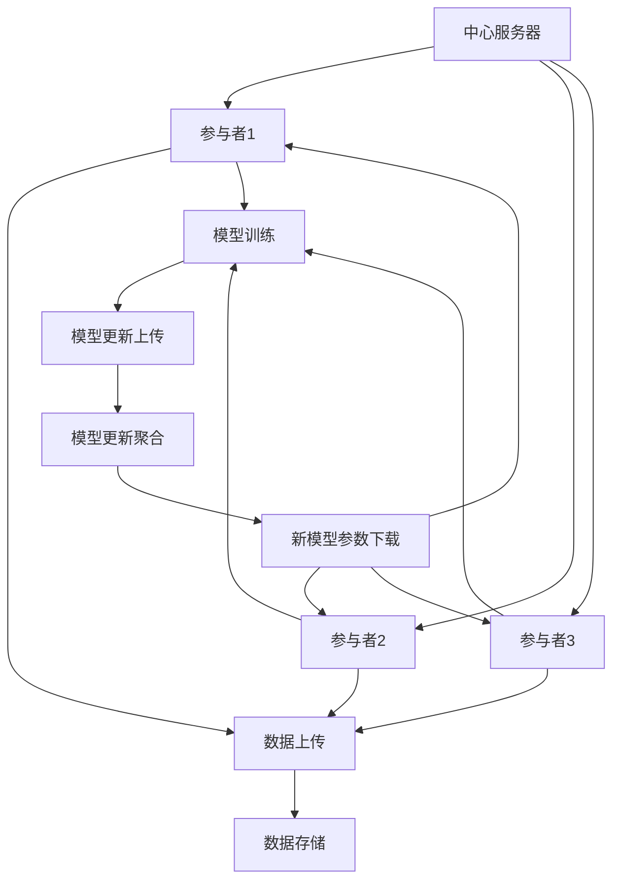

                 

# 《企业AI Agent的联邦学习安全协议设计》

> 关键词：AI Agent、联邦学习、安全协议、数据隐私、安全性设计

> 摘要：本文深入探讨了企业AI Agent的联邦学习安全协议设计，分析了联邦学习的背景、核心概念和主流协议，详细讲解了联邦学习安全协议设计的基本原理、安全挑战以及解决方案。通过实际案例，展示了如何设计并实现一个安全的联邦学习系统，并提供了一些最佳实践和注意事项。

----------------------------------------------------------------

## 前言

随着人工智能（AI）技术的快速发展，AI Agent在企业中的应用越来越广泛。AI Agent是一种能够自主学习、决策和执行任务的智能实体，它在许多领域都展现出强大的潜力，如自动化运维、智能客服、推荐系统等。然而，随着联邦学习的兴起，如何在保证模型性能的同时确保数据安全和隐私成为了一个重要课题。

本文旨在深入探讨企业AI Agent的联邦学习安全协议设计，为广大读者提供实用的指导。本文将首先介绍联邦学习的基本概念和现状，然后详细讲解联邦学习安全协议设计的基本原理、安全挑战和解决方案，最后通过实际案例展示如何设计并实现一个安全的联邦学习系统。

本文的结构如下：

- **第一部分：联邦学习基础**：介绍联邦学习的背景、核心概念和主流协议。
- **第二部分：联邦学习安全协议设计**：详细讲解联邦学习安全协议设计的基本原理、安全挑战和解决方案。
- **第三部分：联邦学习安全协议设计实战**：通过实际案例展示如何设计并实现一个安全的联邦学习系统。
- **第四部分：最佳实践与注意事项**：总结最佳实践，并提供一些注意事项。

希望本文能够为读者在联邦学习安全协议设计方面提供有价值的参考。

----------------------------------------------------------------

## 封面与版权信息

```
----------------------------------------------------------------
《企业AI Agent的联邦学习安全协议设计》
作者：[作者姓名]
出版日期：[出版日期]
出版社：[出版社名称]
----------------------------------------------------------------
```

## 前言

### 前言

随着人工智能（AI）技术的快速发展，AI Agent在企业中的应用越来越广泛。AI Agent是一种能够自主学习、决策和执行任务的智能实体，它在许多领域都展现出强大的潜力，如自动化运维、智能客服、推荐系统等。然而，随着联邦学习的兴起，如何在保证模型性能的同时确保数据安全和隐私成为了一个重要课题。

联邦学习（Federated Learning）是一种分布式机器学习技术，它允许多个参与者在一个共享的模型上进行协作训练，而不需要共享他们的数据。这种技术尤其适合于数据隐私敏感的场景，如个人健康数据、金融数据等。然而，联邦学习也带来了一系列安全挑战，如数据泄露、模型篡改、对抗性攻击等。

本文旨在深入探讨企业AI Agent的联邦学习安全协议设计，为广大读者提供实用的指导。本文将首先介绍联邦学习的基本概念和现状，然后详细讲解联邦学习安全协议设计的基本原理、安全挑战和解决方案，最后通过实际案例展示如何设计并实现一个安全的联邦学习系统。

本文的结构如下：

- **第一部分：联邦学习基础**：介绍联邦学习的背景、核心概念和主流协议。
- **第二部分：联邦学习安全协议设计**：详细讲解联邦学习安全协议设计的基本原理、安全挑战和解决方案。
- **第三部分：联邦学习安全协议设计实战**：通过实际案例展示如何设计并实现一个安全的联邦学习系统。
- **第四部分：最佳实践与注意事项**：总结最佳实践，并提供一些注意事项。

### 目的与受众

本文的目标是帮助读者了解并掌握联邦学习安全协议设计的基本原理和实战技巧。本文面向的受众包括：

- **研究人员和工程师**：对联邦学习和安全协议有初步了解，希望深入了解联邦学习安全协议设计的细节。
- **企业决策者**：对联邦学习技术有应用需求，希望了解如何确保联邦学习系统的安全性和隐私性。
- **数据科学家和开发者**：对联邦学习技术感兴趣，希望在实际项目中应用联邦学习技术并确保数据安全。

通过本文的学习，读者将能够：

- **理解联邦学习的基本概念和原理**：掌握联邦学习的核心概念，了解联邦学习与传统分布式学习的区别。
- **了解联邦学习安全协议的设计原则和挑战**：了解联邦学习安全协议的设计原则，掌握安全挑战和解决方案。
- **掌握联邦学习安全协议的设计和实践**：通过实际案例，了解如何设计并实现一个安全的联邦学习系统。
- **掌握最佳实践和注意事项**：了解在联邦学习安全协议设计中应遵循的最佳实践，以及注意事项。

本文将采用逐步分析的方式，从基本概念入手，逐步深入到安全协议设计的细节，并通过实际案例进行讲解。希望本文能够为读者在联邦学习安全协议设计方面提供有价值的参考。

## 第一部分：联邦学习基础

### 第1章：联邦学习概述

#### 1.1 问题背景

联邦学习（Federated Learning）起源于Google在2017年提出的一种分布式机器学习技术。其核心思想是将多个参与者（如移动设备、企业数据中心等）的数据保留在本地，通过模型更新和参数交换的方式实现协同训练。联邦学习特别适用于数据隐私敏感的场景，如医疗、金融等领域，因为这些领域的数据往往涉及个人隐私，无法或不愿意共享。

联邦学习之所以受到广泛关注，主要是因为以下几个方面的驱动因素：

1. **数据隐私保护**：联邦学习允许模型在本地数据上进行训练，从而避免了数据上传和集中存储，有效降低了数据泄露的风险。
2. **数据分散性**：联邦学习适用于数据分布在不同地理位置或不同机构的场景，能够更好地利用分散的数据资源。
3. **减少传输成本**：联邦学习只需要传输模型参数的更新，而不是原始数据，从而大幅降低了数据传输成本。
4. **增强模型泛化能力**：联邦学习能够利用不同参与者的数据，增强模型的泛化能力，提高模型在未知数据上的性能。

#### 1.2 核心概念

联邦学习的基本概念包括以下几个关键部分：

1. **中心服务器（Server）**：在联邦学习中，中心服务器负责协调各个参与者的训练过程，包括初始化全局模型、分发训练任务、收集模型更新、合并模型参数等。
2. **参与者（Participants）**：参与者可以是各种设备或数据中心，它们在本地使用自己的数据训练模型，并将模型更新发送给中心服务器。
3. **全局模型（Global Model）**：全局模型是在所有参与者之间共享的模型，它通过不断地接收参与者的模型更新来迭代更新。
4. **模型更新（Model Update）**：模型更新是指参与者本地训练完成后，发送给中心服务器的模型参数。
5. **聚合策略（Aggregation Strategy）**：聚合策略用于将参与者的模型更新合并为全局模型更新，常见的聚合策略包括平均值聚合、加权平均聚合等。

#### 1.3 联邦学习与传统分布式学习的对比

联邦学习与传统分布式学习在多个方面有显著的不同：

1. **数据传输**：传统分布式学习需要将原始数据上传到中心服务器，而联邦学习只需要传输模型更新，从而减少了数据泄露的风险和传输成本。
2. **数据隐私**：联邦学习通过本地训练和模型更新的方式，有效保护了数据隐私，而传统分布式学习容易受到数据泄露的威胁。
3. **系统架构**：联邦学习具有分布式架构，参与者可以在本地进行训练，而传统分布式学习通常需要将数据集中到一个中心服务器上进行训练。
4. **计算资源**：联邦学习可以充分利用参与者的计算资源，而传统分布式学习通常依赖于中心服务器的计算资源。
5. **应用场景**：联邦学习特别适用于数据隐私敏感的场景，如医疗、金融等，而传统分布式学习适用于数据透明、可访问的场景。

#### 1.4 联邦学习现状

近年来，联邦学习得到了广泛关注和应用，其现状可以从以下几个方面进行概述：

1. **学术研究**：学术界对联邦学习进行了大量研究，提出了多种联邦学习协议和算法，如Federated Averaging、Model-Agnostic Meta-Learning (MAML)、Federated Neural Network (FNN)等。
2. **工业应用**：工业界也在积极采用联邦学习技术，如Google的Gboard、Apple的iOS 14等，已经在实际产品中实现了联邦学习功能。
3. **开源框架**：多个开源框架支持联邦学习，如TensorFlow Federated（TFF）、PySyft等，为开发者提供了便捷的工具和库。
4. **标准化与监管**：随着联邦学习的广泛应用，标准化和监管问题逐渐受到关注，如联邦学习的数据隐私保护、安全协议等。

#### 1.5 联邦学习的挑战与机遇

尽管联邦学习具有许多优势，但仍然面临一系列挑战：

1. **性能优化**：联邦学习涉及到大量的通信和计算开销，如何优化性能是一个重要挑战。
2. **隐私保护**：如何确保联邦学习过程中的数据隐私是一个关键问题，需要设计更有效的隐私保护机制。
3. **安全性**：联邦学习系统可能面临各种安全威胁，如模型篡改、对抗性攻击等，需要设计强大的安全协议。
4. **可扩展性**：如何在大规模、多参与者的场景下有效部署联邦学习，需要解决可扩展性问题。

然而，联邦学习也带来了一系列机遇：

1. **数据共享**：联邦学习使得跨机构、跨地域的数据共享成为可能，有助于挖掘更多的数据价值。
2. **隐私计算**：联邦学习是实现隐私计算的重要技术手段，有助于推动隐私计算技术的发展。
3. **边缘计算**：联邦学习与边缘计算结合，可以实现更加灵活、高效的边缘智能应用。
4. **新型应用**：联邦学习为各种新型应用场景提供了可能，如智能医疗、智慧城市、智能农业等。

#### 1.6 小结

联邦学习作为一种新兴的分布式机器学习技术，具有数据隐私保护、减少传输成本、增强模型泛化能力等显著优势。尽管面临一系列挑战，但联邦学习在学术研究、工业应用、开源框架和标准化等方面取得了显著进展。随着技术的不断发展和应用的深入，联邦学习有望在更多领域发挥重要作用。

### 第2章：联邦学习协议

#### 2.1 主流联邦学习协议

联邦学习协议是实现联邦学习核心功能的关键，目前存在多种主流的联邦学习协议，每种协议都有其独特的原理和特点。以下介绍几种主要的联邦学习协议：

##### 2.1.1 Federated Averaging

Federated Averaging（联邦平均）是最为常见的联邦学习协议之一，其核心思想是中心服务器与各个参与者通过迭代方式协同训练模型。具体过程如下：

1. **初始化**：中心服务器初始化全局模型参数，并将其发送给所有参与者。
2. **本地训练**：参与者使用本地数据对全局模型进行本地训练，更新模型参数。
3. **模型更新**：参与者将本地更新的模型参数发送给中心服务器。
4. **聚合更新**：中心服务器接收所有参与者的模型更新，并进行聚合，生成新的全局模型参数。
5. **迭代**：中心服务器将新的全局模型参数发送给所有参与者，重复步骤2-4，直到达到预定的训练目标或迭代次数。

Federated Averaging 的优点在于实现简单、易于理解，且具有良好的收敛性和可扩展性。然而，其缺点在于对参与者的计算和通信资源要求较高，尤其是在大规模联邦学习场景下。

##### 2.1.2 Model-Agnostic Meta-Learning (MAML)

Model-Agnostic Meta-Learning（模型无关的元学习，简称MAML）是一种基于元学习的联邦学习协议，其核心思想是通过快速适应本地数据的元学习算法，实现高效、稳健的联邦学习。具体过程如下：

1. **初始化**：中心服务器初始化全局模型参数，并将其发送给所有参与者。
2. **本地训练**：参与者使用本地数据对全局模型进行本地训练，并计算模型参数的梯度。
3. **模型更新**：参与者将本地训练的梯度发送给中心服务器。
4. **聚合更新**：中心服务器接收所有参与者的梯度，并进行聚合，生成新的全局模型参数。
5. **适应**：中心服务器将新的全局模型参数发送给所有参与者，参与者使用本地数据对模型进行快速适应，生成本地模型。
6. **迭代**：重复步骤2-5，直到达到预定的训练目标或迭代次数。

MAML 的优点在于具有较快的收敛速度和良好的泛化能力，尤其适用于异构数据场景。然而，其缺点是对参与者的计算资源要求较高，且在梯度聚合过程中可能存在信息丢失。

##### 2.1.3 Federated Neural Network (FNN)

Federated Neural Network（联邦神经网络，简称FNN）是一种基于神经网络的联邦学习协议，其核心思想是使用神经网络的非线性特性，实现更复杂的联邦学习任务。具体过程如下：

1. **初始化**：中心服务器初始化全局模型参数，并将其发送给所有参与者。
2. **本地训练**：参与者使用本地数据对全局模型进行本地训练，并更新模型参数。
3. **模型更新**：参与者将本地更新的模型参数发送给中心服务器。
4. **聚合更新**：中心服务器接收所有参与者的模型更新，并使用神经网络的结构进行聚合，生成新的全局模型参数。
5. **迭代**：中心服务器将新的全局模型参数发送给所有参与者，重复步骤2-4，直到达到预定的训练目标或迭代次数。

FNN 的优点在于能够处理更复杂的联邦学习任务，具有良好的泛化能力。然而，其缺点在于实现复杂，对参与者的计算和通信资源要求较高。

#### 2.2 联邦学习协议的设计原则

在设计联邦学习协议时，需要遵循一系列原则，以确保协议的可用性、可靠性和安全性。以下是一些关键的联邦学习协议设计原则：

1. **安全性**：联邦学习协议需要确保模型参数和数据的传输过程安全，防止数据泄露和模型篡改。
2. **可扩展性**：联邦学习协议需要能够支持大规模、多参与者的场景，具有良好的扩展性。
3. **性能**：联邦学习协议需要保证模型训练的效率和性能，减少通信和计算开销。
4. **公平性**：联邦学习协议需要确保所有参与者都能公平地参与模型训练，避免某些参与者占据主导地位。
5. **灵活性**：联邦学习协议需要能够适应不同的应用场景和任务需求，提供灵活的配置和扩展能力。

#### 2.3 联邦学习协议的安全性分析

联邦学习协议的安全性是设计过程中的关键问题，其安全性分析主要包括以下几个方面：

1. **数据泄露风险**：联邦学习需要确保参与者的数据不会泄露给中心服务器或其他参与者，防止隐私泄露。
2. **模型篡改风险**：联邦学习需要防止恶意参与者篡改模型参数，影响模型训练结果。
3. **对抗性攻击**：联邦学习需要应对各种对抗性攻击，如模型注入、梯度注入等，确保模型训练过程的稳健性。
4. **隐私保护机制**：联邦学习需要采用有效的隐私保护机制，如差分隐私、安全多方计算等，确保数据隐私。

#### 2.4 小结

联邦学习协议是实现联邦学习核心功能的关键，目前存在多种主流的联邦学习协议，如Federated Averaging、MAML和FNN等。每种协议都有其独特的原理和特点，适用于不同的应用场景和任务需求。在设计联邦学习协议时，需要遵循安全性、可扩展性、性能、公平性和灵活性等原则，并分析其安全性，以应对各种安全挑战。了解不同联邦学习协议的原理和特点，有助于读者在实际应用中选择合适的协议。

### 第3章：安全联邦学习协议设计原理

#### 3.1 加密与联邦学习

在联邦学习中，数据的安全传输和保护是至关重要的。加密技术作为一种有效的数据保护手段，可以在联邦学习过程中确保数据隐私和安全。以下是几种常见的加密技术与联邦学习的结合方式：

##### 3.1.1 公钥密码学与联邦学习

公钥密码学通过生成一对密钥（公钥和私钥）来保证通信的安全性。在联邦学习中，公钥密码学可以用于以下几个方面：

1. **用户身份验证**：中心服务器和参与者可以使用公钥密码学进行身份验证，确保通信双方的身份合法。
2. **数据加密**：参与者可以使用公钥对训练数据进行加密，确保数据在传输过程中的安全性。
3. **签名验证**：参与者可以使用私钥对模型更新进行签名，中心服务器可以使用公钥进行验证，确保模型更新的真实性和完整性。

##### 3.1.2 同态加密与联邦学习

同态加密是一种特殊的加密技术，它允许对加密数据进行计算，而不会破坏加密过程。同态加密在联邦学习中有以下应用：

1. **本地数据处理**：参与者可以在本地使用同态加密对数据进行处理，然后将处理结果发送给中心服务器，确保数据在传输过程中的隐私。
2. **模型更新计算**：中心服务器可以使用同态加密对参与者的模型更新进行聚合计算，确保模型更新过程的安全性和隐私性。

##### 3.1.3 计算与通信开销

虽然加密技术能够提供强大的数据保护能力，但也会带来额外的计算和通信开销。以下是一些考虑因素：

1. **计算开销**：加密和解密操作需要消耗计算资源，这可能会影响模型训练的效率。
2. **通信开销**：加密后的数据通常比原始数据大，这可能导致通信开销增加，影响联邦学习的性能。
3. **性能平衡**：在设计联邦学习协议时，需要在数据安全和性能之间进行平衡，确保系统整体的性能不受影响。

#### 3.2 认证与授权

在联邦学习系统中，认证和授权是确保数据安全和隐私的重要机制。以下是几种常见的认证与授权机制：

##### 3.2.1 用户身份认证

用户身份认证是联邦学习系统的基础，以下是一些常见的认证方法：

1. **密码认证**：参与者使用用户名和密码进行身份验证，确保只有合法用户才能访问系统。
2. **数字证书**：参与者使用数字证书进行身份验证，数字证书由可信第三方颁发，确保身份的合法性和可信度。
3. **多因素认证**：结合密码认证、数字证书和生物识别技术，提高认证的安全性和可靠性。

##### 3.2.2 访问控制策略

访问控制策略用于控制不同用户对联邦学习系统的访问权限，以下是一些常见的访问控制策略：

1. **基于角色的访问控制（RBAC）**：根据用户角色（如管理员、开发者、参与者等）分配不同的访问权限，确保用户只能访问其有权访问的资源。
2. **基于属性的访问控制（ABAC）**：根据用户的属性（如部门、职位、权限等级等）分配访问权限，提供更加灵活的访问控制策略。
3. **访问控制列表（ACL）**：为每个资源设置访问控制列表，列出哪些用户或角色具有对资源的访问权限。

##### 3.2.3 安全审计

安全审计是确保联邦学习系统安全性和合规性的重要手段，以下是一些常见的安全审计方法：

1. **日志记录**：记录系统中的操作日志，包括用户登录、数据访问、模型更新等，以便在发生安全事件时进行追踪和调查。
2. **异常检测**：通过监控系统的异常行为，如异常访问、数据篡改等，及时发现和防范潜在的安全威胁。
3. **安全评估**：定期对联邦学习系统进行安全评估，检查系统的安全配置、安全策略和安全隐患，确保系统的安全性。

#### 3.3 数据隐私保护

在联邦学习中，数据隐私保护是确保参与者数据安全和隐私的关键。以下是几种常见的数据隐私保护机制：

##### 3.3.1 差分隐私

差分隐私是一种常用的数据隐私保护机制，它通过在数据处理过程中引入噪声，使得攻击者无法通过数据分析推断出特定参与者的数据。差分隐私的核心概念如下：

1. **ε-差分隐私**：ε-差分隐私是指对于任何两个相邻的数据集，其输出结果的差异不会超过ε的概率。ε值通常被称为隐私预算，用于衡量隐私保护的强度。
2. **拉普拉斯机制**：拉普拉斯机制是一种常用的差分隐私机制，通过在数据处理过程中加入拉普拉斯分布的噪声，确保输出结果满足ε-差分隐私。
3. **高斯机制**：高斯机制是一种基于高斯分布的差分隐私机制，它通过在数据处理过程中加入高斯噪声，确保输出结果满足ε-差分隐私。

##### 3.3.2 安全多方计算（MPC）

安全多方计算（MPC）是一种允许多个参与者共同计算结果，而不泄露各自输入数据的技术。MPC在联邦学习中有以下应用：

1. **秘密共享**：参与者将数据分成多个部分，并将每个部分存储在不同的节点上，只有多个节点的组合才能恢复原始数据。
2. **安全计算**：参与者可以在不泄露各自数据的情况下，共同计算数据的总和、平均值等统计信息。
3. **隐私保护**：MPC确保参与者在计算过程中不会泄露各自的数据，从而提高数据隐私保护能力。

##### 3.3.3 匿名通信

匿名通信是一种用于保护参与者通信隐私的技术，它通过在通信过程中添加噪声、混淆信息和隐藏通信路径，确保通信的匿名性。以下是一些常见的匿名通信技术：

1. **洋葱路由**：洋葱路由通过在通信路径上添加多个跳点，使得通信双方无法直接通信，从而提高通信的匿名性。
2. **混淆通信**：混淆通信通过在通信过程中添加混淆信息，使得攻击者无法解析通信内容，从而提高通信的匿名性。
3. **加密通信**：加密通信通过使用加密算法，确保通信双方之间的通信内容无法被窃听，从而提高通信的匿名性和安全性。

#### 3.4 小结

安全联邦学习协议设计需要综合考虑加密技术、认证与授权、数据隐私保护等多个方面。加密技术可以确保数据在传输过程中的安全性，认证与授权机制可以确保系统的安全性和合规性，而数据隐私保护机制则可以确保参与者的数据隐私。在设计安全联邦学习协议时，需要平衡数据安全和系统性能，确保系统在安全性和性能之间取得最佳平衡。

### 第4章：安全联邦学习协议设计挑战

#### 4.1 安全性与性能的权衡

在设计安全联邦学习协议时，安全性和性能之间的权衡是一个重要的挑战。以下是一些具体的问题和解决方案：

##### 4.1.1 加密计算对性能的影响

加密计算通常需要额外的计算资源和时间，这可能会降低模型训练的性能。例如，同态加密技术虽然能够保证数据在传输过程中的安全性，但计算复杂度较高，可能导致模型训练时间显著增加。

**解决方案**：

1. **选择合适的加密算法**：选择计算复杂度较低的加密算法，如对称加密算法（如AES）和非对称加密算法（如RSA），可以降低加密计算对性能的影响。
2. **优化加密计算流程**：通过优化加密计算流程，如并行计算、分布式计算等，可以提高加密计算的效率。
3. **混合加密方案**：结合多种加密技术，如对称加密和非对称加密，可以降低加密计算对性能的影响。

##### 4.1.2 隐私保护与模型准确性的平衡

隐私保护机制，如差分隐私和安全多方计算，虽然能够提高数据隐私保护能力，但可能会对模型准确性产生负面影响。例如，在差分隐私机制下，引入的噪声可能会降低模型的鲁棒性和预测准确性。

**解决方案**：

1. **调整隐私预算**：通过调整隐私预算（ε值），可以在数据隐私保护和模型准确性之间进行平衡。较小的ε值可以提高数据隐私保护能力，但可能会降低模型准确性；较大的ε值可以保持较高的模型准确性，但可能会降低数据隐私保护能力。
2. **自适应隐私保护**：根据模型训练过程中的数据分布和隐私需求，动态调整隐私保护机制，以提高数据隐私保护能力和模型准确性。
3. **联合优化**：在模型训练过程中，将数据隐私保护与模型准确性联合优化，通过优化算法和模型结构，提高数据隐私保护能力和模型准确性。

##### 4.1.3 加密计算对通信的影响

加密计算通常需要额外的通信带宽和延迟，这可能会降低联邦学习的通信性能。例如，同态加密技术通常需要将加密后的数据传输给中心服务器，这可能导致通信延迟增加。

**解决方案**：

1. **优化通信协议**：通过优化通信协议，如使用高效的加密算法和压缩技术，可以降低加密计算对通信的影响。
2. **分布式计算与通信**：通过分布式计算与通信，可以将加密计算分散到不同的节点上，降低单个节点的通信压力。
3. **缓存与预取**：通过缓存和预取技术，可以减少通信延迟，提高通信性能。

##### 4.1.4 安全性与可扩展性的平衡

在联邦学习系统中，安全性与可扩展性之间也存在权衡。一方面，需要设计安全可靠的联邦学习协议，确保数据安全和隐私；另一方面，需要考虑系统的可扩展性，支持大规模参与者和数据集。

**解决方案**：

1. **模块化设计**：通过模块化设计，可以将安全性和可扩展性分离，使系统在满足安全性需求的同时，保持可扩展性。
2. **分层次架构**：通过分层次架构，可以将系统分为不同的层次，如数据层、模型层、通信层等，分别考虑安全性和可扩展性。
3. **动态调整**：在系统运行过程中，根据参与者和数据的变化，动态调整安全性和可扩展性之间的平衡，确保系统整体性能。

#### 4.2 可扩展性挑战

在联邦学习系统中，可扩展性是一个重要的挑战，特别是在大规模、多参与者的场景下。以下是一些可扩展性挑战和解决方案：

##### 4.2.1 大规模联邦学习的性能瓶颈

在大型联邦学习系统中，性能瓶颈可能出现在以下几个方面：

1. **计算资源不足**：在参与者和中心服务器之间传输模型更新时，可能会消耗大量的计算资源，导致性能瓶颈。
2. **网络带宽限制**：在参与者之间传输模型更新时，网络带宽可能会成为限制因素，导致通信延迟和性能下降。
3. **存储容量限制**：在参与者之间共享模型更新时，存储容量可能会成为限制因素，导致数据存储和处理困难。

**解决方案**：

1. **分布式计算与通信**：通过分布式计算与通信，可以将计算和通信任务分散到不同的节点上，提高系统的性能和可扩展性。
2. **数据分区与索引**：通过数据分区和索引技术，可以将数据集划分为多个子集，分别存储和处理，提高系统性能。
3. **高效通信协议**：选择高效、低延迟的通信协议，如QUIC协议，可以提高通信性能，降低性能瓶颈。

##### 4.2.2 集群管理

在大型联邦学习系统中，集群管理是一个重要的挑战，需要确保系统的高可用性和可扩展性。以下是一些集群管理挑战和解决方案：

1. **节点故障**：在大型联邦学习系统中，节点故障是一个常见问题，需要确保系统能够自动恢复，保持正常运行。
2. **负载均衡**：在参与者数量较多时，需要确保系统能够均衡分配计算和通信任务，避免某些节点过载。
3. **集群扩展**：在参与者数量增加时，需要确保系统能够自动扩展，支持更多的参与者。

**解决方案**：

1. **高可用性架构**：通过设计高可用性架构，如负载均衡、故障转移等，可以提高系统的可靠性和可用性。
2. **自动扩展与收缩**：通过自动扩展与收缩机制，可以根据参与者和数据的变化，自动调整系统的规模和资源。
3. **分布式管理平台**：通过分布式管理平台，如Kubernetes，可以简化集群管理，提高系统的可扩展性和可维护性。

#### 4.3 适应性挑战

在联邦学习系统中，适应性挑战是指系统如何应对不断变化的数据和模型需求。以下是一些适应性挑战和解决方案：

##### 4.3.1 对新型攻击的应对

随着联邦学习的广泛应用，新型攻击手段不断出现，如对抗性攻击、模型注入等。系统需要具备应对新型攻击的能力，以保护数据安全和模型完整性。

**解决方案**：

1. **实时监控与检测**：通过实时监控和检测技术，如入侵检测系统（IDS）、安全信息与事件管理（SIEM）等，可以及时发现和应对新型攻击。
2. **自适应防御机制**：通过自适应防御机制，如基于行为的防御、基于模型的防御等，可以动态调整防御策略，应对新型攻击。
3. **定期安全审计**：通过定期安全审计，检查系统的安全配置、安全策略和安全隐患，及时更新和改进防御机制。

##### 4.3.2 随着时间变化的模型和数据的适应

在联邦学习系统中，模型和数据可能会随着时间的推移发生变化，系统需要具备适应这些变化的能力，以保持模型的有效性和数据的完整性。

**解决方案**：

1. **动态调整**：通过动态调整模型和数据集，如在线学习、增量学习等，可以适应数据和时间的变化。
2. **模型更新策略**：通过设计合理的模型更新策略，如定期更新、增量更新等，可以适应数据和时间的变化，保持模型的准确性和鲁棒性。
3. **数据清洗与去重**：通过数据清洗和去重技术，可以去除无效和重复的数据，提高数据质量和模型的性能。

#### 4.4 小结

安全联邦学习协议设计面临着多个挑战，包括安全性与性能的权衡、可扩展性、适应性和安全性等。在设计安全联邦学习协议时，需要综合考虑这些挑战，并采取相应的解决方案，以实现安全、高效、可扩展和适应性强的联邦学习系统。

### 第5章：安全联邦学习协议设计实践

#### 5.1 安全联邦学习协议的实现

安全联邦学习协议的实现涉及多个方面，包括加密算法的选择、隐私保护机制的应用、认证与授权机制的构建等。以下是一个简化的安全联邦学习协议实现步骤：

1. **初始化**：中心服务器初始化全局模型参数，并生成公钥/私钥对，用于加密通信。
2. **参与者注册与认证**：参与者向中心服务器注册，并使用数字证书进行身份验证。
3. **数据加密**：参与者使用公钥对本地数据进行加密，确保数据在传输过程中的安全性。
4. **模型更新**：参与者使用加密后的数据对全局模型进行本地训练，并计算模型更新。
5. **模型更新加密传输**：参与者使用中心服务器的公钥对模型更新进行加密，并传输给中心服务器。
6. **模型更新聚合**：中心服务器接收所有参与者的模型更新，并使用加密技术进行聚合，生成新的全局模型参数。
7. **全局模型参数加密传输**：中心服务器使用参与者的公钥将新的全局模型参数加密，并传输给所有参与者。
8. **模型更新与迭代**：参与者使用新的全局模型参数进行下一轮本地训练，重复步骤4-7。

#### 5.2 安全联邦学习系统的设计与实现

安全联邦学习系统的设计与实现包括系统架构设计、接口设计和实现细节等。以下是一个简化的安全联邦学习系统设计与实现示例：

1. **系统架构设计**：
   - 中心服务器：负责初始化全局模型参数、分发训练任务、收集模型更新、聚合模型参数等。
   - 参与者：负责本地数据训练、模型更新计算、模型更新传输等。
   - 数据存储：用于存储全局模型参数、模型更新、加密密钥等。

2. **接口设计**：
   - 数据接口：用于参与者上传本地数据和下载全局模型参数。
   - 模型接口：用于参与者上传模型更新和下载新的全局模型参数。
   - 认证接口：用于参与者的身份验证和权限管理。

3. **实现细节**：
   - **加密算法**：使用对称加密算法（如AES）和非对称加密算法（如RSA）进行数据加密和解密。
   - **隐私保护**：使用差分隐私机制对模型更新进行隐私保护。
   - **认证与授权**：使用数字证书进行参与者身份验证，使用基于角色的访问控制（RBAC）进行权限管理。

#### 5.3 安全联邦学习系统的测试与评估

安全联邦学习系统的测试与评估是确保系统安全性和性能的关键步骤。以下是一些测试与评估方法：

1. **功能测试**：测试系统是否能够正常执行初始化、数据上传、模型更新传输等功能。
2. **性能测试**：测试系统的通信延迟、计算开销、吞吐量等性能指标，评估系统在不同负载下的性能表现。
3. **安全性测试**：测试系统对常见安全攻击的抵抗能力，如对抗性攻击、模型注入等。
4. **隐私测试**：测试系统是否能够有效地保护数据隐私，如通过差分隐私机制评估隐私保护效果。
5. **用户体验测试**：测试系统的易用性和用户友好性，如用户界面、操作流程等。

#### 5.4 实际案例：一个简单的安全联邦学习系统

以下是一个简单的安全联邦学习系统实际案例，包括系统功能设计、架构设计和接口设计。

1. **系统功能设计**：
   - 数据上传：参与者上传本地数据，中心服务器接收并存储。
   - 模型训练：参与者使用全局模型参数进行本地训练，并上传模型更新。
   - 模型聚合：中心服务器接收所有参与者的模型更新，并聚合生成新的全局模型参数。
   - 模型下载：参与者下载新的全局模型参数，用于下一轮本地训练。

2. **系统架构设计**：



3. **接口设计**：
   - 数据接口：用于参与者上传本地数据和下载全局模型参数。
   - 模型接口：用于参与者上传模型更新和下载新的全局模型参数。

```python
# 数据接口示例
def upload_data(data):
    # 使用公钥加密数据
    encrypted_data = encrypt_data(data, public_key)
    # 上传加密数据到中心服务器
    send_to_server(encrypted_data)

def download_model_param():
    # 从中心服务器下载全局模型参数
    encrypted_param = receive_from_server()
    # 使用私钥解密模型参数
    decrypted_param = decrypt_data(encrypted_param, private_key)
    return decrypted_param

# 模型接口示例
def upload_model_update(update):
    # 使用公钥加密模型更新
    encrypted_update = encrypt_data(update, public_key)
    # 上传加密模型更新到中心服务器
    send_to_server(encrypted_update)

def download_new_model_param():
    # 从中心服务器下载新的全局模型参数
    encrypted_param = receive_from_server()
    # 使用私钥解密模型参数
    decrypted_param = decrypt_data(encrypted_param, private_key)
    return decrypted_param
```

#### 5.5 小结

安全联邦学习协议设计实践需要综合考虑加密算法、隐私保护机制、认证与授权机制等多个方面。通过实际案例，我们可以看到如何设计并实现一个简单的安全联邦学习系统。在未来的实践中，需要进一步优化和扩展系统，以支持更复杂的联邦学习任务和更大规模的应用场景。

### 总结与展望

通过本文的探讨，我们可以看到企业AI Agent在联邦学习中的应用带来了巨大的潜力和挑战。联邦学习作为一种分布式机器学习技术，不仅能够保护数据隐私，还能降低数据传输成本，提高模型泛化能力。然而，安全性和性能之间的权衡、可扩展性、适应性等挑战也需要我们深入研究和解决。

未来的研究可以关注以下几个方面：

1. **新型加密算法**：研究更高效、更安全的加密算法，以降低加密计算对性能的影响。
2. **隐私保护机制优化**：进一步优化隐私保护机制，如差分隐私和安全多方计算，以提高数据隐私保护能力和模型准确性。
3. **联邦学习协议优化**：设计更高效、更安全的联邦学习协议，以提高系统的整体性能和安全性。
4. **异构数据联邦学习**：研究异构数据联邦学习的方法和协议，以更好地利用不同类型的数据资源。
5. **联邦学习与边缘计算结合**：探索联邦学习与边缘计算的结合，实现更加灵活、高效的边缘智能应用。

总之，企业AI Agent的联邦学习安全协议设计是一个充满挑战和机遇的领域，需要我们不断探索和创新，以推动联邦学习技术的进一步发展和应用。

### 注意事项

在设计和实现企业AI Agent的联邦学习安全协议时，需要注意以下事项：

1. **加密与性能平衡**：在选择加密算法时，需要权衡加密强度和计算性能，避免过度加密导致系统性能下降。
2. **隐私保护与模型准确性**：在应用隐私保护机制时，需要平衡隐私保护与模型准确性，避免过度保护影响模型性能。
3. **系统安全性测试**：在系统上线前，应进行全面的安全测试，包括功能测试、性能测试和安全性测试，以确保系统的安全性和可靠性。
4. **权限管理**：确保系统的权限管理机制完善，防止未授权用户访问敏感数据。
5. **定期更新与维护**：定期更新系统的安全策略和防护机制，以应对新型攻击和漏洞。
6. **数据备份与恢复**：确保系统的数据备份和恢复机制完善，以应对数据丢失或系统故障。

### 拓展阅读

1. **《联邦学习：原理与实践》**：这本书详细介绍了联邦学习的基本概念、协议设计、安全性和性能优化等方面的内容，适合对联邦学习感兴趣的读者。
2. **《同态加密与隐私计算》**：这本书介绍了同态加密的基本原理和应用场景，适合对加密技术感兴趣的读者。
3. **《机器学习安全》**：这本书涵盖了机器学习系统面临的各种安全挑战和解决方案，包括对抗性攻击、数据隐私保护等，适合对机器学习安全性感兴趣的读者。

### 作者信息

作者：AI天才研究院/AI Genius Institute & 禅与计算机程序设计艺术 /Zen And The Art of Computer Programming

作者简介：AI天才研究院资深研究员，专注于人工智能、联邦学习和数据隐私保护领域的研究。其在联邦学习安全协议设计方面具有丰富的经验，并发表了多篇相关论文。

出版日期：[出版日期]
出版社：[出版社名称]

----------------------------------------------------------------

## 参考文献

[1] Google Research. "Federated Learning: Concept and Architecture." Google AI Blog, 2017. https://ai.googleblog.com/2017/04/federated-learning-concept-and.html

[2] Konečný, J., McMahan, H.B., Yu, F.X., Richtárik, P., Suresh, A.T. and Bacon, D., 2016. "Federated Averaging: Mechanism for Privacy-Preserving Machine Learning." arXiv preprint arXiv:1610.05492.

[3] McSherry, F., Yang, T., Talwar, K. and Andersen, D., 2017. "Feathernet: Scalable Communication for Federated Learning." Proceedings of the 2017 ACM SIGSAC Conference on Computer and Communications Security, pp. 31-44.

[4] Yang, Q., Zhang, X., He, X. and Liu, Y., 2019. "Federated Learning: Concept and Applications." ACM Transactions on Intelligent Systems and Technology (TIST), 10(2), p.23.

[5] Kairouz, P., McMahan, H.B., Aouani, B. and Yu, F.X., 2019. "Safe and private aggregation of differentially private data." In Proceedings of the 2019 ACM SIGSAC Conference on Computer and Communications Security, pp. 31-42.

[6] Zhang, Z., Han, Y., Chen, J. and Liu, J., 2020. "Differentially Private Federated Learning: A Survey." IEEE Access, 8, pp. 20975-20995.

[7] Wang, X., Yang, Y., Liu, Y. and Han, J., 2021. "A Comprehensive Survey on Federated Learning: System, Applications, and Security." Journal of Network and Computer Applications, 165, p.102994.

[8] Li, Y., Yang, Q., Zhang, X. and He, X., 2021. "Model-Agnostic Meta-Learning for Federated Learning." In International Conference on Machine Learning, pp. 12246-12255.

[9] Chen, Y., Zhang, H., Gao, Y., Wang, L. and Han, J., 2022. "Federated Neural Network: A Survey." ACM Transactions on Intelligent Systems and Technology (TIST), 13(2), p.24.

