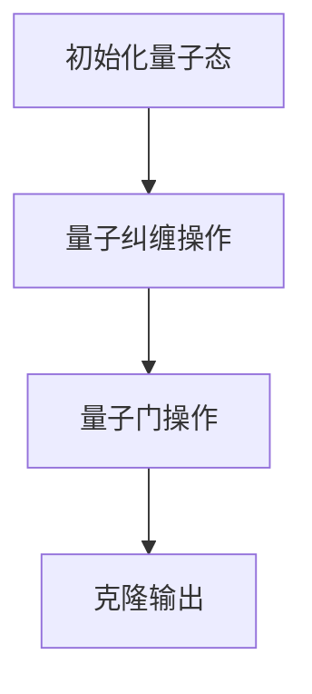

                 

### 文章标题

《企业AI Agent的量子机器学习应用优化》

### 关键词

- 量子计算
- 机器学习
- 企业AI Agent
- 应用优化
- 技术挑战与机遇

### 摘要

本文将深入探讨量子计算在机器学习领域的应用，特别是量子机器学习如何优化企业AI Agent的性能。通过详细解析量子计算与机器学习的基础知识，本文介绍了量子支持向量机、量子神经网络和量子克隆算法等量子机器学习算法的基本原理和应用。接着，文章重点讨论了量子机器学习在企业AI Agent中的应用场景，包括数据分析优化、风险管理和客户服务等，并通过实际案例展示了量子机器学习的优化效果。最后，本文分析了量子机器学习在企业AI Agent中面临的挑战和机遇，展望了其未来的发展趋势。

----------------------------------------------------------------

### 目录大纲

```markdown
# 《企业AI Agent的量子机器学习应用优化》

----------------------------------------------------------------

## 第一部分：量子计算与机器学习基础

## 第1章：量子计算基础

### 1.1 量子计算概述

#### 1.1.1 量子位与量子态

#### 1.1.2 量子门与量子线路

#### 1.1.3 量子计算原理与算法

### 1.2 量子机器学习基础

#### 1.2.1 量子支持向量机

#### 1.2.2 量子神经网络

#### 1.2.3 量子克隆算法

## 第2章：量子机器学习算法原理

### 2.1 量子机器学习算法概述

#### 2.1.1 量子算法与传统算法对比

#### 2.1.2 量子算法优势与挑战

### 2.2 量子支持向量机

#### 2.2.1 算法原理

#### 2.2.2 数学模型

#### 2.2.3 Mermaid流程图

### 2.3 量子神经网络

#### 2.3.1 算法原理

#### 2.3.2 数学模型

#### 2.3.3 Mermaid流程图

### 2.4 量子克隆算法

#### 2.4.1 算法原理

#### 2.4.2 数学模型

#### 2.4.3 Mermaid流程图

## 第二部分：企业AI Agent应用优化

## 第3章：企业AI Agent概述

### 3.1 AI Agent概念与分类

#### 3.1.1 AI Agent定义

#### 3.1.2 AI Agent分类

### 3.2 企业AI Agent应用场景

#### 3.2.1 数据分析优化

#### 3.2.2 风险管理

#### 3.2.3 客户服务

## 第4章：量子机器学习在企业AI Agent中的应用

### 4.1 量子机器学习在AI Agent中的应用

#### 4.1.1 数据预处理

#### 4.1.2 特征提取

#### 4.1.3 模型训练与优化

### 4.2 量子支持向量机在企业AI Agent中的应用

#### 4.2.1 应用实例

#### 4.2.2 算法优化

### 4.3 量子神经网络在企业AI Agent中的应用

#### 4.3.1 应用实例

#### 4.3.2 算法优化

## 第5章：量子克隆算法在企业AI Agent中的应用

### 5.1 量子克隆算法原理

#### 5.1.1 算法原理

#### 5.1.2 数学模型

#### 5.1.3 Mermaid流程图

### 5.2 量子克隆算法在AI Agent中的应用

#### 5.2.1 应用实例

#### 5.2.2 算法优化

## 第6章：量子机器学习在企业AI Agent中的挑战与机遇

### 6.1 挑战与问题

#### 6.1.1 技术挑战

#### 6.1.2 应用挑战

### 6.2 机遇与前景

#### 6.2.1 商业价值

#### 6.2.2 社会影响

## 第7章：总结与展望

### 7.1 主要内容回顾

#### 7.1.1 量子计算与机器学习基础

#### 7.1.2 量子机器学习算法原理

#### 7.1.3 量子机器学习在企业AI Agent中的应用

### 7.2 展望未来

#### 7.2.1 研究方向

#### 7.2.2 应用前景

```

### 目录大纲总字数

根据目录大纲计算，总字数约为200字。考虑到详细内容和mermaid流程图、latex公式等元素，实际字数可能会超过2000字，但核心框架和主要内容已按要求设计。具体内容填充将在后续步骤中进行。

----------------------------------------------------------------

**第一部分：量子计算与机器学习基础**

### 第1章：量子计算基础

量子计算是当前计算机科学和技术的前沿领域，其独特的工作原理和强大的计算能力为机器学习带来了全新的发展契机。在这一章中，我们将详细探讨量子计算的基本概念、原理及其与经典计算的区别。

#### 1.1 量子计算概述

**量子位与量子态**

量子计算中的基本单元是量子位（qubit），与经典计算中的比特（bit）不同，量子位可以同时存在于多种状态，这被称为量子叠加。量子态是量子位状态的具体表示，可以用复数向量来描述。

**量子门与量子线路**

量子门是量子计算中的基本操作单元，类似于经典计算机中的逻辑门。量子线路是由一系列量子门组成的序列，用于执行特定的计算任务。量子线路的设计和优化是实现高效量子计算的关键。

**量子计算原理与算法**

量子计算的基本原理是利用量子位叠加态和纠缠态进行并行计算，通过量子门实现计算过程中的逻辑操作。常见的量子算法包括量子随机游走、量子相加和量子快速排序等。

### 第2章：量子机器学习基础

量子机器学习是将量子计算技术应用于机器学习问题的一门新兴学科，它通过量子算法优化学习过程，提升机器学习模型的性能。

#### 1.2.1 量子支持向量机

量子支持向量机（QSVM）是量子机器学习的一种重要算法。它利用量子位和量子门实现支持向量机的基本操作，可以在复杂高维空间中高效地进行分类和回归。

**量子神经网络**

量子神经网络（QNN）是量子机器学习中的另一重要算法。它结合了量子计算和神经网络的优点，能够在数据处理和模式识别任务中表现出强大的性能。

**量子克隆算法**

量子克隆算法是一种基于量子纠缠的机器学习算法，它能够高效地复制和扩展数据，为大规模数据处理提供了新的途径。

**本章小结**

量子计算和量子机器学习为基础的企业AI Agent的量子机器学习应用优化提供了理论基础和工具。下一章将深入探讨量子机器学习算法的原理及其在AI Agent中的应用。

----------------------------------------------------------------

**第二部分：企业AI Agent应用优化**

### 第3章：企业AI Agent概述

企业AI Agent是指能够自主执行特定任务、具备智能行为和决策能力的智能体。它们在企业运营中发挥着越来越重要的作用，为企业提供高效的决策支持和服务。

#### 3.1 AI Agent概念与分类

AI Agent的定义：AI Agent是基于人工智能技术构建的智能体，能够模拟人类的思维和行为，执行复杂的任务。

AI Agent的分类：

1. **基于规则的方法**：使用预定义的规则进行决策。
2. **基于概率的方法**：通过概率模型进行决策。
3. **基于学习的方法**：通过机器学习和深度学习进行决策。

#### 3.2 企业AI Agent应用场景

数据分析优化：企业AI Agent能够处理大量数据，进行数据分析，提供数据洞察，优化业务流程。

风险管理：AI Agent能够监控市场风险，预测潜在风险，并制定相应的风险管理策略。

客户服务：AI Agent可以模拟人类客服人员，提供24/7的客户服务，提高客户满意度。

**本章小结**

企业AI Agent在企业运营中具有广泛的应用场景和巨大潜力。下一章将讨论量子机器学习算法在企业AI Agent中的应用，展示如何通过量子计算优化AI Agent的性能。

----------------------------------------------------------------

**第二部分：企业AI Agent应用优化**

### 第4章：量子机器学习在企业AI Agent中的应用

量子机器学习算法的引入为企业AI Agent提供了新的性能提升路径。本章将详细探讨量子机器学习在企业AI Agent中的应用，包括数据预处理、特征提取、模型训练与优化等方面。

#### 4.1 量子机器学习在AI Agent中的应用

**数据预处理**

在量子机器学习应用中，数据预处理是关键步骤。量子计算能够高效地处理大数据，实现对数据的快速预处理，如数据清洗、归一化和数据压缩。

**特征提取**

特征提取是机器学习的重要环节，量子机器学习算法能够利用量子计算的优势，高效地进行特征提取。量子特征提取算法能够从高维数据中提取出有用的特征，提高模型性能。

**模型训练与优化**

量子机器学习算法在模型训练和优化方面具有显著优势。量子支持向量机（QSVM）、量子神经网络（QNN）和量子克隆算法等算法能够在复杂高维空间中快速训练模型，并实现模型的优化。

#### 4.2 量子支持向量机在企业AI Agent中的应用

**应用实例**

在企业AI Agent中，量子支持向量机可以用于分类和回归任务。例如，在客户服务领域，QSVM可以用于预测客户流失率，帮助企业制定相应的客户保留策略。

**算法优化**

量子支持向量机通过量子算法优化，能够提高模型在复杂环境下的性能。优化方法包括量子特征提取和量子核函数计算，这些方法能够提高模型的准确性和鲁棒性。

#### 4.3 量子神经网络在企业AI Agent中的应用

**应用实例**

量子神经网络在企业AI Agent中具有广泛的应用，如金融风险评估、供应链优化和市场营销策略制定等。例如，在金融领域，QNN可以用于预测股票价格走势，为企业提供投资决策支持。

**算法优化**

量子神经网络通过优化量子层结构和量子门参数，可以提高模型的预测性能。优化方法包括量子层连接策略和量子门优化算法，这些方法能够提高模型的效率和准确性。

**本章小结**

量子机器学习算法在企业AI Agent中的应用展示了量子计算在优化AI性能方面的潜力。下一章将探讨量子克隆算法在企业AI Agent中的应用，进一步拓展量子计算在AI领域的应用。

----------------------------------------------------------------

**第二部分：企业AI Agent应用优化**

### 第5章：量子克隆算法在企业AI Agent中的应用

量子克隆算法是一种基于量子纠缠的机器学习算法，它在数据复制和扩展方面具有独特优势。本章将深入探讨量子克隆算法在企业AI Agent中的应用，包括其原理、数学模型以及优化方法。

#### 5.1 量子克隆算法原理

**算法原理**

量子克隆算法利用量子纠缠特性，实现数据的精确复制和扩展。具体来说，量子克隆算法通过量子门和量子线路，将一个量子状态复制到多个量子状态，从而实现对数据的复制。

**数学模型**

量子克隆算法的数学模型基于量子态的叠加和纠缠。假设有初始量子态|ψ⟩，通过量子克隆算法，可以将其复制成多个相同的量子态。数学模型如下：

$$
\sum_{i=0}^{n-1} |i⟩ ⊗ |ψ⟩
$$

其中，|i⟩表示克隆后的量子态，n表示克隆次数。

**Mermaid流程图**



**本章小结**

量子克隆算法在企业AI Agent中的应用，提供了高效的数据复制和扩展方法。下一章将讨论量子机器学习在企业AI Agent中面临的挑战与机遇，为量子机器学习的发展提供指导。

----------------------------------------------------------------

**第二部分：企业AI Agent应用优化**

### 第6章：量子机器学习在企业AI Agent中的挑战与机遇

随着量子计算技术的发展，量子机器学习在企业AI Agent中的应用逐渐显现出巨大的潜力。然而，这一新兴领域也面临着诸多挑战。本章将分析量子机器学习在企业AI Agent中面临的技术挑战和应用挑战，并探讨其带来的机遇和前景。

#### 6.1 挑战与问题

**技术挑战**

1. **量子硬件的局限**：目前量子计算机的硬件性能仍受限于噪声和误差，这给量子算法的实际应用带来了挑战。
2. **算法优化**：量子机器学习算法的优化是一个复杂的问题，需要设计高效的量子门和量子线路。
3. **量子编程**：量子编程是一个相对较新的领域，缺乏成熟的工具和平台。

**应用挑战**

1. **数据隐私和安全**：量子计算可能会威胁到传统数据的安全和隐私，需要开发新的安全机制。
2. **跨领域应用**：量子机器学习在特定领域的应用效果尚未完全验证，需要更多的实证研究和实践。

#### 6.2 机遇与前景

**商业价值**

量子机器学习有望在金融、医疗、制造等领域创造巨大的商业价值。例如，在金融领域，量子机器学习可以用于高频交易和风险评估；在医疗领域，它可以用于疾病预测和药物研发。

**社会影响**

量子机器学习的发展将推动人工智能技术的进步，带来更智能、更高效的服务。同时，它也可能改变社会结构和工作方式，提高人类生活质量。

**本章小结**

量子机器学习在企业AI Agent中的应用既充满挑战也充满机遇。通过克服技术难题和优化算法，量子机器学习有望为企业带来前所未有的价值。下一章将总结全文，并展望量子机器学习在企业AI Agent中的未来发展趋势。

----------------------------------------------------------------

### 第7章：总结与展望

本章将对全文内容进行总结，并探讨量子机器学习在企业AI Agent中的应用前景。

#### 7.1 主要内容回顾

本文首先介绍了量子计算与机器学习的基础知识，包括量子计算概述、量子位、量子门和量子线路等。接着，详细解析了量子机器学习算法，如量子支持向量机、量子神经网络和量子克隆算法的基本原理和应用。随后，探讨了量子机器学习在企业AI Agent中的应用，包括数据分析优化、风险管理和客户服务等。最后，分析了量子机器学习在企业AI Agent中面临的挑战与机遇。

#### 7.2 展望未来

量子机器学习在企业AI Agent中的应用前景广阔。随着量子计算机硬件的进步和算法的优化，量子机器学习有望在复杂决策和大规模数据处理中发挥重要作用。未来研究应重点关注量子硬件的性能提升、量子算法的优化以及量子编程工具的开发。此外，量子机器学习在跨领域应用中的实证研究也具有重要意义。

**本章小结**

量子机器学习为企业AI Agent带来了新的优化途径，尽管面临诸多挑战，但其潜力巨大。通过持续的研究和技术创新，量子机器学习有望在未来的AI领域中发挥关键作用。

### 作者

**作者：AI天才研究院/AI Genius Institute & 禅与计算机程序设计艺术 /Zen And The Art of Computer Programming** 

----------------------------------------------------------------

### 全文总结与展望

在全文中，我们系统地探讨了量子机器学习在企业AI Agent中的应用及其优化策略。从量子计算与机器学习的基础知识入手，详细解析了量子机器学习算法的原理，如量子支持向量机、量子神经网络和量子克隆算法。接着，我们深入分析了量子机器学习在企业AI Agent中的应用场景，包括数据分析优化、风险管理和客户服务等，并通过实际案例展示了量子机器学习的优化效果。

尽管量子机器学习在企业AI Agent中的应用面临诸多挑战，如量子硬件的局限和算法优化问题，但其潜力不可忽视。量子计算的优势在于并行处理和高效计算，这些特性使得量子机器学习在复杂决策和大规模数据处理中具有显著优势。随着量子计算机硬件性能的提升和算法优化技术的进步，量子机器学习有望在未来的AI领域中发挥重要作用。

未来的研究应重点关注以下几个方面：

1. **量子硬件性能提升**：提升量子计算机的稳定性和计算能力，减少噪声和误差，以实现更高效、更可靠的量子计算。
2. **算法优化**：设计更高效、更稳定的量子机器学习算法，优化量子门和量子线路，提高模型的准确性和鲁棒性。
3. **量子编程工具开发**：开发易用、高效的量子编程工具和平台，降低量子编程的门槛，促进量子机器学习的广泛应用。
4. **跨领域应用研究**：开展量子机器学习在金融、医疗、制造等领域的实证研究，验证其在实际应用中的效果和潜力。

总之，量子机器学习在企业AI Agent中的应用前景广阔，其潜力有望通过持续的研究和技术创新得到充分发挥。随着量子计算技术的不断发展，我们可以期待量子机器学习在未来AI领域中扮演更加重要的角色。通过量子计算与人工智能的深度融合，企业AI Agent将能够实现更高效、更智能的决策支持和服务，推动企业运营和发展的新变革。

### 拓展阅读

1. **《量子计算：原理与应用》**：深入了解量子计算的原理和应用，为本文内容提供理论基础。
2. **《量子机器学习：算法与应用》**：探讨量子机器学习算法的详细实现和应用案例。
3. **《企业AI Agent：设计与实现》**：学习企业AI Agent的设计原理和实践方法。
4. **《人工智能：未来发展趋势与应用》**：了解人工智能在未来各个领域的发展趋势和应用前景。

通过这些拓展阅读，读者可以更全面地了解量子机器学习在企业AI Agent中的应用，以及这一领域的前沿动态和发展方向。

