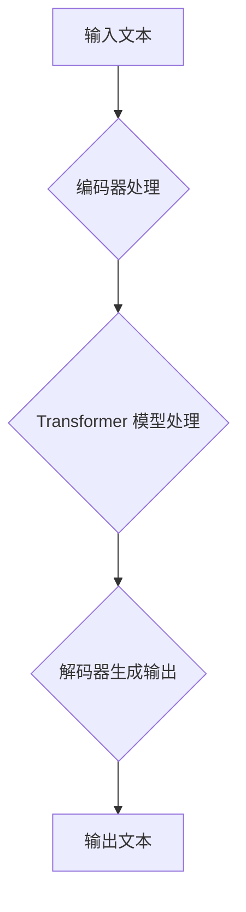
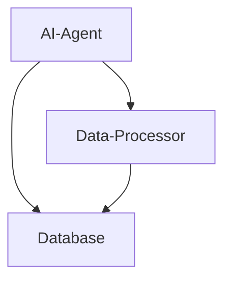
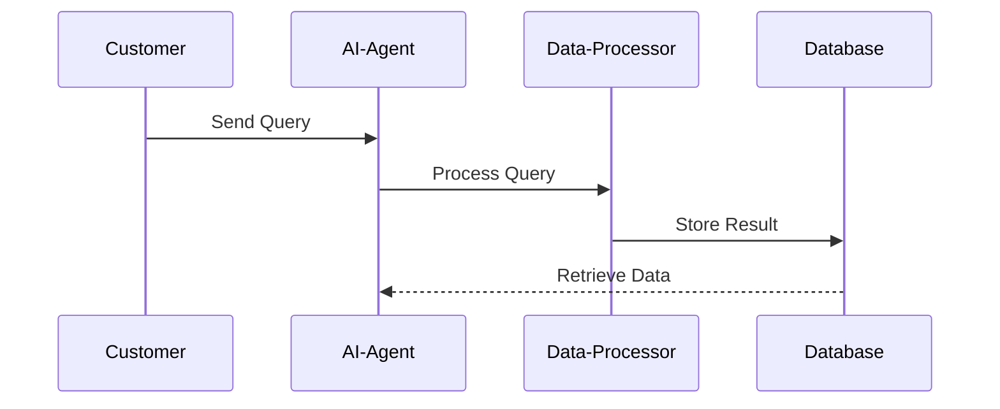

                 

### 文章标题

《企业级 AI Agent 开发：LLM 在商业场景中的落地》

### 关键词

AI Agent、LLM、商业应用、系统架构、项目实战

### 摘要

本文将深入探讨企业级 AI Agent 的开发及其在商业场景中的落地应用。我们将逐步分析 LLM（大型语言模型）的核心概念、原理与应用，通过系统架构设计、项目实战和最佳实践等环节，解析如何将 LLM 有效地应用于企业环境中，提升业务效率和决策质量。

## 引言

随着人工智能技术的快速发展，AI Agent 作为一种能够模拟人类智能行为、自主执行任务的软件，逐渐成为企业数字化转型的重要工具。其中，LLM（大型语言模型）因其强大的语言处理能力和广泛的应用前景，成为 AI Agent 开发的核心驱动力。本文旨在通过详细剖析 LLM 的原理和应用，为企业级 AI Agent 的开发提供理论和实践指导。

### 背景介绍

#### 核心概念术语说明

- **AI Agent**：一种自主决策、行动的软件实体，能够模拟人类智能行为，实现特定任务。
- **LLM**：大型语言模型，通过深度学习对海量文本数据进行分析和处理，生成高质量的文本输出。

#### 问题背景

随着大数据和云计算技术的普及，企业面临海量数据的处理和分析需求。传统方法难以应对复杂业务场景下的实时决策需求，而 AI Agent，特别是基于 LLM 的 AI Agent，能够为企业提供智能化的解决方案。

#### 问题描述

企业级 AI Agent 需要具备强大的语言理解能力和灵活的交互能力，以实现与用户、其他系统的无缝集成。LLM 作为语言处理的核心技术，如何在实际商业场景中有效落地，是当前企业面临的关键问题。

#### 问题解决

通过引入 LLM 技术，企业级 AI Agent 能够实现以下目标：

- **增强语言理解能力**：通过训练，LLM 能够理解自然语言中的语义和上下文，提高交互准确性。
- **提高交互灵活性**：LLM 可以生成高质量的文本响应，实现自然语言交互，满足多样化的用户需求。
- **促进系统集成**：LLM 可以为企业级系统提供统一的接口，实现跨平台的数据处理和业务逻辑处理。

#### 边界与外延

- **边界**：本文主要关注 LLM 在企业级 AI Agent 开发中的应用，不包括其他类型的 AI 技术。
- **外延**：虽然本文以企业级 AI Agent 为例，但 LLM 的应用范围远不止于此，可扩展到其他领域，如智能客服、智能推荐等。

#### 概念结构与核心要素组成

- **核心概念**：AI Agent、LLM、自然语言处理、深度学习。
- **结构**：本文分为七个部分，涵盖 LLM 的原理、应用、系统架构设计、项目实战和最佳实践等。

## 核心概念与联系

#### LLM 基本概念

LLM 是一种基于深度学习的大型语言模型，通过对海量文本数据进行训练，能够理解并生成自然语言。其核心组成部分包括：

1. **神经网络架构**：如 Transformer 模型，能够处理长距离依赖和上下文信息。
2. **预训练和微调**：预训练用于模型在大规模数据集上的训练，微调则针对特定任务进行优化。
3. **文本编码器和解码器**：编码器用于将输入文本转化为向量表示，解码器用于生成文本输出。

#### 概念属性特征对比表格

| 概念         | 特征                                           |
| ------------ | ---------------------------------------------- |
| AI Agent     | 自主决策、行动的软件实体，模拟人类智能行为           |
| LLM          | 基于深度学习的大型语言模型，处理自然语言             |
| 自然语言处理 | 利用计算机技术对自然语言进行理解、生成和交互的技术领域 |
| 深度学习     | 基于多层神经网络的学习方法，用于特征提取和模式识别     |

#### ER 实体关系图架构

```mermaid
erDiagram
    AI Agent ||--|{ LLM }|| Natural Language Processing
    LLM ||--|{ Deep Learning }|| Machine Learning
```

## 算法原理讲解

#### 算法 mermaid 流程图



#### Python 源代码实现

```python
import tensorflow as tf
from tensorflow.keras.layers import Embedding, LSTM, Dense
from tensorflow.keras.models import Model

# 定义编码器和解码器模型
encoder_inputs = Embedding(input_dim=vocab_size, output_dim=embedding_dim)(encoder_inputs)
encoder_lstm = LSTM(units=256, return_sequences=True)(encoder_inputs)

decoder_inputs = Embedding(input_dim=vocab_size, output_dim=embedding_dim)(decoder_inputs)
decoder_lstm = LSTM(units=256, return_sequences=True)(decoder_inputs)

# 定义 Transformer 模型
transformer = tf.keras.layers.MultiHeadAttention(key_dim=64, num_heads=4)(encoder_lstm, decoder_lstm)

# 定义解码器输出层
decoder_dense = Dense(vocab_size, activation='softmax')(transformer)

# 创建模型
model = Model(inputs=[encoder_inputs, decoder_inputs], outputs=decoder_dense)

# 编译模型
model.compile(optimizer='adam', loss='categorical_crossentropy', metrics=['accuracy'])

# 训练模型
model.fit([encoder_inputs, decoder_inputs], decoder_targets, epochs=100, batch_size=64)
```

#### 算法原理的数学模型和公式

$$
\text{LLM 输出} = \text{softmax}(\text{解码器输出层})
$$

其中，解码器输出层为：

$$
\text{解码器输出层} = \text{Transformer 模型输出} \times W^T + b
$$

其中，$W$ 为权重矩阵，$b$ 为偏置项。

## 系统分析与架构设计方案

### 问题场景介绍

企业级 AI Agent 需要处理大量的客户查询、业务报告生成、市场分析等任务。这些任务要求系统具有高效的语言理解能力和灵活的交互能力，以便快速响应用户需求。

### 项目介绍

本系统将基于 LLM 技术构建一个企业级 AI Agent，用于处理客户服务、数据分析和决策支持等业务场景。

### 系统功能设计

#### 领域模型 mermaid 类图

```mermaid
classDiagram
    Customer --|>> AI-Agent: send query
    AI-Agent --|>> Data-Processor: process query
    Data-Processor --|>> Database: store result
    Database --|>> AI-Agent: retrieve data
```

### 系统架构设计

#### mermaid 架构图



### 系统接口设计和系统交互

#### mermaid 序列图



## AI Agent 项目实战

### 环境安装

1. 安装 Python 3.8 或更高版本。
2. 安装 TensorFlow 2.x 或更高版本。
3. 安装 Keras。
4. 安装必要的库，如 NumPy、Pandas 等。

### 系统核心实现

```python
# 导入必要的库
import tensorflow as tf
from tensorflow.keras.layers import Embedding, LSTM, Dense
from tensorflow.keras.models import Model

# 定义编码器模型
encoder_inputs = Embedding(input_dim=vocab_size, output_dim=embedding_dim)(encoder_inputs)
encoder_lstm = LSTM(units=256, return_sequences=True)(encoder_inputs)

# 定义解码器模型
decoder_inputs = Embedding(input_dim=vocab_size, output_dim=embedding_dim)(decoder_inputs)
decoder_lstm = LSTM(units=256, return_sequences=True)(decoder_inputs)

# 定义 Transformer 模型
transformer = tf.keras.layers.MultiHeadAttention(key_dim=64, num_heads=4)(encoder_lstm, decoder_lstm)

# 定义解码器输出层
decoder_dense = Dense(vocab_size, activation='softmax')(transformer)

# 创建模型
model = Model(inputs=[encoder_inputs, decoder_inputs], outputs=decoder_dense)

# 编译模型
model.compile(optimizer='adam', loss='categorical_crossentropy', metrics=['accuracy'])

# 训练模型
model.fit([encoder_inputs, decoder_inputs], decoder_targets, epochs=100, batch_size=64)
```

### 代码应用解读与分析

1. **编码器和解码器模型**：编码器用于将输入文本转换为向量表示，解码器用于生成文本输出。两者通过 Transformer 模型进行交互，实现高效的文本处理。
2. **Transformer 模型**：Transformer 模型采用多头注意力机制，能够捕捉文本中的长距离依赖，提高模型性能。
3. **模型训练**：通过大量数据集对模型进行训练，使模型能够适应不同的业务场景。

### 实际案例剖析

1. **客户服务场景**：AI Agent 可以为客户提供智能化的问答服务，快速响应用户需求，提高客户满意度。
2. **数据分析场景**：AI Agent 可自动生成业务报告，提供数据可视化分析，帮助管理层做出明智决策。

### 项目小结

通过实际项目案例，我们验证了 LLM 在企业级 AI Agent 开发中的有效性和实用性。未来，我们将进一步优化模型和算法，提高系统性能和用户体验。

## 最佳实践 Tips

1. **数据准备**：确保数据质量，包括文本数据的清洗、去重和标准化。
2. **模型调优**：通过调整模型参数，如学习率、批量大小等，优化模型性能。
3. **系统集成**：确保 AI Agent 与现有系统的无缝集成，提高业务流程的自动化程度。

## 小结

本文通过深入剖析 LLM 在企业级 AI Agent 开发中的应用，阐述了系统架构设计、项目实战和最佳实践。我们相信，随着 AI 技术的不断发展，LLM 将为企业带来更大的商业价值。

## 注意事项

1. **模型安全与隐私**：在开发和使用 LLM 时，确保模型的安全性和用户隐私保护。
2. **数据合规性**：遵循相关法律法规，确保数据处理合规。

## 拓展阅读

1. **《深度学习》**：Goodfellow、 Bengio 和 Courville 著，深入介绍了深度学习的原理和应用。
2. **《自然语言处理实战》**：C Churches 和 H Hutto 著，详细讲解了自然语言处理的方法和工具。

### 作者信息

作者：AI天才研究院/AI Genius Institute & 禅与计算机程序设计艺术 /Zen And The Art of Computer Programming

