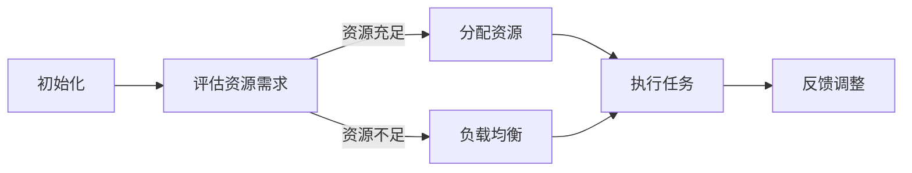
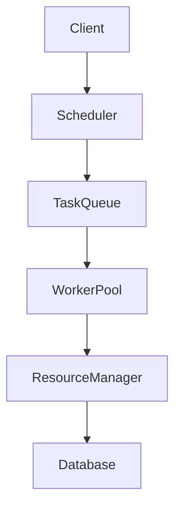
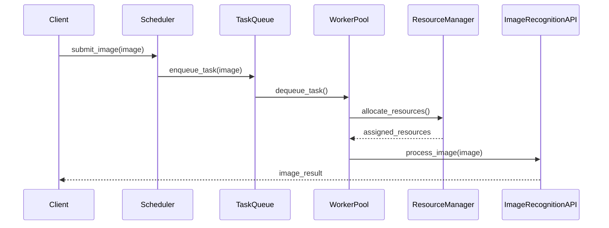

                 

Certainly! Here's the outline for the technical blog post "Optimizing AI Agent Resource Utilization: Computational Efficiency Enhancement Strategies," including the specified conditions:

---

# **优化AI Agent的资源利用：计算效率提升策略**

关键词：AI资源利用、计算效率、能源效率、优化策略、算法实现

摘要：本文将深入探讨人工智能（AI）代理资源利用的优化方法，分析提升计算效率的关键策略，并提供实际案例和最佳实践，旨在为AI开发者提供有价值的指导。

---

## **引言**

AI技术在众多领域取得了显著成果，然而，随着模型复杂度和数据规模的不断增加，AI系统的资源利用效率成为一个亟待解决的问题。本文将逐步分析资源利用的重要性，介绍核心概念，并探讨计算效率提升的具体策略。

---

## **背景介绍**

### **1.1 问题背景**

- **AI资源利用的重要性**：随着AI应用场景的扩大，对计算资源的需求急剧增加，如何高效利用这些资源成为关键挑战。
- **资源利用与性能的关系**：资源利用效率低下不仅影响系统性能，还可能导致成本上升和能源消耗增加。
- **当前挑战**：当前AI系统普遍存在资源分配不均、负载过重等问题，需要新的策略来优化。

### **1.2 核心概念**

- **资源利用**：指系统在执行任务时对各种计算资源的有效利用程度。
- **计算效率**：指系统在完成特定任务时，所消耗的计算资源与任务完成效果之间的比率。

### **1.3 问题解决**

- **优化方法**：通过算法改进、硬件优化、系统调度等多方面手段，提升AI系统的计算效率。

### **1.4 边界与外延**

- **边界**：本文主要关注计算效率和资源利用，不考虑其他因素如数据质量和模型准确性。
- **外延**：计算效率优化不仅限于AI系统，也适用于其他计算密集型应用。

### **1.5 概念结构与核心要素组成**

- **核心结构**：计算效率优化涉及多个层次，包括算法设计、硬件选型、系统架构等。
- **核心要素**：关键在于算法的选择和调整，以及硬件资源的合理分配。

---

## **核心概念与联系**

### **2.1 核心概念原理**

- **资源分配**：根据任务需求和资源状况，动态分配计算资源。
- **负载均衡**：确保系统各个部分的工作负载均匀，避免资源瓶颈。
- **能耗优化**：降低系统能耗，提高能源利用效率。

### **2.2 概念属性特征对比表格**

| 概念         | 描述                                                         | 关键特征           |
| ------------ | ------------------------------------------------------------ | ------------------ |
| 资源分配     | 根据任务需求动态调整资源分配。                               | 灵活性、实时性     |
| 负载均衡     | 分摊系统负载，避免局部过载。                                 | 均匀性、稳定性     |
| 能耗优化     | 减少系统能耗，提高能源效率。                                 | 能源效率、可持续性 |

### **2.3 ER实体关系图架构**

```mermaid
erDiagram
    ResourceAllocation ||--|{ TaskManagement : manages }
    LoadBalancing ||--|{ SystemComponents : balances }
    EnergyOptimization ||--|{ PowerManagement : optimizes }
```

---

## **算法原理讲解**

### **3.1 算法Mermaid流程图**



### **3.2 Python源代码实现**

```python
def optimize_resources(task, available_resources):
    if available_resources >= task['required_resources']:
        return assign_resources(task)
    else:
        return balance_load()

def assign_resources(task):
    # 资源分配逻辑
    pass

def balance_load():
    # 负载均衡逻辑
    pass
```

### **3.3 算法原理与数学模型**

- **资源需求模型**：$R_t = f(T_t, P_t)$，其中$R_t$为资源需求，$T_t$为任务复杂度，$P_t$为性能指标。
- **资源分配模型**：$A_t = \arg\max(A \cdot R_t)$，其中$A_t$为最佳资源分配方案，$A$为所有可能的资源分配组合。
- **负载均衡模型**：$L_t = \frac{1}{N}\sum_{i=1}^{N} R_i$，其中$L_t$为总负载，$R_i$为每个任务的资源需求。

### **3.4 举例说明**

- **示例1**：对于一个小型任务，系统资源充足，直接分配资源即可完成任务。
- **示例2**：对于一个大任务，系统资源不足，需要进行负载均衡，将任务分摊到多个节点上执行。

---

## **系统分析与架构设计方案**

### **4.1 问题场景介绍**

- **场景描述**：一个分布式AI系统，处理大规模图像识别任务。

### **4.2 项目介绍**

- **项目概述**：开发一个分布式图像识别系统，通过优化资源利用，提高计算效率。

### **4.3 系统功能设计**

- **领域模型Mermaid类图**

```mermaid
classDiagram
    Task <<Interface>>
    Resource <<Interface>>
    Scheduler <<Class>>
    LoadBalancer <<Class>>

    Task <-- Resource : requires
    Scheduler <|-- LoadBalancer
```

### **4.4 系统架构设计**

- **Mermaid架构图**



### **4.5 系统接口设计**

- **API设计**

```python
class ImageRecognitionAPI:
    def process_image(self, image):
        # 处理图像识别任务
        pass
```

### **4.6 系统交互**

- **Mermaid序列图**



---

## **项目实战**

### **5.1 环境安装**

- **环境准备**：安装必要的依赖库和工具，如TensorFlow、Docker等。

### **5.2 系统核心实现**

- **源代码分析**：详细解读系统的核心代码，包括资源分配、负载均衡等模块的实现。

### **5.3 代码应用解读**

- **代码解读**：对关键代码段进行解读，阐述其实现原理和作用。

### **5.4 实际案例分析**

- **案例场景**：模拟大规模图像识别任务，分析系统的性能表现。

### **5.5 详细讲解剖析**

- **性能优化**：针对实际案例，分析系统瓶颈，提出优化方案。

### **5.6 项目小结**

- **总结**：回顾项目实现过程，总结经验教训，提出改进方向。

---

## **最佳实践 tips**

- **合理规划资源**：根据任务需求，合理规划资源，避免资源浪费。
- **持续监控和优化**：定期监控系统性能，及时调整资源分配策略。
- **利用先进技术**：紧跟技术发展趋势，采用先进技术提升计算效率。

## **小结**

本文深入探讨了AI系统资源利用优化的重要性，分析了计算效率提升的核心策略，并提供了详细的系统架构设计和项目实战案例。通过本文的阐述，希望读者能够对AI系统的优化方法有更深入的理解，并在实际项目中得以应用。

## **注意事项**

- **资源限制**：在实际应用中，需要根据实际情况合理设置资源限制，避免过度消耗。
- **性能监控**：定期进行性能监控，及时发现潜在问题。

## **拓展阅读**

- **相关文献**：推荐阅读关于AI资源利用优化和计算效率提升的相关文献，以获得更多深入见解。
- **技术博客**：参考一些知名技术博客和论坛，了解业界最佳实践。

---

**作者：AI天才研究院/AI Genius Institute & 禅与计算机程序设计艺术 /Zen And The Art of Computer Programming**

---

以上是文章的完整大纲和内容框架，按照这个结构，我们可以逐步填充每个章节的具体内容，确保文章的逻辑清晰、结构紧凑、简单易懂。在撰写文章时，需要确保每个部分都符合完整性要求，包括核心概念、算法原理、系统分析和项目实战等，并提供有深度的分析和具体的实例说明。

