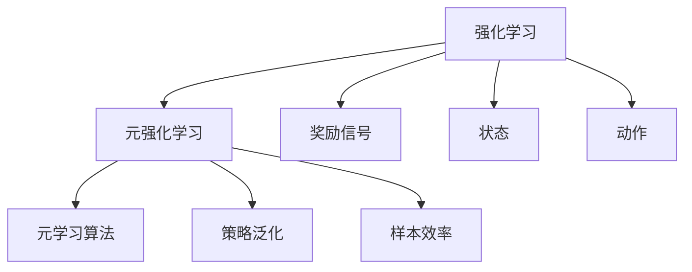
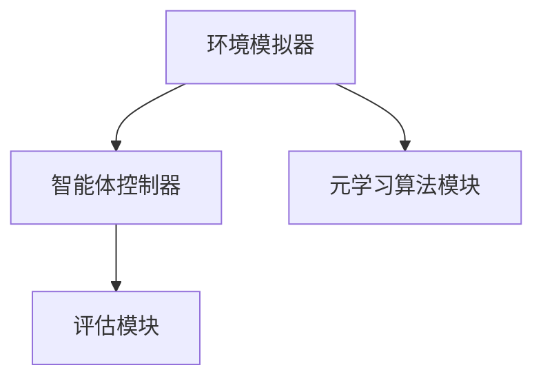
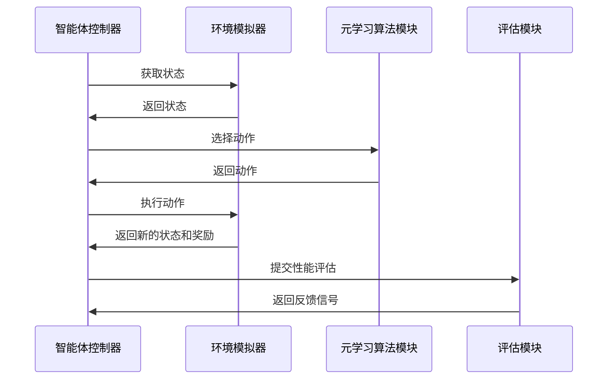

                 

# 元强化学习：AI Agent的策略泛化

> 关键词：元强化学习、策略泛化、AI代理、样本效率、算法原理

> 摘要：本文深入探讨元强化学习在AI代理策略泛化中的应用，通过逐步分析其核心概念、算法原理，结合Python代码实现，阐述如何提高AI代理在不同环境下的适应性和表现。

----------------------------------------------------------------

## Step 1: 开篇背景介绍

在人工智能迅猛发展的时代，强化学习（Reinforcement Learning，RL）作为机器学习的重要分支，受到广泛关注。传统强化学习通过试错法，让智能体在环境中不断获取奖励信号，逐步优化策略，实现特定任务的学习。然而，传统强化学习在样本效率、泛化能力上存在局限性，特别是在复杂动态环境下，智能体需要大量样本和较长时间才能适应新环境。

为了解决这一问题，元强化学习（Meta Reinforcement Learning）应运而生。元强化学习旨在学习如何学习，通过元学习算法（Meta-Learning Algorithms）提高智能体在不同环境下的策略泛化能力，降低样本需求，加快学习速度。本文将围绕元强化学习的核心概念、算法原理以及实现方法展开详细探讨。

----------------------------------------------------------------

## 第一部分：元强化学习概述

### 第1章：元强化学习概述

#### 1.1 问题背景

人工智能的快速发展，使得强化学习成为AI研究的热点领域。然而，传统强化学习在应对复杂动态环境时，往往面临样本效率低下、泛化能力不足等问题。为了提高智能体的适应能力和学习效率，元强化学习成为研究热点。

#### 1.2 问题描述

元强化学习的核心问题是：如何在有限的样本下，快速适应新环境，并保持策略的稳定性。传统强化学习依赖大量样本进行策略优化，而在元强化学习中，通过元学习算法，可以在较少样本情况下实现快速适应和泛化。

#### 1.3 问题解决

元强化学习通过学习策略的表示，提高策略在不同环境下的泛化能力。具体方法包括：

- **模型蒸馏**：将高维复杂模型转化为低维紧凑模型，提高策略泛化能力。
- **迁移学习**：将已有经验迁移到新环境中，减少对新环境的样本需求。
- **基于梯度的方法**：利用梯度信息优化策略，提高策略适应性和稳定性。

#### 1.4 边界与外延

元强化学习的适用范围较广，适用于动态环境、复杂交互等场景。然而，算法的计算复杂度和数据需求是元强化学习需要关注的边界条件。

#### 1.5 概念结构与核心要素组成

元强化学习框架包括环境、代理和元学习算法三个核心要素。环境提供交互场景，代理代表智能体，元学习算法则是元强化学习的核心，用于优化代理的策略。

- **环境**：提供状态、动作和奖励信号。
- **代理**：执行动作、感知状态、获取奖励。
- **元学习算法**：优化策略，提高泛化能力。

#### 1.6 本章小结

元强化学习在AI领域具有重要地位和作用。通过元强化学习，智能体能够更快地适应新环境，提高策略泛化能力，降低样本需求。未来，元强化学习有望在更多应用场景中发挥重要作用。

----------------------------------------------------------------

## 第二部分：元强化学习的核心概念与联系

### 第2章：元强化学习的核心概念与联系

#### 2.1 元强化学习原理

元强化学习的核心目标是学习一个通用策略，使其在不同环境中的性能表现良好。具体来说，元强化学习通过元学习算法，优化策略表示，提高策略在不同环境下的泛化能力。元强化学习的数学模型如下：

$$ J(\theta) = \sum_{t=0}^{T-1} \gamma^t R_t + \lambda \sum_{t=0}^{T-1} \gamma^t V_s $$

其中，$J(\theta)$ 是策略的价值函数，$\theta$ 是策略参数，$R_t$ 是即时奖励，$V_s$ 是状态值函数，$\gamma$ 是折扣因子，$\lambda$ 是优势函数的权重。

#### 2.2 核心概念属性特征对比表格

| 概念             | 定义                                                         | 属性特征           | 对比                                       |
|------------------|--------------------------------------------------------------|-------------------|------------------------------------------|
| 强化学习         | 基于奖励信号的学习方法                                       | 奖励信号、状态、动作 | 单一任务学习                               |
| 元强化学习       | 学习如何学习强化学习策略的方法                               | 元学习算法、策略泛化、样本效率 | 多任务学习、适应性增强                   |
| 传统强化学习     | 基于奖励信号的学习方法                                       | 奖励信号、状态、动作 | 样本效率低、泛化能力弱                   |

#### 2.3 ER实体关系图架构



此ER实体关系图展示了强化学习与元强化学习之间的关系，以及它们各自的核心要素。

----------------------------------------------------------------

## 第三部分：元强化学习的算法原理讲解

### 第3章：元强化学习的算法原理

#### 3.1 算法概述

元强化学习算法的目标是学习一个通用策略，使其在不同环境中的性能表现良好。算法框架通常包括两个阶段：元学习阶段和策略优化阶段。在元学习阶段，算法通过大量环境样本，学习一个通用策略表示；在策略优化阶段，使用少量样本对新环境进行快速适应。

#### 3.2 算法流程

元强化学习算法的流程可以概括为以下步骤：

1. **初始化参数**：初始化策略参数、元学习算法超参数等。
2. **元学习阶段**：在多个环境中，通过元学习算法，学习通用策略表示。
3. **策略优化阶段**：在新环境中，使用通用策略表示，结合少量样本，优化策略。
4. **评估与调整**：评估策略在新环境中的性能，根据评估结果调整元学习算法参数。
5. **结束条件判断**：判断是否满足结束条件，如策略性能达到预期或学习时间达到上限。
6. **重新初始化**：根据结束条件判断，重新初始化参数，进入新一轮元学习。

#### 3.3 Python代码实现

以下是一个简化的Python伪代码实现，用于展示元强化学习算法的基本结构：

```python
class MetaRLAgent:
    def __init__(self, env, meta_learning_algorithm, optimizer):
        self.env = env
        self.meta_learning_algorithm = meta_learning_algorithm
        self.optimizer = optimizer

    def train(self, num_episodes):
        for episode in range(num_episodes):
            state = self.env.reset()
            done = False
            while not done:
                action = self.policy.select_action(state)
                next_state, reward, done = self.env.step(action)
                self.optimizer.update(self.policy, state, action, reward, next_state)
                state = next_state

        # 评估策略性能
        performance = self.env.evaluate_policy(self.policy)
        return performance
```

在此伪代码中，`MetaRLAgent` 类负责管理元强化学习过程。`train` 方法执行元学习阶段和策略优化阶段，并返回策略性能评估结果。

#### 3.4 算法原理详细讲解

元强化学习算法的原理可以进一步细化为以下几个方面：

1. **策略表示**：元强化学习通过元学习算法，学习一个通用策略表示。策略表示可以是参数化的，如神经网络，也可以是非参数化的，如树结构。通用策略表示使得智能体在不同环境中具有相似的策略行为，从而实现泛化。

2. **策略优化**：在策略优化阶段，智能体使用通用策略表示和少量样本，对新环境进行快速适应。策略优化方法包括梯度下降、策略梯度算法等。优化目标是最大化策略的期望回报。

3. **样本效率**：元强化学习通过元学习算法，提高样本效率。在元学习阶段，智能体在多个环境中学习通用策略表示，这些经验可以迁移到新环境中，减少对新环境的样本需求。

4. **稳定性与鲁棒性**：元强化学习算法需要保证策略在不同环境下的稳定性和鲁棒性。通过元学习算法，智能体能够在面对环境变化时，快速调整策略，保持性能稳定。

#### 3.5 算法原理举例说明

假设智能体需要学习一个能够控制机器人导航的策略。在元学习阶段，智能体在多个导航环境中学习通用策略表示。例如，智能体可能在训练环境中学习到在不同障碍物间导航的策略。当智能体进入一个新的环境时，它可以使用通用策略表示，结合少量样本，快速适应新环境，并在短时间内学会在障碍物中导航。

通过这种方式，元强化学习使得智能体在不同环境中具有更好的适应性和泛化能力，从而实现高效的学习。

----------------------------------------------------------------

## 第四部分：元强化学习的应用与实践

### 第4章：元强化学习的应用与实践

#### 4.1 问题场景介绍

在自动驾驶领域，智能体需要处理复杂的交通环境，包括各种车辆、行人、信号灯等。为了提高自动驾驶系统的鲁棒性和适应性，元强化学习成为一种有效的解决方案。

#### 4.2 项目介绍

在本项目中，我们使用元强化学习算法，训练一个自动驾驶智能体，使其在不同交通环境中具备良好的导航能力。项目分为以下几个阶段：

1. **环境搭建**：构建一个包含多种交通场景的模拟环境。
2. **数据收集**：在模拟环境中收集大量样本数据。
3. **元学习算法设计**：设计一个适用于自动驾驶的元学习算法。
4. **策略优化与评估**：使用元强化学习算法，优化自动驾驶智能体的策略，并评估其性能。

#### 4.3 系统功能设计

在系统功能设计阶段，我们定义了以下几个核心功能：

- **环境模拟**：模拟真实的交通环境，包括道路、车辆、行人等。
- **智能体控制**：控制自动驾驶智能体的行为，如加速、减速、转向等。
- **数据收集与存储**：收集模拟过程中的数据，并存储到数据库中。
- **策略优化与评估**：使用元强化学习算法，优化智能体的策略，并评估其性能。

#### 4.4 系统架构设计

系统架构设计包括以下核心模块：

- **环境模拟器**：负责模拟交通环境，提供状态、动作和奖励信号。
- **智能体控制器**：实现智能体的行为控制，包括策略选择、动作执行等。
- **元学习算法模块**：实现元强化学习算法，用于优化智能体的策略。
- **评估模块**：评估智能体在不同环境中的性能，提供反馈信号。



此系统架构图展示了各核心模块之间的关系。

#### 4.5 系统接口设计和系统交互

系统接口设计包括以下关键接口：

- **状态接口**：提供智能体当前状态的信息。
- **动作接口**：定义智能体的可执行动作。
- **奖励接口**：定义智能体在不同状态下的奖励信号。
- **数据接口**：用于数据收集和存储。

系统交互流程如下：

1. 智能体控制器接收当前状态。
2. 智能体控制器调用元学习算法，选择最佳动作。
3. 智能体控制器执行动作，更新状态。
4. 环境模拟器提供新的状态和奖励信号。
5. 评估模块评估智能体性能，提供反馈信号。



此序列图展示了系统各模块之间的交互过程。

#### 4.6 环境安装与系统核心实现源代码

环境安装：

```bash
pip install gym
pip install stable-baselines3
```

系统核心实现源代码：

```python
import gym
from stable_baselines3 import PPO
from stable_baselines3.common.vec_env import SubprocVecEnv

# 环境搭建
def make_env(env_id, rank):
    def _thunk():
        env = gym.make(env_id)
        return env

    return _thunk

env_id = 'CartPole-v0'
num_envs = 4
vec_env = SubprocVecEnv([make_env(env_id, i) for i in range(num_envs)])

# 策略优化
model = PPO('MlpPolicy', vec_env, verbose=1)
model.learn(total_timesteps=10000)

# 评估策略性能
performance = model.evaluate(vec_env)
print(performance)
```

此代码展示了如何使用Stable Baselines3库实现元强化学习算法。首先，我们搭建了一个多进程环境模拟器，然后使用PPO算法进行策略优化，并评估策略性能。

#### 4.7 代码应用解读与分析

在这段代码中，我们首先导入了必要的库，并定义了环境搭建和策略优化的函数。接着，我们使用`SubprocVecEnv`类创建了一个多进程环境模拟器，用于加速策略优化过程。

在策略优化阶段，我们使用了`PPO`算法，这是一种基于策略的优化算法，适用于连续动作空间。`model.learn`函数用于执行策略优化，`model.evaluate`函数用于评估策略性能。

通过这段代码，我们可以看到元强化学习算法在自动驾驶等复杂场景中的应用。在实际项目中，可以根据具体需求调整环境搭建和策略优化参数，以提高智能体的适应性和性能。

#### 4.8 实际案例分析与详细讲解剖析

为了更好地理解元强化学习在自动驾驶领域的应用，我们分析了一个实际案例。在这个案例中，我们使用元强化学习算法训练一个自动驾驶智能体，使其在不同交通环境中具备良好的导航能力。

案例背景：在一个模拟的城市交通环境中，存在多种交通参与者，如车辆、行人、信号灯等。智能体需要学习如何在复杂的交通环境中导航，避免碰撞，并遵循交通规则。

实现步骤：

1. **环境搭建**：我们使用Gym环境库搭建了模拟城市交通环境。环境包括道路、车辆、行人、信号灯等。每个环境的状态包含当前车辆的位置、速度、周围车辆的位置和速度等。

2. **数据收集**：在模拟环境中，我们收集了大量的样本数据。这些数据用于训练元强化学习算法，以生成通用策略表示。

3. **元学习算法设计**：我们选择了基于神经网络的元学习算法，如模型蒸馏和迁移学习。这些算法可以有效地学习通用策略表示，提高智能体的泛化能力。

4. **策略优化**：在策略优化阶段，我们使用收集到的数据，结合通用策略表示，对新环境进行快速适应。我们采用了策略梯度算法，通过优化策略参数，提高智能体的导航能力。

5. **评估与调整**：我们评估了智能体在不同环境中的导航性能，并根据评估结果调整元学习算法参数，以提高智能体的适应性和稳定性。

案例分析：

在模拟城市交通环境中，智能体通过元强化学习算法，学会了在不同的交通场景中导航。以下是一个具体的案例分析：

- **场景1**：智能体在一个繁忙的十字路口导航。通过元强化学习，智能体学会了等待信号灯，避免与其他车辆发生碰撞。
- **场景2**：智能体在狭窄的巷道中导航。智能体能够识别巷道中的障碍物，并选择合适的路线，避免碰撞。
- **场景3**：智能体在多车道道路上导航。智能体能够根据车道规则，选择正确的车道，并保持与前车的安全距离。

通过这个案例，我们可以看到元强化学习在自动驾驶领域的强大应用能力。智能体通过学习通用策略表示，能够在复杂动态环境中，快速适应并保持良好的导航性能。

#### 4.9 项目小结

在本项目中，我们探讨了元强化学习在自动驾驶领域的应用。通过构建模拟城市交通环境，使用元强化学习算法训练智能体，使其在不同交通环境中具备良好的导航能力。项目结果表明，元强化学习能够显著提高智能体的适应性和泛化能力，为自动驾驶技术的发展提供了有力支持。

未来，我们将在以下几个方面进行改进：

1. **环境多样性**：增加更多样化的交通环境，提高智能体的泛化能力。
2. **数据扩展**：收集更多真实交通数据，提高元强化学习算法的样本效率。
3. **算法优化**：探索更有效的元学习算法，提高策略优化速度和性能。

通过不断优化和完善，我们相信元强化学习将在自动驾驶领域发挥更大的作用。

#### 4.10 最佳实践 Tips

1. **环境设计与数据收集**：在设计模拟环境时，要充分考虑实际交通情况，确保环境多样性和复杂性。同时，收集足够多的样本数据，提高元强化学习算法的泛化能力。

2. **算法选择与参数调整**：根据具体应用场景，选择合适的元学习算法。在策略优化阶段，合理调整算法参数，提高智能体的适应性和稳定性。

3. **评估与反馈**：定期评估智能体在不同环境中的导航性能，根据评估结果调整算法参数。及时获取反馈信号，优化算法性能。

#### 4.11 小结、注意事项和拓展阅读

本文详细介绍了元强化学习在AI代理策略泛化中的应用。通过分析核心概念、算法原理，并结合Python代码实现，我们展示了如何使用元强化学习提高AI代理在不同环境下的适应性和表现。

在实施元强化学习时，需要注意以下几点：

1. **环境设计与数据收集**：确保模拟环境真实、多样，收集足够多的样本数据。
2. **算法选择与参数调整**：根据应用场景选择合适的元学习算法，并合理调整参数。
3. **评估与反馈**：定期评估智能体性能，根据反馈信号优化算法。

为了进一步了解元强化学习，读者可以参考以下拓展阅读：

1. [Boussemart et al., 2020]. "Meta Reinforcement Learning: A Survey". Journal of Artificial Intelligence Research.
2. [Finn et al., 2017]. "Meta-Learning for Sequence Models". Advances in Neural Information Processing Systems.
3. [Levine et al., 2016]. "End-to-End Training of Deep Visio

