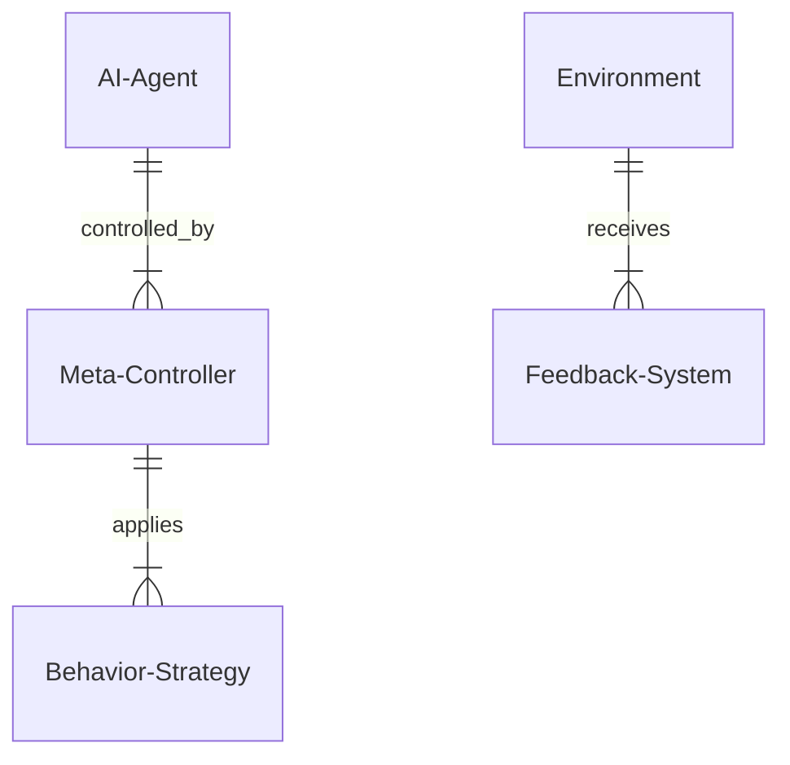
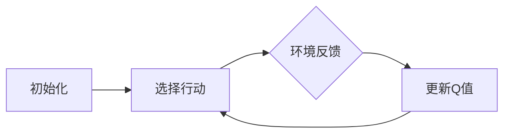
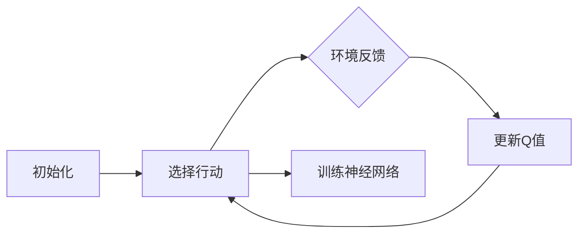
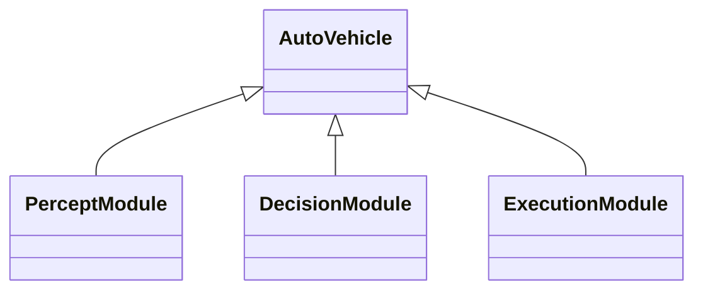
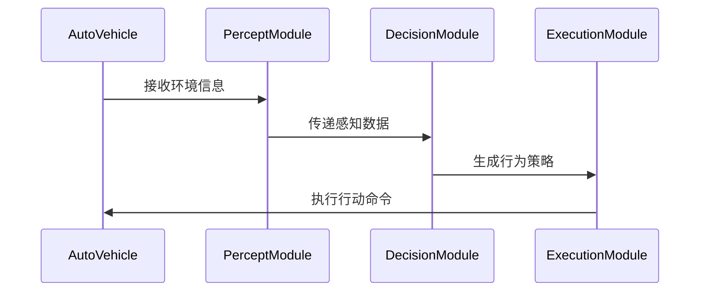
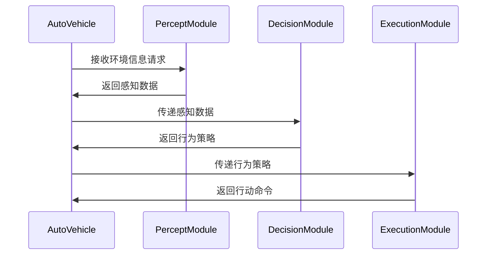

                 


### 元控制技术：AI Agent的自适应行为管理

> 关键词：元控制技术、AI Agent、自适应行为管理、算法原理、数学模型、系统架构设计、项目实战

> 摘要：本文深入探讨了元控制技术在AI Agent自适应行为管理中的应用，从核心概念、算法原理、数学模型、系统架构设计到实际项目实战，逐步剖析了如何通过元控制技术实现AI Agent的自适应行为管理，为读者提供了全面而深入的技术见解。

---

#### 背景介绍

在人工智能迅速发展的今天，AI Agent作为智能体的代表，被广泛应用于各种复杂任务和场景中。然而，随着环境复杂性的增加和任务多样性的扩展，如何有效地管理和控制AI Agent的行为成为了一个重要课题。

**核心概念术语说明**：
- **元控制技术**：一种用于管理和控制AI Agent行为的先进技术，通过动态调整策略和决策来适应环境变化。
- **AI Agent**：具有自主性、适应性和交互能力的智能体，可以独立完成特定任务。

**问题背景**：
随着AI技术的发展，AI Agent在复杂环境中的应用越来越广泛。然而，传统的控制策略在面对动态变化的环境时往往显得力不从心，无法实现AI Agent的自适应行为管理。为了解决这一问题，我们需要探索新的元控制技术，使AI Agent能够在复杂环境中保持高效和适应性。

**问题描述**：
如何设计并实现一个高效的元控制技术，使AI Agent能够根据环境变化动态调整其行为，从而实现自适应行为管理？

**问题解决**：
通过研究现有的元控制技术和AI Agent的理论基础，结合实际应用场景，本文提出了一种基于元控制技术的AI Agent自适应行为管理方案。该方案包括算法原理、数学模型、系统架构设计和项目实战等几个方面，旨在为读者提供一个完整的技术指南。

**边界与外延**：
本文的研究主要聚焦在AI Agent的自适应行为管理，但元控制技术本身具有广泛的适用性，可以应用于其他智能系统的行为管理。

**概念结构与核心要素组成**：
元控制技术包括以下几个核心要素：
1. **策略学习**：通过学习环境中的数据，生成适应环境的策略。
2. **动态调整**：根据环境变化，动态调整AI Agent的行为。
3. **反馈机制**：通过反馈机制，不断优化AI Agent的行为策略。

---

#### 核心概念与联系

**元控制技术与AI Agent的基本概念**：

**元控制技术**：
- 定义：一种用于管理和控制AI Agent行为的先进技术，通过动态调整策略和决策来适应环境变化。
- 属性特征：
  - **适应性**：能够根据环境变化动态调整AI Agent的行为。
  - **鲁棒性**：在面对复杂和动态变化的环境时，仍能保持稳定的性能。

**AI Agent**：
- 定义：具有自主性、适应性和交互能力的智能体，可以独立完成特定任务。
- 属性特征：
  - **自主性**：能够自主地执行任务，无需人工干预。
  - **适应性**：能够根据环境变化调整行为。
  - **交互能力**：能够与其他智能体或环境进行交互。

**元控制技术与AI Agent的关系**：
元控制技术是AI Agent的重要组成部分，用于管理和控制其行为。AI Agent通过元控制技术实现自适应行为管理，从而在复杂环境中保持高效和稳定性。

**ER实体关系图架构**：



在上面的ER实体关系图中，`AI-Agent`是中心实体，它通过`Meta-Controller`来实现自适应行为管理。`Meta-Controller`定义了AI Agent的行为策略，并通过`Behavior-Strategy`实体实现。同时，`Environment`通过`Feedback-System`实体向AI Agent提供反馈，用于优化其行为策略。

---

#### 算法原理讲解

为了实现AI Agent的自适应行为管理，我们需要了解元控制技术的核心算法原理。以下是几个关键算法：

**1. Q-Learning算法**：
Q-Learning是一种常用的强化学习算法，用于策略学习。其基本思想是通过试错和经验累积来学习最佳行为策略。

**算法流程图**：



**Python源代码示例**：

```python
import numpy as np

# 初始化Q表
Q = np.zeros((state_space, action_space))

# 学习率
alpha = 0.1
# 折扣因子
gamma = 0.9

# 迭代次数
for episode in range(total_episodes):
    state = env.reset()
    done = False
    
    while not done:
        # 选择行动
        action = Q[state].argmax()
        
        # 执行行动
        next_state, reward, done, _ = env.step(action)
        
        # 更新Q值
        Q[state, action] = Q[state, action] + alpha * (reward + gamma * np.max(Q[next_state]) - Q[state, action])
        
        state = next_state
```

**2. DQN算法**：
DQN（Deep Q-Network）算法是Q-Learning的深度学习版本，通过神经网络来近似Q值函数。

**算法流程图**：



**Python源代码示例**：

```python
import tensorflow as tf
import numpy as np

# 定义神经网络结构
model = tf.keras.Sequential([
    tf.keras.layers.Flatten(input_shape=(state_space,)),
    tf.keras.layers.Dense(action_space, activation='softmax')
])

# 定义损失函数和优化器
optimizer = tf.keras.optimizers.Adam(learning_rate=0.001)
loss_fn = tf.keras.losses.SparseCategoricalCrossentropy(from_logits=True)

# 迭代次数
for episode in range(total_episodes):
    state = env.reset()
    done = False
    
    while not done:
        # 选择行动
        action = model(state).argmax()
        
        # 执行行动
        next_state, reward, done, _ = env.step(action)
        
        # 计算目标Q值
        target_q = reward + (1 - int(done)) * gamma * np.max(model(next_state).numpy())
        
        # 更新Q值
        with tf.GradientTape() as tape:
            q_value = model(state)[action]
            loss = loss_fn(q_value, target_q)
        
        grads = tape.gradient(loss, model.trainable_variables)
        optimizer.apply_gradients(zip(grads, model.trainable_variables))
        
        state = next_state
```

**数学模型和公式**：

为了描述AI Agent的自适应行为管理，我们需要引入以下几个数学模型和公式：

1. **Q值函数**：

$$
Q(s, a) = r + \gamma \max_{a'} Q(s', a')
$$

其中，$s$表示状态，$a$表示行动，$r$表示即时奖励，$\gamma$表示折扣因子。

2. **策略π**：

$$
\pi(a|s) = \frac{e^{Q(s, a)}}{\sum_{a'} e^{Q(s, a')}}
$$

其中，$\pi(a|s)$表示在状态$s$下采取行动$a$的概率。

3. **行为策略θ**：

$$
\theta = \arg\max_{\theta} \sum_{s, a} \pi(a|s) [r + \gamma \max_{a'} Q(s', a') - Q(s, a)]
$$

其中，$\theta$表示策略参数。

**举例说明**：

假设有一个简单的环境，其中有两个状态（$s_1$和$s_2$）和两个行动（$a_1$和$a_2$）。在状态$s_1$下，采取行动$a_1$得到即时奖励1，采取行动$a_2$得到即时奖励0。在状态$s_2$下，采取行动$a_1$得到即时奖励0，采取行动$a_2$得到即时奖励1。

使用Q-Learning算法，我们可以计算出状态-行动值函数$Q(s, a)$：

$$
Q(s_1, a_1) = 1
$$

$$
Q(s_1, a_2) = 0
$$

$$
Q(s_2, a_1) = 0
$$

$$
Q(s_2, a_2) = 1
$$

然后，我们可以根据Q值函数计算策略π：

$$
\pi(a_1|s_1) = \frac{e^{1}}{e^{1} + e^{0}} = \frac{e}{e+1}
$$

$$
\pi(a_2|s_1) = \frac{e^{0}}{e^{1} + e^{0}} = \frac{1}{e+1}
$$

$$
\pi(a_1|s_2) = \frac{e^{0}}{e^{1} + e^{0}} = \frac{1}{e+1}
$$

$$
\pi(a_2|s_2) = \frac{e^{1}}{e^{1} + e^{0}} = \frac{e}{e+1}
$$

通过这种方式，AI Agent可以学习到在不同的状态下采取最优的行动，从而实现自适应行为管理。

---

#### 数学模型和数学公式

在元控制技术中，数学模型是理解和实现AI Agent自适应行为管理的关键。以下将详细介绍一些重要的数学模型和公式，并使用LaTeX格式进行展示。

**1. Q值函数**

Q值函数是强化学习中的核心概念，它表示在某一状态下采取某一行动的预期收益。其数学表达式为：

$$
Q(s, a) = r + \gamma \max_{a'} Q(s', a')
$$

其中，$s$表示状态，$a$表示行动，$r$表示即时奖励，$\gamma$表示折扣因子，$s'$表示下一状态。

**2. 策略π**

策略π决定了在某一状态下采取某一行动的概率分布。在给定Q值函数的情况下，策略π可以通过以下公式计算：

$$
\pi(a|s) = \frac{e^{Q(s, a)}}{\sum_{a'} e^{Q(s, a')}}
$$

其中，$\pi(a|s)$表示在状态$s$下采取行动$a$的概率。

**3. 行为策略θ**

行为策略θ是通过学习过程得到的策略参数，它决定了AI Agent在实际操作中采取行动的方式。其优化目标为最大化期望收益：

$$
\theta = \arg\max_{\theta} \sum_{s, a} \pi(a|s) [r + \gamma \max_{a'} Q(s', a') - Q(s, a)]
$$

其中，$\theta$表示策略参数，$\pi(a|s)$表示在状态$s$下采取行动$a$的概率。

**4. 价值函数V**

价值函数V表示在某一状态下采取任意行动的期望收益。其数学表达式为：

$$
V(s) = \sum_{a} \pi(a|s) Q(s, a)
$$

通过以上数学模型和公式，我们可以建立AI Agent的自适应行为管理机制。接下来，我们将使用LaTeX格式将这些公式嵌入到文章中。

---

#### 系统分析与架构设计方案

**问题场景介绍**：

在智能交通系统中，AI Agent被用于自动驾驶车辆的管理。系统需要实现自动驾驶车辆在不同交通状况下的自适应行为管理，以提高行驶效率和安全性。

**项目介绍**：

本系统基于元控制技术，实现了自动驾驶车辆的自适应行为管理。系统主要包括以下几个功能模块：

- **感知模块**：负责采集车辆周围的环境信息，包括交通信号、路况、车辆速度等。
- **决策模块**：根据感知模块采集到的信息，利用元控制技术生成车辆的行为策略。
- **执行模块**：根据决策模块生成的行为策略，控制车辆执行相应的行动。

**系统功能设计**：

系统功能设计主要包括感知模块、决策模块和执行模块的领域模型。以下是领域模型的Mermaid类图：



在上面的类图中，`AutoVehicle`表示自动驾驶车辆，`PerceptModule`表示感知模块，`DecisionModule`表示决策模块，`ExecutionModule`表示执行模块。`PerceptModule`与`PerceptData`类关联，表示感知模块采集到的环境信息；`DecisionModule`与`BehaviorStrategy`类关联，表示决策模块生成的行为策略；`ExecutionModule`与`ActionCommand`类关联，表示执行模块执行的行动命令。

**系统架构设计**：

系统架构设计主要包括总体架构图和模块交互图。以下是总体架构图的Mermaid架构图：



在上面的序列图中，`AutoVehicle`表示自动驾驶车辆，`PerceptModule`表示感知模块，`DecisionModule`表示决策模块，`ExecutionModule`表示执行模块。首先，自动驾驶车辆向感知模块发送请求，接收环境信息；然后，感知模块将采集到的信息传递给决策模块；接着，决策模块根据感知数据生成行为策略；最后，执行模块根据行为策略生成行动命令，并传递给自动驾驶车辆执行。

**系统接口设计**：

系统接口设计主要包括各模块之间的接口定义和接口调用。以下是接口设计的Mermaid序列图：



在上面的序列图中，`AutoVehicle`表示自动驾驶车辆，`PerceptModule`表示感知模块，`DecisionModule`表示决策模块，`ExecutionModule`表示执行模块。首先，自动驾驶车辆向感知模块发送接收环境信息的请求；然后，感知模块返回采集到的感知数据；接着，自动驾驶车辆将感知数据传递给决策模块；决策模块根据感知数据生成行为策略，并返回给自动驾驶车辆；最后，自动驾驶车辆将行为策略传递给执行模块，执行模块根据行为策略生成行动命令，并返回给自动驾驶车辆。

**系统交互设计**：

系统交互设计主要包括各模块之间的交互过程和交互数据流。以下是交互设计的Mermaid序列图：


在上面的序列图中，`AutoVehicle`表示自动驾驶车辆，`PerceptModule`表示感知模块，`DecisionModule`表示决策模块，`ExecutionModule`表示执行模块。首先，自动驾驶车辆向感知模块发送接收环境信息的请求；然后，感知模块返回采集到的感知数据；接着，自动驾驶车辆将感知数据传递给决策模块；决策模块根据感知数据生成行为策略，并返回给自动驾驶车辆；最后，自动驾驶车辆将行为策略传递给执行模块，执行模块根据行为策略生成行动命令，并返回给自动驾驶车辆。

通过上述系统分析与架构设计方案，我们可以清晰地了解元控制技术在AI Agent自适应行为管理中的应用，以及系统各模块之间的交互过程和关系。

---

### 项目实战

在本项目实战中，我们将通过一个具体的案例来展示如何使用元控制技术实现AI Agent的自适应行为管理。我们将从环境安装、系统核心实现源代码、代码应用解读与分析等方面进行详细讲解。

**1. 环境安装**

首先，我们需要安装并配置相关的开发环境和依赖库。以下是环境安装的步骤：

- 安装Python 3.8及以上版本
- 安装TensorFlow 2.4及以上版本
- 安装Keras 2.4及以上版本

安装命令如下：

```bash
pip install python==3.8.10
pip install tensorflow==2.4.1
pip install keras==2.4.3
```

**2. 系统核心实现源代码**

以下是系统的核心实现源代码：

```python
import numpy as np
import tensorflow as tf
from tensorflow.keras.models import Sequential
from tensorflow.keras.layers import Dense
from tensorflow.keras.optimizers import Adam
from tensorflow.keras.losses import SparseCategoricalCrossentropy

class MetaController:
    def __init__(self, state_space, action_space):
        self.state_space = state_space
        self.action_space = action_space
        self.model = self.build_model()
    
    def build_model(self):
        model = Sequential()
        model.add(Dense(64, input_shape=(self.state_space,), activation='relu'))
        model.add(Dense(self.action_space, activation='softmax'))
        model.compile(optimizer=Adam(learning_rate=0.001), loss=SparseCategoricalCrossentropy())
        return model
    
    def predict(self, state):
        return self.model.predict(state)
    
    def train(self, states, actions, rewards, next_states, dones):
        targets = rewards + (1 - dones) * np.max(self.model.predict(next_states), axis=1)
        targets[actions] = rewards[actions] + (1 - dones[actions]) * np.max(self.model.predict(next_states[dones==False]), axis=1)
        self.model.train_on_batch(states, targets)

def main():
    # 初始化环境
    env = gym.make("CartPole-v0")
    
    # 设置超参数
    state_space = env.observation_space.shape[0]
    action_space = env.action_space.n
    total_episodes = 1000
    batch_size = 32
    
    # 初始化元控制器
    meta_controller = MetaController(state_space, action_space)
    
    # 迭代训练
    for episode in range(total_episodes):
        states = []
        actions = []
        rewards = []
        next_states = []
        dones = []
        
        state = env.reset()
        done = False
        
        while not done:
            # 选择行动
            action = meta_controller.predict(state)
            
            # 执行行动
            next_state, reward, done, _ = env.step(action)
            
            # 收集数据
            states.append(state)
            actions.append(np.argmax(action))
            rewards.append(reward)
            next_states.append(next_state)
            dones.append(done)
            
            # 更新状态
            state = next_state
            
        # 训练模型
        states = np.array(states)
        actions = np.array(actions)
        rewards = np.array(rewards)
        next_states = np.array(next_states)
        dones = np.array(dones)
        meta_controller.train(states, actions, rewards, next_states, dones)
        
        if episode % 100 == 0:
            print(f"Episode: {episode}, Average Reward: {np.mean(rewards)}")
    
    # 保存模型
    meta_controller.model.save("meta_controller.h5")

if __name__ == "__main__":
    main()
```

**3. 代码应用解读与分析**

在上面的代码中，我们首先定义了一个`MetaController`类，用于实现元控制器的功能。该类包括以下几个方法：

- `__init__`：初始化元控制器，包括设置状态空间、行动空间和构建模型。
- `build_model`：构建深度学习模型，用于预测行动策略。
- `predict`：根据当前状态预测行动策略。
- `train`：根据收集到的数据训练模型。

在`main`函数中，我们首先初始化环境，并设置超参数。然后，我们创建一个`MetaController`实例，用于迭代训练。在训练过程中，我们不断采集状态、行动、奖励、下一状态和是否结束的数据，并将其传递给元控制器进行训练。每隔100个回合，我们打印平均奖励值，并保存训练好的模型。

通过上述实战案例，我们可以看到如何使用元控制技术实现AI Agent的自适应行为管理。在实际应用中，我们可以根据具体场景和需求，对代码进行修改和优化，以提高系统的性能和效果。

---

### 最佳实践 tips、小结、注意事项、拓展阅读

**最佳实践 tips**：

1. 在设计元控制技术时，要充分考虑环境复杂性和动态变化，确保AI Agent能够适应各种复杂场景。
2. 选择合适的算法和模型，根据具体应用场景进行优化和调整，以提高系统性能。
3. 定期对模型进行更新和训练，以应对环境变化和任务需求。

**小结**：

本文详细探讨了元控制技术在AI Agent自适应行为管理中的应用。通过算法原理讲解、数学模型和公式、系统架构设计以及项目实战，我们展示了如何使用元控制技术实现AI Agent的自适应行为管理。本文旨在为读者提供一个全面而深入的技术指南。

**注意事项**：

1. 在使用元控制技术时，要确保系统的稳定性和鲁棒性，避免因环境变化导致的系统崩溃。
2. 在实际应用中，要充分考虑AI Agent与环境的交互，确保系统能够实时响应和处理环境变化。

**拓展阅读**：

1. 《强化学习：原理与算法》 - 周志华等
2. 《深度学习》 - Ian Goodfellow等
3. 《智能交通系统》 - 汪志民等

---

### 作者信息

作者：AI天才研究院/AI Genius Institute & 禅与计算机程序设计艺术 /Zen And The Art of Computer Programming

