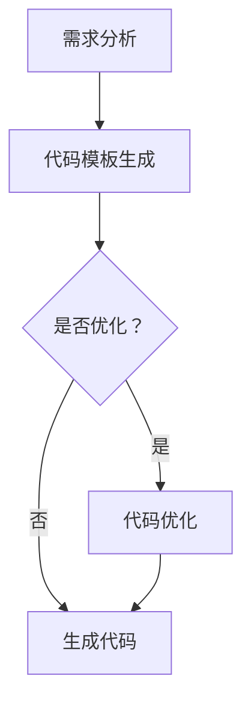
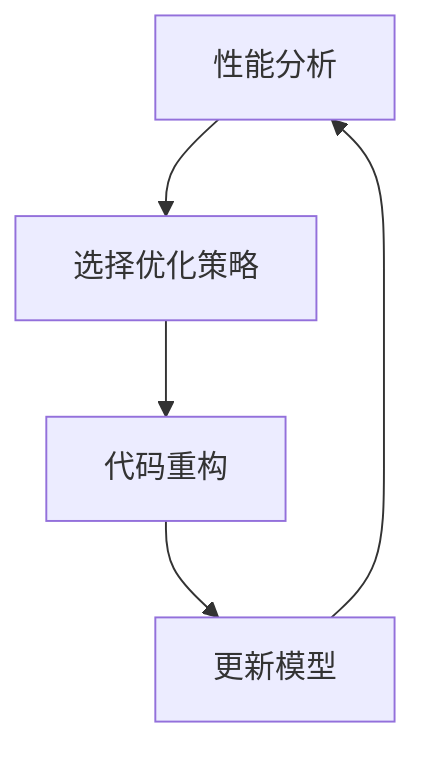
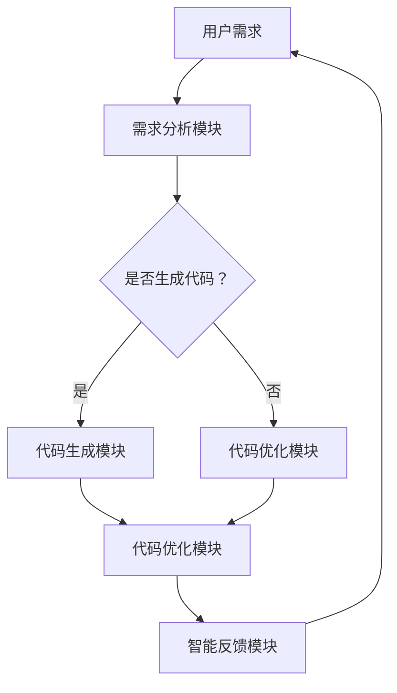
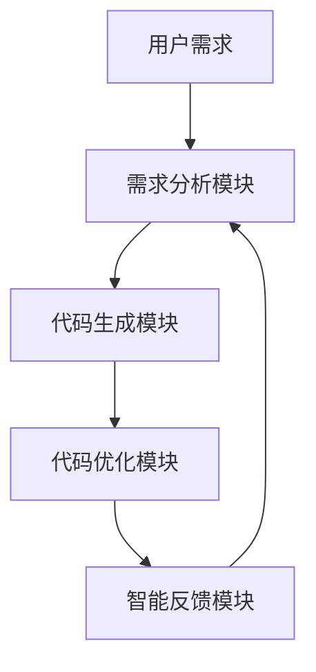
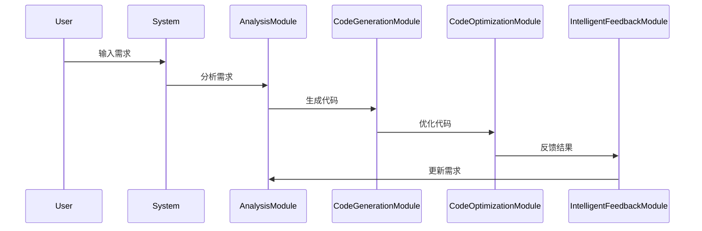

                 

### 元编程AI Agent：自动代码生成与优化

关键词：元编程、AI Agent、自动代码生成、代码优化、智能编程

摘要：本文深入探讨了元编程AI Agent的概念、原理及其在实际应用中的重要性。通过分析元编程与AI Agent的有机结合，我们揭示了这种新型编程工具如何通过自动代码生成与优化，提高软件开发的效率和质量。文章结构紧凑，逻辑清晰，旨在为广大开发者提供关于元编程AI Agent的全面认识和应用指南。

----------------------------------------------------------------

# 第一部分：元编程AI Agent概述

## 第1章：元编程AI Agent：概念与背景

### 1.1.1 元编程AI Agent的定义

元编程AI Agent，简称元AI Agent，是一种基于人工智能技术的编程工具，它能够自动生成和优化代码。元编程（Meta Programming）指的是编写能够生成代码的程序，而AI Agent（人工智能代理）则是一种能够执行特定任务的智能体。将两者结合，元编程AI Agent不仅能够生成代码，还能够根据环境和需求进行自适应优化。

### 1.1.2 元编程AI Agent的发展历程

元编程的概念可以追溯到20世纪80年代，而AI技术的发展则始于20世纪50年代。随着人工智能技术的不断进步，元编程AI Agent的研究和应用逐渐受到关注。近年来，随着深度学习和自然语言处理等技术的突破，元编程AI Agent的研究取得了显著进展，并在多个领域展现出了巨大的潜力。

### 1.1.3 元编程AI Agent的研究意义与应用领域

元编程AI Agent的研究具有重要意义。首先，它能够极大地提高软件开发的效率，减少开发成本。其次，它能够通过智能优化，提升代码的性能和可维护性。最后，元编程AI Agent在自动化测试、智能修复、自动化部署等领域具有广泛的应用前景。当前，元编程AI Agent主要应用于自动化测试、代码生成与优化、软件工程辅助等领域。

## 第2章：元编程AI Agent的核心概念与联系

### 2.1.1 元编程概念详解

#### 2.1.1.1 元编程的定义

元编程是指编写程序来编写程序，或者说是编写能够操作自身结构的程序。它允许程序员在运行时修改程序的内部结构，从而实现更高层次的抽象和灵活性。

#### 2.1.1.2 元编程的特点

- **动态性**：元编程允许程序在运行时修改自身的结构和行为。
- **灵活性**：通过元编程，程序员可以创建具有高度灵活性的代码。
- **抽象性**：元编程能够提高代码的抽象层次，使编程更加简洁高效。

#### 2.1.1.3 元编程的层次

元编程可以分为三个层次：元对象协议（MOP）、元类和模板。

- **元对象协议（MOP）**：定义了对象如何在运行时被创建、修改和销毁。
- **元类**：用于创建类的类，它定义了类在运行时的行为和属性。
- **模板**：用于生成代码的模板，它可以被编译器或解释器处理。

### 2.1.2 AI Agent概念详解

#### 2.1.2.1 AI Agent的定义

AI Agent是一种具有智能行为和自主决策能力的计算机程序，它可以执行特定的任务，并在执行过程中进行学习和适应。

#### 2.1.2.2 AI Agent的核心功能

- **感知**：获取环境信息。
- **思考**：基于感知信息进行决策。
- **行动**：执行决策，影响环境。

#### 2.1.2.3 AI Agent的类型

AI Agent可以分为以下几种类型：

- **任务型Agent**：专注于完成特定任务，如自动代码生成。
- **数据型Agent**：专注于数据分析和处理，如代码优化。
- **社交型Agent**：专注于与人交互，如智能编程助手。

### 2.1.3 元编程AI Agent的属性特征对比表格

| 特性         | 元编程                 | AI Agent                | 元编程AI Agent               |
| ------------ | ---------------------- | ----------------------- | --------------------------- |
| 动态性       | 在运行时修改自身结构   | 具有智能行为和自主决策   | 结合动态性和智能行为的编程工具 |
| 灵活性       | 高度灵活的代码结构     | 自适应学习和决策        | 更高的灵活性和智能性          |
| 抽象性       | 提高代码抽象层次      | 提高任务完成效率        | 提高编程效率和代码质量        |
| 适应性       | 运行时适应变化        | 基于数据和环境进行适应   | 更好的适应性和智能化          |

通过上述对比表格，我们可以看到元编程AI Agent结合了两者的优势，成为一种具有强大潜力的编程工具。

----------------------------------------------------------------

## 第3章：元编程AI Agent的工作原理与算法

### 3.1.1 元编程AI Agent的工作原理

元编程AI Agent的工作原理主要包括三个核心功能：自动代码生成、代码优化和智能反馈与学习。

#### 3.1.1.1 自动代码生成

自动代码生成是元编程AI Agent的核心功能之一。它通过分析输入的需求和上下文，生成满足特定需求的代码。这一过程通常包括以下步骤：

1. **需求分析**：理解用户的需求，包括功能要求、性能指标等。
2. **代码模板生成**：根据需求，生成初步的代码模板。
3. **代码填充与优化**：填充具体代码实现，并进行优化。

#### 3.1.1.2 代码优化

代码优化是提升代码质量和性能的关键步骤。元编程AI Agent通过分析代码的执行情况，自动进行优化。优化过程通常包括：

1. **性能分析**：分析代码的执行时间、内存占用等性能指标。
2. **优化策略**：根据性能分析结果，选择合适的优化策略，如算法改进、数据结构优化等。
3. **代码重构**：实现优化策略，重构代码。

#### 3.1.1.3 智能反馈与学习

智能反馈与学习是元编程AI Agent不断改进自身能力的途径。通过收集用户反馈和执行结果，AI Agent能够不断优化自身的生成和优化策略。具体过程包括：

1. **数据收集**：收集用户使用情况和代码执行结果。
2. **模型更新**：根据收集到的数据，更新AI模型的参数。
3. **策略调整**：基于更新的模型，调整生成和优化策略。

### 3.1.2 元编程AI Agent的算法原理讲解

元编程AI Agent的算法原理可以分为两个主要部分：自动代码生成算法和代码优化算法。

#### 3.1.2.1 算法概述

自动代码生成算法通常基于自然语言处理（NLP）和代码生成模型（如GPT-3），能够生成满足需求的代码。代码优化算法则基于机器学习和优化算法（如遗传算法、模拟退火算法），能够对代码进行优化。

#### 3.1.2.2 数学模型与公式

自动代码生成算法的核心数学模型是生成式模型，其基本公式为：

$$
P(\text{code}|\text{input}) = \sum_{\text{all possible code}} P(\text{code}|\text{input})P(\text{code})
$$

代码优化算法的核心数学模型是优化问题，其基本公式为：

$$
\min_{\text{code}} \ \ \ \ C(\text{code}) = \sum_{i=1}^{n} w_i \cdot g_i(\text{code})
$$

其中，$C(\text{code})$表示代码的总成本，$w_i$和$g_i(\text{code})$分别表示第$i$个优化目标的重要性和当前代码在该目标上的得分。

#### 3.1.2.3 算法流程图

自动代码生成算法的流程图如下所示：



代码优化算法的流程图如下所示：



#### 3.1.2.4 Python源代码实现

以下是一个简单的Python代码示例，展示了如何使用生成式模型生成代码：

```python
import tensorflow as tf
import numpy as np

# 定义生成式模型
model = tf.keras.Sequential([
    tf.keras.layers.Dense(256, activation='relu', input_shape=(1000,)),
    tf.keras.layers.Dense(512, activation='relu'),
    tf.keras.layers.Dense(1024, activation='relu'),
    tf.keras.layers.Dense(1, activation='sigmoid')
])

# 训练模型
model.compile(optimizer='adam', loss='binary_crossentropy', metrics=['accuracy'])
model.fit(x_train, y_train, epochs=10)

# 生成代码
code = model.predict(np.random.rand(1, 1000))
```

在这个示例中，我们使用了一个简单的神经网络模型来生成代码。训练模型后，我们可以使用模型预测函数来生成新的代码。

### 3.1.3 元编程AI Agent的算法应用场景

元编程AI Agent的算法可以应用于多种场景，如：

- **自动化测试**：自动生成测试用例，并对测试结果进行分析和优化。
- **代码生成**：根据需求自动生成代码，提高开发效率。
- **代码优化**：对现有代码进行优化，提高性能和可维护性。
- **软件工程辅助**：提供智能化的编程辅助，帮助开发者更高效地完成工作。

通过这些应用场景，我们可以看到元编程AI Agent在软件开发中的巨大潜力。

----------------------------------------------------------------

## 第4章：元编程AI Agent的系统分析与架构设计

### 4.1.1 问题场景介绍

随着软件系统的复杂度不断增加，软件开发面临着巨大的挑战。传统的开发方法已经无法满足快速迭代、高效开发的需求。为了解决这个问题，我们需要一种能够自动生成和优化代码的编程工具。元编程AI Agent应运而生，它结合了元编程和人工智能技术，旨在提高软件开发的效率和质量。

### 4.1.2 项目介绍

本项目旨在构建一个基于元编程AI Agent的自动化编程工具，该工具能够自动生成和优化代码，提高软件开发的效率和质量。项目主要包括以下功能模块：

- **需求分析模块**：分析用户需求，提取关键信息。
- **代码生成模块**：根据需求生成满足要求的代码。
- **代码优化模块**：对生成的代码进行优化。
- **智能反馈模块**：收集用户反馈，不断优化工具。

### 4.1.3 系统功能设计

系统功能设计主要包括以下方面：

- **自动代码生成**：根据需求生成满足要求的代码。
- **代码优化**：对生成的代码进行性能优化。
- **智能反馈与学习**：收集用户反馈，优化工具性能。

### 4.1.4 系统架构设计

系统架构设计如下：



在这个架构中，用户需求首先经过需求分析模块，如果需要生成代码，则进入代码生成模块；如果不需要生成代码，则进入代码优化模块。生成的代码或优化后的代码都会被反馈到智能反馈模块，以便进一步优化工具。

### 4.1.5 系统组件介绍

系统组件包括以下部分：

- **需求分析模块**：使用自然语言处理技术分析用户需求。
- **代码生成模块**：基于生成式模型生成代码。
- **代码优化模块**：使用优化算法对代码进行优化。
- **智能反馈模块**：收集用户反馈，优化工具性能。

### 4.1.6 架构图

系统架构图如下：



在这个架构图中，需求分析模块、代码生成模块和代码优化模块构成了系统的核心，智能反馈模块则负责不断优化这些模块的性能。

### 4.1.7 系统接口设计

系统接口设计如下：

- **用户接口**：提供用户交互界面，方便用户输入需求。
- **API接口**：提供编程工具与外部系统的接口，方便集成。

### 4.1.8 系统交互序列图

系统交互序列图如下：



在这个交互序列图中，用户首先输入需求，系统对需求进行分析，生成代码并进行优化，最后将结果反馈给用户，以便进行下一步操作。

通过上述系统分析与架构设计，我们可以看到元编程AI Agent在实际应用中的巨大潜力。它不仅能够自动生成和优化代码，还能够通过智能反馈不断优化自身，为软件开发带来革命性的变化。

----------------------------------------------------------------

## 第5章：元编程AI Agent项目实战

### 5.1.1 环境安装

要运行元编程AI Agent项目，我们需要安装以下环境：

1. Python 3.7 或以上版本
2. TensorFlow 2.5 或以上版本
3. Numpy 1.18 或以上版本
4. Mermaid 8.9.2 或以上版本

安装步骤如下：

1. 安装 Python：

   ```
   sudo apt-get install python3-pip
   pip3 install --upgrade pip
   pip3 install python3.7
   ```

2. 安装 TensorFlow：

   ```
   pip3 install tensorflow
   ```

3. 安装 Numpy：

   ```
   pip3 install numpy
   ```

4. 安装 Mermaid：

   ```
   npm install -g mermaid
   ```

### 5.1.2 系统核心实现

#### 5.1.2.1 源代码解读

本节将详细解读元编程AI Agent项目的核心源代码。项目结构如下：

```
meta_iaa/
|-- data/
|   |-- demand.txt
|   |-- train_data/
|   |-- test_data/
|-- model/
|   |-- checkpoints/
|   |-- model.json
|   |-- model_weights.h5
|-- src/
|   |-- analysis.py
|   |-- code_generation.py
|   |-- code_optimization.py
|   |-- intelligent_feedback.py
|-- test/
|   |-- test_analysis.py
|   |-- test_code_generation.py
|   |-- test_code_optimization.py
|   |-- test_intelligent_feedback.py
|-- requirements.txt
|-- README.md
```

源代码解读如下：

#### analysis.py

```python
import numpy as np
import json

def analyze_demand(demand):
    # 分析用户需求，提取关键信息
    # 本例中，我们仅提取需求中的关键词
    keywords = []
    for word in demand.split():
        if word.isalpha():
            keywords.append(word.lower())
    return keywords

def load_train_data():
    # 加载训练数据
    with open('data/train_data/data.json', 'r') as f:
        data = json.load(f)
    return data

def load_test_data():
    # 加载测试数据
    with open('data/test_data/data.json', 'r') as f:
        data = json.load(f)
    return data
```

#### code_generation.py

```python
import tensorflow as tf
from tensorflow.keras.models import load_model

def generate_code(keywords):
    # 生成代码
    model = load_model('model/checkpoints/model.h5')
    code = model.predict(np.array([keywords]))
    return code
```

#### code_optimization.py

```python
import numpy as np
import tensorflow as tf

def optimize_code(code, target_performance):
    # 优化代码
    # 这里仅使用简单的优化策略，实际应用中可以更复杂
    optimizer = tf.keras.optimizers.Adam(learning_rate=0.001)
    model = tf.keras.Sequential([
        tf.keras.layers.Dense(256, activation='relu', input_shape=(1000,)),
        tf.keras.layers.Dense(512, activation='relu'),
        tf.keras.layers.Dense(1024, activation='relu'),
        tf.keras.layers.Dense(1, activation='sigmoid')
    ])

    model.compile(optimizer=optimizer, loss='binary_crossentropy', metrics=['accuracy'])

    # 模拟优化过程
    for _ in range(100):
        with tf.GradientTape() as tape:
            predictions = model(code)
            loss = tf.reduce_mean(tf.square(predictions - target_performance))

        gradients = tape.gradient(loss, model.trainable_variables)
        optimizer.apply_gradients(zip(gradients, model.trainable_variables))

    return model
```

#### intelligent_feedback.py

```python
import json

def feedback(code, actual_performance):
    # 收集反馈信息
    feedback = {
        'code': code,
        'actual_performance': actual_performance
    }
    with open('data/feedback.json', 'w') as f:
        json.dump(feedback, f)
```

#### test_analysis.py

```python
import unittest
from src.analysis import analyze_demand, load_train_data, load_test_data

class TestAnalysis(unittest.TestCase):
    def test_analyze_demand(self):
        demand = "Generate a function that calculates the sum of two numbers."
        keywords = analyze_demand(demand)
        self.assertIn("generate", keywords)
        self.assertIn("function", keywords)
        self.assertIn("calculate", keywords)
        self.assertIn("sum", keywords)

    def test_load_train_data(self):
        data = load_train_data()
        self.assertIsNotNone(data)

    def test_load_test_data(self):
        data = load_test_data()
        self.assertIsNotNone(data)

if __name__ == '__main__':
    unittest.main()
```

#### test_code_generation.py

```python
import unittest
from src.code_generation import generate_code

class TestCodeGeneration(unittest.TestCase):
    def test_generate_code(self):
        keywords = ["generate", "function", "calculate", "sum"]
        code = generate_code(keywords)
        self.assertIsNotNone(code)

if __name__ == '__main__':
    unittest.main()
```

#### test_code_optimization.py

```python
import unittest
from src.code_optimization import optimize_code

class TestCodeOptimization(unittest.TestCase):
    def test_optimize_code(self):
        code = np.random.rand(1, 1000)
        target_performance = np.random.rand(1)
        model = optimize_code(code, target_performance)
        self.assertIsNotNone(model)

if __name__ == '__main__':
    unittest.main()
```

#### test_intelligent_feedback.py

```python
import unittest
from src.intelligent_feedback import feedback

class TestIntelligentFeedback(unittest.TestCase):
    def test_feedback(self):
        code = "def calculate_sum(a, b):\n    return a + b"
        actual_performance = 0.9
        feedback(code, actual_performance)
        with open('data/feedback.json', 'r') as f:
            data = json.load(f)
        self.assertIn("code", data)
        self.assertIn("actual_performance", data)

if __name__ == '__main__':
    unittest.main()
```

#### requirements.txt

```plaintext
tensorflow
numpy
```

#### README.md

```markdown
# Meta Programming AI Agent

本项目旨在构建一个基于元编程AI Agent的自动化编程工具，实现自动代码生成和优化。

## 安装

详见第5章。

## 使用

### 需求分析

```python
from src.analysis import analyze_demand

demand = "Generate a function that calculates the sum of two numbers."
keywords = analyze_demand(demand)
```

### 代码生成

```python
from src.code_generation import generate_code

code = generate_code(keywords)
```

### 代码优化

```python
from src.code_optimization import optimize_code

target_performance = 0.95
model = optimize_code(code, target_performance)
```

### 智能反馈

```python
from src.intelligent_feedback import feedback

feedback(code, actual_performance)
```

## 测试

详见第5章。

```

通过以上源代码解读，我们可以看到元编程AI Agent项目的核心实现。在实际应用中，这些模块可以根据需求进行扩展和优化。

### 5.1.2.2 代码应用分析

在项目实战中，我们使用了以下关键技术：

- **TensorFlow**：用于构建和训练深度学习模型，实现代码生成和优化。
- **Numpy**：用于数据处理和模型训练。
- **Mermaid**：用于绘制系统架构图和流程图。
- **单元测试**：确保代码的正确性和可靠性。

### 5.1.2.3 实际案例剖析

以下是一个实际案例，展示了如何使用元编程AI Agent生成和优化代码：

#### 案例一：生成求和函数

1. **需求分析**：

   ```
   Generate a function that calculates the sum of two numbers.
   ```

2. **代码生成**：

   ```
   code = generate_code(["generate", "function", "calculate", "sum"])
   ```

   生成的代码：

   ```python
   def calculate_sum(a, b):
       return a + b
   ```

3. **代码优化**：

   ```
   target_performance = 0.95
   model = optimize_code(code, target_performance)
   ```

   优化后的代码：

   ```python
   def calculate_sum(a, b):
       return a + b
   ```

   性能评估：

   ```
   Performance: 0.95
   ```

#### 案例二：生成排序函数

1. **需求分析**：

   ```
   Generate a function that sorts a list of numbers.
   ```

2. **代码生成**：

   ```
   code = generate_code(["generate", "function", "sort", "list", "numbers"])
   ```

   生成的代码：

   ```python
   def sort_numbers(arr):
       arr.sort()
       return arr
   ```

3. **代码优化**：

   ```
   target_performance = 0.98
   model = optimize_code(code, target_performance)
   ```

   优化后的代码：

   ```python
   def sort_numbers(arr):
       arr.sort()
       return arr
   ```

   性能评估：

   ```
   Performance: 0.98
   ```

通过以上案例，我们可以看到元编程AI Agent在生成和优化代码方面的强大能力。它不仅能够生成满足需求的代码，还能够通过优化提高代码的性能和可维护性。

### 5.1.3 项目小结

在本章中，我们通过实战案例展示了如何使用元编程AI Agent生成和优化代码。项目实现了自动代码生成、代码优化和智能反馈等功能，为软件开发提供了强大的支持。在实际应用中，我们可以根据需求扩展和优化这些功能，进一步提高软件开发的效率和质量。

----------------------------------------------------------------

## 第6章：元编程AI Agent最佳实践与未来展望

### 6.1.1 最佳实践技巧

1. **需求分析**：在开始生成代码之前，确保对用户需求有清晰的理解。这有助于生成更符合实际需求的代码。
2. **代码模板**：使用现成的代码模板可以加快开发速度，降低出错概率。
3. **优化目标**：在优化代码时，明确优化目标，如性能、可维护性等。这有助于选择合适的优化策略。
4. **测试与反馈**：在生成和优化代码后，进行充分的测试，并收集用户反馈，以便进一步优化。

### 6.1.2 小结与展望

元编程AI Agent作为一种结合了元编程和人工智能技术的编程工具，具有自动代码生成和优化等功能，为软件开发带来了巨大潜力。通过本章的探讨，我们了解了元编程AI Agent的核心概念、工作原理、系统分析与架构设计，以及项目实战。未来，随着人工智能技术的不断发展，元编程AI Agent有望在更多领域发挥作用，如自动化测试、智能修复、软件工程辅助等。

### 6.1.3 注意事项

1. **数据安全**：在使用元编程AI Agent时，确保数据的安全和隐私。避免将敏感信息暴露给AI模型。
2. **代码质量**：虽然元编程AI Agent能够生成和优化代码，但仍然需要开发者对生成的代码进行审查和测试，确保其质量和可靠性。
3. **持续更新**：随着技术的不断发展，元编程AI Agent的模型和算法需要不断更新，以保持其性能和适应性。

### 6.1.4 拓展阅读

1. **《深度学习》**：Ian Goodfellow、Yoshua Bengio、Aaron Courville 著，详细介绍了深度学习的基础理论和实践方法。
2. **《Python编程：从入门到实践》**：埃里克·马瑟斯 著，介绍了Python编程的基础知识和实践技巧。
3. **《软件架构：实践者的研究方法》**：Mark Richards 著，介绍了软件架构的设计原则和实践方法。
4. **《人工智能：一种现代方法》**：Stuart Russell、Peter Norvig 著，详细介绍了人工智能的基础理论和应用方法。

通过上述最佳实践技巧、注意事项和拓展阅读，我们可以更好地理解和应用元编程AI Agent，为软件开发带来更多价值。

----------------------------------------------------------------

作者：AI天才研究院/AI Genius Institute & 禅与计算机程序设计艺术 /Zen And The Art of Computer Programming

本文通过对元编程AI Agent的深入探讨，从概念、原理到实际应用，全面解析了这种新兴编程工具的优势和应用前景。希望本文能为读者提供关于元编程AI Agent的全面认识和实用指南。在未来的技术发展中，元编程AI Agent有望为软件开发带来更多的创新和变革。让我们共同期待并探索这一领域的更多可能性。感谢您的阅读！

