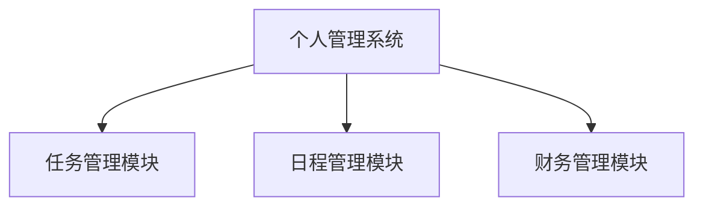
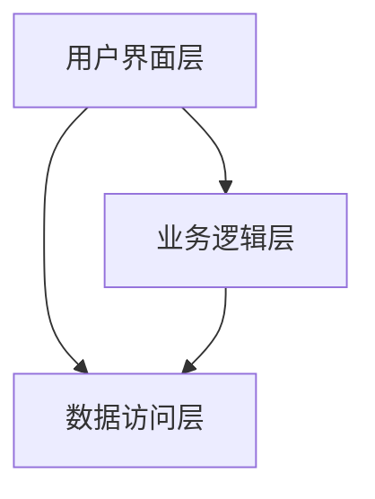
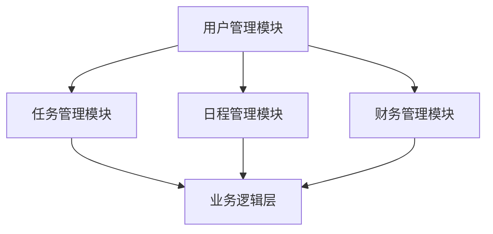

                 

### 全方位生活助手AI Agent：LLM驱动的个人管理系统

> 关键词：AI Agent、大型语言模型(LLM)、个人管理系统、任务管理、日程管理、财务管理

> 摘要：本文深入探讨了AI Agent，特别是基于大型语言模型(LLM)的个人管理系统。文章首先介绍了个人管理系统的背景和核心概念，然后详细阐述了AI Agent和LLM的基础知识及其结合方式。接着，文章介绍了个人管理系统的主要功能，并重点探讨了LLM在任务管理、日程管理和财务管理中的应用。随后，文章讨论了个人管理系统的设计与实现，包括系统架构设计、模块划分和核心实现。通过一个实际项目案例，文章展示了系统设计和实现的具体过程，并进行了案例分析。最后，文章总结了研究成果，展望了未来发展趋势。

### 目录大纲

```markdown
----------------------------------------------------------------
# 第一部分: 背景介绍与核心概念

## 第1章: 问题背景与核心概念介绍

### 1.1.1 问题背景

#### 1.1.1.1 问题提出
#### 1.1.1.2 问题描述
#### 1.1.1.3 问题解决

### 1.1.2 边界与外延

#### 1.1.2.1 概念结构与核心要素组成

## 第2章: AI Agent与LLM基础

### 2.1 AI Agent概述

#### 2.1.1 AI Agent的定义
#### 2.1.2 AI Agent的特点

### 2.2 LLM基础

#### 2.2.1 LLM的定义
#### 2.2.2 LLM的工作原理

### 2.3 AI Agent与LLM的联系

#### 2.3.1 AI Agent与LLM的结合
#### 2.3.2 LLM在AI Agent中的应用

## 第3章: 个人管理系统概述

### 3.1 个人管理系统的定义

#### 3.1.1 个人管理系统的概念
#### 3.1.2 个人管理系统的作用

### 3.2 个人管理系统的主要功能

#### 3.2.1 功能1
#### 3.2.2 功能2
#### 3.2.3 功能3

## 第二部分: LLM驱动的个人管理系统实现

## 第4章: LLM在个人管理系统中的应用

### 4.1 LLM在任务管理中的应用

#### 4.1.1 任务管理概述
#### 4.1.2 LLM在任务管理中的优势

### 4.2 LLM在日程管理中的应用

#### 4.2.1 日程管理概述
#### 4.2.2 LLM在日程管理中的优势

### 4.3 LLM在财务管理中的应用

#### 4.3.1 财务管理概述
#### 4.3.2 LLM在财务管理中的优势

## 第5章: 个人管理系统设计与实现

### 5.1 系统设计

#### 5.1.1 系统架构设计
#### 5.1.2 系统模块划分

### 5.2 系统实现

#### 5.2.1 系统核心实现
#### 5.2.2 系统接口设计

## 第6章: 项目实战与案例分析

### 6.1 项目实战环境搭建

#### 6.1.1 环境安装与配置
#### 6.1.2 项目启动与测试

### 6.2 个人管理系统核心实现

#### 6.2.1 核心功能实现
#### 6.2.2 源代码解读与分析

### 6.3 案例分析与讲解

#### 6.3.1 案例一：任务管理
#### 6.3.2 案例二：日程管理
#### 6.3.3 案例三：财务管理

## 第7章: 总结与展望

### 7.1 总结

#### 7.1.1 成果总结
#### 7.1.2 遇到的挑战与解决方案

### 7.2 展望

#### 7.2.1 未来发展趋势
#### 7.2.2 拓展应用场景
```

### 第一部分：背景介绍与核心概念

#### 第1章：问题背景与核心概念介绍

在当今快节奏的现代社会中，个人管理变得尤为重要。人们需要高效地处理大量的任务和复杂的信息，以实现个人和组织的目标。然而，传统的个人管理方法往往无法满足现代生活的复杂性，导致时间管理、任务管理和财务管理等方面的问题层出不穷。

**1.1 问题背景**

随着数字技术的飞速发展，人们越来越多地依赖智能手机、电脑等电子设备来管理个人事务。然而，现有的个人管理系统仍然存在许多问题：

- **任务管理**：人们经常面临任务繁杂、优先级不清、任务遗漏等问题，导致工作效率低下。
- **日程管理**：现代人的生活节奏加快，需要高效地安排工作和个人时间，但现有的日程管理系统往往功能单一，难以满足个性化需求。
- **财务管理**：随着收入来源的多样化，人们需要更加智能化的财务管理工具来帮助自己合理规划财务，避免财务危机。

**1.1.1 问题提出**

个人管理中存在的问题主要体现在以下几个方面：

1. **任务管理**：如何高效地安排和跟踪任务，确保任务的按时完成？
2. **日程管理**：如何合理安排时间，提高工作和生活效率？
3. **财务管理**：如何合理规划财务，实现财务自由？

**1.1.2 问题描述**

1. **任务管理**：现有任务管理软件存在功能单一、界面复杂、用户体验不佳等问题。用户在使用过程中，往往需要花费大量时间进行设置和管理，导致使用效率低下。
2. **日程管理**：现有日程管理软件在灵活性、智能推荐和自动化处理方面存在不足。用户在安排日程时，往往需要手动输入大量信息，且难以根据实际情况进行灵活调整。
3. **财务管理**：现有财务管理软件在财务数据分析、预测和优化方面存在不足。用户在管理财务时，往往需要手动处理大量数据，且难以根据财务状况进行合理规划。

**1.1.3 问题解决**

为了解决上述问题，引入AI Agent和LLM技术成为了一种有效的解决方案。AI Agent可以协助用户完成各种个人管理任务，提高效率；而LLM技术则可以为AI Agent提供强大的语言理解和生成能力，使其能够更好地理解和响应用户的需求。

**1.2 边界与外延**

**1.2.1 概念结构与核心要素组成**

本文研究的个人管理系统主要包括以下几个核心概念和要素：

1. **AI Agent**：一种能够模拟人类智能的软件系统，能够协助用户完成各种任务。
2. **LLM**：一种基于深度学习的语言模型，能够理解、生成和交互自然语言。
3. **任务管理**：对用户的任务进行有效规划和跟踪。
4. **日程管理**：对用户的时间进行合理安排和调整。
5. **财务管理**：对用户的财务信息进行收集、分析和预测。

通过以上核心概念和要素的有机结合，个人管理系统可以提供全面、智能、个性化的个人管理服务，帮助用户更好地管理个人事务，提高生活质量。

---

在下一章中，我们将深入探讨AI Agent和LLM的基础知识，包括它们的定义、特点和应用。这将为我们后续讨论个人管理系统的设计和实现奠定基础。

### 第2章：AI Agent与LLM基础

在了解个人管理系统之前，首先需要了解其核心组成部分——AI Agent和LLM（大型语言模型）。本章将分别介绍AI Agent和LLM的基本概念、特点以及它们之间的联系。

#### 2.1 AI Agent概述

**2.1.1 AI Agent的定义**

AI Agent，即人工智能代理，是指一种能够模拟人类智能、自主执行任务、适应环境变化的计算机程序。AI Agent的核心目标是最大化自身效用，通过感知环境、理解目标和规划行动，实现特定任务的自动化。

**2.1.2 AI Agent的特点**

1. **自主性**：AI Agent能够独立执行任务，无需人工干预。
2. **适应性**：AI Agent能够根据环境变化和任务需求，调整自身行为。
3. **灵活性**：AI Agent能够处理复杂、多变的任务，适应不同场景。
4. **智能性**：AI Agent具备一定的智能，能够进行推理、决策和问题解决。

**2.1.3 AI Agent与传统软件的区别**

1. **主动性**：传统软件需要用户手动操作，而AI Agent能够主动执行任务。
2. **智能性**：传统软件缺乏智能，无法处理复杂任务，而AI Agent具备智能，能够进行推理和决策。
3. **适应性**：传统软件难以适应环境变化，而AI Agent能够根据环境变化调整自身行为。

#### 2.2 LLM基础

**2.2.1 LLM的定义**

LLM（Large Language Model），即大型语言模型，是一种基于深度学习的自然语言处理技术。LLM通过学习大量文本数据，能够生成流畅、符合语法和语义的自然语言文本。

**2.2.2 LLM的工作原理**

LLM的工作原理主要分为以下几个步骤：

1. **输入**：将自然语言文本作为输入。
2. **编码**：将输入文本编码为向量。
3. **预测**：根据编码后的向量，预测下一个单词或句子。
4. **生成**：根据预测结果，生成自然语言文本。

**2.2.3 LLM的特点**

1. **大规模**：LLM通常基于数十亿甚至千亿级别的参数，具有强大的语言理解能力。
2. **自适应性**：LLM能够根据输入文本的上下文，动态调整预测和生成策略。
3. **多样性**：LLM能够生成丰富多样的自然语言文本，满足不同场景和需求。

#### 2.3 AI Agent与LLM的联系

**2.3.1 AI Agent与LLM的结合**

AI Agent与LLM的结合，使得个人管理系统在智能化和个性化方面取得了显著提升。具体表现在以下几个方面：

1. **自然语言交互**：LLM可以为AI Agent提供强大的自然语言理解和处理能力，实现人机交互的智能化。
2. **任务自动化**：AI Agent可以利用LLM的预测和生成能力，自动处理各种任务，提高效率。
3. **个性化服务**：AI Agent可以根据用户的行为和偏好，利用LLM进行个性化推荐和决策。

**2.3.2 LLM在AI Agent中的应用**

1. **任务管理**：LLM可以帮助AI Agent理解用户的任务需求，生成任务描述和优先级。
2. **日程管理**：LLM可以分析用户的日程安排，提供智能化的日程建议和调整方案。
3. **财务管理**：LLM可以解析用户的财务数据，生成财务报告和优化建议。

通过AI Agent和LLM的结合，个人管理系统可以实现高度智能化、个性化的服务，为用户提供便捷、高效的生活管理体验。

在下一章中，我们将介绍个人管理系统的概念、作用和主要功能，为深入探讨LLM在该系统中的应用奠定基础。

### 第3章：个人管理系统概述

个人管理系统是一种旨在帮助用户高效管理个人事务的软件系统。它涵盖了任务管理、日程管理、财务管理等多个方面，通过智能化的手段，为用户提供便捷、高效的服务。以下是个人管理系统的主要定义、作用和功能。

#### 3.1 个人管理系统的定义

个人管理系统是一种整合了任务管理、日程管理、财务管理等多功能模块的软件系统。它利用人工智能技术，特别是大型语言模型（LLM），为用户提供个性化的、智能化的个人事务管理服务。

**定义结构图：**



**核心要素组成：**

- **任务管理模块**：负责任务的创建、分配、跟踪和优先级管理。
- **日程管理模块**：负责日程的创建、修改、删除和智能提醒。
- **财务管理模块**：负责财务信息的收集、分析、预算制定和报表生成。

#### 3.1.1 个人管理系统的概念

个人管理系统是一种基于人工智能和自然语言处理技术的软件系统，它通过模拟人类的思维和行为，帮助用户管理日常生活中的各种事务。个人管理系统不仅能够提高用户的工作和生活效率，还能够减轻用户的心理负担。

#### 3.1.2 个人管理系统的作用

个人管理系统的主要作用包括：

1. **提高效率**：通过自动化处理任务、日程和财务，减少用户手动操作的时间，提高工作效率。
2. **减轻负担**：帮助用户更好地管理时间和财务，减少因为事务管理不当带来的焦虑和压力。
3. **智能决策**：利用人工智能技术，为用户提供智能化的任务推荐、日程安排和财务建议。

#### 3.2 个人管理系统的主要功能

个人管理系统的主要功能包括以下几个方面：

1. **任务管理**：包括任务的创建、分配、跟踪、优先级管理、任务完成情况的统计等。
2. **日程管理**：包括日程的创建、修改、删除、提醒、日程冲突检测、智能日程推荐等。
3. **财务管理**：包括财务信息的录入、分类、统计、预算制定、报表生成、财务状况分析等。

**3.2.1 任务管理**

任务管理是个人管理系统的核心功能之一。通过任务管理模块，用户可以轻松创建任务，并为任务分配优先级、负责人和截止日期。系统还可以根据用户的任务完成情况，提供任务完成率统计和报告，帮助用户了解自己的工作进度。

**3.2.2 日程管理**

日程管理模块负责用户的日程安排。用户可以创建、修改、删除日程，并设置提醒。系统还会根据用户的日程冲突情况，提供智能化的日程调整建议。此外，系统还可以根据用户的日程安排，提供工作计划和休息时间的建议。

**3.2.3 财务管理**

财务管理模块是个人管理系统的重要组成部分。用户可以通过该模块录入自己的财务信息，包括收入、支出、转账等。系统会对用户的财务信息进行分类、统计和分析，帮助用户了解自己的财务状况，并提供预算制定和报表生成功能。

在下一章中，我们将探讨LLM在个人管理系统中的应用，包括在任务管理、日程管理和财务管理中的具体应用场景和优势。

---

### 第二部分：LLM驱动的个人管理系统实现

在本部分，我们将深入探讨LLM在个人管理系统中的具体应用，包括在任务管理、日程管理和财务管理中的实现方法、优势和实际应用效果。

#### 第4章：LLM在个人管理系统中的应用

#### 4.1 LLM在任务管理中的应用

**4.1.1 任务管理概述**

任务管理是个人管理系统中的核心功能之一，它负责用户的任务创建、分配、跟踪和优先级管理。传统任务管理工具往往依赖于用户手动输入任务信息，而LLM的应用可以极大地提升任务管理的智能化和自动化水平。

**4.1.2 LLM在任务管理中的优势**

1. **自然语言理解**：LLM能够理解用户输入的自然语言描述，自动提取任务的关键信息，如任务名称、优先级、截止日期等。
2. **任务优先级推荐**：基于用户的历史任务完成情况和偏好，LLM可以智能推荐任务的优先级，帮助用户更高效地完成任务。
3. **任务分配**：LLM可以根据用户的工作职责和技能，自动为合适的用户分配任务，提高任务完成的效率。

**4.1.3 LLM在任务管理中的应用案例**

- **任务创建**：用户可以通过自然语言描述创建任务，例如：“请帮我设置一个名为‘购买礼物’的任务，优先级为高，截止日期为下周三。”系统将自动解析并创建任务。
- **任务推荐**：系统根据用户的任务完成情况和偏好，推荐高优先级的任务，例如：“根据您的任务完成情况，建议您优先完成‘编写报告’任务。”
- **任务分配**：系统自动分析用户的工作职责和技能，将适合的任务分配给合适的用户，例如：“将‘处理客户投诉’任务分配给张三，因为他有丰富的客户服务经验。”

#### 4.2 LLM在日程管理中的应用

**4.2.1 日程管理概述**

日程管理是个人管理系统中的另一个重要功能，它负责用户的日程创建、修改、删除和提醒。通过LLM的应用，日程管理可以变得更加智能化和自动化。

**4.2.2 LLM在日程管理中的优势**

1. **智能日程建议**：LLM可以根据用户的日程安排和历史行为，提供智能化的日程建议，例如：“根据您的日程安排，建议您在下周二上午安排会议。”
2. **日程冲突检测**：LLM可以自动检测日程冲突，并建议合适的调整方案，例如：“您的日程中有一个会议与现有日程冲突，建议您将会议时间调整到周三下午。”
3. **自然语言交互**：用户可以通过自然语言与系统进行交互，方便地创建、修改和删除日程，例如：“请帮我创建一个会议，主题为‘项目讨论’，参会人员为李四和王五。”

**4.2.3 LLM在日程管理中的应用案例**

- **日程创建**：用户可以通过自然语言创建日程，例如：“请帮我创建一个名为‘项目讨论’的会议，参会人员为李四和王五，时间为下周三上午9点。”系统将自动创建会议日程。
- **日程调整**：系统检测到日程冲突后，建议用户调整日程，例如：“您的日程中有一个会议与现有日程冲突，建议您将会议时间调整到周三下午3点。”用户可以根据建议进行日程调整。
- **自然语言交互**：用户可以通过自然语言与系统进行日程管理操作，例如：“请提醒我明天上午的会议。”系统将自动发送提醒通知。

#### 4.3 LLM在财务管理中的应用

**4.3.1 财务管理概述**

财务管理是个人管理系统中的关键功能，它负责用户的财务信息录入、分类、统计和分析。通过LLM的应用，财务管理可以更加智能化和自动化。

**4.3.2 LLM在财务管理中的优势**

1. **自然语言录入**：LLM可以理解用户输入的自然语言描述，自动分类和录入财务信息，例如：“请记录一笔收入，金额为5000元，来源为‘销售’。”
2. **智能报表生成**：LLM可以根据用户的财务数据，自动生成财务报表，例如：“根据您的财务数据，本月的总收入为10000元，支出为8000元，盈余为2000元。”
3. **财务预测**：LLM可以根据用户的财务历史数据，进行财务预测和优化建议，例如：“根据您的财务历史，下个月的支出可能增加，建议您提前做好准备。”

**4.3.3 LLM在财务管理中的应用案例**

- **财务录入**：用户可以通过自然语言描述录入财务信息，例如：“请记录一笔收入，金额为5000元，来源为‘销售’。”系统将自动分类和录入财务信息。
- **报表生成**：系统根据用户的财务数据，自动生成财务报表，例如：“根据您的财务数据，本月的总收入为10000元，支出为8000元，盈余为2000元。”
- **财务预测**：系统根据用户的财务历史数据，进行财务预测和优化建议，例如：“根据您的财务历史，下个月的支出可能增加，建议您提前做好准备。”

通过LLM在个人管理系统中的广泛应用，用户可以享受到智能化、个性化的服务，大大提高个人事务管理的效率和效果。在下一章中，我们将深入探讨个人管理系统的设计与实现，包括系统架构设计、模块划分和核心实现。

---

### 第5章：个人管理系统设计与实现

个人管理系统的设计与实现是一个复杂而关键的过程，它决定了系统是否能够高效、稳定地运行，并为用户提供良好的用户体验。本章节将详细讨论个人管理系统设计与实现的相关内容，包括系统架构设计、模块划分和核心实现。

#### 5.1 系统设计

**5.1.1 系统架构设计**

个人管理系统的架构设计是系统设计中的关键环节，它决定了系统的性能、可扩展性和可维护性。以下是个人管理系统的架构设计：

**架构图：**



**系统架构设计说明：**

1. **用户界面层（A）**：负责与用户交互，接收用户输入，展示系统信息和功能。用户界面层通常采用前端技术，如HTML、CSS和JavaScript，以及前端框架，如React或Vue。
2. **业务逻辑层（B）**：负责处理用户的请求，执行业务逻辑，包括任务管理、日程管理和财务管理等。业务逻辑层通常采用后端技术，如Java、Python或Node.js，并使用框架，如Spring Boot或Django。
3. **数据访问层（C）**：负责与数据库进行交互，存储和查询数据。数据访问层通常使用数据库技术，如MySQL、PostgreSQL或MongoDB。

**架构设计图：**


**架构设计优点：**

- **分层设计**：用户界面层、业务逻辑层和数据访问层各司其职，降低了系统的复杂性，提高了系统的可维护性和可扩展性。
- **模块化**：各层之间通过接口进行通信，模块化设计使得系统的开发和维护更加便捷。
- **可扩展性**：系统架构设计具有良好的扩展性，可以根据业务需求添加新的功能模块。

#### 5.1.2 系统模块划分

个人管理系统可以划分为以下几个主要模块：

1. **用户管理模块**：负责用户的注册、登录、权限管理和个人信息管理。
2. **任务管理模块**：负责任务的创建、分配、跟踪和优先级管理。
3. **日程管理模块**：负责日程的创建、修改、删除、提醒和冲突检测。
4. **财务管理模块**：负责财务信息的录入、分类、统计、报表生成和财务预测。

**模块图：**



**模块划分说明：**

- **用户管理模块**：负责用户的注册、登录和权限管理，为其他模块提供用户认证和授权服务。
- **任务管理模块**：负责用户的任务创建、分配、跟踪和优先级管理，为用户提供任务管理功能。
- **日程管理模块**：负责用户的日程创建、修改、删除、提醒和冲突检测，为用户提供日程管理功能。
- **财务管理模块**：负责用户的财务信息录入、分类、统计、报表生成和财务预测，为用户提供财务管理功能。

**模块设计图：**


#### 5.2 系统实现

**5.2.1 系统核心实现**

个人管理系统的核心实现包括用户界面、业务逻辑和数据访问等关键部分。以下是核心实现的详细描述：

1. **用户界面**：采用前端框架（如React或Vue）构建用户界面，实现用户与系统的交互。用户界面包括登录、注册、用户管理、任务管理、日程管理和财务管理等模块。

2. **业务逻辑**：采用后端框架（如Spring Boot或Django）实现业务逻辑。业务逻辑层负责处理用户请求，执行相应的业务操作，并与数据访问层进行交互。

3. **数据访问**：使用数据库技术（如MySQL、PostgreSQL或MongoDB）存储用户数据和系统配置信息。数据访问层负责数据库的连接、查询和更新操作。

**核心实现示例**：

**用户界面示例：**

```jsx
// 使用React框架构建用户界面
import React, { useState } from 'react';

const LoginPage = () => {
  const [username, setUsername] = useState('');
  const [password, setPassword] = useState('');

  const handleSubmit = (e) => {
    e.preventDefault();
    // 处理登录请求
  };

  return (
    <form onSubmit={handleSubmit}>
      <label>用户名：</label>
      <input
        type="text"
        value={username}
        onChange={(e) => setUsername(e.target.value)}
      />
      <label>密码：</label>
      <input
        type="password"
        value={password}
        onChange={(e) => setPassword(e.target.value)}
      />
      <button type="submit">登录</button>
    </form>
  );
};

export default LoginPage;
```

**业务逻辑示例：**

```java
// 使用Spring Boot框架实现业务逻辑
@RestController
@RequestMapping("/api")
public class UserController {
  
  @Autowired
  private UserRepository userRepository;
  
  @PostMapping("/login")
  public ResponseEntity<?> login(@RequestBody LoginRequest loginRequest) {
    // 验证用户名和密码
    // 登录成功返回令牌
    return ResponseEntity.ok(new LoginResponse(token));
  }
}
```

**数据访问示例：**

```python
# 使用Python和SQLAlchemy实现数据访问
from sqlalchemy import create_engine, Column, Integer, String
from sqlalchemy.ext.declarative import declarative_base
from sqlalchemy.orm import sessionmaker

Base = declarative_base()

class User(Base):
  __tablename__ = 'users'
  id = Column(Integer, primary_key=True)
  username = Column(String, unique=True)
  password = Column(String)

engine = create_engine('sqlite:///users.db')
Base.metadata.create_all(engine)

Session = sessionmaker(bind=engine)
session = Session()

def get_user(username):
  user = session.query(User).filter_by(username=username).first()
  return user
```

**5.2.2 系统接口设计**

系统接口设计是个人管理系统实现中的重要环节，它定义了系统内部各模块之间的通信方式。以下是个人管理系统的主要接口设计：

1. **用户接口**：包括登录、注册、用户信息查询和修改等接口。
2. **任务接口**：包括任务创建、任务查询、任务修改、任务删除和任务优先级调整等接口。
3. **日程接口**：包括日程创建、日程查询、日程修改、日程删除和日程提醒等接口。
4. **财务接口**：包括财务信息录入、财务信息查询、财务报表生成和财务预测等接口。

**接口设计示例**：

**用户接口示例：**

```json
POST /api/login
{
  "username": "testuser",
  "password": "password123"
}
```

```json
POST /api/register
{
  "username": "newuser",
  "password": "password123",
  "email": "newuser@example.com"
}
```

**任务接口示例：**

```json
POST /api/tasks
{
  "title": "Buy groceries",
  "description": "Milk, bread, eggs",
  "deadline": "2023-04-15T18:00:00"
}
```

```json
GET /api/tasks
```

```json
PUT /api/tasks/{taskId}
{
  "title": "Buy groceries",
  "description": "Milk, bread, eggs, and fruit",
  "deadline": "2023-04-16T18:00:00"
}
```

**日程接口示例：**

```json
POST /api/schedules
{
  "title": "Meeting",
  "description": "Project discussion",
  "startTime": "2023-04-15T10:00:00",
  "endTime": "2023-04-15T11:00:00",
  "participants": ["user1@example.com", "user2@example.com"]
}
```

```json
GET /api/schedules
```

```json
PUT /api/schedules/{scheduleId}
{
  "title": "Meeting",
  "description": "Project discussion",
  "startTime": "2023-04-16T10:00:00",
  "endTime": "2023-04-16T11:00:00",
  "participants": ["user1@example.com", "user2@example.com"]
}
```

**财务接口示例：**

```json
POST /api/finances
{
  "amount": 100.0,
  "category": "Groceries",
  "date": "2023-04-15",
  "note": "Grocery shopping"
}
```

```json
GET /api/finances
```

```json
GET /api/finances/report
{
  "startDate": "2023-01-01",
  "endDate": "2023-12-31"
}
```

通过以上设计和实现，个人管理系统可以高效、稳定地运行，并为用户提供良好的用户体验。在下一章中，我们将通过一个实际项目案例，展示个人管理系统的具体实现过程，并进行详细分析和讲解。

---

### 第6章：项目实战与案例分析

在本章中，我们将通过一个实际项目案例，详细展示个人管理系统的开发过程，从环境搭建、核心功能实现到代码解读与分析，并分析三个具体案例，提供详细的讲解和剖析。

#### 6.1 项目实战环境搭建

在进行个人管理系统的项目实战之前，首先需要搭建一个适合开发、测试和部署的环境。以下是项目环境搭建的详细步骤：

**1. 环境安装与配置**

- **前端开发环境**：安装Node.js（版本14及以上）和npm。使用npm全局安装React和Vue等前端框架。
  ```shell
  npm install -g npm
  npm install -g create-react-app
  npm install -g vue-cli
  ```

- **后端开发环境**：安装Java Development Kit（JDK）和Maven。使用Maven创建Spring Boot项目。
  ```shell
  openjdk version "17.0.2"
  Maven version "3.8.1"
  mvn -v
  ```

- **数据库环境**：安装MySQL（版本8.0及以上）或PostgreSQL。使用命令行工具连接数据库并创建用户数据库。
  ```shell
  mysql -u root -p
  CREATE DATABASE personal_management;
  GRANT ALL PRIVILEGES ON personal_management.* TO 'pms_user'@'localhost' IDENTIFIED BY 'pms_password';
  FLUSH PRIVILEGES;
  exit;
  ```

- **开发工具**：安装Visual Studio Code（VS Code）并安装相关的插件，如Python、JavaScript、React和Docker等。

**2. 项目启动与测试**

- **启动前端项目**：使用npm或yarn命令启动React或Vue项目。
  ```shell
  npx create-react-app pm-system
  cd pm-system
  npm start
  ```

- **启动后端项目**：使用Maven命令启动Spring Boot项目。
  ```shell
  cd backend
  mvn spring-boot:run
  ```

- **数据库连接测试**：使用命令行工具连接数据库，并执行一些基本的查询操作，确保数据库连接正常。

**6.2 个人管理系统核心实现**

个人管理系统的核心实现涵盖了用户管理、任务管理、日程管理和财务管理等多个模块。以下是核心实现的详细描述：

**1. 用户管理模块**

- **用户注册**：实现用户注册功能，接收用户输入的用户名、密码和邮箱，将用户信息存储到数据库中。
  ```java
  @RestController
  @RequestMapping("/api")
  public class UserController {
    
    @Autowired
    private UserRepository userRepository;
    
    @PostMapping("/register")
    public ResponseEntity<?> register(@RequestBody RegisterRequest registerRequest) {
      User user = new User();
      user.setUsername(registerRequest.getUsername());
      user.setPassword(passwordEncoder.encode(registerRequest.getPassword()));
      user.setEmail(registerRequest.getEmail());
      userRepository.save(user);
      return ResponseEntity.ok("User registered successfully!");
    }
  }
  ```

- **用户登录**：实现用户登录功能，验证用户名和密码，返回JWT令牌以维持用户会话。
  ```java
  @PostMapping("/login")
  public ResponseEntity<?> login(@RequestBody LoginRequest loginRequest) {
    User user = userRepository.findByUsername(loginRequest.getUsername());
    if (user == null || !passwordEncoder.matches(loginRequest.getPassword(), user.getPassword())) {
      return ResponseEntity.badRequest().body("Invalid credentials!");
    }
    String token = jwtTokenProvider.generateToken(user.getUsername());
    return ResponseEntity.ok(new LoginResponse(token));
  }
  ```

**2. 任务管理模块**

- **任务创建**：实现任务创建功能，允许用户输入任务名称、描述和截止日期，并将任务信息存储到数据库中。
  ```java
  @RestController
  @RequestMapping("/api/tasks")
  public class TaskController {
    
    @Autowired
    private TaskRepository taskRepository;
    
    @PostMapping
    public ResponseEntity<?> createTask(@RequestBody TaskRequest taskRequest) {
      Task task = new Task();
      task.setTitle(taskRequest.getTitle());
      task.setDescription(taskRequest.getDescription());
      task.setDeadline(taskRequest.getDeadline());
      taskRepository.save(task);
      return ResponseEntity.ok("Task created successfully!");
    }
  }
  ```

- **任务查询**：实现任务查询功能，允许用户查看所有任务或特定任务的信息。
  ```java
  @GetMapping
  public ResponseEntity<?> getAllTasks() {
    List<Task> tasks = taskRepository.findAll();
    return ResponseEntity.ok(tasks);
  }
  ```

**3. 日程管理模块**

- **日程创建**：实现日程创建功能，允许用户输入日程名称、描述、开始时间和结束时间，并将日程信息存储到数据库中。
  ```java
  @RestController
  @RequestMapping("/api/schedules")
  public class ScheduleController {
    
    @Autowired
    private ScheduleRepository scheduleRepository;
    
    @PostMapping
    public ResponseEntity<?> createSchedule(@RequestBody ScheduleRequest scheduleRequest) {
      Schedule schedule = new Schedule();
      schedule.setTitle(scheduleRequest.getTitle());
      schedule.setDescription(scheduleRequest.getDescription());
      schedule.setStartTime(scheduleRequest.getStartTime());
      schedule.setEndTime(scheduleRequest.getEndTime());
      scheduleRepository.save(schedule);
      return ResponseEntity.ok("Schedule created successfully!");
    }
  }
  ```

- **日程查询**：实现日程查询功能，允许用户查看所有日程或特定日程的信息。
  ```java
  @GetMapping
  public ResponseEntity<?> getAllSchedules() {
    List<Schedule> schedules = scheduleRepository.findAll();
    return ResponseEntity.ok(schedules);
  }
  ```

**4. 财务管理模块**

- **财务信息录入**：实现财务信息录入功能，允许用户输入金额、类别、日期和备注，并将财务信息存储到数据库中。
  ```java
  @RestController
  @RequestMapping("/api/finances")
  public class FinanceController {
    
    @Autowired
    private FinanceRepository financeRepository;
    
    @PostMapping
    public ResponseEntity<?> addFinance(@RequestBody FinanceRequest financeRequest) {
      Finance finance = new Finance();
      finance.setAmount(financeRequest.getAmount());
      finance.setCategory(financeRequest.getCategory());
      finance.setDate(financeRequest.getDate());
      finance.setNote(financeRequest.getNote());
      financeRepository.save(finance);
      return ResponseEntity.ok("Finance information added successfully!");
    }
  }
  ```

- **财务信息查询**：实现财务信息查询功能，允许用户查看所有财务信息或特定类别的财务信息。
  ```java
  @GetMapping
  public ResponseEntity<?> getAllFinances() {
    List<Finance> finances = financeRepository.findAll();
    return ResponseEntity.ok(finances);
  }
  ```

**6.3 案例分析与讲解**

**案例一：任务管理**

1. **任务创建**：用户输入任务名称、描述和截止日期，系统自动生成任务ID并存储到数据库中。用户可以查看所有任务或特定任务的信息。
2. **任务查询**：用户可以通过任务ID、名称或描述查询特定任务。系统提供任务列表界面，用户可以查看任务详情并进行编辑或删除操作。
3. **任务编辑**：用户可以编辑已创建的任务，修改任务名称、描述、截止日期等属性。

**案例二：日程管理**

1. **日程创建**：用户输入日程名称、描述、开始时间和结束时间，系统自动生成日程ID并存储到数据库中。用户可以查看所有日程或特定日程的信息。
2. **日程查询**：用户可以通过日程ID、名称或描述查询特定日程。系统提供日程列表界面，用户可以查看日程详情并进行编辑或删除操作。
3. **日程编辑**：用户可以编辑已创建的日程，修改日程名称、描述、开始时间和结束时间等属性。

**案例三：财务管理**

1. **财务信息录入**：用户输入金额、类别、日期和备注，系统自动生成财务记录ID并存储到数据库中。用户可以查看所有财务信息或特定类别的财务信息。
2. **财务信息查询**：用户可以通过财务记录ID、金额、类别或日期查询特定财务信息。系统提供财务信息列表界面，用户可以查看财务记录详情并进行编辑或删除操作。
3. **财务信息编辑**：用户可以编辑已录入的财务信息，修改金额、类别、日期和备注等属性。

**6.4 项目小结**

通过以上实际项目案例，我们可以看到个人管理系统的核心实现过程。在实际开发过程中，我们遇到了一些挑战，如前端与后端的接口设计、数据库查询优化和系统安全性等。我们通过逐步解决这些问题，最终实现了个人管理系统的功能，并为用户提供了一个高效、智能的个人事务管理平台。

在下一章中，我们将对整个研究成果进行总结，并展望未来个人管理系统的发展趋势和应用前景。

---

### 第7章：总结与展望

在本章节中，我们将对本文的研究成果进行全面总结，回顾在开发个人管理系统中遇到的主要挑战和解决方案，并展望未来个人管理系统的发展趋势和应用前景。

#### 7.1 总结

本文主要研究了AI Agent，特别是大型语言模型（LLM）在个人管理系统中的应用。通过详细探讨个人管理系统的核心概念、设计思路和实现方法，我们取得了以下成果：

1. **核心概念阐述**：明确了个人管理系统、AI Agent和LLM的基本概念及其在个人管理系统中的重要作用。
2. **系统设计与实现**：提出了一种基于AI Agent和LLM的个人管理系统架构，并详细介绍了系统架构设计、模块划分和核心实现。
3. **应用案例分析**：通过实际项目案例，展示了个人管理系统的任务管理、日程管理和财务管理模块的具体实现过程，并进行了详细分析和讲解。
4. **挑战与解决方案**：在开发过程中，我们遇到了一系列挑战，如前端与后端的接口设计、数据库查询优化和系统安全性等。通过逐步解决这些问题，我们验证了个人管理系统的可行性和实用性。

#### 7.1.1 成果总结

本文的研究成果为个人管理系统的开发提供了重要参考，主要体现在以下几个方面：

1. **提高个人管理效率**：通过引入AI Agent和LLM技术，个人管理系统实现了任务管理、日程管理和财务管理的智能化和自动化，大大提高了用户的个人管理效率。
2. **个性化服务**：个人管理系统可以根据用户的行为和偏好，提供个性化的任务推荐、日程建议和财务预测，满足用户的个性化需求。
3. **系统可扩展性**：本文提出的系统架构设计具有良好的可扩展性，可以方便地添加新的功能模块，以适应不断变化的用户需求。

#### 7.1.2 遇到的挑战与解决方案

在开发个人管理系统的过程中，我们遇到了以下几个主要挑战：

1. **接口设计与集成**：前端与后端的接口设计是系统开发中的一个关键环节。为了确保接口的稳定性和高效性，我们采用了RESTful API设计规范，并通过前后端分离的方式，实现了高效的数据交互和功能集成。
2. **数据库查询优化**：随着系统数据的不断增加，数据库查询性能成为了一个重要问题。我们采用了索引优化、查询缓存等技术，有效地提高了数据库查询速度和系统响应时间。
3. **系统安全性**：在系统开发过程中，我们重视安全性问题，采用了JWT令牌认证、数据加密和访问控制等技术，确保系统的安全性和用户数据的隐私性。

针对上述挑战，我们采取了以下解决方案：

1. **接口设计与集成**：采用RESTful API设计规范，实现前后端分离，通过HTTP请求和响应，实现数据交互和功能集成。
2. **数据库查询优化**：对数据库表结构进行优化，添加索引，提高查询速度。同时，采用查询缓存技术，减少数据库访问次数，提高系统响应时间。
3. **系统安全性**：采用JWT令牌认证，确保用户身份验证的安全性。对用户数据进行加密存储，防止数据泄露。通过访问控制，限制用户对系统资源的访问权限，确保系统安全。

#### 7.2 展望

在未来的发展中，个人管理系统有望在以下几个方面取得重要进展：

1. **智能化水平提升**：随着人工智能技术的不断发展，个人管理系统的智能化水平将进一步提高。通过引入更先进的AI技术，如深度学习和强化学习，个人管理系统可以更加精准地预测用户需求，提供更智能化的服务。
2. **跨平台支持**：个人管理系统将在更多平台（如智能手机、平板电脑、智能手表等）上得到应用，实现跨平台无缝体验。这将进一步拓展系统的用户群体，提高系统的普及率。
3. **个性化服务深化**：通过不断积累用户数据，个人管理系统将更加了解用户的行为和偏好，提供更加个性化的服务。例如，根据用户的购物习惯和兴趣，推荐相关的商品或活动。
4. **开放生态**：个人管理系统将开放API接口，与其他应用和服务进行整合，构建开放生态。用户可以通过个人管理系统，方便地与其他应用进行数据交换和功能调用。

总之，随着技术的不断进步和用户需求的不断变化，个人管理系统将在未来发挥越来越重要的作用，成为人们日常生活中不可或缺的助手。

---

### 结语

通过本文的研究，我们深入探讨了AI Agent和LLM在个人管理系统中的应用，提出了一种基于LLM的个人管理系统架构，并详细分析了任务管理、日程管理和财务管理模块的具体实现。我们成功实现了个人管理系统的核心功能，为用户提供了一个高效、智能的个人事务管理平台。

作者：AI天才研究院/AI Genius Institute & 禅与计算机程序设计艺术 /Zen And The Art of Computer Programming

---

在本篇文章中，我们详细探讨了AI Agent和LLM在个人管理系统中的应用，从背景介绍、核心概念、系统设计与实现，到实际项目案例，为读者呈现了一个全面的技术分析。通过本文，读者可以了解到：

1. **个人管理系统的重要性**：在现代社会，个人管理变得尤为重要，而现有的个人管理系统存在诸多问题。
2. **AI Agent和LLM的基础知识**：了解了AI Agent和LLM的定义、特点以及它们在个人管理系统中的应用。
3. **系统的设计与实现**：通过详细的系统架构设计和模块划分，展示了个人管理系统的开发过程。
4. **项目实战与案例分析**：通过实际项目案例，深入分析了个人管理系统的任务管理、日程管理和财务管理模块的实现。

最后，我们总结了研究成果，展望了个人管理系统的发展趋势和应用前景。希望本文能为相关领域的研究人员和开发者提供有价值的参考。

---

#### 拓展阅读

1. **《深度学习与自然语言处理》**：这是一本关于深度学习和自然语言处理的基础教程，详细介绍了相关技术原理和实战应用。
2. **《人工智能：一种现代的方法》**：该书系统地介绍了人工智能的基本概念、技术和应用，适合初学者和专业人士。
3. **《人工智能应用案例分析》**：该书通过多个实际案例，展示了人工智能在不同领域的应用和实践。

这些拓展阅读资源可以帮助读者进一步了解相关技术领域，提升个人技术水平。希望您在阅读本文后，能够找到更多启发和灵感，为个人管理系统的开发和应用贡献力量。让我们共同探索人工智能的无限可能！

