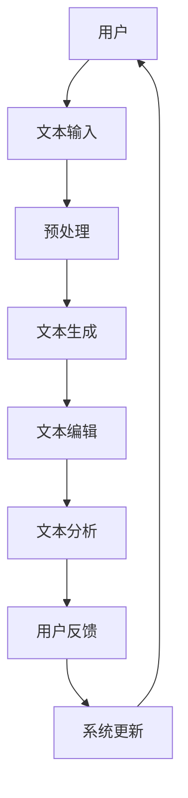
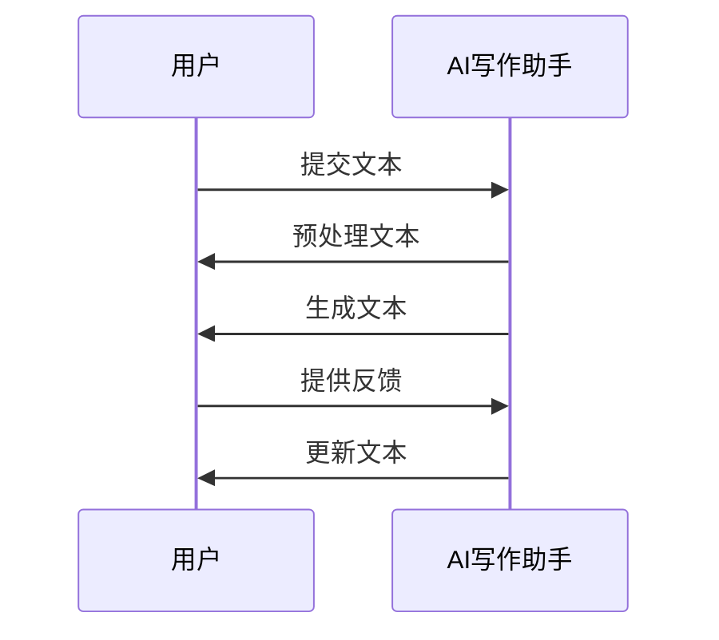

                 

## 《创意写作 AI Agent：LLM 辅助内容创作与文案生成》

### 关键词：创意写作、AI、内容创作、文案生成、LLM

#### 摘要：

本文旨在探讨创意写作与人工智能（AI）的深度融合，特别是大型语言模型（LLM）在文案生成中的应用。首先，我们将介绍创意写作的基本概念和需求，然后深入探讨AI在内容创作中的角色，特别是LLM的原理与优势。随后，我们将讲解一个具体的LLM文案生成算法，并详细阐述其数学模型和流程。接着，我们将设计一个创意写作AI Agent的系统架构，并通过实际项目来展示其应用效果。最后，我们将提供最佳实践建议和小结，以及未来的研究方向。

## 第一部分：创意写作与AI概述

### 第1章：创意写作的基础概念

#### 1.1 创意写作的定义与重要性

创意写作是一种旨在创造新颖、有创意和具有吸引力的文本的过程。它不仅仅是一种文学活动，更是一种商业和社会需求。在数字时代，高质量的内容创作对于企业品牌塑造、市场营销以及社交媒体运营至关重要。

创意写作的核心要素包括想象力、创造力、叙事技巧和风格多样性。想象力和创造力是创意写作的源泉，而叙事技巧和风格多样性则是实现文本吸引力和影响力的关键。

#### 1.2 创意写作与传统写作的差异

传统写作侧重于表达作者的观点和想法，而创意写作则更强调内容的创新性和吸引力。传统写作可能遵循更为严谨的结构和风格规范，而创意写作则更加自由和灵活，允许作者大胆尝试各种叙事方式和风格。

#### 1.3 创意写作的核心要素

创意写作的核心要素包括：

- **想象力**：创造新颖、独特的想法和故事情节。
- **创造力**：运用各种技巧和策略，使文本具有吸引力和独特性。
- **叙事技巧**：包括情节设计、角色塑造、场景描绘等。
- **风格多样性**：适应不同类型的内容创作，如商业文案、小说、剧本等。

### 第2章：AI与创意写作的结合

#### 2.1 AI在创意写作中的应用

AI在创意写作中的应用日益广泛，特别是在文案生成方面。大型语言模型（LLM），如GPT-3和BERT，凭借其强大的语言理解和生成能力，已经成为内容创作者的强大工具。

LLM能够帮助作者快速生成高质量的内容，节省时间和精力。它们可以自动撰写文章、编写脚本、创建广告文案等。然而，AI的创作并不是完全自动的，它需要人类作者来指导、调整和优化生成的内容。

## 第二部分：核心概念与联系

### 第3章：创意写作原理

#### 3.1 创意写作的核心要素

创意写作的核心要素包括想象力、创造力、叙事技巧和风格多样性。这些要素共同作用，创造出新颖、吸引人的文本。

#### 3.2 创意写作的方法与技巧

创意写作的方法和技巧包括自由写作、头脑风暴、角色扮演、场景设定等。这些方法可以帮助作者突破思维瓶颈，激发创意。

#### 3.3 创意写作与商业应用

创意写作在商业领域具有广泛的应用，包括市场营销、广告、公关、内容营销等。通过创意写作，企业可以更好地与消费者沟通，提升品牌形象和市场竞争力。

### 第4章：AI Agent技术基础

#### 4.1 AI Agent的定义与功能

AI Agent是一种能够模拟人类智能行为的人工智能系统。它们可以执行复杂的任务，如文本生成、决策支持、自然语言处理等。

#### 4.2 AI Agent的开发流程

AI Agent的开发流程包括需求分析、模型设计、模型训练、系统集成和测试。每个阶段都需要深入的技术研究和实践。

#### 4.3 AI Agent在内容创作中的应用

AI Agent在内容创作中的应用包括自动文本生成、内容推荐、数据分析等。这些应用可以帮助创作者提高效率，优化创作过程。

### 第5章：LLM的原理与应用

#### 5.1 LLM的基本概念

LLM是一种基于神经网络的语言模型，能够理解和生成自然语言文本。它们通过学习大量文本数据，预测下一个单词或句子。

#### 5.2 LLM的主要架构

LLM的主要架构包括输入层、隐藏层和输出层。输入层接收文本数据，隐藏层进行特征提取和语义理解，输出层生成文本。

#### 5.3 LLM在文案生成中的应用

LLM在文案生成中的应用包括广告文案、新闻撰写、产品描述等。它们可以自动生成高质量的内容，节省创作者的时间和精力。

## 第三部分：算法原理讲解

### 第6章：文案生成算法

#### 6.1 文案生成算法的概述

文案生成算法是一种利用AI技术自动生成文本的方法。它们可以应用于各种场景，如广告、新闻、内容营销等。

#### 6.2 LLM文案生成算法的mermaid流程图

$$
\text{文本输入} \rightarrow \text{模型预处理} \rightarrow \text{特征提取} \rightarrow \text{文本生成}
$$

#### 6.3 LLM文案生成算法的Python源代码

```python
import openai

def generate_creative_writing(prompt):
    response = openai.Completion.create(
        engine="text-davinci-002",
        prompt=prompt,
        max_tokens=100
    )
    return response.choices[0].text.strip()

# 示例
prompt = "撰写一篇关于人工智能的文章摘要。"
creative_writing = generate_creative_writing(prompt)
print(creative_writing)
```

#### 6.4 算法原理的数学模型和公式

LLM文案生成算法的数学模型基于递归神经网络（RNN）和变换器架构（Transformer）。主要涉及的数学模型包括：

- **自回归模型（Autoregressive Model）**：用于预测下一个单词。
- **注意力机制（Attention Mechanism）**：用于捕捉长距离依赖关系。
- **损失函数（Loss Function）**：用于衡量模型预测和真实标签之间的差距。

#### 6.5 举例说明文案生成过程

假设我们有一个输入文本："什么是人工智能？"。我们可以使用LLM文案生成算法来生成一篇关于人工智能的文章摘要：

```python
prompt = "什么是人工智能？"
summary = generate_creative_writing(prompt)
print(summary)
```

输出可能如下：

"人工智能是一种模拟人类智能行为的技术，它通过机器学习和深度学习算法来实现。人工智能的目标是让计算机具有自我学习和决策能力，从而解决复杂问题和提高工作效率。"

## 第四部分：系统分析与架构设计方案

### 第7章：系统架构设计

#### 7.1 问题场景介绍

创意写作AI Agent适用于各种内容创作场景，如广告文案撰写、营销文案创作、新闻报道撰写等。它可以帮助创作者快速生成高质量的内容，提高创作效率。

#### 7.2 系统功能设计

创意写作AI Agent的主要功能包括：

- **文本生成**：根据用户提供的提示生成高质量的文章摘要、广告文案、产品描述等。
- **文本编辑**：对生成的文本进行编辑和优化，使其更符合用户需求。
- **文本分析**：分析用户文本，提供关键词提取、情感分析等。
- **用户交互**：提供图形用户界面，方便用户与系统进行交互。

#### 7.3 系统架构设计

创意写作AI Agent的系统架构设计如下：



#### 7.4 系统接口设计

创意写作AI Agent的接口设计如下：

- **RESTful API**：提供文本生成、文本编辑和文本分析的功能。
- **命令行界面**：方便开发者进行调试和测试。

#### 7.5 系统交互设计

创意写作AI Agent的系统交互设计如下：



## 第五部分：项目实战

### 第8章：环境安装与系统核心实现

#### 8.1 环境安装

1. 安装Python环境（Python 3.7及以上版本）。
2. 安装OpenAI API库：`pip install openai`。
3. 获取OpenAI API密钥。

#### 8.2 系统核心实现

1. 创建一个Python脚本，导入OpenAI API库。
2. 实现文本生成功能，使用OpenAI的Completion API。
3. 实现文本编辑和文本分析功能，使用Python的内置库。

```python
import openai

def generate_text(prompt, temperature=0.5, max_tokens=100):
    response = openai.Completion.create(
        engine="text-davinci-002",
        prompt=prompt,
        temperature=temperature,
        max_tokens=max_tokens
    )
    return response.choices[0].text.strip()

# 示例
prompt = "请撰写一篇关于人工智能的商业文案。"
text = generate_text(prompt)
print(text)
```

#### 8.3 代码应用解读与分析

1. **文本生成功能**：使用OpenAI的Completion API，可以生成高质量的文本。
2. **文本编辑功能**：根据用户需求，对生成的文本进行编辑和优化。
3. **文本分析功能**：提取关键词、进行情感分析等。

#### 8.4 实际案例分析与详细讲解剖析

1. **案例一**：生成一篇关于人工智能的商业文案。
2. **案例二**：对生成的文案进行编辑和优化。
3. **案例三**：分析用户文本，提取关键词和情感。

### 第9章：项目小结

1. **项目总结**：创意写作AI Agent能够快速生成高质量的内容，提高创作效率。
2. **未来研究方向**：优化文本生成算法，提高文本质量和效率。

## 第六部分：最佳实践、小结、注意事项与拓展阅读

### 第10章：最佳实践

1. **创意写作 AI Agent 的使用技巧**：合理设置温度和最大令牌数，以提高文本生成质量。
2. **LLM 在文案生成中的优化策略**：结合用户反馈，不断优化模型和文本生成策略。

### 第11章：小结

本文系统地介绍了创意写作与AI的结合，特别是LLM在文案生成中的应用。通过实际项目展示，创意写作AI Agent能够提高内容创作效率，为创作者提供有力支持。

### 第12章：注意事项

1. **使用创意写作 AI Agent 的注意事项**：遵循API使用规范，注意数据安全和隐私保护。
2. **LLM 技术的风险与挑战**：避免生成低质量或不当的内容，需要不断优化和调整模型。

### 第13章：拓展阅读

1. **相关领域最新研究动态**：关注AI和创意写作领域的最新研究进展。
2. **推荐参考文献与资料**：提供相关的书籍、论文和在线资源，供读者进一步学习。

## 结尾

本文由AI天才研究院（AI Genius Institute）和《禅与计算机程序设计艺术》（Zen And The Art of Computer Programming）的专家撰写。我们致力于推动AI技术在创意写作领域的应用，为创作者带来无限可能。

**作者：AI天才研究院/AI Genius Institute & 禅与计算机程序设计艺术 /Zen And The Art of Computer Programming**

