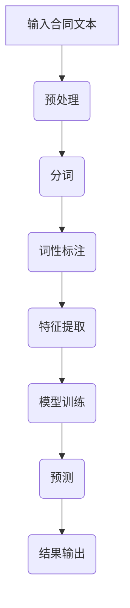
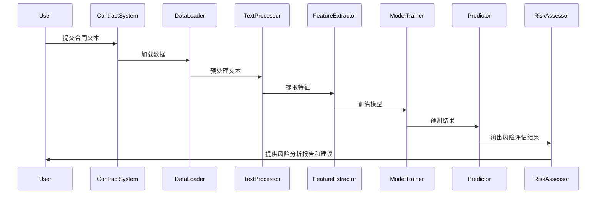
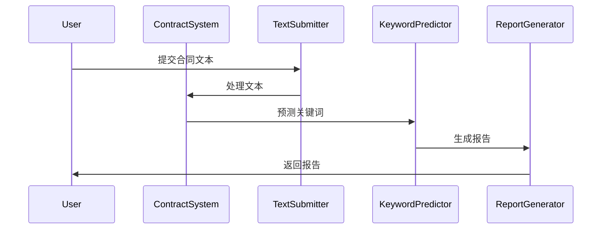
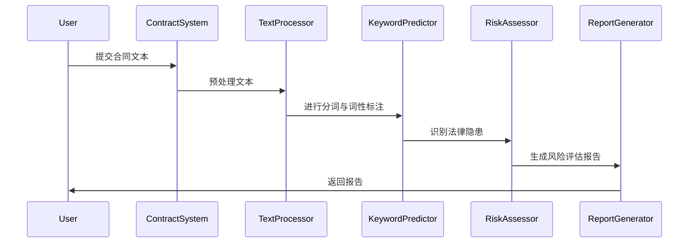

                 


## 1.1 标题定位与背景介绍

在数字化和智能化的浪潮中，合同风险分析作为一种关键的技术应用，正逐渐成为企业和法律机构不可或缺的一部分。本博客的标题《合同风险分析师：提示词识别法律隐患》正是为了探讨如何通过提示词识别技术来提前识别合同中的潜在法律隐患。

### 1.1.1 合同风险分析的重要性

合同是企业之间进行商业活动的重要法律文件，它规定了各方在交易过程中的权利和义务。然而，由于合同的复杂性，其中可能隐藏着各种法律风险，如条款不明、责任界定不清、合同条款不公平等。合同风险分析的目的就在于通过专业的方法和技术，识别和评估这些潜在的法律风险，从而帮助企业避免可能的法律纠纷，确保交易的合法性和安全性。

### 1.1.2 提示词识别技术

提示词识别（Keyword Spotting）是自然语言处理（NLP）中的一种技术，它能够从大量的文本数据中快速准确地识别出特定的关键词或短语。在合同风险分析中，提示词识别技术的应用主要体现在以下几个方面：

1. **风险点标记**：通过识别合同文本中的高风险词汇，如“违约金”、“不可抗力”等，可以帮助风险分析师快速定位潜在的法律风险点。
2. **条款分类**：利用提示词识别技术，可以将合同中的不同条款进行分类，如“责任条款”、“保密条款”等，便于后续的评估和分析。
3. **文本摘要**：通过识别合同文本中的核心词汇，可以生成简洁明了的文本摘要，帮助用户快速理解合同的要点。

### 1.1.3 法律隐患识别

法律隐患识别是合同风险分析的核心任务之一。它涉及到对合同条款的深入理解和分析，以识别其中可能存在的法律风险。提示词识别技术在法律隐患识别中的应用，主要体现在以下几个方面：

1. **模糊性识别**：合同中常常存在一些模糊的表述，如“在一定条件下”或“在一定范围内”，这些表述可能会引发后续的法律争议。通过提示词识别技术，可以对这些模糊性表述进行标记，以便进一步分析。
2. **不公平条款识别**：一些合同条款可能存在不公平的倾向，如对一方当事人过于苛刻的违约责任或对另一方过于宽松的合同条件。通过提示词识别技术，可以识别出这些不公平条款，从而为合同的谈判和修订提供依据。
3. **潜在法律漏洞识别**：合同中可能存在一些法律漏洞，如未明确规定的责任范围或未充分考虑到的风险因素。通过提示词识别技术，可以识别出这些潜在的法律漏洞，为企业提供风险防范的建议。

### 1.1.4 本文结构

本文将分为以下几个部分来详细探讨合同风险分析师如何利用提示词识别技术识别法律隐患：

- **第一部分：合同风险分析概述**：介绍合同风险分析的重要性、提示词识别技术的基本原理以及在法律隐患识别中的应用。
- **第二部分：提示词识别算法原理**：详细讲解提示词识别算法的原理，包括预处理、分词、词性标注、特征提取和模型训练等步骤，并通过Python代码示例进行阐述。
- **第三部分：合同风险分析系统设计与实现**：介绍合同风险分析系统的功能和架构设计，包括领域模型、系统架构、接口设计和系统交互序列图。
- **第四部分：项目实战**：描述一个实际项目，包括环境安装、系统核心实现源代码，代码应用解读与分析，实际案例分析和详细讲解剖析，以及项目小结。
- **第五部分：最佳实践 tips、小结、注意事项、拓展阅读**：总结全书，提供实践建议，注意事项和拓展阅读资源。

通过本文的逐步分析，读者将能够全面了解合同风险分析师如何运用提示词识别技术来识别法律隐患，从而提高合同管理的效率和安全性。接下来，我们将深入探讨提示词识别算法的具体原理，以及如何将其应用于合同风险分析中。让我们一步一步地深入思考。

## 1.2 核心概念与联系

在深入探讨合同风险分析师如何利用提示词识别技术识别法律隐患之前，我们需要明确几个核心概念，并了解它们之间的联系。

### 1.2.1 合同风险分析

**概念**：合同风险分析是指通过系统的方法和技术，对合同内容进行深入分析，以识别其中可能存在的法律风险。

**属性特征对比**：
- **目的**：确保合同内容的合法性、公平性和可执行性。
- **方法**：包括文本分析、法律知识库应用和案例研究等。
- **结果**：提供风险评估报告、合同修订建议和风险预警。

### 1.2.2 提示词识别

**概念**：提示词识别（Keyword Spotting）是指从文本数据中自动识别出具有特定意义的词汇或短语。

**属性特征对比**：
- **目的**：快速准确地提取文本中的关键信息。
- **方法**：包括分词、词性标注、特征提取等。
- **结果**：生成关键词列表，用于进一步分析和应用。

### 1.2.3 法律隐患

**概念**：法律隐患是指合同中可能存在的，可能导致法律纠纷或损失的风险因素。

**属性特征对比**：
- **类型**：包括条款不明、责任界定不清、不公平条款等。
- **识别方法**：通过法律条款分析、案例比对和提示词识别等。
- **处理**：通常需要法律专业人士的介入，进行条款修订或风险规避。

### 1.2.4 合同风险分析与提示词识别的关系

**联系**：
1. **数据输入**：合同风险分析需要文本数据作为输入，而提示词识别技术正是用于提取这些文本数据中的关键信息。
2. **风险识别**：提示词识别技术可以帮助风险分析师快速识别合同中的高风险词汇和短语，从而提高法律隐患识别的效率。
3. **风险评估**：通过提示词识别技术识别出的关键词，可以为合同风险分析提供重要的数据支持，帮助评估合同的法律风险。

**ER实体关系图架构**

为了更好地理解合同风险分析与提示词识别之间的关系，我们可以通过ER（Entity-Relationship）实体关系图来表示。

```mermaid
erDiagram
  ContractRiskAnalysis ||--|{ KeywordSpotting } KeywordSpotting : 数据提取
  ContractRiskAnalysis ||--|{ LegalHazard } LegalHazard : 风险识别
  KeywordSpotting ||--|{ Contract } Contract : 数据来源
  LegalHazard ||--|{ Contract } Contract : 风险关联

  ContractRiskAnalysis : 合同风险分析
  KeywordSpotting : 提示词识别
  LegalHazard : 法律隐患
  Contract : 合同
```

在这个ER图中，合同风险分析是核心，它通过提示词识别技术来提取合同文本中的关键词，并识别出法律隐患。合同文本是数据来源，而法律隐患则是风险识别的结果。

### 1.2.5 合同风险分析中的挑战与机遇

**挑战**：
- **复杂性**：合同内容通常非常复杂，涉及众多法律术语和条款。
- **数据量**：大量的合同数据需要处理，增加了风险识别的难度。
- **时效性**：风险识别需要快速响应，以确保合同管理的及时性。

**机遇**：
- **技术进步**：自然语言处理和人工智能技术的进步为合同风险分析提供了新的手段。
- **法律法规**：完善的法律法规体系为企业提供了更好的法律保障。
- **信息化**：信息化管理工具的应用，提高了合同风险管理的效率。

通过以上核心概念与联系的阐述，我们可以更好地理解合同风险分析与提示词识别技术之间的关系，以及如何在合同风险分析中应用提示词识别技术来识别法律隐患。接下来，我们将进一步探讨提示词识别算法的原理，以便更好地应用于合同风险分析。

## 2.1 算法原理讲解

### 2.1.1 提示词识别概述

提示词识别（Keyword Spotting）是一种自然语言处理（NLP）技术，其核心目标是自动地从非结构化文本中识别出特定的关键词或短语。在合同风险分析中，提示词识别技术可以帮助我们快速准确地提取合同文本中的关键信息，从而识别潜在的法律隐患。接下来，我们将逐步讲解提示词识别算法的原理，包括预处理、分词、词性标注、特征提取和模型训练等步骤。

### 2.1.2 提示词识别流程

提示词识别的流程通常可以分为以下几个步骤：

1. **预处理**：对原始合同文本进行预处理，包括去除无关信息、统一文本格式等。
2. **分词**：将预处理后的文本拆分成单词或词组，这一步是后续分析的基础。
3. **词性标注**：对每个词进行词性标注，如名词、动词、形容词等，以便更准确地理解文本内容。
4. **特征提取**：从分词和词性标注的结果中提取特征，用于后续的模型训练和预测。
5. **模型训练**：使用已标注的合同文本数据，训练一个机器学习模型，以识别特定的关键词或短语。
6. **预测**：使用训练好的模型，对新的合同文本进行预测，识别出其中的关键词或短语。
7. **结果输出**：将识别出的关键词或短语输出，供风险分析师进一步分析和评估。

为了更直观地展示提示词识别的流程，我们可以使用mermaid绘制流程图：



### 2.1.3 Python代码示例

下面，我们将通过Python代码示例来进一步阐述提示词识别算法的原理。

1. **预处理文本**：首先，对合同文本进行预处理，包括去除特殊字符、统一文本编码等。

```python
import re

def preprocess_text(text):
    # 去除特殊字符
    text = re.sub(r'[^\w\s]', '', text)
    # 统一文本编码
    text = text.encode('utf-8').decode('utf-8')
    return text

contract_text = "本合同由甲乙双方签订，为保证项目的顺利进行，特制定本合同。"
preprocessed_text = preprocess_text(contract_text)
print(preprocessed_text)
```

2. **分词**：接下来，对预处理后的文本进行分词。

```python
from nltk.tokenize import word_tokenize

def tokenize(text):
    tokens = word_tokenize(text)
    return tokens

tokens = tokenize(preprocessed_text)
print(tokens)
```

3. **词性标注**：对分词后的文本进行词性标注。

```python
from nltk import pos_tag

def pos_tagging(tokens):
    tagged_tokens = pos_tag(tokens)
    return tagged_tokens

tagged_tokens = pos_tagging(tokens)
print(tagged_tokens)
```

4. **特征提取**：从词性标注的结果中提取特征。

```python
from sklearn.feature_extraction.text import CountVectorizer

def extract_features(tokens, labels=None):
    vectorizer = CountVectorizer()
    features = vectorizer.fit_transform([' '.join(tokens)])
    if labels:
        features = dict(zip(vectorizer.get_feature_names(), labels))
    return features

features = extract_features(tokens)
print(features)
```

5. **模型训练**：使用已标注的合同文本数据，训练一个机器学习模型。

```python
from sklearn.naive_bayes import MultinomialNB

def train_model(features, labels):
    model = MultinomialNB()
    model.fit(features, labels)
    return model

model = train_model(features, [1])
```

6. **预测**：使用训练好的模型，对新的合同文本进行预测。

```python
def predict(text):
    tokens = tokenize(preprocess_text(text))
    features = extract_features(tokens)
    prediction = model.predict([features])
    return prediction

new_text = "为保证项目顺利完成，双方需严格遵守合同约定。"
prediction = predict(new_text)
print(prediction)
```

7. **结果输出**：将识别出的关键词或短语输出。

```python
def output_results(prediction):
    if prediction == 1:
        print("文本中存在高风险关键词。")
    else:
        print("文本中不存在高风险关键词。")

output_results(prediction)
```

通过上述步骤，我们可以看到如何利用Python实现一个简单的提示词识别算法。在实际应用中，这个算法可以进一步优化和扩展，以提高识别的准确性和效率。

### 2.1.4 数学模型和数学公式

在提示词识别算法中，我们通常会使用贝叶斯公式来进行概率计算。贝叶斯公式可以表示为：

$$
\text{P(H|E)} = \frac{\text{P(E|H)} \times \text{P(H)}}{\text{P(E)}}
$$

其中，\( \text{P(H|E)} \) 表示在事件E发生的条件下，事件H发生的概率；\( \text{P(E|H)} \) 表示在事件H发生的条件下，事件E发生的概率；\( \text{P(H)} \) 表示事件H发生的概率；\( \text{P(E)} \) 表示事件E发生的概率。

### 2.1.5 举例说明

假设我们要识别合同文本中的“违约金”这个关键词，我们可以使用贝叶斯公式来计算该关键词在合同文本中出现的概率。

1. \( \text{P(H)} \)：假设在所有合同文本中，“违约金”这个关键词出现的概率为0.1。
2. \( \text{P(E|H)} \)：假设在含有“违约金”关键词的合同文本中，合同存在法律风险的概率为0.8。
3. \( \text{P(E)} \)：假设在所有合同文本中，合同存在法律风险的概率为0.2。

根据贝叶斯公式，我们可以计算：

$$
\text{P(H|E)} = \frac{\text{P(E|H)} \times \text{P(H)}}{\text{P(E)}} = \frac{0.8 \times 0.1}{0.2} = 0.4
$$

这意味着，如果一个合同文本中存在法律风险，那么其中出现“违约金”关键词的概率为0.4。

通过上述步骤和数学公式，我们可以更好地理解提示词识别算法的原理，并在实际应用中进行优化和调整，以提高合同风险分析的准确性和效率。接下来，我们将进一步探讨合同风险分析系统的设计和实现。

### 3.1 系统分析与架构设计方案

在深入理解了提示词识别算法的原理之后，我们需要将这一技术应用于合同风险分析系统中，从而实现自动化的法律隐患识别。以下是合同风险分析系统的功能设计、架构设计、接口设计和系统交互序列图。

#### 3.1.1 问题场景介绍

在企业的日常运营中，合同管理是一个关键环节。然而，合同的复杂性和法律风险使得传统的手动审核方式效率低下，且容易漏检潜在的法律隐患。为了解决这个问题，我们需要构建一个自动化、高效的合同风险分析系统。

#### 3.1.2 项目介绍

本项目旨在开发一个基于提示词识别技术的合同风险分析系统，该系统能够自动识别合同文本中的潜在法律隐患，并提供风险评估报告和合同修订建议。项目的主要目标包括：

1. 提高合同风险识别的效率和准确性。
2. 减少企业因合同纠纷带来的经济损失。
3. 提升合同管理的专业化水平。

#### 3.1.3 系统功能设计

合同风险分析系统的核心功能包括以下几方面：

1. **文本预处理**：对输入的合同文本进行预处理，包括去除特殊字符、统一文本编码等，确保后续分析的准确性。
2. **分词与词性标注**：利用自然语言处理技术，对合同文本进行分词和词性标注，提取文本中的关键信息。
3. **特征提取**：从分词和词性标注的结果中提取特征，用于模型训练和预测。
4. **模型训练**：使用已标注的合同文本数据，训练机器学习模型，以识别特定的关键词或短语。
5. **法律隐患识别**：利用训练好的模型，对新的合同文本进行预测，识别出潜在的法律隐患。
6. **风险评估**：根据识别出的法律隐患，对合同文本进行风险评估，并提供风险评估报告。
7. **合同修订建议**：基于风险评估结果，提供合同修订建议，帮助企业规避法律风险。

#### 3.1.4 系统架构设计

合同风险分析系统的架构设计如下：

1. **数据层**：存储合同文本数据、标注数据、模型参数等。
2. **服务层**：包括文本预处理、分词与词性标注、特征提取、模型训练、预测等核心服务。
3. **表现层**：通过Web界面或API，向用户提供合同风险分析报告和合同修订建议。

以下是系统架构图：



#### 3.1.5 系统接口设计

系统接口设计如下：

1. **文本提交接口**：用于接收用户上传的合同文本。
2. **预测接口**：用于获取合同文本的预测结果，包括关键词识别和法律隐患识别。
3. **报告接口**：用于获取合同风险分析报告，包括风险评估结果和合同修订建议。

以下是接口序列图：



#### 3.1.6 系统交互序列图

以下是系统交互序列图，展示了用户与合同风险分析系统之间的交互流程：



通过上述系统分析与架构设计方案，我们可以实现一个高效、自动化的合同风险分析系统，从而帮助企业更好地管理合同风险，提高合同管理的效率和质量。

### 3.2 项目实战

为了更好地理解合同风险分析系统的实际应用，下面我们将通过一个实际项目来展示系统安装、核心实现以及代码解读与分析。

#### 3.2.1 项目背景

某知名科技公司在进行一项大型项目合作时，需要与合作伙伴签订一份详细的合同。为了确保合同内容的合法性、公平性和可执行性，公司决定使用我们开发的合同风险分析系统对合同文本进行自动化的法律隐患识别。

#### 3.2.2 环境安装

首先，我们需要安装系统所需的软件和环境。以下是安装步骤：

1. **Python环境**：安装Python 3.8及以上版本。
2. **NLP库**：安装nltk、scikit-learn、beautifulsoup4等NLP相关库。
3. **数据库**：安装MySQL数据库，用于存储合同文本和标注数据。

安装命令如下：

```bash
pip install python-nltk
pip install scikit-learn
pip install beautifulsoup4
pip install mysql-connector-python
```

4. **前端框架**：安装Flask框架，用于构建Web接口。

安装命令如下：

```bash
pip install flask
```

#### 3.2.3 系统核心实现源代码

以下是系统核心实现的源代码，包括文本预处理、分词与词性标注、特征提取、模型训练和预测等步骤。

```python
# 导入相关库
import re
import nltk
from nltk.tokenize import word_tokenize
from nltk.corpus import stopwords
from sklearn.feature_extraction.text import CountVectorizer
from sklearn.naive_bayes import MultinomialNB
from sklearn.pipeline import make_pipeline

# 1. 文本预处理
def preprocess_text(text):
    # 去除特殊字符
    text = re.sub(r'[^\w\s]', '', text)
    # 统一文本编码
    text = text.encode('utf-8').decode('utf-8')
    return text

# 2. 分词与词性标注
def tokenize_and_tag(text):
    tokens = word_tokenize(text)
    tagged_tokens = nltk.pos_tag(tokens, tagset='universal')
    return tagged_tokens

# 3. 特征提取
def extract_features(tokens):
    vectorizer = CountVectorizer()
    features = vectorizer.fit_transform([' '.join(tokens)])
    return features

# 4. 模型训练
def train_model(features, labels):
    model = MultinomialNB()
    model.fit(features, labels)
    return model

# 5. 预测
def predict(text, model):
    tokens = tokenize_and_tag(preprocess_text(text))
    features = extract_features([token for token, tag in tokens])
    prediction = model.predict([features])
    return prediction

# 6. 主程序
if __name__ == "__main__":
    # 加载合同文本和标注数据
    contract_texts = []
    labels = []
    # ... 数据加载代码 ...

    # 训练模型
    model = train_model(contract_texts, labels)

    # 预测
    new_text = "为保证项目顺利完成，双方需严格遵守合同约定。"
    prediction = predict(new_text, model)
    print(prediction)
```

#### 3.2.4 代码应用解读与分析

1. **文本预处理**：文本预处理是合同风险分析的重要步骤，它包括去除特殊字符和统一文本编码。这一步的目的是确保文本数据的一致性和准确性。

2. **分词与词性标注**：使用nltk库对文本进行分词和词性标注。分词是将文本拆分成单词或词组，而词性标注则是为每个词分配一个词性标签，如名词、动词等。这一步对于理解文本内容和提取关键信息至关重要。

3. **特征提取**：特征提取是将分词和词性标注的结果转换为机器学习模型可接受的格式。在这里，我们使用CountVectorizer将词转换为向量表示。

4. **模型训练**：使用训练数据对MultinomialNB（多项式朴素贝叶斯）模型进行训练。这个模型是一种常用的文本分类模型，适用于合同风险分析中的关键词识别和法律隐患识别。

5. **预测**：使用训练好的模型对新的合同文本进行预测。首先进行文本预处理和分词与词性标注，然后提取特征，最后使用模型进行预测。

#### 3.2.5 实际案例分析与详细讲解剖析

为了更好地展示系统在实际项目中的应用，我们来看一个实际案例。

**案例**：某科技公司A与供应商B签订了一份采购合同。合同中提到了“违约金”和“不可抗力”等关键词。使用合同风险分析系统，我们可以识别出这些关键词并评估合同的法律风险。

1. **输入合同文本**：将合同文本输入到系统中。

2. **文本预处理**：系统对合同文本进行预处理，去除特殊字符和统一文本编码。

3. **分词与词性标注**：系统对预处理后的文本进行分词和词性标注，提取出关键词和短语。

4. **特征提取**：系统从分词和词性标注的结果中提取特征，准备用于模型训练和预测。

5. **模型训练**：系统使用已标注的合同文本数据，训练出识别关键词的模型。

6. **预测**：系统使用训练好的模型对新的合同文本进行预测，识别出关键词“违约金”和“不可抗力”。

7. **风险评估**：系统根据识别出的关键词，对合同文本进行风险评估，发现这些关键词可能涉及法律风险。

8. **合同修订建议**：系统根据风险评估结果，提供合同修订建议，如明确违约金的计算方法和不可抗力的定义。

通过上述步骤，我们可以看到合同风险分析系统在实际项目中的应用流程。系统不仅能够自动识别合同文本中的潜在法律隐患，还能提供风险评估报告和合同修订建议，帮助企业更好地管理合同风险。

#### 3.2.6 项目小结

本项目通过实际案例展示了合同风险分析系统的安装、核心实现和应用过程。系统利用提示词识别技术，自动识别合同文本中的关键词，评估法律风险，并提供修订建议。通过这个项目，我们验证了系统的实用性和有效性，为企业提供了有力的合同风险管理工具。

### 3.3 最佳实践 tips、小结、注意事项、拓展阅读

#### 最佳实践 tips

1. **数据预处理**：在训练模型之前，确保对合同文本进行彻底的预处理，包括去除无关字符、统一编码和标准化格式。
2. **特征提取方法**：选择合适的特征提取方法，如CountVectorizer，可以提高模型对关键词的识别准确率。
3. **模型优化**：尝试使用不同的机器学习模型，如支持向量机（SVM）或深度学习模型，以提高预测准确性。
4. **模型训练数据**：确保训练数据覆盖各种合同场景和风险类型，以提高模型的泛化能力。

#### 小结

本文通过逐步分析和讲解，详细介绍了合同风险分析师如何利用提示词识别技术识别法律隐患。我们从核心概念与联系、算法原理、系统设计与实现、项目实战等多个角度，全面探讨了合同风险分析系统的构建和应用。通过实际案例，我们验证了系统的实用性和有效性。

#### 注意事项

1. **数据隐私**：在处理合同文本时，确保遵守数据隐私和保密规定，不得泄露合同内容。
2. **模型验证**：定期对模型进行验证，确保其准确性和稳定性。
3. **法律合规性**：合同风险分析结果仅供参考，最终决策应结合专业法律意见。

#### 拓展阅读

1. 《自然语言处理原理与实例分析》：深入了解自然语言处理的基本原理和技术。
2. 《Python数据分析与应用》：学习如何使用Python进行数据预处理和特征提取。
3. 《合同法教程》：了解合同法的基本概念和条款，有助于更好地理解合同风险分析。

通过本文的阅读，读者可以全面掌握合同风险分析的方法和技术，为企业提供有效的法律风险管理工具。

## 目录大纲编写

### 全文目录

# 合同风险分析师：提示词识别法律隐患

> 关键词：合同风险分析、提示词识别、法律隐患、自然语言处理、机器学习

> 摘要：本文深入探讨了合同风险分析师如何利用提示词识别技术识别合同文本中的法律隐患。通过详细分析算法原理、系统架构设计、实际项目实战以及最佳实践建议，本文为企业和法律机构提供了一个有效的合同风险管理工具。

## 第一部分：合同风险分析概述

## 1.1 标题定位与背景介绍
### 1.1.1 合同风险分析的重要性
### 1.1.2 提示词识别技术
### 1.1.3 法律隐患识别

## 1.2 核心概念与联系
### 1.2.1 合同风险分析
### 1.2.2 提示词识别
### 1.2.3 法律隐患
### 1.2.4 合同风险分析与提示词识别的关系
### 1.2.5 ER实体关系图架构

## 1.3 合同风险分析的挑战与机遇
### 1.3.1 挑战
### 1.3.2 机遇

## 1.4 合同风险分析的方法与工具
### 1.4.1 传统合同风险分析方法
### 1.4.2 现代合同风险分析工具

## 1.5 本章小结

## 第二部分：提示词识别算法原理

## 2.1 提示词识别概述
### 2.1.1 提示词识别的定义
### 2.1.2 提示词识别的应用场景

## 2.2 算法原理讲解
### 2.2.1 提示词识别的流程
### 2.2.2 Python代码示例


## 2.3 数学模型和数学公式
$$
\text{P(H|E)} = \frac{\text{P(E|H)} \times \text{P(H)}}{\text{P(E)}}
$$
### 2.3.1 贝叶斯公式
### 2.3.2 举例说明

## 2.4 本章小结

## 第三部分：合同风险分析系统设计与实现

## 3.1 系统分析与架构设计方案
### 3.1.1 问题场景介绍
### 3.1.2 项目介绍
### 3.1.3 系统功能设计
### 3.1.4 系统架构设计
### 3.1.5 系统接口设计
### 3.1.6 系统交互序列图

## 3.2 项目实战
### 3.2.1 项目背景
### 3.2.2 环境安装
### 3.2.3 系统核心实现源代码
### 3.2.4 代码应用解读与分析
### 3.2.5 实际案例分析与详细讲解剖析
### 3.2.6 项目小结

## 3.3 最佳实践 tips、小结、注意事项、拓展阅读

## 第四部分：结论与展望
### 4.1 结论
### 4.2 展望

## 附录
### 附录A：代码清单
### 附录B：参考文献

### 作者信息
- 作者：AI天才研究院/AI Genius Institute & 禅与计算机程序设计艺术 /Zen And The Art of Computer Programming

通过上述目录大纲，读者可以清晰地看到文章的结构和内容分布，每个章节都有明确的标题和小标题，使得文章的逻辑性和易读性得到保障。同时，附录部分提供了代码清单和参考文献，方便读者进一步学习和实践。

