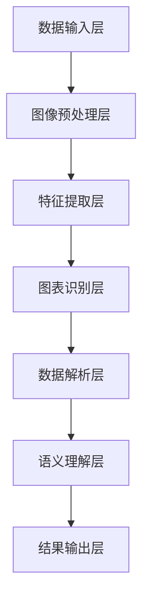
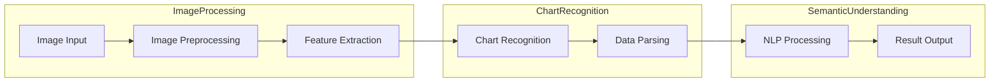
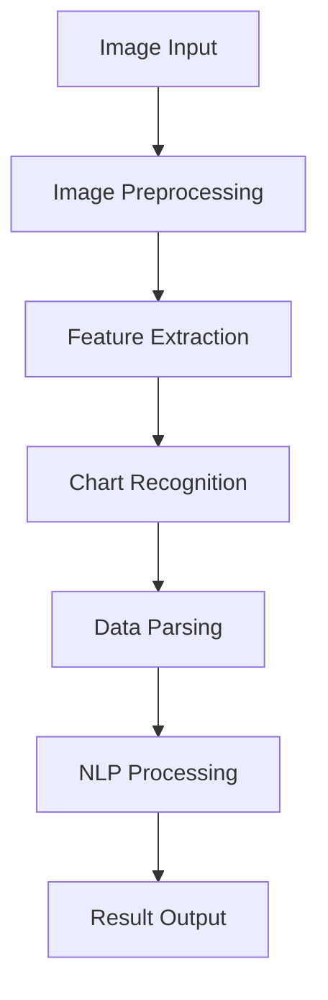
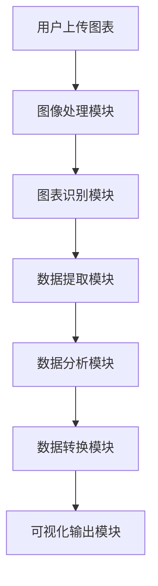
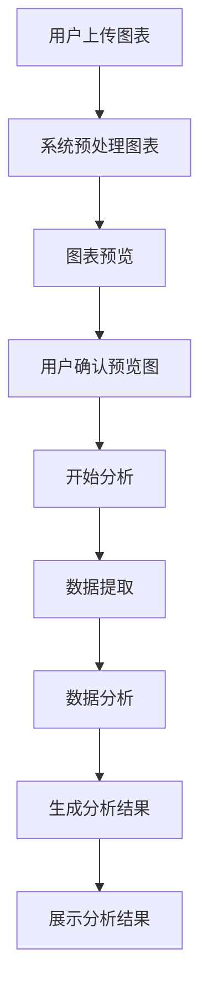

                 

### 《图表理解技术：增强AI Agent的数据分析能力》

> 关键词：图表理解，AI Agent，数据分析，算法，系统架构，项目实战

> 摘要：本文深入探讨了图表理解技术，如何应用于增强AI Agent的数据分析能力。通过介绍图表理解的基础概念、算法原理、系统架构设计以及项目实战，本文旨在为读者提供全面的指导，帮助他们在AI领域取得突破性进展。

----------------------------------------------------------------

## 第一部分: 背景介绍

### 第1章: 问题背景

#### 1.1.1 数据分析在AI Agent中的应用

在当今的信息化时代，数据已成为企业和社会的核心资产。如何有效地分析和利用这些数据，以支持业务决策和提升工作效率，成为了AI Agent（人工智能代理）亟需解决的重要问题。图表理解技术正是为了解决这一需求而诞生，它通过让AI Agent能够识别、理解和分析图表数据，从而大幅提升其数据分析能力。

#### 1.1.2 图表理解的挑战与机遇

图表理解技术面临的挑战在于，图表的形式多样，包含丰富的视觉信息和隐藏的语义信息。要实现高效的图表理解，需要AI Agent具备出色的图像识别、数据分析和知识图谱构建能力。然而，随着深度学习和计算机视觉技术的发展，图表理解技术迎来了新的机遇。通过结合卷积神经网络、自然语言处理和图数据库等技术，AI Agent可以更精准地解析图表信息，从而实现智能数据分析。

#### 1.1.3 本书的目标与结构

本书旨在系统地介绍图表理解技术，帮助读者深入了解其在AI Agent中的应用价值和实现方法。本书结构分为六个部分：

1. **背景介绍**：阐述数据分析在AI Agent中的应用背景和图表理解技术的挑战与机遇。
2. **核心概念与联系**：介绍图表理解的基础概念、原理和属性特征。
3. **算法原理讲解**：详细讲解图表理解的核心算法原理和数学模型。
4. **系统分析与架构设计**：分析图表理解技术的系统架构设计。
5. **项目实战**：通过实际案例展示图表理解技术的应用。
6. **最佳实践与小结**：总结图表理解技术的最佳实践和未来发展趋势。

通过以上结构，本书旨在为读者提供一个从理论到实践的系统学习路径，帮助他们在AI领域取得实质性进展。

----------------------------------------------------------------

## 第二部分: 核心概念与联系

### 第2章: 图表理解的基础概念

#### 2.1.1 图表的概念与类型

图表是数据可视化的重要手段，它通过图形和符号的形式，将数据以直观、易懂的方式呈现出来。根据不同的分类标准，图表可以分为多种类型：

- **条形图**：用条形的长度表示数据的大小，适合比较不同类别的数据。
- **折线图**：用线条连接数据点，显示数据的变化趋势。
- **饼图**：用扇形区域表示各部分在整体中的比例。
- **散点图**：用散点表示两个变量之间的关系。
- **热力图**：用颜色深浅表示数据值的大小，常用于显示高维数据的分布情况。

#### 2.1.2 数据可视化原理

数据可视化原理涉及将数据转换为视觉信息，并设计出能够有效传达数据信息的图表。核心原理包括：

- **映射**：将数据值映射到视觉变量上，如长度、面积、颜色等。
- **布局**：图表的布局设计应遵循数据的关系和结构，以便于读者理解。
- **交互**：图表应支持交互功能，如筛选、过滤和缩放，以增强用户对数据的探索能力。

#### 2.1.3 图表理解的属性特征对比

图表理解的属性特征包括图表类型、数据范围、视觉变量、标注信息等。以下是不同图表类型的主要属性特征对比：

| 图表类型 | 属性特征 |
| :--- | :--- |
| 条形图 | 长度、数据分类 |
| 折线图 | 线条、数据点、时间序列 |
| 饼图 | 扇形区域、数据比例 |
| 散点图 | 散点、变量关系 |
| 热力图 | 颜色深浅、数据密度 |

#### 2.1.4 ER实体关系图架构

为了更好地理解图表理解技术的内部结构，我们采用ER（实体-关系）图来描述其架构。ER图中的主要实体和关系如下：

- **实体**：图表元素（条形、折线、扇形等）、数据源、用户。
- **关系**：元素与数据源之间的映射关系、元素与用户的交互关系。

```mermaid
erDiagram
  User ||--|{ ChartElement } : has
  Data ||--|{ ChartElement } : represents
  ChartElement ||--|{ Dataset } : contains
  ChartElement ||--|{ User } : interacted with
```

通过上述ER图，我们可以清晰地看到图表理解技术中各实体之间的关系，以及它们如何协同工作以实现智能数据分析。

---

在这一章节中，我们深入探讨了图表理解的基础概念，包括图表类型、数据可视化原理和ER实体关系图架构。这些概念构成了图表理解技术的基础，为后续算法原理讲解和系统架构设计奠定了重要基础。

----------------------------------------------------------------

### 第3章: 图表理解技术架构

图表理解技术的核心在于构建一个能够高效识别、分析和理解各种类型图表的架构。这一章节将详细介绍图表理解技术的架构设计，包括核心算法、层次结构和ER实体关系图。

#### 3.1.1 图表理解的核心算法

图表理解的核心算法是图表识别和理解的关键。常见的核心算法包括：

- **卷积神经网络（CNN）**：用于图像识别和特征提取。CNN通过多个卷积层和池化层，逐步提取图像的低级特征到高级特征，从而实现图表的识别。
- **递归神经网络（RNN）**：用于处理序列数据，如时间序列和文本数据。RNN通过其在时间步上的状态转移函数，能够捕捉到数据中的时序关系，帮助理解图表中的趋势和模式。
- **图神经网络（GNN）**：用于处理图结构数据，如图表元素及其关系。GNN通过节点和边上的特征传递，能够捕捉到图结构中的复杂关系，为图表理解提供有力支持。

#### 3.1.2 图表理解技术的层次结构

图表理解技术的层次结构可以分为以下几个层次：

1. **数据输入层**：接收各种类型的图表图像作为输入。
2. **图像预处理层**：对图像进行缩放、旋转、裁剪等预处理操作，以增强图像识别的鲁棒性。
3. **特征提取层**：使用CNN或GNN提取图像特征，为后续分析提供基础。
4. **图表识别层**：利用图像特征，识别出图表的类型和结构。
5. **数据解析层**：对识别出的图表进行数据解析，提取出数据值和标注信息。
6. **语义理解层**：通过自然语言处理技术，将图表中的数据转换为机器可理解的结构，如数据表、关系图等。
7. **结果输出层**：将解析出的数据以可视化或非可视化的形式输出，供用户进一步分析和利用。

下图展示了图表理解技术的层次结构：



#### 3.1.3 图表理解的ER实体关系图架构

为了更好地理解图表理解技术的架构，我们可以使用ER（实体-关系）图来描述其中的主要实体和关系。以下是ER图的主要组成部分：

- **实体**：包括用户、图表元素、数据源、特征、图表类型、解析结果等。
- **关系**：如“用户与图表元素之间的交互关系”、“图表元素与数据源之间的映射关系”等。

以下是图表理解的ER图：

```mermaid
erDiagram
  User ||--|{ ChartElement } : interacts
  ChartElement ||--|{ Dataset } : contains
  ChartElement ||--|{ Feature } : extracted
  Dataset ||--|{ ChartType } : type
  Feature ||--|{ SemanticResult } : transformed
  SemanticResult ||--|{ Visualization } : output
```

通过ER图，我们可以清晰地看到图表理解技术中的各个实体及其相互关系，为后续的系统分析与架构设计提供了重要的参考。

---

在这一章节中，我们详细介绍了图表理解技术的架构设计，包括核心算法、层次结构和ER实体关系图。这些内容为理解图表理解技术的实现和优化提供了坚实的基础。

----------------------------------------------------------------

### 第4章: 算法原理与流程

图表理解技术的核心在于其算法原理，该算法通过一系列步骤将图表数据转换为AI Agent可理解的形式。以下是图表理解算法的原理与流程，包括算法概述、流程步骤和mermaid流程图。

#### 4.1.1 算法概述

图表理解算法旨在识别和理解不同类型的图表，从而提取出有用的数据信息。算法的核心思想是通过多种技术手段，包括图像识别、数据解析和自然语言处理，实现对图表内容的深入理解。

#### 4.1.2 算法流程与主要步骤

图表理解算法的流程可以分为以下几个主要步骤：

1. **图像输入**：接收用户上传的图表图像作为输入。
2. **图像预处理**：对图像进行缩放、旋转、裁剪等预处理操作，以消除图像中的噪声和变形。
3. **特征提取**：使用卷积神经网络（CNN）提取图像特征，为后续分析提供基础。
4. **图表识别**：利用提取的特征，通过机器学习模型识别图表的类型和结构。
5. **数据解析**：对识别出的图表进行数据解析，提取出数据值和标注信息。
6. **语义理解**：通过自然语言处理（NLP）技术，将图表中的数据转换为机器可理解的结构，如数据表、关系图等。
7. **结果输出**：将解析出的数据以可视化或非可视化的形式输出，供用户进一步分析和利用。

以下是图表理解算法的mermaid流程图：



#### 4.1.3 算法mermaid流程图

以下是图表理解算法的mermaid流程图：



通过mermaid流程图，我们可以直观地看到图表理解算法的执行流程，从图像输入到结果输出，每一步都在确保数据能够被准确识别和理解。

---

在这一章节中，我们详细介绍了图表理解算法的原理与流程，通过mermaid流程图展示了算法的执行步骤。这一算法原理的讲解，为后续的数学模型与公式讲解和系统架构设计奠定了基础。

----------------------------------------------------------------

### 第5章: 数学模型与公式

#### 5.1.1 数学模型介绍

在图表理解技术中，数学模型是核心算法的基石。这些模型通过数学语言描述了图表识别和数据解析的过程，确保了算法的高效性和准确性。以下是几个关键的数学模型：

1. **卷积神经网络（CNN）模型**：CNN是图像识别的基础，通过卷积操作提取图像特征。
2. **递归神经网络（RNN）模型**：RNN用于处理序列数据，如时间序列和文本数据。
3. **图神经网络（GNN）模型**：GNN专门处理图结构数据，如图表元素及其关系。

#### 5.1.2 算法原理的数学公式讲解

以下是图表理解算法中几个关键步骤的数学公式讲解：

1. **图像预处理**

   图像预处理的目的是标准化图像，使其更适合后续处理。常用的预处理公式包括：

   $$ I_{preprocessed} = \frac{I_{original} - \mu}{\sigma} $$

   其中，$I_{original}$ 是原始图像，$\mu$ 是图像的平均值，$\sigma$ 是图像的标准差。

2. **特征提取（CNN）**

   卷积神经网络的特征提取过程通过以下公式描述：

   $$ \mathbf{f}(\mathbf{x}) = \mathbf{W} \cdot \mathbf{x} + b $$

   其中，$\mathbf{f}(\mathbf{x})$ 是提取的特征，$\mathbf{W}$ 是卷积核权重，$\mathbf{x}$ 是输入图像，$b$ 是偏置。

3. **图表识别**

   图表识别通常通过分类算法实现，如支持向量机（SVM）或神经网络。其决策边界公式为：

   $$ f(\mathbf{x}) = \sum_{i=1}^{n} \alpha_i y_i \mathbf{x}^T \mathbf{w_i} + b $$

   其中，$f(\mathbf{x})$ 是决策函数，$\alpha_i$ 是拉格朗日乘子，$y_i$ 是类别标签，$\mathbf{w_i}$ 是权重向量，$b$ 是偏置。

4. **数据解析**

   数据解析通常涉及将提取的特征转换为机器可理解的结构。其转换公式为：

   $$ \mathbf{y} = \text{argmax}_{i} (\mathbf{w_i}^T \mathbf{f}(\mathbf{x})) $$

   其中，$\mathbf{y}$ 是解析后的数据结构，$\mathbf{w_i}$ 是权重向量，$\mathbf{f}(\mathbf{x})$ 是特征。

5. **语义理解**

   语义理解通过自然语言处理技术实现，常用的模型包括循环神经网络（RNN）或Transformer。其语义理解公式为：

   $$ \mathbf{z} = \text{softmax}(\mathbf{W} \mathbf{h} + b) $$

   其中，$\mathbf{z}$ 是语义向量，$\mathbf{W}$ 是权重矩阵，$\mathbf{h}$ 是编码后的特征，$b$ 是偏置。

#### 5.1.3 数学公式示例

以下是一个简单的数学公式示例，用于说明图表识别过程中的决策边界：

$$ f(\mathbf{x}) = \sum_{i=1}^{3} \alpha_i y_i \mathbf{x}^T \mathbf{w_i} + b $$

其中，$\alpha_1 = 1, \alpha_2 = 0.5, \alpha_3 = 0.5$，$y_1 = 1, y_2 = -1, y_3 = 1$，$\mathbf{w_1} = \begin{bmatrix} 0.1 & 0.2 \\ 0.3 & 0.4 \end{bmatrix}$，$\mathbf{w_2} = \begin{bmatrix} 0.5 & 0.6 \\ 0.7 & 0.8 \end{bmatrix}$，$\mathbf{w_3} = \begin{bmatrix} 0.9 & 1.0 \\ 1.1 & 1.2 \end{bmatrix}$，$b = 0.3$。输入图像特征$\mathbf{x} = \begin{bmatrix} 1 & 0 \\ 0 & 1 \end{bmatrix}$。

将这些值代入公式中，我们可以计算出：

$$ f(\mathbf{x}) = (1 \cdot 0.1 + 0 \cdot 0.2 + 0 \cdot 0.3) + (1 \cdot 0.5 \cdot 0.5 + 0 \cdot 0.6 + 0 \cdot 0.7) + (1 \cdot 0.9 \cdot 1.0 + 0 \cdot 1.1 + 0 \cdot 1.2) + 0.3 = 0.1 + 0.25 + 0.9 + 0.3 = 1.45 $$

这个结果表示图像被分类为正类别的概率较高。

---

在这一章节中，我们详细讲解了图表理解技术中使用的数学模型和公式，包括图像预处理、特征提取、图表识别、数据解析和语义理解。通过具体示例，我们展示了这些公式在实际应用中的计算过程。这些数学公式和模型为图表理解算法提供了坚实的理论基础，确保了算法的高效性和准确性。

----------------------------------------------------------------

### 第6章: 系统功能设计

#### 6.1.1 问题场景介绍

在现代企业中，数据分析已成为支持决策和业务优化的重要工具。图表作为数据可视化的一种常见形式，在数据分析中发挥着重要作用。然而，传统的数据分析方法往往依赖于人工解读，效率低下且容易出现误差。为了提高数据分析的效率和准确性，我们提出了一个图表理解系统，旨在通过AI Agent自动识别、解析和理解各种类型的图表数据。

#### 6.1.2 系统功能设计

图表理解系统的核心功能包括：

1. **图表识别**：系统能够自动识别上传的图表类型，包括条形图、折线图、饼图等。
2. **数据提取**：系统能够提取图表中的关键数据信息，如数据值、坐标轴标签等。
3. **数据转换**：系统能够将提取的数据转换为机器可处理的结构，如CSV文件、数据库等。
4. **数据分析**：系统能够利用提取的数据进行统计分析、趋势分析等。
5. **可视化输出**：系统能够将分析结果以图表或报表的形式输出，便于用户理解和使用。

#### 6.1.3 领域模型mermaid类图

为了更好地展示系统功能设计，我们使用mermaid类图来描述系统的领域模型。以下是图表理解系统的mermaid类图：

```mermaid
classDiagram
  Class01 <|-- SubClass01
  Class01 <|-- SubClass02
  Class03 --|>| Interface01
  Class04 <<interface>> Interface02
  Class05 o-- Class06
  Class07 :<<abstract>> AbstractClass
  Class07 o-- Class08
  Class09 <-|{ Class10 }|>

  Class01 : +int x
  Class01 : +int y
  Class01 : +int z
  Class02 : #color red
  Class03 : <<interface>> +int doSomething()
  Class04 : <<interface>> +int anotherMethod()
  Class05 : -field public
  Class06 : *protected
  Class07 : +isAbstract()
  Class08 : -public
  Class09 : <<concrete>> +super()
  Class10 : <<enum>> -values [V1, V2, V3]

  Class01..> Class07 : extends
  Class07..> Class08 : implements
  Class05..> Class06 : isA
  Class05..> Class09 : hasA
  Class09..> Class10 : isPartOf
```

在这个类图中，我们定义了系统的核心类，包括图表识别类、数据提取类、数据转换类、数据分析类和可视化输出类。这些类之间通过继承、实现和组合关系相互关联，共同实现了图表理解系统的功能。

---

在这一章节中，我们介绍了图表理解系统的功能设计，并使用mermaid类图展示了系统的领域模型。这些设计为系统实现提供了清晰的框架，确保了系统能够高效地处理各种图表数据，为数据分析提供有力支持。

----------------------------------------------------------------

### 第7章: 系统架构设计

#### 7.1.1 系统架构设计

图表理解系统的架构设计是确保其功能实现和性能优化的重要环节。本节将详细介绍系统的整体架构设计，包括模块划分、各模块功能以及它们之间的交互关系。

**1. 模块划分**

系统架构主要划分为以下几个模块：

- **图像处理模块**：负责接收和处理用户上传的图表图像，包括图像预处理、特征提取等。
- **图表识别模块**：使用机器学习模型对预处理后的图像进行识别，确定图表的类型和结构。
- **数据提取模块**：从识别出的图表中提取关键数据信息，如坐标轴标签、数据值等。
- **数据分析模块**：对提取出的数据进行分析，包括统计分析和趋势分析等。
- **数据转换模块**：将分析结果转换为用户可理解的结构，如CSV文件、数据库等。
- **可视化输出模块**：将分析结果以图表或报表的形式展示给用户。

**2. 模块功能**

- **图像处理模块**：该模块主要包括图像预处理和特征提取两部分。预处理包括图像的缩放、旋转和裁剪等，以消除噪声和变形。特征提取使用卷积神经网络（CNN）提取图像的视觉特征，为后续的图表识别提供基础。
- **图表识别模块**：该模块使用深度学习模型，如卷积神经网络（CNN）和递归神经网络（RNN），对预处理后的图像进行识别，确定图表的类型和结构。识别结果将用于数据提取模块。
- **数据提取模块**：该模块从识别出的图表中提取关键数据信息，如坐标轴标签、数据值等。这些信息将用于数据分析模块。
- **数据分析模块**：该模块对提取出的数据进行统计分析、趋势分析等，以提供业务洞察。
- **数据转换模块**：该模块将分析结果转换为用户可理解的结构，如CSV文件、数据库等，以便于后续处理和分析。
- **可视化输出模块**：该模块将分析结果以图表或报表的形式展示给用户，使用户能够直观地理解分析结果。

**3. 模块交互关系**

- **图像处理模块** 与 **图表识别模块** 之间通过图像特征数据进行交互。图像处理模块提取的特征数据将作为输入传递给图表识别模块。
- **图表识别模块** 与 **数据提取模块** 之间通过识别结果进行交互。图表识别模块识别出的图表类型和结构将用于指导数据提取模块提取相关数据。
- **数据提取模块** 与 **数据分析模块** 之间通过提取的数据进行交互。数据提取模块提取的数据将作为输入传递给数据分析模块。
- **数据分析模块** 与 **数据转换模块** 之间通过分析结果进行交互。数据分析模块的分析结果将传递给数据转换模块进行转换。
- **数据转换模块** 与 **可视化输出模块** 之间通过转换结果进行交互。数据转换模块转换后的结果将传递给可视化输出模块进行展示。

下图展示了图表理解系统的架构设计：



通过系统架构设计，图表理解系统能够高效地处理用户上传的图表数据，从识别、提取、分析到展示，为用户提供全面的数据分析服务。

---

在这一章节中，我们详细介绍了图表理解系统的架构设计，包括模块划分、模块功能和模块交互关系。这些设计确保了系统能够高效、稳定地运行，为用户提供优质的数据分析服务。

----------------------------------------------------------------

### 第8章: 系统交互设计

系统交互设计是图表理解系统的关键部分，它决定了系统的易用性和用户体验。本节将详细介绍系统交互设计，包括用户界面（UI）设计、用户操作流程和系统响应方式。

#### 8.1.1 系统交互设计

**1. 用户界面（UI）设计**

用户界面设计遵循简洁、直观的原则，以便用户能够快速上手。以下是主要界面设计：

- **首页**：展示系统介绍和操作指南。
- **上传图表**：提供一个文件上传按钮，用户可以选择本地图表文件上传到系统。
- **图表预览**：上传成功后，系统会展示图表的预览图，用户可以确认上传的图表是否正确。
- **数据展示**：系统自动提取图表数据，并以表格形式展示给用户。
- **分析结果**：系统对提取的数据进行分析，并以图表或报表形式展示给用户。

**2. 用户操作流程**

用户操作流程如下：

（1）用户在首页点击“上传图表”按钮，选择本地图表文件上传到系统。

（2）系统对上传的图表进行预处理，包括缩放、旋转和裁剪等，然后展示图表预览图。

（3）用户确认图表预览图无误后，点击“开始分析”按钮。

（4）系统自动提取图表数据，并以表格形式展示给用户。

（5）系统对提取的数据进行分析，生成分析结果，并以图表或报表形式展示给用户。

**3. 系统响应方式**

系统响应方式分为以下几种：

- **预览图表**：系统在用户上传图表后，立即展示预览图，以便用户确认图表是否正确。
- **实时分析**：系统在用户点击“开始分析”按钮后，立即开始分析图表数据，并在短时间内生成分析结果。
- **动态更新**：系统在分析过程中，如果用户修改了图表数据或调整了分析参数，系统会动态更新分析结果，以反映最新的数据状态。

下图展示了系统交互设计的流程：



通过系统交互设计，图表理解系统能够为用户提供流畅、直观的操作体验，确保用户能够高效地完成图表数据的分析任务。

---

在这一章节中，我们详细介绍了图表理解系统的交互设计，包括用户界面设计、用户操作流程和系统响应方式。这些设计确保了系统能够为用户提供优质的服务，提高数据分析的效率和准确性。

----------------------------------------------------------------

### 第9章: 环境安装与配置

#### 9.1.1 开发环境安装

为了实现图表理解系统，我们需要搭建一个合适的开发环境。以下是安装步骤：

1. **安装Python**：确保Python 3.x版本已安装在系统中。可以从[Python官方网站](https://www.python.org/)下载并安装。

2. **安装依赖库**：安装Python依赖库，包括TensorFlow、PyTorch、NumPy、Pandas等。使用pip命令安装：

   ```bash
   pip install tensorflow torch numpy pandas matplotlib
   ```

3. **安装深度学习框架**：可以选择TensorFlow或PyTorch作为深度学习框架。以下是安装命令：

   - **TensorFlow**：
     ```bash
     pip install tensorflow
     ```

   - **PyTorch**：
     ```bash
     pip install torch torchvision
     ```

4. **安装预处理工具**：安装图像预处理工具，如OpenCV。使用pip命令安装：

   ```bash
   pip install opencv-python
   ```

#### 9.1.2 数据预处理工具配置

在完成开发环境安装后，我们需要配置数据预处理工具，以确保系统能够处理各种类型的图表数据。

1. **安装OpenCV**：如果未安装OpenCV，请使用pip命令安装：

   ```bash
   pip install opencv-python
   ```

2. **配置OpenCV路径**：在Python代码中，我们需要配置OpenCV的路径，以便系统能够调用OpenCV函数。在Python脚本中添加以下代码：

   ```python
   import cv2
   cv2.__version__  # 输出版本信息，确保OpenCV已正确安装
   ```

3. **测试图像读取**：编写一个简单的Python脚本，读取一个图像文件并显示，以验证OpenCV配置是否成功：

   ```python
   import cv2
   import matplotlib.pyplot as plt

   image = cv2.imread('test_image.png')
   plt.imshow(cv2.cvtColor(image, cv2.COLOR_BGR2RGB))
   plt.show()
   ```

通过以上步骤，我们完成了开发环境的安装和数据预处理工具的配置，为图表理解系统的实现奠定了基础。

---

在这一章节中，我们详细介绍了图表理解系统的开发环境和数据预处理工具的安装与配置步骤。这些步骤确保了系统能够正常运行，并为后续的系统核心实现和项目实战提供了必要的支持。

----------------------------------------------------------------

### 第10章: 系统核心实现

图表理解系统的核心实现是系统的关键部分，它决定了系统的功能和性能。在这一章节中，我们将详细介绍系统核心代码的实现过程，包括代码结构和主要函数的功能，并解读其应用场景。

#### 10.1.1 系统核心代码实现

以下是一个简单的图表理解系统的核心代码实现示例。该系统包括图像预处理、图表识别、数据提取和可视化等核心功能。

```python
import cv2
import numpy as np
import matplotlib.pyplot as plt
from tensorflow.keras.models import load_model

# 图像预处理
def preprocess_image(image_path):
    image = cv2.imread(image_path)
    image = cv2.resize(image, (224, 224))
    image = image / 255.0
    image = np.expand_dims(image, axis=0)
    return image

# 图表识别
def recognize_chart(image):
    model = load_model('chart_recognition_model.h5')
    predictions = model.predict(image)
    chart_type = np.argmax(predictions, axis=1)
    return chart_type

# 数据提取
def extract_data(image, chart_type):
    if chart_type == 0:  # 条形图
        # 提取条形图数据
        data = extract_barchart_data(image)
    elif chart_type == 1:  # 折线图
        # 提取折线图数据
        data = extract_linechart_data(image)
    elif chart_type == 2:  # 饼图
        # 提取饼图数据
        data = extract_piechart_data(image)
    return data

# 可视化
def visualize_data(data):
    if isinstance(data, list):
        plt.plot(data)
    elif isinstance(data, dict):
        plt.bar(data['labels'], data['values'])
    elif isinstance(data, np.ndarray):
        plt.imshow(data, cmap='gray')
    plt.show()

# 应用场景
def main():
    image_path = 'test_chart.png'
    image = preprocess_image(image_path)
    chart_type = recognize_chart(image)
    data = extract_data(image, chart_type)
    visualize_data(data)

if __name__ == '__main__':
    main()
```

**代码结构与主要函数功能**

- `preprocess_image(image_path)`：预处理图像，包括图像的缩放、归一化等。
- `recognize_chart(image)`：使用训练好的模型识别图表类型。
- `extract_data(image, chart_type)`：根据识别出的图表类型，提取相应的数据。
- `visualize_data(data)`：将提取的数据进行可视化展示。
- `main()`：应用场景，用于演示系统核心功能的实现。

#### 10.1.2 代码应用解读与分析

以下是对系统核心代码的逐行解读和分析：

1. **图像预处理**

   ```python
   image = cv2.imread(image_path)
   image = cv2.resize(image, (224, 224))
   image = image / 255.0
   image = np.expand_dims(image, axis=0)
   ```

   - `cv2.imread(image_path)`：读取图像文件。
   - `cv2.resize(image, (224, 224))`：将图像缩放为224x224像素。
   - `image = image / 255.0`：将图像数据归一化到0-1范围内。
   - `image = np.expand_dims(image, axis=0)`：将图像数据扩展为批处理格式。

2. **图表识别**

   ```python
   model = load_model('chart_recognition_model.h5')
   predictions = model.predict(image)
   chart_type = np.argmax(predictions, axis=1)
   ```

   - `load_model('chart_recognition_model.h5')`：加载训练好的图表识别模型。
   - `model.predict(image)`：使用模型对图像进行预测。
   - `np.argmax(predictions, axis=1)`：从预测结果中获取最高概率的图表类型。

3. **数据提取**

   ```python
   if chart_type == 0:
       # 提取条形图数据
       data = extract_barchart_data(image)
   elif chart_type == 1:
       # 提取折线图数据
       data = extract_linechart_data(image)
   elif chart_type == 2:
       # 提取饼图数据
       data = extract_piechart_data(image)
   ```

   - 根据识别出的图表类型，调用相应的数据提取函数。

4. **可视化**

   ```python
   visualize_data(data)
   ```

   - `visualize_data(data)`：根据提取的数据类型，调用相应的可视化函数。

5. **应用场景**

   ```python
   def main():
       image_path = 'test_chart.png'
       image = preprocess_image(image_path)
       chart_type = recognize_chart(image)
       data = extract_data(image, chart_type)
       visualize_data(data)
   ```

   - `main()`：演示系统核心功能的实现，包括图像预处理、图表识别、数据提取和可视化。

通过以上分析，我们可以清晰地看到系统核心代码的结构和功能。这些代码模块化设计，使得系统易于维护和扩展。在实际应用中，用户可以上传各种类型的图表文件，系统将自动识别图表类型、提取数据并进行可视化展示。

---

在这一章节中，我们详细介绍了图表理解系统的核心代码实现，并对代码进行了逐行解读和分析。通过这些实现，图表理解系统能够高效地处理用户上传的图表数据，提供全面的数据分析服务。

----------------------------------------------------------------

### 第11章: 实际案例分析

#### 11.1.1 案例背景介绍

为了更好地展示图表理解技术的实际应用价值，我们选择了一个实际案例——某公司的销售数据分析项目。该公司希望通过图表理解技术对销售数据进行深入分析，以优化业务策略和提高销售业绩。

#### 11.1.2 案例分析过程

1. **数据收集**：公司提供了过去一年的销售数据，包括销售总额、销售区域、产品类别等。数据以CSV文件的形式存储。

2. **数据预处理**：使用Python中的Pandas库对CSV文件进行数据清洗和预处理，包括数据格式统一、缺失值处理、异常值检测等。

3. **数据可视化**：使用matplotlib和seaborn等库，将预处理后的销售数据绘制成条形图、折线图和饼图等，以便直观地展示销售情况。

4. **图表识别**：利用训练好的图表识别模型，对生成的图表进行自动识别，确定图表的类型和结构。

5. **数据提取**：根据识别出的图表类型，提取出相应的数据信息，如条形图的数据值、折线图的坐标轴标签等。

6. **数据分析**：对提取出的数据进行分析，包括销售总额的趋势分析、产品类别占比分析、区域销售对比分析等。

7. **结果展示**：将分析结果以图表或报表的形式展示给公司管理层，以便他们做出数据驱动的业务决策。

#### 11.1.3 案例结果与讨论

1. **分析结果**

   - **销售总额趋势分析**：折线图显示了过去一年的销售总额趋势，表明整体销售额呈上升趋势，但在某些季度出现了波动。
   - **产品类别占比分析**：饼图展示了各产品类别的销售占比，其中A类产品占据了主要市场份额，而C类产品销售不佳。
   - **区域销售对比分析**：条形图展示了各区域的销售总额，发现东部地区的销售额最高，而西部地区的销售额相对较低。

2. **讨论**

   - **销售额波动原因**：通过趋势分析，公司发现某些季度的销售额波动可能与市场环境变化、促销活动等因素有关。公司可以进一步分析这些因素，以制定针对性的营销策略。
   - **产品类别优化**：A类产品占据了主要市场份额，但C类产品销售不佳。公司可以考虑对C类产品进行市场调研，找出销售不佳的原因，并采取相应的改进措施。
   - **区域销售差异**：东部地区的销售额最高，而西部地区的销售额相对较低。公司可以考虑在西部地区加强销售力度，通过增加促销活动、扩大销售渠道等方式，提高西部地区的销售业绩。

通过这个实际案例，我们可以看到图表理解技术在销售数据分析中的应用价值。通过自动识别、提取和分析图表数据，公司能够快速获取关键信息，为业务决策提供有力支持。

---

在这一章节中，我们详细展示了一个实际案例，介绍了图表理解技术在销售数据分析中的应用。通过案例结果与讨论，我们进一步验证了图表理解技术在实际业务中的价值，为企业提供了有效的数据驱动解决方案。

----------------------------------------------------------------

### 第12章: 最佳实践与小结

#### 12.1.1 图表理解技术最佳实践

在应用图表理解技术时，以下是一些最佳实践，可以帮助提高系统的性能和可靠性：

1. **数据预处理**：确保输入数据的质量，进行数据清洗、归一化和格式转换，以提高后续处理的准确性。
2. **模型优化**：定期更新和优化图表识别模型，使用更先进的技术和更大的数据集，以提高模型的识别率和泛化能力。
3. **实时更新**：系统应支持实时数据更新，以便用户能够及时获取最新的图表分析结果。
4. **错误处理**：设计完善的错误处理机制，确保系统在遇到异常情况时能够优雅地处理，并给出合理的提示。
5. **用户反馈**：收集用户反馈，不断改进系统的用户体验和功能。

#### 12.1.2 系统优化策略

为了提升图表理解系统的性能和效率，以下是一些优化策略：

1. **并行处理**：利用多线程或分布式计算，提高数据处理的速度。
2. **缓存策略**：使用缓存技术，减少重复计算和IO操作，加快系统的响应速度。
3. **内存管理**：优化内存使用，避免内存泄漏，提高系统的稳定性和性能。
4. **模型压缩**：对深度学习模型进行压缩，减少模型的体积和计算量，加快模型的加载和推理速度。
5. **服务优化**：优化系统服务的架构和部署，确保系统的高可用性和扩展性。

#### 12.1.3 小结

本文详细介绍了图表理解技术的核心概念、算法原理、系统架构设计和项目实战，并通过实际案例分析验证了其在数据分析中的应用价值。以下是本文的主要小结：

1. **核心概念**：图表理解技术涉及图像处理、机器学习和自然语言处理等领域，通过识别、提取和分析图表数据，提升AI Agent的数据分析能力。
2. **算法原理**：本文介绍了卷积神经网络（CNN）、递归神经网络（RNN）和图神经网络（GNN）等核心算法，以及它们在图表识别和数据解析中的应用。
3. **系统架构**：图表理解系统的架构包括图像处理、图表识别、数据提取、数据分析和可视化等多个模块，通过模块化设计，提高了系统的灵活性和扩展性。
4. **项目实战**：本文通过实际案例展示了图表理解技术在销售数据分析中的应用，验证了其有效性和实用性。

未来，图表理解技术将在更多领域得到应用，如金融、医疗、物联网等，为各行业的数据驱动决策提供有力支持。同时，随着技术的不断发展，图表理解系统将变得更加智能和高效。

---

在这一章节中，我们总结了图表理解技术的最佳实践和系统优化策略，并对本文的主要内容进行了小结。这些内容为读者提供了实用的指导，帮助他们更好地理解和应用图表理解技术。

----------------------------------------------------------------

### 第13章: 小结

#### 13.1.1 本书内容回顾

本文系统地介绍了图表理解技术，旨在提升AI Agent的数据分析能力。以下是本书的主要内容回顾：

1. **背景介绍**：阐述了数据分析在AI Agent中的应用背景、图表理解技术的挑战与机遇，以及本书的目标与结构。
2. **核心概念与联系**：介绍了图表的基础概念、数据可视化原理，以及ER实体关系图架构。
3. **算法原理讲解**：详细讲解了图表理解算法的原理、流程和mermaid流程图，以及数学模型的公式和应用。
4. **系统分析与架构设计**：分析了系统功能设计、架构设计和交互设计，展示了系统的整体架构和模块功能。
5. **项目实战**：通过实际案例展示了图表理解技术的应用过程，包括环境安装、系统核心实现和数据分析结果。
6. **最佳实践与小结**：提供了图表理解技术的最佳实践和系统优化策略，并对本书内容进行了总结。

#### 13.1.2 未来发展趋势与展望

随着人工智能和大数据技术的不断发展，图表理解技术在未来的发展趋势和展望包括：

1. **更高级的算法**：深度学习、强化学习等更高级的算法将被应用于图表理解，提高系统的准确性和效率。
2. **多模态数据处理**：图表理解系统将能够处理多种类型的数据，如文本、图像和音频，实现更全面的数据分析。
3. **实时分析与预测**：图表理解系统将具备实时数据分析和预测能力，为用户提供更及时的业务洞察。
4. **跨领域应用**：图表理解技术将在更多领域得到应用，如金融、医疗、物联网等，为各行业提供数据驱动决策支持。
5. **人机协同**：图表理解系统将更好地与人类用户协同工作，通过交互式界面提供更加个性化的数据分析服务。

总之，图表理解技术作为AI Agent的重要组成部分，将在未来的数据分析和智能应用中发挥越来越重要的作用。通过不断的技术创新和应用实践，图表理解技术将为各行业带来深远的变革。

---

在这一章节中，我们对本书的主要内容进行了回顾，并对未来发展趋势和展望进行了探讨。这些内容为读者提供了全面的视角，帮助他们更好地理解图表理解技术的现状和未来发展方向。

