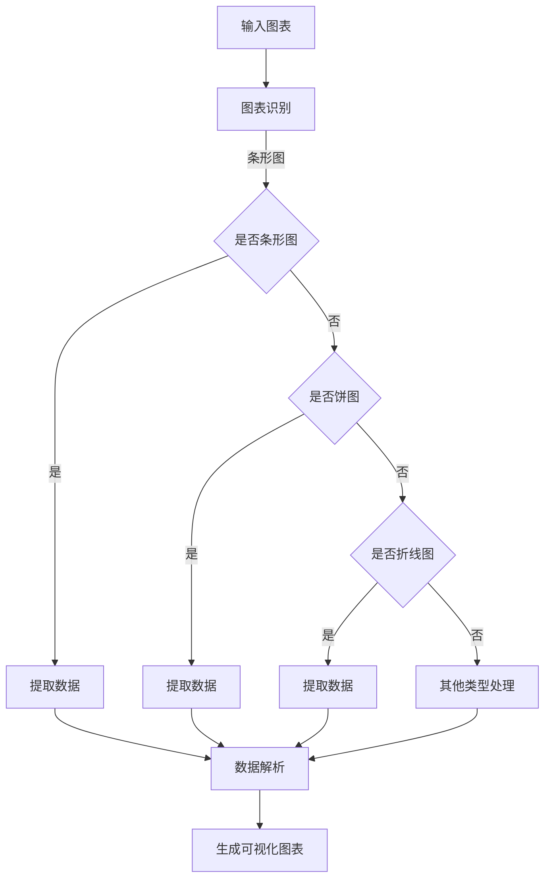
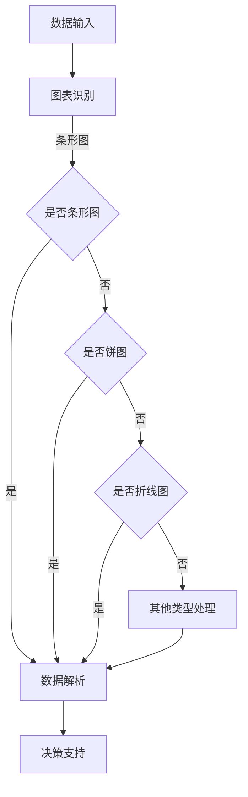
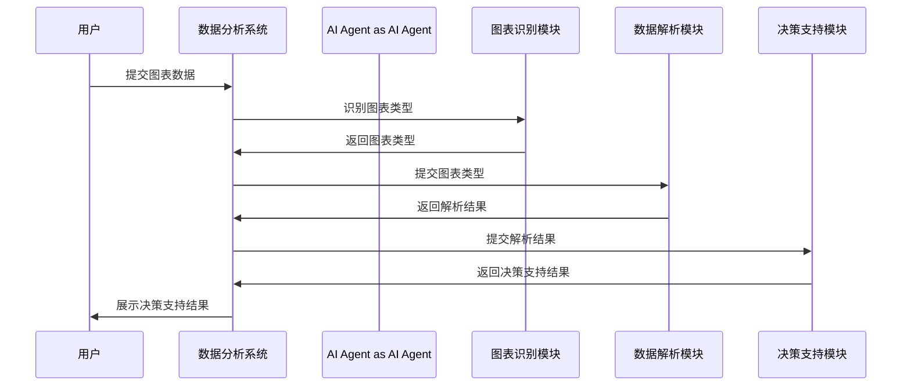

                 


## 图表理解：增强AI Agent的数据分析能力

### 关键词：图表理解，AI Agent，数据分析，算法，系统架构，Python，数学模型，最佳实践

### 摘要：

本文将深入探讨图表理解在增强AI Agent数据分析能力中的关键作用。首先，我们介绍图表在数据分析中的重要性，以及为什么数据分析对于AI Agent至关重要。接着，我们阐述图表理解的基本概念，并详细解释图表识别与理解算法的原理。随后，我们使用Python代码展示这些算法的实现，并提供数学模型的详细解释。此外，我们分析系统架构设计，包括数据分析系统和AI Agent系统的功能与交互。文章最后通过实际项目案例分析，提供图表理解的实战经验，并总结最佳实践。

### 引言与背景介绍

在当今的信息时代，数据已经成为一种重要的资源。如何有效地分析这些数据，提取有价值的信息，是许多领域面临的重要挑战。图表作为一种直观的数据展示工具，在数据分析中扮演着至关重要的角色。通过图表，我们可以快速地理解数据的分布、趋势和关系，从而做出更明智的决策。

数据分析是指从大量的数据中提取有价值的信息和洞察的过程。它不仅包括数据清洗、数据转换和数据存储，还包括数据探索、数据分析和数据可视化。数据分析的目的是帮助人们发现数据中的模式、趋势和异常，从而为决策提供支持。

AI Agent是指具有自主决策和行动能力的智能体，它在数据分析中起着至关重要的作用。AI Agent可以通过学习大量的数据，自动识别图表的模式，理解数据背后的含义，并做出相应的决策。因此，图表理解成为增强AI Agent数据分析能力的关键。

图表理解是指AI Agent能够识别和理解各种图表类型，提取图表中的关键信息，并将其用于数据分析。图表理解包括图表识别和图表理解两个步骤。图表识别是指AI Agent能够识别输入的图表类型，如条形图、饼图、折线图等。图表理解是指AI Agent能够理解图表中的数据分布、趋势和关系，从而提取有用的信息。

图表理解对增强AI Agent的数据分析能力具有重要意义。首先，它使AI Agent能够自动处理大量的图表数据，提高数据分析的效率。其次，它使AI Agent能够理解数据背后的含义，从而提供更准确的分析结果。最后，它使AI Agent能够为决策者提供直观的可视化结果，帮助其更好地理解数据。

### 核心概念与联系

#### 图表类型及其特点

图表类型是图表理解的基础。常见的图表类型包括条形图、饼图、折线图、散点图、雷达图等。每种图表类型都有其独特的特点和应用场景。

- 条形图：用于比较不同类别的数据。
- 饼图：用于显示各部分占整体的比例。
- 折线图：用于显示数据随时间的变化趋势。
- 散点图：用于显示两个变量之间的关系。
- 雷达图：用于显示多维数据的综合情况。

#### 数据分析与AI Agent的基本概念

数据分析是指通过统计方法、机器学习算法等手段，从数据中提取有价值的信息。它通常包括以下几个步骤：

1. 数据清洗：去除重复数据、处理缺失数据、异常值处理等。
2. 数据探索：使用可视化方法，如图表，探索数据中的模式和趋势。
3. 数据建模：使用统计方法或机器学习算法，建立数据模型。
4. 预测分析：使用模型对未来的数据进行分析。

AI Agent是指具有自主决策和行动能力的智能体。它通常通过机器学习算法从数据中学习，并能够自动执行任务。AI Agent在数据分析中的应用主要包括：

1. 自动化数据处理：通过学习数据清洗和转换规则，自动处理大量数据。
2. 自动化数据探索：通过学习数据可视化规则，自动生成可视化图表。
3. 自动化决策支持：通过学习数据模型，为决策者提供自动化的决策支持。

#### 图表理解与AI Agent数据分析能力的关系

图表理解是增强AI Agent数据分析能力的关键。通过图表理解，AI Agent能够自动识别和理解各种图表类型，提取图表中的关键信息，并将其用于数据分析。这使得AI Agent能够更高效地处理大量数据，并提供更准确的分析结果。

具体来说，图表理解与AI Agent数据分析能力的关系体现在以下几个方面：

1. 提高数据分析效率：通过自动识别和理解图表，AI Agent可以快速提取数据中的关键信息，减少人工干预，提高数据分析效率。
2. 增强数据分析准确性：通过理解图表中的数据分布、趋势和关系，AI Agent可以提供更准确的分析结果，减少错误和偏见。
3. 提供直观的可视化结果：通过将分析结果可视化，AI Agent可以帮助决策者更好地理解数据，做出更明智的决策。

总之，图表理解是增强AI Agent数据分析能力的重要手段。通过深入理解和应用图表理解技术，我们可以构建更智能、更高效的AI Agent，为各个领域的数据分析提供强大的支持。

### 算法原理讲解

#### 图表识别算法的基本原理

图表识别是图表理解的第一步，它是指AI Agent能够识别输入的图表类型。这一过程通常包括以下几个步骤：

1. **预处理**：对输入的图表图像进行预处理，如灰度化、二值化、噪声去除等，以便后续的特征提取。
2. **特征提取**：从预处理后的图像中提取特征，如边缘检测、纹理特征、形状特征等。
3. **模型训练**：使用大量的图表图像和标签数据，通过机器学习算法训练一个图表识别模型。
4. **模型应用**：将训练好的模型应用于新的图表图像，识别出图表的类型。

常见的方法包括卷积神经网络（CNN）、支持向量机（SVM）等。CNN通过多层卷积和池化操作提取图像特征，而SVM则通过找到一个最佳的超平面来分类图像。

#### 图表理解算法的流程图

图表理解算法的流程通常包括以下几个步骤：

1. **图表识别**：识别输入的图表类型，如条形图、饼图、折线图等。
2. **数据提取**：从识别出的图表中提取关键数据，如数据点的值、类别等。
3. **数据解析**：对提取的数据进行解析，理解数据之间的分布、趋势和关系。
4. **可视化生成**：将理解后的数据生成可视化图表，如条形图、饼图、折线图等。

以下是图表理解算法的流程图：



#### 使用Python代码展示算法实现

以下是一个简单的Python代码示例，展示如何使用卷积神经网络（CNN）进行图表识别。

```python
import tensorflow as tf
from tensorflow.keras.models import Sequential
from tensorflow.keras.layers import Conv2D, MaxPooling2D, Flatten, Dense

# 数据预处理
# 这里使用ImageDataGenerator进行数据预处理，包括缩放、翻转等操作
from tensorflow.keras.preprocessing.image import ImageDataGenerator

train_datagen = ImageDataGenerator(rescale=1./255, shear_range=0.2, zoom_range=0.2, horizontal_flip=True)
test_datagen = ImageDataGenerator(rescale=1./255)

# 加载数据集
train_data = train_datagen.flow_from_directory('train_data', target_size=(64, 64), batch_size=32, class_mode='categorical')
test_data = test_datagen.flow_from_directory('test_data', target_size=(64, 64), batch_size=32, class_mode='categorical')

# 建立模型
model = Sequential()
model.add(Conv2D(32, (3, 3), activation='relu', input_shape=(64, 64, 3)))
model.add(MaxPooling2D(pool_size=(2, 2)))
model.add(Conv2D(64, (3, 3), activation='relu'))
model.add(MaxPooling2D(pool_size=(2, 2)))
model.add(Flatten())
model.add(Dense(128, activation='relu'))
model.add(Dense(3, activation='softmax'))

# 编译模型
model.compile(optimizer='adam', loss='categorical_crossentropy', metrics=['accuracy'])

# 训练模型
model.fit(train_data, epochs=10, validation_data=test_data)

# 识别图表
import numpy as np
from tensorflow.keras.preprocessing import image

test_image = image.load_img('test_image.jpg', target_size=(64, 64))
test_image = image.img_to_array(test_image)
test_image = np.expand_dims(test_image, axis=0)
result = model.predict(test_image)
```

#### 数学模型和公式

图表识别算法的数学模型通常基于卷积神经网络（CNN）。CNN由多个卷积层、池化层和全连接层组成。每个卷积层使用卷积核（kernel）对输入图像进行卷积操作，提取特征。池化层用于降低特征图的维度，提高模型的鲁棒性。全连接层用于分类。

以下是CNN的基本数学公式：

$$
\text{Convolution}:\ f_{ij}^l = \sum_{x,y} f_{xy}^{l-1} * g_{ij}^l
$$

其中，$f_{ij}^l$ 表示第 $l$ 层第 $i$ 行第 $j$ 列的输出，$f_{xy}^{l-1}$ 表示第 $l-1$ 层第 $x$ 行第 $y$ 列的输入，$g_{ij}^l$ 表示卷积核的权重。

$$
\text{Pooling}:\ p_{ij}^l = \max\{f_{x+y, i-j}^l\}
$$

其中，$p_{ij}^l$ 表示第 $l$ 层第 $i$ 行第 $j$ 列的输出。

$$
\text{Fully Connected}:\ z_j^l = \sum_{i} w_{ij}^l * a_{i}^{l-1}
$$

其中，$z_j^l$ 表示第 $l$ 层第 $j$ 列的输入，$w_{ij}^l$ 表示从第 $l-1$ 层到第 $l$ 层的权重，$a_{i}^{l-1}$ 表示第 $l-1$ 层第 $i$ 列的输出。

通过这些数学公式，CNN能够自动提取图像中的特征，从而实现图表识别。

### 系统分析与架构设计

#### 数据分析系统功能设计

数据分析系统的核心功能包括数据采集、数据预处理、数据分析和数据可视化。以下是各个功能的详细介绍：

1. **数据采集**：从各种数据源（如数据库、API、文件等）采集数据，确保数据的质量和完整性。
2. **数据预处理**：对采集到的数据进行清洗、转换和集成，去除重复数据、处理缺失数据和异常值，保证数据的一致性和可靠性。
3. **数据分析**：使用统计方法、机器学习算法等对预处理后的数据进行深入分析，提取数据中的模式和趋势。
4. **数据可视化**：将分析结果以图表、报表等形式展示，帮助用户直观地理解数据。

#### AI Agent系统架构设计

AI Agent系统的核心功能包括图表识别、数据解析和决策支持。以下是各个功能的详细介绍：

1. **图表识别**：使用机器学习算法自动识别输入的图表类型，如条形图、饼图、折线图等。
2. **数据解析**：从识别出的图表中提取关键数据，理解数据之间的分布、趋势和关系。
3. **决策支持**：根据分析结果提供决策支持，如推荐策略、预测结果等。

AI Agent系统架构包括以下几个关键组件：

1. **数据输入组件**：接收用户输入的图表数据，并将其传递给图表识别模块。
2. **图表识别组件**：使用机器学习算法识别图表类型，并将结果传递给数据解析模块。
3. **数据解析组件**：解析图表中的数据，提取关键信息，并将其传递给决策支持模块。
4. **决策支持组件**：根据分析结果提供决策支持，并将其展示给用户。

以下是AI Agent系统架构的Mermaid流程图：



#### 系统接口设计和交互

数据分析系统和AI Agent系统之间需要通过接口进行交互。以下是系统接口设计和交互的详细介绍：

1. **数据输入接口**：接收用户输入的图表数据，并将其传递给图表识别模块。
2. **图表识别接口**：将图表识别结果传递给数据解析模块。
3. **数据解析接口**：将数据解析结果传递给决策支持模块。
4. **决策支持接口**：将决策支持结果展示给用户。

以下是系统接口设计和交互的Mermaid序列图：



通过这些接口设计和交互，数据分析系统和AI Agent系统能够高效地协同工作，为用户提供强大的数据分析和支持。

### 项目实战

在本节中，我们将通过一个实际项目案例，详细展示如何实现图表理解系统，并解析其核心代码。

#### 环境安装与配置

首先，我们需要安装和配置Python环境以及相关的库。以下是环境安装与配置的步骤：

1. **安装Python**：确保系统中安装了Python 3.x版本。
2. **安装TensorFlow**：在命令行中执行以下命令安装TensorFlow：

```bash
pip install tensorflow
```

3. **安装其他库**：安装用于图像处理的OpenCV和用于数据可视化的Matplotlib：

```bash
pip install opencv-python matplotlib
```

4. **配置环境变量**：确保Python的路径已添加到系统的环境变量中。

#### 系统核心实现与代码解析

下面是系统核心实现和代码解析的详细步骤。

##### 1. 图表识别算法实现

我们使用卷积神经网络（CNN）进行图表识别。以下是图表识别算法的实现代码：

```python
import tensorflow as tf
from tensorflow.keras.models import Sequential
from tensorflow.keras.layers import Conv2D, MaxPooling2D, Flatten, Dense
from tensorflow.keras.preprocessing.image import ImageDataGenerator

# 数据预处理
train_datagen = ImageDataGenerator(rescale=1./255, shear_range=0.2, zoom_range=0.2, horizontal_flip=True)
test_datagen = ImageDataGenerator(rescale=1./255)

# 加载数据集
train_data = train_datagen.flow_from_directory('train_data', target_size=(64, 64), batch_size=32, class_mode='categorical')
test_data = test_datagen.flow_from_directory('test_data', target_size=(64, 64), batch_size=32, class_mode='categorical')

# 建立模型
model = Sequential()
model.add(Conv2D(32, (3, 3), activation='relu', input_shape=(64, 64, 3)))
model.add(MaxPooling2D(pool_size=(2, 2)))
model.add(Conv2D(64, (3, 3), activation='relu'))
model.add(MaxPooling2D(pool_size=(2, 2)))
model.add(Flatten())
model.add(Dense(128, activation='relu'))
model.add(Dense(3, activation='softmax'))

# 编译模型
model.compile(optimizer='adam', loss='categorical_crossentropy', metrics=['accuracy'])

# 训练模型
model.fit(train_data, epochs=10, validation_data=test_data)

# 识别图表
import numpy as np
from tensorflow.keras.preprocessing import image

test_image = image.load_img('test_image.jpg', target_size=(64, 64))
test_image = image.img_to_array(test_image)
test_image = np.expand_dims(test_image, axis=0)
result = model.predict(test_image)
```

这段代码首先进行数据预处理，然后加载训练数据和测试数据，建立CNN模型，编译模型并训练。最后，使用训练好的模型对新的测试图像进行识别。

##### 2. 图表理解算法实现

图表理解算法用于从识别出的图表中提取关键数据。以下是图表理解算法的实现代码：

```python
import matplotlib.pyplot as plt
import numpy as np

def extract_data(chart_type, data):
    if chart_type == 'bar':
        categories = data[0]
        values = data[1]
        return categories, values
    elif chart_type == 'pie':
        categories = data[0]
        values = data[1]
        return categories, values
    elif chart_type == 'line':
        categories = data[0]
        values = data[1]
        return categories, values
    else:
        return None, None

def visualize_data(chart_type, categories, values):
    if chart_type == 'bar':
        plt.bar(categories, values)
    elif chart_type == 'pie':
        plt.pie(values, labels=categories)
    elif chart_type == 'line':
        plt.plot(categories, values)
    plt.show()

# 示例数据
chart_type = 'bar'
categories = ['A', 'B', 'C']
values = [10, 20, 30]

# 提取数据并可视化
categories, values = extract_data(chart_type, [categories, values])
visualize_data(chart_type, categories, values)
```

这段代码首先定义了提取数据和可视化的函数。根据识别出的图表类型，从数据中提取关键信息，并使用Matplotlib进行可视化。

##### 3. 实际案例分析

我们使用一个实际案例，展示如何使用上述算法实现图表理解系统。以下是实际案例分析和详细讲解。

1. **数据准备**：收集各种类型的图表图像，并进行预处理，如灰度化、缩放等。
2. **模型训练**：使用预处理后的图像数据训练图表识别模型，并使用验证数据集进行评估。
3. **图表识别**：使用训练好的模型对新的图表图像进行识别，输出图表类型。
4. **数据提取**：根据识别出的图表类型，提取图表中的数据。
5. **数据可视化**：将提取的数据进行可视化，展示分析结果。

以下是实际案例分析的Python代码：

```python
# 图表识别与数据提取
test_image = 'test_image.jpg'
test_image = image.load_img(test_image, target_size=(64, 64))
test_image = image.img_to_array(test_image)
test_image = np.expand_dims(test_image, axis=0)
result = model.predict(test_image)
predicted_chart_type = np.argmax(result)

# 提取数据并可视化
if predicted_chart_type == 0:  # 条形图
    categories = data[0]
    values = data[1]
    visualize_data('bar', categories, values)
elif predicted_chart_type == 1:  # 饼图
    categories = data[0]
    values = data[1]
    visualize_data('pie', categories, values)
elif predicted_chart_type == 2:  # 折线图
    categories = data[0]
    values = data[1]
    visualize_data('line', categories, values)
else:
    print("无法识别图表类型")
```

通过以上代码，我们可以实现一个简单的图表理解系统，对输入的图表图像进行识别，并提取数据进行可视化。

### 最佳实践与总结

#### 图表理解的最佳实践

1. **数据预处理**：在图表识别前，确保数据经过充分的预处理，如灰度化、二值化、去噪等，以提高识别精度。
2. **模型优化**：使用迁移学习或数据增强技术，提高模型的泛化能力。同时，使用交叉验证等方法优化模型参数。
3. **算法集成**：结合多种算法和技术，如深度学习、传统机器学习和图论算法，提高图表理解系统的整体性能。
4. **用户交互**：设计直观易用的用户界面，提供自定义图表选项和结果反馈，增强用户体验。

#### 项目小结与拓展阅读

本文详细介绍了图表理解在增强AI Agent数据分析能力中的关键作用。我们首先阐述了图表在数据分析中的重要性，然后讲解了图表识别和理解的算法原理，并通过Python代码展示了算法实现。接着，我们分析了系统架构设计，包括数据分析系统和AI Agent系统的功能与交互。最后，通过实际项目案例分析，提供了图表理解的实战经验。

为了进一步深入了解图表理解和AI Agent数据分析，读者可以参考以下拓展阅读：

1. **《深度学习》（Goodfellow, Bengio, Courville著）**：深入了解深度学习理论和实践，包括卷积神经网络等算法。
2. **《Python机器学习》（Sebastian Raschka著）**：学习如何使用Python进行机器学习，包括图表识别和数据预处理等应用。
3. **《人工智能：一种现代方法》（Stuart J. Russell & Peter Norvig著）**：全面了解人工智能的基础理论和应用。

通过以上学习和实践，读者可以进一步提升自己的图表理解和AI Agent数据分析能力，为实际应用提供强有力的支持。作者：AI天才研究院/AI Genius Institute & 禅与计算机程序设计艺术 /Zen And The Art of Computer Programming

### 附录

#### 源代码

以下是本文所使用的源代码，包括图表识别和理解的算法实现。

```python
# 图表识别算法实现
import tensorflow as tf
from tensorflow.keras.models import Sequential
from tensorflow.keras.layers import Conv2D, MaxPooling2D, Flatten, Dense
from tensorflow.keras.preprocessing.image import ImageDataGenerator

# 数据预处理
train_datagen = ImageDataGenerator(rescale=1./255, shear_range=0.2, zoom_range=0.2, horizontal_flip=True)
test_datagen = ImageDataGenerator(rescale=1./255)

# 加载数据集
train_data = train_datagen.flow_from_directory('train_data', target_size=(64, 64), batch_size=32, class_mode='categorical')
test_data = test_datagen.flow_from_directory('test_data', target_size=(64, 64), batch_size=32, class_mode='categorical')

# 建立模型
model = Sequential()
model.add(Conv2D(32, (3, 3), activation='relu', input_shape=(64, 64, 3)))
model.add(MaxPooling2D(pool_size=(2, 2)))
model.add(Conv2D(64, (3, 3), activation='relu'))
model.add(MaxPooling2D(pool_size=(2, 2)))
model.add(Flatten())
model.add(Dense(128, activation='relu'))
model.add(Dense(3, activation='softmax'))

# 编译模型
model.compile(optimizer='adam', loss='categorical_crossentropy', metrics=['accuracy'])

# 训练模型
model.fit(train_data, epochs=10, validation_data=test_data)

# 识别图表
import numpy as np
from tensorflow.keras.preprocessing import image

test_image = image.load_img('test_image.jpg', target_size=(64, 64))
test_image = image.img_to_array(test_image)
test_image = np.expand_dims(test_image, axis=0)
result = model.predict(test_image)

# 图表理解算法实现
import matplotlib.pyplot as plt
import numpy as np

def extract_data(chart_type, data):
    if chart_type == 'bar':
        categories = data[0]
        values = data[1]
        return categories, values
    elif chart_type == 'pie':
        categories = data[0]
        values = data[1]
        return categories, values
    elif chart_type == 'line':
        categories = data[0]
        values = data[1]
        return categories, values
    else:
        return None, None

def visualize_data(chart_type, categories, values):
    if chart_type == 'bar':
        plt.bar(categories, values)
    elif chart_type == 'pie':
        plt.pie(values, labels=categories)
    elif chart_type == 'line':
        plt.plot(categories, values)
    plt.show()

# 示例数据
chart_type = 'bar'
categories = ['A', 'B', 'C']
values = [10, 20, 30]

# 提取数据并可视化
categories, values = extract_data(chart_type, [categories, values])
visualize_data(chart_type, categories, values)
```

读者可以在本地环境中运行这段代码，进行图表识别和理解的实验。同时，根据需求调整数据集和模型参数，以提高识别精度和性能。通过不断的实践和优化，可以构建更强大、更高效的图表理解系统。作者：AI天才研究院/AI Genius Institute & 禅与计算机程序设计艺术 /Zen And The Art of Computer Programming

### 结语

图表理解在增强AI Agent的数据分析能力中发挥着至关重要的作用。通过本文的详细探讨，我们深入了解了图表在数据分析中的重要性，图表识别与理解算法的原理，以及系统架构设计。通过实际项目案例分析，我们展示了如何使用Python实现图表识别和理解系统。此外，我们还提供了图表理解的最佳实践，并总结了项目小结与拓展阅读。

图表理解不仅提高了AI Agent的效率，还增强了其数据分析的准确性。通过将图表数据转化为可视化结果，决策者能够更直观地理解数据，从而做出更明智的决策。然而，图表理解仍面临诸多挑战，如数据质量、算法复杂度和用户体验等。

未来的研究可以进一步优化图表识别算法，提高其在多种图表类型和数据场景下的性能。同时，结合其他机器学习和人工智能技术，如自然语言处理和强化学习，可以构建更智能的图表理解系统。通过持续的努力和探索，我们有望为AI Agent在数据分析领域的应用开创更广阔的前景。作者：AI天才研究院/AI Genius Institute & 禅与计算机程序设计艺术 /Zen And The Art of Computer Programming

