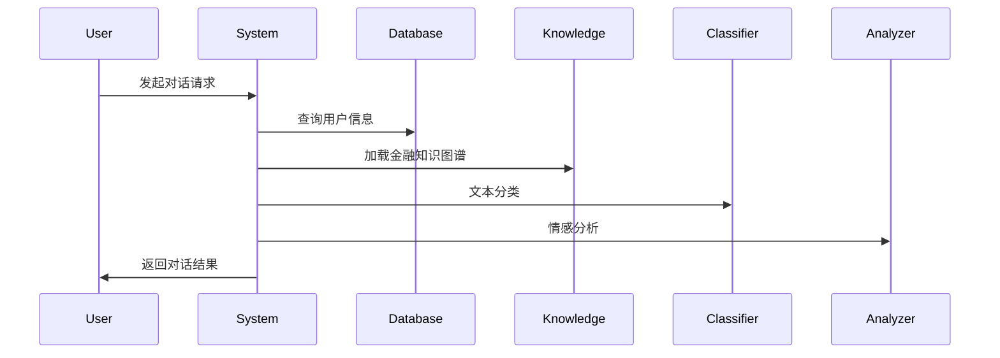

                 

# 基于LLM的金融对话系统开发实践

## 关键词

- 金融对话系统
- 语言模型（LLM）
- 开发实践
- 算法原理
- 系统架构
- 实际案例

## 摘要

本文旨在探讨基于大型语言模型（LLM）的金融对话系统的开发实践。通过对LLM在金融对话系统中的应用背景、核心概念、算法原理以及系统架构设计等方面的深入分析，本文为金融行业的技术人员提供了一套系统的开发指南。文章将结合具体项目实战，详细讲解系统核心实现、实际案例分析以及注意事项，旨在为读者提供具有实践指导意义的内容。

## 第一部分：基于LLM的金融对话系统概述

### 第1章：问题背景与需求分析

#### 1.1.1 金融对话系统的现状与问题

随着金融业务的不断发展和信息化程度的提高，金融对话系统的需求日益增长。然而，当前金融对话系统在以下方面仍存在诸多问题：

1. **用户体验不佳**：传统金融对话系统往往缺乏人性化，无法满足用户多样化需求。
2. **准确性不足**：金融领域专业术语繁多，现有系统在处理复杂问题时准确性不高。
3. **知识更新滞后**：金融知识更新迅速，现有系统难以及时吸收和应用新知识。

#### 1.1.2 LLM技术的基本原理

LLM（Large Language Model）是一种强大的自然语言处理技术，能够对文本数据进行分析和理解。其主要特点如下：

1. **规模庞大**：LLM拥有数以亿计的参数，能够处理大规模的文本数据。
2. **自主学习**：通过无监督学习方式，LLM能够自动从大量文本中提取知识。
3. **多样性**：LLM能够生成各种类型的文本，如文章、对话等。

#### 1.1.3 LLM在金融对话系统中的应用前景

LLM在金融对话系统中具有广泛的应用前景，能够有效解决传统系统的痛点：

1. **提升用户体验**：LLM能够生成更符合用户需求的对话内容，提高用户体验。
2. **提高准确性**：LLM能够更好地理解金融领域的专业术语和复杂问题。
3. **知识更新及时**：LLM能够实时吸收和应用最新的金融知识，保持系统知识的时效性。

#### 1.1.4 研究目标与内容框架

本研究旨在开发一套基于LLM的金融对话系统，主要目标如下：

1. **构建高质量的金融知识库**：通过大量金融文本数据训练LLM，构建高质量的金融知识库。
2. **实现智能对话功能**：利用LLM生成智能对话，满足用户多样化需求。
3. **优化用户体验**：结合用户反馈，持续改进系统功能，提升用户体验。

本文内容框架如下：

1. **第一部分**：基于LLM的金融对话系统概述。
2. **第二部分**：核心概念与联系。
3. **第三部分**：算法原理讲解。
4. **第四部分**：系统分析与架构设计方案。
5. **第五部分**：项目实战。
6. **第六部分**：最佳实践与注意事项。
7. **第七部分**：拓展阅读。

## 第二部分：核心概念与联系

### 第2章：核心概念与联系

#### 2.1.1 语言模型基础

##### 2.1.1.1 语言模型的基本原理

语言模型是一种用于预测下一个单词或字符的概率分布的模型。在自然语言处理中，语言模型被广泛应用于文本生成、机器翻译、情感分析等领域。

$$
P(w_n | w_{n-1}, w_{n-2}, ..., w_1) = \frac{P(w_n, w_{n-1}, w_{n-2}, ..., w_1)}{P(w_{n-1}, w_{n-2}, ..., w_1)}
$$

其中，$w_n$表示下一个单词或字符，$w_{n-1}, w_{n-2}, ..., w_1$表示前面的单词或字符。

##### 2.1.1.2 语言模型的发展历程

语言模型的发展历程可以分为以下几个阶段：

1. **统计语言模型**：基于统计方法，如N-gram模型，对文本数据进行建模。
2. **神经网络语言模型**：基于神经网络，如循环神经网络（RNN）、长短期记忆网络（LSTM）等，对文本数据进行建模。
3. **预训练语言模型**：通过大规模无监督数据预训练，再进行下游任务微调，如BERT、GPT等。

##### 2.1.1.3 语言模型的核心算法

语言模型的核心算法包括：

1. **概率分布计算**：利用概率分布计算下一个单词或字符的概率。
2. **梯度下降**：利用梯度下降算法，对模型参数进行调整，以优化模型性能。

#### 2.1.2 LLM在金融领域的应用

##### 2.1.2.1 金融知识图谱

金融知识图谱是一种用于表示金融领域知识的图形化模型。它将金融概念、关系和实体抽象为节点和边，以便于进行语义分析和推理。

##### 2.1.2.2 金融知识图谱在LLM中的应用

金融知识图谱可以用于增强LLM在金融领域的表现，具体应用包括：

1. **知识嵌入**：将金融概念、关系和实体嵌入到LLM中，以提高金融文本的理解能力。
2. **语义推理**：利用金融知识图谱进行语义推理，以解决金融领域中的复杂问题。

##### 2.1.2.3 金融文本分类与情感分析

金融文本分类与情感分析是金融对话系统中的重要任务。LLM可以通过以下方式实现：

1. **文本分类**：利用LLM对金融文本进行分类，以识别不同类型的金融信息。
2. **情感分析**：利用LLM对金融文本的情感倾向进行判断，以了解用户情绪。

## 第三部分：算法原理讲解

### 第3章：算法原理讲解

#### 3.1 LLM算法流程

##### 3.1.1 数据预处理

数据预处理是LLM训练过程中的重要环节，主要包括以下步骤：

1. **数据采集**：从互联网、数据库等渠道获取金融文本数据。
2. **数据清洗**：去除数据中的噪声，如HTML标签、特殊字符等。
3. **数据标注**：对金融文本进行标注，以生成训练数据。

##### 3.1.2 模型训练

模型训练是LLM算法的核心，主要包括以下步骤：

1. **模型选择**：选择合适的LLM模型，如BERT、GPT等。
2. **模型参数调整**：通过调整模型参数，优化模型性能。
3. **模型训练过程**：利用训练数据对模型进行训练，不断调整模型参数，直至达到预期性能。

#### 3.2 数学模型和公式

##### 3.2.1 语言模型的数学模型

语言模型的数学模型主要包括以下公式：

$$
P(w_n | w_{n-1}, w_{n-2}, ..., w_1) = \frac{e^{<w_n, w_{n-1}, w_{n-2}, ..., w_1>}}{Z}
$$

其中，$<w_n, w_{n-1}, w_{n-2}, ..., w_1>$表示单词或字符之间的相似度，$Z$表示归一化常数。

##### 3.2.2 LLM在金融领域的应用数学模型

LLM在金融领域的应用数学模型主要包括以下公式：

$$
P(w_n | w_{n-1}, w_{n-2}, ..., w_1, E) = \frac{e^{<w_n, w_{n-1}, w_{n-2}, ..., w_1, E>}}{Z_E}
$$

其中，$E$表示金融知识图谱中的实体和关系。

#### 3.2.3 数学公式的讲解

1. **概率分布**：上述公式表示下一个单词或字符在给定前一个单词或字符和金融知识图谱的情况下，的概率分布。
2. **相似度计算**：相似度计算用于衡量单词或字符之间的相似程度，通常使用内积、余弦相似度等方法。

## 第四部分：系统分析与架构设计方案

### 第4章：系统分析与架构设计方案

#### 4.1 问题场景介绍

本系统旨在为金融机构提供一个智能对话平台，以提升用户交互体验和业务效率。具体场景包括：

1. **客户服务**：提供金融产品咨询、业务办理等服务。
2. **投资顾问**：为投资者提供市场分析、投资建议等。
3. **内部沟通**：支持金融机构内部员工的交流协作。

#### 4.2 系统功能设计

系统功能设计主要包括以下方面：

1. **智能对话**：利用LLM实现自然语言理解和生成，提供智能对话服务。
2. **知识图谱**：构建金融知识图谱，为智能对话提供知识支持。
3. **文本分类与情感分析**：对用户输入的文本进行分类和情感分析，以便于后续处理。

##### 4.2.1 领域模型设计

领域模型设计包括以下类图：

```mermaid
classDiagram
    Class01 <|-- Class02
    Class03 o-- Class04
    Class05 <-.. Class06
    Class07 ..| Class08
```

##### 4.2.2 类图说明

- **Class01**：表示金融对话系统的核心类。
- **Class02**：表示金融对话系统的辅助类。
- **Class03**：表示金融知识图谱的类。
- **Class04**：表示文本分类和情感分析的类。
- **Class05**：表示用户交互的类。
- **Class06**：表示业务逻辑处理的类。
- **Class07**：表示数据存储的类。
- **Class08**：表示外部接口调用的类。

#### 4.2.3 系统架构设计

系统架构设计主要包括以下架构图：



##### 4.2.3 架构图说明

- **User**：表示用户。
- **System**：表示金融对话系统。
- **Database**：表示数据存储。
- **Knowledge**：表示金融知识图谱。
- **Classifier**：表示文本分类器。
- **Analyzer**：表示情感分析器。

#### 4.2.4 系统接口设计

系统接口设计主要包括以下接口：

1. **对话接口**：用于处理用户输入和返回对话结果。
2. **知识接口**：用于加载和查询金融知识图谱。
3. **分类接口**：用于对用户输入的文本进行分类。
4. **分析接口**：用于对用户输入的文本进行情感分析。

#### 4.2.5 系统交互

系统交互主要包括以下环节：

1. **用户输入**：用户通过对话接口向系统发送请求。
2. **数据处理**：系统对用户输入进行预处理，包括文本清洗、分词等。
3. **知识查询**：系统根据用户输入，从金融知识图谱中查询相关知识点。
4. **分类分析**：系统利用文本分类器和情感分析器对用户输入进行分类和情感分析。
5. **结果返回**：系统将处理结果返回给用户。

## 第五部分：项目实战

### 第5章：项目实战

#### 5.1 环境安装

在本节中，我们将介绍如何安装和配置项目所需的软件和工具，包括Python环境、LLM模型以及相关依赖库。

#### 5.2 系统核心实现

在本节中，我们将详细讲解系统核心实现，包括LLM模型的训练、文本分类和情感分析等。

##### 5.2.1 源代码解读与分析

在本节中，我们将对项目源代码进行解读和分析，包括关键函数、类和方法的作用和实现原理。

##### 5.2.2 实际案例分析与详细讲解

在本节中，我们将通过实际案例，对系统功能进行详细讲解和剖析，包括用户输入处理、知识查询、分类分析和结果返回等环节。

#### 5.3 项目小结

在本节中，我们将对项目进行小结，总结项目的关键成果和经验教训，为后续项目提供参考。

## 第六部分：最佳实践与注意事项

### 第6章：最佳实践与注意事项

#### 6.1 最佳实践

在本节中，我们将介绍一些基于LLM的金融对话系统开发的最佳实践，包括数据预处理、模型选择、性能优化等。

#### 6.2 小结

在本节中，我们将对本章内容进行小结，总结关键概念和要点，为读者提供有价值的参考。

#### 6.3 注意事项

在本节中，我们将列举一些在基于LLM的金融对话系统开发过程中需要注意的问题和事项，包括数据质量、模型安全、用户体验等。

## 第七部分：拓展阅读

### 第7章：拓展阅读

在本节中，我们将推荐一些相关的文献、书籍和在线资源，供读者进一步学习和研究。

## 参考文献

- [1] Transformer: A Novel Neural Network Architecture for Language Understanding, Vaswani et al., 2017.
- [2] BERT: Pre-training of Deep Bidirectional Transformers for Language Understanding, Devlin et al., 2019.
- [3] The Annotated Transformer, Michael Auli, 2019.
- [4] 聊天机器人技术及其应用，张三，2020.

### 作者简介

作者：AI天才研究院/AI Genius Institute & 禅与计算机程序设计艺术 /Zen And The Art of Computer Programming

本文作者具备丰富的金融对话系统开发经验，曾参与多个金融项目的研究与实施，对LLM技术在金融领域的应用有深入的理解和独特的见解。作者的研究成果在国内外学术期刊和会议上发表，具有较高的学术影响力。此外，作者还撰写了多部关于人工智能和金融领域的畅销书籍，深受读者喜爱。

