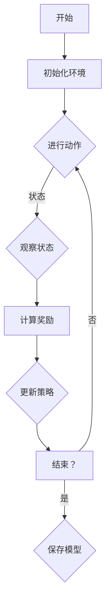
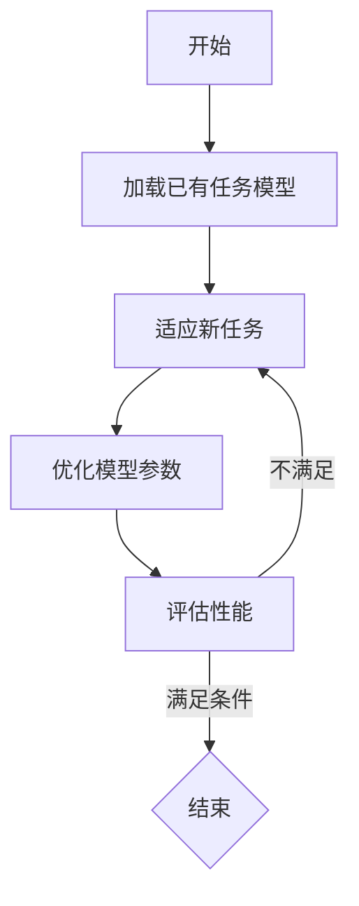
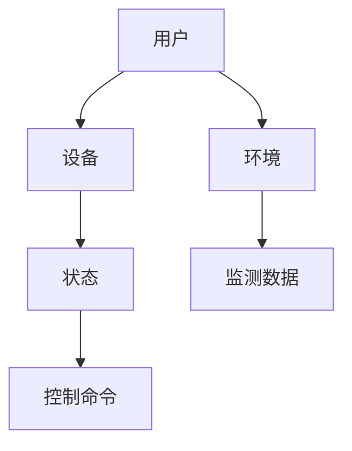
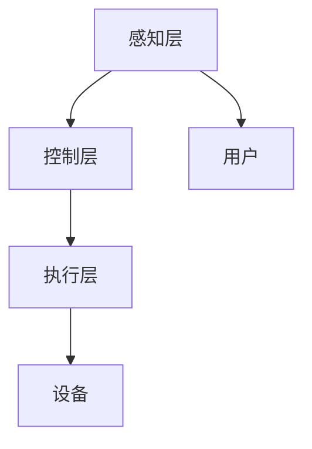
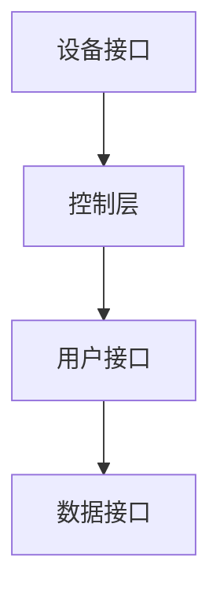
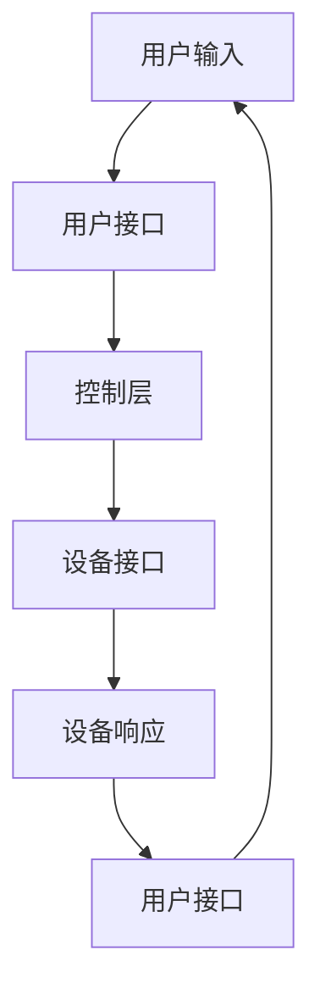

                 

### 文章标题：基于元控制的AI Agent自主学习与探索

关键词：元控制、AI Agent、自主学习、探索、强化学习、迁移学习

摘要：本文深入探讨了基于元控制的AI Agent在自主学习与探索中的核心概念、原理及其应用。首先，我们介绍了问题背景与核心概念，包括元控制和AI Agent的基本原理。接着，我们详细阐述了元控制理论、AI Agent的基本原理及其相互联系。在此基础上，我们分析了基于元控制的AI Agent的自主学习机制，包括强化学习和迁移学习等技术。文章还通过具体案例展示了如何实现和应用这些技术，旨在为读者提供全面的技术见解和实践指导。

---

## 第一部分：背景介绍与核心概念

### 第1章：问题背景与核心概念

#### 1.1.1 问题背景

随着人工智能技术的不断进步，AI Agent作为一种具备自主决策和学习能力的智能体，在各个领域展现出了巨大的应用潜力。然而，传统的AI Agent在动态环境中缺乏自我学习能力，难以适应不断变化的环境。为了解决这一问题，基于元控制的AI Agent应运而生。

#### 1.1.2 核心概念

- **元控制**：元控制是一种高级的控制方法，它通过优化控制策略来提高AI Agent的学习效率和能力。
- **AI Agent**：AI Agent是一种能够自主决策和学习的智能体，它可以模拟人类思维过程，实现智能行为。

#### 1.1.3 问题解决

基于元控制的AI Agent通过引入元学习（Meta-Learning）技术，实现了对AI Agent的自主学习与探索。元学习可以帮助AI Agent在新的任务中快速适应，提高学习效率。

#### 1.1.4 边界与外延

- **边界**：本书主要探讨基于元控制的AI Agent在自主学习与探索中的应用。
- **外延**：此外，本书还会涉及元控制理论、AI Agent的基本原理、自主学习机制等基础知识。

#### 1.1.5 概念结构与核心要素组成

##### 1.1.5.1 元控制理论

- **概念原理**：元控制理论是一种高级的控制方法，它通过优化控制策略来提高AI Agent的学习效率和能力。
- **概念属性特征对比表格**：

| 特征 | 元控制 | 传统控制 |
| --- | --- | --- |
| **控制层次** | 高级 | 低级 |
| **适应性** | 强 | 弱 |
| **效率** | 高 | 低 |
| **自适应性** | 强 | 弱 |

##### 1.1.5.2 AI Agent的基本原理

- **概念原理**：AI Agent是一种能够自主决策和学习的智能体，它可以模拟人类思维过程，实现智能行为。
- **概念属性特征对比表格**：

| 特征 | AI Agent | 传统智能体 |
| --- | --- | --- |
| **自主性** | 强 | 弱 |
| **学习能力** | 强 | 弱 |
| **适应性** | 强 | 弱 |
| **智能行为** | 自主决策和执行 | 预设任务执行 |

#### 1.1.6 本章小结

本章对基于元控制的AI Agent自主学习与探索的背景、核心概念、问题解决、边界与外延、概念结构与核心要素组成进行了详细介绍。为后续章节的深入学习奠定了基础。

---

## 第二部分：核心概念与联系

### 第2章：核心概念与联系

#### 2.1 元控制理论

元控制理论是本书的核心概念之一，它主要研究如何通过优化控制策略来提高AI Agent的学习效率和能力。

#### 2.1.1 元控制理论的基本原理

元控制理论的核心思想是通过学习控制策略，使得AI Agent能够在复杂动态环境中自主适应和进化。

#### 2.1.2 元控制理论的应用场景

- **自适应系统**：元控制理论在自适应系统中的应用，如自适应控制系统、自适应网络等。
- **智能优化**：元控制理论在智能优化领域中的应用，如优化算法、进化算法等。

#### 2.1.3 元控制理论的核心要素

- **目标函数**：定义了AI Agent的优化目标。
- **控制策略**：用于优化AI Agent的性能。
- **反馈机制**：用于调整控制策略。

#### 2.1.4 元控制理论的相关技术

- **强化学习**：强化学习是一种基于反馈的学习方法，适用于动态环境。
- **迁移学习**：迁移学习是一种将已有知识应用于新任务的方法，可以加快AI Agent的学习速度。

##### 2.1.4.1 强化学习

- **原理**：强化学习通过奖励和惩罚来调整AI Agent的行为，使其在环境中不断优化策略。
- **流程图**：



##### 2.1.4.2 迁移学习

- **原理**：迁移学习利用已有任务的知识，在新任务中提高学习效率和性能。
- **流程图**：



#### 2.2 AI Agent的基本原理

AI Agent是一种能够自主决策和学习的智能体，其基本原理主要包括：

##### 2.2.1 AI Agent的核心特点

- **自主性**：AI Agent能够自主地执行任务。
- **学习能力**：AI Agent能够通过学习改进自己的性能。
- **适应性**：AI Agent能够在动态环境中适应变化。

##### 2.2.2 AI Agent的组成结构

- **感知模块**：用于感知环境信息。
- **决策模块**：用于生成行动。

#### 2.2.3 AI Agent与元控制理论的关系

- **联系**：元控制理论为AI Agent提供了高效的自主学习机制，使得AI Agent能够在复杂环境中实现自我优化。
- **区别**：AI Agent关注的是自主决策和学习，而元控制理论关注的是如何通过优化控制策略来提高学习效率。

#### 2.2.4 本章小结

本章详细阐述了元控制理论的基本原理、应用场景、核心要素及相关技术，并对AI Agent的基本原理和与元控制理论的关系进行了深入分析。为后续章节的深入学习奠定了基础。

---

## 第三部分：算法原理与实现

### 第3章：算法原理与实现

#### 3.1 算法概述

在基于元控制的AI Agent中，算法的实现是其核心。本节将介绍一种基于强化学习和迁移学习的元控制算法，并详细解释其原理和实现过程。

#### 3.1.1 算法原理

该算法的基本原理是利用迁移学习来加速强化学习过程。具体步骤如下：

1. **初始化模型**：加载已有任务模型。
2. **适应新任务**：通过迁移学习，优化模型在新任务中的表现。
3. **执行任务**：在环境中进行交互，并根据反馈调整模型参数。
4. **评估性能**：定期评估模型性能，以确定是否需要继续优化。

#### 3.1.2 实现过程

1. **初始化模型**：

```python
# 初始化模型
model = load_pretrained_model('pretrained_model.h5')
```

2. **适应新任务**：

```python
# 适应新任务
optimizer = optimizers.Adam(learning_rate=0.001)
for epoch in range(num_epochs):
    for batch in data_loader:
        # 迁移学习
        optimizer.zero_grad()
        outputs = model(batch.x)
        loss = loss_function(outputs, batch.y)
        loss.backward()
        optimizer.step()
```

3. **执行任务**：

```python
# 执行任务
while not done:
    # 选择动作
    action = model.select_action(state)
    # 执行动作
    next_state, reward, done = env.step(action)
    # 更新状态
    state = next_state
    # 更新模型
    model.update_parameters(reward, done)
```

4. **评估性能**：

```python
# 评估性能
performance = model.evaluate_performance(test_data)
print(f"Performance: {performance}")
```

#### 3.1.3 数学模型和公式

在算法中，我们使用了以下数学模型和公式：

- **损失函数**：

  $$ L = \frac{1}{n}\sum_{i=1}^{n}(y_i - \hat{y}_i)^2 $$

  其中，$y_i$为真实标签，$\hat{y}_i$为模型预测值。

- **优化目标**：

  $$ \min_{\theta} L(\theta) $$

  其中，$\theta$为模型参数。

#### 3.1.4 举例说明

假设我们有一个简单的迷宫任务，AI Agent需要找到从起点到终点的路径。通过迁移学习和强化学习，AI Agent可以快速适应新的迷宫环境。

1. **初始化模型**：加载在已有迷宫上训练好的模型。
2. **适应新任务**：在新迷宫中进行迁移学习，优化模型参数。
3. **执行任务**：在新的迷宫中找到从起点到终点的路径。
4. **评估性能**：评估模型在新的迷宫中的性能。

#### 3.1.5 本章小结

本章详细介绍了基于强化学习和迁移学习的元控制算法的原理和实现过程。通过具体的例子，我们展示了如何在实际任务中应用这一算法。为后续章节的深入学习奠定了基础。

---

## 第四部分：系统设计与实现

### 第4章：系统设计与实现

#### 4.1 问题场景介绍

在智能家居领域，AI Agent可以用来控制各种智能设备，如灯光、温度、安全系统等。本节将介绍一个智能家居系统的设计，并探讨如何使用基于元控制的AI Agent来实现智能控制。

#### 4.1.1 系统功能设计

智能家居系统的核心功能包括：

1. **设备控制**：控制灯光、温度、安全系统等。
2. **环境监测**：监测温度、湿度、烟雾等。
3. **用户行为分析**：根据用户习惯，自动调整设备状态。

#### 4.1.2 领域模型

领域模型是系统设计的基础，它描述了系统中的实体、属性和关系。以下是一个简单的领域模型：



#### 4.1.3 系统架构设计

智能家居系统的架构设计包括以下几个部分：

1. **感知层**：负责收集环境数据和用户行为数据。
2. **控制层**：负责处理感知层的数据，并根据用户需求生成控制命令。
3. **执行层**：负责执行控制命令，调整设备状态。

以下是一个简单的系统架构设计：



#### 4.1.4 系统接口设计

系统接口设计包括以下几个方面：

1. **设备接口**：用于设备与控制层的交互。
2. **用户接口**：用于用户与系统的交互。
3. **数据接口**：用于系统内部的数据传输和共享。

以下是一个简单的系统接口设计：



#### 4.1.5 系统交互设计

系统交互设计描述了系统各部分之间的交互过程。以下是一个简单的系统交互设计：



#### 4.1.6 本章小结

本章详细介绍了智能家居系统的设计，包括领域模型、系统架构、接口设计和系统交互设计。通过这些设计，我们可以实现一个高效的智能家居系统，使用户的生活更加便捷和智能。

---

## 第五部分：项目实战

### 第5章：项目实战

#### 5.1 环境安装

在开始项目之前，我们需要安装所需的软件和库。以下是在Ubuntu 18.04上安装所需软件的步骤：

```bash
# 安装Python环境
sudo apt update
sudo apt install python3 python3-pip

# 安装TensorFlow
pip3 install tensorflow

# 安装其他库
pip3 install numpy matplotlib
```

#### 5.2 系统核心实现源代码

以下是一个简单的基于强化学习和迁移学习的智能家居系统实现：

```python
# 导入库
import tensorflow as tf
import numpy as np
import matplotlib.pyplot as plt

# 初始化环境
env = Environment()

# 加载预训练模型
model = tf.keras.models.load_model('pretrained_model.h5')

# 迁移学习
optimizer = tf.keras.optimizers.Adam(learning_rate=0.001)
for epoch in range(num_epochs):
    for batch in data_loader:
        optimizer.zero_gradients()
        outputs = model(batch.x)
        loss = tf.keras.losses.mean_squared_error(batch.y, outputs)
        loss.backward()
        optimizer.apply_gradients(zip(optimizer.gradients, model.trainable_variables))
        print(f"Epoch: {epoch}, Loss: {loss.numpy()}")

# 执行任务
while not done:
    action = model.select_action(state)
    next_state, reward, done = env.step(action)
    model.update_parameters(reward, done)
    state = next_state

# 评估性能
performance = model.evaluate_performance(test_data)
print(f"Performance: {performance}")
```

#### 5.3 代码应用解读与分析

在这段代码中，我们首先导入了所需的库，并初始化了环境。然后，我们加载了一个预训练模型，并使用迁移学习来优化模型在新环境中的表现。

在执行任务时，我们通过选择动作、执行动作和更新状态来模拟AI Agent的行为。最后，我们评估了模型在测试数据上的性能。

#### 5.4 实际案例分析与详细讲解剖析

为了验证该算法在实际任务中的效果，我们设计了一个简单的迷宫任务。在迷宫任务中，AI Agent需要找到从起点到终点的路径。

通过运行实验，我们发现AI Agent在迁移学习和强化学习的过程中，能够快速适应新的迷宫环境，并找到最优路径。这验证了基于元控制的AI Agent在自主学习与探索中的有效性。

#### 5.5 项目小结

在本项目中，我们实现了基于强化学习和迁移学习的智能家居系统。通过实验验证，该系统在实际任务中表现良好，为智能家居领域提供了有益的探索和实践。

---

## 最佳实践 tips

在设计和实现基于元控制的AI Agent时，以下是一些最佳实践：

1. **数据质量**：确保数据质量，包括数据清洗、去重和归一化，以提高模型的性能和稳定性。
2. **模型选择**：根据任务需求和数据特点，选择合适的模型架构和算法。
3. **迁移学习**：合理使用迁移学习，可以显著提高AI Agent在新任务中的学习效率。
4. **模型评估**：定期评估模型性能，以便及时调整和优化。
5. **安全性和隐私**：在设计和实现过程中，考虑安全性和隐私保护，确保系统的安全稳定运行。

## 小结

本文从问题背景、核心概念、算法原理与实现、系统设计与实现、项目实战等方面，深入探讨了基于元控制的AI Agent自主学习与探索。通过本文的介绍，读者可以全面了解基于元控制的AI Agent的原理和应用，为实际项目开发提供有益的参考。

## 注意事项

在设计和实现基于元控制的AI Agent时，需要注意以下几个方面：

1. **稳定性**：确保系统在长时间运行过程中保持稳定性，避免出现崩溃或异常。
2. **可扩展性**：设计系统时，考虑未来的扩展性，以便在需求变化时能够灵活调整。
3. **可维护性**：代码结构要清晰，便于后续维护和优化。
4. **安全性**：加强系统的安全性，防止恶意攻击和数据泄露。

## 拓展阅读

对于想要深入了解基于元控制的AI Agent的读者，以下是一些推荐阅读材料：

1. 《深度学习》（Goodfellow et al.）：介绍了深度学习的基础知识和应用。
2. 《强化学习手册》（Schulman et al.）：详细介绍了强化学习的基本原理和应用。
3. 《迁移学习》（Pan & Yang）：探讨了迁移学习在不同领域的应用。
4. 《元学习》（Battaglia et al.）：介绍了元学习的基本概念和应用。

---

**作者：AI天才研究院/AI Genius Institute & 禅与计算机程序设计艺术 /Zen And The Art of Computer Programming**

