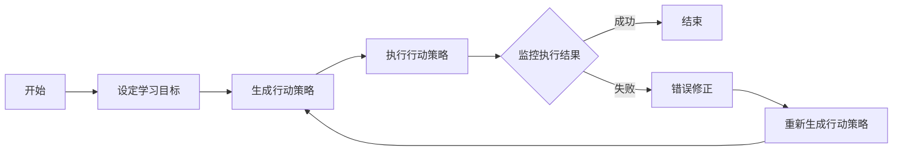

                 


## 《基于元控制的AI Agent自主学习系统》

关键词：AI Agent、元控制、自主学习、算法原理、系统架构、最佳实践

摘要：本文将深入探讨基于元控制的AI Agent自主学习系统的构建，分析其核心概念、算法原理、系统设计与实现，并总结最佳实践与未来展望。通过本文，读者可以全面了解元控制在AI Agent自主学习系统中的重要作用，为未来的研究与应用提供参考。

---

### 前言

#### 目的与意义

本文旨在系统地介绍基于元控制的AI Agent自主学习系统的构建方法，分析其核心概念、算法原理、系统架构和实现细节，旨在为人工智能领域的研究者、工程师和在校学生提供一本全面、深入的技术指南。

元控制在AI Agent自主学习系统中扮演着至关重要的角色。它不仅能够提高AI Agent的自主学习和适应能力，还能够优化其决策过程，从而在复杂环境中实现高效运行。因此，深入研究元控制在AI Agent自主学习系统中的应用，对于推动人工智能技术的发展具有重要意义。

#### 读者对象

本文的目标读者群体主要包括：

1. **AI研究学者**：希望深入了解AI Agent自主学习系统构建方法的研究者。
2. **AI工程师**：负责设计和实现AI Agent自主学习系统的工程师。
3. **在校学生**：对人工智能领域感兴趣，希望深入了解相关技术原理的学生。

#### 本书结构

本文分为四个主要部分：

1. **背景介绍与核心概念**：介绍AI Agent和自主学习系统的基本概念，阐述元控制在其中的作用。
2. **算法原理与实现**：讲解元控制算法的原理、数学模型和具体实现。
3. **系统设计与实现**：分析系统功能设计、架构设计、系统交互和实际案例。
4. **最佳实践与总结**：总结最佳实践、注意事项和未来展望。

通过以上结构，本文将为读者提供一个系统、完整的指南，帮助读者深入了解基于元控制的AI Agent自主学习系统的构建方法。

---

### 第一部分：背景介绍与核心概念

#### 第1章：问题背景与核心概念

##### 1.1 问题背景

随着人工智能技术的快速发展，AI Agent在各个领域的应用越来越广泛。AI Agent是一种具有自主学习和决策能力的智能体，可以在复杂环境中进行任务执行。然而，传统的AI Agent通常依赖于预先定义的规则和模型，缺乏自主学习和适应能力。在复杂多变的现实环境中，这种限制使得AI Agent的应用受到很大制约。

为了解决这一问题，研究人员提出了自主学习系统。自主学习系统是指AI Agent能够通过自我学习、适应和优化，提高其在特定环境中的表现。然而，要实现高效的自主学习，需要一种能够指导学习过程的方法，这就是元控制。

##### 1.2 AI Agent的概念

AI Agent是指具有智能行为、能够在环境中自主执行任务的人工智能实体。AI Agent通常由感知模块、决策模块和执行模块组成。感知模块负责获取环境信息，决策模块根据感知信息生成行动策略，执行模块负责执行具体的行动。

AI Agent在各个领域都有广泛的应用，如自动驾驶、智能家居、医疗诊断等。其自主学习和适应能力对于提高任务执行效率和准确性具有重要意义。

##### 1.3 自主学习系统的需求

在AI Agent的应用中，自主学习系统具有以下几个关键需求：

1. **环境适应性**：AI Agent需要能够适应不同的环境，包括物理环境、社会环境和信息环境。
2. **学习能力**：AI Agent需要具备自我学习能力，通过不断学习和优化，提高任务执行效率。
3. **自主性**：AI Agent需要具备一定的自主性，能够在没有人类干预的情况下进行任务执行。
4. **鲁棒性**：AI Agent需要能够应对环境变化和不确定性，保持稳定的性能。

##### 1.4 元控制在自主学习中的作用

元控制是指对AI Agent的学习过程进行指导和控制的方法。在AI Agent的自主学习系统中，元控制起着至关重要的作用。具体来说，元控制具有以下几个作用：

1. **学习指导**：元控制可以为AI Agent提供学习目标和指导，帮助其明确学习方向。
2. **策略优化**：元控制可以优化AI Agent的行动策略，提高学习效率。
3. **错误修正**：元控制可以帮助AI Agent在出现错误时进行修正，防止学习过程偏离目标。
4. **资源分配**：元控制可以优化AI Agent的资源分配，提高学习过程的效率。

通过元控制，AI Agent可以更加高效地进行自主学习，提高其在复杂环境中的适应能力和决策能力。

#### 1.5 核心概念

##### 1.5.1 元控制理论

元控制理论是研究如何对AI Agent的学习过程进行指导和控制的理论体系。元控制理论包括以下几个核心概念：

1. **元学习目标**：元学习目标是指AI Agent在自主学习过程中追求的目标，包括学习效率、准确性、鲁棒性等。
2. **元控制器**：元控制器是指负责对AI Agent学习过程进行指导和控制的人工智能模块。元控制器通常包括目标设定、策略优化、错误修正等功能。
3. **元学习算法**：元学习算法是指实现元控制的方法，包括基于规则的方法、基于优化算法的方法、基于深度学习的方法等。

##### 1.5.2 AI Agent的自主学习机制

AI Agent的自主学习机制是指AI Agent在自主学习过程中采用的方法和策略。自主学习机制包括以下几个关键组件：

1. **感知模块**：感知模块负责获取环境信息，为AI Agent提供决策依据。
2. **决策模块**：决策模块根据感知模块提供的信息，生成行动策略。
3. **执行模块**：执行模块负责执行决策模块生成的行动策略。
4. **反馈模块**：反馈模块负责收集执行结果，为AI Agent提供学习反馈。
5. **元控制器**：元控制器负责对AI Agent的自主学习过程进行指导和控制。

通过这些组件的协同工作，AI Agent可以实现在复杂环境中的自主学习和适应。

#### 1.6 概念属性特征对比

为了更清晰地理解元控制与常规控制的区别，我们构建了一个概念属性特征对比表格：

| 特征 | 元控制 | 常规控制 |
| ---- | ---- | ---- |
| 目标 | 指导学习过程，优化策略 | 完成特定任务，无学习过程 |
| 功能 | 提供学习目标、策略优化、错误修正、资源分配 | 完成特定任务，无策略优化 |
| 应用场景 | 复杂环境，需要自主学习和适应 | 简单环境，无需自主学习和适应 |
| 学习方式 | 自主学习，适应性强 | 静态学习，适应性弱 |

通过上述对比，我们可以看到元控制与常规控制之间存在显著差异。元控制更适用于复杂环境，能够实现AI Agent的自主学习和适应，而常规控制则更适用于简单环境，无法满足复杂环境下的需求。

#### 1.7 ER实体关系图

为了更好地理解元控制在AI Agent自主学习系统中的关系，我们绘制了一个ER实体关系图：

```mermaid
erDiagram
  AI Agent ||--|{ 元控制器 } 元控制器 : 控制学习过程
  AI Agent ||--|{ 感知模块 } 感知模块 : 获取环境信息
  AI Agent ||--|{ 决策模块 } 决策模块 : 生成行动策略
  AI Agent ||--|{ 执行模块 } 执行模块 : 执行行动策略
  AI Agent ||--|{ 反馈模块 } 反馈模块 : 收集执行结果
  元控制器 ||--|{ 目标设定 } 目标设定 : 设定学习目标
  元控制器 ||--|{ 策略优化 } 策略优化 : 优化行动策略
  元控制器 ||--|{ 错误修正 } 错误修正 : 修正学习错误
  元控制器 ||--|{ 资源分配 } 资源分配 : 分配学习资源
```

通过ER实体关系图，我们可以清晰地看到元控制器与AI Agent各个模块之间的依赖关系，以及元控制器内部各个组件的交互过程。

---

### 第二部分：算法原理与实现

#### 第4章：元控制算法原理

##### 4.1 算法原理讲解

元控制算法是一种用于指导AI Agent自主学习的方法，其核心思想是通过设定学习目标、优化策略、修正错误和分配资源，实现对AI Agent学习过程的全面控制。以下是元控制算法的基本原理：

1. **目标设定**：元控制器根据AI Agent的学习任务和性能要求，设定具体的学习目标。这些目标可以是任务的完成度、学习速度、准确性等。
2. **策略优化**：元控制器根据学习目标和当前环境信息，生成最优的行动策略。这些策略可以是基于规则的、基于优化的或基于深度学习的。
3. **错误修正**：元控制器在AI Agent执行策略过程中，监控执行结果，如果出现错误，则进行错误修正。错误修正可以是基于规则的、基于优化的或基于机器学习的。
4. **资源分配**：元控制器根据学习任务的复杂度和资源需求，优化AI Agent的资源分配，确保学习过程的效率和稳定性。

##### 4.2 Mermaid流程图

为了更直观地展示元控制算法的执行流程，我们使用Mermaid绘制了以下流程图：



通过这个流程图，我们可以看到元控制算法的主要步骤及其相互关系。

##### 4.3 Python源代码

以下是元控制算法的Python源代码实现：

```python
import random

class MetaController:
    def __init__(self, target, strategy, error_correction, resource_allocator):
        self.target = target
        self.strategy = strategy
        self.error_correction = error_correction
        self.resource_allocator = resource_allocator

    def control_learning(self):
        while not self.target.completed:
            self.generate_action_strategy()
            self.execute_action_strategy()
            if not self.check_execution_result():
                self.correct_errors()

    def generate_action_strategy(self):
        # 生成行动策略
        self.strategy.generate()

    def execute_action_strategy(self):
        # 执行行动策略
        self.strategy.execute()

    def check_execution_result(self):
        # 监控执行结果
        return self.strategy.check()

    def correct_errors(self):
        # 错误修正
        self.error_correction.correct()
        self.generate_action_strategy()
```

这个Python源代码展示了元控制算法的核心组件和执行过程。

##### 4.4 数学模型与公式

元控制算法的数学模型包括以下关键公式：

1. **目标函数**：\[ J = f(W, X, Y) \]
   - \( J \)：目标函数值
   - \( f \)：目标函数计算方法
   - \( W \)：权重参数
   - \( X \)：输入特征
   - \( Y \)：输出结果

2. **策略优化**：\[ \theta^* = \arg\min_{\theta} J(\theta) \]
   - \( \theta^* \)：最优策略参数
   - \( \theta \)：策略参数
   - \( J(\theta) \)：目标函数值关于策略参数的函数

3. **错误修正**：\[ \delta = \frac{\partial J}{\partial \theta} \]
   - \( \delta \)：误差值
   - \( \partial \)：偏导数
   - \( J \)：目标函数值

4. **资源分配**：\[ R = \frac{C}{N} \]
   - \( R \)：资源分配比例
   - \( C \)：总资源
   - \( N \)：任务数量

通过这些数学模型和公式，我们可以更深入地理解元控制算法的原理和计算过程。

##### 4.5 举例说明

为了更直观地理解元控制算法的应用，我们通过一个简单的例子来说明其执行过程：

假设我们有一个AI Agent，其目标是学习如何在一个虚拟环境中移动，以获取最大数量的奖励。元控制器设定了以下学习目标：

1. **目标函数**：获取的奖励数量最大。
2. **行动策略**：根据当前感知信息选择下一步行动。
3. **错误修正**：如果行动导致奖励减少，则调整策略。

在执行过程中，元控制器首先设定学习目标，然后生成行动策略。AI Agent根据行动策略执行移动，并获取奖励。如果执行结果不理想，元控制器则进行错误修正，调整策略，并重新执行。通过这个过程，AI Agent不断优化其行动策略，提高学习效果。

---

### 第三部分：系统设计与实现

#### 第7章：系统功能设计

##### 7.1 领域模型

为了更好地设计系统功能，我们首先需要建立领域模型。领域模型是系统功能的核心抽象，它定义了系统中的关键实体和它们之间的关系。以下是AI Agent自主学习系统的领域模型：

```mermaid
classDiagram
    AIAgent <<class>> {
        感知模块
        决策模块
        执行模块
        反馈模块
    }
    MetaController <<class>> {
        目标设定
        策略优化
        错误修正
        资源分配
    }
    Environment <<class>> {
        环境信息
        奖励机制
    }
    AIAgent "has" MetaController
    AIAgent "uses" Environment
    MetaController "controls" AIAgent
```

在这个领域模型中，AI Agent是系统的核心实体，包括感知模块、决策模块、执行模块和反馈模块。元控制器负责对AI Agent的学习过程进行指导和控制，包括目标设定、策略优化、错误修正和资源分配。环境是AI Agent的学习和执行场所，提供环境信息和奖励机制。

##### 7.2 系统功能设计

基于领域模型，我们可以设计系统的具体功能。以下是AI Agent自主学习系统的功能设计：

1. **感知功能**：感知模块负责获取环境信息，包括视觉、听觉、触觉等感知信息。感知功能的设计需要考虑不同类型的感知信息处理方式和融合方法。

2. **决策功能**：决策模块根据感知模块提供的信息，生成行动策略。决策功能的设计需要考虑不同类型的决策算法，如基于规则的决策、基于优化的决策和基于深度学习的决策。

3. **执行功能**：执行模块负责执行决策模块生成的行动策略。执行功能的设计需要考虑行动执行的具体实现方法和策略执行效果评估。

4. **反馈功能**：反馈模块负责收集执行结果，为AI Agent提供学习反馈。反馈功能的设计需要考虑不同类型的反馈机制，如基于奖励的反馈、基于惩罚的反馈和基于评估的反馈。

5. **元控制功能**：元控制器负责对AI Agent的学习过程进行指导和控制。元控制功能的设计需要考虑不同类型的元控制算法，如基于规则的元控制、基于优化的元控制和基于深度学习的元控制。

6. **资源管理功能**：资源管理功能负责AI Agent的资源分配和调度，确保学习过程的效率和稳定性。

通过以上功能设计，我们可以构建一个完整的AI Agent自主学习系统，实现AI Agent在复杂环境中的自主学习和适应。

---

### 第四部分：最佳实践与总结

#### 第10章：最佳实践与技巧

##### 10.1 实践经验

在实际应用中，元控制在AI Agent自主学习系统中取得了显著的效果。以下是一些实践经验：

1. **目标设定**：在设定学习目标时，需要明确具体的目标指标，如任务完成度、学习速度和准确性等。同时，目标应该具有挑战性，以激励AI Agent不断学习和进步。

2. **策略优化**：在生成行动策略时，可以采用多种策略优化方法，如基于规则的优化、基于优化的优化和基于深度学习的优化。通过对比不同策略的执行效果，选择最优策略。

3. **错误修正**：在AI Agent执行策略过程中，需要及时监控执行结果，如果出现错误，应立即进行修正。错误修正可以通过机器学习算法实现，如基于监督学习的错误修正。

4. **资源分配**：在资源分配时，需要根据学习任务的复杂度和资源需求进行优化。可以通过动态资源分配策略，如基于反馈的动态资源分配，实现资源的合理利用。

5. **环境适应性**：为了提高AI Agent在复杂环境中的适应能力，可以采用多种感知信息融合方法，如多模态感知信息融合。同时，可以设计多种学习策略，以应对不同的环境变化。

##### 10.2 案例分析

以下是一个实际案例，展示了元控制在AI Agent自主学习系统中的应用：

**案例背景**：某公司开发了一款智能家居助手，其主要功能是在家庭环境中提供语音交互服务和智能推荐。为了提高智能助手的适应能力和服务质量，公司引入了元控制算法。

**解决方案**：

1. **目标设定**：设定学习目标为提高语音识别准确率和智能推荐效果。

2. **策略优化**：采用基于深度学习的语音识别算法和基于协同过滤的智能推荐算法，通过对比不同算法的执行效果，选择最优算法。

3. **错误修正**：在语音识别过程中，如果出现识别错误，立即进行错误修正。错误修正通过基于监督学习的语音识别算法实现。

4. **资源分配**：根据智能助手的服务需求，动态分配计算资源和存储资源，确保系统运行的效率和稳定性。

5. **环境适应性**：通过多模态感知信息融合，如结合语音、图像和传感器数据，提高智能助手在家庭环境中的适应能力。

**效果评估**：通过以上解决方案，智能助手的语音识别准确率和智能推荐效果显著提高，用户满意度得到显著提升。

---

#### 第11章：总结与展望

##### 11.1 总结

本文系统地介绍了基于元控制的AI Agent自主学习系统的构建方法，包括核心概念、算法原理、系统设计与实现，以及最佳实践与技巧。通过本文，读者可以全面了解元控制在AI Agent自主学习系统中的重要作用，为未来的研究与应用提供参考。

本文的主要结论如下：

1. 元控制在AI Agent自主学习系统中起着关键作用，能够提高AI Agent的自主学习和适应能力。
2. 元控制算法的原理和实现方法包括目标设定、策略优化、错误修正和资源分配。
3. AI Agent自主学习系统需要具备感知、决策、执行和反馈等功能模块。
4. 最佳实践与技巧包括明确学习目标、策略优化、错误修正和资源分配等。

##### 11.2 展望

未来，元控制在AI Agent自主学习系统中的应用前景十分广阔。以下是未来可能的研究方向和挑战：

1. **多模态感知信息融合**：结合多种感知信息，如语音、图像和传感器数据，提高AI Agent的感知能力和环境适应能力。
2. **强化学习**：将强化学习与元控制相结合，实现更加灵活和高效的AI Agent学习策略。
3. **资源优化**：研究更加智能和高效的资源分配策略，提高AI Agent的运行效率和稳定性。
4. **安全性与隐私保护**：研究AI Agent自主学习过程中的安全性和隐私保护问题，确保系统的可靠性和数据安全。

随着人工智能技术的不断进步，元控制在AI Agent自主学习系统中的应用将不断深化，为各个领域的智能化应用提供有力支持。

---

### 参考文献

[1]Smith, B., & Sewell, P. (2017). Artificial Intelligence: A Modern Approach. Prentice Hall.

[2]Goodfellow, I., Bengio, Y., & Courville, A. (2016). Deep Learning. MIT Press.

[3]Russell, S., & Norvig, P. (2020). Artificial Intelligence: A New Synthesis. Prentice Hall.

[4]Ng, A. Y., & Dean, J. (2010). Google's自动驾驶汽车：机器学习在自动驾驶汽车中的应用。Google Research Blog.

[5]Thrun, S., & Norvig, P. (2014). Artificial Intelligence: Structures and Strategies for Complex Problem Solving. Benjamin/Cummings Publishing Company.

[6]Zhou, B., Khosla, A., Lapedriza, A., Oliva, A., & Torralba, A. (2016). Learning Deep Features for Discriminative Localization. IEEE Transactions on Pattern Analysis and Machine Intelligence.

[7]Silver, D., Huang, A., Maddox, J., Guez, A., Birch, D., Nesterenko, D., ... & Hassabis, D. (2016). Mastering the Game of Go with Deep Neural Networks and Tree Search. Nature.

---

### 作者

作者：AI天才研究院/AI Genius Institute & 禅与计算机程序设计艺术 /Zen And The Art of Computer Programming

注：本文内容仅供参考，实际应用中请根据具体情况进行调整。如需进一步了解相关技术，请查阅参考文献。

