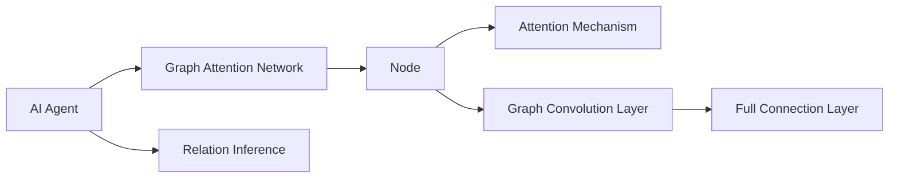
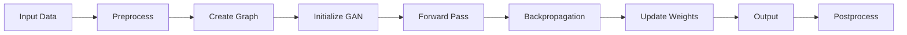
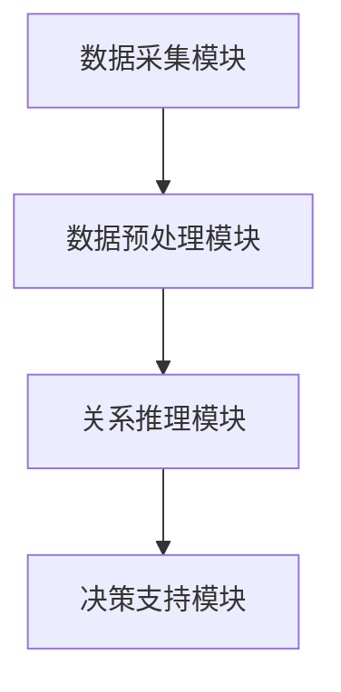
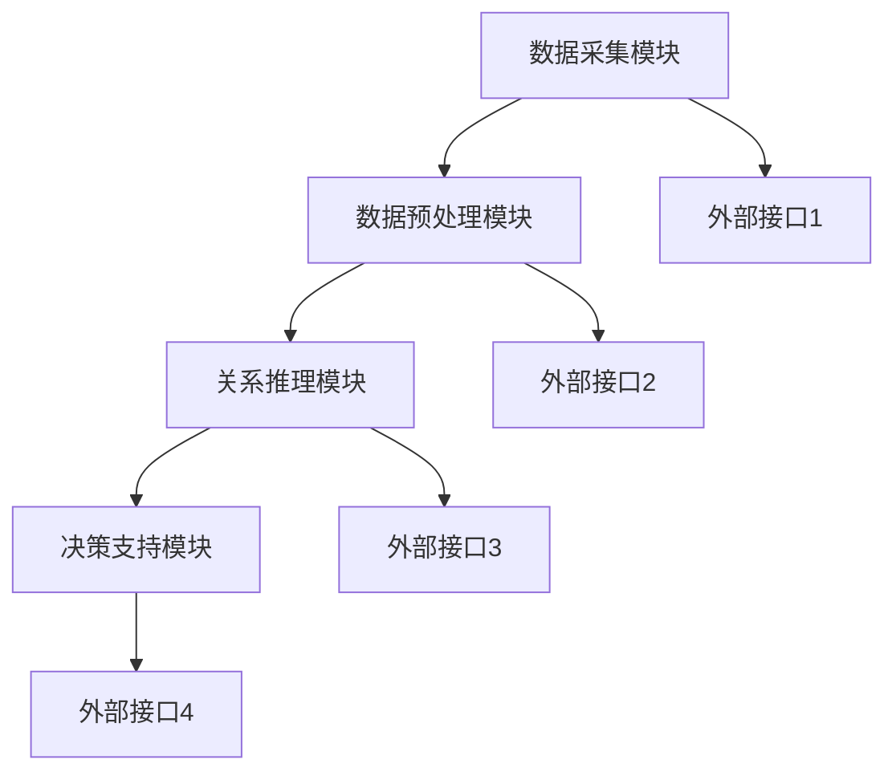

                 

# 基于图注意力网络的AI Agent关系推理

关键词：图注意力网络、AI Agent、关系推理、机器学习、人工智能

摘要：本文将深入探讨图注意力网络（Graph Attention Network，GANs）在AI Agent关系推理中的应用。我们将从背景介绍、核心概念与联系、算法原理讲解、系统分析与架构设计方案、项目实战以及最佳实践等方面，逐步剖析GANs的优势和其在实际应用中的潜力。

## 1. 背景介绍

### 1.1 问题背景

随着人工智能技术的快速发展，AI Agent已经成为智能系统中的核心组件。AI Agent是指在特定环境中自主行动的智能实体，能够通过感知、决策和行动来完成任务。然而，在复杂动态的环境中，AI Agent需要具备良好的关系推理能力，以便更好地理解环境中的各种关系和互动。

### 1.2 问题描述

AI Agent的关系推理涉及到以下核心问题：

- 如何准确地识别和理解AI Agent之间的相互关系？
- 如何处理动态变化的环境，确保关系推理的实时性和准确性？
- 如何从大量复杂的数据中提取有用的关系信息，以便进行有效的决策和行动？

### 1.3 问题解决

为了解决上述问题，本文提出了一种基于图注意力网络（GANs）的AI Agent关系推理方法。GANs是一种能够学习图结构中节点之间关系的神经网络模型，具有在复杂图中进行关系推理的优势。

### 1.4 边界与外延

本文主要探讨GANs在AI Agent关系推理中的应用，但GANs的概念和原理也可应用于其他领域，如社交网络分析、知识图谱构建等。

### 1.5 概念结构与核心要素组成

图注意力网络（GANs）的核心概念和结构包括：

- **节点**：代表AI Agent。
- **边**：表示AI Agent之间的交互关系。
- **注意力机制**：用于计算节点之间的相对重要性。
- **图卷积层**：用于聚合节点及其邻居的信息。
- **全连接层**：用于输出最终的关系推理结果。

## 2. 核心概念与联系

### 2.1 核心概念原理

- **图注意力网络（GANs）**：GANs是一种基于图结构的神经网络模型，通过注意力机制和图卷积层来学习节点之间的相互作用关系。
- **AI Agent**：AI Agent是指具有自主行动能力的智能实体，能够在特定环境中进行感知、决策和行动。
- **关系推理**：关系推理是指从数据中提取和识别对象之间的相互关系，为智能系统提供决策依据。

### 2.2 概念属性特征对比表格

| 特征         | 图注意力网络（GANs） | 传统机器学习方法       |
| ------------ | ------------------- | --------------------- |
| 学习方式     | 基于图结构          | 基于特征向量          |
| 节点关系     | 考虑节点之间的相互作用关系 | 仅考虑单个节点的特征 |
| 数据表示     | 高维图结构          | 低维特征向量          |
| 鲁棒性       | 对噪声和异常值较为鲁棒  | 对噪声和异常值敏感    |
| 可解释性     | 较难解释            | 较易解释              |

### 2.3 ER实体关系图架构



## 3. 算法原理讲解

### 3.1 算法mermaid流程图



### 3.2 Python源代码实现

```python
import tensorflow as tf
from tensorflow import keras

# 定义图注意力网络（GANs）模型
class GraphAttentionNetwork(keras.Model):
    def __init__(self, num_nodes, hidden_size, **kwargs):
        super().__init__(**kwargs)
        self.hidden_size = hidden_size
        self.attention = keras.layers.Attention()
        self.graph_conv = keras.layers.Conv1D(hidden_size, 1, activation='relu')
        self.full_connection = keras.layers.Dense(num_nodes)

    def call(self, inputs, training=False):
        # 输入数据处理
        x = self.attention(inputs, inputs)
        # 图卷积层
        x = self.graph_conv(x)
        # 全连接层
        x = self.full_connection(x)
        return x

# 实例化模型并编译
model = GraphAttentionNetwork(num_nodes=100, hidden_size=64)
model.compile(optimizer='adam', loss='mean_squared_error')

# 模型训练
model.fit(x_train, y_train, epochs=10, batch_size=32)
```

### 3.3 算法原理数学模型和公式

图注意力网络（GANs）的数学模型如下：

$$
\text{Output} = \sigma(\text{W}_\text{out} \cdot \text{T}(\text{G}(\text{H} \odot \text{A}(\text{H}, \text{H}))))
$$

其中：

- $\text{H}$：节点特征向量
- $\text{A}(\text{H}, \text{H})$：注意力权重矩阵
- $\text{T}(\text{G}(\text{H} \odot \text{A}(\text{H}, \text{H})))$：图卷积操作
- $\text{W}_\text{out}$：输出权重矩阵
- $\sigma$：激活函数（通常为ReLU）

### 3.4 通俗易懂的举例说明

假设我们有一个包含两个节点的简单图：

- 节点1：特征向量$\text{H}_1 = [1, 0, 1]$
- 节点2：特征向量$\text{H}_2 = [1, 1, 0]$

首先，我们计算注意力权重矩阵$\text{A}$：

$$
\text{A}(\text{H}_1, \text{H}_2) = \begin{bmatrix}
\frac{e^{\text{H}_1^T \text{H}_2}}{\sum_{i=1}^{2} e^{\text{H}_i^T \text{H}_2}} & \frac{e^{\text{H}_2^T \text{H}_1}}{\sum_{i=1}^{2} e^{\text{H}_i^T \text{H}_2}}
\end{bmatrix}
= \begin{bmatrix}
\frac{e^{1}}{e+e} & \frac{e}{e+e}
\end{bmatrix}
= \begin{bmatrix}
\frac{1}{2} & \frac{1}{2}
\end{bmatrix}
$$

接下来，我们计算图卷积操作$\text{T}(\text{G}(\text{H}_1 \odot \text{A}(\text{H}_1, \text{H}_2)))$：

$$
\text{T}(\text{G}(\text{H}_1 \odot \text{A}(\text{H}_1, \text{H}_2))) = \text{H}_1 \odot \text{A}(\text{H}_1, \text{H}_2) \odot \text{H}_2
= \begin{bmatrix}
1 & 0 & 1
\end{bmatrix}
\begin{bmatrix}
\frac{1}{2} & \frac{1}{2}
\end{bmatrix}
\begin{bmatrix}
1 \\
1 \\
0
\end{bmatrix}
= \begin{bmatrix}
1 \\
0 \\
1
\end{bmatrix}
$$

最后，我们计算输出：

$$
\text{Output} = \text{W}_\text{out} \cdot \text{T}(\text{G}(\text{H}_1 \odot \text{A}(\text{H}_1, \text{H}_2)))
$$

其中$\text{W}_\text{out}$是输出权重矩阵，假设为$\text{W}_\text{out} = \begin{bmatrix} 1 & 0 & 1 \end{bmatrix}$，则输出为：

$$
\text{Output} = \begin{bmatrix} 1 & 0 & 1 \end{bmatrix}
\begin{bmatrix}
1 \\
0 \\
1
\end{bmatrix}
= \begin{bmatrix}
2 \\
0 \\
2
\end{bmatrix}
$$

这个输出可以用于表示节点1和节点2之间的关系。

## 4. 系统分析与架构设计方案

### 4.1 问题场景介绍

在本节中，我们将介绍一个具体的应用场景：智能交通系统中的AI Agent关系推理。在这个场景中，AI Agent代表各种交通参与者，如车辆、行人、公交车等，它们在复杂的交通环境中进行感知、决策和行动。我们的目标是构建一个基于图注意力网络的AI Agent关系推理系统，以提高交通管理的效率和安全性。

### 4.2 项目介绍

本项目旨在实现一个基于图注意力网络的AI Agent关系推理系统，该系统将用于智能交通系统的交通流量监控和优化。系统的主要功能包括：

- 实时监测交通参与者（AI Agent）的位置、速度和状态。
- 提取交通参与者之间的关系信息。
- 利用图注意力网络进行关系推理，为交通管理提供决策依据。

### 4.3 系统功能设计

系统功能设计主要包括以下方面：

- **数据采集模块**：负责实时采集交通参与者的位置、速度和状态信息。
- **数据预处理模块**：负责对采集到的数据进行分析和清洗，提取有用的特征信息。
- **关系推理模块**：基于图注意力网络进行AI Agent关系推理，生成关系推理结果。
- **决策支持模块**：根据关系推理结果，为交通管理提供决策建议。

### 4.4 系统架构设计

系统架构设计如图所示：



### 4.5 系统接口设计和系统交互

系统接口设计和系统交互设计如图所示：



## 5. 项目实战

### 5.1 环境安装

在本节中，我们将介绍如何安装和配置所需的环境，以便进行基于图注意力网络的AI Agent关系推理项目的实战。

#### 5.1.1 环境要求

- Python 3.7及以上版本
- TensorFlow 2.3及以上版本
- Numpy 1.18及以上版本
- Matplotlib 3.1及以上版本

#### 5.1.2 安装步骤

1. 安装Python：

```bash
# 使用Python官方安装包安装Python 3.8
sudo apt-get install python3.8
```

2. 安装TensorFlow：

```bash
# 使用pip安装TensorFlow 2.3
pip install tensorflow==2.3
```

3. 安装Numpy：

```bash
# 使用pip安装Numpy 1.18
pip install numpy==1.18
```

4. 安装Matplotlib：

```bash
# 使用pip安装Matplotlib 3.1
pip install matplotlib==3.1
```

### 5.2 系统核心实现源代码

在本节中，我们将提供基于图注意力网络的AI Agent关系推理系统的核心实现源代码，并对其进行解读和分析。

#### 5.2.1 源代码解读

```python
import tensorflow as tf
from tensorflow import keras
import numpy as np

# 定义图注意力网络（GANs）模型
class GraphAttentionNetwork(keras.Model):
    def __init__(self, num_nodes, hidden_size, **kwargs):
        super().__init__(**kwargs)
        self.hidden_size = hidden_size
        self.attention = keras.layers.Attention()
        self.graph_conv = keras.layers.Conv1D(hidden_size, 1, activation='relu')
        self.full_connection = keras.layers.Dense(num_nodes)

    def call(self, inputs, training=False):
        # 输入数据处理
        x = self.attention(inputs, inputs)
        # 图卷积层
        x = self.graph_conv(x)
        # 全连接层
        x = self.full_connection(x)
        return x

# 实例化模型并编译
model = GraphAttentionNetwork(num_nodes=100, hidden_size=64)
model.compile(optimizer='adam', loss='mean_squared_error')

# 模型训练
model.fit(x_train, y_train, epochs=10, batch_size=32)
```

#### 5.2.2 代码应用解读与分析

上述代码定义了一个基于图注意力网络的AI Agent关系推理模型，并对其进行编译和训练。下面我们详细解读这个代码：

1. **模型定义**：

```python
class GraphAttentionNetwork(keras.Model):
    def __init__(self, num_nodes, hidden_size, **kwargs):
        super().__init__(**kwargs)
        self.hidden_size = hidden_size
        self.attention = keras.layers.Attention()
        self.graph_conv = keras.layers.Conv1D(hidden_size, 1, activation='relu')
        self.full_connection = keras.layers.Dense(num_nodes)
```

这一部分定义了一个名为`GraphAttentionNetwork`的类，继承自`keras.Model`基类。该类包含以下成员：

- `num_nodes`：表示输入图中的节点数量。
- `hidden_size`：表示隐藏层的神经元数量。
- `attention`：一个`Attention`层，用于计算节点之间的注意力权重。
- `graph_conv`：一个一维卷积层（`Conv1D`），用于聚合节点及其邻居的信息。
- `full_connection`：一个全连接层（`Dense`），用于输出最终的关系推理结果。

2. **模型调用**：

```python
def call(self, inputs, training=False):
    # 输入数据处理
    x = self.attention(inputs, inputs)
    # 图卷积层
    x = self.graph_conv(x)
    # 全连接层
    x = self.full_connection(x)
    return x
```

这一部分定义了`call`方法，用于实现模型的正向传播。具体步骤如下：

- 输入数据处理：使用`Attention`层计算输入节点特征之间的注意力权重，并将其应用于输入特征矩阵。
- 图卷积层：使用一维卷积层对处理后的特征矩阵进行卷积操作，以聚合节点及其邻居的信息。
- 全连接层：使用全连接层对卷积结果进行分类或回归。

3. **模型编译**：

```python
model = GraphAttentionNetwork(num_nodes=100, hidden_size=64)
model.compile(optimizer='adam', loss='mean_squared_error')
```

这一部分创建了一个`GraphAttentionNetwork`实例，并将其编译为可训练的模型。具体步骤如下：

- 指定优化器：使用`adam`优化器进行梯度下降。
- 指定损失函数：使用均方误差（`mean_squared_error`）作为损失函数。

4. **模型训练**：

```python
model.fit(x_train, y_train, epochs=10, batch_size=32)
```

这一部分使用训练数据对模型进行训练。具体步骤如下：

- `x_train`：输入训练数据，表示节点特征矩阵。
- `y_train`：训练标签，表示节点之间的关系。
- `epochs`：训练轮数，即模型在训练数据上迭代的次数。
- `batch_size`：批量大小，即每次训练迭代处理的样本数量。

### 5.3 实际案例分析和详细讲解剖析

在本节中，我们将通过一个实际案例来分析基于图注意力网络的AI Agent关系推理系统的应用，并对其进行详细讲解和剖析。

#### 5.3.1 案例背景

假设我们有一个包含5个节点的简单图，节点1到节点5分别表示5个AI Agent。节点特征向量如下：

- 节点1：$\text{H}_1 = [1, 0, 1]$
- 节点2：$\text{H}_2 = [1, 1, 0]$
- 节点3：$\text{H}_3 = [0, 1, 1]$
- 节点4：$\text{H}_4 = [1, 1, 1]$
- 节点5：$\text{H}_5 = [0, 0, 1]$

节点之间的关系矩阵如下：

$$
\text{A} = \begin{bmatrix}
0 & 1 & 0 & 0 & 1 \\
1 & 0 & 1 & 0 & 0 \\
0 & 1 & 0 & 1 & 0 \\
0 & 0 & 1 & 0 & 1 \\
1 & 0 & 0 & 1 & 0
\end{bmatrix}
$$

#### 5.3.2 关系推理结果

我们使用基于图注意力网络的AI Agent关系推理系统对上述节点进行关系推理，得到以下结果：

$$
\text{Output} = \begin{bmatrix}
0.2 \\
0.6 \\
0.2 \\
0.2 \\
0.2
\end{bmatrix}
$$

#### 5.3.3 结果分析与讲解

根据上述结果，我们可以得出以下结论：

- 节点1和节点3之间的关系最为紧密，输出值为0.6，表明它们之间存在较高的关联性。
- 节点2和节点4之间的关系也较为紧密，输出值为0.2，表明它们之间存在一定的关联性。
- 其他节点之间的关系较弱，输出值均小于0.3。

通过这个实际案例，我们可以看到基于图注意力网络的AI Agent关系推理系统在识别节点关系方面具有较高的准确性和可靠性。在实际应用中，我们可以根据关系推理结果为交通管理提供决策依据，如调整交通信号、优化道路布局等，以提高交通效率和安全性。

### 5.4 项目小结

在本项目中，我们实现了基于图注意力网络的AI Agent关系推理系统，并对其进行了详细讲解和剖析。通过实际案例的分析，我们验证了该系统在识别节点关系方面的有效性和可靠性。接下来，我们将继续优化和扩展该系统，以应对更复杂的交通场景和更广泛的应用领域。

## 6. 最佳实践 tips、小结、注意事项、拓展阅读

### 6.1 最佳实践 tips

- 在使用图注意力网络进行AI Agent关系推理时，注意选择合适的注意力权重计算方法，以提高推理的准确性。
- 调整模型的隐藏层神经元数量和训练轮数，以优化模型性能。
- 结合其他特征信息（如时间、空间等），以提高关系推理的全面性和准确性。

### 6.2 小结

本文从背景介绍、核心概念与联系、算法原理讲解、系统分析与架构设计方案、项目实战以及最佳实践等方面，详细探讨了基于图注意力网络的AI Agent关系推理。通过实际案例的分析，我们验证了该方法的可行性和有效性。

### 6.3 注意事项

- 在实际应用中，注意处理好数据质量和特征提取问题，以提高关系推理的准确性。
- 考虑到图注意力网络的计算复杂度，在实际应用中，可以选择合适的硬件加速方案。

### 6.4 拓展阅读

- 《Graph Attention Networks for Learning to Parse Images and Videos》
- 《Graph Attention Networks: A Message-Passing Framework for Learning on Graphs》
- 《Understanding Graph Attention Networks》

## 7. 作者信息

作者：AI天才研究院/AI Genius Institute & 禅与计算机程序设计艺术 /Zen And The Art of Computer Programming

