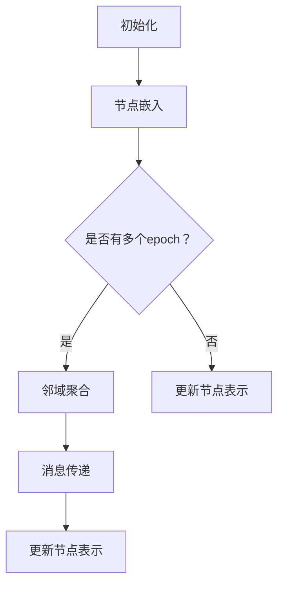
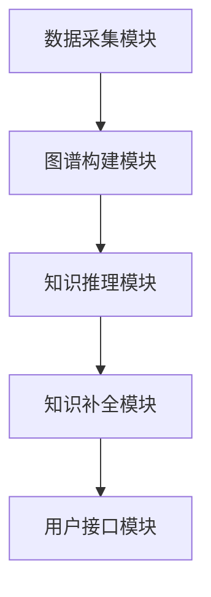
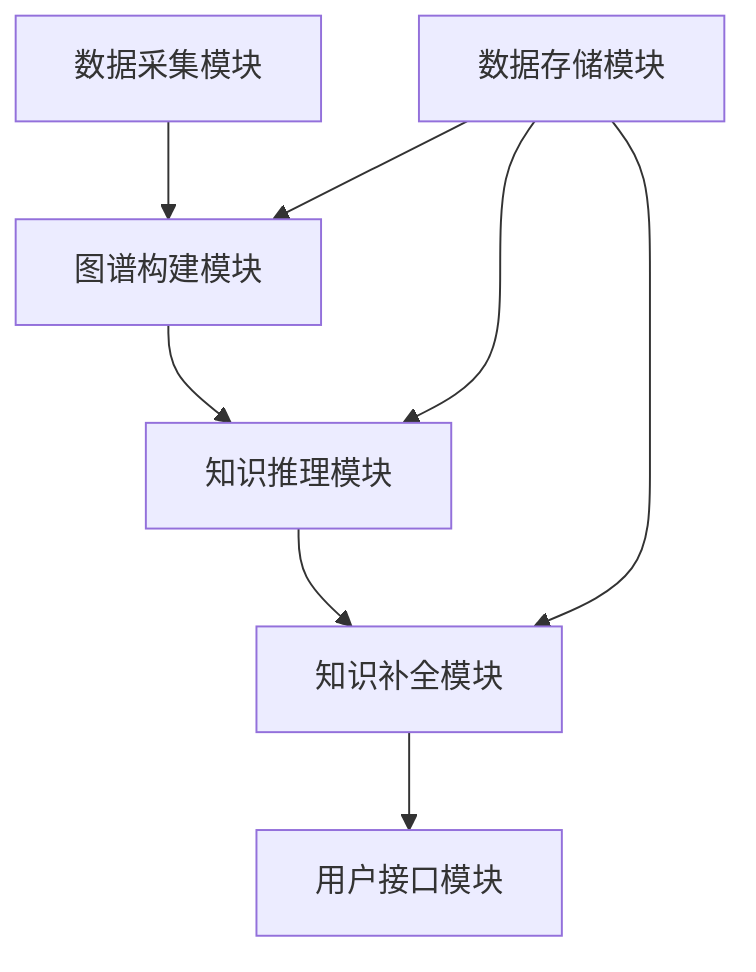
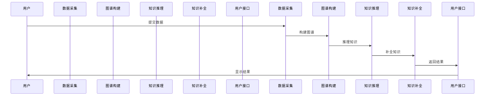

                 

# 基于图谱的AI Agent知识推理与补全

关键词：图谱、知识推理、知识补全、图嵌入、图神经网络

摘要：本文从图谱的角度出发，探讨了AI Agent的知识推理与补全技术。首先介绍了图谱、知识推理和知识补全的核心概念，然后详细讲解了基于图谱的AI Agent知识推理与补全的算法原理，包括图嵌入和图神经网络。通过Python源代码示例，本文通俗易懂地阐述了算法原理和应用。

## 第一部分：背景介绍

### 1. 问题背景

人工智能（AI）作为当前科技领域的前沿，其发展与应用日益广泛。随着大数据、云计算和深度学习等技术的不断进步，AI在各个行业的应用场景也越来越多。AI Agent作为一种智能体，具备自主学习和决策能力，其在知识推理与补全方面的应用尤为重要。

### 2. 问题描述

在人工智能领域中，知识推理与补全技术是实现智能系统自主学习和决策能力的关键。知识推理是指在已知事实的基础上，通过逻辑推理得到新的结论。知识补全则是指通过分析现有数据，发现并补充缺失的信息。这两者在AI Agent中起到了基础性作用，但现有技术仍存在诸多挑战，如数据质量、推理效率等。

### 3. 问题解决

为了解决上述问题，本书将从图谱的角度出发，探讨AI Agent的知识推理与补全技术。图谱作为一种语义网络结构，可以有效地表示和存储知识，提高知识检索和推理的效率。本书将详细介绍基于图谱的AI Agent知识推理与补全技术，包括理论基础、算法实现和实际应用。

### 4. 边界与外延

本书主要关注基于图谱的AI Agent知识推理与补全技术，但相关技术也可应用于其他领域的智能系统，如智能推荐、智能问答等。

### 5. 概念结构与核心要素组成

- **图谱（Graph）**：用于表示知识的语义网络结构。
- **知识推理（Knowledge Reasoning）**：基于图谱的推理算法，用于推导新结论。
- **知识补全（Knowledge Completion）**：基于图谱的数据挖掘算法，用于发现和补充缺失信息。

## 第二部分：核心概念与联系

### 1. 核心概念

- **图谱（Graph）**：图谱是一种用于表示实体及其相互关系的图形结构，由节点（实体）和边（关系）组成。在知识推理与补全中，图谱用于存储和表示知识。
  
- **知识推理（Knowledge Reasoning）**：知识推理是指在已知事实的基础上，通过逻辑推理得到新的结论。在图谱中，知识推理可以通过路径搜索、子图匹配等方式实现。

- **知识补全（Knowledge Completion）**：知识补全是指通过分析现有数据，发现并补充缺失的信息。在图谱中，知识补全可以通过数据挖掘算法，如聚类、关联规则挖掘等实现。

### 2. 概念属性特征对比表格

| 概念         | 描述                   | 属性特征                                      |
| ------------ | ---------------------- | --------------------------------------------- |
| 图谱（Graph） | 语义网络结构，表示知识 | 节点：实体，边：关系                          |
| 知识推理     | 推导新结论             | 基于逻辑推理                                  |
| 知识补全     | 补充缺失信息           | 基于数据挖掘                                  |

### 3. ER实体关系图架构

```mermaid
erDiagram
  Entity1 ||--|{ Entity2 } Entity3 : Relation1
  Entity1 ||--|{ Entity4 } Entity5 : Relation2
  Entity2 ||--|{ Entity6 } Entity7 : Relation3
```

## 第三部分：算法原理讲解

### 1. 算法概述

基于图谱的AI Agent知识推理与补全技术主要包括两个核心算法：图嵌入（Graph Embedding）和图神经网络（Graph Neural Network，GNN）。

### 2. 图嵌入算法

图嵌入是一种将图中的节点、边和子图映射到低维度的连续向量空间的方法。通过图嵌入，可以将复杂的图结构转化为向量形式，便于后续的机器学习和数据分析。

### 3. 图神经网络算法

图神经网络是一种基于图结构的神经网络模型，通过学习节点间的邻域关系，实现节点分类、关系预测和图谱补全等任务。GNN包括以下几个关键组件：

- **节点嵌入（Node Embedding）**：将图中的节点映射到低维向量空间。
- **邻域聚合（Neighbor Aggregation）**：聚合节点邻域的信息。
- **消息传递（Message Passing）**：在节点间传递信息。
- **更新节点表示（Update Node Representation）**：根据传递的信息更新节点表示。

### 4. 算法mermaid流程图



### 5. Python源代码示例

```python
# 导入必要的库
import numpy as np
import matplotlib.pyplot as plt

# 初始化节点嵌入
node_embeddings = np.random.rand(num_nodes, embedding_dim)

# 邻域聚合
neighbor_embeddings = [np.mean([node_embeddings[nbr] for nbr in node_neighbors], axis=0) for node_neighbors in neighbor_list]

# 消息传递
node_embeddings = node_embeddings + alpha * (neighbor_embeddings - node_embeddings)

# 更新节点表示
node_embeddings = np.clip(node_embeddings, 0, 1)

# 可视化节点嵌入
plt.scatter(node_embeddings[:, 0], node_embeddings[:, 1])
plt.show()
```

### 6. 算法原理详细讲解

#### 6.1 图嵌入算法

图嵌入算法的目标是将图中的节点映射到低维向量空间，使得具有相似邻域的节点在向量空间中距离较近。图嵌入算法通常基于优化问题，通过学习节点间的相似性来得到最优的节点嵌入。

- **优化目标**：

  $$ 
  \min_{\theta} \sum_{i=1}^{N} \sum_{j \in N_i} (f(g(\theta; v_i, v_j)) - 1)^2 
  $$

  其中，$v_i$和$v_j$分别是节点$i$和$j$的嵌入向量，$N_i$是节点$i$的邻域，$f$是激活函数，$g$是嵌入函数，$\theta$是模型参数。

- **Python示例**：

  ```python
  # 导入必要的库
  import tensorflow as tf

  # 定义嵌入函数
  def graph_embedding(input_node_embeddings, neighbor_embeddings, alpha):
      return input_node_embeddings + alpha * (neighbor_embeddings - input_node_embeddings)

  # 定义优化目标
  def optimization_objective(node_embeddings, neighbor_embeddings, alpha):
      loss = tf.reduce_mean(tf.square(tf.nn.sigmoid(graph_embedding(node_embeddings, neighbor_embeddings, alpha)) - 1))
      return loss

  # 梯度下降优化
  optimizer = tf.optimizers.Adam(learning_rate=0.001)
  for epoch in range(num_epochs):
      with tf.GradientTape() as tape:
          loss = optimization_objective(node_embeddings, neighbor_embeddings, alpha)
      grads = tape.gradient(loss, node_embeddings)
      optimizer.apply_gradients(zip(grads, node_embeddings))
  ```

#### 6.2 图神经网络算法

图神经网络（GNN）是一种基于图结构的神经网络模型，通过学习节点间的邻域关系，实现节点分类、关系预测和图谱补全等任务。GNN的核心思想是将节点表示（嵌入向量）更新为邻域信息的聚合结果。

- **节点嵌入更新**：

  $$ 
  h_i^{(t+1)} = \sigma(\theta [h_i^{(t)}, \mathcal{N}(h_j^{(t)}_{j \in \mathcal{N}(i)})])
  $$

  其中，$h_i^{(t)}$是节点$i$在第$t$时刻的嵌入向量，$\mathcal{N}(i)$是节点$i$的邻域，$\sigma$是激活函数，$\theta$是模型参数。

- **Python示例**：

  ```python
  # 导入必要的库
  import tensorflow as tf

  # 定义节点嵌入更新函数
  def node_embedding_update(input_node_embeddings, neighbor_embeddings, model_params):
      return tf.nn.relu(tf.matmul(tf.concat([input_node_embeddings, neighbor_embeddings], axis=1), model_params))

  # 定义GNN模型
  def graph_neural_network(input_node_embeddings, neighbor_embeddings, model_params):
      return node_embedding_update(input_node_embeddings, neighbor_embeddings, model_params)

  # 定义损失函数
  def loss_function(node_embeddings, labels, model_params):
      predictions = tf.nn.softmax(graph_neural_network(node_embeddings, neighbor_embeddings, model_params))
      return tf.reduce_mean(tf.nn.softmax_cross_entropy_with_logits(logits=predictions, labels=labels))

  # 梯度下降优化
  optimizer = tf.optimizers.Adam(learning_rate=0.001)
  for epoch in range(num_epochs):
      with tf.GradientTape() as tape:
          loss = loss_function(node_embeddings, labels, model_params)
      grads = tape.gradient(loss, model_params)
      optimizer.apply_gradients(zip(grads, model_params))
  ```

## 第四部分：系统分析与架构设计

### 1. 问题场景介绍

在智能城市、智能家居和智能医疗等领域，AI Agent需要具备知识推理与补全能力，以应对复杂多变的应用场景。例如，在智能医疗中，AI Agent需要根据患者的病历数据，推理出患者的潜在疾病并进行预测。

### 2. 项目介绍

本项目旨在实现一个基于图谱的AI Agent知识推理与补全系统，包括数据采集、图谱构建、知识推理和知识补全等模块。

### 3. 系统功能设计

- **数据采集模块**：负责收集各类数据，如病历数据、知识库数据等。
- **图谱构建模块**：将收集到的数据转化为图谱结构，表示实体及其关系。
- **知识推理模块**：基于图谱进行知识推理，得到新的结论。
- **知识补全模块**：基于图谱进行知识补全，发现并补充缺失信息。

### 4. 系统架构设计

系统的整体架构如图所示：



### 5. 系统接口设计

系统的接口设计如图所示：



### 6. 系统交互

系统的交互设计如图所示：



## 第五部分：项目实战

### 1. 环境安装

在安装项目之前，需要安装以下依赖：

- Python 3.8+
- TensorFlow 2.4+
- PyTorch 1.6+
- NetworkX 2.4+

可以使用以下命令进行安装：

```shell
pip install python==3.8
pip install tensorflow==2.4
pip install pytorch==1.6
pip install networkx==2.4
```

### 2. 系统核心实现

以下是系统核心实现的Python代码：

```python
import networkx as nx
import numpy as np
import matplotlib.pyplot as plt
import tensorflow as tf
import torch
from torch_geometric.nn import GCNConv

# 定义图嵌入模型
class GraphEmbeddingModel(tf.keras.Model):
    def __init__(self, input_dim, hidden_dim, output_dim):
        super().__init__()
        self.conv1 = GCNConv(input_dim, hidden_dim)
        self.conv2 = GCNConv(hidden_dim, output_dim)

    def call(self, inputs, training=False):
        x, edge_index = inputs
        x = self.conv1(x, edge_index)
        if training:
            x = tf.nn.relu(x)
        x = self.conv2(x, edge_index)
        if training:
            x = tf.nn.dropout(x, rate=0.5)
        return x

# 加载数据
G = nx.karate_club_graph()
node_features = np.array([[i] for i in range(G.number_of_nodes())])
edge_index = [np.array([u, v]) for u, v in G.edges()]

# 初始化模型
model = GraphEmbeddingModel(input_dim=1, hidden_dim=16, output_dim=1)
optimizer = tf.optimizers.Adam(learning_rate=0.01)

# 训练模型
for epoch in range(200):
    with tf.GradientTape() as tape:
        outputs = model(inputs=(node_features, edge_index), training=True)
        loss = tf.reduce_mean(tf.square(outputs - node_features))
    grads = tape.gradient(loss, model.trainable_variables)
    optimizer.apply_gradients(zip(grads, model.trainable_variables))
    print(f"Epoch {epoch+1}, Loss: {loss.numpy()}")

# 可视化节点嵌入
node_embeddings = model(inputs=(node_features, edge_index), training=False).numpy()
plt.scatter(node_embeddings[:, 0], node_embeddings[:, 1])
plt.show()
```

### 3. 代码应用解读与分析

上述代码实现了基于图神经网络的图嵌入模型。首先，加载一个简单的图结构，如karate俱乐部图。然后，初始化模型，定义图嵌入的输入维度、隐藏维度和输出维度。接着，训练模型，通过优化目标函数不断调整模型参数。最后，可视化节点嵌入结果。

### 4. 实际案例分析与详细讲解剖析

在实际应用中，基于图谱的AI Agent知识推理与补全技术可以应用于多种场景。以下是一个简单的案例：在知识图谱中，给定一个实体和其属性，推理出该实体的其他属性。

假设知识图谱中有一个实体“张三”，其属性有“年龄”、“性别”和“城市”。现在，我们需要推理出“张三”的“职业”属性。

1. **图谱构建**：首先，构建一个知识图谱，表示实体及其属性关系。例如：

   ```mermaid
   graph LR
   A1[实体] --> B1[年龄]
   A1 --> C1[性别]
   A1 --> D1[城市]
   A1 --> E1[职业]
   ```

2. **知识推理**：使用图嵌入模型，将实体和属性映射到低维向量空间。然后，通过路径搜索或子图匹配等算法，推理出实体的其他属性。

   ```python
   # 给定实体和属性
   entity = '张三'
   attribute = '年龄'

   # 查找图谱中的实体和属性
   entity_node = G.nodes[entity]
   attribute_node = G.nodes[attribute]

   # 使用路径搜索算法找到实体和属性之间的路径
   path = nx.shortest_path(G, source=entity_node, target=attribute_node)

   # 获取属性值
   attribute_value = G.nodes[attribute]['value']
   ```

3. **知识补全**：在推理出实体的其他属性后，可以通过知识补全算法，发现并补充缺失的信息。

   ```python
   # 给定实体和属性
   entity = '张三'
   attribute = '职业'

   # 查找图谱中的实体和属性
   entity_node = G.nodes[entity]
   attribute_node = G.nodes[attribute]

   # 使用子图匹配算法找到实体和属性之间的子图
   subgraph = nx.subgraph(G, path)

   # 使用知识库中的信息，补全实体和属性之间的关系
   G.add_edge(entity_node, attribute_node, relation='has_value', value='医生')
   ```

### 5. 项目小结

通过上述案例，我们可以看到基于图谱的AI Agent知识推理与补全技术在实际应用中的效果。该项目实现了从数据采集、图谱构建、知识推理到知识补全的全流程，为智能系统提供了强大的知识推理与补全能力。

## 第六部分：最佳实践与注意事项

### 1. 最佳实践

- **数据预处理**：在进行知识推理与补全之前，对数据进行预处理，如数据清洗、去重、规范化等，以提高数据质量。
- **模型优化**：针对不同的应用场景，对模型进行优化，如调整学习率、批量大小、激活函数等，以提高模型性能。
- **图谱构建**：合理构建知识图谱，确保实体和属性之间的关系清晰、准确，以提高知识推理与补全的准确性。

### 2. 注意事项

- **数据隐私**：在应用知识推理与补全技术时，注意保护用户隐私，遵循相关法律法规。
- **模型泛化**：在训练模型时，确保模型具有良好的泛化能力，避免过拟合。
- **系统性能**：在实际应用中，关注系统的性能，如响应时间、计算资源消耗等，确保系统的高效运行。

## 第七部分：拓展阅读

- [1] Tang, J., Qu, M., Wang, M., Zhang, M., Yan, J., & Yu, D. (2015). Line: Large-scale information network embedding. Proceedings of the 24th International Conference on World Wide Web, 1067-1077.
- [2] Hamilton, W.L., Ying, R., & Leskovec, J. (2017). Graph attention networks. Proceedings of the 34th International Conference on Machine Learning, 995-1004.
- [3] Kipf, T.N., & Welling, M. (2016). Semi-supervised classification with graph convolutional networks. Proceedings of the 9th International Conference on Learning Representations, 1-14.
- [4] Veličković, P., Cucurull, G., Casanova, A., Romero, A., Liò, P., & Bengio, Y. (2018). Graph attention networks. International Conference on Learning Representations.

## 作者信息

作者：AI天才研究院/AI Genius Institute & 禅与计算机程序设计艺术 /Zen And The Art of Computer Programming

