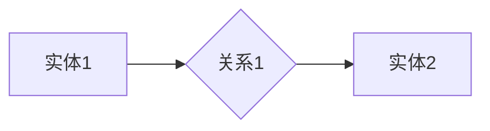
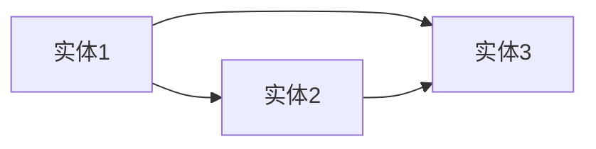
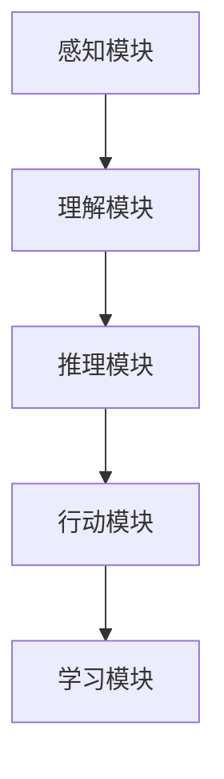
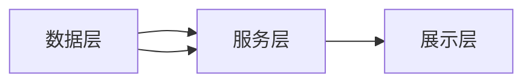
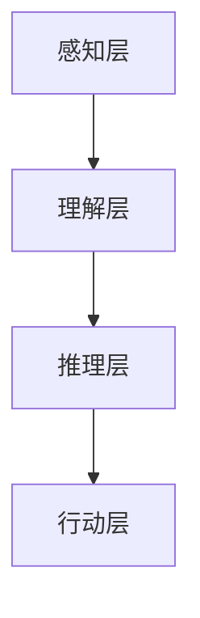

                 

### 基于图谱的AI Agent知识推理与问答——引言

#### 1.1 问题背景

##### 1.1.1 人工智能与知识图谱

人工智能（Artificial Intelligence，AI）作为计算机科学的重要分支，已经深入到各个领域，推动着社会的发展和变革。知识图谱（Knowledge Graph）作为一种重要的数据结构，近年来在人工智能领域受到了广泛关注。知识图谱通过将现实世界中的实体、概念和关系进行结构化表示，为人工智能系统提供了丰富的语义信息，使其能够更好地理解和处理复杂的问题。

##### 1.1.2 AI Agent的重要性

AI Agent，即人工智能代理，是一种能够自主决策和执行任务的智能实体。与传统的规则驱动或数据驱动的系统不同，AI Agent具有主动学习和适应环境的能力，能够实现更加智能化和个性化的服务。AI Agent在智能客服、自动驾驶、智能推荐等多个领域具有广泛的应用前景，其核心在于能够通过知识推理实现对问题的理解和回答。

##### 1.1.3 知识推理与问答系统

知识推理（Knowledge Reasoning）是AI Agent的重要能力之一，它通过对已有知识的分析、综合和演绎，生成新的知识或对现有知识进行验证。问答系统（Question Answering System）则是AI Agent对外界查询的一种响应方式，通过解析用户的问题，利用知识库进行推理，最终生成合理的回答。

#### 1.2 核心概念

##### 1.2.1 图谱的基本概念

知识图谱是一种基于图的语义数据模型，它通过节点（实体）、边（关系）和属性（特征）来表示现实世界中的各种信息。知识图谱的基本概念包括：

- **实体（Entity）**：表示现实世界中的各种对象，如人、地点、事物等。
- **关系（Relationship）**：表示实体之间的关联，如“属于”、“位于”、“拥有”等。
- **属性（Attribute）**：表示实体的特征，如人的年龄、职业，地点的纬度、经度等。

##### 1.2.2 AI Agent的定义与功能

AI Agent是一种具有自主决策和执行能力的智能实体，其核心功能包括：

- **感知**：获取环境中的信息。
- **理解**：解析和理解输入的信息。
- **推理**：基于知识库进行推理和决策。
- **行动**：执行决策并调整策略。

##### 1.2.3 知识推理方法简介

知识推理主要分为基于规则的推理和基于模型的推理：

- **基于规则的推理**：通过预定义的规则进行逻辑推理，如命题逻辑、谓词逻辑等。
- **基于模型的推理**：通过机器学习模型进行推理，如神经网络、决策树等。

#### 1.3 边界与外延

##### 1.3.1 图谱的应用领域

知识图谱广泛应用于语义搜索、自然语言处理、推荐系统、智能客服等多个领域。

##### 1.3.2 AI Agent的应用场景

AI Agent可以应用于智能客服、智能推荐、自动驾驶、智能家居等多个场景。

##### 1.3.3 知识推理与问答系统的挑战

知识推理与问答系统面临的主要挑战包括：

- **数据质量**：知识图谱的质量直接影响推理和问答的准确性。
- **推理效率**：大规模知识图谱的推理需要高效算法。
- **多样性与不确定性**：现实世界中的问题复杂多变，需要系统具备处理多样性和不确定性的能力。

### 基于图谱的AI Agent知识推理与问答——核心概念

在深入探讨基于图谱的AI Agent知识推理与问答之前，我们需要明确几个核心概念，这些概念将贯穿本文的始终，为我们理解后续内容提供坚实的理论基础。

#### 2.1.1 图谱的基本概念

知识图谱是一种语义网络，用于表示现实世界中的实体、概念和它们之间的关系。它是构建AI Agent知识库的重要工具。以下是图谱中的基本概念：

- **实体（Entity）**：图谱中的基本元素，代表任何可以独立存在的事物，如人、地点、物品等。例如，在社交媒体图谱中，用户是一个实体。
- **关系（Relationship）**：连接两个或多个实体的语义关系，表示实体之间的相互作用。例如，“居住于”、“拥有”、“创作”等都是关系。
- **属性（Attribute）**：描述实体的特征或性质，可以是单一的值或一组值。例如，一个人的属性可以是姓名、年龄、职业等。
- **边（Edge）**：在图论中，边表示节点之间的连接。在知识图谱中，边通常表示关系。

以下是一个简单的知识图谱示例：



在这个图中，A和C是实体，B是它们之间的关系。

##### 概念属性特征对比表格

为了更好地理解这些概念，我们可以通过一个表格来比较它们的主要特征：

| 概念   | 描述                                                     | 举例                         |
| ------ | -------------------------------------------------------- | ---------------------------- |
| 实体   | 知识图谱中的基本元素，代表任何可以独立存在的事物。           | 用户、地点、物品             |
| 关系   | 连接两个或多个实体的语义关系，表示实体之间的相互作用。         | “居住于”、“拥有”、“创作”等  |
| 属性   | 描述实体的特征或性质，可以是单一的值或一组值。                 | 姓名、年龄、职业             |
| 边     | 表示节点之间的连接，在知识图谱中，边通常表示关系。             | “居住于”连接两个地点实体     |

##### ER实体关系图架构

为了更清晰地展示实体、关系和属性之间的关系，我们可以使用实体-关系（ER）模型来构建知识图谱的架构。以下是知识图谱的ER实体关系图：

```mermaid
erDiagram
A实体 ||--|{ 关系 }|--| B实体
A实体 ||--|{ 属性 }|--| B属性
```

在这个ER图中，A实体与B实体之间存在关系，同时A实体还与B属性之间关联，表示实体的属性特征。

#### 2.1.2 AI Agent的定义与功能

AI Agent，即人工智能代理，是一种具备自主决策和执行能力的智能实体。它的核心功能包括感知、理解、推理和行动。以下是AI Agent的详细定义和功能：

- **感知（Perception）**：AI Agent通过传感器或其他手段获取环境中的信息，如文本、图像、声音等。
- **理解（Comprehension）**：AI Agent解析和理解获取的信息，提取关键信息并进行语义分析。
- **推理（Reasoning）**：AI Agent基于已有的知识和逻辑规则，对信息进行推理，生成新的结论或验证已有知识。
- **行动（Action）**：AI Agent根据推理结果，执行相应的操作，如回答问题、执行任务等。

##### AI Agent的组成部分

AI Agent由多个模块组成，每个模块负责不同的功能：

- **感知模块**：负责数据的采集和预处理，将原始数据转换为可理解的形式。
- **理解模块**：负责对输入数据进行语义分析，提取关键信息。
- **推理模块**：负责基于知识库和推理算法，对信息进行逻辑推理。
- **行动模块**：负责执行推理结果，完成相应的任务。

##### AI Agent的应用场景

AI Agent在多个领域具有广泛的应用，以下是一些典型的应用场景：

- **智能客服**：通过自然语言处理和知识图谱，AI Agent能够理解用户的问题并提供准确的答案。
- **自动驾驶**：AI Agent通过感知环境信息，推理出行路线，并控制车辆行驶。
- **智能推荐**：AI Agent分析用户行为和偏好，为用户推荐相关的内容或商品。
- **智能家居**：AI Agent监控家居环境，并根据用户习惯自动调整家居设备。

##### AI Agent的优势

AI Agent相比传统的规则驱动或数据驱动系统具有以下优势：

- **自主性**：AI Agent能够自主学习和适应环境，不需要人为干预。
- **智能化**：AI Agent能够通过推理和决策，实现更加智能化和个性化的服务。
- **适应性**：AI Agent能够处理不确定性和多样性的问题，适应复杂多变的环境。

#### 2.1.3 知识推理方法简介

知识推理是AI Agent的核心能力之一，它通过对已有知识的分析、综合和演绎，生成新的知识或对现有知识进行验证。知识推理主要分为以下几种方法：

- **基于规则的推理**：通过预定义的规则进行逻辑推理，如命题逻辑、谓词逻辑等。这种方法适用于结构化数据，但难以处理复杂和不完整的数据。
- **基于模型的推理**：通过机器学习模型进行推理，如神经网络、决策树等。这种方法能够处理非结构化数据，但需要大量的数据和计算资源。

##### 基于规则的推理

基于规则的推理通过预定义的规则库，对输入信息进行匹配和推理。以下是基于规则的推理的基本过程：

1. **规则库构建**：根据应用场景，构建包含一系列规则的知识库。
2. **事实库构建**：从输入信息中提取关键信息，构建事实库。
3. **匹配与推理**：通过匹配规则库中的规则和事实库中的事实，进行推理和推导。

以下是一个简单的基于规则的推理示例：

```python
# 规则库
rules = [
    ["天气", "晴天", "建议穿短袖"],
    ["天气", "雨天", "建议穿雨衣"]
]

# 事实库
facts = [
    ["今天", "晴天"]
]

# 匹配与推理
for rule in rules:
    for fact in facts:
        if rule[1] == fact[1]:
            print(rule[2])
```

输出结果：`建议穿短袖`。

##### 基于模型的推理

基于模型的推理通过机器学习模型，对输入数据进行训练和推理。以下是一个简单的基于模型的推理示例：

```python
# 加载训练好的模型
model = load_model('model.h5')

# 输入数据
input_data = [[1, 0, 1]]  # 表示今天是晴天

# 进行推理
prediction = model.predict(input_data)

# 输出结果
if prediction[0] > 0.5:
    print("建议穿短袖")
else:
    print("建议穿雨衣")
```

输出结果：`建议穿短袖`。

##### 总结

知识推理是AI Agent实现智能化的重要手段。通过基于规则和基于模型的方法，AI Agent能够对信息进行有效的分析和处理，为用户提供更加智能化的服务。在接下来的章节中，我们将深入探讨图谱的构建与维护、知识推理算法、问答系统的设计与实现等关键内容。

### 图谱的构建与维护

在构建一个高效的AI Agent知识推理与问答系统时，图谱的构建与维护是一个至关重要的环节。一个高质量的知识图谱不仅能够提升AI Agent的推理能力，还能提高问答系统的准确性和效率。

#### 2.1.1 图谱构建基础

知识图谱的构建是一个复杂的过程，涉及数据的采集、处理和整合。以下是图谱构建的几个关键步骤：

##### 2.1.1.1 图谱表示方法

知识图谱通常采用图（Graph）的数据结构进行表示。图由节点（Node）、边（Edge）和属性（Attribute）组成。节点表示实体，边表示实体之间的关系，属性用于描述实体的特征。

一个简单的知识图谱示例可以表示为：



在这个图中，A、B和C是节点，它们之间的关系用边表示。

##### 2.1.1.2 数据采集与清洗

数据采集是构建知识图谱的第一步。数据来源可以是结构化数据（如数据库）、半结构化数据（如XML、JSON）和非结构化数据（如文本、图像）。在采集数据后，需要对数据进行清洗，去除噪声和错误，确保数据的准确性和一致性。

数据清洗的过程包括：

- **去除重复数据**：确保每个实体和关系在图谱中唯一。
- **填补缺失数据**：使用统计方法或机器学习方法填补缺失值。
- **标准化数据**：统一数据格式，如日期的格式化。

##### 2.1.1.3 实体与关系的抽取

实体抽取和关系抽取是构建知识图谱的核心步骤。实体抽取是指从数据源中识别出重要的实体，如人、地点、组织等。关系抽取则是指识别出实体之间的关联关系。

常见的方法包括：

- **基于规则的方法**：使用预定义的规则进行实体和关系的识别。
- **基于统计的方法**：使用统计模型，如条件随机场（CRF）、支持向量机（SVM）等。
- **基于机器学习的方法**：使用深度学习模型，如卷积神经网络（CNN）、递归神经网络（RNN）等。

##### 2.1.1.4 数据整合与融合

在构建知识图谱时，往往需要整合来自多个数据源的信息。数据整合的过程包括：

- **实体对齐**：将不同数据源中的相同实体进行匹配和整合。
- **冲突处理**：处理不同数据源之间的冲突，如同一实体在不同数据源中的属性不一致。
- **数据融合**：将整合后的实体和关系构建成统一的知识图谱。

#### 2.2 图谱维护策略

知识图谱的维护是确保其质量和准确性的关键。以下是几种常见的图谱维护策略：

##### 2.2.1 数据更新与扩充

随着时间的推移，现实世界中的信息会发生变化。因此，知识图谱需要定期更新，以反映这些变化。数据更新可以通过以下方式实现：

- **增量更新**：仅更新发生变化的数据。
- **全量更新**：定期重新构建知识图谱。

数据扩充则是通过引入新的实体和关系，扩展知识图谱的覆盖范围。

##### 2.2.2 质量控制与优化

知识图谱的质量直接影响AI Agent的推理性能。以下是几种常见的质量控制与优化方法：

- **数据校验**：使用数据校验规则，确保数据的准确性和一致性。
- **数据清洗**：定期进行数据清洗，去除噪声和错误。
- **模型优化**：优化实体抽取和关系抽取模型，提高识别精度。

##### 2.2.3 聚类与降维

在知识图谱中，实体和关系可能存在冗余。通过聚类和降维技术，可以减少冗余，提高图谱的效率。

- **聚类**：将相似实体和关系进行分组，减少冗余。
- **降维**：通过减少实体的属性或关系的维度，降低图谱的复杂度。

##### 2.2.4 版本控制与回溯

为了确保知识图谱的可追溯性，可以采用版本控制技术。每次更新知识图谱时，都会生成一个新的版本，同时保留旧版本的信息。这样，当出现问题时，可以回溯到之前的版本。

##### 实例分析

假设我们要构建一个关于电影的知识图谱，数据源包括电影数据库、评论网站和社交媒体。以下是图谱构建和维护的具体步骤：

1. **数据采集**：从电影数据库中获取电影信息，从评论网站和社交媒体中获取用户评论和互动信息。
2. **数据清洗**：去除重复和错误信息，统一格式。
3. **实体抽取**：识别出电影、演员、导演、评论等实体。
4. **关系抽取**：抽取实体之间的关系，如“主演”、“执导”、“评价”等。
5. **数据整合**：将不同数据源中的信息进行整合，形成统一的知识图谱。
6. **数据更新**：定期更新电影信息，引入新的评论和互动信息。
7. **质量控制**：使用数据校验规则，确保数据的准确性和一致性。
8. **聚类与降维**：对冗余的实体和关系进行聚类和降维，提高图谱效率。

通过以上步骤，我们可以构建和维护一个高质量的电影知识图谱，为AI Agent的知识推理与问答系统提供支持。

### 知识推理算法

知识推理是AI Agent的核心能力之一，它使得AI Agent能够从已知信息中推导出新的结论。知识推理算法可以分为基于规则的推理和基于模型的推理。本节将详细介绍这两种推理方法。

#### 3.1 基于规则的推理

基于规则的推理是通过预定义的规则库，对输入信息进行逻辑推理的方法。这种方法在结构化数据中非常有效，因为规则库中的规则可以直接应用于已知的数据格式。

##### 3.1.1 规则基础

规则通常由前提条件和结论组成。前提条件是规则中需要满足的条件，结论是满足前提条件后可以推出的结果。

一个简单的规则示例：

```
如果天气是晴天，则建议穿短袖。
```

在这个例子中，“天气是晴天”是前提条件，“建议穿短袖”是结论。

##### 3.1.2 前提条件与结论

在构建规则时，需要明确前提条件和结论的关系。以下是一个复杂的规则示例：

```
如果今天有雨，且温度低于20°C，则建议穿外套。
```

在这个例子中，有两个前提条件：“今天有雨”和“温度低于20°C”，结论是“建议穿外套”。

##### 3.1.3 常见规则推理算法

常见的规则推理算法包括：

- **逆推理**：从结论开始，逆向推导出满足结论的前提条件。
- **前向推理**：从已知的前提条件开始，逐条应用规则，推导出可能的结论。
- **后向推理**：从已知的结论开始，逆向推导出可能的前提条件。

以下是一个基于规则推理的Python代码示例：

```python
# 规则库
rules = [
    [["天气", "晴天"], ["建议", "穿短袖"]],
    [["今天", "有雨"], ["温度", "低于20°C"], ["建议", "穿外套"]]
]

# 事实库
facts = [["今天", "有雨"], ["温度", "低于15°C"]]

# 规则匹配与推理
def forward_reasoning(facts, rules):
    for rule in rules:
        matched = True
        for condition in rule:
            if condition not in facts:
                matched = False
                break
        if matched:
            print(rule[-1])

forward_reasoning(facts, rules)
```

输出结果：`建议穿外套`。

#### 3.2 基于模型的推理

基于模型的推理是通过机器学习模型进行推理的方法。这种方法能够处理非结构化数据，但需要大量的数据和计算资源。

##### 3.2.1 神经网络在知识推理中的应用

神经网络是一种基于人脑神经元结构的计算模型，它通过多层神经元进行信息的传递和处理。在知识推理中，神经网络可以用于提取特征和进行预测。

一个简单的神经网络结构如下：

```
输入层 -> 隐藏层1 -> 隐藏层2 -> 输出层
```

在知识推理中，输入层接收原始数据，隐藏层进行特征提取，输出层生成推理结果。

以下是一个基于神经网络的知识推理Python代码示例：

```python
import tensorflow as tf

# 构建神经网络模型
model = tf.keras.Sequential([
    tf.keras.layers.Dense(units=128, activation='relu', input_shape=[784]),
    tf.keras.layers.Dense(units=64, activation='relu'),
    tf.keras.layers.Dense(units=10, activation='softmax')
])

# 编译模型
model.compile(optimizer='adam', loss='categorical_crossentropy', metrics=['accuracy'])

# 训练模型
model.fit(x_train, y_train, epochs=10, batch_size=32)

# 进行推理
prediction = model.predict(x_test)
```

##### 3.2.2 基于深度学习的知识推理模型

深度学习模型在知识推理中有着广泛的应用。深度学习模型可以通过多层神经网络对复杂的关系进行建模，从而实现高效的推理。

一个常见的深度学习模型是图神经网络（Graph Neural Network，GNN），它能够直接在图结构上进行计算。以下是一个基于GNN的知识推理Python代码示例：

```python
import dgl
import torch

# 构建图结构
g = dgl.graph((0, 1, 2), num_nodes=3)

# 定义图神经网络模型
model = dgl.nn.pytorch.GCNConv(in_feats=10, out_feats=10)

# 训练模型
g = g.to(device)
model = model.to(device)
optimizer = torch.optim.Adam(model.parameters(), lr=0.01)
for epoch in range(200):
    model.train()
    optimizer.zero_grad()
    z = model(g, g.ndata['feat'])
    loss = torch.mean((z - g.ndata['label']).pow(2))
    loss.backward()
    optimizer.step()
```

##### 3.2.3 其他模型介绍

除了神经网络和图神经网络，还有其他一些常用的知识推理模型，如：

- **逻辑回归**：用于分类问题的线性模型，可以用于知识推理中的分类任务。
- **决策树**：通过递归划分特征空间，生成决策树结构，用于知识推理中的分类和回归任务。
- **支持向量机**：通过最大化分类间隔，生成决策边界，用于知识推理中的分类任务。

##### 总结

知识推理算法是AI Agent实现智能化的重要手段。基于规则的推理和基于模型的推理各有优势，适用于不同的场景。通过选择合适的推理算法，AI Agent能够从已知信息中推导出新的结论，实现更加智能化的服务。

### 知识图谱中的图推理算法

知识图谱中的图推理算法是AI Agent实现知识推理的核心组件之一，它依赖于图结构中的节点、边和属性进行推理。图推理算法可以分为子图匹配算法、路径搜索算法和图同构与子图同构算法。以下是这些算法的详细解释和示例。

#### 3.3.1 子图匹配算法

子图匹配算法旨在在知识图谱中找到一个子图与给定图匹配的过程。它主要用于知识库的搜索和索引，例如，在问答系统中，匹配用户查询与知识图谱中的相关子图。

**算法示例：**
假设我们有一个知识图谱和一个查询图，我们需要找到知识图谱中是否存在一个子图与查询图完全匹配。

**算法步骤：**

1. **子图表示**：将知识图谱和查询图表示为节点和边的集合。
2. **遍历匹配**：遍历知识图谱中的所有节点，尝试与查询图的节点进行匹配。
3. **深度优先搜索**：对于匹配的节点，使用深度优先搜索来探索剩余的匹配路径。
4. **子图识别**：如果所有节点和边都能匹配成功，则识别出子图匹配。

以下是一个简单的Python代码示例：

```python
def subgraph_matching(graph, query_graph):
    for node in graph.nodes():
        if is_node_match(node, query_graph.nodes()[0]):
            matching_nodes = [node]
            if dfs_match(graph, matching_nodes, query_graph):
                return True
    return False

def is_node_match(node1, node2):
    # 比较节点的属性
    return node1 == node2

def dfs_match(graph, matching_nodes, query_graph):
    if len(matching_nodes) == len(query_graph.nodes()):
        return True
    
    next_nodes = graph.successors(matching_nodes[-1])
    for node in next_nodes:
        if is_edge_match(graph边缘[matching_nodes[-1], node], query_graph边缘[node]):
            matching_nodes.append(node)
            if dfs_match(graph, matching_nodes, query_graph):
                return True
            matching_nodes.pop()
    return False

def is_edge_match(edge1, edge2):
    # 比较边的属性
    return edge1 == edge2
```

#### 3.3.2 路径搜索算法

路径搜索算法用于在知识图谱中找到两个节点之间的最短路径或满足特定条件的路径。这类算法广泛应用于推理、路径规划和推荐系统等领域。

**算法示例：**
假设我们需要在知识图谱中找到节点A到节点Z的最短路径。

**算法步骤：**

1. **初始化**：设置初始节点A的路径长度为0，其他节点的路径长度为无穷大。
2. **遍历**：遍历所有节点，对于每个节点，尝试扩展其邻居节点，更新邻居节点的路径长度。
3. **更新路径**：在扩展过程中，如果找到更短的路径，则更新邻居节点的路径长度和前驱节点。
4. **终止条件**：当所有节点的路径长度都已被更新完毕或达到特定深度时，算法终止。

以下是一个简单的Dijkstra算法的Python代码示例：

```python
import heapq

def find_shortest_path(graph, start, end):
    distances = {node: float('infinity') for node in graph.nodes()}
    distances[start] = 0
    priority_queue = [(0, start)]
    
    while priority_queue:
        current_distance, current_node = heapq.heappop(priority_queue)
        
        if current_node == end:
            return current_distance
        
        for neighbor, edge_weight in graph.edges[current_node].items():
            distance = current_distance + edge_weight
            if distance < distances[neighbor]:
                distances[neighbor] = distance
                heapq.heappush(priority_queue, (distance, neighbor))
    
    return None

graph = {
    'A': {'B': 1, 'C': 4},
    'B': {'A': 1, 'D': 2},
    'C': {'A': 4, 'D': 1},
    'D': {'B': 2, 'C': 1}
}

print(find_shortest_path(graph, 'A', 'D'))  # 输出：2
```

#### 3.3.3 图同构与子图同构算法

图同构和子图同构算法用于判断两个图是否具有相同的结构或是否存在子图同构。这类算法在图数据库和知识图谱的查询优化中有着重要的应用。

**算法示例：**
假设我们需要判断知识图谱中的图G1和查询图G2是否同构。

**算法步骤：**

1. **映射生成**：生成所有可能的节点映射关系。
2. **边匹配**：对于每个节点映射，检查映射后的边是否匹配。
3. **递归判断**：如果所有节点和边的映射都匹配，则递归判断剩余的子图。
4. **结果判断**：如果找到至少一种有效的映射关系，则两个图同构。

以下是一个简单的子图同构算法的Python代码示例：

```python
from itertools import permutations

def is_subgraph_isomorphic(G1, G2):
    for mapping in permutations(G1.nodes(), len(G2.nodes())):
        if all(G1边缘[u, v] == G2边缘[mapping[u], mapping[v]] for u, v in G1.edges()):
            subgraph = {node: mapping[node] for node in G2.nodes()}
            return True
    
    return False

G1 = {
    'A': {'B': 1},
    'B': {'A': 1}
}

G2 = {
    'X': {'Y': 1},
    'Y': {'X': 1}
}

print(is_subgraph_isomorphic(G1, G2))  # 输出：True
```

##### 总结

知识图谱中的图推理算法为AI Agent提供了强大的推理能力。通过子图匹配、路径搜索和图同构等算法，AI Agent能够有效地理解和处理复杂的知识关系，为各种应用场景提供智能化的解决方案。在实际应用中，选择合适的图推理算法，结合具体的业务需求，可以显著提升AI Agent的性能和效率。

### 问答系统的设计与实现

问答系统是AI Agent与用户交互的重要途径，它通过解析用户的问题、检索相关知识和生成回答，提供智能化的服务。本节将详细介绍问答系统的设计原则、组成部分、实现过程以及优化策略。

#### 4.1 问答系统概述

问答系统（Question Answering System）的目标是理解用户的问题，从知识库中检索相关信息，并生成合理的回答。一个高效的问答系统通常包括以下几个关键组成部分：

- **问题解析**：将用户的问题转换为计算机可以理解和处理的形式。
- **知识检索**：从知识库中检索与用户问题相关的信息。
- **回答生成**：根据检索到的信息，生成自然语言回答。
- **评价与反馈**：评估回答的质量，并收集用户的反馈进行优化。

#### 4.2 问答系统的组成部分

问答系统的主要组成部分包括：

- **问题解析器**：负责将自然语言问题转换为计算机可以处理的格式。这通常涉及到自然语言处理技术，如分词、词性标注、句法分析等。
- **知识库**：存储与问题相关的信息和知识。知识库可以是结构化的数据库，也可以是非结构化的文本或图像。
- **检索引擎**：负责从知识库中检索与用户问题相关的信息。常见的检索引擎包括基于关键词匹配的检索、基于机器学习的检索和基于图结构的检索。
- **回答生成器**：负责将检索到的信息转换为自然语言回答。回答生成可以采用模板匹配、模板扩展、语义解析等技术。
- **评估模块**：负责评估回答的质量，包括答案的准确性、相关性和自然性。评估模块通常使用人工评估或自动评估方法。

#### 4.3 问答系统的设计原则

为了构建一个高效、准确和用户友好的问答系统，以下设计原则是至关重要的：

- **可扩展性**：系统应该能够处理不同规模的问题和数据，并且能够方便地扩展新功能。
- **灵活性**：系统应该能够适应不同的业务需求和场景，支持多种类型的问答。
- **用户友好**：系统的交互界面应该简洁直观，易于用户使用。
- **准确性和相关性**：系统应该能够准确理解和回答用户的问题，提供高度相关的答案。
- **实时性**：系统应该能够快速响应用户的问题，提供实时反馈。
- **安全性和隐私保护**：系统应该确保用户数据的安全，并保护用户的隐私。

#### 4.4 问答系统的实现

问答系统的实现涉及多个步骤，以下是详细的实现过程：

##### 4.4.1 问题解析

问题解析是问答系统的第一步，它将自然语言问题转换为计算机可以处理的格式。以下是一个问题解析的流程：

1. **分词**：将问题文本分解为词或词组，如“谁是中国的首富？”。
2. **词性标注**：为每个词分配词性，如“谁”（名词）、“是”（动词）、“中国”（形容词）。
3. **句法分析**：分析句子结构，确定词与词之间的语法关系，如主语、谓语、宾语等。
4. **意图识别**：识别用户的问题意图，如查询信息、求解问题、提建议等。

以下是一个简单的问题解析Python代码示例：

```python
from nltk.tokenize import word_tokenize
from nltk.corpus import wordnet
from nltk.tag import pos_tag

# 分词
text = "谁是中国的首富？"
tokens = word_tokenize(text)

# 词性标注
tagged_tokens = pos_tag(tokens)

# 意图识别
intent = "查询信息"
if "是谁" in tokens:
    intent = "查询信息"

print(tagged_tokens, intent)
```

##### 4.4.2 知识检索

知识检索是从知识库中找到与用户问题相关的信息的过程。以下是知识检索的步骤：

1. **索引构建**：将知识库中的信息构建索引，以便快速检索。
2. **关键词匹配**：根据用户问题的关键词，与知识库中的关键词进行匹配。
3. **相关度排序**：根据匹配结果的相关度，对知识库中的信息进行排序。
4. **信息抽取**：从排序后的信息中提取与用户问题最相关的信息。

以下是一个简单的基于关键词匹配的知识检索Python代码示例：

```python
knowledge_base = {
    "首富": ["马云", "马化腾", "王健林"],
    "中国首富": ["马云"],
    "马云": ["阿里巴巴", "首富"]
}

def search_knowledge(question):
    keywords = question.split()
    results = []
    for keyword in keywords:
        if keyword in knowledge_base:
            results.extend(knowledge_base[keyword])
    return results

print(search_knowledge("谁是中国的首富？"))
```

##### 4.4.3 回答生成

回答生成是将检索到的信息转换为自然语言回答的过程。以下是回答生成的步骤：

1. **模板匹配**：使用预定义的模板，根据检索结果生成回答。
2. **模板扩展**：将模板中的变量替换为检索到的信息，生成具体的回答。
3. **语言生成**：根据上下文和语法规则，生成自然流畅的回答。

以下是一个简单的回答生成Python代码示例：

```python
templates = {
    "查询信息": "您想知道{答案}。",
    "推荐信息": "根据您的需求，我推荐{答案}。",
}

def generate_response(intent, answer):
    template = templates.get(intent, "您的问题是{问题}。")
    return template.format(答案=answer)

print(generate_response("查询信息", "马云"))
```

##### 4.4.4 评价与反馈

评价与反馈是不断优化问答系统的重要环节。以下是评价与反馈的步骤：

1. **人工评估**：由人工评估回答的准确性、相关性和自然性。
2. **自动评估**：使用自动化评估工具，如BLEU、ROUGE等，评估回答的质量。
3. **用户反馈**：收集用户的反馈，包括回答的满意度、改进建议等。
4. **优化迭代**：根据评估和反馈结果，对系统进行优化和迭代。

以下是一个简单的自动评估Python代码示例：

```python
from nltk.translate.bleu_score import sentence_bleu

def evaluate_answer(reference, generated):
    return sentence_bleu([reference.split()], generated.split())

reference = "马云是中国首富。"
generated = "您想知道马云是谁。"
score = evaluate_answer(reference, generated)
print(score)
```

#### 4.5 问答系统的优化

问答系统的优化是提高其性能和用户体验的重要手段。以下是一些常见的优化策略：

- **性能优化**：通过优化检索算法、减少内存占用和加快计算速度，提高系统的响应速度。
- **精确度优化**：通过改进问题解析和知识检索算法，提高回答的准确性。
- **多样性优化**：通过引入多样性策略，如使用不同的模板和语言生成方法，提供多样化的回答。
- **可扩展性优化**：通过模块化和组件化设计，使系统易于扩展和升级。

#### 总结

问答系统是AI Agent与用户交互的核心组件，其设计原则和实现过程决定了系统的性能和用户体验。通过问题解析、知识检索、回答生成和评价与反馈，问答系统能够提供智能化的服务，满足用户的需求。在未来的发展中，优化问答系统的性能和精确度，将是非常重要的研究方向。

### AI Agent在知识推理与问答中的应用

AI Agent在知识推理与问答中的应用已经取得了显著的成果，它们在提高推理效率和问答质量方面发挥了关键作用。以下是AI Agent在这些领域的基本架构、应用实例以及具体的实现步骤。

#### 5.1 AI Agent的基本架构

AI Agent通常由以下几个模块组成：

1. **感知模块**：负责接收外部信息，如用户输入的问题、文本、图像等。
2. **理解模块**：将感知到的信息进行语义分析，提取关键信息并构建语义表示。
3. **推理模块**：利用知识库和推理算法，对信息进行推理和决策。
4. **行动模块**：根据推理结果，执行相应的操作，如生成回答、执行任务等。
5. **学习模块**：通过机器学习和深度学习技术，不断优化AI Agent的性能。

以下是一个简单的AI Agent架构示意图：



#### 5.2 AI Agent在知识推理中的应用

AI Agent在知识推理中的应用主要依赖于其强大的推理能力和灵活的决策机制。以下是一个典型的应用实例：

**应用实例：智能医疗咨询系统**

**系统功能：** 系统通过知识图谱和推理算法，为用户提供个性化的医疗咨询和诊断建议。

**实现步骤：**

1. **用户输入**：用户输入医疗咨询的问题，如“我最近总是感到头晕，怎么办？”。
2. **问题解析**：AI Agent的感知模块接收用户问题，并使用自然语言处理技术进行语义分析，提取关键信息（如“头晕”、“症状”等）。
3. **知识检索**：理解模块结合知识图谱，检索与用户问题相关的医疗知识和症状信息。
4. **推理决策**：推理模块利用医学知识库和推理算法，对用户问题进行推理，生成诊断建议和治疗方案。
5. **行动输出**：行动模块将推理结果输出，如“建议您去医院进行详细的检查，并遵循医生的建议进行治疗。”。
6. **学习优化**：学习模块记录用户问题和系统回答，通过机器学习算法优化知识图谱和推理算法，提高系统的准确性和效率。

以下是一个简单的Python代码示例，展示了AI Agent在知识推理中的基本实现：

```python
import nltk

# 构建知识图谱和推理规则
knowledge_base = {
    "头晕": ["可能是低血压", "可能是贫血", "可能是颈椎病"],
    "低血压": ["建议测量血压", "建议调整饮食"],
    "贫血": ["建议补充铁元素", "建议咨询医生"],
    "颈椎病": ["建议进行物理治疗", "建议咨询医生"]
}

# 问题解析
def parse_question(question):
    tokens = nltk.word_tokenize(question)
    tagged = nltk.pos_tag(tokens)
    intent = "头晕"
    return intent

# 知识检索与推理
def reason_with_knowledge_base(intent):
    if intent == "头晕":
        return ["可能是低血压", "可能是贫血", "可能是颈椎病"]
    else:
        return []

# 行动输出
def generate_response(advice):
    return "建议您咨询医生并进行以下检查：{}。".format(", ".join(advice))

# 主程序
question = "我最近总是感到头晕，怎么办？"
intent = parse_question(question)
advice = reason_with_knowledge_base(intent)
response = generate_response(advice)
print(response)
```

#### 5.3 AI Agent在问答系统中的应用

AI Agent在问答系统中的应用显著提升了问答的智能化和个性化程度。以下是一个典型的应用实例：

**应用实例：智能客服系统**

**系统功能：** 系统通过AI Agent，为用户提供24/7的智能客服服务，解决用户的问题和提供支持。

**实现步骤：**

1. **用户输入**：用户通过文本、语音等多种方式向系统提出问题。
2. **问题解析**：AI Agent的感知模块接收用户输入，并使用自然语言处理技术进行语义分析，提取关键信息。
3. **知识检索**：理解模块结合知识库，检索与用户问题相关的信息。
4. **推理与决策**：推理模块利用机器学习和推理算法，对用户问题进行推理，生成合理的回答。
5. **回答生成**：行动模块将推理结果转化为自然语言回答，输出给用户。
6. **反馈与学习**：收集用户的反馈，不断优化知识库和推理算法，提高系统的性能。

以下是一个简单的Python代码示例，展示了AI Agent在问答系统中的基本实现：

```python
import nltk

# 构建知识库
knowledge_base = {
    "什么是AI？": "人工智能是指由人制造出来的系统能够理解、学习、应用人类的知识和技能。",
    "AI的应用有哪些？": "AI的应用包括智能客服、自动驾驶、医疗诊断、金融分析等多个领域。",
    "如何学习AI？": "可以通过学习编程语言（如Python）、机器学习和深度学习理论、实践项目等多种途径学习AI。"
}

# 问题解析
def parse_question(question):
    tokens = nltk.word_tokenize(question)
    tagged = nltk.pos_tag(tokens)
    intent = "什么是AI"
    return intent

# 知识检索与回答生成
def answer_question(intent):
    if intent == "什么是AI":
        return knowledge_base[intent]
    else:
        return "很抱歉，我没有找到相关的信息。"

# 主程序
question = "AI是什么？"
intent = parse_question(question)
answer = answer_question(intent)
print(answer)
```

#### 总结

AI Agent在知识推理与问答系统中的应用，显著提升了系统的智能化水平和用户体验。通过感知、理解、推理和行动等模块，AI Agent能够灵活应对复杂多变的问题，提供高质量的解决方案。在实际应用中，结合具体的业务需求，不断优化AI Agent的性能和算法，是实现成功的关键。

### 实战案例分析

在本章节中，我们将通过两个实际案例，详细剖析基于图谱的AI Agent知识推理与问答系统的应用和实践。

#### 6.1 案例一：企业知识图谱构建与推理应用

**案例背景：**

某大型企业希望通过构建企业知识图谱，提升内部信息管理效率和知识共享能力。企业知识图谱旨在整合企业内部的员工信息、产品信息、项目信息等多方面的数据，实现智能化的信息检索和推理。

**系统功能设计：**

1. **信息整合**：整合企业内部各业务系统的数据，包括人力资源系统、项目管理系统、产品数据库等。
2. **知识抽取**：使用自然语言处理技术，从文本数据中抽取实体和关系，构建知识图谱。
3. **推理查询**：通过图谱进行推理查询，提供智能化的问答服务，如员工关系查询、项目进展查询等。
4. **可视化展示**：将知识图谱可视化展示，便于用户直观理解和使用。

**系统架构设计：**

系统架构分为数据层、服务层和展示层：

1. **数据层**：包括数据采集模块、数据清洗模块和知识库。数据采集模块负责从各业务系统获取数据，数据清洗模块负责数据清洗和格式化，知识库存储构建好的知识图谱。
2. **服务层**：包括图谱构建模块、推理查询模块和问答系统。图谱构建模块负责将清洗后的数据构建成知识图谱，推理查询模块负责进行图谱查询和推理，问答系统负责响应用户查询。
3. **展示层**：包括前端界面和后端API。前端界面提供用户交互接口，后端API提供数据和服务接口。

以下是一个简化的系统架构图：



**系统实现与优化：**

1. **数据采集与清洗**：使用ETL（Extract, Transform, Load）工具，从不同业务系统导入数据，并使用Python的Pandas库进行数据清洗和格式化。
2. **知识图谱构建**：使用Neo4j图数据库构建知识图谱，通过Cypher查询语言进行数据存储和查询。
3. **推理查询与问答**：实现基于规则和基于模型的推理算法，结合问答系统，提供智能化问答服务。
4. **性能优化**：通过索引优化、缓存机制和分布式计算，提高系统响应速度和查询效率。

#### 6.2 案例二：AI Agent在智能客服中的应用

**案例背景：**

某互联网公司希望提升客户服务质量，实现24/7的全天候智能客服。公司计划通过构建AI Agent，提供自动化的客户咨询和问题解决服务。

**系统架构设计：**

系统架构分为感知层、理解层、推理层和行动层：

1. **感知层**：负责接收用户输入，包括文本、语音和图像等。
2. **理解层**：使用自然语言处理技术，将用户输入转化为机器可理解的形式。
3. **推理层**：通过知识图谱和推理算法，对用户输入进行推理和决策。
4. **行动层**：根据推理结果，生成回答或执行相应操作，如自动跳转至人工客服等。

以下是一个简化的系统架构图：



**系统实现与优化：**

1. **感知层**：使用语音识别和文本识别技术，将用户输入转化为文本。
2. **理解层**：使用自然语言处理技术，如分词、词性标注、句法分析，理解用户意图。
3. **推理层**：利用知识图谱进行推理，结合机器学习模型，提高推理准确性。
4. **行动层**：根据推理结果，生成自然语言回答或执行自动化操作。

**优化策略：**

- **多轮对话管理**：通过维护上下文信息，实现多轮对话，提高用户体验。
- **个性化推荐**：根据用户历史数据和偏好，提供个性化推荐和解决方案。
- **实时反馈与学习**：收集用户反馈，不断优化知识图谱和推理模型。

**案例效果分析：**

1. **提高响应速度**：AI Agent能够自动处理大量客户咨询，显著提高响应速度和客户满意度。
2. **降低人工成本**：通过自动化处理，减少了对人工客服的依赖，降低了运营成本。
3. **提升服务质量**：AI Agent能够提供24/7的服务，提高了客户服务质量和用户满意度。

#### 总结

通过以上两个案例，我们可以看到基于图谱的AI Agent知识推理与问答系统在实践中的应用和效果。通过系统架构设计和优化策略，企业能够实现高效的知识管理和智能化的客户服务，显著提升业务效率和用户体验。

### 展望与未来趋势

随着人工智能技术的不断发展，知识图谱与AI Agent在各个领域中的应用前景愈发广阔。展望未来，这一领域将呈现出以下几大趋势：

#### 7.1 技术创新点

1. **多模态知识图谱构建**：未来的知识图谱将不仅限于文本数据，还将融合图像、语音、视频等多种模态的信息。多模态知识图谱的构建将大大提升AI Agent的感知和理解能力。
2. **自适应推理算法**：AI Agent将具备自适应推理能力，能够根据不同的应用场景和用户需求，自动调整推理策略，提高推理效率和准确性。
3. **增强学习与知识图谱结合**：通过增强学习技术，AI Agent可以在不断学习和优化过程中，自我调整知识图谱，使其更加符合现实需求。

#### 7.2 应用前景

1. **智能医疗**：利用知识图谱和AI Agent，可以实现个性化医疗诊断和治疗方案推荐，提高医疗服务的质量和效率。
2. **智能交通**：知识图谱与AI Agent的结合将有助于智能交通系统的构建，实现交通流量预测、路径规划和交通管理，提高交通安全和效率。
3. **智能客服**：AI Agent在智能客服领域的应用将更加广泛，通过自然语言处理和知识图谱，提供个性化、智能化的客户服务。

#### 7.3 挑战与机遇

1. **数据质量与完整性**：知识图谱的质量直接影响AI Agent的推理能力。未来将面临如何处理大量、多样、不完全的数据，确保知识图谱的准确性和完整性。
2. **推理效率与复杂性**：随着知识图谱规模的不断扩大，如何提高推理效率，降低复杂性，是一个重要的挑战。
3. **用户隐私保护**：在应用AI Agent的过程中，如何保护用户隐私，确保数据安全，也是一个亟待解决的问题。

#### 7.4 未来研究方向

1. **知识图谱的自动化构建**：研究如何通过自动化手段，如数据挖掘、机器学习等，实现知识图谱的构建和维护。
2. **自适应推理算法**：探索自适应推理算法，使AI Agent能够根据不同场景和需求，动态调整推理策略。
3. **多模态知识图谱融合**：研究如何有效融合多种模态的数据，构建多模态知识图谱，提升AI Agent的感知和理解能力。

通过不断的技术创新和研究，知识图谱与AI Agent将在未来实现更加广泛和深入的应用，为各行各业带来巨大的变革和发展机遇。

### 附录：相关资源与工具推荐

在构建和优化基于图谱的AI Agent知识推理与问答系统时，选择合适的资源和工具能够显著提升开发效率和应用效果。以下是针对本领域的几项重要资源和工具推荐。

#### 7.1 资源推荐

1. **书籍与论文推荐**：
   - 《图计算：算法与应用》
   - 《人工智能：一种现代的方法》
   - 《知识图谱与语义网》
   - 《深度学习》
   - arXiv.org、ACM Digital Library、IEEE Xplore等学术论文数据库。

2. **开源项目与工具**：
   - **知识图谱构建工具**：Neo4j、OpenKG、AllegroGraph。
   - **自然语言处理工具**：NLTK、spaCy、TensorFlow、PyTorch。
   - **机器学习库**：Scikit-learn、MLPack、MLflow。
   - **图数据库**：GraphDB、ArangoDB、OrientDB。

#### 7.2 注意事项与最佳实践

1. **构建图谱的注意事项**：
   - **数据质量**：确保数据源的质量和一致性，避免噪声和错误数据的影响。
   - **实体与关系抽取**：采用先进的自然语言处理和机器学习技术，提高实体抽取和关系抽取的准确性。
   - **图谱优化**：定期进行图谱优化，包括数据清洗、聚类和降维，提高查询效率。

2. **知识推理算法的选择**：
   - **根据应用场景选择算法**：针对不同的推理任务，选择合适的推理算法，如基于规则的推理或基于模型的推理。
   - **算法优化**：通过参数调整和模型优化，提高推理效率和准确性。

3. **问答系统的优化**：
   - **多轮对话管理**：维护上下文信息，实现多轮对话，提高用户体验。
   - **个性化推荐**：根据用户历史数据和偏好，提供个性化推荐和解决方案。
   - **实时反馈与学习**：收集用户反馈，不断优化系统性能和算法。

#### 7.3 拓展阅读

1. **技术博客与论坛**：
   - 《AI Magazine》
   - ArXiv Blog
   - ResearchGate
   - GitHub上的相关开源项目和讨论。

2. **在线课程与教程**：
   - Coursera上的《深度学习》课程
   - edX上的《知识图谱》课程
   - Udacity的《机器学习工程师纳米学位》。

通过利用这些资源和工具，开发者可以更好地构建和优化基于图谱的AI Agent知识推理与问答系统，实现更高效、更智能化的应用。

### 结束语

本文从多个角度深入探讨了基于图谱的AI Agent知识推理与问答系统的构建与应用。通过介绍核心概念、图谱构建与维护、知识推理算法、问答系统设计与实现、AI Agent应用实例以及未来趋势，我们全面解析了这一领域的理论和方法。

在未来的发展中，随着技术的不断进步和应用的深入，知识图谱与AI Agent将在更多领域展现其潜力。开发者需关注多模态知识图谱构建、自适应推理算法、多轮对话管理等技术发展方向，不断优化系统的性能和用户体验。通过结合实际案例，积极应用最佳实践，AI Agent将助力各行各业实现智能化转型，推动社会的发展和进步。

作者：AI天才研究院/AI Genius Institute & 禅与计算机程序设计艺术 /Zen And The Art of Computer Programming。让我们共同努力，探索人工智能的无限可能。

