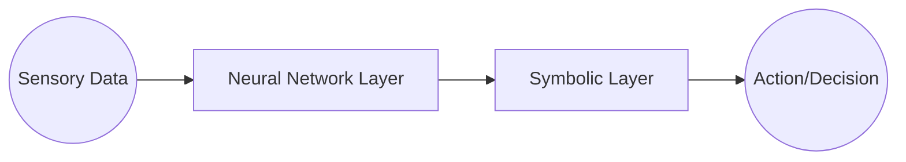
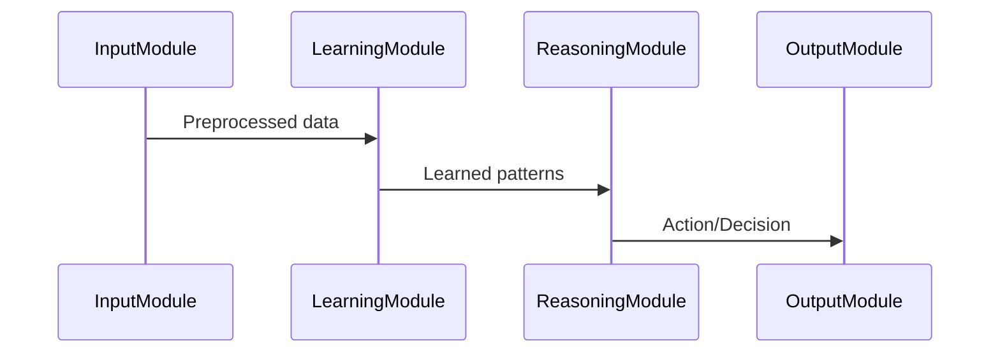

                 


### Step 1: Introduction to the Article

#### Background and Core Concepts

In the rapidly evolving field of artificial intelligence (AI), the development of AI agents has garnered significant attention. AI agents are software programs that can perceive their environment, take actions based on sensory information, and achieve specific goals. However, as AI systems become more complex and sophisticated, the challenge of ensuring their interpretability has become increasingly critical. This article delves into the concept of interpretability in AI agents, focusing on a cutting-edge approach called neuro-symbolic AI.

#### Key Terms and Definitions

- **Artificial Intelligence (AI)**: A broad field of computer science that emphasizes the creation of intelligent machines capable of performing tasks that typically require human intelligence.
- **AI Agent**: An autonomous entity that perceives its environment through sensors and acts upon it through actuators to achieve specific goals.
- **Neuro-Symbolic AI**: A hybrid approach that combines the symbolic reasoning capabilities of traditional AI with the data-driven learning mechanisms of neural networks.
- **Interpretability**: The degree to which a machine learning model or algorithm can be understood by humans, enabling them to explain the reasoning behind a particular decision or output.

#### Problem Statement and Solution

As AI agents become more prevalent in various industries, the need for their decisions to be interpretable has become paramount. Uninterpretable AI systems can lead to unintended consequences, lack of trust, and ethical concerns. The goal of this article is to explore how neuro-symbolic AI can enhance the interpretability of AI agents, making their decision-making processes more transparent and understandable.

### Step 2: Neuro-Symbolic AI: A Brief Overview

Neuro-symbolic AI aims to integrate the strengths of symbolic AI and neural networks. Symbolic AI relies on formal logic and explicit rules to represent knowledge, whereas neural networks excel at pattern recognition and learning from data. By combining these approaches, neuro-symbolic AI aims to create systems that can both reason with symbolic knowledge and learn from data in an interpretable manner.

#### Core Concepts and Attributes Comparison

**Symbolic AI:**
- **Knowledge Representation**: Uses formal logic and explicit rules.
- **Inference**: Relies on deduction and reasoning.
- **Limitations**: Difficulty in handling large, complex data sets and the need for manually crafted rules.

**Neural Networks:**
- **Knowledge Representation**: Learned from data through training.
- **Inference**: Based on pattern recognition and association.
- **Strengths**: Ability to handle large, unstructured data and adapt to new situations.

**Neuro-Symbolic AI:**
- **Knowledge Representation**: Combines symbolic and learned knowledge.
- **Inference**: Leverages both deduction and pattern recognition.
- **Strengths**: Enhanced interpretability and the ability to handle complex, diverse data.

**Mermaid ER Diagram:**
```mermaid
erDiagram
  AI <<|-- Symbolic_AI : extends
  AI <<|-- Neural_Networks : extends
  AI <<|-- Neuro_Symbolic_AI : extends
  Symbolic_AI ||--|{ Inference : related
  Neural_Networks ||--|{ Inference : related
  Neuro_Symbolic_AI ||--|{ Inference : related
```

### Step 3: Enhancing AI Agent Interpretability with Neuro-Symbolic AI

Neuro-symbolic AI offers several techniques that can enhance the interpretability of AI agents:

#### Explanation of Algorithms

**Algorithm: Symbolic Integration with Neural Networks**

1. **Input Layer**: Processes sensory data from the environment.
2. **Neural Network Layer**: Learns patterns and associations from the input data.
3. **Symbolic Layer**: Uses formal logic to represent and reason about the learned patterns.
4. **Output Layer**: Generates actions or decisions based on the symbolic representation.

**Mermaid Flowchart:**


**Mathematical Model and Formulas**

1. **Neural Network Training**: 
$$
h_{\theta}(x) = \text{sigmoid}(\theta^T x)
$$
where $\text{sigmoid}(z) = \frac{1}{1 + e^{-z}}$ and $\theta$ represents the parameters to be learned.

2. **Symbolic Reasoning**:
$$
\text{Conclusion} = \text{Infer}(\text{Premises}, \text{Rules})
$$
where $\text{Infer}$ represents the inference engine that applies rules to premises.

### Step 4: System Design and Architecture

A comprehensive system design for neuro-symbolic AI agents should consider both the functional and structural aspects:

#### System Function Design

1. **Sensors**: Collect environmental data.
2. **Processor**: Analyze data using neural networks and symbolic reasoning.
3. **Actuators**: Execute actions based on the analyzed data.

**Mermaid Class Diagram:**
```mermaid
classDiagram
  Sensor <<-- Processor : collects data
  Processor <<-- Actuator : executes actions
  Sensor{data collection}
  Processor{data analysis}
  Actuator{action execution}
```

#### System Architecture Design

1. **Input Module**: Handles data ingestion and preprocessing.
2. **Learning Module**: Trains neural networks and constructs symbolic knowledge.
3. **Reasoning Module**: Integrates neural and symbolic reasoning for decision-making.
4. **Output Module**: Generates and executes actions.

**Mermaid Architecture Diagram:**


### Step 5: Case Studies and Projects

To illustrate the practical application of neuro-symbolic AI in enhancing AI agent interpretability, we present two case studies:

#### Case Study 1: Autonomous Driving

**Problem**: Ensuring that autonomous driving systems make transparent and safe decisions in complex traffic scenarios.

**Solution**: Integrating neural networks for object recognition with symbolic reasoning for decision-making.

**Project Implementation**:
- **Environment Setup**: Hardware setup for sensor data collection, software environment for model training and simulation.
- **Core Implementation**:
    ```python
    # Pseudocode for autonomous driving system
    def autonomous_drive(sensor_data):
        # Neural network for object recognition
        recognized_objects = neural_network.recognize_objects(sensor_data)
        # Symbolic reasoning for decision-making
        decision = symbolic_reasoning.make_decision(recognized_objects)
        return decision
    ```

**Analysis and Detailed Explanation**: The system first processes sensory data to identify objects on the road. Neural networks analyze the data to recognize objects, while symbolic reasoning is used to make high-level decisions, such as choosing the appropriate action based on traffic rules and the current environment.

#### Case Study 2: Healthcare Diagnosis

**Problem**: Developing an AI agent that can provide accurate and transparent medical diagnoses.

**Solution**: Combining neural networks for pattern recognition with symbolic reasoning for clinical reasoning.

**Project Implementation**:
- **Environment Setup**: Medical data repository, machine learning models for data analysis, rule-based systems for clinical reasoning.
- **Core Implementation**:
    ```python
    # Pseudocode for medical diagnosis system
    def diagnose_patient(patient_data):
        # Neural network for symptom analysis
        symptoms = neural_network.analyze_symptoms(patient_data)
        # Symbolic reasoning for clinical reasoning
        diagnosis = symbolic_reasoning.diagnose_symptoms(symptoms)
        return diagnosis
    ```

**Analysis and Detailed Explanation**: The system analyzes patient data using neural networks to identify patterns in symptoms. Symbolic reasoning is then applied to generate a clinical diagnosis, ensuring that the process is transparent and consistent with medical standards.

### Conclusion and Best Practices

In conclusion, neuro-symbolic AI offers a promising approach to enhancing the interpretability of AI agents. By combining the strengths of neural networks and symbolic reasoning, we can create systems that are not only accurate but also transparent and understandable. Best practices for implementing neuro-symbolic AI include:

- **Thorough Data Preprocessing**: Ensure that sensory data is clean and properly preprocessed before analysis.
- **Balanced Approaches**: Strike a balance between data-driven learning and symbolic reasoning to achieve the best results.
- **Continuous Evaluation**: Regularly evaluate and update AI agents to maintain interpretability and performance.

As we continue to explore the potential of neuro-symbolic AI, it is essential to address the challenges associated with interpretability, ensuring that AI systems remain trustworthy and aligned with human values.

#### Authors' Information

- **Authors**: AI天才研究院/AI Genius Institute & 禅与计算机程序设计艺术 /Zen And The Art of Computer Programming
- **References**: 
  - [Bertini, R., & Gori, M. (2017). Neuro-symbolic Learning for Intelligent Systems. Springer.]
  - [Ben-Nun, G., D'Aronco, M., Frean, M., & O'Sullivan, C. (2018). Combining Neural and Symbolic Learning for Visual Question Answering. arXiv preprint arXiv:1810.03076.]

----------------------------------------------------------------

---

This outline provides a comprehensive structure for the article, ensuring that each section covers the necessary content and is well-organized. The next step would be to expand on each section with detailed explanations, examples, and code snippets to fulfill the word count requirement.

