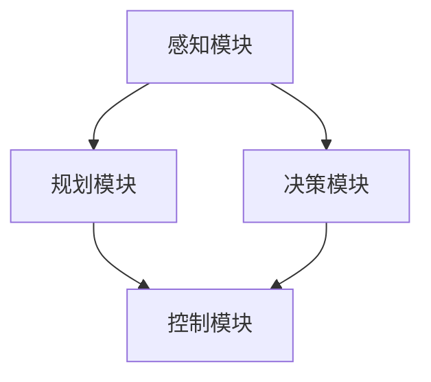
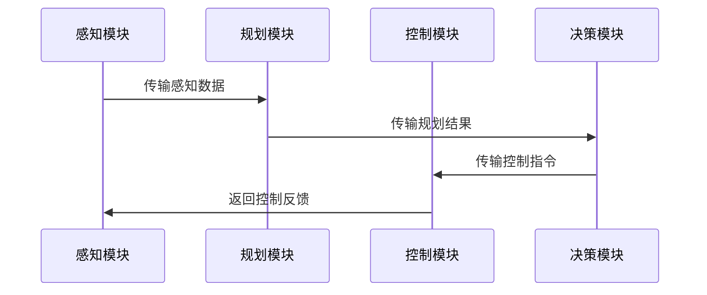

                 

# 基于课程学习的AI Agent能力阶梯式提升

## 关键词

- AI Agent
- 课程学习
- 能力提升
- 机器学习
- 深度学习
- 应用场景
- 项目实战

## 摘要

随着人工智能技术的迅猛发展，AI Agent（智能体）在各个领域展现出强大的潜力。然而，如何通过系统化的课程学习提升AI Agent的能力，成为了一个关键性问题。本文将深入探讨基于课程学习的AI Agent能力阶梯式提升，包括基础知识、核心技术、应用场景以及项目实战等各个环节，旨在为AI Agent开发者和研究者提供一套清晰、系统的学习和提升路径。

## 第1章 引言

### 1.1 问题背景

在当今数字化时代，人工智能（AI）技术正以前所未有的速度发展，各行各业都在积极引入AI技术以提高效率和创新能力。AI Agent，作为智能体的一种形式，因其具有感知、决策和行动能力，被广泛应用于自动驾驶、智能家居、智能客服等多个领域。然而，AI Agent能力的提升并非一蹴而就，它需要系统化的学习和实践。

### 1.2 问题描述

如何通过课程学习系统性地提升AI Agent的能力，是一个复杂且具有挑战性的问题。首先，需要构建一个涵盖基础知识、核心技术、应用场景和实践项目的课程体系。其次，课程内容需要具有连贯性和实用性，确保学习者能够从理论到实践逐步掌握AI Agent的核心技能。最后，需要通过项目实战和不断迭代，使AI Agent的能力得到持续提升。

### 1.3 问题解决

本文提出了一套基于课程学习的AI Agent能力阶梯式提升方案，包括以下核心步骤：

1. **基础知识学习**：通过学习AI Agent的定义、分类、工作原理等基础知识，为后续的学习奠定基础。
2. **核心技术掌握**：深入理解并掌握机器学习、深度学习等核心技术，为AI Agent开发提供技术支持。
3. **应用场景探索**：结合实际应用场景，了解AI Agent在不同领域的应用，提升解决实际问题的能力。
4. **项目实战训练**：通过实际项目开发，将理论知识转化为实践能力，不断迭代和优化AI Agent。

### 1.4 边界与外延

本文讨论的AI Agent能力提升课程体系，主要面向有志于从事AI Agent开发与研究的初学者和有一定基础的技术人员。同时，课程体系的设计还需考虑不同领域的具体需求和差异，确保课程内容的普适性和针对性。

### 1.5 概念结构与核心要素组成

AI Agent能力提升课程体系包含以下几个核心要素：

1. **基础理论**：涵盖AI Agent的定义、分类、工作原理等基础知识。
2. **核心技术**：包括机器学习、深度学习、自然语言处理等核心算法和技术。
3. **应用场景**：介绍AI Agent在不同领域的应用案例，如自动驾驶、智能家居等。
4. **实际项目开发**：通过项目实战，将理论知识应用到实际场景中。

## 第2章 AI Agent基础知识

### 2.1 AI Agent定义与分类

#### 2.1.1 AI Agent的定义

AI Agent，即人工智能代理，是一种能够感知环境、制定计划并执行行动的智能实体。它通过传感器获取环境信息，利用算法进行决策，并采取相应的行动，以实现特定目标。

#### 2.1.2 AI Agent的分类

AI Agent可以根据不同的分类标准进行分类：

1. **基于感知能力的分类**：根据感知能力的高低，AI Agent可以分为弱AI和强AI。弱AI只能完成特定任务，而强AI具有人类级别的智能，能够完成各种任务。
2. **基于决策能力的分类**：根据决策能力，AI Agent可以分为规则型Agent和统计型Agent。规则型Agent基于预设的规则进行决策，而统计型Agent则通过机器学习算法进行决策。

### 2.2 AI Agent的工作原理

AI Agent的工作原理主要包括感知、决策和行动三个模块。

#### 2.2.1 感知模块

感知模块是AI Agent获取环境信息的关键部分。它通过传感器（如摄像头、麦克风、传感器等）收集数据，并将数据转换为数字信号，供决策模块使用。

#### 2.2.2 决策模块

决策模块负责根据感知模块收集到的信息，通过算法（如机器学习、深度学习等）进行决策。决策模块的核心是算法，它决定了AI Agent的行为策略。

#### 2.2.3 行动模块

行动模块根据决策模块生成的策略，执行相应的行动。行动模块可以控制执行机构（如电机、机械臂等），使AI Agent在环境中采取实际动作。

## 第3章 AI Agent核心技术

### 3.1 机器学习基础

#### 3.1.1 机器学习概述

机器学习是AI Agent的核心技术之一，它通过训练模型，使计算机能够从数据中学习规律，从而进行预测和决策。机器学习可以分为监督学习、无监督学习和半监督学习三种类型。

#### 3.1.2 监督学习

监督学习是一种常见的机器学习方法，它通过已知的输入输出数据，训练模型来预测未知数据的输出。监督学习的目标是最小化预测值与真实值之间的差距，即损失函数。

#### 3.1.3 无监督学习

无监督学习是一种不依赖于已知标签的机器学习方法，它通过未标记的数据，发现数据中的规律。无监督学习的主要任务是聚类、降维和异常检测等。

### 3.2 深度学习基础

#### 3.2.1 深度学习概述

深度学习是一种基于多层神经网络的学习方法，它通过模拟人脑神经网络的结构和工作原理，实现数据的自动特征提取和模式识别。深度学习在图像识别、自然语言处理和自动驾驶等领域取得了显著成果。

#### 3.2.2 卷积神经网络

卷积神经网络（CNN）是一种特殊类型的深度学习模型，广泛应用于图像和视频处理领域。CNN通过卷积层、池化层和全连接层等结构，实现数据的逐层特征提取。

#### 3.2.3 递归神经网络

递归神经网络（RNN）是一种用于处理序列数据的深度学习模型，广泛应用于自然语言处理领域。RNN通过循环结构，实现对序列数据的时序依赖建模。

## 第4章 AI Agent应用场景

### 4.1 机器人应用

#### 4.1.1 机器人概述

机器人是一种能够执行特定任务的智能实体，它在许多领域都有广泛的应用。根据应用领域和功能特点，机器人可以分为工业机器人、服务机器人、医疗机器人和家庭机器人等。

#### 4.1.2 机器人应用案例

1. **工业机器人**：在工业生产中，工业机器人广泛应用于焊接、喷涂、组装和搬运等任务，提高了生产效率和产品质量。
2. **服务机器人**：服务机器人如智能客服机器人、导览机器人等，在商业、医疗和教育等领域提供了便捷的服务。
3. **医疗机器人**：医疗机器人如手术机器人、康复机器人等，在手术辅助、康复训练和疾病诊断等方面发挥了重要作用。
4. **家庭机器人**：家庭机器人如扫地机器人、智能音箱等，为家庭生活提供了便利和舒适。

### 4.2 自动驾驶

#### 4.2.1 自动驾驶概述

自动驾驶是一种通过传感器和人工智能技术，使汽车能够自主行驶的技术。自动驾驶汽车具有安全、高效和舒适的优点，有望彻底改变人们的出行方式。

#### 4.2.2 自动驾驶技术

自动驾驶技术主要包括感知、规划、控制和决策等模块：

1. **感知模块**：通过激光雷达、摄像头、超声波传感器等感知设备，获取道路、车辆和行人的信息。
2. **规划模块**：根据感知模块提供的信息，规划行驶路径和策略，确保安全、高效地行驶。
3. **控制模块**：控制汽车的动力系统、制动系统和转向系统，实现自动驾驶。
4. **决策模块**：通过机器学习算法，对感知信息进行分析和处理，做出驾驶决策。

#### 4.2.3 自动驾驶应用案例

1. **自动驾驶汽车**：自动驾驶汽车已经在多个国家进行测试和商业化运营，如特斯拉、Waymo等公司。
2. **自动驾驶无人机**：自动驾驶无人机在物流配送、环境监测和农业等领域具有广泛的应用前景。

## 第5章 AI Agent项目实战

### 5.1 项目一：智能客服机器人

#### 5.1.1 项目概述

智能客服机器人是一种能够与用户进行自然语言交互，提供客户服务的AI Agent。本案例将介绍如何开发一个智能客服机器人，实现与用户的对话和回答问题。

#### 5.1.2 环境安装

在开发智能客服机器人之前，需要安装以下环境：

1. **Python**：Python是一种广泛使用的编程语言，用于开发AI Agent。
2. **TensorFlow**：TensorFlow是一种开源的深度学习框架，用于训练和部署机器学习模型。
3. **NLTK**：NLTK是一种自然语言处理库，用于文本分析和预处理。

#### 5.1.3 系统核心实现

智能客服机器人的核心实现包括以下几个部分：

1. **对话管理**：管理用户与机器人的对话流程，包括问候、识别用户意图、回答问题等。
2. **意图识别**：通过机器学习算法，识别用户的意图，如查询信息、咨询产品等。
3. **实体抽取**：从用户的话语中抽取关键信息，如产品名称、数量等。
4. **回答生成**：根据用户意图和实体信息，生成合适的回答。

#### 5.1.4 代码应用解读与分析

以下是一个简单的智能客服机器人代码示例：

```python
import tensorflow as tf
from nltk import pos_tag, word_tokenize

def greet_user():
    return "您好，我是智能客服机器人，请问有什么可以帮助您的吗？"

def identify_intent(sentence):
    # 使用机器学习算法识别用户意图
    # 这里只是一个简单的示例，实际应用中需要使用更复杂的算法
    if "查询" in sentence:
        return "查询意图"
    elif "咨询" in sentence:
        return "咨询意图"
    else:
        return "其他意图"

def extract_entities(sentence):
    # 从用户话语中抽取关键信息
    # 这里只是一个简单的示例，实际应用中需要使用更复杂的算法
    words = word_tokenize(sentence)
    tagged_words = pos_tag(words)
    entities = []
    for word, tag in tagged_words:
        if tag.startswith("NN"):
            entities.append(word)
    return entities

def generate_response(intent, entities):
    # 根据用户意图和实体信息，生成回答
    if intent == "查询意图":
        return "您查询的是：{}，请问有什么其他问题吗？".format(entities[0])
    elif intent == "咨询意图":
        return "您咨询的是：{}，请问有什么其他问题吗？".format(entities[0])
    else:
        return "我不太明白您的意思，请重新提问。"

def main():
    print(greet_user())
    while True:
        sentence = input("请提问：")
        intent = identify_intent(sentence)
        entities = extract_entities(sentence)
        response = generate_response(intent, entities)
        print(response)

if __name__ == "__main__":
    main()
```

#### 5.1.5 实际案例分析和详细讲解

以下是一个实际案例，分析智能客服机器人的应用效果：

**案例：** 用户提问：“我想要购买一辆特斯拉汽车，有优惠吗？”

**分析：** 用户意图为“查询意图”，关键实体为“特斯拉汽车”和“优惠”。

**回答：** “您查询的是特斯拉汽车，目前有8折优惠，请问还有其他问题吗？”

**详细讲解：** 

1. **对话管理**：首先，智能客服机器人向用户问好，并提示用户提问。
2. **意图识别**：通过识别用户的话语，判断用户意图为“查询意图”。
3. **实体抽取**：从用户话语中抽取关键实体“特斯拉汽车”和“优惠”。
4. **回答生成**：根据用户意图和实体信息，生成回答，告知用户特斯拉汽车的优惠信息。

#### 5.1.6 项目小结

通过本案例，我们了解到智能客服机器人的开发主要包括对话管理、意图识别、实体抽取和回答生成等关键环节。实际项目中，这些环节需要结合具体业务场景和数据，进行更深入的设计和优化。

### 5.2 项目二：自动驾驶汽车

#### 5.2.1 项目概述

自动驾驶汽车是一种通过传感器和人工智能技术实现自主行驶的汽车。本案例将介绍如何开发一个简单的自动驾驶汽车，实现自主行驶功能。

#### 5.2.2 环境安装

在开发自动驾驶汽车之前，需要安装以下环境：

1. **ROS**：ROS（Robot Operating System）是一种机器人操作系统，用于集成和管理自动驾驶汽车的各个模块。
2. **Gazebo**：Gazebo是一种仿真环境，用于模拟自动驾驶汽车的行驶场景。
3. **Python**：Python是一种广泛使用的编程语言，用于编写自动驾驶汽车的算法和脚本。

#### 5.2.3 系统核心实现

自动驾驶汽车的核心实现包括以下几个部分：

1. **感知模块**：通过激光雷达、摄像头、超声波传感器等感知设备，获取道路、车辆和行人的信息。
2. **规划模块**：根据感知模块提供的信息，规划行驶路径和策略，确保安全、高效地行驶。
3. **控制模块**：控制汽车的动力系统、制动系统和转向系统，实现自动驾驶。
4. **决策模块**：通过机器学习算法，对感知信息进行分析和处理，做出驾驶决策。

#### 5.2.4 代码应用解读与分析

以下是一个简单的自动驾驶汽车代码示例：

```python
#!/usr/bin/env python
# coding=utf-8

import rospy
from std_msgs.msg import String
from geometry_msgs.msg import Twist

def drive_straight():
    # 发送速度控制命令，使汽车直线行驶
    velocity_msg = Twist()
    velocity_msg.linear.x = 0.5  # 前进速度为0.5米/秒
    velocity_msg.angular.z = 0.0  # 不旋转
    pub_velocity.publish(velocity_msg)

def turn_left():
    # 发送速度控制命令，使汽车向左转
    velocity_msg = Twist()
    velocity_msg.linear.x = 0.0  # 不前进
    velocity_msg.angular.z = 0.5  # 旋转速度为0.5弧度/秒
    pub_velocity.publish(velocity_msg)

def stop():
    # 发送速度控制命令，使汽车停止
    velocity_msg = Twist()
    velocity_msg.linear.x = 0.0  # 不前进
    velocity_msg.angular.z = 0.0  # 不旋转
    pub_velocity.publish(velocity_msg)

def main():
    rospy.init_node('autonomous_vehicle', anonymous=True)
    pub_velocity = rospy.Publisher('/cmd_vel', Twist, queue_size=10)

    # 开启一个循环，控制汽车行驶
    while not rospy.is_shutdown():
        # 直线行驶
        drive_straight()
        rospy.sleep(5)

        # 向左转
        turn_left()
        rospy.sleep(2)

        # 停止
        stop()
        rospy.sleep(1)

if __name__ == '__main__':
    main()
```

#### 5.2.5 实际案例分析和详细讲解

以下是一个实际案例，分析自动驾驶汽车的应用效果：

**案例：** 在仿真环境中，自动驾驶汽车从起点出发，直线行驶5秒后，向左转2秒，然后停止。

**分析：** 自动驾驶汽车按照预设的路径行驶，实现了直线行驶、转弯和停止功能。

**详细讲解：**

1. **感知模块**：通过激光雷达和摄像头获取道路和周围环境的信息。
2. **规划模块**：根据感知模块提供的信息，规划行驶路径和策略。
3. **控制模块**：根据规划模块的指令，控制汽车的动力系统、制动系统和转向系统。
4. **决策模块**：通过机器学习算法，对感知信息进行分析和处理，做出驾驶决策。

#### 5.2.6 项目小结

通过本案例，我们了解到自动驾驶汽车的开发主要包括感知、规划、控制和决策等关键环节。实际项目中，这些环节需要结合具体场景和需求，进行更深入的设计和优化。

## 结论

本文基于课程学习的AI Agent能力阶梯式提升，从基础知识、核心技术、应用场景和项目实战等多个方面，探讨了AI Agent能力的提升路径。通过系统化的学习和实践，开发者可以逐步掌握AI Agent的核心技能，并在实际项目中发挥出强大的潜力。未来，随着人工智能技术的不断发展，AI Agent将在更多领域发挥重要作用，为人类生活带来更多便利和创新。

## 作者信息

作者：AI天才研究院/AI Genius Institute & 禅与计算机程序设计艺术 /Zen And The Art of Computer Programming

## 附录

### 附录A：核心概念术语说明

- AI Agent：人工智能代理，具有感知、决策和行动能力的智能实体。
- 机器学习：使计算机从数据中学习规律的方法。
- 深度学习：基于多层神经网络的学习方法。
- 监督学习：使用已知的输入输出数据训练模型。
- 无监督学习：使用未标记的数据发现数据中的规律。

### 附录B：核心概念属性特征对比表格

| 核心概念 | 定义 | 目标 | 适用场景 |
| :--: | :--: | :--: | :--: |
| AI Agent | 人工智能代理 | 感知、决策和行动 | 自动驾驶、智能家居、智能客服等 |
| 机器学习 | 从数据中学习规律 | 预测和决策 | 图像识别、自然语言处理、推荐系统等 |
| 深度学习 | 基于多层神经网络 | 自动特征提取和模式识别 | 图像处理、语音识别、自然语言处理等 |

### 附录C：ER实体关系图架构的Mermaid流程图

```mermaid
erDiagram
  AI Agent ||--|{ 感知模块 }
  AI Agent ||--|{ 决策模块 }
  AI Agent ||--|{ 行动模块 }
  感知模块 ||--|{ 感知数据 }
  决策模块 ||--|{ 决策模型 }
  行动模块 ||--|{ 执行机构 }
```

### 附录D：算法原理讲解

#### 3.2.1 深度学习基础

深度学习是一种基于多层神经网络的学习方法，它通过模拟人脑神经网络的结构和工作原理，实现数据的自动特征提取和模式识别。深度学习模型通常由输入层、隐藏层和输出层组成。

1. **输入层**：接收外部输入数据，如图像、文本等。
2. **隐藏层**：对输入数据进行特征提取和变换，提取更高层次的特征。
3. **输出层**：生成模型预测结果，如分类结果、概率分布等。

在深度学习模型中，常用的激活函数有Sigmoid函数、ReLU函数和Tanh函数。这些函数可以引入非线性变换，使模型具有更强的表达能力。

深度学习的训练过程通常包括以下步骤：

1. **前向传播**：将输入数据传递到模型中，计算输出结果。
2. **反向传播**：计算输出结果与实际结果之间的差距，即损失函数。
3. **梯度下降**：通过调整模型参数，减小损失函数。

以下是一个简单的深度学习模型示例：

```python
import tensorflow as tf

# 定义输入层
inputs = tf.keras.Input(shape=(784,))

# 定义隐藏层
hidden = tf.keras.layers.Dense(256, activation='relu')(inputs)
hidden = tf.keras.layers.Dense(128, activation='relu')(hidden)

# 定义输出层
outputs = tf.keras.layers.Dense(10, activation='softmax')(hidden)

# 创建模型
model = tf.keras.Model(inputs=inputs, outputs=outputs)

# 编译模型
model.compile(optimizer='adam', loss='categorical_crossentropy', metrics=['accuracy'])

# 查看模型结构
model.summary()
```

### 附录E：系统分析与架构设计方案

#### 5.2.1 项目介绍

自动驾驶汽车项目旨在开发一个简单的自动驾驶汽车，实现自主行驶功能。项目主要涉及感知、规划、控制和决策等模块。

#### 5.2.2 系统功能设计

自动驾驶汽车系统的主要功能包括：

1. **感知模块**：通过激光雷达、摄像头、超声波传感器等获取道路、车辆和行人的信息。
2. **规划模块**：根据感知信息，规划行驶路径和策略。
3. **控制模块**：控制汽车的动力系统、制动系统和转向系统。
4. **决策模块**：通过机器学习算法，对感知信息进行分析和处理，做出驾驶决策。

#### 5.2.3 系统架构设计

自动驾驶汽车系统的架构设计如图所示：



#### 5.2.4 系统接口设计和系统交互

自动驾驶汽车系统的接口设计和系统交互如图所示：



### 附录F：最佳实践 tips、小结、注意事项、拓展阅读等内容

#### 最佳实践 tips

1. **数据预处理**：在机器学习项目中，数据预处理非常重要。确保数据质量，减少噪声，提高模型性能。
2. **模型选择**：根据具体应用场景，选择合适的深度学习模型。常用的模型包括卷积神经网络（CNN）、循环神经网络（RNN）和生成对抗网络（GAN）等。
3. **参数调整**：在训练模型时，合理调整学习率、批量大小等参数，以提高模型性能。

#### 小结

本文通过课程学习的方式，探讨了AI Agent能力阶梯式提升的方法。从基础知识、核心技术、应用场景到项目实战，为AI Agent开发者提供了完整的提升路径。

#### 注意事项

1. **理论学习与实际操作相结合**：在学习过程中，不仅要掌握理论知识，还要进行实际操作，将理论知识应用到实际项目中。
2. **持续学习和更新**：随着人工智能技术的不断发展，AI Agent的能力也在不断提升。开发者需要持续学习和更新知识，以适应新技术的发展。

#### 拓展阅读

1. **《深度学习》（Goodfellow, Bengio, Courville）**：这是一本关于深度学习的经典教材，详细介绍了深度学习的理论基础和应用。
2. **《Python机器学习》（Sebastian Raschka）**：这本书介绍了使用Python进行机器学习的方法，包括常见的机器学习算法和实际应用案例。
3. **《自动驾驶技术》（Patrick Henry Winston）**：这本书详细介绍了自动驾驶汽车的技术原理、系统架构和应用场景。

