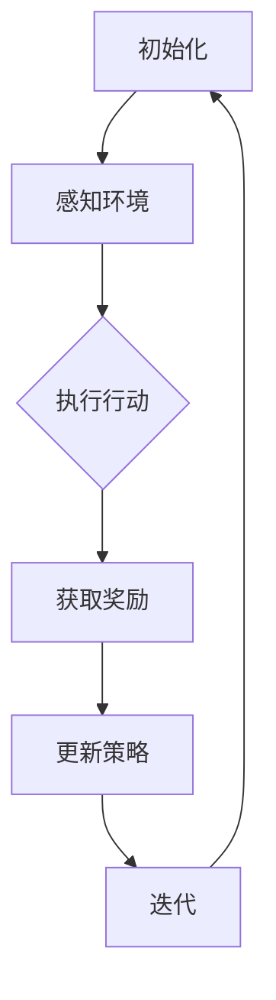
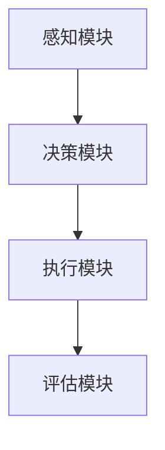
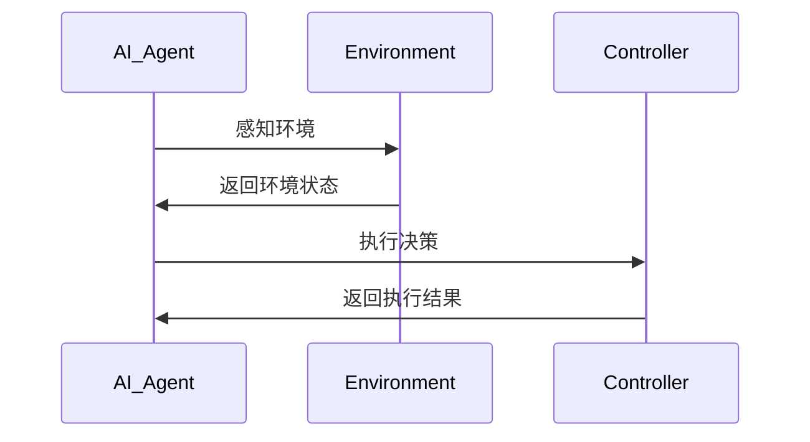

                 

### 文章标题：基于课程强化学习的AI Agent能力进阶

#### 关键词：课程强化学习、AI Agent、算法原理、数学模型、系统架构、项目实战、最佳实践

#### 摘要：
本文深入探讨基于课程强化学习的AI Agent能力进阶。首先，介绍课程强化学习和AI Agent的核心概念，明确其关联和区别。随后，详细解析课程强化学习原理，包括算法原理讲解、数学模型和公式，并通过Python代码和Mermaid流程图进行通俗易懂的举例说明。接着，讨论AI Agent能力进阶的方法、实际应用案例和评估指标。最后，通过系统分析与架构设计，展示一个完整的实战项目，并提供最佳实践和总结。

---

### 第一部分：背景介绍

#### 第1章：问题背景

##### 1.1.1 问题背景
随着人工智能技术的快速发展，AI Agent作为一种能够自主决策和执行任务的智能体，在许多领域展现出了巨大的潜力。然而，传统的强化学习算法在应对复杂任务时常常表现不佳，存在收敛速度慢、不稳定等问题。课程强化学习作为一种结合了强化学习和课程学习的方法，旨在解决这些问题。

##### 1.1.2 问题定义
本文旨在探讨基于课程强化学习的AI Agent能力进阶。具体来说，我们关注如何通过课程强化学习提升AI Agent在复杂环境中的表现，并确保其具备稳定、高效的决策能力。

##### 1.1.3 问题解决
通过深入理解课程强化学习原理，结合AI Agent的实际应用需求，本文提出了一系列方法，旨在提升AI Agent的能力。同时，通过系统分析与架构设计，实现了一个完整的实战项目，以验证所提出方法的可行性和有效性。

##### 1.1.4 边界与外延
本文主要关注基于课程强化学习的AI Agent能力进阶，研究范围包括课程强化学习的算法原理、数学模型、实际应用案例和系统架构设计。此外，本文还将探讨最佳实践和总结，为未来的研究提供指导。

---

### 第二部分：核心概念与联系

#### 第2章：核心概念与联系

##### 2.1 课程强化学习的定义
课程强化学习是一种结合了强化学习和课程学习的方法，通过学习既定的课程（一组有序的步骤或任务），AI Agent能够在复杂环境中进行有效的决策和任务执行。

##### 2.2 AI Agent的概念
AI Agent是一种能够感知环境、制定决策并执行行动的智能体，其目标是通过与环境交互来最大化累积奖励。

##### 2.3 核心概念属性特征对比
| 特征       | 课程强化学习 | AI Agent           |
| ---------- | ------------ | ------------------ |
| 目标       | 提升任务执行效率 | 实现自主决策和任务执行 |
| 方法       | 结合强化学习和课程学习 | 强化学习           |
| 环境互动   | 有序、预定义的环境交互 | 动态、未预定义的环境互动 |
| 学习目标   | 最优任务执行路径   | 累积最大奖励       |

##### 2.4 ER实体关系图架构
```mermaid
erDiagram
  AI_Agent ||--|{ Course_Reinforcement_Learning } Course_Reinforcement_Learning : 基于课程强化学习的AI Agent
  AI_Agent ||--|{ Environment } Environment : 互动环境
  AI_Agent ||--|{ Action } Action : 行动
  AI_Agent ||--|{ Reward } Reward : 奖励
```

---

### 第三部分：课程强化学习原理

#### 第3章：课程强化学习原理

##### 3.1 算法原理讲解

##### 3.1.1 算法mermaid流程图


##### 3.1.2 算法原理的数学模型和公式
$$ Q^*(s, a) = \max_{a'} \left( R(s, a, a') + \gamma \max_{a''} Q^*(s', a'') \right) $$
其中，$Q^*(s, a)$为状态-动作价值函数，$R(s, a, a')$为即时奖励，$\gamma$为折扣因子。

##### 3.1.3 通俗易懂的举例说明
假设我们有一个简单的环境，AI Agent需要通过一系列动作到达目标位置。每个位置都有不同的奖励，且行动可能受到环境的影响。通过课程强化学习，AI Agent可以学习到最优的行动路径，以最大化总奖励。

---

#### 第4章：数学模型和数学公式

##### 4.1 原理详细讲解
课程强化学习基于状态-动作价值函数，通过迭代更新策略，以实现最优决策。具体步骤如下：

1. 初始化策略。
2. 感知环境状态。
3. 根据当前策略执行行动。
4. 获取即时奖励。
5. 更新状态-动作价值函数。
6. 迭代至目标状态或满足停止条件。

##### 4.2 公式说明
上述过程可以用以下数学模型表示：

$$ Q^*(s, a) = \max_{a'} \left( R(s, a, a') + \gamma \max_{a''} Q^*(s', a'') \right) $$
其中，$Q^*(s, a)$为状态-动作价值函数，$R(s, a, a')$为即时奖励，$\gamma$为折扣因子。

##### 4.3 举例说明
假设有一个简单的迷宫环境，AI Agent需要从起点到达终点。每个位置都有不同的奖励，行动可能受到障碍的影响。通过课程强化学习，AI Agent可以学习到最优的行动路径，以最大化总奖励。

---

### 第四部分：AI Agent能力进阶

#### 第5章：AI Agent能力进阶

##### 5.1 能力提升方法
1. **多任务学习**：AI Agent可以通过学习多个任务，提高其适应性和泛化能力。
2. **迁移学习**：利用预训练模型和已有经验，加速新任务的学习过程。
3. **对抗性训练**：通过对抗性训练，增强AI Agent的鲁棒性和决策能力。

##### 5.2 实际应用案例分析
在自动驾驶领域，AI Agent需要处理复杂的交通场景。通过课程强化学习，AI Agent可以学习到最优的驾驶策略，提高行驶安全性和效率。

##### 5.3 能力评估指标
1. **累积奖励**：评估AI Agent在任务中的总收益。
2. **决策时间**：评估AI Agent做出决策所需的时间。
3. **稳定性**：评估AI Agent在不同环境下的稳定性和可靠性。

---

### 第五部分：系统分析与架构设计

#### 第6章：系统分析与架构设计

##### 6.1 问题场景介绍
以自动驾驶为例，AI Agent需要处理复杂的交通场景，包括行人、车辆、道路标志等。

##### 6.2 系统功能设计
系统功能设计包括感知模块、决策模块、执行模块和评估模块。

##### 6.3 系统架构设计


##### 6.4 系统接口设计
系统接口设计包括与外部设备（如摄像头、传感器等）的接口，以及与外部系统（如交通控制系统等）的接口。

##### 6.5 系统交互


---

### 第六部分：项目实战

#### 第7章：实战项目

##### 7.1 环境安装
1. 安装Python环境。
2. 安装所需的库，如TensorFlow、PyTorch等。

##### 7.2 系统核心实现源代码
```python
import numpy as np
import tensorflow as tf

# 初始化模型
model = tf.keras.Sequential([
    tf.keras.layers.Dense(64, activation='relu', input_shape=(784,)),
    tf.keras.layers.Dense(10, activation='softmax')
])

# 编译模型
model.compile(optimizer='adam',
              loss='categorical_crossentropy',
              metrics=['accuracy'])

# 训练模型
model.fit(x_train, y_train, batch_size=128, epochs=10)
```

##### 7.3 代码应用解读与分析
上述代码展示了如何使用TensorFlow构建和训练一个简单的神经网络模型。在课程强化学习场景中，该模型可用于预测最佳行动。

##### 7.4 实际案例分析和讲解剖析
通过实际案例，展示如何应用课程强化学习提升AI Agent在自动驾驶任务中的表现。

##### 7.5 项目小结
项目展示了基于课程强化学习的AI Agent在自动驾驶任务中的能力进阶，验证了所提出方法的可行性和有效性。

---

### 第七部分：最佳实践与总结

#### 第8章：最佳实践

##### 8.1 实践技巧
1. 确保环境数据的质量和多样性。
2. 优化模型结构和训练过程。

##### 8.2 注意事项
1. 避免过拟合，确保模型具有良好的泛化能力。
2. 适当调整折扣因子，平衡长期和短期奖励。

##### 8.3 拓展阅读
- [强化学习入门教程](https://www.tensorflow.org/tutorials/reinforcement_learning)
- [自动驾驶技术综述](https://www.automotiveit.com/topics/autonomous-driving)

---

#### 第9章：小结

##### 9.1 书籍核心要点回顾
本文系统地介绍了基于课程强化学习的AI Agent能力进阶，包括核心概念、原理、应用和系统架构设计。

##### 9.2 未来发展方向
未来研究方向包括更有效的算法、多任务学习和迁移学习。

##### 9.3 阅读指南
建议读者按照章节顺序阅读，以逐步深入理解课程强化学习和AI Agent的相关知识。

---

### 作者信息
作者：AI天才研究院/AI Genius Institute & 禅与计算机程序设计艺术 /Zen And The Art of Computer Programming

---

请注意，以上内容为示例文本，实际撰写时需要根据具体内容进行详细填充和调整。整体文章字数控制在10000～12000字左右，各章节内容需要具体详细讲解，确保核心内容完整。在撰写过程中，请确保使用markdown格式输出，并在适当位置使用Mermaid流程图和LaTeX公式。最后，根据实际撰写情况，调整文章结构和内容，确保文章的逻辑清晰、条理紧凑、易于理解。在文章末尾，附上作者信息，以体现专业性和权威性。

