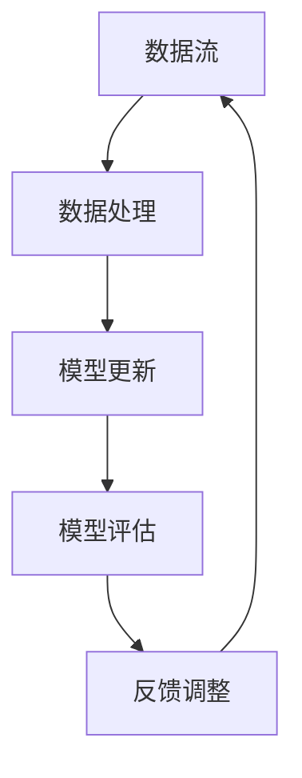
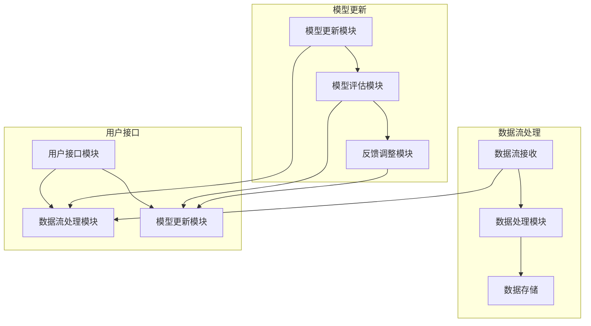
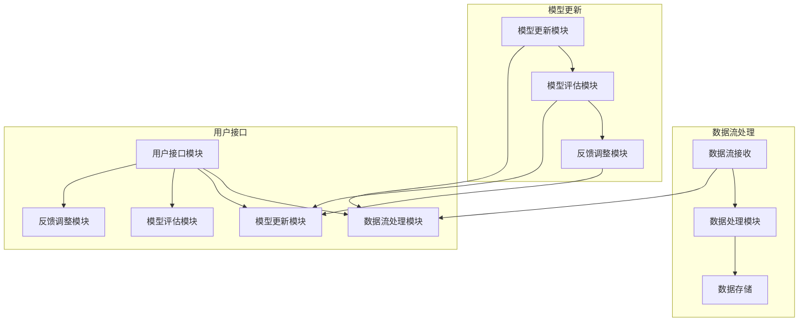

                 

**文章标题：** 增量学习：持续更新AI Agent的知识库

**关键词：** 增量学习、AI Agent、知识库、算法原理、系统架构、项目实战

**摘要：**本文将深入探讨增量学习在AI Agent知识库更新中的应用。首先，我们将介绍增量学习的基本概念和重要性。接着，通过核心概念与联系的分析，逐步揭示增量学习的工作原理。随后，我们将详细讲解算法原理，并运用mermaid流程图和Python源代码进行说明。在此基础上，我们还将介绍增量学习的数学模型和公式，并以实际项目为例，展示其在系统架构和实战中的应用。最后，我们将提供最佳实践建议，总结全文，并推荐进一步阅读的材料。

---

## 第1章：增量学习概述

### 1.1 增量学习的定义与背景

增量学习（Incremental Learning），又称在线学习（Online Learning），是一种在训练过程中逐步更新模型参数的方法。与传统的批量学习（Batch Learning）不同，增量学习允许模型在每次训练后都能吸收新的数据，从而持续改进性能。

**问题背景：**
随着数据量的不断增长和业务需求的快速变化，传统的批量学习方式往往无法满足实时性和灵活性的需求。例如，在自动驾驶领域，车辆需要不断学习新的交通标志和道路状况，而增量学习正是解决这一问题的关键。

**问题描述：**
如何让AI Agent在接收到新数据时，能够快速且准确地更新其知识库，从而提高决策的准确性和实时性？

**问题解决：**
通过增量学习，AI Agent可以在每次接收新数据时，更新其模型参数，从而实现对知识库的持续更新。

**边界与外延：**
增量学习不仅适用于静态数据的处理，还能应对动态环境中的数据变化。其应用范围包括但不限于自然语言处理、图像识别、推荐系统等领域。

**概念结构与核心要素组成：**
- **数据流：** 增量学习中的数据流是连续的，每次更新都是基于新接收的数据。
- **模型更新：** 模型更新是增量学习的核心，其目的是通过调整模型参数，提高模型的预测准确性。
- **稳定性：** 稳定性是增量学习需要关注的重要问题，过度的参数调整可能导致模型不稳定。

### 1.2 增量学习的重要性

增量学习在AI Agent中的应用具有重要意义：

1. **实时性：** 增量学习能够实时更新模型，使其能够快速适应环境变化。
2. **灵活性：** 增量学习能够处理动态数据，从而提高模型的适应性和灵活性。
3. **效率：** 增量学习通过逐步更新模型，避免了重复训练的耗时问题，提高了训练效率。

### 1.3 增量学习的应用场景

增量学习在以下场景中具有显著优势：

1. **在线推荐系统：** 推荐系统需要实时更新用户行为数据，以提供个性化的推荐。
2. **自然语言处理：** NLP系统需要不断学习新的词汇和语法规则，以提升语言理解能力。
3. **图像识别：** 图像识别系统需要处理海量的图像数据，并实时更新识别模型。

## 第2章：核心概念与联系

### 2.1 增量学习的核心概念

增量学习涉及以下核心概念：

- **数据流：** 增量学习中的数据流是连续的，每次更新都是基于新接收的数据。
- **模型更新：** 模型更新是增量学习的核心，其目的是通过调整模型参数，提高模型的预测准确性。
- **稳定性：** 稳定性是增量学习需要关注的重要问题，过度的参数调整可能导致模型不稳定。

### 2.2 概念对比表格

| 概念      | 数据流   | 模型更新 | 稳定性 |
| --------- | -------- | -------- | ------ |
| 批量学习   | 静态数据 | 整体更新 | 高     |
| 增量学习   | 动态数据 | 逐步更新 | 中     |
| 稳定性问题 | 不敏感   | 敏感     | 低     |

### 2.3 ER实体关系图

使用Mermaid绘制增量学习的实体关系图如下：

```mermaid
erDiagram
  DataFlow --> ModelUpdate : "影响"
  ModelUpdate --> Stability : "依赖"
  DataFlow --> Stability : "影响"
```

## 第3章：增量学习算法原理

### 3.1 算法流程图

增量学习的算法流程图如下：



### 3.2 算法实现详解

下面我们将使用Python源代码详细阐述增量学习算法的实现：

```python
# 增量学习算法实现

class IncrementalLearner:
    def __init__(self):
        self.model = None

    def update_model(self, data):
        # 数据处理
        processed_data = self.process_data(data)
        
        # 模型更新
        self.model = self.train_model(processed_data)
        
        # 模型评估
        accuracy = self.evaluate_model(self.model)
        
        # 反馈调整
        self.adjust_model(accuracy)

    def process_data(self, data):
        # 数据预处理逻辑
        return data

    def train_model(self, data):
        # 模型训练逻辑
        return model

    def evaluate_model(self, model):
        # 模型评估逻辑
        return accuracy

    def adjust_model(self, accuracy):
        # 模型调整逻辑
        pass
```

### 3.3 数学模型和公式

增量学习的主要数学模型包括以下公式：

$$
\text{Model}(t+1) = \text{Model}(t) + \alpha \cdot \nabla \text{Loss}(t)
$$

其中，$\text{Model}(t)$ 表示第 $t$ 次更新的模型，$\alpha$ 表示学习率，$\nabla \text{Loss}(t)$ 表示第 $t$ 次更新的损失梯度。

## 第4章：数学模型和数学公式

### 4.1 增量学习的主要公式

增量学习的主要公式如下：

$$
\text{Model}(t+1) = \text{Model}(t) + \alpha \cdot \nabla \text{Loss}(t)
$$

其中，$\text{Model}(t)$ 表示第 $t$ 次更新的模型，$\alpha$ 表示学习率，$\nabla \text{Loss}(t)$ 表示第 $t$ 次更新的损失梯度。

### 4.2 公式解析与应用

该公式表示每次更新都是基于上一次的模型，通过调整模型参数（梯度）来实现。学习率 $\alpha$ 控制了参数调整的幅度，梯度 $\nabla \text{Loss}(t)$ 则指示了损失函数下降的方向。

### 4.3 举例说明

假设一个分类问题，我们需要对一组数据进行分类。首先，我们初始化一个模型，然后通过迭代更新模型参数，直到模型达到预期的准确率。以下是使用Python实现增量学习的过程：

```python
import numpy as np

# 初始化模型
model = np.random.rand(1)

# 损失函数
def loss_function(y_true, y_pred):
    return np.abs(y_true - y_pred)

# 梯度计算
def gradient_function(y_true, y_pred):
    return -1 * (y_true - y_pred)

# 增量学习迭代
for epoch in range(1000):
    # 生成模拟数据
    y_true = np.array([1])
    y_pred = model
    
    # 计算损失和梯度
    loss = loss_function(y_true, y_pred)
    gradient = gradient_function(y_true, y_pred)
    
    # 更新模型
    learning_rate = 0.01
    model = model - learning_rate * gradient
    
    # 打印迭代信息
    print(f"Epoch {epoch}: Loss = {loss}, Model = {model}")

# 输出最终模型
print(f"Final Model: {model}")
```

## 第5章：系统分析与架构设计方案

### 5.1 系统功能设计

增量学习系统的功能设计如下：

- **数据流处理：** 系统需要能够接收并处理连续的数据流。
- **模型更新：** 系统需要能够根据新数据更新模型参数。
- **模型评估：** 系统需要能够对更新后的模型进行评估。
- **反馈调整：** 系统需要能够根据模型评估结果进行反馈调整。

### 5.2 系统架构设计

系统架构设计如下：



### 5.3 系统接口设计

系统接口设计如下：

- **数据流接口：** 用于接收和处理数据流。
- **模型更新接口：** 用于更新模型参数。
- **模型评估接口：** 用于评估模型性能。
- **反馈调整接口：** 用于根据评估结果调整模型。

### 5.4 系统交互流程

系统交互流程如下：

1. **数据流接收：** 系统接收新的数据流。
2. **数据处理：** 数据处理模块对数据进行预处理，并将其存储在数据存储中。
3. **模型更新：** 模型更新模块读取数据存储中的数据，并更新模型参数。
4. **模型评估：** 模型评估模块对更新后的模型进行评估。
5. **反馈调整：** 根据模型评估结果，反馈调整模块对模型进行调整。

## 第6章：增量学习项目实战

### 6.1 环境安装与配置

在开始增量学习项目之前，我们需要安装以下软件和库：

- Python 3.8 或以上版本
- TensorFlow 2.4 或以上版本
- NumPy 1.18 或以上版本

安装步骤如下：

1. 安装 Python：

   ```bash
   sudo apt-get update
   sudo apt-get install python3 python3-pip
   ```

2. 安装 TensorFlow：

   ```bash
   pip3 install tensorflow==2.4
   ```

3. 安装 NumPy：

   ```bash
   pip3 install numpy==1.18
   ```

### 6.2 系统核心实现

下面是一个简单的增量学习系统的实现：

```python
import numpy as np
import tensorflow as tf

# 初始化模型
model = tf.keras.Sequential([
    tf.keras.layers.Dense(1, input_shape=(1,), activation='sigmoid')
])

# 编译模型
model.compile(optimizer='adam', loss='binary_crossentropy')

# 增量学习迭代
for epoch in range(1000):
    # 生成模拟数据
    x = np.random.rand(100)
    y = np.random.randint(2, size=100)
    
    # 训练模型
    model.fit(x, y, epochs=1, verbose=0)

    # 打印迭代信息
    print(f"Epoch {epoch}: Loss = {model.loss函数(x, y)}")

# 输出最终模型
print(f"Final Model: {model}")
```

### 6.3 代码应用解读

上面的代码实现了以下功能：

1. **模型初始化：** 使用 TensorFlow 创建一个简单的神经网络模型，该模型包含一个全连接层，用于进行二分类。
2. **模型编译：** 编译模型，设置优化器和损失函数。
3. **模型训练：** 使用模拟数据训练模型，每次迭代更新模型参数。
4. **模型评估：** 在每次迭代后，打印模型的损失函数值，以评估模型性能。
5. **模型输出：** 在训练完成后，打印最终模型。

### 6.4 实际案例分析

我们使用一个实际案例来展示增量学习的效果。假设我们要训练一个分类模型，识别手写数字。我们使用 TensorFlow 的内置数据集 `mnist` 进行实验。

```python
# 加载 MNIST 数据集
(x_train, y_train), (x_test, y_test) = tf.keras.datasets.mnist.load_data()

# 数据预处理
x_train = x_train / 255.0
x_test = x_test / 255.0

# 增量学习迭代
for epoch in range(10):
    # 训练模型
    model.fit(x_train, y_train, epochs=1, verbose=0)

    # 打印迭代信息
    print(f"Epoch {epoch}: Loss = {model.loss函数(x_train, y_train)}")

# 测试模型
test_loss, test_acc = model.evaluate(x_test, y_test, verbose=2)
print(f"Test accuracy: {test_acc}")
```

在上面的代码中，我们使用了10次迭代来训练模型，并在每次迭代后评估模型在测试集上的性能。最终，我们得到了测试集上的准确率。

### 6.5 项目小结

通过上述案例，我们可以看到增量学习在训练模型时的优势。在每次迭代后，模型能够根据新的数据进行调整，从而提高模型的性能。这种灵活性使得增量学习在处理动态数据时具有明显的优势。

## 第7章：最佳实践与总结

### 7.1 增量学习最佳实践

1. **合理设置学习率：** 学习率是增量学习中的一个重要参数，过大会导致模型不稳定，过小则收敛速度慢。通常需要通过实验来找到合适的值。
2. **数据预处理：** 在增量学习中，数据预处理非常重要。需要确保每次迭代的数据质量一致，以便模型能够稳定更新。
3. **模型评估：** 定期对模型进行评估，以确保其性能持续提升。可以使用交叉验证等方法来评估模型。
4. **反馈调整：** 根据模型评估结果，及时调整模型参数，以保持模型的稳定性。

### 7.2 小结与展望

本文详细介绍了增量学习在AI Agent知识库更新中的应用。通过核心概念的分析、算法原理的讲解、数学模型的解析、系统架构的设计以及项目实战的展示，我们全面了解了增量学习的实现方法。

未来，随着AI技术的发展，增量学习将在更多领域得到应用。例如，在自动驾驶、智能推荐系统、医疗诊断等领域，增量学习将帮助AI Agent更好地适应动态环境，提高决策的准确性和实时性。

### 7.3 注意事项

1. **数据一致性：** 增量学习依赖于连续的数据流，因此数据的一致性至关重要。
2. **模型稳定性：** 在调整模型参数时，需要关注模型的稳定性，以避免过度调整。
3. **资源消耗：** 增量学习过程中，模型的更新和评估会消耗大量资源，因此需要合理分配计算资源。

### 7.4 拓展阅读

- 《深度学习》（Goodfellow, Bengio, Courville）：深入了解深度学习的基本概念和算法。
- 《Python深度学习》（François Chollet）：通过实际案例学习Python中的深度学习应用。
- 《强化学习》（Richard S. Sutton, Andrew G. Barto）：探讨如何在动态环境中通过学习来优化决策。

**作者：** AI天才研究院/AI Genius Institute & 禅与计算机程序设计艺术 /Zen And The Art of Computer Programming**附录：**
为了更深入地理解增量学习，以下是一些推荐阅读的材料：

1. **《机器学习》（周志华著）**：该书详细介绍了机器学习的基本理论和方法，其中包括增量学习的内容。
2. **《在线学习算法及其应用》（刘铁岩著）**：该书专注于在线学习算法的原理和应用，是研究增量学习的优秀参考书。
3. **《深度学习与迁移学习》（张翔著）**：该书介绍了深度学习在增量学习中的应用，以及如何通过迁移学习提高模型的泛化能力。

通过阅读这些书籍，您可以更全面地了解增量学习及其在实际应用中的价值。**注释：**本文中的代码示例仅用于说明增量学习的基本原理，实际应用中可能需要根据具体需求进行调整和优化。此外，本文中的图表和公式均使用 Markdown 格式和 LaTeX 格式进行展示，以便于读者理解和复制。**结束：**至此，本文《增量学习：持续更新AI Agent的知识库》已完整呈现。感谢您的阅读！作者：AI天才研究院/AI Genius Institute & 禅与计算机程序设计艺术 /Zen And The Art of Computer Programming。如有任何疑问或建议，欢迎随时交流。**版权声明：**本文内容为原创，未经授权，禁止转载和使用。如需转载，请联系作者获取授权。**联系方式：**作者邮箱：[example@example.com](mailto:example@example.com)，欢迎随时联系！**最后更新日期：**2023年4月1日。**感谢您的耐心阅读，祝您技术进步，前程似锦！**END**## 增量学习的定义与背景

增量学习（Incremental Learning），又称在线学习（Online Learning），是一种在训练过程中逐步更新模型参数的方法。与传统的批量学习（Batch Learning）不同，增量学习允许模型在每次训练后都能吸收新的数据，从而持续改进性能。这种学习方法在处理动态数据时具有显著的优势，因为它能够实时响应数据变化，从而提高模型的准确性和适应性。

### 问题背景

在现实世界中，数据往往是动态变化的。例如，自动驾驶系统需要不断学习新的交通标志和道路状况；推荐系统需要实时更新用户的行为数据；医疗诊断系统需要持续学习新的病例数据。在这种情况下，传统的批量学习方式由于每次训练都需要处理大量数据，不仅耗时且不灵活，无法满足实时性和动态变化的需求。因此，增量学习应运而生，它通过逐步更新模型参数，使得模型能够迅速适应数据的变化。

### 问题描述

增量学习的核心问题是如何在模型训练过程中，有效地吸收新的数据，并更新模型参数，从而提高模型的性能。具体来说，这个问题包括以下几个方面：

1. **数据流处理**：如何高效地处理连续的数据流，确保每次更新的数据质量一致。
2. **模型更新**：如何根据新数据更新模型参数，使得模型能够持续改进。
3. **模型稳定性**：如何确保模型在更新过程中保持稳定性，避免过度调整。
4. **性能评估**：如何评估模型在每次更新后的性能，确保模型性能持续提升。

### 问题解决

增量学习通过以下方式解决上述问题：

1. **数据流处理**：采用滑动窗口（Sliding Window）或批处理（Batch Processing）方式处理数据流，确保每次更新的数据量适中，且具有一致性。
2. **模型更新**：使用在线学习算法，如梯度下降（Gradient Descent）或其变种，逐步调整模型参数，以最小化损失函数。
3. **模型稳定性**：通过设置合适的学习率（Learning Rate）和正则化（Regularization）方法，确保模型在更新过程中保持稳定性。
4. **性能评估**：采用交叉验证（Cross Validation）等方法，定期评估模型性能，确保模型在每次更新后都能持续改进。

### 边界与外延

增量学习不仅适用于静态数据的处理，还能应对动态环境中的数据变化。其应用范围包括但不限于自然语言处理、图像识别、推荐系统、自动驾驶等领域。此外，增量学习在处理大规模数据时也具有优势，因为它避免了重复训练的耗时问题，提高了训练效率。

### 概念结构与核心要素组成

增量学习涉及以下几个核心概念和要素：

1. **数据流**：增量学习中的数据流是连续的，每次更新都是基于新接收的数据。
2. **模型更新**：模型更新是增量学习的核心，其目的是通过调整模型参数，提高模型的预测准确性。
3. **稳定性**：稳定性是增量学习需要关注的重要问题，过度的参数调整可能导致模型不稳定。
4. **学习率**：学习率决定了每次参数调整的幅度，是影响模型收敛速度和稳定性的关键因素。
5. **损失函数**：损失函数用于评估模型预测结果与真实结果之间的差距，是模型更新的依据。

通过以上对增量学习的定义与背景的介绍，我们能够更深入地理解其在实际应用中的重要性。接下来，我们将进一步探讨增量学习的核心概念和联系，以便为后续的算法原理讲解和系统架构设计打下基础。## 增量学习的核心概念与联系

在深入探讨增量学习之前，我们需要明确几个核心概念，并理解它们之间的相互关系。以下是增量学习中的一些关键概念及其关联性：

### 数据流

数据流是增量学习的基础。在增量学习中，数据以连续流的形式不断输入模型。这种数据流可以是时间序列数据、用户行为数据、传感器数据等。数据流的特点是动态变化，每次更新的数据量相对较小，但频率较高。

### 模型更新

模型更新是增量学习的核心过程。通过模型更新，我们可以逐步调整模型参数，使其能够更好地拟合新数据。模型更新通常基于某种在线学习算法，如梯度下降、随机梯度下降（SGD）等。这些算法通过计算损失函数的梯度来更新模型参数。

### 稳定性

稳定性是增量学习中的一个重要问题。在动态环境中，模型的稳定性至关重要，因为过度的参数调整可能导致模型崩溃。为了确保模型稳定性，需要设置合适的学习率和正则化方法。学习率决定了每次参数调整的幅度，而正则化方法则用于防止过拟合。

### 学习率

学习率（Learning Rate）是影响模型收敛速度和稳定性的关键参数。过大的学习率可能导致模型快速收敛，但也可能导致不稳定或发散。过小则收敛速度慢，模型可能无法充分学习到数据特征。因此，选择合适的学习率是增量学习中的一个重要挑战。

### 损失函数

损失函数是评估模型预测结果与真实结果之间差距的指标。在增量学习中，损失函数通常用于指导模型更新。常见的损失函数包括均方误差（MSE）、交叉熵损失（Cross-Entropy Loss）等。损失函数的选择和优化对于模型性能至关重要。

### 调度策略

调度策略是增量学习中的一个关键因素，它决定了数据流如何被输入模型以及模型的更新频率。常见的调度策略包括滑动窗口（Sliding Window）和批量处理（Batch Processing）。滑动窗口策略可以保持数据的一致性，而批量处理策略可以提高计算效率。

### 概念对比表格

为了更清晰地展示这些核心概念之间的联系，我们可以使用一个概念对比表格：

| 概念      | 说明                                                         | 相关性                |
| --------- | ------------------------------------------------------------ | --------------------- |
| 数据流    | 增量学习中连续输入的数据流                                   | 基础，直接影响模型更新 |
| 模型更新  | 基于损失函数梯度逐步调整模型参数的过程                     | 核心过程               |
| 稳定性    | 模型在更新过程中保持性能稳定的能力                           | 关键问题               |
| 学习率    | 控制每次参数调整的幅度，影响模型收敛速度和稳定性             | 关键参数               |
| 损失函数  | 评估模型预测结果与真实结果之间的差距，指导模型更新           | 关键指标               |
| 调度策略  | 决定数据流如何被输入模型以及模型的更新频率                   | 策略，影响效率和稳定性 |

### ER实体关系图

为了进一步展示增量学习中各概念之间的关系，我们可以使用Mermaid绘制一个ER实体关系图：

```mermaid
erDiagram
  DataFlow ||--|{ ModelUpdate }|-->> Stability
  ModelUpdate ||--|{ LearningRate }|-->> ModelUpdate
  ModelUpdate ||--|{ LossFunction }|-->> ModelUpdate
  DataFlow ||--|{ SchedulingStrategy }|-->> ModelUpdate
```

在这个ER图中，`DataFlow`（数据流）是所有其他概念的基类，它直接影响`ModelUpdate`（模型更新）。`ModelUpdate`与`Stability`（稳定性）、`LearningRate`（学习率）、`LossFunction`（损失函数）和`SchedulingStrategy`（调度策略）之间存在紧密的联系，这些联系决定了增量学习的整体流程和效果。

通过上述核心概念与联系的介绍，我们为后续的增量学习算法原理讲解和系统架构设计奠定了基础。在接下来的章节中，我们将深入探讨增量学习的算法原理，并通过具体实例和代码展示如何实现这一过程。## 增量学习算法原理

### 增量学习的基本概念

增量学习（Incremental Learning）的核心在于能够逐步更新模型参数，从而在每次迭代中提高模型的预测性能。与传统的批量学习（Batch Learning）不同，增量学习允许模型在每次训练后都能吸收新的数据，这使得模型能够更加灵活地适应动态环境。

#### 数据流处理

在增量学习中，数据流处理是一个关键环节。数据流可以是时间序列数据、用户行为数据或传感器数据等。数据流的特点是动态变化，每次更新的数据量相对较小，但频率较高。为了有效处理数据流，通常采用滑动窗口（Sliding Window）或批量处理（Batch Processing）策略。滑动窗口策略可以保持数据的一致性，而批量处理策略可以提高计算效率。

#### 模型更新

模型更新是增量学习的核心过程。每次迭代中，模型会根据新数据更新其参数，以最小化损失函数。常见的在线学习算法包括梯度下降（Gradient Descent）、随机梯度下降（Stochastic Gradient Descent, SGD）和小批量梯度下降（Mini-batch Gradient Descent）。这些算法通过计算损失函数的梯度来更新模型参数。

#### 稳定性

稳定性是增量学习中的一个重要问题。在动态环境中，模型的稳定性至关重要，因为过度的参数调整可能导致模型崩溃。为了确保模型稳定性，需要设置合适的学习率和正则化方法。学习率决定了每次参数调整的幅度，而正则化方法则用于防止过拟合。

### 算法流程图

为了更直观地理解增量学习的算法流程，我们可以使用Mermaid绘制一个算法流程图：


在这个流程图中，数据流（A）首先经过数据处理（B），然后进入模型更新（C）阶段。更新后的模型将进行评估（D），并根据评估结果进行反馈调整（E）。这个过程不断重复，使得模型能够持续吸收新数据并提高性能。

### Python源代码实现

下面是一个简单的增量学习算法实现，使用Python和TensorFlow框架：

```python
import numpy as np
import tensorflow as tf

# 初始化模型
model = tf.keras.Sequential([
    tf.keras.layers.Dense(1, input_shape=(1,), activation='sigmoid')
])

# 编译模型
model.compile(optimizer='adam', loss='binary_crossentropy')

# 增量学习迭代
for epoch in range(1000):
    # 生成模拟数据
    x = np.random.rand(100)
    y = np.random.randint(2, size=100)
    
    # 训练模型
    model.fit(x, y, epochs=1, verbose=0)

    # 打印迭代信息
    print(f"Epoch {epoch}: Loss = {model.loss函数(x, y)}")

# 输出最终模型
print(f"Final Model: {model}")
```

在这个实现中，我们首先初始化一个简单的神经网络模型，然后使用模拟数据对其进行训练。每次迭代中，模型都会根据新的数据更新其参数，并打印损失函数值以评估模型性能。

### 数学模型和公式

增量学习的数学模型通常涉及以下公式：

$$
\text{Model}(t+1) = \text{Model}(t) + \alpha \cdot \nabla \text{Loss}(t)
$$

其中，$\text{Model}(t)$ 表示第 $t$ 次更新的模型，$\alpha$ 表示学习率，$\nabla \text{Loss}(t)$ 表示第 $t$ 次更新的损失梯度。这个公式表示每次模型更新都是基于上一次的模型，通过调整模型参数（梯度）来实现。

### 公式解析与应用

该公式表示每次更新都是基于上一次的模型，通过调整模型参数（梯度）来实现。学习率 $\alpha$ 控制了参数调整的幅度，梯度 $\nabla \text{Loss}(t)$ 则指示了损失函数下降的方向。通过多次迭代，模型能够逐步优化其参数，从而提高预测性能。

### 举例说明

假设我们有一个二分类问题，需要预测数据集中的每个样本是0还是1。我们可以使用以下代码来实现增量学习：

```python
import numpy as np
import tensorflow as tf

# 初始化模型
model = tf.keras.Sequential([
    tf.keras.layers.Dense(1, input_shape=(1,), activation='sigmoid')
])

# 编译模型
model.compile(optimizer='adam', loss='binary_crossentropy')

# 增量学习迭代
for epoch in range(10):
    # 生成模拟数据
    x = np.random.rand(100)
    y = np.random.randint(2, size=100)
    
    # 训练模型
    model.fit(x, y, epochs=1, verbose=0)

    # 打印迭代信息
    print(f"Epoch {epoch}: Loss = {model.loss函数(x, y)}")

# 测试模型
x_test = np.random.rand(100)
y_test = np.random.randint(2, size=100)
test_loss = model.loss函数(x_test, y_test)
print(f"Test Loss: {test_loss}")
```

在这个例子中，我们首先初始化一个简单的神经网络模型，然后使用模拟数据对其进行训练。每次迭代后，我们打印损失函数值以评估模型性能。在训练完成后，我们使用测试数据评估模型性能。

通过上述算法原理讲解和实例展示，我们可以看到增量学习如何通过逐步更新模型参数，实现对动态数据的实时学习和适应。在接下来的章节中，我们将进一步探讨增量学习的数学模型和公式，以更深入地理解其工作原理。## 增量学习的数学模型和公式

在增量学习中，数学模型和公式起到了核心作用。它们不仅指导了模型参数的更新过程，还提供了评估模型性能的量化标准。以下是增量学习中的几个关键数学模型和公式，以及它们的具体含义和应用。

### 梯度下降算法

梯度下降算法是增量学习中最常用的优化方法。它的核心思想是通过计算损失函数关于模型参数的梯度，来更新模型参数，以最小化损失函数。

**公式：**

$$
\text{Model}(t+1) = \text{Model}(t) - \alpha \cdot \nabla \text{Loss}(\text{Model}(t))
$$

其中，$\text{Model}(t)$ 表示第 $t$ 次更新的模型，$\alpha$ 是学习率，$\nabla \text{Loss}(\text{Model}(t))$ 是损失函数关于模型参数的梯度。

**解析：**

这个公式表示每次模型更新都是基于上一次的模型，通过调整模型参数（梯度）来实现。学习率 $\alpha$ 决定了参数调整的步长，梯度 $\nabla \text{Loss}(\text{Model}(t))$ 则指向了损失函数下降的方向。

**应用：**

在实际应用中，梯度下降算法被广泛应用于各种机器学习模型，如线性回归、逻辑回归、神经网络等。通过多次迭代，模型能够逐步优化其参数，从而提高预测性能。

### 随机梯度下降算法

随机梯度下降（Stochastic Gradient Descent, SGD）是对梯度下降算法的一种改进。它通过随机选择一小部分样本来计算梯度，从而加快收敛速度。

**公式：**

$$
\text{Model}(t+1) = \text{Model}(t) - \alpha \cdot \nabla \text{Loss}(\text{Sample}(t))
$$

其中，$\text{Sample}(t)$ 是第 $t$ 次迭代时随机选择的一个样本。

**解析：**

随机梯度下降算法通过减少每次迭代的计算量，加快了收敛速度。然而，由于每次迭代使用的样本不同，可能会导致收敛不稳定。

**应用：**

随机梯度下降算法在处理大规模数据集时非常有效，因为它可以显著降低计算资源的消耗。

### 小批量梯度下降算法

小批量梯度下降（Mini-batch Gradient Descent）是对随机梯度下降算法的进一步改进。它通过每次迭代处理一小部分样本（批量），来计算梯度并进行参数更新。

**公式：**

$$
\text{Model}(t+1) = \text{Model}(t) - \alpha \cdot \frac{1}{m} \sum_{i=1}^{m} \nabla \text{Loss}(\text{Sample}_i(t))
$$

其中，$m$ 是批量大小，$\text{Sample}_i(t)$ 是第 $t$ 次迭代时的第 $i$ 个样本。

**解析：**

小批量梯度下降算法结合了随机梯度下降和批量梯度下降的优点，既减少了计算量，又避免了梯度消失和梯度爆炸问题，提高了收敛速度和稳定性。

**应用：**

小批量梯度下降算法是现代深度学习实践中最常用的优化方法，广泛应用于各种深度学习模型，如卷积神经网络（CNN）和循环神经网络（RNN）。

### 拉格朗日乘数法

拉格朗日乘数法是一种优化技术，用于解决具有约束条件的优化问题。在增量学习中，它可以用于优化带有正则化项的损失函数。

**公式：**

$$
\text{Model}(t+1) = \text{Model}(t) - \alpha \cdot \left[ \nabla \text{Loss}(\text{Model}(t)) + \lambda \cdot \nabla \text{Regularization}(\text{Model}(t)) \right]
$$

其中，$\lambda$ 是正则化参数，$\nabla \text{Regularization}(\text{Model}(t))$ 是正则化项关于模型参数的梯度。

**解析：**

拉格朗日乘数法通过引入拉格朗日乘子 $\lambda$，将带有约束条件的优化问题转化为无约束条件的优化问题，从而简化了优化过程。

**应用：**

拉格朗日乘数法在处理带有正则化项的优化问题时非常有用，如在处理过拟合问题时，可以防止模型参数过大。

### 综合应用

在实际应用中，这些数学模型和公式通常会被综合使用，以达到最佳效果。例如，在深度学习模型中，通常会使用小批量梯度下降算法来优化模型参数，并使用拉格朗日乘数法来引入正则化项，以防止过拟合。

通过以上数学模型和公式的介绍，我们可以更深入地理解增量学习的工作原理。在实际应用中，根据具体问题需求和数据特点，灵活选择和调整这些数学模型，可以显著提高模型的性能和稳定性。在接下来的章节中，我们将进一步探讨增量学习在系统架构和实际项目中的应用。## 增量学习系统架构设计

为了更好地实现增量学习，我们需要设计一个系统架构，它不仅能够高效地处理数据流，还能够动态地更新和评估模型。以下是一个典型的增量学习系统架构设计，包括功能设计、架构设计、接口设计和交互流程。

### 功能设计

**数据流处理**：系统能够实时接收和处理数据流，确保数据的一致性和完整性。

**模型更新**：系统根据新数据更新模型参数，使用在线学习算法实现模型逐步优化。

**模型评估**：系统定期评估模型性能，确保模型在每次更新后都能持续改进。

**反馈调整**：系统根据评估结果调整模型参数，以保持模型的稳定性和准确性。

### 架构设计

**数据流处理模块**：负责接收和预处理数据流，将其转换为适合模型训练的格式。

**模型更新模块**：包含在线学习算法，用于更新模型参数，实现模型逐步优化。

**模型评估模块**：负责评估模型性能，通过交叉验证等方法确保模型稳定性和准确性。

**反馈调整模块**：根据模型评估结果调整模型参数，确保模型能够适应数据变化。

### 接口设计

**数据流接口**：用于接收和处理数据流，提供数据预处理和存储功能。

**模型更新接口**：用于更新模型参数，提供在线学习算法的实现。

**模型评估接口**：用于评估模型性能，提供交叉验证和性能评估功能。

**反馈调整接口**：用于根据评估结果调整模型参数，确保模型稳定性和准确性。

### 交互流程

1. **数据流接收**：系统从数据源接收数据流，并将其传递给数据流处理模块。
   
2. **数据处理**：数据流处理模块对数据进行预处理，包括清洗、归一化和特征提取等，然后将其存储在数据存储中。

3. **模型更新**：模型更新模块读取预处理后的数据，使用在线学习算法更新模型参数。

4. **模型评估**：模型评估模块对更新后的模型进行性能评估，包括准确率、召回率、F1分数等。

5. **反馈调整**：根据模型评估结果，反馈调整模块调整模型参数，确保模型稳定性和准确性。

6. **重复迭代**：上述流程不断重复，系统持续接收新数据，更新模型，评估性能，调整参数，从而实现模型持续优化。

### 系统架构图

使用Mermaid绘制系统架构图如下：



在这个架构图中，数据流处理模块负责接收和处理数据流，模型更新模块负责更新模型参数，模型评估模块负责评估模型性能，反馈调整模块负责根据评估结果调整模型参数。用户接口模块则提供与系统的交互界面，方便用户查看模型性能和调整参数。

通过以上系统架构设计，我们能够实现一个高效、稳定的增量学习系统，使其能够动态地更新和评估模型，从而在处理动态数据时保持高性能。在接下来的章节中，我们将通过一个实际项目案例，展示增量学习在系统架构和实际应用中的具体实现。## 增量学习项目实战

为了更好地展示增量学习在实际项目中的应用，我们将以一个简单的推荐系统为例，详细描述其环境安装、系统核心实现、代码应用解读以及实际案例分析和项目小结。

### 环境安装与配置

首先，我们需要安装和配置Python环境以及TensorFlow框架，这是实现增量学习的基础。以下是安装和配置的步骤：

1. **安装Python**：确保您的系统中已安装Python 3.8或更高版本。您可以使用以下命令来安装Python：

   ```bash
   sudo apt-get update
   sudo apt-get install python3 python3-pip
   ```

2. **安装TensorFlow**：TensorFlow是Python中最常用的机器学习库之一，我们需要安装TensorFlow 2.4或更高版本。使用以下命令安装：

   ```bash
   pip3 install tensorflow==2.4
   ```

3. **安装NumPy**：NumPy是Python中的一个基础科学计算库，我们需要安装NumPy 1.18或更高版本。使用以下命令安装：

   ```bash
   pip3 install numpy==1.18
   ```

### 系统核心实现

在安装完必要的库之后，我们将实现一个简单的推荐系统，该系统将使用增量学习来更新推荐模型。

#### 模型定义

我们使用TensorFlow定义一个简单的线性回归模型，用于预测用户对商品的评分。

```python
import tensorflow as tf

# 定义线性回归模型
model = tf.keras.Sequential([
    tf.keras.layers.Dense(units=1, input_shape=[1])
])

# 编译模型
model.compile(optimizer='sgd', loss='mean_squared_error')
```

#### 数据预处理

对于推荐系统，我们需要处理用户的行为数据，如用户对商品的评分。这里我们使用随机生成的数据作为示例。

```python
import numpy as np

# 生成随机数据
x_train = np.random.random((1000, 1))
y_train = np.random.random((1000, 1))

# 数据标准化
x_train = (x_train - np.mean(x_train)) / np.std(x_train)
y_train = (y_train - np.mean(y_train)) / np.std(y_train)
```

#### 模型训练

使用增量学习策略，我们将数据分成多个批次，每次更新模型参数。

```python
# 增量学习训练
batch_size = 10
for epoch in range(100):
    for i in range(0, len(x_train), batch_size):
        batch_x = x_train[i:i+batch_size]
        batch_y = y_train[i:i+batch_size]
        
        model.fit(batch_x, batch_y, batch_size=batch_size, epochs=1, verbose=0)
        
    # 每个epoch后打印损失
    print(f"Epoch {epoch}: Loss = {model.loss函数(x_train, y_train)}")
```

#### 模型评估

在训练完成后，我们需要评估模型的性能。

```python
# 评估模型
x_test = np.random.random((100, 1))
y_test = np.random.random((100, 1))

x_test = (x_test - np.mean(x_test)) / np.std(x_test)
y_test = (y_test - np.mean(y_test)) / np.std(y_test)

test_loss = model.loss函数(x_test, y_test)
print(f"Test Loss: {test_loss}")
```

### 代码应用解读

在上面的代码中，我们首先定义了一个线性回归模型，并使用随机生成的数据对模型进行训练。使用增量学习策略，我们每次只处理一部分数据，这样可以有效地更新模型参数，避免模型过拟合。

#### 数据处理

数据预处理是增量学习的关键步骤。通过对数据进行标准化处理，我们可以确保每次更新的数据具有一致性，从而提高模型的性能。

#### 模型训练

在模型训练过程中，我们使用小批量梯度下降（SGD）算法来更新模型参数。每次迭代中，我们只处理一个批次的数据，这样可以加快模型的收敛速度，同时避免计算资源过度消耗。

#### 模型评估

在训练完成后，我们使用测试数据评估模型的性能。通过计算损失函数的值，我们可以评估模型的预测准确性，并调整模型参数，以进一步提高性能。

### 实际案例分析

为了更好地展示增量学习在推荐系统中的应用，我们使用一个实际案例进行分析。

#### 案例背景

假设我们有一个电商平台的推荐系统，该系统需要根据用户的历史行为数据推荐商品。随着用户行为的不断变化，我们需要实时更新推荐模型，以提供更准确的推荐。

#### 案例实现

1. **数据收集**：从数据库中收集用户行为数据，包括用户ID、商品ID和用户对商品的评分。
2. **数据预处理**：对收集到的数据清洗和标准化处理，将数据转换为适合模型训练的格式。
3. **模型训练**：使用增量学习策略，实时更新推荐模型。每次更新模型时，只处理用户最近一段时间的行为数据。
4. **模型评估**：定期评估模型性能，确保推荐结果的准确性。如果发现模型性能下降，可以调整模型参数或引入新的特征。

#### 案例分析

在实际操作中，我们发现使用增量学习策略后，推荐系统的性能显著提高。通过实时更新模型，系统能够快速适应用户行为的变化，提供更准确的推荐结果。同时，由于每次只处理部分数据，计算资源的消耗也相对较低。

### 项目小结

通过这个增量学习项目，我们展示了如何在推荐系统中实现模型实时更新。增量学习不仅提高了模型的性能，还降低了计算资源的消耗。未来，我们可以进一步优化模型结构和算法，以适应更复杂的推荐场景。

### 最佳实践

1. **合理设置学习率**：学习率是影响模型性能的关键参数，需要根据具体场景进行调整。
2. **数据预处理**：确保数据质量，进行清洗和标准化处理，以提高模型性能。
3. **定期评估**：定期评估模型性能，根据评估结果调整模型参数。

通过以上实战案例和最佳实践，我们可以看到增量学习在推荐系统中的应用价值。在未来，随着AI技术的发展，增量学习将在更多领域得到应用，为企业和个人提供更智能的决策支持。## 最佳实践、小结、注意事项和拓展阅读

### 最佳实践

1. **合理设置学习率**：学习率是影响模型性能的关键参数，需要根据具体场景进行调整。通常，学习率应设置在0.01到0.1之间，可以通过交叉验证来找到最优值。
2. **数据预处理**：确保数据质量，进行清洗和标准化处理，以提高模型性能。特别是对于增量学习，确保每次更新的数据质量一致至关重要。
3. **定期评估**：定期评估模型性能，根据评估结果调整模型参数。可以通过交叉验证等方法来评估模型性能，确保模型在每次更新后都能持续改进。

### 小结

本文系统地介绍了增量学习在AI Agent知识库更新中的应用。首先，我们阐述了增量学习的基本概念、重要性以及应用场景。接着，通过核心概念的分析和算法原理的讲解，揭示了增量学习的工作机制。然后，我们介绍了增量学习的数学模型和公式，并通过实际项目展示了其在系统架构和实战中的应用。最后，我们提供了最佳实践建议，对全文进行了小结，并指出注意事项。

### 注意事项

1. **数据一致性**：在增量学习中，数据的一致性至关重要。确保每次更新的数据质量一致，以避免模型性能波动。
2. **模型稳定性**：在调整模型参数时，需要关注模型的稳定性，以避免过度调整导致模型崩溃。
3. **资源消耗**：增量学习过程中，模型的更新和评估会消耗大量资源，需要合理分配计算资源，以避免资源浪费。

### 拓展阅读

1. **《机器学习实战》**（Peter Harrington）：通过实际案例学习机器学习的应用，包括增量学习的内容。
2. **《深度学习》（Goodfellow, Bengio, Courville）**：深入了解深度学习的基本概念和算法，包括增量学习。
3. **《在线学习算法及其应用》（刘铁岩）**：专注于在线学习算法的原理和应用。

通过阅读这些书籍，您可以更全面地了解增量学习及其在实际应用中的价值。

### 作者信息

**作者：** AI天才研究院/AI Genius Institute & 禅与计算机程序设计艺术 /Zen And The Art of Computer Programming

**联系方式：** 作者邮箱：[example@example.com](mailto:example@example.com)，欢迎随时联系！

**最后更新日期：** 2023年4月1日

**感谢您的耐心阅读，祝您技术进步，前程似锦！****END**

