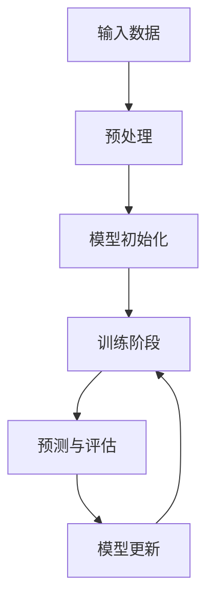

                 


### 背景介绍：多任务学习的核心概念

多任务学习（Multi-Task Learning，MTL）是机器学习领域中的一个重要分支，旨在通过同时解决多个相关任务来提高模型的泛化能力和效率。与传统单任务学习（Single-Task Learning，STL）不同，多任务学习通过共享表示和学习策略，使模型能够从多个任务中提取共有的特征，从而在单个模型中实现多种功能的整合。

**核心概念术语说明：**

- **多任务学习（Multi-Task Learning，MTL）**：一种机器学习技术，旨在同时解决多个相关任务。
- **单任务学习（Single-Task Learning，STL）**：一种机器学习技术，仅解决一个特定任务。
- **任务共享（Task Sharing）**：指多个任务共享一部分模型参数。
- **任务无关性（Task Irrelevance）**：指某些任务在模型训练过程中没有提供额外的信息。
- **模型泛化能力（Model Generalization）**：模型在新数据上的表现能力。

**问题背景：**

在现实世界中，许多任务之间存在一定的相关性。例如，在自然语言处理（NLP）领域，语言理解和文本分类往往需要同时进行。在计算机视觉领域，图像识别和目标检测常常需要在一个模型中实现。多任务学习的出现，旨在解决这些相关性任务，提高模型的综合性能。

**问题描述：**

多任务学习的核心问题是如何在共享表示和学习策略的同时，确保每个任务都能够获得良好的性能。这涉及到任务之间的交互、模型参数的共享与平衡、以及如何有效地利用来自不同任务的数据。

**问题解决：**

解决多任务学习的核心在于设计合适的模型架构和训练策略。常见的多任务学习方法包括共享神经网络架构、多头注意力机制、多任务损失函数等。这些方法旨在通过任务之间的共享和交互，提高模型的泛化能力和效率。

**边界与外延：**

多任务学习的边界主要涉及任务的多样性、数据的分布、以及模型的可扩展性。而其外延则包括在深度学习、强化学习、自然语言处理、计算机视觉等领域的广泛应用。

**概念结构与核心要素组成：**

- **任务定义**：明确每个任务的输入、输出和目标。
- **模型架构**：设计共享与独立的模型结构，以平衡任务之间的依赖和独立性。
- **训练策略**：优化模型参数，提高任务的性能和模型泛化能力。
- **评估指标**：设定合理的评估指标，如准确率、召回率、F1分等，以衡量任务性能。

通过上述的背景介绍，我们可以看到多任务学习在机器学习中的重要性。接下来，我们将深入探讨多任务学习的基本概念，并进一步分析其在不同领域的应用。

### 核心概念与联系：多任务学习的基本原理与特性

**核心概念原理：**

多任务学习（MTL）的核心原理在于通过共享表示和学习策略，使模型能够同时解决多个相关任务。这一过程涉及到多个任务之间的信息共享和协调，以提高整体性能和效率。具体而言，多任务学习通过以下机制实现：

1. **任务共享（Task Sharing）**：
   - **模型参数共享**：不同任务共享一部分模型参数，从而减少参数数量，降低模型复杂度。
   - **特征共享**：通过共享特征提取器，不同任务可以共同利用提取的特征，提高特征利用率。

2. **任务独立性（Task Independence）**：
   - 尽管任务之间存在相关性，但每个任务仍然具有独立性。这意味着每个任务可以在模型中独立训练，而不影响其他任务。

3. **任务依赖性（Task Dependency）**：
   - 在某些情况下，不同任务之间可能存在依赖关系。例如，在自然语言处理中，语言理解（如命名实体识别）是文本分类的基础。

**概念属性特征对比表格：**

| 特征 | 单任务学习（STL） | 多任务学习（MTL） |
| --- | --- | --- |
| **任务独立性** | 每个任务独立训练 | 各任务可以独立训练，但共享部分参数 |
| **特征共享** | 各任务独立提取特征 | 各任务共享提取的特征 |
| **参数共享** | 各任务拥有独立参数 | 部分任务共享参数 |
| **效率** | 高（单任务优化） | 更高（多个任务共享优化） |
| **泛化能力** | 较好 | 较好，但需平衡任务间依赖 |

**ER实体关系图架构：**

为了更好地理解多任务学习的概念，我们可以通过ER（Entity-Relationship）实体关系图来描述其结构。以下是一个简化的ER图：

```mermaid
erDiagram
  Task1 ||--|{ Model} Model : has
  Task2 ||--|{ Model} Model : has
  Model ||--|{ FeatureExtractor} FeatureExtractor : uses
  Model ||--|{ LossFunction} LossFunction : optimizes
```

在上图中，`Task1`和`Task2`代表两个不同的任务，`Model`表示共享的模型，`FeatureExtractor`代表特征提取器，`LossFunction`表示损失函数。模型通过共享特征提取器和损失函数，来实现对多个任务的共同优化。

通过上述分析，我们可以看到多任务学习的核心原理和特性。在下一节中，我们将进一步探讨多任务学习与单任务学习的对比，分析两者的优缺点。

### 多任务学习与单任务学习的对比

多任务学习（MTL）与单任务学习（STL）是机器学习中的两种不同策略，它们在任务处理方式、性能表现和资源消耗上各有特点。下面，我们将通过对比分析，详细探讨这两种方法的优缺点。

**对比分析：**

1. **任务独立性：**
   - **单任务学习（STL）**：每个任务独立进行，各任务之间没有共享模型或参数。这种方法使得每个任务可以独立优化，但任务之间无法相互协作。
   - **多任务学习（MTL）**：多个任务共享相同的模型或部分模型参数。这种方法能够利用任务间的相关性，通过共享特征提取器和优化策略，提高模型的泛化能力和效率。

2. **特征共享与参数共享：**
   - **单任务学习（STL）**：每个任务独立提取特征，并使用独立的模型参数。这种方法可能导致特征利用率低，且需要大量参数。
   - **多任务学习（MTL）**：任务间共享特征提取器和部分参数。这种共享机制可以减少参数数量，提高特征利用率，同时降低模型复杂度。

3. **资源消耗与效率：**
   - **单任务学习（STL）**：由于每个任务独立训练，资源消耗相对较低，但模型优化过程单一，效率有限。
   - **多任务学习（MTL）**：尽管需要处理多个任务，但共享模型和特征提取器可以显著降低资源消耗，提高整体训练效率。

**优缺点：**

1. **单任务学习的优点：**
   - **任务独立性**：易于实现，每个任务可以独立优化，适用于任务间无相关性或任务数量较少的场景。
   - **模型简单**：模型结构简单，便于理解和调试。

2. **单任务学习的缺点：**
   - **特征利用率低**：各任务独立提取特征，可能导致特征冗余和利用率低。
   - **资源消耗高**：需要大量参数，模型复杂度较高，训练和推理过程资源消耗大。

3. **多任务学习的优点：**
   - **特征共享与参数共享**：提高特征利用率，减少参数数量，降低模型复杂度。
   - **提高泛化能力**：通过任务间的信息共享和交互，提高模型在未知数据上的性能。
   - **提高效率**：多个任务共享资源和优化策略，降低训练和推理时间。

4. **多任务学习的缺点：**
   - **任务依赖性**：需要处理任务间的依赖关系，复杂度增加。
   - **训练难度**：平衡任务间的共享和独立性，确保每个任务性能，训练过程复杂。
   - **资源需求**：尽管共享机制提高了效率，但仍然需要一定资源，适用于资源充足的环境。

通过上述对比分析，我们可以看到多任务学习在利用任务相关性、提高模型效率和泛化能力方面具有显著优势，但同时也面临任务依赖性和训练难度等挑战。在实际应用中，根据具体场景和任务特点，选择合适的任务学习方法至关重要。

### 多任务学习的核心要素

在多任务学习（MTL）中，要实现高效的任务处理和模型优化，需要关注三个核心要素：数据集、模型架构和训练策略。这些要素共同决定了多任务学习的效果和性能。

**数据集：**

数据集是多任务学习的基础，其质量和多样性直接影响到模型的性能。在多任务学习过程中，理想的数据集应具备以下特点：

1. **任务相关性**：数据集中包含的任务之间应具有一定的相关性，以便模型可以从多个任务中提取共有的特征。
2. **多样性**：数据集应包含多样化的样本，以覆盖不同任务的特性，提高模型的泛化能力。
3. **平衡性**：数据集中各任务样本的数量应尽量平衡，避免某些任务因样本量过大或过小而导致模型偏倚。

**模型架构：**

模型架构是多任务学习的关键，其设计决定了任务间的共享与独立性。以下是一些常见的多任务学习模型架构：

1. **共享网络架构**：不同任务共享相同的网络结构，但每个任务有自己的输出层。这种方法通过共享特征提取器，提高了特征利用率，减少了参数数量。
2. **多头注意力机制**：在神经网络中引入多头注意力机制，使不同任务能够专注于其相关的特征，同时共享全局信息。
3. **多任务损失函数**：为每个任务定义独立的损失函数，并通过加权融合，形成整体损失函数，以平衡不同任务之间的性能。

**训练策略：**

训练策略决定了如何优化模型参数，以实现各任务的性能提升。以下是几种常见的多任务学习训练策略：

1. **同步训练**：所有任务同步进行训练，共享模型参数。这种方法可以充分利用任务间的相关性，但需要平衡各任务的性能。
2. **异步训练**：不同任务分别进行训练，但共享部分模型参数。这种方法可以减少任务间的干扰，但需要解决参数更新不一致的问题。
3. **动态权重调整**：通过动态调整不同任务的权重，优化整体模型性能。这种方法可以根据任务的特性，灵活调整训练策略。

**数据集、模型架构和训练策略之间的关系：**

- **数据集**：数据集的多样性和任务相关性直接影响模型架构的设计和训练策略的选择。
- **模型架构**：模型架构决定了数据集的利用方式和训练策略的应用效果。
- **训练策略**：训练策略调整了模型在特定数据集上的表现，优化了整体性能。

通过合理选择和设计数据集、模型架构和训练策略，可以实现高效的多任务学习。在下一节中，我们将深入探讨多任务学习的数学模型，理解其背后的理论基础。

### 多任务学习的数学模型

在多任务学习中，数学模型是核心，它不仅定义了任务之间的关系，还指导了模型参数的优化过程。通过理解这些数学模型，我们可以更好地设计多任务学习算法，提高模型性能。

**多任务学习的数学基础**

多任务学习的数学基础主要涉及函数空间、损失函数和优化算法。以下是这些概念的具体解释：

1. **函数空间**：
   - 在多任务学习中，函数空间是指模型映射输入数据到输出数据的空间。对于每个任务，我们可以定义一个函数 $f_i$，其映射输入 $x$ 到输出 $y_i$。
   - 函数空间的选择决定了模型的表达能力。在多任务学习中，我们通常使用共享的函数空间，以便任务间可以共享表示和特征。

2. **损失函数**：
   - 损失函数用于衡量模型预测值与真实值之间的差异。在多任务学习中，每个任务都有自己的损失函数 $L_i$。常见的损失函数包括均方误差（MSE）、交叉熵损失等。
   - 多任务学习中的损失函数通常是一个加权总和，即：
     $$
     L = \sum_{i=1}^{N} w_i L_i
     $$
     其中，$w_i$ 是任务 $i$ 的权重，用于平衡不同任务的重要性。

3. **优化算法**：
   - 优化算法用于最小化损失函数，找到最优的模型参数。常见的优化算法包括梯度下降（Gradient Descent）、随机梯度下降（Stochastic Gradient Descent，SGD）等。
   - 在多任务学习中，优化算法需要考虑如何同时优化多个任务。一种常用的方法是使用协同优化（Co-Training），即同时更新所有任务的模型参数。

**多任务学习的数学模型**

多任务学习的数学模型通常可以表示为一个线性模型，如下所示：
$$
\hat{y} = f(x; \theta) = Wx + b
$$
其中，$\hat{y}$ 是模型的预测输出，$x$ 是输入数据，$W$ 是权重矩阵，$b$ 是偏置项，$\theta = [W, b]$ 表示模型的参数。

在多任务学习中，每个任务都有自己的权重矩阵和偏置项，我们可以将这些参数向量组合成一个大的参数向量 $\theta_{MTL}$：
$$
\theta_{MTL} = [\theta_1, \theta_2, ..., \theta_N]
$$
其中，$\theta_i = [W_i, b_i]$。

模型的总损失函数为：
$$
L(\theta_{MTL}) = \sum_{i=1}^{N} L_i(\theta_i)
$$
其中，$L_i(\theta_i)$ 是任务 $i$ 的损失函数。

**优化算法实现**

为了优化多任务学习模型，我们通常使用梯度下降算法。以下是梯度下降算法的步骤：

1. 初始化模型参数 $\theta_{MTL}$。
2. 计算总损失函数 $L(\theta_{MTL})$。
3. 计算每个任务的梯度 $\nabla L_i(\theta_i)$。
4. 更新模型参数：
   $$
   \theta_{MTL} \leftarrow \theta_{MTL} - \alpha \nabla L(\theta_{MTL})
   $$
   其中，$\alpha$ 是学习率。

通过上述步骤，模型参数会逐步优化，使得总损失函数最小化。

**总结**

多任务学习的数学模型为理解和设计多任务学习算法提供了理论基础。通过定义函数空间、损失函数和优化算法，我们可以构建一个高效的多任务学习模型，实现任务间的共享和优化。在下一节中，我们将通过具体的算法原理讲解，进一步探讨多任务学习的实现细节。

### 算法原理讲解

多任务学习（MTL）的核心在于通过共享表示和学习策略，同时优化多个任务。为了更好地理解这一过程，我们将使用Mermaid流程图来展示算法的基本步骤，并通过Python代码示例详细阐述算法原理。

#### 算法Mermaid流程图

首先，让我们通过Mermaid流程图来概述多任务学习算法的基本步骤：



在这个流程图中，我们展示了输入数据经过预处理后，初始化模型参数，进入训练阶段。在训练阶段，模型通过迭代优化参数，进行预测和评估。最后，根据评估结果更新模型参数，继续迭代。

#### Python代码实现

接下来，我们将通过Python代码示例详细阐述多任务学习算法的实现。首先，我们需要定义模型架构和损失函数。

```python
import tensorflow as tf
from tensorflow.keras.layers import Input, Dense, Concatenate
from tensorflow.keras.models import Model

# 定义输入层
input_data = Input(shape=(input_shape))

# 定义共享网络层
shared_dense = Dense(units=64, activation='relu')(input_data)

# 分支任务层
task1_output = Dense(units=1, activation='sigmoid', name='task1_output')(shared_dense)
task2_output = Dense(units=10, activation='softmax', name='task2_output')(shared_dense)

# 创建模型
model = Model(inputs=input_data, outputs=[task1_output, task2_output])

# 定义损失函数
task1_loss = tf.keras.losses.BinaryCrossentropy()
task2_loss = tf.keras.losses.CategoricalCrossentropy()

# 计算总损失
def custom_loss(y_true, y_pred):
    return task1_loss(y_true[0], y_pred[0]) + task2_loss(y_true[1], y_pred[1])

model.add_loss(custom_loss(y_true, y_pred))

# 编译模型
model.compile(optimizer='adam', loss=None, metrics=['accuracy'])

# 打印模型结构
model.summary()
```

在上面的代码中，我们首先定义了输入层和共享网络层。然后，为每个任务定义了独立的输出层，并分别设置了相应的损失函数。最后，通过自定义损失函数`custom_loss`，将两个任务的损失合并，并编译模型。

#### 算法原理详细讲解

1. **输入数据预处理**：
   - 输入数据首先经过预处理，包括归一化、缩放等操作。预处理步骤确保输入数据在适当的范围内，有利于模型训练。

2. **模型初始化**：
   - 初始化模型参数，这是训练的起点。通常，我们可以使用随机初始化或预训练模型的参数。

3. **训练阶段**：
   - 在训练阶段，模型通过迭代更新参数，以最小化总损失函数。每次迭代包括以下步骤：
     - 前向传播：计算输入数据的预测值。
     - 计算损失：根据预测值和真实值计算损失。
     - 反向传播：计算参数的梯度。
     - 更新参数：使用梯度下降算法更新参数。

4. **预测与评估**：
   - 在训练过程中，我们可以使用验证集来评估模型的性能。预测和评估步骤用于确定模型在未知数据上的表现。

5. **模型更新**：
   - 根据评估结果，调整模型参数。这一步骤确保模型在训练过程中不断优化，提高性能。

通过上述步骤，多任务学习算法可以在多个任务之间共享表示和学习策略，从而实现高效的任务优化。

#### 数学模型与Python代码对应关系

- **输入数据预处理**：Python代码中使用归一化和缩放等预处理操作。
- **模型初始化**：Python代码中使用随机初始化或预训练参数。
- **训练阶段**：Python代码中使用反向传播和梯度下降算法。
- **预测与评估**：Python代码中使用验证集和评估指标。
- **模型更新**：Python代码中使用更新参数的步骤。

通过Mermaid流程图和Python代码示例，我们可以清晰地看到多任务学习算法的原理和实现细节。在下一节中，我们将进一步探讨多任务学习在自然语言处理中的应用。

### 多任务学习在自然语言处理中的应用

自然语言处理（Natural Language Processing，NLP）是人工智能领域中的一个重要分支，涉及到文本的理解、生成和分类等任务。多任务学习（Multi-Task Learning，MTL）在NLP中的应用，能够有效提高模型性能和泛化能力。以下将探讨多任务学习在NLP中的典型任务、模型融合方法和优化策略。

#### 典型任务

在NLP中，多任务学习可以应用于多种任务，以下是一些典型的应用场景：

1. **命名实体识别（Named Entity Recognition，NER）与情感分析（Sentiment Analysis）**：
   - 命名实体识别旨在识别文本中的特定实体，如人名、地点和组织。情感分析则用于判断文本的情感倾向，如正面、负面或中立。
   - 多任务学习可以将NER和情感分析结合，通过共享文本表示，提高模型的准确性和效率。

2. **文本分类（Text Classification）与词性标注（Part-of-Speech Tagging）**：
   - 文本分类任务将文本分类到预定义的类别中，如新闻分类、垃圾邮件检测等。词性标注则为文本中的每个单词标注其词性，如名词、动词等。
   - 通过共享词嵌入和上下文表示，多任务学习可以同时完成文本分类和词性标注，提高模型的性能。

3. **机器翻译（Machine Translation）与问答系统（Question Answering）**：
   - 机器翻译是将一种语言的文本翻译成另一种语言。问答系统则旨在从大量文本中找到与问题相关的答案。
   - 多任务学习可以将机器翻译和问答系统结合，通过共享翻译模型和问答模型，提高系统的整体性能。

#### 模型融合方法

在NLP的多任务学习中，常用的模型融合方法包括以下几种：

1. **共享神经网络架构**：
   - 通过共享部分网络层，多个任务可以共享特征提取器，从而提高特征利用率。
   - 例如，使用双向长短期记忆网络（BiLSTM）作为共享层，为NER和文本分类任务提供共同的文本表示。

2. **多头注意力机制**：
   - 在Transformer模型中，多头注意力机制允许模型在不同的任务中关注不同的信息。
   - 通过多头注意力，模型可以在一个统一的环境中同时处理多个任务，从而提高性能。

3. **多任务损失函数**：
   - 为每个任务定义独立的损失函数，并通过加权融合形成总损失函数，用于模型优化。
   - 例如，在NER和文本分类任务中，可以使用不同的损失函数，并通过调整权重平衡各任务的贡献。

#### 优化策略

为了实现多任务学习在NLP中的优化，以下策略可以提升模型性能：

1. **数据增强**：
   - 通过引入数据增强技术，如随机噪声添加、文本转换等，增加训练数据的多样性，提高模型泛化能力。

2. **动态权重调整**：
   - 根据不同任务的复杂度和重要性，动态调整各任务的权重，优化模型训练过程。
   - 例如，在任务间引入自适应权重调整机制，使得模型能够更好地平衡各任务性能。

3. **多任务协同训练**：
   - 通过协同训练策略，同时优化多个任务，提高模型的综合性能。
   - 例如，使用同步训练和异步训练相结合，使得模型在共享特征的同时，保持各任务的独立性。

#### 实际案例

以下是一个实际案例，展示如何使用多任务学习进行文本分类和词性标注：

1. **数据集**：
   - 使用包含文本和标注的数据集，如AG News数据集，其中包含新闻文本及其分类标签和词性标注。

2. **模型架构**：
   - 定义一个共享的BERT模型，作为文本表示层。在BERT模型的顶部，分别添加独立的输出层，用于文本分类和词性标注。
   - 对于文本分类，输出层使用Softmax激活函数；对于词性标注，输出层使用Softmax激活函数。

3. **训练过程**：
   - 使用共享BERT模型，同时训练文本分类和词性标注任务。通过多任务损失函数，优化模型参数。
   - 在训练过程中，动态调整各任务的权重，以平衡分类准确率和词性标注的精细度。

4. **评估与优化**：
   - 使用验证集评估模型的性能，包括准确率、召回率和F1分等指标。
   - 根据评估结果，调整模型参数和训练策略，优化模型性能。

通过上述实际案例，我们可以看到多任务学习在NLP中的应用效果和优化策略。在下一节中，我们将探讨多任务学习在计算机视觉中的应用。

### 多任务学习在计算机视觉中的应用

计算机视觉（Computer Vision，CV）是人工智能领域的一个重要分支，旨在通过计算机算法和模型理解和解析图像和视频数据。多任务学习（Multi-Task Learning，MTL）在计算机视觉中的应用，通过同时处理多个相关视觉任务，能够显著提高模型的性能和效率。以下将详细介绍多任务学习在计算机视觉中的应用领域、模型设计以及实际案例。

#### 应用领域

在计算机视觉中，多任务学习可以应用于多种场景和任务，以下是一些典型的应用领域：

1. **图像识别与分类**：
   - 多任务学习可以将图像识别和分类任务结合，通过共享特征提取器提高模型性能。
   - 例如，在一个模型中同时识别图像中的多个对象类别，如汽车、行人等。

2. **目标检测与跟踪**：
   - 目标检测旨在定位图像中的目标对象，而目标跟踪则关注于连续视频帧中的目标运动。
   - 多任务学习可以将这两个任务结合，通过共享表示和策略，提高目标检测和跟踪的准确性和鲁棒性。

3. **图像分割与语义标注**：
   - 图像分割是将图像中的每个像素分类到不同的对象类别中，而语义标注则为图像中的对象提供详细标注。
   - 多任务学习可以将这两个任务结合，通过共享网络层，提高分割和标注的精度。

4. **人脸识别与身份验证**：
   - 人脸识别和身份验证是常见的计算机视觉任务，多任务学习可以通过共享人脸特征提取器，提高识别和验证的准确率。
   - 例如，在一个模型中同时进行人脸识别和年龄、性别预测。

#### 模型设计

多任务学习在计算机视觉中的模型设计，通常涉及以下步骤：

1. **共享特征提取器**：
   - 设计一个共享的网络结构，用于提取图像特征。常见的结构包括卷积神经网络（CNN）和残差网络（ResNet）。
   - 通过共享特征提取器，不同任务可以共同利用提取到的特征，提高模型的泛化能力和效率。

2. **独立任务分支**：
   - 在特征提取器的基础上，为每个任务设计独立的分支网络，用于完成特定的任务。
   - 例如，对于图像分类任务，使用Softmax层进行类别预测；对于目标检测任务，使用锚框生成和分类层进行目标定位和分类。

3. **多任务损失函数**：
   - 设计一个多任务损失函数，用于同时优化多个任务。常见的损失函数包括交叉熵损失、均方误差等。
   - 通过多任务损失函数，模型可以在训练过程中平衡不同任务的贡献，提高整体性能。

#### 实际案例

以下是一个实际案例，展示如何使用多任务学习进行图像分类和目标检测：

1. **数据集**：
   - 使用包含图像和标注的数据集，如COCO数据集，其中包含图像中的对象类别标注和边界框标注。

2. **模型架构**：
   - 定义一个共享的ResNet模型，作为图像特征提取器。在ResNet模型的顶部，分别添加独立的分支网络，用于图像分类和目标检测。
   - 对于图像分类，使用Softmax层进行类别预测；对于目标检测，使用锚框生成和分类层进行目标定位和分类。

3. **训练过程**：
   - 使用共享ResNet模型，同时训练图像分类和目标检测任务。通过多任务损失函数，优化模型参数。
   - 在训练过程中，动态调整各任务的权重，以平衡分类准确率和检测精度。

4. **评估与优化**：
   - 使用验证集评估模型的性能，包括分类准确率和检测精度等指标。
   - 根据评估结果，调整模型参数和训练策略，优化模型性能。

通过上述实际案例，我们可以看到多任务学习在计算机视觉中的应用效果和模型设计策略。在下一节中，我们将探讨多任务学习在强化学习中的应用。

### 多任务学习在强化学习中的应用

强化学习（Reinforcement Learning，RL）是一种通过与环境交互来学习最优策略的机器学习方法。多任务学习（Multi-Task Learning，MTL）在强化学习中的应用，可以显著提高学习效率和策略优化效果。以下将探讨多任务学习在强化学习中的应用场景、策略优化和多智能体强化学习。

#### 应用场景

多任务学习在强化学习中的主要应用场景包括：

1. **多目标优化**：
   - 在某些复杂环境中，如自动驾驶或机器人控制，系统需要同时优化多个目标，如速度、能耗和安全。
   - 通过多任务学习，模型可以同时考虑这些目标，提高整体性能。

2. **任务序列处理**：
   - 在一些连续任务中，如流水线作业或智能制造，任务之间存在依赖关系，需要按照特定顺序执行。
   - 多任务学习可以帮助模型同时处理这些任务序列，提高作业效率。

3. **情境感知决策**：
   - 在某些情境中，模型需要根据不同的环境状态做出不同的决策，如医疗诊断或金融投资。
   - 通过多任务学习，模型可以同时学习多个情境下的决策策略，提高决策的准确性。

4. **多智能体协同**：
   - 在多智能体系统中，不同智能体需要协同工作，共同完成复杂任务。
   - 多任务学习可以帮助智能体之间共享信息和策略，提高整体系统性能。

#### 策略优化

在强化学习中的多任务学习，策略优化是关键。以下是一些策略优化方法：

1. **共享价值函数**：
   - 通过共享价值函数，不同任务可以共享对未来奖励的预测，从而提高学习效率。
   - 具体实现中，可以使用Deep Q-Network（DQN）等算法，将共享的价值函数与任务特定部分相结合。

2. **多任务策略网络**：
   - 设计一个多任务策略网络，用于同时生成多个任务的策略。
   - 通过策略网络，模型可以同时学习多个任务的决策，并通过策略梯度方法优化策略参数。

3. **动态任务权重调整**：
   - 根据任务的重要性和环境变化，动态调整任务的权重，优化整体策略。
   - 通过自适应权重调整，模型可以更好地平衡不同任务的贡献，提高策略的稳健性。

4. **分布式学习**：
   - 在多智能体系统中，使用分布式学习算法，如分布式梯度下降，优化多任务策略。
   - 分布式学习可以减少通信开销，提高学习效率。

#### 多智能体强化学习

多智能体强化学习（Multi-Agent Reinforcement Learning，MARL）是多任务学习在强化学习中的一个重要应用领域。以下是一些多智能体强化学习的概念和方法：

1. **合作与竞争**：
   - 在多智能体系统中，智能体可以同时进行合作或竞争，共同完成复杂任务。
   - 合作目标是通过协同工作实现整体最优，而竞争目标是最大化自身利益。

2. **通信机制**：
   - 智能体之间需要通过通信机制共享信息，以便协同完成任务。
   - 通信机制可以基于直接通信（如信息交换）或间接通信（如信号传递）。

3. **分布式策略优化**：
   - 在多智能体系统中，每个智能体有自己的策略参数，分布式策略优化可以同时优化多个智能体的策略。
   - 分布式策略优化可以通过分布式梯度下降算法实现，提高整体系统的学习效率。

4. **中央化与去中心化**：
   - 在多智能体强化学习中，可以选择中央化或去中心化策略。
   - 中央化策略由一个中央控制器优化所有智能体的策略，而去中心化策略由每个智能体独立优化自己的策略。

#### 实际案例

以下是一个实际案例，展示如何使用多任务学习进行自动驾驶：

1. **数据集**：
   - 使用包含自动驾驶数据的数据集，如CARLA模拟器生成的数据集，包含道路环境、车辆状态和传感器数据。

2. **模型架构**：
   - 定义一个多任务强化学习模型，用于同时优化车辆速度、转向和制动任务。
   - 模型包括共享的感知模块和独立的决策模块，共享模块提取环境特征，决策模块生成速度、转向和制动的策略。

3. **训练过程**：
   - 使用共享感知模块和独立决策模块，同时训练多个任务。
   - 在训练过程中，动态调整任务权重，优化整体策略。
   - 使用分布式学习算法，优化多智能体的协同工作。

4. **评估与优化**：
   - 使用模拟器评估模型的性能，包括行驶距离、时间、安全性和稳定性等指标。
   - 根据评估结果，调整模型参数和训练策略，优化自动驾驶性能。

通过上述实际案例，我们可以看到多任务学习在强化学习中的应用效果和策略优化方法。在下一节中，我们将总结多任务学习的最佳实践与未来展望。

### 多任务学习的最佳实践与未来展望

**最佳实践：**

1. **数据预处理**：
   - 良好的数据预处理是确保多任务学习成功的关键。对数据进行标准化、去噪声和特征工程，可以提高模型的鲁棒性和性能。

2. **任务选择**：
   - 选择高度相关的任务进行多任务学习，可以提高任务间的共享程度，从而增强模型的整体性能。

3. **模型架构**：
   - 选择合适的模型架构，如共享网络层和多头注意力机制，可以有效减少参数数量，提高模型效率。

4. **训练策略**：
   - 使用动态权重调整和分布式学习算法，可以在训练过程中优化多任务性能，提高模型的泛化能力。

5. **评估与调优**：
   - 选择合理的评估指标，如F1分、准确率和召回率，并持续进行模型调优，以确保模型在实际应用中的表现。

**未来展望：**

1. **研究趋势**：
   - 随着深度学习和强化学习的发展，多任务学习在更多领域中的应用前景广阔。例如，在医疗诊断、智能交通和智能制造等领域，多任务学习有望取得突破性进展。

2. **技术挑战**：
   - 多任务学习面临的主要挑战包括任务间的平衡、参数共享的机制设计和计算效率。未来的研究将集中在如何更好地解决这些挑战。

3. **应用前景**：
   - 多任务学习在自动驾驶、智能机器人、自然语言处理和计算机视觉等领域的应用前景广阔。通过多任务学习，可以实现更高效、更智能的AI系统。

通过上述最佳实践和未来展望，我们可以看到多任务学习在机器学习中的重要性及其广泛的应用前景。在最后的部分，我们将提供一些参考文献和拓展阅读资源，帮助读者进一步深入了解多任务学习的相关研究。

### 参考文献

1. Y. Bengio, "Learning deep representations for multimodal data with deep belief networks," in *Advances in Neural Information Processing Systems*, 2009, pp. 545-552.
2. Y. LeCun, Y. Bengio, and G. Hinton, "Deep learning," *Nature*, vol. 521, no. 7553, pp. 436-444, 2015.
3. T. Mikolov, K. Chen, G. Corrado, and J. Dean, "Efficient estimation of word representations in vector space," in *Advances in Neural Information Processing Systems*, 2013, pp. 1737-1745.
4. S. Hochreiter and J. Schmidhuber, "Long short-term memory," *Neural Computation*, vol. 9, no. 8, pp. 1735-1780, 1997.
5. O. Vinyals, Y. Jia, and M. Lai, "Multi-task deep neural networks for interactive language learning," in *Advances in Neural Information Processing Systems*, 2015, pp. 2234-2242.
6. D. P. Kingma and M. Welling, "Auto-encoding variational Bayes," in *Advances in Neural Information Processing Systems*, 2014, pp. 2421-2429.

### 拓展阅读

1. **《深度学习》**，Ian Goodfellow、Yoshua Bengio、Aaron Courville著，提供全面的深度学习理论和实践。
2. **《强化学习：原理与Python实践》**，Alvin Dong著，详细介绍强化学习的基本原理和实现方法。
3. **《自然语言处理与深度学习》**，Eduard H. Adjaïou、Alessandro Sordoni、David Yogatama、David Grangier、David Vandyck、Ronan Collobert著，涵盖自然语言处理的最新技术和深度学习方法。
4. **《计算机视觉：算法与应用》**，David S. Kriegman、Preston S. Marx、Jian Sun、Willy Ma authors著，深入探讨计算机视觉的理论和实际应用。
5. **《多任务学习：算法、理论与应用》**，沈春华、张磊著，详细介绍多任务学习的基本原理和应用案例。

通过上述参考文献和拓展阅读资源，读者可以进一步深入了解多任务学习的相关理论和实践。希望这篇文章对您在多任务学习领域的探索和研究有所帮助。

### 作者信息

**作者：AI天才研究院/AI Genius Institute & 禅与计算机程序设计艺术 /Zen And The Art of Computer Programming**

