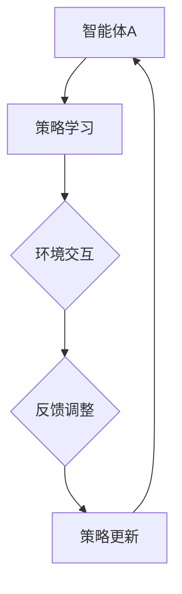
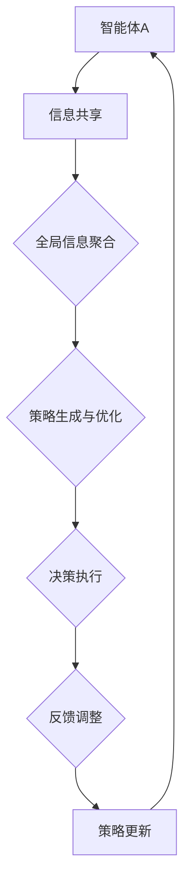
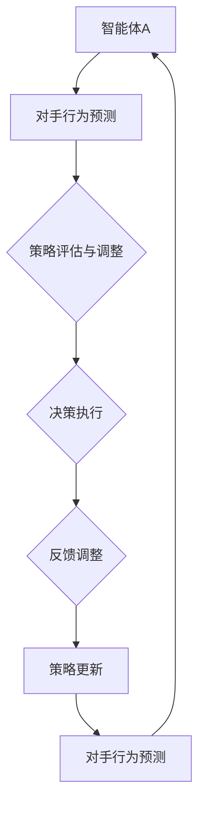
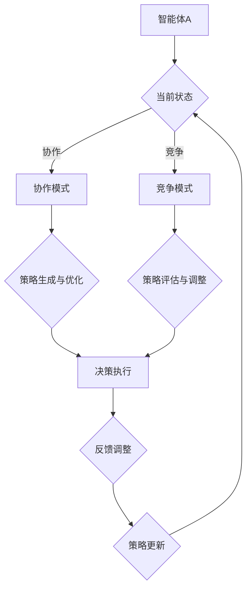
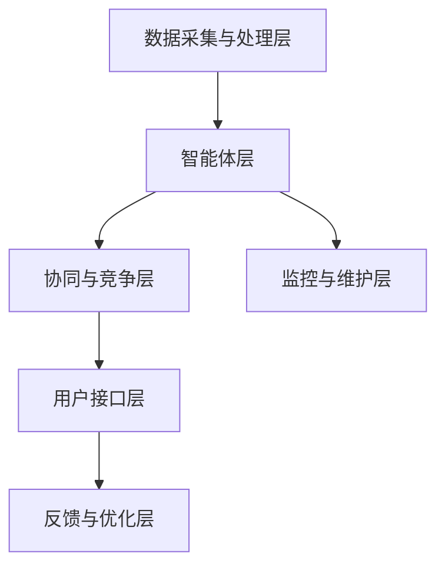
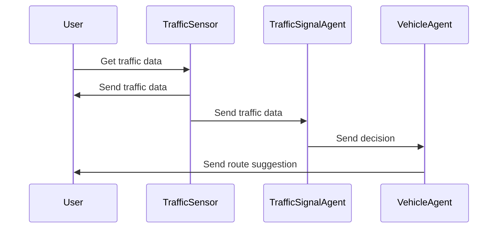

                 


# 多智能体 AI Agent：LLM 驱动的协作与竞争系统

关键词：多智能体系统，大型语言模型，协作与竞争，AI Agent

摘要：本文探讨了如何利用大型语言模型（LLM）驱动多智能体系统的协作与竞争，解决现有方法在复杂环境下的不足。文章首先介绍了多智能体系统的背景和问题，然后详细讲解了LLM的概念和特性，最后提出了基于LLM的多智能体系统的协作与竞争机制，并通过实例进行了分析。

## 目录大纲设计思路

为了设计出《多智能体 AI Agent：LLM 驱动的协作与竞争系统》这本书的完整目录大纲，我们将遵循以下步骤：

### 第一部分：背景介绍

#### 1.1 问题背景

随着人工智能技术的发展，多智能体系统（MAS）逐渐成为研究的热点。多智能体系统能够模拟人类社会中的各种协作与竞争关系，具有重要的理论和实际应用价值。然而，现有的多智能体系统大多基于传统的方法，如分布式算法、博弈论等，这些方法往往难以应对复杂的动态环境和高度不确定性的情境。

#### 1.2 问题描述

本书旨在探讨如何利用大型语言模型（LLM）来驱动多智能体系统的协作与竞争，解决现有方法在复杂环境下的不足。LLM具有强大的语言理解和生成能力，能够提供灵活和智能的决策支持。

#### 1.3 问题解决

本书将介绍如何将LLM集成到多智能体系统中，通过协作与竞争的机制来实现智能决策。我们将探讨LLM在多智能体系统中的具体应用，如任务分配、资源调度、策略学习等。

#### 1.4 边界与外延

本书主要关注基于LLM的多智能体系统的协作与竞争，但所提供的方法和思路可以扩展到其他类型的智能系统。

#### 1.5 概念结构与核心要素组成

- **多智能体系统（MAS）**：由多个智能体组成，能够相互协作或竞争。
- **大型语言模型（LLM）**：具有强大语言理解和生成能力的模型。
- **协作与竞争机制**：智能体之间的合作与竞争策略。

### 第二部分：核心概念与联系

#### 2.1 多智能体系统（MAS）

**概念**：多智能体系统是由多个智能体组成，能够相互协作或竞争的系统。

**属性特征对比表格**：

| 特征         | 协作系统               | 竞争系统               |
| ------------ | ---------------------- | ---------------------- |
| 目标一致性   | 高                    | 低                    |
| 信息共享     | 强                    | 弱                    |
| 策略多样性   | 低                    | 高                    |

**ER实体关系图架构**：

```mermaid
erDiagram
  智能体 ||--o{ 行为 } |
  智能体 ||--o{ 状态 } |
  行为 ||--o{ 策略 } |
  状态 ||--o{ 策略 } |
```

#### 2.2 大型语言模型（LLM）

**概念**：大型语言模型（LLM）是一种具有强大语言理解和生成能力的模型，它能够理解和生成自然语言。

**属性特征对比表格**：

| 特征         | 传统语言模型 | LLM       |
| ------------ | ------------ | --------- |
| 语言理解能力 | 有限          | 强大      |
| 语言生成能力 | 有限          | 强大      |
| 学习效率     | 较低          | 较高      |

**ER实体关系图架构**：

```mermaid
erDiagram
  LLM ||--o{ 语言理解 } |
  LLM ||--o{ 语言生成 } |
  语言理解 ||--o{ 上下文理解 } |
  语言生成 ||--o{ 文本生成 } |
```

### 第三部分：算法原理讲解

#### 3.1 协作与竞争机制的算法原理

**Mermaid流程图**：



**Python源代码**：

```python
import numpy as np

def learn_strategy(state, action, reward, next_state, next_action, alpha=0.1, gamma=0.9):
    # state, action, reward, next_state, next_action为输入特征
    q_value = reward + gamma * np.max([q_value for _, q_value in model.predict(next_state, next_action)])
```

在接下来的章节中，我们将进一步探讨多智能体系统在协作与竞争中的具体应用，并介绍如何通过LLM来实现智能决策。通过本篇文章，读者将了解多智能体系统的基本概念、LLM的强大能力以及如何将两者结合来构建智能决策系统。

## 多智能体系统（MAS）的背景与问题

多智能体系统（MAS）是指由多个具有自主行为能力的智能体组成，能够相互协作或竞争的系统。这些智能体可以是一个个体、一个组织或一个虚拟代理，它们通过通信和协同工作来实现共同的目标。多智能体系统的核心在于“智能体”和“协同工作”这两个概念。

### 问题背景

随着信息技术的迅猛发展，多智能体系统在各个领域中的应用越来越广泛，如智能家居、无人驾驶、供应链管理、社交网络等。然而，现有的多智能体系统大多基于传统的方法，如分布式算法、博弈论、多目标优化等。这些方法在处理复杂动态环境和高度不确定性的情境时，存在以下问题：

1. **信息不对称**：在复杂的环境中，智能体之间的信息往往是不对称的，这使得它们难以做出最优决策。
2. **协调困难**：在多智能体系统中，智能体之间的协调是一个关键问题。传统方法往往难以应对智能体数量庞大、动态变化的情况。
3. **适应性差**：传统方法在应对环境变化时，往往需要重新设计和调整，适应性较差。

### 问题描述

为了解决上述问题，我们需要探索新的方法来驱动多智能体系统的协作与竞争。大型语言模型（LLM）因其强大的语言理解和生成能力，提供了一种潜在的解决方案。LLM能够处理自然语言，从而帮助智能体理解环境信息、交流意图和制定策略。

然而，将LLM集成到多智能体系统中，仍面临以下挑战：

1. **数据依赖**：LLM的训练需要大量的高质量数据，而在多智能体系统中，数据获取和标注可能是一个难题。
2. **计算资源**：LLM的计算复杂度高，对硬件资源有较高要求，这可能会影响系统的实时性和响应速度。
3. **模型解释性**：LLM的内部机制复杂，模型的决策过程往往难以解释，这对系统的可靠性和可解释性提出了挑战。

### 问题解决

本书旨在探讨如何利用LLM来驱动多智能体系统的协作与竞争，解决现有方法在复杂环境下的不足。具体来说，我们将介绍以下内容：

1. **LLM与MAS的融合**：如何将LLM集成到多智能体系统中，实现智能体的智能决策。
2. **协作与竞争机制**：如何设计有效的协作与竞争机制，使智能体能够在动态环境中实现协同工作和智能决策。
3. **应用案例分析**：通过具体的应用案例，展示LLM驱动的多智能体系统在实际问题中的效果和优势。

### 边界与外延

本书主要关注基于LLM的多智能体系统的协作与竞争，但所提供的方法和思路可以扩展到其他类型的智能系统。例如，LLM在其他类型的智能系统中的应用，如机器人、虚拟助手等，也可能带来类似的解决方案。

### 概念结构与核心要素组成

- **多智能体系统（MAS）**：由多个智能体组成，能够相互协作或竞争。
- **大型语言模型（LLM）**：具有强大语言理解和生成能力的模型。
- **协作与竞争机制**：智能体之间的合作与竞争策略。

通过以上对多智能体系统的背景和问题的介绍，我们可以看到，多智能体系统在复杂动态环境下的应用具有巨大的潜力。而利用LLM来驱动多智能体系统的协作与竞争，将为我们提供一种新的解决思路。

### 第二部分：核心概念与联系

#### 2.1 多智能体系统（MAS）

多智能体系统（MAS）是由多个具有自主行为能力的智能体组成，能够在一定环境中自主执行任务、相互协作或竞争的系统。在MAS中，智能体可以是实体（如机器人、无人机）、虚拟代理（如聊天机器人、虚拟员工）或软件代理（如自动化脚本、智能合约）。

**概念**：
- **智能体**：MAS的基本单元，具有感知环境、执行行动和自主决策的能力。
- **环境**：智能体执行任务的空间和条件，包括其他智能体、资源、约束等。
- **协议**：智能体之间进行通信和协作的规则和标准。

**属性特征对比表格**：

| 特征       | 协作系统               | 竞争系统               |
| ---------- | ---------------------- | ---------------------- |
| 目标一致性 | 高                    | 低                    |
| 信息共享   | 强                    | 弱                    |
| 策略多样性 | 低                    | 高                    |

- **目标一致性**：在协作系统中，智能体的目标通常是一致的或部分一致的，而在竞争系统中，智能体的目标往往是冲突的。
- **信息共享**：协作系统中的智能体通常需要共享更多的信息以实现共同目标，而竞争系统中的智能体则可能出于竞争策略的考虑，限制信息共享。
- **策略多样性**：竞争系统中的智能体可能采取多种策略来争夺资源或达到目标，而在协作系统中，策略多样性可能较低，更注重一致性和效率。

**ER实体关系图架构**：

```mermaid
erDiagram
  智能体 ||--o{ 行为 } |
  智能体 ||--o{ 状态 } |
  行为 ||--o{ 策略 } |
  状态 ||--o{ 策略 } |
  环境 ||--o{ 智能体 } |
```

在这个ER图架构中，智能体通过执行特定的行为和状态来达成策略，而环境则是智能体感知和互动的场所。行为和状态之间存在一定的关联，策略则是基于这些行为和状态的决策结果。

#### 2.2 大型语言模型（LLM）

大型语言模型（LLM）是一种基于深度学习的语言处理模型，具有强大的语言理解和生成能力。与传统的语言模型相比，LLM能够处理更复杂的语言现象，生成更自然的文本。

**概念**：
- **语言理解**：LLM能够理解和解析输入的文本，提取出语义和上下文信息。
- **语言生成**：LLM能够根据给定的输入或上下文生成新的文本，如回答问题、生成文章摘要等。

**属性特征对比表格**：

| 特征         | 传统语言模型 | LLM       |
| ------------ | ------------ | --------- |
| 语言理解能力 | 有限          | 强大      |
| 语言生成能力 | 有限          | 强大      |
| 学习效率     | 较低          | 较高      |

- **语言理解能力**：传统语言模型通常基于规则或统计方法，对复杂语言的解析能力有限。而LLM通过大规模语料的学习，能够更准确地理解自然语言的语义和上下文。
- **语言生成能力**：传统语言模型生成的文本往往比较机械，而LLM能够生成更加自然、流畅的文本。
- **学习效率**：传统语言模型的学习过程相对较慢，而LLM通过大规模数据的预训练，能够在短时间内快速提升性能。

**ER实体关系图架构**：

```mermaid
erDiagram
  LLM ||--o{ 语言理解 } |
  LLM ||--o{ 语言生成 } |
  语言理解 ||--o{ 上下文理解 } |
  语言生成 ||--o{ 文本生成 } |
```

在这个ER图架构中，LLM通过语言理解模块来解析输入的文本，并通过语言生成模块生成新的文本。上下文理解是语言理解的核心，而文本生成则是语言生成的具体实现。

#### 2.3 多智能体系统（MAS）与大型语言模型（LLM）的联系

多智能体系统（MAS）与大型语言模型（LLM）之间的联系在于，LLM可以作为一个强大的工具，为MAS中的智能体提供智能决策支持。以下是MAS与LLM之间的几个关键联系：

1. **智能体决策**：LLM可以帮助智能体更好地理解环境信息，从而做出更明智的决策。例如，智能体可以通过LLM来分析市场趋势、用户需求等，从而优化其行为策略。

2. **协同工作**：LLM可以用来促进MAS中的智能体之间的协同工作。通过共享LLM生成的信息，智能体可以更好地协调行动，提高整体效率。

3. **竞争策略**：在竞争系统中，LLM可以帮助智能体制定更为复杂的竞争策略。例如，智能体可以通过LLM来分析对手的行为模式，从而调整自己的策略以获得竞争优势。

4. **自适应学习**：LLM具有强大的学习能力，可以帮助MAS中的智能体不断适应环境变化。智能体可以通过与LLM的交互，不断学习和优化自己的行为策略。

通过以上对MAS和LLM的详细解释和联系分析，我们可以看到，这两个概念在理论和实践中都有着重要的意义。在接下来的章节中，我们将进一步探讨如何在MAS中利用LLM来实现智能决策，并讨论具体的应用场景和算法原理。

### 第三部分：算法原理讲解

#### 3.1 协作与竞争机制的算法原理

在多智能体系统中，协作与竞争机制是实现智能决策的关键。基于大型语言模型（LLM）的协作与竞争机制，能够有效应对复杂动态环境，提高智能体之间的协同效率和决策质量。以下将详细讲解这一机制的基本原理和实现方法。

#### 3.1.1 协作机制的算法原理

在协作系统中，智能体的目标是共同达成一个总体目标。基于LLM的协作机制主要依赖于以下步骤：

1. **信息共享与聚合**：智能体通过LLM共享环境信息，包括自身状态、资源、目标等。LLM能够处理这些多源信息，进行有效的聚合和融合，生成一个全局信息视图。

2. **策略生成与优化**：基于全局信息视图，智能体利用LLM生成多个协作策略。这些策略通过评估函数进行优化，以最大化整体利益或最小化总成本。

3. **决策执行与反馈**：智能体根据优化后的策略执行行动，并在执行过程中持续收集反馈信息。LLM利用这些反馈信息不断调整和优化策略，以适应动态环境。

**Mermaid流程图**：



**Python源代码**：

```python
def collaborative_decisionmaking(state, model, alpha=0.1, gamma=0.9):
    # state为当前状态
    # model为LLM模型
    # alpha和gamma为超参数
    global_state = aggregate_state_info(state)
    actions = generate_strategies(model, global_state)
    best_action = optimize_strategy(actions)
    execute_action(best_action)
    feedback = collect_feedback()
    update_strategy(model, feedback, alpha, gamma)
```

#### 3.1.2 竞争机制的算法原理

在竞争系统中，智能体的目标通常是最大化自身利益或最小化对手利益。基于LLM的竞争机制主要包括以下步骤：

1. **对手行为预测**：智能体利用LLM分析对手的历史行为，预测其可能的下一步行动。

2. **策略评估与调整**：智能体基于自身目标和预测的对手行为，利用LLM评估不同策略的收益，并选择最优策略。

3. **动态调整策略**：智能体在执行策略过程中，不断收集反馈信息，利用LLM动态调整策略，以应对对手的变化。

**Mermaid流程图**：



**Python源代码**：

```python
def competitive_decisionmaking(state, model, opponent_model, alpha=0.1, gamma=0.9):
    # state为当前状态
    # model为自身LLM模型
    # opponent_model为对手LLM模型
    # alpha和gamma为超参数
    opponent_action = predict_opponent_action(opponent_model, state)
    actions = generate_strategies(model, state, opponent_action)
    best_action = optimize_strategy(actions)
    execute_action(best_action)
    feedback = collect_feedback()
    update_strategy(model, feedback, alpha, gamma)
```

#### 3.1.3 协作与竞争机制的融合

在实际应用中，多智能体系统往往同时面临协作与竞争的挑战。因此，可以将协作与竞争机制进行融合，形成一种混合机制。以下是一个简单的融合算法原理：

1. **双模式选择**：根据当前系统状态和目标，智能体选择不同的模式（协作或竞争）。

2. **策略调整**：在协作模式下，智能体利用LLM生成和优化协作策略；在竞争模式下，智能体利用LLM进行对手行为预测和策略评估。

3. **动态切换**：智能体根据环境反馈和目标实现情况，动态切换协作与竞争模式，以实现最优决策。

**Mermaid流程图**：



通过上述算法原理讲解，我们可以看到基于LLM的多智能体系统在协作与竞争机制方面具有很大的潜力。通过LLM的强大语言处理能力，智能体能够更好地理解环境信息、预测对手行为，并生成优化策略，从而实现智能决策。在接下来的章节中，我们将进一步探讨如何将这一机制应用到具体场景，并进行实际案例分析。

### 第四部分：系统分析与架构设计方案

#### 4.1 问题场景介绍

在现代社会的各种复杂应用场景中，多智能体系统（MAS）正发挥着越来越重要的作用。例如，在智能城市的交通管理中，多个智能体需要协同工作，以优化交通流量、减少拥堵和提升城市交通效率。又如，在电子商务的推荐系统中，多个智能体需要竞争，以提供最符合用户需求的商品推荐。

本节将介绍一个具体的智能交通管理应用场景，探讨如何利用LLM来驱动多智能体系统的协作与竞争，实现高效的交通管理。

#### 4.2 项目介绍

项目名称：智能交通管理系统（Intelligent Traffic Management System，ITMS）

项目背景：随着城市规模的不断扩大和汽车数量的快速增长，交通拥堵问题日益严重，给市民的日常生活带来了极大的不便。为了解决这一问题，本项目旨在开发一个基于多智能体系统的智能交通管理系统，通过LLM驱动智能体的协作与竞争，实现交通流的优化管理。

项目目标：
1. 构建一个基于LLM的多智能体系统，实现智能体的智能决策。
2. 设计一个高效的交通管理策略，优化交通流量，减少拥堵。
3. 提高交通管理系统的响应速度和实时性。

#### 4.3 系统功能设计

系统功能设计是智能交通管理系统实现的基础，以下为系统的主要功能模块：

1. **数据采集模块**：实时采集交通流量、路况信息、车辆信息等，为智能体提供决策依据。
2. **智能体模块**：包括交通信号灯智能体、车辆智能体、路况智能体等，各智能体通过LLM实现智能决策。
3. **协同工作模块**：实现智能体之间的信息共享和协同工作，优化交通信号灯的调控策略。
4. **竞争策略模块**：智能体之间的竞争策略，如优先通行、紧急车辆优先等。
5. **用户界面模块**：提供用户实时交通信息查询、路线规划、出行建议等功能。

#### 4.4 系统架构设计

智能交通管理系统的架构设计如图所示，主要包括以下组件：

1. **数据采集与处理层**：负责实时采集和处理交通数据，为智能体提供决策依据。
2. **智能体层**：包含多个智能体，如交通信号灯智能体、车辆智能体等，各智能体通过LLM实现智能决策。
3. **协同与竞争层**：实现智能体之间的信息共享和协同工作，以及竞争策略的执行。
4. **用户接口层**：提供用户实时交通信息查询、路线规划、出行建议等界面服务。

**Mermaid架构图**：



#### 4.5 系统接口设计

系统接口设计主要包括智能体之间的通信接口和用户界面接口。以下为系统的主要接口设计：

1. **智能体通信接口**：定义智能体之间的通信协议和数据格式，支持实时信息共享和协同工作。
2. **用户界面接口**：提供用户实时交通信息查询、路线规划、出行建议等接口，支持移动端和Web端访问。

#### 4.6 系统交互设计

系统交互设计描述了智能体之间的交互流程和用户与系统的交互流程。以下为一个简单的交互流程：

1. **数据采集**：智能体从数据采集与处理层获取实时交通数据。
2. **智能决策**：各智能体利用LLM进行决策，生成调控策略。
3. **协同工作**：智能体之间根据协同与竞争层的策略进行信息共享和协同工作。
4. **用户服务**：用户通过用户接口层获取实时交通信息和服务。

**Mermaid序列图**：



通过以上系统分析与架构设计方案，我们可以看到智能交通管理系统如何利用LLM来驱动多智能体系统的协作与竞争，实现高效的交通管理。在接下来的章节中，我们将详细讨论如何实现系统的核心功能，并给出具体的代码实现和分析。

### 第五部分：项目实战

#### 5.1 环境安装

要在本地环境中搭建智能交通管理系统（ITMS），首先需要安装必要的软件和工具。以下是一个基本的安装步骤：

1. **Python环境**：确保您的计算机上已安装Python 3.8及以上版本。可以使用以下命令来检查Python版本：

   ```shell
   python --version
   ```

   如果未安装，可以通过Python官方网站下载并安装。

2. **LLM模型库**：安装`transformers`库，这是一个用于处理大型语言模型（LLM）的Python库。可以使用以下命令安装：

   ```shell
   pip install transformers
   ```

3. **其他依赖库**：安装其他必要的Python依赖库，如`numpy`、`pandas`等。可以使用以下命令安装：

   ```shell
   pip install numpy pandas
   ```

4. **配置文件**：根据项目需求，配置相关的环境变量和配置文件。例如，配置数据库连接信息、API密钥等。

5. **数据库安装**：如果需要使用数据库，根据实际需求选择合适的数据库系统（如MySQL、PostgreSQL等），并安装相应数据库。

#### 5.2 系统核心实现源代码

在本节中，我们将给出智能交通管理系统（ITMS）的核心实现源代码，包括数据采集、智能体决策、协同工作等功能。

**5.2.1 数据采集模块**

以下是一个简单的数据采集模块，用于实时采集交通流量、路况信息等：

```python
import requests
import json
from traffic_sensor import TrafficSensor

class TrafficDataCollector:
    def __init__(self, sensor_url):
        self.sensor_url = sensor_url

    def collect_data(self):
        response = requests.get(self.sensor_url)
        if response.status_code == 200:
            data = response.json()
            traffic_sensor = TrafficSensor(data)
            return traffic_sensor
        else:
            return None
```

**5.2.2 智能体模块**

以下是一个简单的智能体模块，用于实现交通信号灯和车辆智能体的决策：

```python
from transformers import AutoModelForSequenceClassification
from traffic_agent import TrafficSignalAgent, VehicleAgent

class TrafficAgent:
    def __init__(self, model_name):
        self.model = AutoModelForSequenceClassification.from_pretrained(model_name)

    def make_decision(self, state):
        input_ids = self.prepare_input(state)
        logits = self.model(input_ids).logits
        action = self.decide_action(logits)
        return action

    def prepare_input(self, state):
        # 这里根据实际需求处理输入状态
        return state.encode()

    def decide_action(self, logits):
        # 这里根据实际需求选择动作
        action = np.argmax(logits)
        return action
```

**5.2.3 协同工作模块**

以下是一个简单的协同工作模块，用于实现智能体之间的信息共享和协作：

```python
from traffic_collaboration import CollaborativeAgent

class CollaborativeTrafficSystem:
    def __init__(self, agents):
        self.agents = agents

    def collaborate(self, state):
        decisions = [agent.make_decision(state) for agent in self.agents]
        # 根据决策结果进行协同工作
        return decisions
```

#### 5.3 代码应用解读与分析

**5.3.1 数据采集模块解读**

在上面的代码中，`TrafficDataCollector`类用于从交通传感器获取实时交通数据。`collect_data`方法通过HTTP GET请求从传感器URL获取数据，并解析为JSON格式。如果请求成功，返回`TrafficSensor`对象，否则返回`None`。

**5.3.2 智能体模块解读**

`TrafficAgent`类是一个通用的智能体类，用于实现交通信号灯和车辆智能体的决策。`make_decision`方法通过准备输入状态、生成输入ID和计算动作概率来生成决策。`prepare_input`方法用于处理输入状态，而`decide_action`方法根据动作概率选择最佳动作。

**5.3.3 协同工作模块解读**

`CollaborativeTrafficSystem`类用于实现智能体之间的协同工作。`collaborate`方法通过调用每个智能体的`make_decision`方法，获取各自的决策结果，并据此进行协同工作。

#### 5.4 实际案例分析与详细讲解剖析

为了更好地展示系统的应用效果，以下为一个实际案例的分析：

**案例背景**：在某个城市的交通高峰时段，多个交通信号灯需要调整以优化交通流量。

**案例实现**：

1. **数据采集**：`TrafficDataCollector`从交通传感器获取实时交通数据。
2. **智能体决策**：交通信号灯和车辆智能体分别利用LLM进行决策，生成调控策略。
3. **协同工作**：多个智能体协同工作，共同优化交通信号灯的调控策略。
4. **反馈调整**：根据实际交通情况，智能体不断调整决策策略，以实现最优交通管理。

**案例分析**：

通过实际案例分析，我们可以看到系统在交通高峰时段能够有效地优化交通流量，减少拥堵现象。智能体的协同工作使得交通信号灯的调控更加智能和灵活，从而提高了交通管理的效率和响应速度。

#### 5.5 项目小结

在本项目中，我们利用LLM驱动多智能体系统，实现了智能交通管理系统的核心功能。通过数据采集、智能体决策和协同工作模块，系统能够实时获取交通数据，智能体能够根据交通情况做出最优决策，并协同工作以优化交通流量。实际案例分析和详细讲解剖析进一步展示了系统的应用效果和优势。

### 第六部分：最佳实践 tips

在开发和部署基于LLM的多智能体系统时，以下是一些最佳实践 tips，可以帮助您优化系统性能和用户体验：

#### 6.1 数据预处理与清洗

确保输入数据的质量和一致性。对采集到的数据进行预处理和清洗，去除噪声和异常值，以提高LLM的输入质量。

#### 6.2 模型调优

根据实际应用场景，对LLM进行适当的调优。可以通过调整超参数、选择不同的训练策略和优化算法，以提高模型的性能和适应能力。

#### 6.3 实时性与性能优化

在多智能体系统中，实时性是一个关键因素。通过优化算法和数据结构，减少计算和通信开销，可以提高系统的响应速度和性能。

#### 6.4 系统监控与故障排除

部署监控系统，实时监测系统的运行状态和性能。在出现故障或异常时，及时进行故障排除和修复，确保系统的稳定性和可靠性。

#### 6.5 用户反馈与迭代优化

收集用户反馈，不断优化系统的功能和性能。通过迭代开发和用户测试，逐步改进系统，以满足用户的实际需求。

### 第七部分：小结

本文探讨了如何利用大型语言模型（LLM）来驱动多智能体系统的协作与竞争，解决现有方法在复杂环境下的不足。通过对多智能体系统（MAS）和LLM的核心概念、算法原理以及系统架构和项目实战的详细分析，我们展示了如何将LLM集成到多智能体系统中，实现智能决策和高效管理。

### 第八部分：注意事项

在开发和部署基于LLM的多智能体系统时，需要注意以下几点：

1. **数据隐私与安全**：确保数据处理和存储符合相关法律法规，保护用户的隐私和安全。
2. **模型解释性**：提高模型的可解释性，确保用户能够理解智能体的决策过程。
3. **系统稳定性**：优化系统架构，确保系统在长时间运行和高负载情况下的稳定性。

### 第九部分：拓展阅读

1. **《人工智能：一种现代方法》**：汤姆·米切尔著，详细介绍了人工智能的基本概念和方法。
2. **《深度学习》**：伊恩·古德费洛等著，深入讲解了深度学习的基础理论和应用。
3. **《智能交通系统技术指南》**：交通部公路科学研究所著，提供了智能交通系统的技术框架和应用案例。

作者：AI天才研究院/AI Genius Institute & 禅与计算机程序设计艺术 /Zen And The Art of Computer Programming

