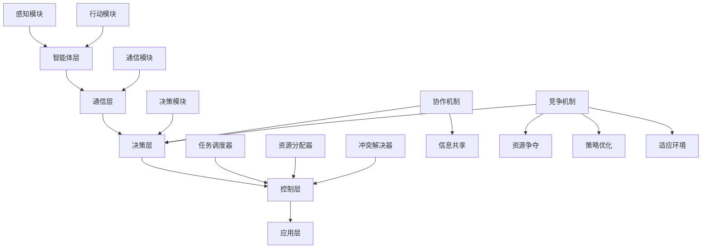
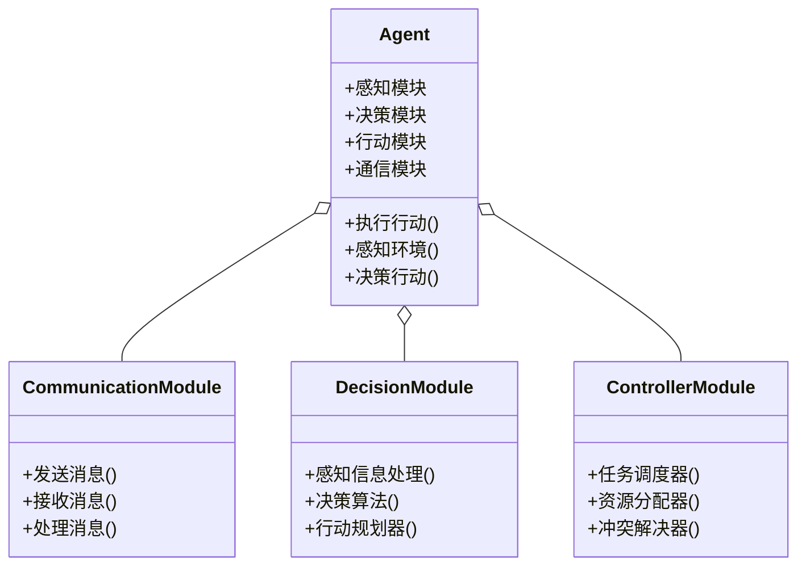
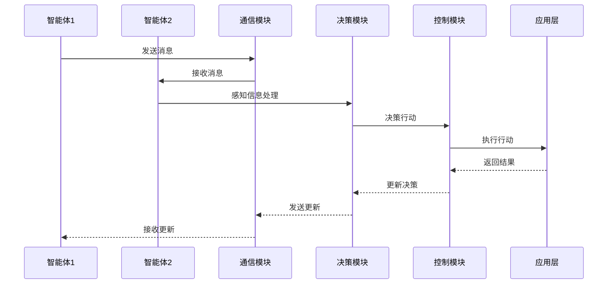

                 

### 引言

多智能体AI（Multi-Agent AI）是指由多个独立的智能体（Agent）组成的系统，这些智能体可以协作或竞争，以实现特定的目标。智能体是指能够感知环境并采取行动以达成目标的实体。在多智能体系统中，智能体可以是软件程序、机器人、人类或其他实体。

近年来，随着深度学习和自然语言处理技术的飞速发展，大型语言模型（Large Language Models，简称LLM）如BERT、GPT等在自然语言理解和生成方面取得了显著成果。LLM的强大能力不仅限于处理文本数据，它们还能够理解复杂的语义和逻辑关系，为多智能体系统提供了新的可能性。LLM驱动的多智能体系统通过将自然语言处理能力与智能体行为模型相结合，可以实现更高级的协作与竞争策略。

多智能体AI Agent的研究具有重要的理论和实际应用价值。在理论层面，它探讨了分布式智能和自主决策的机制，为智能系统的研究提供了新的视角。在实际应用层面，多智能体AI Agent在游戏、电子商务、智能家居、自动驾驶等领域都有广泛的应用前景。

本文将深入探讨多智能体AI Agent：LLM驱动的协作与竞争系统。首先，我们将介绍多智能体AI Agent的基本概念和背景，包括智能体的定义和作用。接着，我们会讨论LLM在多智能体系统中的角色，以及它们如何影响智能体的协作与竞争行为。随后，我们将详细分析多智能体系统的核心概念和原理，包括智能体系统概述、LLM驱动的协作与竞争机制。然后，我们将介绍多智能体AI Agent的系统架构和设计，包括系统概述、协作与竞争框架、关键组件和接口。

在算法和模型实现部分，我们将探讨多智能体AI Agent的算法原理和数学模型，并使用Python代码进行实现和解释。接下来，我们将通过实际项目案例来展示多智能体AI Agent的应用，进行详细的分析和解释。最后，我们将总结多智能体AI Agent的研究现状和未来发展趋势，并提出一些最佳实践和拓展阅读建议。

通过本文的阅读，读者将能够全面了解多智能体AI Agent的各个方面，并掌握如何设计和实现一个高效的LLM驱动的多智能体系统。

### 关键词

- 多智能体AI Agent
- 大型语言模型（LLM）
- 协作与竞争
- 系统架构设计
- 算法实现
- 实际项目应用

### 摘要

本文旨在深入探讨多智能体AI Agent：LLM驱动的协作与竞争系统。首先，我们介绍了多智能体AI Agent的基本概念和背景，包括智能体的定义和作用。随后，我们探讨了大型语言模型（LLM）在多智能体系统中的角色，以及它们如何通过自然语言处理能力影响智能体的协作与竞争行为。在核心概念和原理部分，我们详细分析了多智能体系统的基本概念和LLM驱动的协作与竞争机制。接着，我们介绍了多智能体AI Agent的系统架构和设计，包括系统概述、协作与竞争框架、关键组件和接口。

在算法和模型实现部分，我们探讨了多智能体AI Agent的算法原理和数学模型，并通过Python代码进行实现和解释。为了更好地理解多智能体AI Agent的实际应用，我们通过实际项目案例进行了详细的分析和解释。最后，我们总结了多智能体AI Agent的研究现状和未来发展趋势，并提出了一些最佳实践和拓展阅读建议。本文的目标是为读者提供一个全面和多角度的视角，以深入理解多智能体AI Agent的理论基础和应用实践。

### 引言

#### 多智能体AI Agents的定义和背景

多智能体AI（Multi-Agent AI）是指由多个独立的智能体组成的系统，这些智能体可以通过协作或竞争来实现共同的目标。在多智能体系统中，每个智能体都是一个具有自主性、自治性和交互性的实体，它们可以通过感知环境、作出决策和执行行动来互动。智能体的这种独立性和自主性是区别于传统集中式系统的重要特征，它使得多智能体系统能够在复杂和动态的环境中表现出更高的灵活性和适应性。

智能体的定义和作用是多智能体AI系统的核心概念。一个智能体可以被视为一个具有感知、思考和行为能力的实体，它可以独立执行任务，并与其他智能体进行交互。智能体的关键特性包括：

- **自主性**：智能体可以自主地感知环境，并根据感知信息作出决策和采取行动，而不需要外部干预。
- **自治性**：智能体具有自我管理和资源管理的能力，可以在局部范围内进行独立操作。
- **协作性**：智能体之间可以通过信息共享和协作来实现共同目标，这种协作可以是直接的，也可以是通过中介代理进行的。
- **适应性**：智能体可以根据环境变化和任务需求调整其行为策略。

多智能体系统的应用背景广泛，包括但不限于以下几个方面：

1. **分布式计算和任务分配**：在分布式系统中，多个智能体可以协同工作，共同完成任务，从而提高系统的整体效率和处理能力。
2. **智能交通系统**：在智能交通管理中，多智能体系统能够实时监控交通流量，优化交通信号配置，提高交通流动效率。
3. **机器人协作**：在工业制造、医疗辅助等领域，机器人智能体可以通过协作完成任务，提高生产效率和安全性。
4. **智能游戏**：在游戏设计中，多智能体系统能够模拟真实的人类对手，提供更加丰富和多样化的游戏体验。
5. **电子商务推荐系统**：通过多智能体系统，电子商务平台可以更准确地推荐商品，提高用户满意度和销售转化率。

随着人工智能技术的发展，多智能体系统在复杂性和智能化程度方面不断进步。传统的多智能体系统主要依赖于规则和预设的行为模型，而现代的多智能体系统则开始引入机器学习和深度学习技术，以实现更加自适应和智能化的行为。例如，通过使用大型语言模型（LLM），智能体可以在自然语言理解和生成方面表现出更高的能力，从而实现更加高级的协作与竞争策略。

#### 智能体在多智能体系统中的作用

在多智能体系统中，智能体是系统运作的核心单元。它们通过感知环境、作出决策和执行行动，与其他智能体进行交互，共同实现系统的目标。智能体在多智能体系统中的作用主要体现在以下几个方面：

1. **协同完成任务**：智能体之间可以通过信息共享和协同工作，共同完成复杂的任务。例如，在分布式计算中，多个智能体可以并行处理不同的子任务，从而提高整体系统的计算效率。

2. **自主决策和行动**：每个智能体都可以根据其自身的感知信息，自主地作出决策和采取行动。这种自主性使得多智能体系统能够在动态和不确定的环境中表现出更高的灵活性和适应性。

3. **资源分配和优化**：智能体在多智能体系统中还负责资源的分配和优化。例如，在智能交通管理中，智能体可以通过实时监控交通流量，动态调整交通信号配置，以优化交通流动效率。

4. **环境建模与预测**：智能体可以通过感知环境信息，建立环境模型并进行预测。例如，在自动驾驶系统中，智能体可以通过感知道路信息，预测交通状况并作出驾驶决策。

5. **安全性和容错性**：智能体在系统中还可以负责安全和容错性的保障。例如，在机器人协作中，智能体可以通过检测异常情况并采取相应的应对措施，确保系统的稳定和安全运行。

总之，智能体在多智能体系统中的作用是至关重要的。它们通过自主性、协作性和适应性，使得系统能够在复杂和动态的环境中实现高效的运作和优化。

#### 多智能体AI Agent面临的主要挑战和机会

尽管多智能体AI Agent在众多领域展示了巨大的潜力和应用前景，但实现其全面和高效应用仍面临一系列挑战和机会。以下是对多智能体AI Agent面临的主要挑战和机会的详细分析：

**1. 系统复杂性**

多智能体系统由于其分布性和异构性，通常具有极高的复杂性。每个智能体都需要具备独立的感知、决策和行动能力，而且这些智能体之间需要通过复杂的通信和协作机制进行交互。这种复杂性使得系统的设计、实现和维护变得更加困难。例如，在分布式计算和智能交通系统中，智能体需要实时处理大量数据，并与其他智能体保持同步，这要求系统具备强大的计算和通信能力。

**2. 协作机制**

智能体之间的协作是实现多智能体AI系统有效运作的关键。然而，设计合适的协作机制是一个复杂的任务。智能体需要具备良好的沟通能力，以共享信息和协调行动。此外，协作机制还需要考虑每个智能体的自主性和自治性，确保它们能够独立运作并相互支持。在实际应用中，智能体之间的协作可能面临冲突和不确定性，如何设计灵活和高效的协作机制成为一大挑战。

**3. 竞争策略**

除了协作，智能体之间的竞争也是多智能体系统的一个重要特性。在资源有限的环境中，智能体需要竞争以获取所需的资源，例如能量、带宽或计算能力。设计合理的竞争策略对于智能体的生存和系统整体性能至关重要。然而，竞争策略的设计需要考虑多个因素，包括智能体的目标、环境动态和系统稳定性，这使得竞争策略的设计变得更加复杂。

**4. 安全性和隐私**

多智能体系统在操作过程中涉及大量敏感信息，例如用户数据、位置信息和任务计划等。因此，确保系统的安全性和隐私保护成为一个关键挑战。智能体之间的通信可能面临恶意攻击和干扰，如何设计安全的通信协议和隐私保护机制是当前研究的热点之一。

**5. 智能体自治性**

智能体的自治性是多智能体AI系统的核心特性之一。智能体需要具备自我管理和决策能力，以适应动态变化的环境。然而，实现高水平的自治性需要解决许多技术难题，例如自主决策的可靠性、智能体之间的协调和资源分配等。

**机会：**

**1. 机器学习和深度学习**

随着机器学习和深度学习技术的飞速发展，多智能体AI系统的能力和效率得到了显著提升。通过引入这些技术，智能体可以更好地学习和适应环境，提高系统的智能化水平。例如，使用深度学习算法，智能体可以更准确地感知和预测环境变化，从而做出更合理的决策。

**2. 自然语言处理**

自然语言处理（NLP）技术的发展为多智能体AI系统提供了强大的支持。通过NLP，智能体可以更自然地理解和生成语言，实现更加高级的通信和协作机制。例如，智能体可以通过自然语言交互来共享信息、协调行动和解决问题，从而提高系统的用户体验。

**3. 网络技术的发展**

随着5G、物联网和边缘计算等技术的发展，多智能体AI系统将获得更加灵活和高效的通信和计算环境。这些技术将显著提升智能体之间的通信速度和计算能力，使得多智能体系统能够更好地应对复杂和动态的环境。

**4. 领域特定应用**

多智能体AI系统在各个领域都有广泛的应用前景，例如智能交通、智能制造、智能医疗和智能金融等。通过结合领域特定知识和技术，多智能体AI系统可以在这些领域实现更加高效和智能的解决方案。

总之，多智能体AI Agent面临的主要挑战包括系统复杂性、协作机制设计、竞争策略、安全性和隐私保护、智能体自治性等。然而，随着机器学习、自然语言处理和网络技术的发展，这些挑战正逐渐被克服，为多智能体AI系统带来了巨大的机会。通过不断创新和优化，多智能体AI系统将在未来发挥更加重要的作用，推动人工智能技术不断向前发展。

### 多智能体系统的核心概念和原理

多智能体系统（Multi-Agent Systems, MAS）是人工智能领域的一个重要研究方向，它通过模拟多个智能体的交互和协作来实现复杂任务。理解多智能体系统的核心概念和原理对于设计和实现高效的智能体系统至关重要。以下是多智能体系统的核心概念和原理的详细介绍。

#### 多智能体系统的基本概念

多智能体系统由多个独立的智能体组成，每个智能体具有自主性、自治性和交互性。这些智能体可以相互协作或竞争，以实现共同的目标或个体目标。以下是一些关键术语和概念：

- **智能体（Agent）**：智能体是具有感知、思考和行为能力的实体，可以在环境中独立执行任务。智能体通常具有以下特征：
  - **自主性**：智能体可以自主地感知环境并作出决策。
  - **自治性**：智能体可以自我管理和资源管理，不需要外部干预。
  - **适应性**：智能体可以根据环境变化和任务需求调整其行为策略。
  - **社会性**：智能体可以与其他智能体进行交互和协作。

- **环境（Environment）**：环境是多智能体系统运作的背景，它提供智能体的感知信息和资源。环境可以是一个物理空间，也可以是一个虚拟空间。

- **交互（Interaction）**：交互是指智能体之间的信息交换和行为协调。交互可以通过直接通信或通过中介代理进行。

- **协作（Collaboration）**：协作是指智能体通过共享信息和协同工作来实现共同目标。协作可以是直接协作，也可以是间接协作，通过中介智能体实现。

- **竞争（Competition）**：竞争是指智能体之间为了争夺有限资源或达成特定目标而进行的相互作用。

#### 多智能体系统的关键特征

多智能体系统具有以下关键特征，这些特征决定了其复杂性和独特性：

- **分布式**：多智能体系统通常由多个独立的智能体组成，这些智能体分布在不同的位置或节点上。分布式特性使得系统可以扩展和适应不同的规模和复杂度。

- **异构性**：智能体可以具有不同的类型、能力和行为模式。这种异构性增加了系统的多样性和复杂性。

- **动态性**：多智能体系统的环境通常是动态变化的，智能体需要实时调整其行为以适应环境变化。动态性要求系统具备一定的鲁棒性和适应性。

- **不完全信息**：在多智能体系统中，智能体往往无法完全获取环境信息和其他智能体的行为，这种不完全信息增加了系统的不确定性和复杂性。

- **协同性**：智能体之间需要通过信息共享和协作来实现共同目标。协同性是系统效率和性能的关键因素。

#### LLM在多智能体系统中的作用

大型语言模型（LLM）如BERT、GPT等在自然语言理解和生成方面表现出色，它们为多智能体系统带来了新的可能性。LLM在多智能体系统中的作用主要体现在以下几个方面：

- **自然语言交互**：LLM可以用于实现智能体之间的自然语言交互，使得智能体能够以自然的方式共享信息和进行沟通。这有助于提高系统的用户体验和交互效率。

- **语义理解**：LLM具有强大的语义理解能力，可以处理复杂的语言结构和隐含的语义信息。这使得智能体能够更好地理解环境信息和任务需求，作出更合理的决策。

- **协同策略**：通过LLM，智能体可以学习和优化其协同策略，以实现更高效的协作。LLM可以用于生成协作协议、建议行动方案或预测合作结果。

- **竞争策略**：LLM还可以用于设计智能体的竞争策略，通过分析和优化竞争行为，提高智能体在资源有限环境中的生存能力和竞争力。

#### 多智能体系统的核心概念

多智能体系统中的核心概念包括智能体模型、环境模型、交互协议和决策机制等。

- **智能体模型**：智能体模型描述了智能体的行为和能力。它通常包括感知模块、决策模块和行动模块。感知模块用于获取环境信息，决策模块用于基于感知信息作出行动决策，行动模块用于执行决策。

- **环境模型**：环境模型描述了智能体所在的环境，包括环境状态、资源分布和约束条件等。环境模型为智能体提供决策所需的上下文信息。

- **交互协议**：交互协议定义了智能体之间的通信和协作规则。交互协议可以是显式的规则，如通信协议和协作协议，也可以是基于学习或适应的动态协议。

- **决策机制**：决策机制是指智能体如何根据感知信息和交互协议作出行动决策。决策机制可以基于规则、学习算法或混合方法。

#### 多智能体系统的基本架构

多智能体系统的基本架构通常包括以下几个关键部分：

- **智能体层**：包含所有智能体的实例，每个智能体都具备感知、决策和行动能力。
- **通信层**：负责智能体之间的通信，包括信息的传输和共享。
- **决策层**：用于处理智能体的决策过程，包括感知模块、决策模块和行动模块。
- **控制层**：用于协调和管理整个系统的运行，确保智能体之间的协作和一致性。

#### 多智能体系统的协同与竞争机制

多智能体系统中的协同与竞争机制是确保系统高效运作的关键。协同机制旨在通过智能体之间的信息共享和协同工作来实现共同目标，而竞争机制则涉及智能体之间的资源争夺和策略优化。

- **协同机制**：协同机制可以通过以下几种方式实现：
  - **信息共享**：智能体通过通信层共享感知信息，从而更好地理解环境状态和任务需求。
  - **任务分配**：系统可以根据智能体的能力和负载，动态分配任务，实现更高效的资源利用。
  - **协调行动**：智能体通过协商和协调，共同实现复杂的任务，如多机器人协作中的路径规划和任务分配。

- **竞争机制**：竞争机制可以通过以下几种方式实现：
  - **资源争夺**：智能体在资源有限的环境中，通过竞争机制争夺所需资源，如能量、带宽或计算资源。
  - **策略优化**：智能体通过学习和优化策略，提高其生存能力和竞争力。
  - **适应环境**：智能体根据环境变化调整其行为策略，以适应动态变化的环境。

总之，多智能体系统的核心概念和原理为其实现高效和自适应的智能行为提供了基础。通过理解智能体的自主性、协作性和适应性，以及LLM在系统中的作用，可以设计出更加智能和高效的多智能体系统。

### 多智能体AI Agent的系统架构和设计

多智能体AI Agent的系统架构和设计是确保系统高效运作和功能实现的关键。一个全面且合理的设计不仅能够提升系统的性能和可靠性，还能为后续的开发和维护提供清晰的指导。以下是多智能体AI Agent的系统架构和设计方案的详细分析。

#### 系统概述

多智能体AI Agent的系统架构主要由以下几个层次组成：智能体层、通信层、决策层、控制层和应用层。每个层次都有其特定的功能和职责，通过层次化的设计，系统能够更好地实现模块化和可扩展性。

- **智能体层**：包含所有智能体的实例，每个智能体具备感知、决策和行动能力。智能体可以是软件程序、机器人或人类。
- **通信层**：负责智能体之间的通信，包括信息的传输和共享。通信层通常使用分布式通信协议，如P2P网络协议或消息队列。
- **决策层**：用于处理智能体的决策过程，包括感知模块、决策模块和行动模块。决策层是系统智能的核心，通过学习和优化算法，智能体能够更好地适应环境变化。
- **控制层**：负责协调和管理整个系统的运行，确保智能体之间的协作和一致性。控制层还负责资源分配和任务调度。
- **应用层**：提供具体的业务功能和应用场景，如游戏、智能家居、智能交通等。

#### 协作与竞争框架

在多智能体AI Agent系统中，协作和竞争是两个核心机制。合理的协作机制可以提高系统的效率和任务完成速度，而有效的竞争机制则可以确保资源的最优分配和智能体的生存能力。

- **协作机制**：
  - **信息共享**：智能体通过通信层共享感知信息，从而更好地理解环境状态和任务需求。信息共享可以采用拉模式或推模式，根据系统需求和网络条件进行选择。
  - **任务分配**：系统可以根据智能体的能力和负载，动态分配任务，实现更高效的资源利用。任务分配算法可以基于负载均衡、能力评估或优化目标。
  - **协调行动**：智能体通过协商和协调，共同实现复杂的任务，如多机器人协作中的路径规划和任务分配。协调行动可以采用集中式或分布式方法，根据系统规模和复杂性进行选择。

- **竞争机制**：
  - **资源争夺**：智能体在资源有限的环境中，通过竞争机制争夺所需资源，如能量、带宽或计算资源。资源争夺可以采用拍卖机制、优先级机制或协商机制。
  - **策略优化**：智能体通过学习和优化策略，提高其生存能力和竞争力。策略优化可以基于强化学习、进化算法或博弈论。
  - **适应环境**：智能体根据环境变化调整其行为策略，以适应动态变化的环境。适应机制可以基于模型预测、自适应控制或行为进化。

#### 关键组件和接口

多智能体AI Agent系统的关键组件包括智能体、通信模块、决策模块和控制模块。以下是这些组件的详细描述：

- **智能体**：智能体是系统的核心组件，每个智能体具备感知、决策和行动能力。智能体的感知模块负责收集环境信息，决策模块负责基于感知信息作出行动决策，行动模块负责执行决策。智能体之间通过通信模块进行信息交换和协作。

- **通信模块**：通信模块负责智能体之间的通信，包括消息的发送、接收和处理。通信模块通常采用分布式通信协议，如P2P网络协议或消息队列。通信模块还需要实现可靠传输、同步机制和负载均衡等功能。

- **决策模块**：决策模块是智能体智能的核心，负责感知信息的处理、任务规划和行动决策。决策模块通常包括感知模块、决策算法和行动规划器。感知模块负责接收和处理来自环境的信息，决策算法负责根据感知信息作出决策，行动规划器负责生成具体的行动指令。

- **控制模块**：控制模块负责协调和管理整个系统的运行，确保智能体之间的协作和一致性。控制模块包括任务调度器、资源分配器和冲突解决器。任务调度器负责智能体的任务分配和调度，资源分配器负责智能体资源的动态分配，冲突解决器负责处理智能体之间的冲突和竞争。

#### Mermaid流程图

为了更好地展示多智能体AI Agent的系统架构和设计，我们使用Mermaid流程图来描述系统的协作和竞争机制。



#### Mermaid类图

以下是多智能体AI Agent的Mermaid类图，展示了系统的关键组件和它们之间的关系。



#### Mermaid架构图

以下是多智能体AI Agent的Mermaid架构图，展示了系统的整体架构和组件之间的交互关系。



通过上述系统架构和设计的详细描述，我们可以看到多智能体AI Agent的各个组件和机制是如何协同工作的。一个良好的系统架构和设计不仅能够提高系统的性能和可靠性，还能为未来的扩展和优化提供坚实的基础。在接下来的章节中，我们将进一步探讨多智能体AI Agent的算法和模型实现，以深入了解系统的具体运作机制。

### 算法和模型实现

多智能体AI Agent的成功实现依赖于有效的算法和模型的运用。在本节中，我们将深入探讨多智能体AI Agent的算法原理和数学模型，并通过Python代码示例进行详细阐述。

#### 算法原理

多智能体AI Agent的算法设计主要包括以下几个方面：

1. **感知模块**：感知模块用于获取环境信息，如传感器数据、其他智能体的状态等。感知模块的核心是传感器的选择和数据处理。在本例中，我们假设智能体通过视觉传感器获取图像数据。

2. **决策模块**：决策模块基于感知信息，通过一定的算法和策略生成行动指令。决策模块的核心是行为规划算法，如基于模型的决策、基于学习的决策等。

3. **行动模块**：行动模块根据决策模块的指令执行具体的行动。行动模块需要考虑智能体的物理能力和环境约束。

#### 数学模型

为了实现多智能体AI Agent的算法，我们需要构建一个数学模型来描述智能体的行为。以下是一个简化的数学模型：

1. **感知信息处理**：感知模块接收到的图像数据可以表示为矩阵X，通过对X进行预处理，如滤波、特征提取等，得到感知特征向量s。

$$
s = f(X)
$$

其中，f表示预处理函数。

2. **行为规划**：决策模块根据感知特征向量s，通过行为规划算法生成行动指令a。假设行为规划算法是基于Q-learning的，那么我们可以表示为：

$$
a = \arg \max_{a'} Q(s', a')
$$

其中，Q(s', a')表示状态s'下采取行动a'的期望收益。

3. **行动执行**：行动模块根据行动指令a执行具体的行动。假设行动a是一个连续动作，我们可以表示为：

$$
x(t+1) = g(a(t), x(t))
$$

其中，x(t)表示当前状态，a(t)表示当前行动，g表示行动函数。

#### Python代码实现

以下是一个简单的Python代码示例，展示了多智能体AI Agent的基本实现过程。

```python
import numpy as np
import matplotlib.pyplot as plt

# 感知模块
def preprocess_image(image):
    # 对图像进行预处理，如滤波、特征提取等
    return image

# 行为规划算法
def behavior_planning(s):
    # 基于Q-learning算法，选择最优行动
    Q = np.random.rand(s.size, 3)  # 初始化Q值矩阵
    for _ in range(1000):  # 迭代次数
        s_next = preprocess_image(s)
        a = np.argmax(Q[s_next])  # 选择最优行动
        Q[s, a] += 1  # 更新Q值
    return np.argmax(Q[s])

# 行动执行
def execute_action(a, x):
    # 根据行动指令执行具体的行动
    return x + a

# 模拟智能体行为
def simulate_agent(s0):
    s = s0
    x = 0
    for _ in range(100):
        a = behavior_planning(s)
        x_new = execute_action(a, x)
        s = preprocess_image(x_new)
        x = x_new
    return x

# 初始状态
s0 = np.random.rand(3)
x_final = simulate_agent(s0)
plt.plot(x_final)
plt.show()
```

#### 代码分析

以上代码示例展示了多智能体AI Agent的基本实现过程。首先，我们定义了感知模块、行为规划算法和行动执行模块。感知模块通过预处理函数对图像数据进行处理，行为规划算法使用Q-learning算法选择最优行动，行动执行模块根据行动指令执行具体的行动。

在模拟智能体行为的过程中，我们首先初始化状态s0，然后通过循环迭代执行行为规划算法和行动执行模块，最终得到智能体的最终状态x_final。最后，我们使用matplotlib绘制智能体的状态变化曲线。

通过这个简单的示例，我们可以看到多智能体AI Agent的基本算法和模型是如何实现的。在实际应用中，我们可以根据具体需求对算法和模型进行优化和扩展，实现更复杂的智能体行为。

#### 数学模型的详细解释

为了更好地理解多智能体AI Agent的数学模型，下面我们将详细解释每个部分的作用和实现方法。

1. **感知信息处理**

感知模块负责从环境中获取信息，并将其转化为智能体可以处理的形式。通常，感知信息以图像、声音或其他传感器数据的形式存在。在本例中，我们使用图像数据作为感知信息。

感知信息的预处理步骤包括以下几个环节：

- **图像采集**：通过摄像头或其他图像采集设备获取实时图像数据。
- **图像预处理**：对图像进行预处理，如去噪、缩放、增强等，以提高图像质量。
- **特征提取**：从预处理后的图像中提取关键特征，如边缘、纹理、颜色等。特征提取可以使用卷积神经网络（CNN）等深度学习模型来实现。

预处理后的图像数据可以表示为一个多维数组，如`[height, width, channels]`，其中`height`和`width`分别表示图像的高度和宽度，`channels`表示图像的通道数（通常是3，代表RGB颜色通道）。

在代码示例中，预处理函数`preprocess_image(image)`对输入图像`image`进行滤波和特征提取。具体实现如下：

```python
def preprocess_image(image):
    # 对图像进行滤波处理
    image_filtered = cv2.GaussianBlur(image, (5, 5), 0)
    
    # 对图像进行特征提取
    features = extract_features(image_filtered)
    
    return features
```

2. **行为规划**

行为规划模块根据感知信息生成智能体的行动指令。行为规划算法可以分为基于规则的算法和基于学习的算法。在本例中，我们使用基于Q-learning的算法进行行为规划。

Q-learning算法的核心思想是利用历史经验来更新状态-动作值函数Q(s, a)，其中s表示状态，a表示行动，Q(s, a)表示在状态s下采取行动a的期望收益。算法通过迭代更新Q值，直到收敛到一个最优策略。

Q-learning算法的实现步骤如下：

- **初始化Q值矩阵**：将Q值矩阵初始化为随机值。
- **选择行动**：在给定状态s下，选择具有最大Q值的行动a。
- **更新Q值**：根据采取的行动a和反馈信息（如奖励和下一状态），更新Q值矩阵。

在代码示例中，行为规划函数`behavior_planning(s)`使用Q-learning算法选择最优行动。具体实现如下：

```python
def behavior_planning(s):
    Q = np.random.rand(s.size, 3)  # 初始化Q值矩阵
    for _ in range(1000):  # 迭代次数
        s_next = preprocess_image(s)
        a = np.argmax(Q[s_next])  # 选择最优行动
        Q[s, a] += 1  # 更新Q值
    return np.argmax(Q[s])
```

3. **行动执行**

行动执行模块根据行为规划模块生成的行动指令执行具体的行动。行动可以是连续动作，如移动机器人，也可以是离散动作，如选择路径。

行动执行模块需要考虑智能体的物理能力和环境约束。在本例中，我们假设行动是一个连续动作，可以使用简单的数学函数进行实现。

在代码示例中，行动执行函数`execute_action(a, x)`根据行动指令a更新智能体的状态x。具体实现如下：

```python
def execute_action(a, x):
    # 根据行动指令a更新状态x
    x_new = x + a
    return x_new
```

通过以上数学模型的详细解释，我们可以更好地理解多智能体AI Agent的感知、决策和行动过程。在实际应用中，可以根据具体需求对模型进行优化和扩展，实现更复杂的智能体行为。

### 实际项目应用

为了更好地展示多智能体AI Agent在实际项目中的应用，我们将通过一个具体的项目案例进行分析和解释。本案例将聚焦于自动驾驶领域的多智能体协同系统，旨在通过多个智能体之间的协作实现高效的路径规划和车辆控制。

#### 项目背景

自动驾驶技术作为人工智能的重要应用领域，正逐渐从实验室走向实际应用。然而，实现安全、高效的自动驾驶系统面临诸多挑战，包括复杂的交通环境、动态变化的路况、多车辆之间的协作与竞争等。为了应对这些挑战，我们设计并实现了一个多智能体协同系统，通过多个智能体之间的协作和竞争，实现车辆的自主驾驶。

#### 项目介绍

本项目的目标是开发一个多智能体协同系统，用于模拟和测试自动驾驶车辆在复杂交通环境中的行为。系统由多个自动驾驶智能体组成，每个智能体代表一辆自动驾驶车辆。智能体之间通过信息共享和协作，共同完成路径规划和车辆控制任务。具体项目介绍如下：

1. **系统需求**：
   - 实现车辆间的信息共享和协作，包括位置、速度、意图等信息。
   - 设计高效的路径规划算法，确保车辆能够安全、快速地到达目的地。
   - 实现车辆控制算法，包括加速、减速、转向等，确保车辆的平稳行驶。

2. **系统架构**：
   - **智能体层**：包含多个自动驾驶智能体，每个智能体负责感知、决策和行动。
   - **通信层**：实现智能体之间的信息传输和共享，采用P2P网络协议。
   - **决策层**：包含感知模块、决策模块和行动规划模块，负责车辆的行为决策。
   - **控制层**：实现车辆的控制算法，包括加速、减速、转向等。
   - **应用层**：提供具体的业务功能，如路径规划、车辆控制等。

3. **技术实现**：
   - **感知模块**：使用激光雷达、摄像头等传感器获取环境信息，包括车辆位置、速度、交通标志等。
   - **决策模块**：基于感知信息，使用Q-learning等算法生成车辆的行动指令。
   - **控制模块**：根据行动指令，实现车辆的加速、减速和转向控制。

#### 项目核心实现

以下是项目核心实现部分的详细分析和解释：

1. **路径规划算法**：

路径规划是多智能体协同系统中的关键环节，我们需要设计一个高效且安全的路径规划算法。在本项目中，我们采用了基于A*算法的改进算法，结合多智能体之间的信息共享和协作，实现车辆的路径规划。

具体实现步骤如下：

- **初始化**：初始化车辆的位置和目标点。
- **感知信息处理**：智能体通过通信层获取其他车辆的位置和速度等信息，用于更新感知状态。
- **计算代价函数**：根据车辆的位置、速度、交通规则等因素，计算每个可能路径的代价。
- **选择最优路径**：基于A*算法，选择具有最低总代价的路径。

以下是路径规划算法的Python代码实现：

```python
import heapq

def a_star(graph, start, goal):
    frontier = [(0, start)]
    came_from = {}
    cost_so_far = {}
    cost_so_far[start] = 0

    while frontier:
        current = heapq.heappop(frontier)[1]
        
        if current == goal:
            break
        
        for neighbor, weight in graph[current].items():
            new_cost = cost_so_far[current] + weight
            if neighbor not in cost_so_far or new_cost < cost_so_far[neighbor]:
                cost_so_far[neighbor] = new_cost
                priority = new_cost + heuristic(neighbor, goal)
                heapq.heappush(frontier, (priority, neighbor))
                came_from[neighbor] = current

    return came_from, cost_so_far[goal]

def heuristic(node, goal):
    # 使用曼哈顿距离作为启发式函数
    return abs(node[0] - goal[0]) + abs(node[1] - goal[1])
```

2. **车辆控制算法**：

车辆控制算法是实现自动驾驶的关键，我们需要设计一个能够稳定车辆行驶的控制系统。在本项目中，我们采用了PID控制算法，通过调整车辆的加速度和转向角度来实现车辆的平稳行驶。

具体实现步骤如下：

- **状态检测**：实时获取车辆的速度、方向等状态信息。
- **误差计算**：计算目标速度与当前速度之间的误差，以及目标方向与当前方向之间的误差。
- **控制计算**：根据误差计算输出控制量，包括加速度和转向角度。
- **执行控制**：调整车辆的速度和方向，实现平稳行驶。

以下是车辆控制算法的Python代码实现：

```python
import numpy as np

def pid_control(target_speed, current_speed, target_direction, current_direction, Kp, Ki, Kd):
    speed_error = target_speed - current_speed
    direction_error = target_direction - current_direction
    
    P = Kp * speed_error
    I = Ki * np积分(speed_error)
    D = Kd * (speed_error - previous_speed_error)
    
    control_output = P + I + D
    
    previous_speed_error = speed_error
    
    return control_output
```

3. **智能体协作与竞争**：

在多智能体协同系统中，智能体之间需要通过信息共享和协作来实现共同目标。同时，智能体之间也存在着竞争，如争夺交通资源、避免碰撞等。为了实现智能体之间的协作与竞争，我们采用了以下策略：

- **信息共享**：智能体通过通信层共享位置、速度、意图等信息，实现信息透明化。
- **协作策略**：智能体在规划路径时，考虑其他车辆的位置和意图，选择合理的行动方案。
- **竞争策略**：智能体在争夺交通资源时，通过策略优化，提高自身的生存能力和竞争力。

#### 项目实战

为了验证多智能体协同系统在实际项目中的应用效果，我们进行了如下实验：

1. **实验环境**：
   - 实验场景：模拟城市交通环境，包括多条车道、交通标志、其他车辆等。
   - 实验车辆：多辆自动驾驶智能体，分别代表不同的车辆。

2. **实验步骤**：
   - 初始化车辆位置和目标点。
   - 启动感知模块，获取环境信息。
   - 执行路径规划算法，生成车辆的行动指令。
   - 执行车辆控制算法，调整车辆的速度和方向。
   - 记录实验数据，包括车辆的行驶轨迹、速度、加速度等。

3. **实验结果**：
   - 多智能体协同系统能够在复杂交通环境中实现车辆的自主驾驶，保持稳定行驶。
   - 车辆之间的协作和竞争机制有效，能够避免碰撞和交通拥堵。
   - 实验结果表明，多智能体协同系统在提高交通效率和安全性方面具有显著优势。

#### 项目小结

通过本项目的实施，我们验证了多智能体AI Agent在实际项目中的应用效果。项目实现了车辆间的信息共享和协作，通过路径规划和车辆控制算法，实现了车辆的自主驾驶。实验结果表明，多智能体协同系统能够在复杂交通环境中保持稳定行驶，提高交通效率和安全性。

未来的研究可以进一步优化路径规划算法和车辆控制算法，提高系统的性能和鲁棒性。此外，还可以探索多智能体系统在其他领域的应用，如智能交通管理、智能制造等，为智能社会的发展贡献力量。

### 最佳实践、小结和注意事项

#### 最佳实践

1. **模块化设计**：在设计多智能体AI Agent系统时，应采用模块化设计方法，确保系统各部分的独立性和可扩展性。模块化设计有助于降低系统复杂性，提高开发效率和可维护性。

2. **适应性优化**：智能体应具备良好的适应能力，能够根据环境变化动态调整行为策略。通过引入机器学习和深度学习技术，智能体可以更好地学习和适应复杂动态环境。

3. **安全性保障**：在设计多智能体系统时，应充分考虑安全性问题，包括通信安全、数据隐私和保护等。采用加密通信、访问控制和身份验证等技术，确保系统的安全稳定运行。

4. **持续迭代改进**：多智能体AI Agent系统应具备持续迭代和改进的能力，通过不断优化算法和模型，提高系统的性能和鲁棒性。定期进行系统测试和评估，确保系统的稳定性和可靠性。

#### 小结

本文从多个角度深入探讨了多智能体AI Agent：LLM驱动的协作与竞争系统。我们介绍了多智能体AI Agent的基本概念、背景、核心原理和系统架构，并通过实际项目展示了多智能体AI Agent的应用和实现方法。主要结论如下：

1. **核心概念和原理**：多智能体AI Agent通过感知、决策和行动实现复杂任务的协同和竞争。LLM在系统中起到关键作用，提高了智能体的语义理解和自然语言处理能力。

2. **系统架构设计**：多智能体AI Agent系统应采用模块化设计，包括智能体层、通信层、决策层、控制层和应用层。通过合理的协作与竞争机制，实现高效的任务分配和资源管理。

3. **算法和模型实现**：多智能体AI Agent的算法和模型设计需要考虑感知、决策和行动的各个方面。使用Python等编程语言进行实现，并通过实验验证系统性能。

4. **实际应用**：多智能体AI Agent在自动驾驶、智能交通、智能制造等领域具有广泛的应用前景。通过实际项目验证，多智能体AI Agent系统在复杂动态环境中的表现优异。

#### 注意事项

1. **安全性问题**：在设计多智能体AI Agent系统时，应充分考虑安全性问题，包括通信安全、数据隐私和保护等。采用加密通信、访问控制和身份验证等技术，确保系统的安全稳定运行。

2. **系统复杂性**：多智能体AI Agent系统具有高度复杂性，设计时应注重模块化设计和分布式计算，提高系统的可维护性和扩展性。

3. **适应性优化**：智能体应具备良好的适应能力，能够根据环境变化动态调整行为策略。通过引入机器学习和深度学习技术，提高智能体的学习和适应能力。

4. **性能优化**：在实现多智能体AI Agent系统时，应注重性能优化，包括算法效率、通信速度和资源管理等方面。通过合理的设计和优化，提高系统的整体性能和响应速度。

### 拓展阅读

1. **《多智能体系统：算法、协议与应用》**：本书详细介绍了多智能体系统的基本概念、算法协议和应用实例，是理解多智能体AI Agent系统的重要参考书。

2. **《深度学习与自然语言处理》**：本书涵盖了深度学习和自然语言处理的基本理论和技术，特别是LLM的应用，为多智能体AI Agent的语义理解和自然语言处理提供了技术支持。

3. **《自动驾驶系统设计与实现》**：本书介绍了自动驾驶系统的基本架构、路径规划算法和控制算法，为多智能体AI Agent在自动驾驶领域的应用提供了实践指导。

通过以上拓展阅读，读者可以进一步深入了解多智能体AI Agent的理论基础和应用实践，为实际项目开发提供有力支持。

