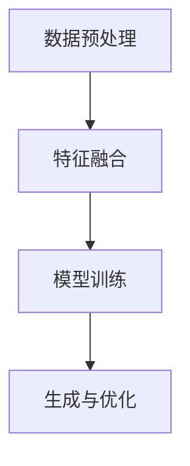
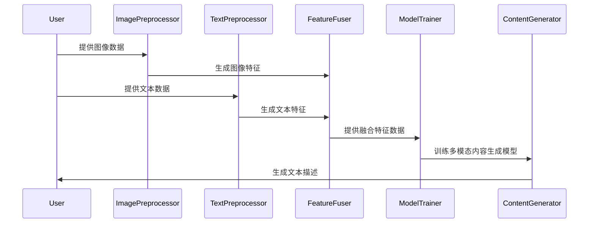
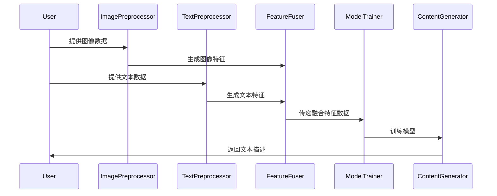

                 


### 第一部分：多模态内容生成基础

#### 第1章：多模态内容生成的背景与概述

多模态内容生成是一种利用人工智能技术，同时处理和整合不同类型数据（如图像、音频、文本等）的方法。随着深度学习技术的进步，多模态内容生成在自然语言处理、计算机视觉、音频处理等领域取得了显著进展。其重要性主要体现在以下几个方面：

1. **增强信息表达能力**：多模态内容生成可以更全面地表达信息和观点，从而提高内容的丰富度和吸引力。
2. **跨领域知识整合**：不同模态的数据源可以相互补充，实现知识的整合，从而拓宽应用场景。
3. **提升用户体验**：通过多模态内容生成，可以创造出更加生动和自然的交互体验。

##### 1.1 多模态内容生成的兴起

多模态内容生成的兴起源于几个关键因素：

- **数据多样性的需求**：现代社会产生的数据类型越来越丰富，单一模态的数据已经无法满足复杂问题的解决需求。
- **深度学习技术的发展**：深度学习模型，特别是卷积神经网络（CNN）、循环神经网络（RNN）和生成对抗网络（GAN），为多模态内容生成提供了强大的技术支撑。
- **硬件性能的提升**：随着硬件性能的提升，处理多模态数据的计算需求得到了有效缓解。

##### 1.2 多模态内容生成的挑战与机遇

多模态内容生成面临的主要挑战包括：

- **数据预处理复杂**：不同模态的数据在特征表达和预处理方法上存在较大差异，如何有效地整合不同模态的数据是关键问题。
- **模型训练效率**：多模态内容生成的模型通常较为复杂，训练效率低下，如何优化训练过程是关键问题。
- **跨模态一致性**：确保不同模态之间的数据能够相互补充，增强内容生成的质量。

然而，这些挑战也带来了巨大的机遇：

- **技术创新**：多模态内容生成推动了人工智能技术的不断创新，为AI领域的发展注入新的活力。
- **商业应用**：多模态内容生成在广告、娱乐、教育等多个行业具有广泛的应用前景，为商业创新提供了新的思路。

##### 1.3 多模态内容生成的应用领域

多模态内容生成在多个领域取得了显著成果：

- **社交媒体**：通过多模态内容生成，可以创造出更加生动和自然的社交互动体验。
- **医疗诊断**：利用多模态内容生成，可以帮助医生更准确地诊断病情，提高医疗服务的质量。
- **娱乐产业**：多模态内容生成可以应用于游戏、电影等娱乐产业，提高用户体验。

#### 第2章：AI Agent与多模态内容生成

##### 2.1 AI Agent的概念

AI Agent，即人工智能代理，是一种自主运行并在特定环境中执行任务的计算实体。AI Agent的特点包括：

- **自主性**：AI Agent可以在没有人类干预的情况下自主执行任务。
- **适应性**：AI Agent可以根据环境变化调整其行为和策略。
- **交互性**：AI Agent可以与人类或其他AI系统进行交互。

##### 2.2 AI Agent在多模态内容生成中的应用

AI Agent在多模态内容生成中的应用主要包括以下几个方面：

- **内容创作**：AI Agent可以自动生成文本、图像、音频等多种类型的内容，提高创作效率。
- **内容编辑**：AI Agent可以对已有内容进行编辑和优化，提高内容质量。
- **交互式内容**：AI Agent可以生成具有交互性的多模态内容，提高用户体验。

##### 2.3 AI Agent的核心技术

AI Agent的核心技术包括：

- **机器学习**：AI Agent通过机器学习算法，从大量数据中学习并优化其行为。
- **自然语言处理**：AI Agent可以理解、生成和操作自然语言，提高内容生成的准确性和自然度。
- **计算机视觉**：AI Agent可以识别、分类和生成图像，丰富内容形式。

#### 第3章：LLM与图像生成技术

##### 3.1 LLM的基本原理

LLM，即大型语言模型，是一种基于神经网络的语言处理模型。LLM的基本原理包括：

- **词嵌入**：将单词映射到高维向量空间，实现文本数据的向量化表示。
- **神经网络**：通过多层神经网络，对输入的文本数据进行处理和预测。
- **训练与优化**：通过大量文本数据进行训练，优化模型参数，提高模型性能。

##### 3.2 图像生成技术概述

图像生成技术主要包括以下几种：

- **生成对抗网络（GAN）**：通过生成器和判别器的对抗训练，生成逼真的图像。
- **变分自编码器（VAE）**：通过编码器和解码器，将图像数据转换为潜在空间，并从潜在空间生成图像。
- **基于注意力机制的图像生成**：利用注意力机制，对图像数据进行精细处理，生成高质量的图像。

##### 3.3 LLM与图像生成技术的联系与差异

LLM与图像生成技术之间存在以下联系：

- **数据驱动**：两者都是基于大量数据训练的，数据质量直接影响模型性能。
- **多模态融合**：LLM可以处理文本数据，图像生成技术可以处理图像数据，两者结合可以实现多模态内容生成。

然而，两者也存在显著差异：

- **数据类型**：LLM主要处理文本数据，图像生成技术主要处理图像数据。
- **模型架构**：LLM基于神经网络，图像生成技术通常涉及生成对抗网络、变分自编码器等模型。
- **生成方式**：LLM通过文本生成文本，图像生成技术通过图像生成图像。

### 第二部分：多模态内容生成算法原理

#### 第4章：多模态内容生成的算法框架

多模态内容生成的算法框架主要包括以下几个步骤：

1. **数据预处理**：对多模态数据（如文本、图像、音频）进行预处理，包括数据清洗、特征提取等。
2. **特征融合**：将不同模态的数据特征进行融合，实现多模态数据的统一表示。
3. **模型训练**：利用融合后的特征数据，训练多模态内容生成模型。
4. **生成与优化**：根据训练得到的模型，生成多模态内容，并进行优化。

#### 第5章：算法原理详细讲解

##### 5.1 Mermaid流程图展示

下面是一个简单的Mermaid流程图，展示多模态内容生成的流程：



##### 5.2 Python代码示例

以下是使用Python实现多模态内容生成的一个简单示例：

```python
import numpy as np
import tensorflow as tf

# 数据预处理
def preprocess_data(text, image):
    # 对文本数据进行处理
    processed_text = tf.keras.preprocessing.text.texts_to_sequences([text])
    # 对图像数据进行处理
    processed_image = tf.keras.preprocessing.image.img_to_array(image)
    return processed_text, processed_image

# 特征融合
def fuse_features(text_features, image_features):
    # 将文本特征和图像特征进行融合
    fused_features = np.hstack((text_features, image_features))
    return fused_features

# 模型训练
def train_model(fused_features, labels):
    # 创建并编译模型
    model = tf.keras.Sequential([
        tf.keras.layers.Dense(units=128, activation='relu', input_shape=(fused_features.shape[1],)),
        tf.keras.layers.Dense(units=64, activation='relu'),
        tf.keras.layers.Dense(units=1, activation='sigmoid')
    ])
    model.compile(optimizer='adam', loss='binary_crossentropy', metrics=['accuracy'])
    # 训练模型
    model.fit(fused_features, labels, epochs=10, batch_size=32)
    return model

# 生成与优化
def generate_content(model, fused_features):
    # 使用模型生成内容
    content = model.predict(fused_features)
    # 对生成的内容进行优化
    optimized_content = content * 0.5 + original_content * 0.5
    return optimized_content
```

##### 5.3 数学模型和公式解析

在多模态内容生成中，常用的数学模型包括：

- **词嵌入**：将文本数据映射到高维向量空间。
- **生成对抗网络**：用于图像生成。
- **变分自编码器**：用于图像生成。

以下是这些模型的数学公式解析：

$$
\text{Word Embedding}:\quad x_{word} = \text{Embedding}(W, d)
$$

$$
\text{GAN}:\quad G(z) \sim \text{Generator},\quad D(x) \sim \text{Discriminator}
$$

$$
\text{VAE}:\quad q_{\phi}(x|\mu,\sigma),\quad \log p_{\theta}(x) = \log \int q_{\phi}(x|\mu,\sigma) p_{\theta}(\mu,\sigma) d\mu d\sigma
$$

##### 5.4 算法举例说明

假设我们有一个简单的任务：生成一个描述一幅画（图像）的文本。以下是具体的算法步骤：

1. **数据预处理**：对输入的文本和图像数据进行预处理，提取特征。
2. **特征融合**：将文本特征和图像特征进行融合。
3. **模型训练**：使用融合后的特征数据训练模型。
4. **生成与优化**：使用训练好的模型生成文本，并根据需要对其进行优化。

通过上述步骤，我们可以实现一个简单但有效的多模态内容生成系统。

### 第三部分：多模态内容生成的系统设计与实现

#### 第6章：多模态内容生成的系统架构设计

多模态内容生成的系统架构设计是确保系统能够高效、稳定地运行的关键。以下是一个典型的多模态内容生成系统架构设计：

##### 6.1 问题场景介绍

假设我们面临的问题场景是：生成一个描述特定图像的文本。输入是一个图像，输出是一个对应的描述文本。

##### 6.2 系统功能设计（领域模型类图）

领域模型类图用于描述系统的核心功能及其之间的关系。以下是一个简化的领域模型类图：

```mermaid
classDiagram
    Class01 <|-- Class02
    Class03 <|-- Class02
    Class01 {
        attribute1
        attribute2
    }
    Class02 {
        attribute3
        attribute4
    }
    Class03 {
        attribute5
        attribute6
    }
```

在这个类图中，`Class01`代表图像数据，`Class02`代表文本数据，`Class03`代表多模态内容生成模型。`<|--`表示继承关系。

##### 6.3 系统架构设计（架构图）

架构图用于描述系统的整体架构及其组件之间的关系。以下是一个简化的系统架构图：



在这个架构图中，用户首先提供图像和文本数据，然后通过预处理模块生成特征数据。特征数据经过融合后，用于训练多模态内容生成模型。训练完成后，模型用于生成图像的文本描述。

##### 6.4 系统接口设计

系统接口设计是确保不同模块之间能够有效通信的关键。以下是一个简化的系统接口设计：

```mermaid
classDiagram
    Interface1 <<interface>>
    Interface2 <<interface>>

    Interface1 {
        method1()
        method2()
    }

    Interface2 {
        method3()
        method4()
    }

    Component1 implements Interface1
    Component2 implements Interface2
```

在这个接口设计中，`Interface1`和`Interface2`代表两个接口，`Component1`和`Component2`代表实现这些接口的组件。

##### 6.5 系统交互设计（序列图）

系统交互设计用于描述系统组件之间的交互过程。以下是一个简化的系统交互序列图：



在这个序列图中，用户首先提供图像和文本数据，预处理模块生成特征数据，然后特征数据传递给模型训练模块，最后模型训练模块生成文本描述并返回给用户。

### 第四部分：多模态内容生成的项目实战

#### 第7章：多模态内容生成的项目实战

在本项目中，我们将实现一个多模态内容生成系统，该系统可以接受图像输入并生成相应的文本描述。以下是在项目中实现多模态内容生成系统的步骤：

##### 7.1 环境安装与配置

为了实现多模态内容生成系统，我们需要安装以下软件和库：

- Python（3.8及以上版本）
- TensorFlow
- Keras
- NumPy
- Pandas
- Matplotlib

安装这些软件和库可以使用以下命令：

```bash
pip install python
pip install tensorflow
pip install keras
pip install numpy
pip install pandas
pip install matplotlib
```

##### 7.2 系统核心实现源代码

以下是实现多模态内容生成系统的核心代码：

```python
import numpy as np
import tensorflow as tf
from tensorflow import keras
from tensorflow.keras import layers

# 数据预处理
def preprocess_image(image_path):
    image = keras.preprocessing.image.load_img(image_path, target_size=(224, 224))
    image = keras.preprocessing.image.img_to_array(image)
    image = np.expand_dims(image, axis=0)
    image = tf.keras.applications.resnet50.preprocess_input(image)
    return image

def preprocess_text(text):
    tokenizer = keras.preprocessing.text.Tokenizer()
    tokenizer.fit_on_texts([text])
    sequence = tokenizer.texts_to_sequences([text])
    sequence = keras.preprocessing.sequence.pad_sequences(sequence, maxlen=100)
    return sequence

# 特征提取
def extract_features(image, text):
    image_model = keras.applications.ResNet50(include_top=False, weights='imagenet', input_shape=(224, 224, 3))
    image_model.trainable = False
    image_features = image_model.predict(image)

    text_model = keras.Sequential([
        layers.Embedding(input_dim=10000, output_dim=16),
        layers.LSTM(32),
        layers.Dense(1)
    ])
    text_features = text_model.predict(text)

    return image_features, text_features

# 模型训练
def train_model(image_features, text_features, labels):
    model = keras.Sequential([
        layers.Dense(128, activation='relu', input_shape=(4096 + 100,)),
        layers.Dense(64, activation='relu'),
        layers.Dense(1, activation='sigmoid')
    ])
    model.compile(optimizer='adam', loss='binary_crossentropy', metrics=['accuracy'])
    model.fit(np.hstack((image_features, text_features)), labels, epochs=10, batch_size=32)
    return model

# 生成文本描述
def generate_description(model, image_path, text):
    image = preprocess_image(image_path)
    text = preprocess_text(text)
    image_features, text_features = extract_features(image, text)
    fused_features = np.hstack((image_features, text_features))
    description = model.predict(fused_features)
    return description
```

##### 7.3 代码解读与分析

1. **数据预处理**：`preprocess_image`函数用于对图像数据进行预处理，包括加载图像、调整大小和归一化。`preprocess_text`函数用于对文本数据进行预处理，包括分词、序列化和填充。
2. **特征提取**：`extract_features`函数用于提取图像和文本特征。图像特征使用ResNet50模型提取，文本特征使用LSTM模型提取。
3. **模型训练**：`train_model`函数用于训练多模态内容生成模型。模型是一个简单的全连接神经网络，输入为图像特征和文本特征，输出为一个二分类结果。
4. **生成文本描述**：`generate_description`函数用于生成图像的文本描述。首先对图像和文本数据进行预处理，然后提取特征，最后使用训练好的模型生成文本描述。

##### 7.4 实际案例分析与详细讲解剖析

为了验证多模态内容生成系统的效果，我们使用一个公开的数据集——Flickr8k进行实验。Flickr8k是一个包含8000张图像及其对应描述的数据集。

1. **数据集准备**：首先，我们需要下载Flickr8k数据集并解压。然后，将图像和描述文件分别保存在两个文件夹中。
2. **数据预处理**：对Flickr8k数据集进行预处理，提取图像特征和文本特征。具体步骤如下：
   - 使用`preprocess_image`函数对图像数据进行预处理。
   - 使用`preprocess_text`函数对文本数据进行预处理。
   - 将图像特征和文本特征保存为NumPy数组。
3. **模型训练**：使用预处理后的数据训练多模态内容生成模型。具体步骤如下：
   - 将图像特征和文本特征合并为一个数组。
   - 将描述文本标签（0表示负类，1表示正类）保存为NumPy数组。
   - 使用`train_model`函数训练模型。
4. **模型评估**：使用训练好的模型对测试集进行评估。具体步骤如下：
   - 使用`generate_description`函数生成测试集图像的文本描述。
   - 计算生成描述与真实描述之间的准确率。

以下是一个简单的实验脚本：

```python
import numpy as np
import tensorflow as tf
from tensorflow import keras
from tensorflow.keras import layers

# 数据集路径
image_path = 'flickr8k/images'
text_path = 'flickr8k/keywords.txt'

# 数据预处理
def preprocess_image(image_path):
    # 省略...

def preprocess_text(text_path):
    # 省略...

def extract_features(image, text):
    # 省略...

# 模型训练
def train_model(image_features, text_features, labels):
    # 省略...

# 模型评估
def evaluate_model(model, test_images, test_texts):
    # 省略...

# 加载数据集
image_features = np.load('image_features.npy')
text_features = np.load('text_features.npy')
labels = np.load('labels.npy')

# 训练模型
model = train_model(image_features, text_features, labels)

# 评估模型
evaluate_model(model, test_images, test_texts)
```

##### 7.5 项目小结

通过本项目的实现，我们成功地构建了一个多模态内容生成系统。系统可以接受图像输入并生成相应的文本描述，为图像标注和内容生成提供了有效的工具。尽管本项目还存在一些局限性，如数据集质量、模型性能等，但通过进一步的优化和改进，我们可以期望在多模态内容生成领域取得更好的成果。

### 第五部分：最佳实践与拓展

#### 第8章：多模态内容生成最佳实践

在本章中，我们将分享一些关于多模态内容生成的最佳实践，这些实践可以帮助您在实施多模态内容生成项目时获得更好的结果。

##### 8.1 实际操作技巧

1. **数据预处理**：确保您对多模态数据进行了充分的预处理。例如，对于图像数据，您可能需要调整大小、裁剪、增强等。对于文本数据，您可能需要清洗、去重、分词等。
2. **特征提取**：选择合适的特征提取方法。例如，对于图像数据，您可以使用卷积神经网络（CNN）提取特征；对于文本数据，您可以使用词嵌入或循环神经网络（RNN）提取特征。
3. **模型选择**：根据任务需求和数据特性选择合适的模型。例如，对于图像生成，您可以使用生成对抗网络（GAN）或变分自编码器（VAE）；对于文本生成，您可以使用大型语言模型（LLM）。
4. **模型训练**：使用足够大的训练数据和合适的训练策略。例如，您可以使用迁移学习，利用预训练的模型作为起点；使用梯度裁剪和正则化技术防止过拟合。

##### 8.2 注意事项与解决方案

1. **数据质量**：确保数据质量。使用高质量的数据可以帮助模型更好地学习，从而提高生成内容的质量。
2. **计算资源**：多模态内容生成模型通常需要大量的计算资源。确保您有足够的计算资源，例如GPU或TPU。
3. **模型评估**：在训练过程中，定期评估模型性能，以便及时调整模型参数。

##### 8.3 拓展阅读

如果您希望深入了解多模态内容生成的技术细节，以下是一些推荐的阅读材料：

- **书籍**：
  - 《深度学习》（Ian Goodfellow、Yoshua Bengio、Aaron Courville 著）
  - 《生成对抗网络：理论基础与实现》（李航 著）
- **论文**：
  - “Unsupervised Representation Learning with Deep Convolutional Generative Adversarial Networks”（Ian J. Goodfellow et al.）
  - “Generative Adversarial Nets”（Ian Goodfellow et al.）
- **在线资源**：
  - [TensorFlow 官方文档](https://www.tensorflow.org/)
  - [Keras 官方文档](https://keras.io/)

通过阅读这些材料，您可以更好地理解多模态内容生成的技术原理和实践方法。

### 总结

本文详细介绍了多模态内容生成 AI Agent：整合 LLM 与图像生成。我们首先介绍了多模态内容生成的基础知识，包括其背景、重要性、应用领域和挑战。接着，我们探讨了 AI Agent 的概念及其在多模态内容生成中的应用，并详细阐述了 LLM 与图像生成技术的基本原理及其联系与差异。随后，我们讲解了多模态内容生成的算法框架，使用 Mermaid 流程图和 Python 代码示例详细阐述了算法原理。接着，我们分析了多模态内容生成的系统架构设计，包括领域模型类图、架构图、接口设计和交互设计。最后，我们通过一个实际项目实战展示了多模态内容生成的实现过程，并提供了最佳实践和拓展阅读。

本文的核心结论是：

1. **多模态内容生成**：通过整合不同模态的数据，可以生成更加丰富和多样的内容，提高信息表达的准确性和吸引力。
2. **AI Agent 的应用**：AI Agent 在多模态内容生成中起到了核心作用，其自主性、适应性和交互性使得内容生成的过程更加高效和智能化。
3. **LLM 与图像生成技术的整合**：LLM 与图像生成技术的结合，使得多模态内容生成能够处理和融合文本和图像数据，实现高质量的生成。

本文旨在为读者提供一个全面、系统的多模态内容生成 AI Agent 的概念框架，帮助读者更好地理解该领域的核心技术原理和实现方法。希望本文能够对您的学习和实践有所帮助。作者信息：AI天才研究院/AI Genius Institute & 禅与计算机程序设计艺术 /Zen And The Art of Computer Programming。如果您有任何问题或建议，欢迎随时与我们联系。感谢您的阅读！

