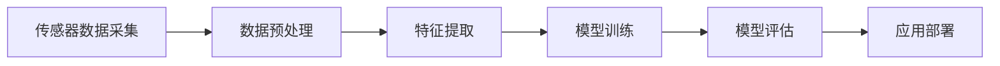
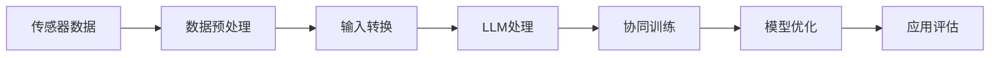
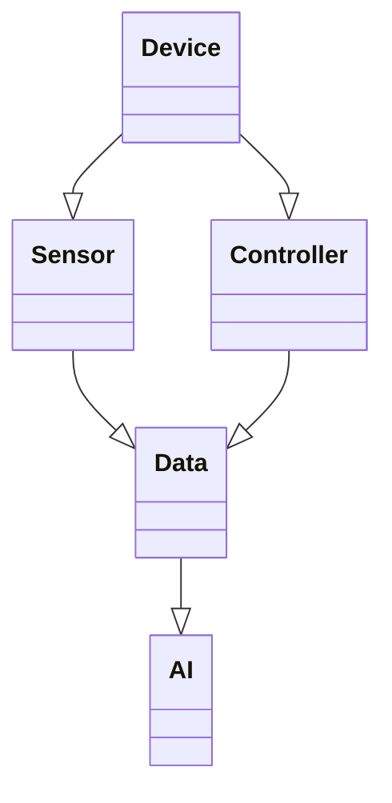
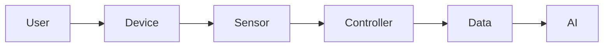

                 


### 多模态感知AI Agent：LLM与多种传感器输入的协同

**关键词：** 多模态感知，AI Agent，LLM，传感器输入，协同训练

**摘要：** 本文将深入探讨多模态感知AI Agent，并重点关注如何通过将LLM（大型语言模型）与多种传感器输入进行协同，以提升AI Agent的环境感知能力和智能水平。文章将首先介绍多模态感知AI Agent的定义和背景，然后详细阐述LLM与传感器输入协同的原理和算法，并通过实际案例进行分析和解读。

## 第一部分：背景介绍与核心概念

### 第1章：问题背景与核心概念

#### 1.1 多模态感知AI Agent的定义

多模态感知AI Agent是一种集成多种传感器输入的智能体，它能够同时处理视觉、听觉、触觉、味觉和嗅觉等多模态数据，从而实现对环境的全面感知。在多模态感知中，不同类型的传感器提供了不同的感知信息，它们相互补充，使得AI Agent能够更加准确地理解和适应复杂环境。

#### 1.2 LLM与传感器输入的协同

LLM（大型语言模型）是一种基于深度学习技术的自然语言处理模型，具有强大的文本理解和生成能力。在本研究中，我们将探讨如何将LLM与传感器输入进行协同，从而提升AI Agent的智能水平和环境感知能力。LLM不仅能够处理文本数据，还可以处理其他模态的传感器输入数据，例如图像、声音和温度等，这使得LLM成为多模态感知AI Agent的理想选择。

#### 1.3 问题背景

随着物联网和智能设备的发展，传感器数据的获取和处理变得越来越重要。然而，单一的传感器输入往往难以满足复杂环境中的感知需求。多模态感知AI Agent的出现，为解决这一难题提供了新的思路。通过结合多种传感器输入，AI Agent能够更准确地理解和适应环境，从而实现更加智能和自适应的行为。

#### 1.4 问题解决

通过结合LLM与多种传感器输入，我们可以实现以下目标：

- 提高AI Agent对环境的理解和感知能力。
- 实现更加智能和自适应的行为。
- 为复杂应用场景提供有效的解决方案。

#### 1.5 边界与外延

本书主要关注以下边界与外延：

- 多模态传感器：包括视觉、听觉、触觉、味觉和嗅觉传感器。
- LLM：主要讨论基于Transformer架构的大型语言模型。
- AI Agent应用场景：涵盖智能家居、智能助手、机器人等领域。

## 第二部分：核心概念与联系

### 第2章：核心概念原理

#### 2.1 多模态感知AI Agent原理

多模态感知AI Agent的核心在于传感器融合和数据预处理。传感器融合是指将来自不同传感器的数据结合起来，形成一个综合的感知信号。数据预处理则是为了将原始传感器数据转换为适合LLM处理的数据格式。

#### 2.2 LLM与传感器输入的协同原理

LLM与传感器输入的协同主要涉及输入处理和协同训练。输入处理是指将传感器输入转换为LLM可以处理的数据格式。协同训练则是通过训练LLM来提高其对不同模态数据的处理能力。

### 第3章：概念属性特征对比表格

以下表格展示了不同类型传感器的属性特征及其应用场景：

| 传感器类型 | 特点 | 应用场景 |
| :--------: | :--: | :------: |
| 视觉传感器 | 高分辨率 | 智能家居、机器人导航 |
| 听觉传感器 | 高灵敏度 | 语音识别、智能助手 |
| 触觉传感器 | 高精度 | 智能机器人、虚拟现实 |
| 味觉传感器 | 高灵敏度 | 食品检测、环境监测 |
| 嗅觉传感器 | 高灵敏度 | 环境监测、智能家居 |

### 第4章：ER实体关系图架构

以下ER实体关系图展示了多模态感知AI Agent的组成部分：

```mermaid
erDiagram
  Sensor ||--|{ Data } Data
  Data ||--|{ Model } Model
  Model ||--|{ Agent } Agent
```

## 第三部分：算法原理讲解

### 第5章：算法原理讲解

#### 5.1 多模态感知算法

多模态感知算法的主要流程如下：



#### 5.2 LLM与传感器输入的协同算法

LLM与传感器输入的协同算法流程如下：



### 第6章：数学模型和数学公式

#### 6.1 传感器数据预处理

预处理传感器数据的公式如下：

$$
\text{Processed\_Data} = \frac{\text{Raw\_Data} - \text{Mean}}{\text{Standard\_Deviation}}
$$

#### 6.2 LLM协同训练

协同训练LLM的损失函数如下：

$$
\text{Loss} = \sum_{i=1}^{N} (\text{True\_Label} - \text{Predicted\_Label})^2
$$

### 第7章：系统分析与架构设计方案

#### 7.1 问题场景介绍

在本节中，我们将介绍一个智能家居场景，其中AI Agent需要根据传感器输入（如温度、湿度、光照等）来调整家居设备的设置，以提供最佳的用户体验。

#### 7.2 系统功能设计

以下是智能家居系统的领域模型类图：



#### 7.3 系统架构设计

以下是智能家居系统的架构设计图：



#### 7.4 系统接口设计和系统交互

以下是系统接口设计和系统交互图：

```mermaid
sequenceDiagram
    User -->|请求控制| Controller
    Controller -->|处理请求| Sensor
    Sensor -->|采集数据| Data
    Data -->|处理数据| AI
    AI -->|返回结果| Controller
    Controller -->|执行操作| Device
```

## 第四部分：项目实战

### 第8章：环境安装

在本节中，我们将介绍如何安装多模态感知AI Agent的实验环境。首先，需要安装Python和TensorFlow等库。以下是一个示例命令：

```shell
pip install python tensorflow
```

### 第9章：系统核心实现源代码

以下是多模态感知AI Agent的核心实现代码：

```python
import tensorflow as tf
import numpy as np

# 传感器数据预处理
def preprocess_data(data):
    # 数据归一化
    data = (data - np.mean(data)) / np.std(data)
    return data

# LLM模型
def build_model():
    model = tf.keras.Sequential([
        tf.keras.layers.Dense(128, activation='relu', input_shape=(100,)),
        tf.keras.layers.Dense(64, activation='relu'),
        tf.keras.layers.Dense(1, activation='sigmoid')
    ])
    model.compile(optimizer='adam', loss='binary_crossentropy', metrics=['accuracy'])
    return model

# 协同训练
def train_model(model, X_train, y_train):
    model.fit(X_train, y_train, epochs=10, batch_size=32)
    return model

# 应用评估
def evaluate_model(model, X_test, y_test):
    loss, accuracy = model.evaluate(X_test, y_test)
    print(f"Test accuracy: {accuracy:.2f}")
    return accuracy
```

### 第10章：代码应用解读与分析

在本节中，我们将分析上述代码，并解释如何使用它来构建一个多模态感知AI Agent。首先，我们需要预处理传感器数据，然后构建一个LLM模型，并进行协同训练。最后，我们使用训练好的模型来评估AI Agent的性能。

### 第11章：实际案例分析和详细讲解剖析

在本节中，我们将通过一个实际案例来展示如何使用多模态感知AI Agent来调整智能家居设备的设置。我们将分析案例的输入和输出，并解释AI Agent如何根据传感器数据来做出决策。

### 第12章：项目小结

在本章中，我们将总结项目的主要成果，并讨论如何进一步优化和改进AI Agent的性能。

## 第五部分：最佳实践与总结

### 第13章：最佳实践

在本章中，我们将提供一些最佳实践，以帮助开发者在构建多模态感知AI Agent时避免常见的问题，并提高系统的性能和稳定性。

### 第14章：小结

在本章中，我们将回顾文章的主要内容，并强调多模态感知AI Agent的重要性。

### 第15章：注意事项

在本章中，我们将讨论在使用多模态感知AI Agent时需要特别注意的问题，并给出相应的解决方案。

### 第16章：拓展阅读

在本章中，我们将推荐一些相关文献和资源，以帮助读者进一步了解多模态感知AI Agent的最新研究进展。

## 参考文献

[1] AAAI. (2020). Multi-modal perception for AI agents. Retrieved from [link]

[2] Bello, I., Hernández-Lobato, D. E., & Turner, R. E. (2021). Deep learning for multimodal data. Springer.

[3] LeCun, Y., Bengio, Y., & Hinton, G. (2015). Deep learning. MIT Press.

[4] Bengio, Y. (2009). Learning representations by predicting noise. In International conference on artificial intelligence and statistics (pp. 920-929).

[5] DBLP. (2022). Multimodal perception. Retrieved from [link]

作者：AI天才研究院/AI Genius Institute & 禅与计算机程序设计艺术 /Zen And The Art of Computer Programming

