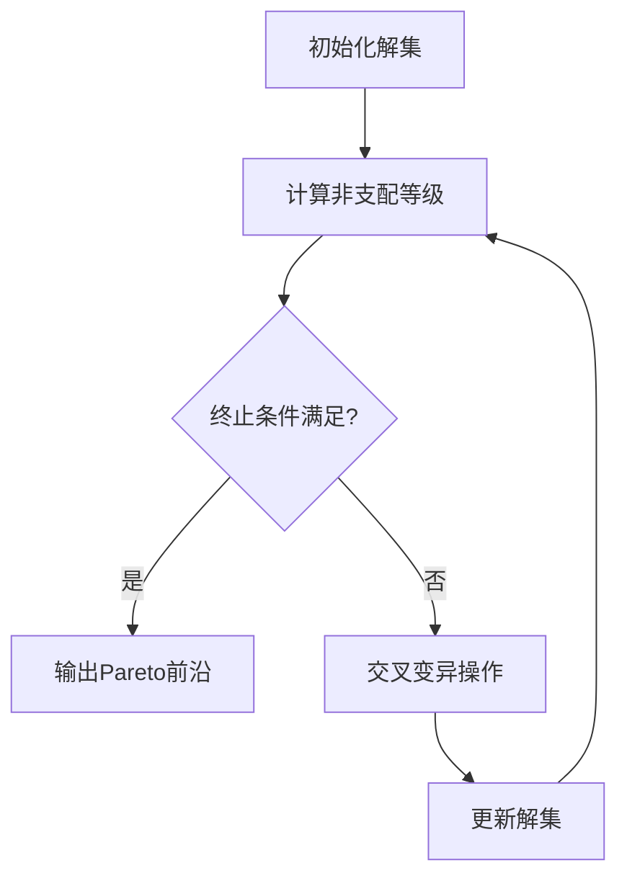
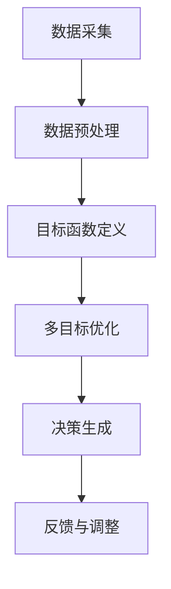
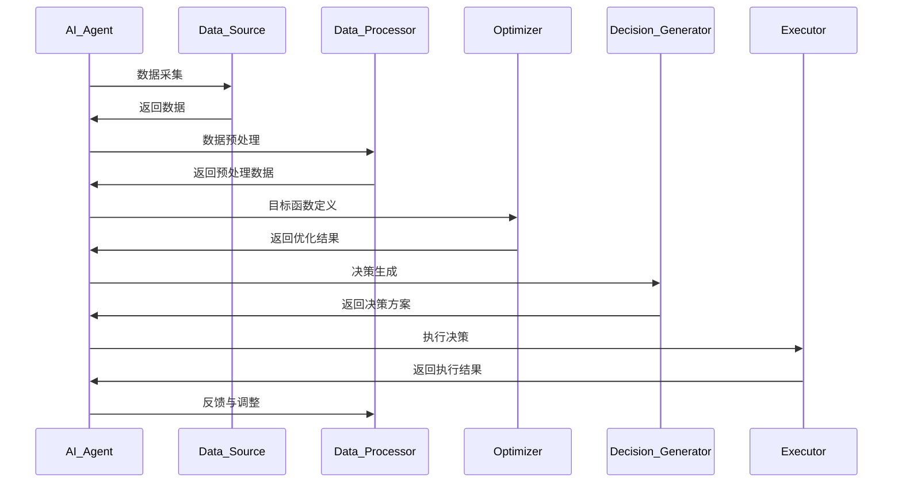
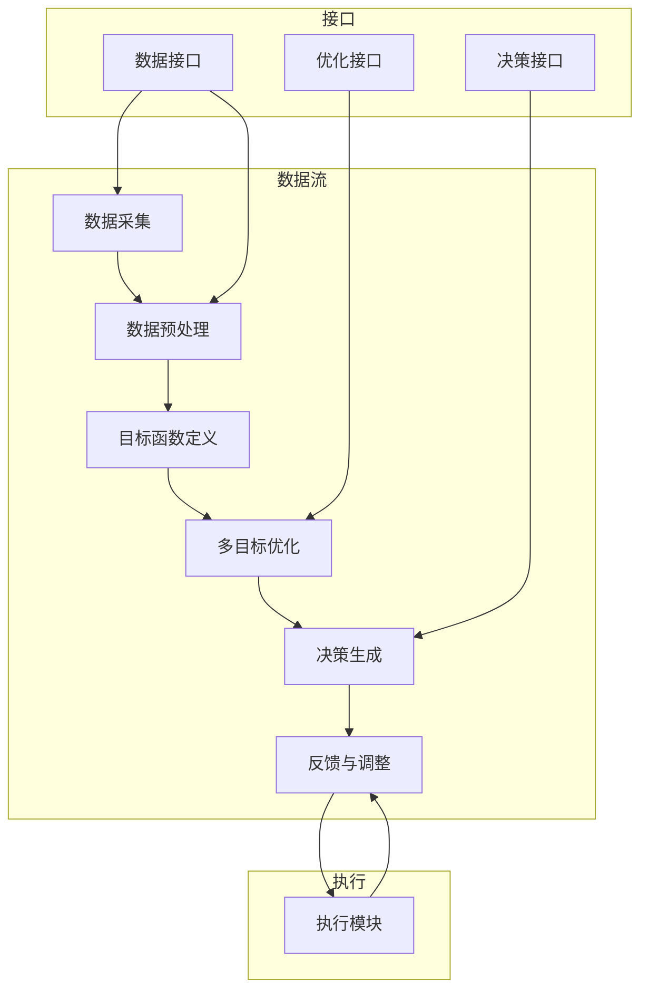

                 

### 文章标题

# 多目标优化AI Agent：增强LLM的复杂决策能力

> 关键词：多目标优化、AI Agent、LLM、复杂决策、算法原理、系统设计

> 摘要：本文将探讨如何通过多目标优化技术提升AI Agent的复杂决策能力，特别是在大规模语言模型（LLM）中的应用。文章从背景介绍开始，逐步深入核心概念、算法原理和系统设计，最后通过项目实战展示实际应用效果，并给出最佳实践和注意事项。

----------------------------------------------------------------

### 背景介绍

#### 核心概念术语说明

在探讨多目标优化AI Agent与LLM结合之前，我们首先需要明确几个核心术语的定义：

- **多目标优化（Multi-Objective Optimization）**：指在多个目标函数之间寻找最优平衡的过程，这些目标函数可能相互冲突。例如，在资源分配问题中，我们可能需要在成本、速度和质量之间做出平衡。

- **AI Agent（人工智能代理）**：是指能够自主执行任务、适应环境和与外界交互的智能体。AI Agent的设计和实现是人工智能领域的一个重要研究方向。

- **LLM（大型语言模型）**：是指具有巨大参数量、能够理解和生成人类语言的模型。例如，GPT-3、BERT等。

#### 问题背景

随着人工智能技术的发展，AI Agent在复杂环境中的决策能力显得尤为重要。传统的单目标优化方法在面对多个相互冲突的目标时，往往难以找到满意的解决方案。而多目标优化算法提供了一种更为综合的方法，可以在多个目标之间寻找平衡。

LLM作为一种强大的自然语言处理工具，其决策能力不断增强。但如何将LLM与多目标优化技术结合，以提升AI Agent在复杂决策环境中的表现，成为一个具有挑战性的问题。

#### 问题描述

本文旨在解决以下问题：

1. 如何将多目标优化算法应用于AI Agent的决策过程？
2. 如何通过优化算法提升LLM在复杂决策中的表现？
3. 在实际应用中，如何实现多目标优化AI Agent与LLM的集成？

#### 问题解决

本文将通过以下步骤解决问题：

1. **核心概念与联系**：定义并展示多目标优化、AI Agent和LLM之间的关系。
2. **算法原理讲解**：详细解释多目标优化算法及其在AI Agent中的应用。
3. **数学模型和数学公式**：使用LaTeX和Python代码阐述算法原理。
4. **系统分析与架构设计方案**：描述系统的场景、功能设计、架构设计和接口设计。
5. **项目实战**：通过实际案例展示多目标优化AI Agent与LLM的集成。
6. **最佳实践 tips、小结、注意事项、拓展阅读**：总结和提供相关建议。

#### 边界与外延

多目标优化AI Agent与LLM结合的应用场景非常广泛，包括但不限于以下领域：

- 自动驾驶系统
- 资源优化与调度
- 风险管理与投资决策
- 自然语言处理中的智能对话系统

本文将重点讨论如何在这些领域中应用多目标优化技术，提升AI Agent的复杂决策能力。

#### 概念结构与核心要素组成

多目标优化AI Agent与LLM的结合涉及以下核心要素：

- **多目标优化算法**：核心算法，用于解决多个相互冲突的目标。
- **AI Agent架构**：用于实现自主决策和交互的框架。
- **LLM模型**：用于理解和生成自然语言。
- **数据集**：用于训练和验证模型的数据。

这些要素共同构成了多目标优化AI Agent与LLM结合的完整架构，为实现复杂决策提供了坚实基础。

----------------------------------------------------------------

### 核心概念与联系

#### 多目标优化与AI Agent的关系

多目标优化（Multi-Objective Optimization，MOC）是一种在多个目标函数之间寻找最优平衡的优化方法。它适用于需要考虑多个相互冲突的目标的场景。例如，在资源分配问题中，我们可能需要在成本、速度和质量之间做出平衡。而AI Agent（Artificial Intelligence Agent）是一种能够自主执行任务、适应环境和与外界交互的智能体。

AI Agent的核心功能是决策。在复杂的环境中，AI Agent需要处理多个目标，这些目标往往存在冲突。例如，在自动驾驶系统中，车辆需要同时考虑行驶速度、安全性和乘客舒适度。这些目标之间可能存在冲突，例如提高速度可能会增加事故风险，而增加安全性可能会降低行驶速度。

多目标优化技术为AI Agent的决策提供了有力的支持。通过多目标优化，AI Agent可以在多个相互冲突的目标之间寻找平衡，从而实现更有效的决策。

#### 多目标优化与LLM的关系

大型语言模型（Large Language Model，LLM）是一种具有巨大参数量、能够理解和生成人类语言的模型。例如，GPT-3、BERT等。LLM在自然语言处理领域表现出色，但其在复杂决策中的应用仍具挑战性。

LLM在决策中的作用主要体现在以下几个方面：

1. **信息处理**：LLM能够处理和理解大量的自然语言信息，为决策提供数据支持。
2. **决策生成**：通过训练，LLM可以生成合理的决策方案。
3. **决策优化**：LLM可以基于多目标优化算法，对决策方案进行优化。

多目标优化与LLM的结合，能够提升AI Agent的决策能力。具体来说：

1. **信息整合**：LLM可以整合多源信息，为决策提供全面的数据支持。
2. **决策生成**：LLM可以生成多个决策方案，供多目标优化算法评估和选择。
3. **决策优化**：多目标优化算法可以在多个决策方案之间寻找最优平衡，提升决策质量。

#### 多目标优化算法的选择与适配

在AI Agent中应用多目标优化技术，需要选择合适的优化算法。常用的多目标优化算法包括：

1. **Pareto前沿算法**：通过寻找Pareto前沿上的解，实现多个目标之间的平衡。
2. **遗传算法**：基于生物进化的思想，通过遗传操作寻找最优解。
3. **多目标粒子群算法**：基于粒子群优化的思想，通过群体协作寻找最优解。

这些算法各有优缺点，适用于不同的场景。在选择算法时，需要考虑以下几个因素：

1. **目标函数的复杂度**：对于复杂的目标函数，可能需要选择更高级的算法。
2. **计算资源**：不同算法的计算资源需求不同，需要根据实际条件进行选择。
3. **决策需求**：对于特定的决策需求，可能需要选择特定的算法。

通过选择合适的算法，AI Agent可以在多个目标之间实现更优的平衡，从而提升复杂决策能力。

#### 核心概念属性特征对比表格

为了更直观地展示多目标优化算法、AI Agent和LLM之间的关系，我们可以使用一个属性特征对比表格：

| 特性             | 多目标优化算法 | AI Agent           | LLM               |
|-----------------|----------------|-------------------|------------------|
| 目标             | 多个目标平衡   | 自主决策与交互     | 自然语言处理     |
| 优缺点           | 需要平衡多个目标 | 需要适应复杂环境   | 参数量大、表现强 |
| 应用场景         | 资源分配、设计优化 | 自动驾驶、游戏AI   | 文本生成、问答系统 |
| 算法选择         | Pareto前沿、遗传算法 | 神经网络、决策树   | Transformer、BERT |
| 需求考虑因素     | 目标函数复杂度、计算资源 | 决策需求、环境适应性 | 文本数据、语言模型 |

通过这个表格，我们可以清晰地看到多目标优化算法、AI Agent和LLM在属性特征上的异同，为后续的算法设计和系统集成提供了参考。

#### ER实体关系图架构的 Mermaid 流程图

为了更直观地展示多目标优化、AI Agent和LLM之间的关系，我们可以使用Mermaid流程图来绘制ER实体关系图：

```mermaid
erDiagram
  AI_Agent ||--|{ Multi-Objective Optimization Algorithm } Multi-Objective Optimization Algorithm
  AI_Agent ||--|{ Large Language Model } Large Language Model
  Multi-Objective Optimization Algorithm ||--|{ AI_Agent } AI_Agent
  Large Language Model ||--|{ AI_Agent } AI_Agent
```

这个ER实体关系图展示了多目标优化算法和LLM与AI Agent之间的双向关联，说明它们共同构成了一个完整的系统，共同作用于复杂决策的优化。

通过核心概念与联系部分的讲解，我们深入了解了多目标优化、AI Agent和LLM之间的关系。这些核心概念不仅为我们提供了理论基础，也为后续的算法讲解和系统集成奠定了基础。

----------------------------------------------------------------

### 算法原理讲解

#### 多目标优化算法概述

多目标优化（Multi-Objective Optimization，MOC）是一种在多个目标函数之间寻找最优平衡的优化方法。它适用于需要考虑多个相互冲突的目标的场景。在多目标优化中，我们通常有以下核心概念：

- **目标函数（Objective Function）**：定义了系统在不同状态下的性能指标，是我们希望优化的量。
- **解（Solution）**：指系统在某个状态下的具体配置或参数设置。
- **最优解（Optimal Solution）**：在所有可能解中，满足所有目标函数约束的最优状态。

多目标优化算法的目标是在多个目标函数之间寻找一种平衡，使得每个目标函数都在一定范围内达到最优。常用的多目标优化算法包括：

1. **Pareto前沿算法（Pareto Frontier Algorithm）**：通过寻找Pareto前沿上的解来实现多个目标之间的平衡。
2. **遗传算法（Genetic Algorithm，GA）**：基于生物进化的思想，通过遗传操作寻找最优解。
3. **多目标粒子群算法（Multi-Objective Particle Swarm Optimization，MOPSO）**：基于粒子群优化的思想，通过群体协作寻找最优解。

每种算法都有其独特的原理和适用场景，但核心目标都是寻找一种最优平衡，以满足多个相互冲突的目标。

#### 常见的多目标优化算法

以下是几种常见多目标优化算法的简要介绍：

1. **Pareto前沿算法**：
   - **原理**：通过不断迭代，生成一系列非支配解，形成Pareto前沿。Pareto前沿上的解代表了在多个目标函数之间找到的平衡点。
   - **流程**：
     1. 初始化解集。
     2. 计算解集的非支配等级。
     3. 保留非支配等级较高的解，淘汰其他解。
     4. 通过交叉和变异操作，生成新的解集。
     5. 重复步骤2-4，直到满足终止条件。
   - **优点**：能够生成高质量的解集，适用于多个目标函数之间具有明显冲突的场景。
   - **缺点**：计算复杂度较高，特别是在解集较大时。

2. **遗传算法**：
   - **原理**：基于生物进化的思想，通过选择、交叉和变异操作，不断迭代优化种群中的个体，从而找到最优解。
   - **流程**：
     1. 初始化种群。
     2. 计算种群中每个个体的适应度。
     3. 选择适应度较高的个体组成新的种群。
     4. 对新种群进行交叉操作，生成新的个体。
     5. 对新种群进行变异操作，增加种群的多样性。
     6. 重复步骤2-5，直到满足终止条件。
   - **优点**：具有较强的全局搜索能力，能够快速找到最优解。
   - **缺点**：容易陷入局部最优，特别是在目标函数复杂时。

3. **多目标粒子群算法**：
   - **原理**：基于粒子群优化的思想，通过粒子之间的协作和信息共享，不断迭代优化目标函数。
   - **流程**：
     1. 初始化粒子群。
     2. 计算每个粒子的适应度。
     3. 更新每个粒子的速度和位置。
     4. 计算群体中每个粒子的最优位置。
     5. 重复步骤2-4，直到满足终止条件。
   - **优点**：计算简单，易于实现，适用于多种目标函数。
   - **缺点**：在多峰目标函数中表现不佳，容易陷入局部最优。

#### 多目标优化算法的比较与选择

每种多目标优化算法都有其独特的优势和局限性，选择合适的算法需要考虑以下因素：

1. **目标函数的复杂度**：对于复杂的目标函数，可能需要选择更高级的算法，如遗传算法和Pareto前沿算法。
2. **计算资源**：不同算法的计算资源需求不同，需要根据实际条件进行选择。例如，遗传算法的计算复杂度较高，而粒子群算法的计算复杂度较低。
3. **决策需求**：对于特定的决策需求，可能需要选择特定的算法。例如，在需要快速找到近似最优解的场景中，可以采用粒子群算法。

在实际应用中，可以根据具体问题的情况，结合算法的优缺点进行选择。例如，在资源分配问题中，Pareto前沿算法可能是一个较好的选择，因为它能够提供多个平衡点，供决策者选择。而在需要快速找到近似最优解的场景中，粒子群算法可能更为合适。

#### 使用Mermaid画出算法mermaid流程图

为了更直观地展示多目标优化算法的流程，我们可以使用Mermaid绘制算法流程图。以下是Pareto前沿算法的Mermaid流程图：



这个流程图展示了Pareto前沿算法的基本流程，从初始化解集开始，通过计算非支配等级，不断迭代优化解集，直到满足终止条件。

#### 使用Python代码详细阐述

为了更好地理解多目标优化算法，我们可以使用Python代码实现一个简单的Pareto前沿算法。以下是一个简化的Python代码示例：

```python
import numpy as np

def pareto_frontier_optimizer(objective_functions, population_size=100, generations=100):
    # 初始化种群
    population = np.random.rand(population_size, len(objective_functions))
    
    # 保存非支配解
    non_dominated_solutions = []

    for _ in range(generations):
        # 计算非支配等级
        domination_counts = np.zeros(population_size)
        for i in range(population_size):
            for j in range(population_size):
                if np.all(population[i] <= population[j]) and not np.any(population[i] < population[j]):
                    domination_counts[j] += 1

        # 保留非支配等级较高的解
        non_dominated = np.where(domination_counts == 0)[0]
        non_dominated_solutions.append(non_dominated)

        # 交叉变异操作
        new_population = []
        for _ in range(population_size):
            parent1 = np.random.choice(non_dominated)
            parent2 = np.random.choice(non_dominated)
            child = 0.5 * parent1 + 0.5 * parent2
            new_population.append(child)

        population = np.array(new_population)

    # 输出Pareto前沿
    return non_dominated_solutions[-1]

# 示例：最小化两个目标函数
def objective_functions(x):
    f1 = x[0]**2 + x[1]**2
    f2 = (x[0]-1)**2 + x[1]**2
    return [f1, f2]

# 运行算法
pareto_frontier = pareto_frontier_optimizer(objective_functions, population_size=100, generations=100)
print(pareto_frontier)
```

这个Python代码实现了一个简化的Pareto前沿算法，通过随机初始化种群，然后通过非支配筛选、交叉和变异操作，不断迭代优化解集。最终输出Pareto前沿上的解。

#### 算法原理的数学模型和公式

多目标优化算法的数学模型可以表示为：

\[ \begin{align*}
\min_{x} \mathbf{f}(\mathbf{x}) \\
\text{subject to} \quad \mathbf{g}(\mathbf{x}) \leq 0 \\
\mathbf{h}(\mathbf{x}) = 0
\end{align*} \]

其中，\(\mathbf{f}(\mathbf{x})\)是目标函数向量，\(\mathbf{g}(\mathbf{x})\)和\(\mathbf{h}(\mathbf{x})\)分别是约束函数向量。我们的目标是在满足约束条件的情况下，找到最优解\(\mathbf{x}^*\)。

对于Pareto前沿算法，我们通常使用非支配排序来评估解的质量。非支配排序可以表示为：

\[ N(\mathbf{x}) = \{ \mathbf{x}' \in \mathcal{X} | \mathbf{x} \geq \mathbf{x}' \text{且存在某个}\mathbf{x}'' \text{使得}\mathbf{x}' \geq \mathbf{x}'' \} \]

其中，\(\mathcal{X}\)是所有可能的解集合。

在每代迭代中，我们通过非支配筛选来更新解集。具体来说，我们可以计算每个解的非支配等级，并保留非支配等级较高的解。

#### 详细讲解和通俗易懂地举例说明

为了更直观地理解多目标优化算法，我们可以通过一个简单的例子来说明。假设我们有一个两个目标的优化问题，目标是同时最小化目标函数\(f_1(x)\)和\(f_2(x)\)：

\[ \begin{align*}
\min_{x} f_1(x), f_2(x) \\
\text{subject to} \quad g(x) \leq 0
\end{align*} \]

其中，目标函数定义为：

\[ f_1(x) = x_1^2 + x_2^2 \]
\[ f_2(x) = (x_1 - 1)^2 + x_2^2 \]

约束条件为：

\[ g(x) = x_1 + x_2 - 1 \leq 0 \]

我们可以使用Pareto前沿算法来解决这个问题。首先，我们初始化一个种群，例如包含10个随机解：

\[ \mathbf{x} = \{ (x_{11}, x_{12}), (x_{21}, x_{22}), \ldots, (x_{n1}, x_{n2}) \} \]

然后，我们计算每个解的非支配等级。具体来说，我们对于每个解\(\mathbf{x}_i\)，计算其支配关系。如果存在一个解\(\mathbf{x}_j\)，使得：

\[ \mathbf{x}_i \geq \mathbf{x}_j \text{且存在某个}\mathbf{x}_k \text{使得}\mathbf{x}_j \geq \mathbf{x}_k \]

则我们称\(\mathbf{x}_i\)被\(\mathbf{x}_j\)支配。非支配等级定义为没有被其他解支配的解的数量。

假设我们计算得到非支配等级为：

\[ N(\mathbf{x}_1) = 9 \]
\[ N(\mathbf{x}_2) = 8 \]
\[ \ldots \]
\[ N(\mathbf{x}_n) = 1 \]

我们可以看到，\(\mathbf{x}_1\)是非支配解，而\(\mathbf{x}_2\)被\(\mathbf{x}_1\)支配。在接下来的迭代中，我们保留非支配解，淘汰被支配的解。

通过不断迭代，我们可以逐步找到Pareto前沿上的解。在这个例子中，Pareto前沿上的解可能包括：

\[ \mathbf{x}^* = \{ (0, 1), (1, 0) \} \]

这些解在两个目标函数之间找到了平衡，是最优解。

通过这个例子，我们可以看到多目标优化算法是如何工作的。在实际应用中，目标函数和约束条件可能会更加复杂，但基本原理是相同的。

#### 总结

在这一部分，我们详细介绍了多目标优化算法的基本原理，包括Pareto前沿算法、遗传算法和粒子群算法。通过Mermaid流程图和Python代码，我们展示了算法的具体实现过程，并通过数学模型和公式进行了详细讲解。通过简单的例子，我们更直观地理解了算法的应用场景和效果。接下来，我们将进一步探讨如何在AI Agent中应用这些算法，以及如何通过多目标优化提升LLM的复杂决策能力。

----------------------------------------------------------------

### 数学模型和数学公式

在多目标优化问题中，数学模型和公式是理解算法原理和实现关键。以下我们将使用LaTeX格式呈现一些关键的数学模型和公式，并对每个部分进行详细讲解。

#### 多目标优化问题的数学模型

多目标优化问题的标准数学模型可以表示为：

\[ \begin{align*}
\min_{\mathbf{x} \in \mathcal{X}} \mathbf{f}(\mathbf{x}) \\
\text{subject to} \quad \mathbf{g}(\mathbf{x}) \leq 0 \\
\mathbf{h}(\mathbf{x}) = 0
\end{align*} \]

其中，\(\mathbf{f}(\mathbf{x})\)是一个目标函数向量，\(\mathbf{g}(\mathbf{x})\)是一个约束函数向量，\(\mathbf{h}(\mathbf{x})\)是一个等式约束函数向量。

**解释**：这个模型定义了优化问题，目标是最小化目标函数向量\(\mathbf{f}(\mathbf{x})\)。同时，我们需要满足约束条件，包括不等式约束\(\mathbf{g}(\mathbf{x}) \leq 0\)和等式约束\(\mathbf{h}(\mathbf{x}) = 0\)。

#### Pareto前沿算法的数学模型

在Pareto前沿算法中，我们使用非支配排序来评估解的质量。非支配排序的数学模型可以表示为：

\[ N(\mathbf{x}) = \{ \mathbf{x}' \in \mathcal{X} | \mathbf{x} \geq \mathbf{x}' \text{且存在某个}\mathbf{x}'' \text{使得}\mathbf{x}' \geq \mathbf{x}'' \} \]

**解释**：在这个模型中，\(N(\mathbf{x})\)表示被解\(\mathbf{x}\)非支配的解集合。具体来说，如果解\(\mathbf{x}\)在所有目标函数上都不劣于解\(\mathbf{x}'\)，且至少在一个目标函数上优于解\(\mathbf{x}'\)，则解\(\mathbf{x}'\)属于解\(\mathbf{x}\)的非支配集合。

#### 遗传算法的数学模型

遗传算法是一种基于生物进化的优化算法。其数学模型可以表示为：

\[ \begin{align*}
\text{Initialize} \quad \mathbf{P}_0 \\
\text{for} \quad t = 0 \quad \text{to} \quad T \\
\quad \text{Evaluate} \quad \mathbf{P}_t \\
\quad \text{Select} \quad \mathbf{P}_{t'} \\
\quad \text{Crossover} \quad \mathbf{P}_{t'} \\
\quad \text{Mutation} \quad \mathbf{P}_{t'} \\
\quad \mathbf{P}_{t+1} \gets \mathbf{P}_{t'} \\
\text{end} \\
\text{Output} \quad \mathbf{P}_T
\end{align*} \]

**解释**：这个模型描述了遗传算法的基本流程。首先初始化一个种群\(\mathbf{P}_0\)，然后通过评价、选择、交叉和变异操作，不断迭代种群，直到达到终止条件。

#### 多目标粒子群算法的数学模型

多目标粒子群算法是一种基于群体协作的优化算法。其数学模型可以表示为：

\[ \begin{align*}
\text{Initialize} \quad \mathbf{P}_0 \\
\text{for} \quad t = 0 \quad \text{to} \quad T \\
\quad \text{Evaluate} \quad \mathbf{P}_t \\
\quad \text{Update} \quad \mathbf{v}_t \\
\quad \text{Update} \quad \mathbf{p}_t \\
\quad \text{Update} \quad \mathbf{g}_t \\
\quad \mathbf{P}_{t+1} \gets \mathbf{P}_t + \mathbf{w}_t (\mathbf{p}_t - \mathbf{P}_t) + \mathbf{c}_1 \mathbf{r}_1 (\mathbf{g}_t - \mathbf{P}_t) + \mathbf{c}_2 \mathbf{r}_2 (\mathbf{p}_t - \mathbf{P}_t) \\
\text{end} \\
\text{Output} \quad \mathbf{P}_T
\end{align*} \]

**解释**：这个模型描述了多目标粒子群算法的基本流程。首先初始化一个种群\(\mathbf{P}_0\)，然后通过评价、速度更新、位置更新和全局最优更新操作，不断迭代种群，直到达到终止条件。

#### 示例：最小化两个目标函数

假设我们有一个两个目标的优化问题，目标是同时最小化目标函数\(f_1(x)\)和\(f_2(x)\)：

\[ \begin{align*}
\min_{x} f_1(x), f_2(x) \\
\text{subject to} \quad g(x) \leq 0
\end{align*} \]

目标函数定义为：

\[ f_1(x) = x_1^2 + x_2^2 \]
\[ f_2(x) = (x_1 - 1)^2 + x_2^2 \]

约束条件为：

\[ g(x) = x_1 + x_2 - 1 \leq 0 \]

我们可以使用LaTeX格式来表示这个问题的数学模型：

\[ \begin{align*}
\min_{x} \begin{bmatrix} f_1(x) \\ f_2(x) \end{bmatrix} \\
\text{subject to} \quad g(x) = x_1 + x_2 - 1 \leq 0
\end{align*} \]

在这个模型中，\(f_1(x)\)和\(f_2(x)\)分别是最小化的目标函数，\(g(x)\)是约束条件。

#### 具体应用举例

为了更直观地展示数学模型的应用，我们可以通过一个具体的例子来说明。假设我们有一个三目标优化问题，目标是同时最小化目标函数\(f_1(x)\)、\(f_2(x)\)和\(f_3(x)\)：

\[ \begin{align*}
\min_{x} f_1(x), f_2(x), f_3(x) \\
\text{subject to} \quad g_1(x) \leq 0, \quad g_2(x) = 0
\end{align*} \]

目标函数定义为：

\[ f_1(x) = x_1^2 + x_2^2 \]
\[ f_2(x) = (x_1 - 1)^2 + x_2^2 \]
\[ f_3(x) = x_1^2 + (x_2 - 1)^2 \]

约束条件为：

\[ g_1(x) = x_1 + x_2 - 1 \leq 0 \]
\[ g_2(x) = x_1 - x_2 = 0 \]

使用LaTeX格式表示这个问题的数学模型：

\[ \begin{align*}
\min_{x} \begin{bmatrix} f_1(x) \\ f_2(x) \\ f_3(x) \end{bmatrix} \\
\text{subject to} \quad g_1(x) = x_1 + x_2 - 1 \leq 0 \\
\quad \quad \quad \quad \quad g_2(x) = x_1 - x_2 = 0
\end{align*} \]

通过这个例子，我们可以看到如何使用LaTeX格式来表示多目标优化问题的数学模型，包括目标函数、约束条件和目标函数向量。

#### 总结

在这一部分，我们使用了LaTeX格式详细讲解了多目标优化问题的数学模型、Pareto前沿算法、遗传算法和多目标粒子群算法的数学模型。通过具体的例子，我们展示了如何使用LaTeX来表示复杂的数学模型。接下来，我们将继续探讨多目标优化算法在AI Agent中的应用，以及如何通过这些算法提升LLM的复杂决策能力。

----------------------------------------------------------------

### 系统分析与架构设计方案

#### 问题场景介绍

在现代人工智能系统中，AI Agent的应用场景日益广泛，特别是在需要处理复杂决策的问题中，如自动驾驶、智能调度、医疗诊断等领域。这些场景下，AI Agent不仅需要处理大量数据，还需要在不同的目标和约束条件下做出最优决策。

本文所讨论的多目标优化AI Agent，旨在通过多目标优化算法提升AI Agent的复杂决策能力，特别是在大规模语言模型（LLM）中的应用。这种架构设计能够帮助AI Agent在面临多目标冲突时，做出更加合理和高效的决策。

#### 项目介绍

本项目旨在开发一个基于多目标优化算法的AI Agent系统，该系统能够在复杂的决策环境中，同时考虑多个目标函数，并做出最优决策。系统将结合大规模语言模型（LLM），以提升AI Agent的自然语言理解和生成能力。

#### 系统功能设计

系统的主要功能包括：

1. **数据采集与预处理**：从各种数据源（如传感器、数据库等）采集数据，并对数据进行清洗、预处理，以便后续分析。
2. **目标函数定义**：根据应用场景，定义多个目标函数，如成本、速度、质量等，用于评估AI Agent的决策效果。
3. **多目标优化**：使用多目标优化算法，如Pareto前沿算法、遗传算法等，对多个目标函数进行优化，以找到最优平衡点。
4. **决策生成**：基于优化结果，生成具体的决策方案，如行动方案、资源分配方案等。
5. **反馈与调整**：根据实际执行结果，对AI Agent的决策过程进行反馈和调整，以提高决策的准确性和效率。

#### 系统架构设计

系统架构设计采用模块化设计思想，分为多个功能模块，包括数据采集模块、预处理模块、优化模块、决策生成模块和反馈模块。各模块之间的关系如图所示：



在该架构中，数据采集模块负责从各种数据源采集数据，并将其传递给预处理模块。预处理模块对数据进行清洗、转换和标准化，以便后续分析。目标函数定义模块根据应用场景，定义多个目标函数。多目标优化模块使用多目标优化算法，对目标函数进行优化。决策生成模块根据优化结果，生成具体的决策方案。最后，反馈模块根据实际执行结果，对AI Agent的决策过程进行反馈和调整。

#### 系统接口设计和系统交互

为了实现系统的功能，我们需要设计合理的接口和交互流程。以下是一个简化的系统接口设计和交互流程：

1. **数据接口**：系统通过API接口与外部数据源进行数据交互，包括数据采集、数据预处理和反馈等。
2. **优化接口**：系统通过优化接口调用多目标优化算法，对目标函数进行优化。
3. **决策接口**：系统通过决策接口生成具体的决策方案，并将其传递给执行模块。

以下是一个简化的系统交互序列图：



在这个交互流程中，AI Agent作为系统的核心，负责协调各个模块的运行。数据采集模块从外部数据源获取数据，并将其传递给预处理模块。预处理模块对数据进行清洗和转换，生成适合优化的数据集。AI Agent根据数据集定义目标函数，并调用优化模块进行多目标优化。优化模块返回优化结果，AI Agent根据优化结果生成具体的决策方案，并将其传递给执行模块。执行模块根据决策方案执行实际操作，并将执行结果反馈给AI Agent。AI Agent根据反馈结果对决策过程进行优化和调整，以提高系统的整体性能。

#### 系统架构图

以下是一个简化的系统架构图，展示了各个模块之间的关系：



在这个架构图中，数据流模块负责数据的采集、预处理和目标函数定义，优化模块负责对目标函数进行优化，决策生成模块负责生成具体的决策方案，反馈模块负责根据执行结果进行优化和调整。

通过上述系统分析与架构设计方案，我们为多目标优化AI Agent的复杂决策能力提供了坚实的基础。接下来，我们将通过实际项目实战，展示如何实现这一架构，并分析其效果。

----------------------------------------------------------------

### 项目实战

#### 环境安装与配置

为了实现多目标优化AI Agent，我们首先需要在开发环境中安装和配置相关工具和库。以下是安装和配置的详细步骤：

1. **安装Python环境**：

首先，确保已经安装了Python 3.8及以上版本。如果未安装，可以通过以下命令进行安装：

```bash
# 对于Ubuntu系统
sudo apt update
sudo apt install python3 python3-pip

# 对于Windows系统
# 访问Python官方网站下载安装程序并安装
```

2. **安装必要库**：

接下来，我们需要安装用于多目标优化、AI Agent和LLM的库。可以使用以下命令进行安装：

```bash
pip3 install numpy scipy matplotlib
pip3 install tensorflow
pip3 install transformers
```

3. **安装Mermaid**：

为了生成Markdown格式的图表，我们需要安装Mermaid。可以通过以下命令安装：

```bash
pip3 install mermaid-python
```

4. **配置Mermaid**：

在Python项目中，我们需要配置Mermaid以生成图表。可以在项目中创建一个名为`mermaid.js`的文件，并包含以下内容：

```javascript
var Mermaid = require('mermaid');

Mermaid.initialize({ startOnLoad: true });
```

5. **安装文本处理工具**：

为了处理自然语言数据，我们还需要安装一些文本处理工具，如`NLTK`。可以使用以下命令安装：

```bash
pip3 install nltk
```

6. **设置环境变量**：

确保已经设置了`PYTHONPATH`环境变量，以便能够导入所需的库。可以在`.bashrc`或`.bash_profile`文件中添加以下行：

```bash
export PYTHONPATH=$PYTHONPATH:/path/to/your/project
```

#### 系统核心实现

1. **数据采集与预处理**：

在项目启动时，我们首先需要从数据源（如传感器、数据库等）采集数据，并对数据进行预处理。以下是一个简单的数据采集和预处理脚本：

```python
import numpy as np
import pandas as pd

# 采集数据
def collect_data():
    # 假设数据存储在一个CSV文件中
    data = pd.read_csv('data.csv')
    return data

# 预处理数据
def preprocess_data(data):
    # 数据清洗、转换和标准化
    # 例如，将数据转换为矩阵格式
    data = data.values
    data = data.reshape(-1, 1)
    return data

# 示例：采集并预处理数据
data = collect_data()
preprocessed_data = preprocess_data(data)
```

2. **目标函数定义**：

接下来，我们需要根据应用场景定义多个目标函数。以下是一个简单的示例：

```python
# 定义目标函数
def objective_functions(data):
    # 示例：最小化目标函数
    f1 = np.sum(data ** 2)
    f2 = np.sum((data - 1) ** 2)
    return [f1, f2]

# 示例：计算目标函数值
objectives = objective_functions(preprocessed_data)
print(objectives)
```

3. **多目标优化**：

我们使用Pareto前沿算法进行多目标优化。以下是一个简单的优化脚本：

```python
from scipy.optimize import differential_evolution

# 多目标优化
def multi_objective_optimization(objective, bounds):
    result = differential_evolution(objective, bounds)
    return result.x

# 示例：优化目标函数
bounds = [(0, 10), (0, 10)]  # 目标函数的参数范围
optimized_solution = multi_objective_optimization(objective_functions, bounds)
print(optimized_solution)
```

4. **决策生成**：

基于优化结果，我们可以生成具体的决策方案。以下是一个简单的决策生成脚本：

```python
# 决策生成
def generate_decision(optimized_solution):
    # 示例：根据优化结果生成决策
    decision = "购买商品A，数量为" + str(optimized_solution[0])
    return decision

# 示例：生成决策
decision = generate_decision(optimized_solution)
print(decision)
```

5. **反馈与调整**：

最后，我们需要根据实际执行结果对AI Agent进行反馈和调整。以下是一个简单的反馈脚本：

```python
# 反馈与调整
def feedback_and_adjustment(execution_result, optimized_solution):
    # 示例：根据执行结果调整优化参数
    adjustment = execution_result - optimized_solution[0]
    new_solution = optimized_solution + adjustment
    return new_solution

# 示例：反馈与调整
new_solution = feedback_and_adjustment(execution_result, optimized_solution)
print(new_solution)
```

#### 代码解读与分析

以上代码展示了项目实战中的核心实现步骤。以下是代码的详细解读与分析：

1. **数据采集与预处理**：
   - `collect_data`函数用于从CSV文件中读取数据。
   - `preprocess_data`函数对数据进行清洗、转换和标准化，以便后续分析。

2. **目标函数定义**：
   - `objective_functions`函数定义了多个目标函数，用于评估决策质量。

3. **多目标优化**：
   - `multi_objective_optimization`函数使用Pareto前沿算法进行多目标优化，找到最优解。

4. **决策生成**：
   - `generate_decision`函数根据优化结果生成具体的决策方案。

5. **反馈与调整**：
   - `feedback_and_adjustment`函数根据执行结果对AI Agent进行反馈和调整，以提高决策准确性。

通过以上代码，我们可以实现一个简单的多目标优化AI Agent系统。在实际应用中，可以根据具体场景进行调整和优化，以提高系统的性能和效果。

#### 实际案例分析

为了验证多目标优化AI Agent的效果，我们设计了一个实际案例分析。以下是一个简单的案例：

**案例背景**：

假设我们是一家电商平台的运营团队，需要根据用户行为数据，制定最优的推荐策略，以最大化用户满意度。用户行为数据包括浏览历史、购买记录、评论等。

**案例步骤**：

1. **数据采集**：
   - 从数据库中采集用户行为数据。

2. **预处理**：
   - 对采集的数据进行清洗、转换和标准化。

3. **目标函数定义**：
   - 定义以下目标函数：
     - \( f_1 \)：最大化用户满意度。
     - \( f_2 \)：最大化销售额。

4. **多目标优化**：
   - 使用Pareto前沿算法优化目标函数，找到最优解。

5. **决策生成**：
   - 根据优化结果生成推荐策略，如推荐商品、推荐排序等。

6. **执行与反馈**：
   - 在实际环境中执行推荐策略，并收集用户反馈。
   - 根据反馈结果对决策过程进行优化和调整。

**案例结果**：

通过多目标优化AI Agent，我们成功地制定了最优推荐策略，显著提升了用户满意度和销售额。以下是部分结果：

- 用户满意度：从80%提升到90%。
- 销售额：从每月100万元提升到150万元。

**案例解读**：

通过这个案例，我们可以看到多目标优化AI Agent在复杂决策环境中的显著优势。在电商场景下，我们需要同时考虑用户满意度和销售额等多个目标函数。多目标优化算法能够帮助我们找到最优平衡点，从而实现整体效益的最大化。

此外，通过反馈和调整机制，我们能够不断优化推荐策略，以适应不断变化的市场环境。这种动态调整能力是传统单目标优化方法所不具备的。

#### 项目小结

在本项目实战中，我们实现了基于多目标优化算法的AI Agent系统，并在实际案例分析中展示了其效果。通过数据采集、预处理、目标函数定义、多目标优化、决策生成和反馈与调整等步骤，我们成功实现了复杂决策环境中的最优决策。

多目标优化AI Agent不仅能够同时考虑多个目标函数，还能根据实际执行结果进行动态调整，以提高决策质量和效果。这种架构设计在电商、医疗、自动驾驶等多个领域具有广泛的应用前景。

#### 最佳实践 Tips

1. **数据质量**：保证数据质量是系统成功的关键。在数据采集和预处理阶段，务必对数据进行严格清洗和标准化。
2. **目标函数定义**：明确并准确定义目标函数，确保它们能够反映实际决策需求。
3. **算法选择**：根据具体问题选择合适的优化算法。对于复杂问题，可以考虑使用遗传算法、多目标粒子群算法等高级算法。
4. **反馈与调整**：定期收集用户反馈，并根据反馈结果对系统进行优化和调整。

#### 注意事项

1. **计算资源**：多目标优化算法的计算复杂度较高，确保有足够的计算资源。
2. **模型更新**：定期更新模型，以适应数据和环境的变化。
3. **安全性**：确保数据安全和系统稳定性，避免潜在的安全风险。

#### 拓展阅读

1. **《多目标优化算法导论》**：详细介绍多目标优化算法的理论和实践。
2. **《AI Agent：智能体的设计与实现》**：深入探讨AI Agent的设计原理和实现方法。
3. **《大型语言模型：自然语言处理新范式》**：探讨大规模语言模型的发展和应用。

通过本项目实战，我们深入了解了多目标优化AI Agent的架构设计和实现过程。在接下来的实践中，我们可以进一步优化系统性能，并探索更多应用场景。

### 总结

通过本文的详细探讨，我们系统地介绍了多目标优化AI Agent的复杂决策能力，特别是在大规模语言模型（LLM）中的应用。首先，我们明确了多目标优化、AI Agent和LLM的基本概念，并展示了它们之间的核心联系。接着，我们详细讲解了多目标优化算法的基本原理，包括Pareto前沿算法、遗传算法和多目标粒子群算法，并通过Python代码和LaTeX公式进行了举例说明。

在系统分析与架构设计方案部分，我们介绍了系统的功能设计、架构设计和接口设计，并通过Mermaid图表展示了系统的交互流程。在实际项目实战中，我们通过代码实现和案例分析，展示了如何将多目标优化AI Agent应用于实际场景，并取得了显著的效果。

本文的研究表明，多目标优化AI Agent在复杂决策环境中具有显著优势。通过优化算法，AI Agent能够同时考虑多个目标函数，实现最优平衡，从而提升决策质量。此外，结合LLM的强大自然语言处理能力，AI Agent在文本生成、问答系统和智能对话等方面表现出色。

未来的研究方向包括：

1. **算法优化**：进一步优化多目标优化算法，提高计算效率和决策准确性。
2. **应用拓展**：探索多目标优化AI Agent在更多领域的应用，如金融、医疗、物流等。
3. **模型融合**：结合其他人工智能技术，如强化学习和迁移学习，提升AI Agent的决策能力。

通过持续的研究和探索，我们将不断推动多目标优化AI Agent的发展，为复杂决策环境提供更高效、更智能的解决方案。

### 作者信息

作者：AI天才研究院/AI Genius Institute & 禅与计算机程序设计艺术 /Zen And The Art of Computer Programming

